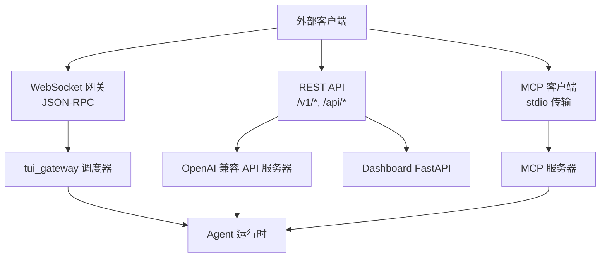
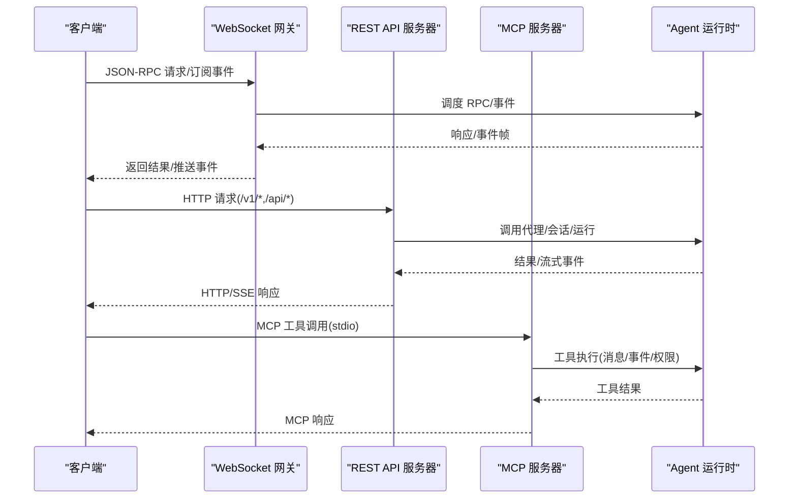
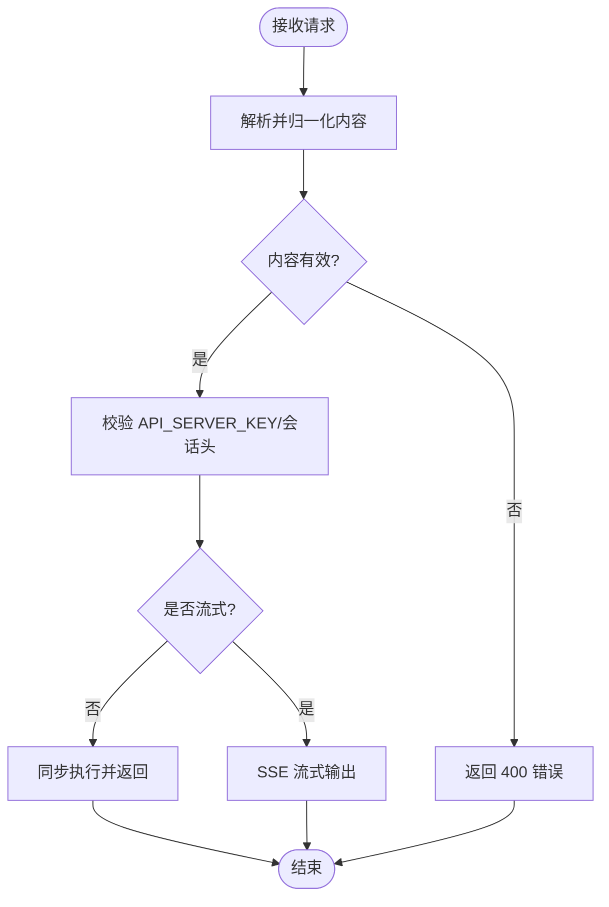
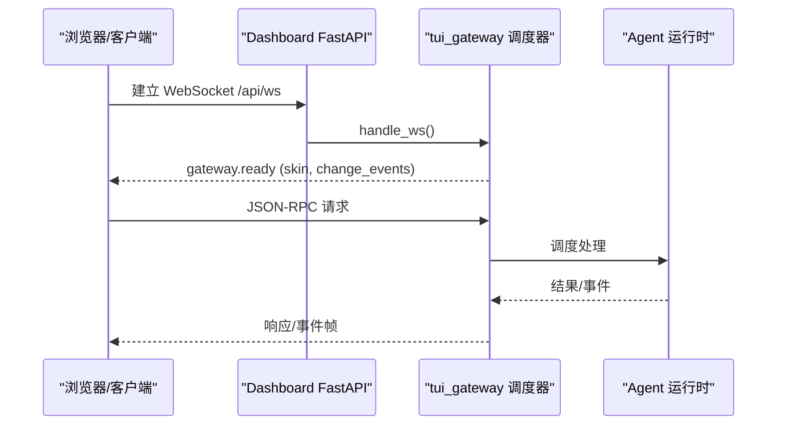
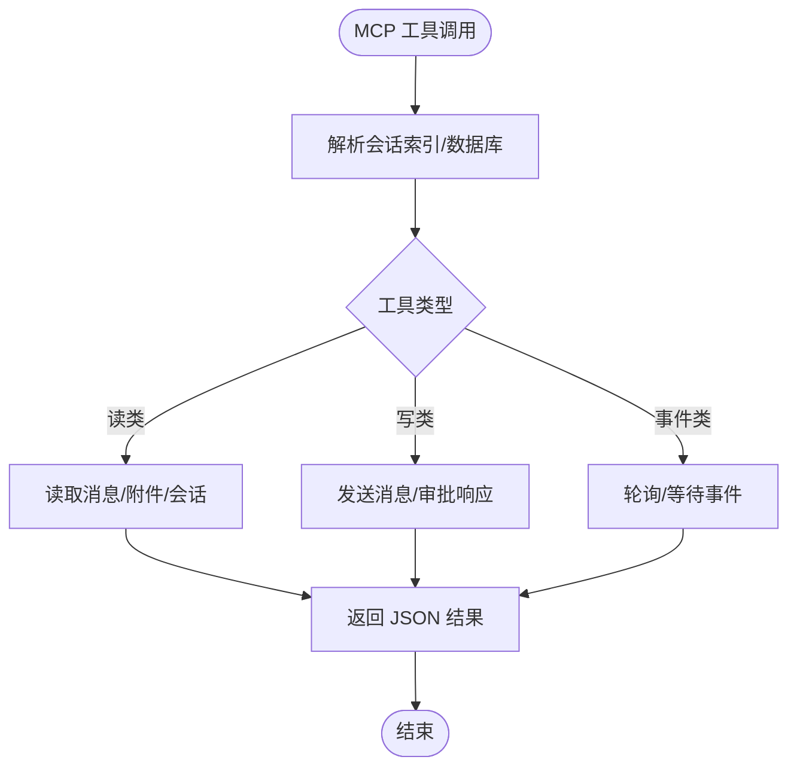
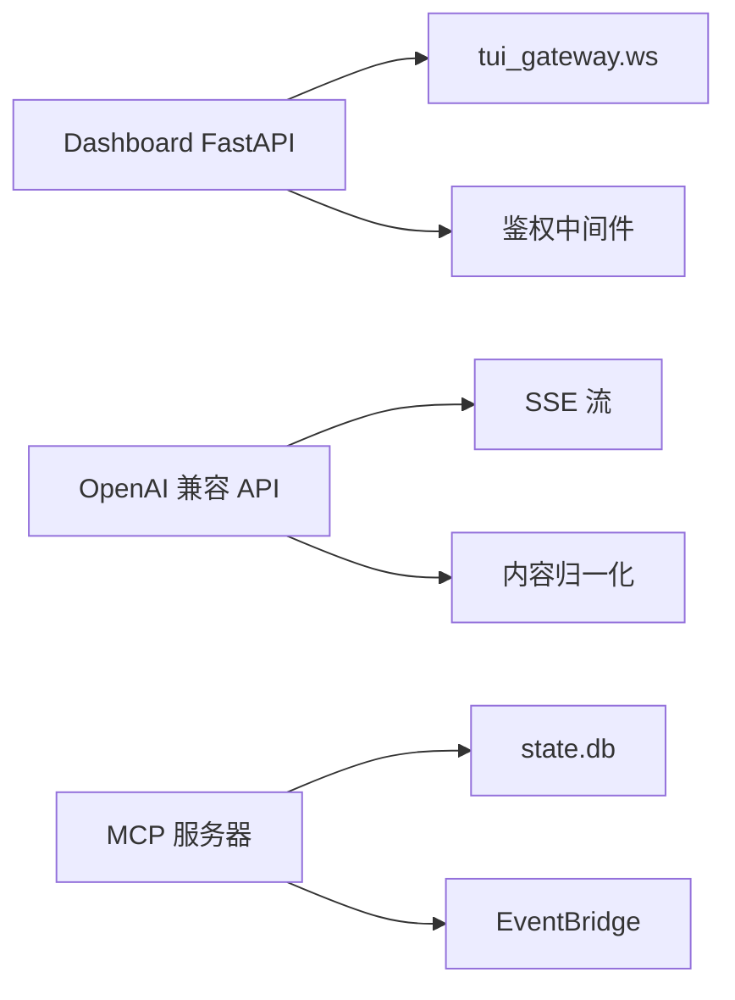

# API 参考

<cite>
**本文引用的文件**
- [README.md](file://README.md)
- [web_server.py](file://hermes_cli/web_server.py)
- [api_server.py](file://gateway/platforms/api_server.py)
- [ws.py](file://tui_gateway/ws.py)
- [mcp_serve.py](file://mcp_serve.py)
- [hermes_tools_mcp_server.py](file://agent/transports/hermes_tools_mcp_server.py)
</cite>

## 目录
1. [简介](#简介)
2. [项目结构](#项目结构)
3. [核心组件](#核心组件)
4. [架构总览](#架构总览)
5. [详细组件分析](#详细组件分析)
6. [依赖关系分析](#依赖关系分析)
7. [性能考虑](#性能考虑)
8. [故障排查指南](#故障排查指南)
9. [结论](#结论)
10. [附录](#附录)

## 简介
本参考文档面向 Hermes Agent 的对外接口，覆盖三类协议与通道：
- RESTful API：OpenAI 兼容的聊天/响应/运行接口、会话管理、健康检查等。
- WebSocket 接口：TUI Gateway 的 JSON-RPC 实时通道（事件流、RPC）。
- MCP 协议：通过 stdio 暴露消息桥接工具集，供 Claude Code/Cursor/Codex 等 MCP 客户端调用。

文档包含各协议的 URL/方法、请求/响应模式、认证方式、错误处理、速率限制、版本信息、安全注意事项、常见用例、客户端实现要点、性能优化技巧以及调试与监控方法。

## 项目结构
Hermes 提供多种对外服务入口：
- Web UI Dashboard 后端（FastAPI）：提供受保护的 /api/* 路由、静态前端、WebSocket 接入点。
- OpenAI 兼容 API Server（aiohttp）：提供 /v1/* 和 /api/sessions 等端点。
- TUI Gateway WebSocket：基于 JSON-RPC 的实时通道，用于桌面/TUI/Web 客户端。
- MCP 服务器：stdio 传输的消息桥接工具集，暴露对话、消息、事件、权限等能力。

图表来源
- [ws.py:1-477](file://tui_gateway/ws.py#L1-L477)
- [api_server.py:1-800](file://gateway/platforms/api_server.py#L1-L800)
- [web_server.py:1-800](file://hermes_cli/web_server.py#L1-L800)
- [mcp_serve.py:1-800](file://mcp_serve.py#L1-L800)

章节来源
- [README.md:105-183](file://README.md#L105-L183)

## 核心组件
- Dashboard Web 服务器（FastAPI）
  - 提供受保护的 /api/* 路由、CORS、Host 校验、OAuth/Session Token 鉴权、插件路由门控、健康自检。
  - 内置 WebSocket 接入点，复用 tui_gateway 的 JSON-RPC 分发。
- OpenAI 兼容 API 服务器（aiohttp）
  - 提供 /v1/chat/completions、/v1/responses、/v1/runs、/v1/models、/health 等端点。
  - 支持 SSE 流式输出、多模态内容归一化、会话键作用域、运行时模型/提供者覆盖。
- TUI Gateway WebSocket
  - 基于 JSON-RPC 2.0，行分隔；连接后推送 gateway.ready；支持 token 级事件合并与低延迟发送。
- MCP 服务器
  - 暴露 conversations_list/conversation_get/messages_read/attachments_fetch/events_poll/events_wait/messages_send/permissions_* 等工具。
  - 后台轮询 state.db 生成事件队列，支持游标拉取与等待。

章节来源
- [web_server.py:313-671](file://hermes_cli/web_server.py#L313-L671)
- [api_server.py:1-200](file://gateway/platforms/api_server.py#L1-L200)
- [ws.py:1-120](file://tui_gateway/ws.py#L1-L120)
- [mcp_serve.py:1-120](file://mcp_serve.py#L1-L120)

## 架构总览
下图展示三类协议如何统一接入到 Agent 运行时：

图表来源
- [ws.py:286-477](file://tui_gateway/ws.py#L286-L477)
- [api_server.py:1-200](file://gateway/platforms/api_server.py#L1-L200)
- [mcp_serve.py:590-800](file://mcp_serve.py#L590-L800)

## 详细组件分析

### REST API（OpenAI 兼容 + 会话管理）
- 基础信息
  - 协议：HTTP/HTTPS
  - 主机/端口：默认 127.0.0.1:8642（可配置）
  - 版本：/v1/models 列出可用模型；/health 提供健康检查；/health/detailed 提供详细状态
- 主要端点
  - POST /v1/chat/completions：OpenAI Chat Completions 格式；支持 stream、model/provider/model_options 覆盖；SSE 流式输出
  - POST /v1/responses：OpenAI Responses 格式；支持 previous_response_id 会话延续；X-Hermes-Session-Key 作用域
  - GET /v1/responses/{response_id}：获取存储的响应
  - DELETE /v1/responses/{response_id}：删除存储的响应
  - GET /v1/models：列出 hermes-agent 及别名模型
  - GET /v1/capabilities：机器可读能力清单
  - GET/POST/PATCH/DELETE /api/sessions：会话 CRUD
  - GET /api/sessions/{session_id}/messages：读取会话消息历史
  - POST /api/sessions/{session_id}/fork：分支会话
  - POST /api/sessions/{session_id}/chat[/stream]：与持久会话聊天（可选流式）
  - POST /v1/runs：启动运行，立即返回 run_id（202）
  - GET /v1/runs/{run_id}：查询运行状态
  - GET /v1/runs/{run_id}/events：SSE 结构化生命周期事件流
  - POST /v1/runs/{run_id}/approval：审批运行中的待决项
  - POST /v1/runs/{run_id}/stop：中断运行
  - GET /health、GET /health/detailed：健康检查
- 认证与安全
  - 使用环境变量 API_SERVER_KEY 进行鉴权（由平台适配器说明）
  - 支持 X-Hermes-Session-Id（短期会话连续性）、X-Hermes-Session-Key（长期记忆作用域）
  - 多租户前缀：当启用 multiplex_profiles 时，可通过 /p/<profile>/ 访问不同 profile
- 请求/响应模式
  - 文本/多模态内容自动归一化；图片仅支持 http(s) URL 或 data:image/*
  - 流式输出采用 SSE，统一帧编码
  - 请求体大小上限约 10MB；文本内容长度限制为 64KB
- 错误处理
  - 对无效输入返回 400（如图片 URL 非法、不支持的文件类型）
  - 运行时异常以 OpenAI 风格错误码与消息返回
- 速率限制
  - 服务端未显式实现全局限流；建议在上层网关或反向代理中实施
- 版本与兼容性
  - 兼容主流 OpenAI 前端（Open WebUI、LobeChat、LibreChat 等）
  - 虚拟模型 hermes-agent 作为稳定入口，允许 per-request 覆盖 provider/model

图表来源
- [api_server.py:187-207](file://gateway/platforms/api_server.py#L187-L207)
- [api_server.py:477-666](file://gateway/platforms/api_server.py#L477-L666)

章节来源
- [api_server.py:1-200](file://gateway/platforms/api_server.py#L1-L200)
- [api_server.py:477-666](file://gateway/platforms/api_server.py#L477-L666)

### WebSocket 接口（TUI Gateway JSON-RPC）
- 连接与握手
  - 挂载于 /api/ws（由 Dashboard 暴露），接受 WebSocket 连接后立即推送 gateway.ready 事件
  - 协议：JSON-RPC 2.0，行分隔；无额外帧封装
- 消息格式
  - 请求：{"jsonrpc":"2.0","method":"...","params":{...},"id":...}
  - 响应：{"jsonrpc":"2.0","result":...,"id":...} 或 {"jsonrpc":"2.0","error":{...},"id":...}
  - 事件：{"jsonrpc":"2.0","method":"event","params":{"type":"...","payload":{...}}}
- 事件类型
  - gateway.ready：连接就绪，携带 skin 与 change_events 标志
  - 高频 token 事件：message.delta、reasoning.delta、thinking.delta（会被合并缓冲以降低开销）
- 实时交互模式
  - 客户端发起 RPC 调用（如 setup.status、session.list、slash 命令等）
  - 服务端异步派发，长耗时任务在池线程执行，通过 transport.write 回写结果
  - 支持 live transport 注册，用于全局广播（如皮肤变更）
- 错误处理
  - 解析失败返回 -32700；内部错误返回 -32603
  - 写入超时/失败会记录日志并标记传输关闭
- 安全与鉴权
  - 通过 Dashboard 的中间件链（Host 校验、OAuth/Session Token、插件门控）保护 /api/ws
- 性能优化
  - 禁用 Nagle 保持低延迟
  - 高频 token 事件合并（~30fps 刷新）
  - 非阻塞写入与超时保护

图表来源
- [ws.py:286-477](file://tui_gateway/ws.py#L286-L477)
- [web_server.py:313-671](file://hermes_cli/web_server.py#L313-L671)

章节来源
- [ws.py:1-120](file://tui_gateway/ws.py#L1-L120)
- [ws.py:286-477](file://tui_gateway/ws.py#L286-L477)
- [web_server.py:313-671](file://hermes_cli/web_server.py#L313-L671)

### MCP 协议（stdio 传输）
- 启动方式
  - 通过 hermes mcp serve 启动 stdio MCP 服务器
  - 客户端配置示例：在 claude_desktop_config.json 中声明 mcpServers.hermes
- 工具列表（部分）
  - conversations_list：列出活跃对话（支持平台过滤、搜索、分页）
  - conversation_get：获取某对话详情（含 session_key、origin、token 用量）
  - messages_read：读取最近消息（角色、内容、时间戳）
  - attachments_fetch：提取非文本附件（图片、媒体、未知块）
  - events_poll/events_wait：拉取/等待新事件（游标机制）
  - messages_send：向对话发送消息
  - permissions_list_open/permissions_respond：查看/响应待决权限
  - channels_list：Hermes 特有扩展（可用目标频道）
- 数据流与事件
  - 后台 EventBridge 轮询 state.db，维护内存事件队列，支持游标与等待
  - 事件类型：message、approval_requested、approval_resolved
- 错误处理
  - 会话/消息不存在返回错误 JSON
  - 数据库不可用返回错误 JSON
- 安全与沙箱
  - 通过 MCP 工具边界进行参数强约束与类型转换
  - 敏感信息脱敏（HERMES_REDACT_SECRETS=true）
- 性能优化
  - 轮询间隔 200ms；基于 state.db mtime 跳过空转
  - 事件队列限制（1000），避免内存膨胀

图表来源
- [mcp_serve.py:590-800](file://mcp_serve.py#L590-L800)
- [mcp_serve.py:284-585](file://mcp_serve.py#L284-L585)

章节来源
- [mcp_serve.py:1-120](file://mcp_serve.py#L1-L120)
- [mcp_serve.py:284-585](file://mcp_serve.py#L284-L585)
- [mcp_serve.py:590-800](file://mcp_serve.py#L590-L800)

### 附加：Codex 环境下的 Hermes Tools MCP
- 目的：在 Codex App Server 运行时，将 Hermes 的部分工具（搜索、浏览器自动化、视觉、图像生成、技能、TTS、看板）暴露给 Codex 子进程
- 机制：动态从 model_tools 获取工具定义，构建 FastMCP 并注册受限工具集
- 限制：不暴露终端/文件读写/委托任务等需要运行期上下文的能力

章节来源
- [hermes_tools_mcp_server.py:1-150](file://agent/transports/hermes_tools_mcp_server.py#L1-L150)
- [hermes_tools_mcp_server.py:152-245](file://agent/transports/hermes_tools_mcp_server.py#L152-L245)

## 依赖关系分析
- Dashboard FastAPI 依赖：
  - CORS、Host 校验、OAuth/Session Token 鉴权、插件路由门控、健康自检
  - 集成 tui_gateway 的 WebSocket 处理
- OpenAI 兼容 API 服务器依赖：
  - aiohttp 提供 HTTP 服务
  - SSE 流式输出、多模态内容归一化、会话作用域、运行时模型/提供者覆盖
- TUI Gateway 依赖：
  - JSON-RPC 分发、事件合并、低延迟发送、Nagle 禁用
- MCP 服务器依赖：
  - fastmcp（可选导入）、state.db 读取、事件桥接、会话索引加载

图表来源
- [web_server.py:313-671](file://hermes_cli/web_server.py#L313-L671)
- [api_server.py:187-207](file://gateway/platforms/api_server.py#L187-L207)
- [mcp_serve.py:284-585](file://mcp_serve.py#L284-L585)

章节来源
- [web_server.py:313-671](file://hermes_cli/web_server.py#L313-L671)
- [api_server.py:187-207](file://gateway/platforms/api_server.py#L187-L207)
- [mcp_serve.py:284-585](file://mcp_serve.py#L284-L585)

## 性能考虑
- WebSocket
  - 高频 token 事件合并（~30fps），降低事件循环唤醒频率
  - 禁用 Nagle，减少首包延迟
  - 写入超时保护，避免事件循环阻塞导致“假死”
- REST
  - 请求体与文本长度限制，防止滥用
  - SSE 统一帧编码，减少序列化开销
  - 运行时模型/提供者 per-request 覆盖，避免频繁配置切换
- MCP
  - 200ms 轮询间隔，基于 state.db mtime 跳过空转
  - 事件队列上限 1000，控制内存占用

[本节为通用指导，无需特定文件引用]

## 故障排查指南
- WebSocket
  - 解析错误：-32700；内部错误：-32603
  - 写入失败/超时：记录 peer、错误类型与次数
  - 连接断开原因：client_disconnect、ready_send_failed、send_failed_after_*
- REST
  - 400 错误：图片 URL 非法、不支持的内容类型、参数缺失
  - 5xx：记录到 DashboardHealth，并通过 /api/status 暴露
  - 健康检查：/health、/health/detailed
- MCP
  - 会话/消息不存在：返回错误 JSON
  - 数据库不可用：返回错误 JSON
  - 事件丢失：检查 state.db mtime 与轮询间隔

章节来源
- [ws.py:359-477](file://tui_gateway/ws.py#L359-L477)
- [web_server.py:688-800](file://hermes_cli/web_server.py#L688-L800)
- [api_server.py:683-693](file://gateway/platforms/api_server.py#L683-L693)
- [mcp_serve.py:668-800](file://mcp_serve.py#L668-L800)

## 结论
Hermes Agent 提供了统一的三通道对外能力：REST（OpenAI 兼容）、WebSocket（JSON-RPC）、MCP（stdio）。三者均具备完善的鉴权、错误处理与性能优化策略。开发者可根据场景选择合适的协议：
- 快速集成现有 OpenAI 前端：使用 /v1/*
- 实时交互与桌面/TUI/Web 客户端：使用 /api/ws
- 跨平台消息桥接与工具编排：使用 MCP 工具集

[本节为总结性内容，无需特定文件引用]

## 附录

### 认证与授权速查
- Dashboard /api/*：Session Token（X-Hermes-Session-Token 或 Authorization: Bearer）或 OAuth 门控
- OpenAI 兼容 API：API_SERVER_KEY 环境变量
- Host 校验：仅接受绑定地址或 loopback 名称，防 DNS 重绑定

章节来源
- [web_server.py:398-471](file://hermes_cli/web_server.py#L398-L471)
- [api_server.py:1-200](file://gateway/platforms/api_server.py#L1-L200)

### 速率限制与版本
- 速率限制：建议在反向代理层实施（如 Nginx/Cloudflare）
- 版本信息：/v1/models、/health/detailed；Dashboard 版本来自 hermes_cli.__version__

章节来源
- [api_server.py:125-158](file://gateway/platforms/api_server.py#L125-L158)
- [web_server.py:313-335](file://hermes_cli/web_server.py#L313-L335)

### 常见用例与客户端实现要点
- 聊天流式：POST /v1/chat/completions，设置 stream=true，消费 SSE
- 会话管理：/api/sessions 增删改查，/api/sessions/{id}/messages 读取历史
- 实时事件：WebSocket 连接后订阅 event.type，处理 message.delta 等
- MCP 工具：按工具名调用，遵循 JSON Schema 参数；使用游标拉取事件

章节来源
- [api_server.py:1-200](file://gateway/platforms/api_server.py#L1-L200)
- [ws.py:286-477](file://tui_gateway/ws.py#L286-L477)
- [mcp_serve.py:590-800](file://mcp_serve.py#L590-L800)