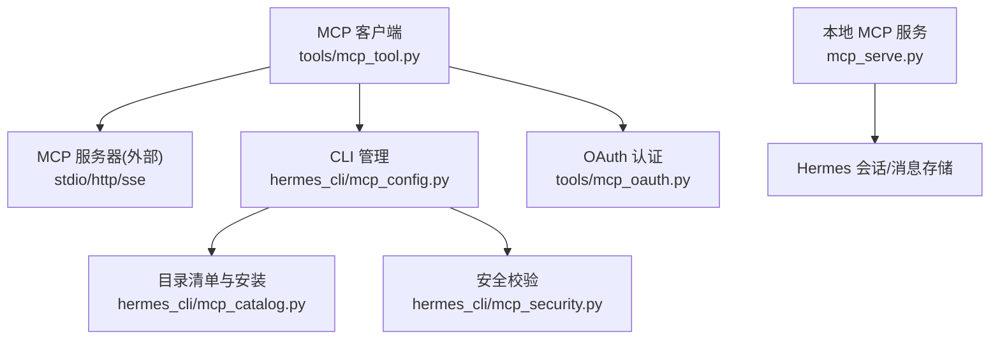
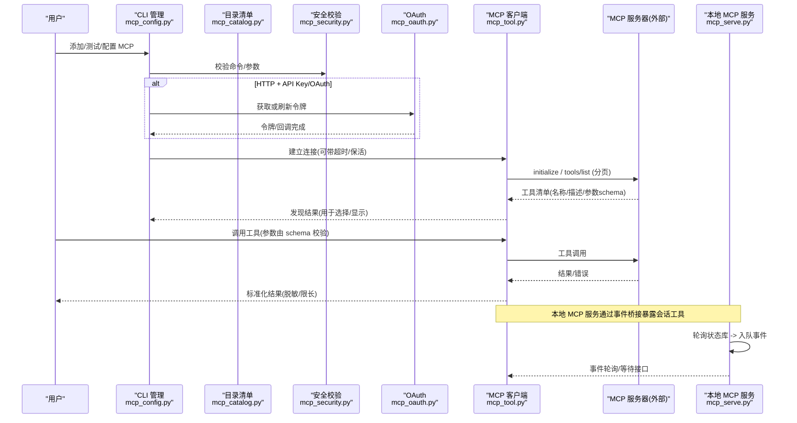
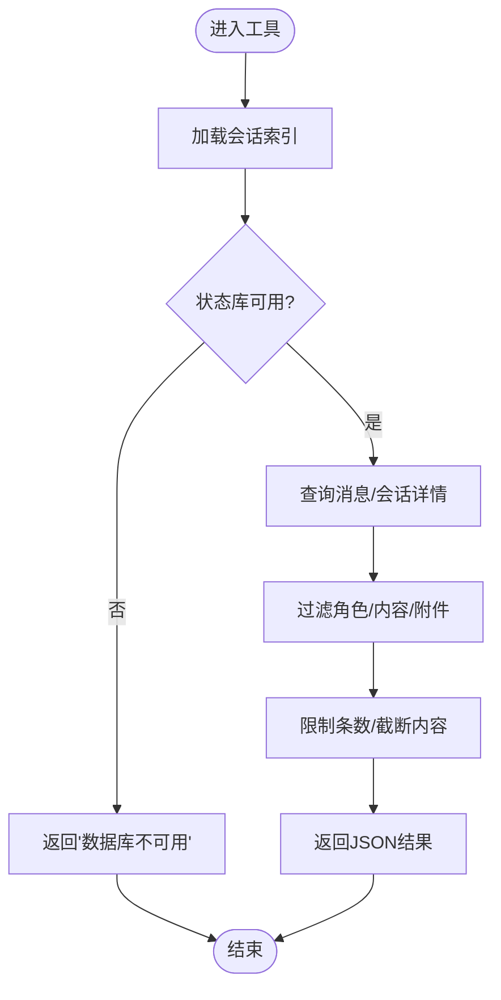
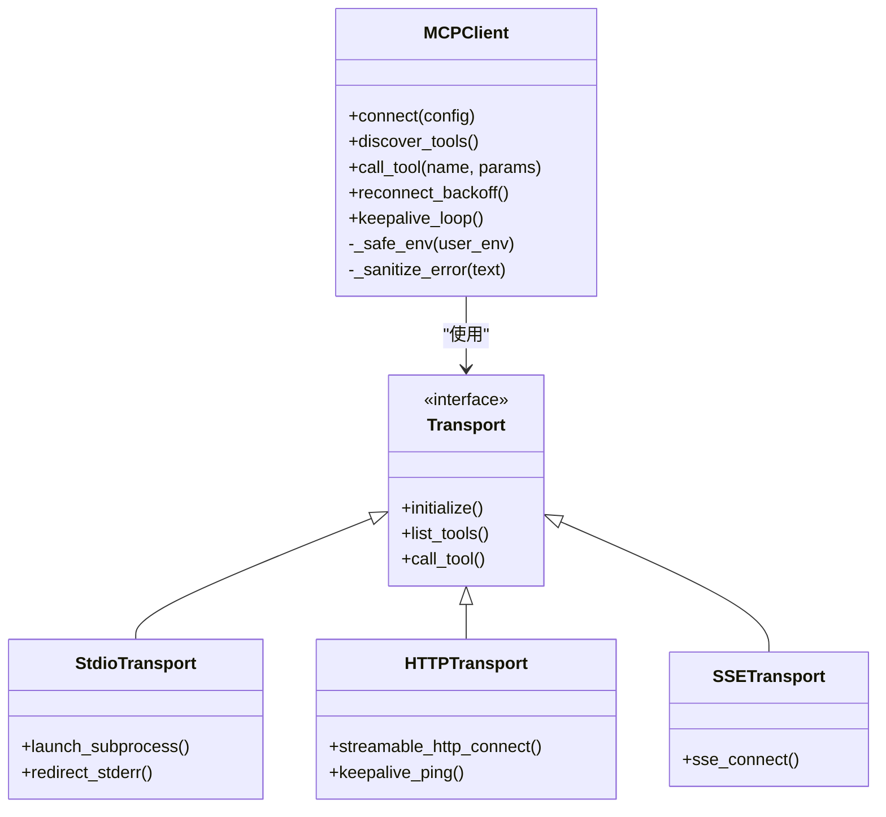
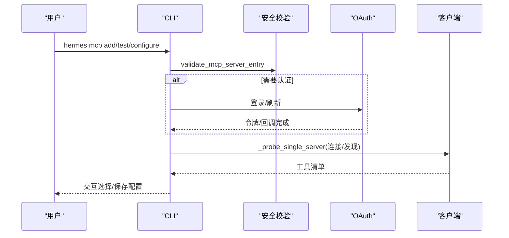
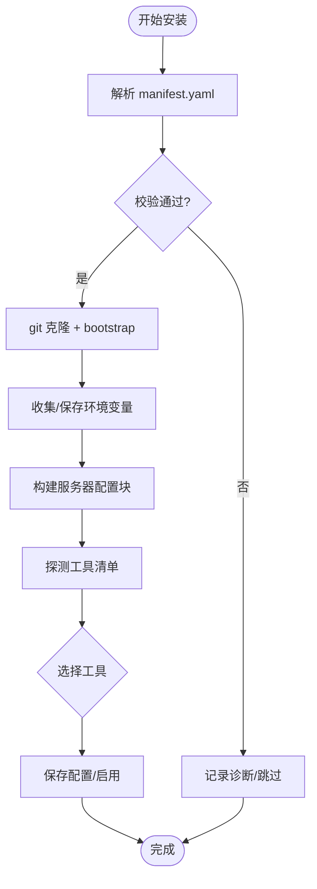
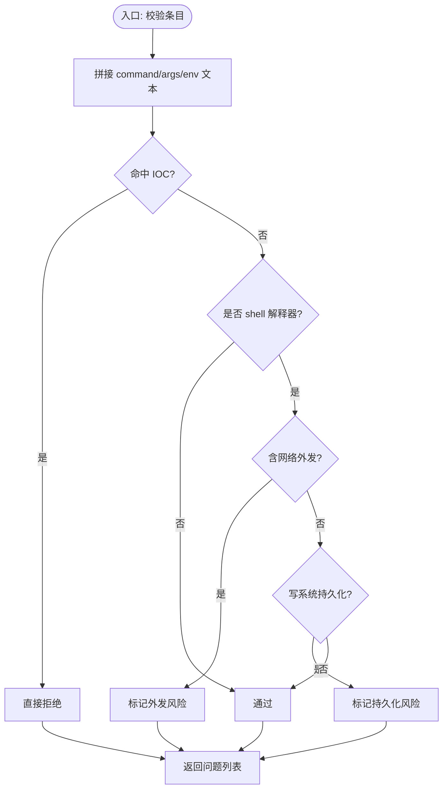
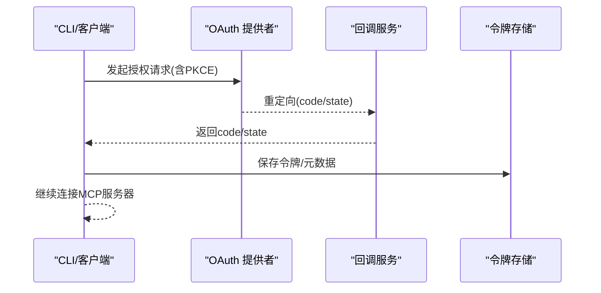
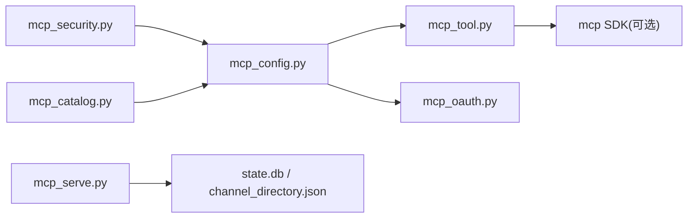

# MCP 协议

<cite>
**本文引用的文件**
- [mcp_serve.py](file://mcp_serve.py)
- [tools/mcp_tool.py](file://tools/mcp_tool.py)
- [hermes_cli/mcp_config.py](file://hermes_cli/mcp_config.py)
- [hermes_cli/mcp_catalog.py](file://hermes_cli/mcp_catalog.py)
- [hermes_cli/mcp_security.py](file://hermes_cli/mcp_security.py)
- [hermes_cli/mcp_startup.py](file://hermes_cli/mcp_startup.py)
- [tools/mcp_oauth.py](file://tools/mcp_oauth.py)
</cite>

## 目录
1. [简介](#简介)
2. [项目结构](#项目结构)
3. [核心组件](#核心组件)
4. [架构总览](#架构总览)
5. [详细组件分析](#详细组件分析)
6. [依赖关系分析](#依赖关系分析)
7. [性能与可靠性](#性能与可靠性)
8. [故障排查指南](#故障排查指南)
9. [结论](#结论)
10. [附录：工具开发与发布规范](#附录：工具开发与发布规范)

## 简介
本文件面向在 Hermes Agent 中实现、集成与治理 Model Context Protocol（MCP）的开发者与运维人员，系统化说明：
- 协议版本与传输方式（stdio/HTTP Streamable HTTP/SSE）
- 消息结构与能力协商
- 工具发现机制（tools/list、prompts/resources 可选能力）
- 工具注册、参数校验、结果返回与错误处理
- 安全与权限控制（命令白名单、敏感信息脱敏、OAuth 流程）
- 沙箱执行环境（子进程隔离、环境变量过滤、stderr 重定向）
- 工具发布、版本管理与兼容性检查（目录清单、manifest 校验、安装与选择）
- 完整的工具开发示例（定义、实现、测试要点）

## 项目结构
围绕 MCP 的关键模块分布如下：
- mcp_serve.py：提供基于 FastMCP 的本地 MCP Server，将对话会话暴露为标准化工具（如 conversations_list、messages_read 等），并维护事件桥接。
- tools/mcp_tool.py：MCP 客户端核心，负责连接外部 MCP 服务器、发现工具、注册到 Hermes 工具注册表、调用执行、错误处理与重试。
- hermes_cli/mcp_config.py：CLI 管理 MCP 服务器生命周期（添加、测试、列出、删除、配置），包含鉴权与工具选择交互。
- hermes_cli/mcp_catalog.py：官方可选 MCP 目录与 manifest 解析、安装、工具预勾选与探测。
- hermes_cli/mcp_security.py：对 stdio 命令进行高危模式检测（外发、持久化、IOC 黑名单）。
- hermes_cli/mcp_startup.py：后台异步发现与等待，避免阻塞启动。
- tools/mcp_oauth.py：OAuth 2.1 PKCE 流程、回调服务、令牌持久化与交互式引导。

图表来源
- [tools/mcp_tool.py:1-120](file://tools/mcp_tool.py#L1-L120)
- [hermes_cli/mcp_config.py:1-120](file://hermes_cli/mcp_config.py#L1-L120)
- [hermes_cli/mcp_catalog.py:1-120](file://hermes_cli/mcp_catalog.py#L1-L120)
- [hermes_cli/mcp_security.py:1-60](file://hermes_cli/mcp_security.py#L1-L60)
- [mcp_serve.py:1-60](file://mcp_serve.py#L1-L60)

章节来源
- [tools/mcp_tool.py:1-120](file://tools/mcp_tool.py#L1-L120)
- [hermes_cli/mcp_config.py:1-120](file://hermes_cli/mcp_config.py#L1-L120)
- [hermes_cli/mcp_catalog.py:1-120](file://hermes_cli/mcp_catalog.py#L1-L120)
- [hermes_cli/mcp_security.py:1-60](file://hermes_cli/mcp_security.py#L1-L60)
- [mcp_serve.py:1-60](file://mcp_serve.py#L1-L60)

## 核心组件
- MCP 客户端（tools/mcp_tool.py）
  - 支持 stdio、HTTP Streamable HTTP、SSE 三种传输
  - 自动重连、指数退避、空闲保活、会话回收
  - 工具发现分页（nextCursor）、能力探测（prompts/resources）
  - 环境变量过滤、错误信息脱敏、描述注入扫描
- CLI 管理（hermes_cli/mcp_config.py）
  - 添加/测试/列出/删除/配置 MCP 服务器
  - 工具选择交互、OAuth 登录、Bearer 头模板生成
- 目录清单与安装（hermes_cli/mcp_catalog.py）
  - manifest.yaml 解析与校验、git 安装、bootstrap 命令
  - 工具默认启用策略、探测失败回退
- 安全校验（hermes_cli/mcp_security.py）
  - 阻止 shell 解释器+网络外发、系统持久化写入、已知 IOC
- 本地 MCP 服务（mcp_serve.py）
  - 暴露对话相关工具（列表、读取、附件、事件轮询/等待、审批响应）
  - 事件桥接：后台轮询状态库，维护内存队列与 waiters
- OAuth（tools/mcp_oauth.py）
  - 浏览器授权、回调监听、令牌持久化、非交互抑制

章节来源
- [tools/mcp_tool.py:1-120](file://tools/mcp_tool.py#L1-L120)
- [hermes_cli/mcp_config.py:1-120](file://hermes_cli/mcp_config.py#L1-L120)
- [hermes_cli/mcp_catalog.py:1-120](file://hermes_cli/mcp_catalog.py#L1-L120)
- [hermes_cli/mcp_security.py:1-182](file://hermes_cli/mcp_security.py#L1-L182)
- [mcp_serve.py:1-120](file://mcp_serve.py#L1-L120)
- [tools/mcp_oauth.py:1-120](file://tools/mcp_oauth.py#L1-L120)

## 架构总览
下图展示从 CLI 配置到 MCP 客户端连接、工具发现、工具调用与结果返回的整体流程，以及本地 MCP 服务的事件桥接。

图表来源
- [hermes_cli/mcp_config.py:250-380](file://hermes_cli/mcp_config.py#L250-L380)
- [hermes_cli/mcp_catalog.py:500-620](file://hermes_cli/mcp_catalog.py#L500-L620)
- [hermes_cli/mcp_security.py:120-182](file://hermes_cli/mcp_security.py#L120-L182)
- [tools/mcp_oauth.py:650-800](file://tools/mcp_oauth.py#L650-L800)
- [tools/mcp_tool.py:600-700](file://tools/mcp_tool.py#L600-L700)
- [mcp_serve.py:316-450](file://mcp_serve.py#L316-L450)

## 详细组件分析

### 本地 MCP 服务（mcp_serve.py）
- 目标：以标准 MCP 工具暴露 Hermes 多平台会话能力（列表、读取、附件、事件轮询/等待、审批响应）。
- 关键能力
  - 会话索引加载：优先从 state.db 路由索引构建，回退到 sessions.json
  - 事件桥接：后台线程轮询状态库，按 session_key 追踪最新时间戳，去重入队
  - 工具函数：conversations_list、conversation_get、messages_read、attachments_fetch、events_poll、events_wait、permissions_respond 等
  - 参数约束：统一整数强制转换与范围钳制，避免外部传入非法类型
- 错误处理：数据库不可用、消息为空、附件提取异常均返回结构化错误 JSON
- 性能：mtime 缓存跳过无变更；队列限制防止内存膨胀；轮询间隔可调

图表来源
- [mcp_serve.py:62-213](file://mcp_serve.py#L62-L213)
- [mcp_serve.py:316-450](file://mcp_serve.py#L316-L450)
- [mcp_serve.py:609-800](file://mcp_serve.py#L609-L800)

章节来源
- [mcp_serve.py:62-213](file://mcp_serve.py#L62-L213)
- [mcp_serve.py:316-450](file://mcp_serve.py#L316-L450)
- [mcp_serve.py:609-800](file://mcp_serve.py#L609-L800)

### MCP 客户端（tools/mcp_tool.py）
- 传输与连接
  - stdio：子进程启动，stderr 重定向到日志文件，PATH 解析增强（npx/node 等）
  - HTTP Streamable HTTP：支持 keepalive、session TTL 适配
  - SSE：可选传输
- 工具发现
  - tools/list 分页（nextCursor），上限保护
  - prompts/resources 能力探测（受配置开关与服务器能力声明控制）
- 工具调用
  - 参数 schema 校验（由 SDK 与客户端共同保障）
  - 错误信息脱敏（密钥/令牌模式替换为占位符）
  - 描述注入扫描（警告级别，不阻断）
- 可靠性
  - 指数退避重连、最大重试次数、空闲保活、回收策略
  - 背景事件循环与线程安全封装
- 环境变量过滤
  - 仅传递安全基线变量与显式配置，防止泄露

图表来源
- [tools/mcp_tool.py:1-120](file://tools/mcp_tool.py#L1-L120)
- [tools/mcp_tool.py:338-432](file://tools/mcp_tool.py#L338-L432)
- [tools/mcp_tool.py:493-533](file://tools/mcp_tool.py#L493-L533)
- [tools/mcp_tool.py:661-700](file://tools/mcp_tool.py#L661-L700)

章节来源
- [tools/mcp_tool.py:1-120](file://tools/mcp_tool.py#L1-L120)
- [tools/mcp_tool.py:338-432](file://tools/mcp_tool.py#L338-L432)
- [tools/mcp_tool.py:493-533](file://tools/mcp_tool.py#L493-L533)
- [tools/mcp_tool.py:661-700](file://tools/mcp_tool.py#L661-L700)

### CLI 管理（hermes_cli/mcp_config.py）
- 功能
  - 添加/测试/列出/删除/配置 MCP 服务器
  - 工具选择交互（curses checklist）
  - OAuth 登录与 Bearer 头模板生成
  - 环境变量插值与解析
- 安全
  - 保存前调用安全校验，拒绝可疑命令/参数
  - 测试时临时连接并列出工具，断开后清理
- 能力探测
  - 尊重 tools.prompts/tools.resources 配置与服务器能力声明

图表来源
- [hermes_cli/mcp_config.py:88-150](file://hermes_cli/mcp_config.py#L88-L150)
- [hermes_cli/mcp_config.py:252-380](file://hermes_cli/mcp_config.py#L252-L380)
- [hermes_cli/mcp_config.py:415-618](file://hermes_cli/mcp_config.py#L415-L618)

章节来源
- [hermes_cli/mcp_config.py:88-150](file://hermes_cli/mcp_config.py#L88-L150)
- [hermes_cli/mcp_config.py:252-380](file://hermes_cli/mcp_config.py#L252-L380)
- [hermes_cli/mcp_config.py:415-618](file://hermes_cli/mcp_config.py#L415-L618)

### 目录清单与安装（hermes_cli/mcp_catalog.py）
- manifest.yaml 解析与校验
  - 字段：name、description、source、transport（stdio/http）、auth（api_key/oauth/none）、tools.default_enabled、install.git
- 安装流程
  - git clone + bootstrap 命令
  - 环境变量提示与保存（~/.hermes/.env）
  - 构建服务器配置块并保存
  - 探测工具并交互选择（或应用默认策略）
- 诊断
  - 未来 manifest_version 与无效清单的诊断输出

图表来源
- [hermes_cli/mcp_catalog.py:159-295](file://hermes_cli/mcp_catalog.py#L159-L295)
- [hermes_cli/mcp_catalog.py:406-480](file://hermes_cli/mcp_catalog.py#L406-L480)
- [hermes_cli/mcp_catalog.py:507-620](file://hermes_cli/mcp_catalog.py#L507-L620)
- [hermes_cli/mcp_catalog.py:722-800](file://hermes_cli/mcp_catalog.py#L722-L800)

章节来源
- [hermes_cli/mcp_catalog.py:159-295](file://hermes_cli/mcp_catalog.py#L159-L295)
- [hermes_cli/mcp_catalog.py:406-480](file://hermes_cli/mcp_catalog.py#L406-L480)
- [hermes_cli/mcp_catalog.py:507-620](file://hermes_cli/mcp_catalog.py#L507-L620)
- [hermes_cli/mcp_catalog.py:722-800](file://hermes_cli/mcp_catalog.py#L722-L800)

### 安全校验（hermes_cli/mcp_security.py）
- 规则
  - IOC 黑名单：硬编码攻击指标（SSH 公钥片段、IP 段等）
  - Shell 解释器 + 网络外发：curl/wget/nc 等组合拦截
  - 系统持久化写入：authorized_keys、PAM、sudoers、cron、rc 文件等
- 作用点
  - 保存时（dashboard/CLI）与启动时（工具加载/发现）双重拦截

图表来源
- [hermes_cli/mcp_security.py:121-182](file://hermes_cli/mcp_security.py#L121-L182)

章节来源
- [hermes_cli/mcp_security.py:121-182](file://hermes_cli/mcp_security.py#L121-L182)

### OAuth（tools/mcp_oauth.py）
- 流程
  - 浏览器打开授权 URL，本地回调服务接收 code/state
  - 令牌持久化（expires_at 计算与恢复）
  - 非交互抑制（后台发现不触发浏览器）
  - 远程会话（SSH/Tailscale Funnel）友好提示
- 安全
  - 文件权限收紧（0o600）、原子写入、父目录权限加固
  - 动态客户端注册失效时的自我修复（删除 client.json/meta.json）

图表来源
- [tools/mcp_oauth.py:653-800](file://tools/mcp_oauth.py#L653-L800)
- [tools/mcp_oauth.py:429-555](file://tools/mcp_oauth.py#L429-L555)

章节来源
- [tools/mcp_oauth.py:429-555](file://tools/mcp_oauth.py#L429-L555)
- [tools/mcp_oauth.py:653-800](file://tools/mcp_oauth.py#L653-L800)

## 依赖关系分析
- 模块耦合
  - mcp_tool.py 依赖 mcp_sdk（可选），并在缺失时降级为 no-op
  - mcp_config.py 依赖 mcp_tool.py 进行探测与连接
  - mcp_catalog.py 依赖 mcp_config.py 保存配置与探测
  - mcp_security.py 被 mcp_config.py 与运行时工具加载路径共同调用
  - mcp_serve.py 独立提供本地 MCP 服务，与事件桥接协作
- 外部依赖
  - mcp Python SDK（transport、types、OAuth）
  - 文件系统（config.yaml、.env、state.db、channel_directory.json）
  - 操作系统（子进程、端口绑定、浏览器打开）

图表来源
- [hermes_cli/mcp_config.py:252-380](file://hermes_cli/mcp_config.py#L252-L380)
- [hermes_cli/mcp_catalog.py:507-620](file://hermes_cli/mcp_catalog.py#L507-L620)
- [hermes_cli/mcp_security.py:121-182](file://hermes_cli/mcp_security.py#L121-L182)
- [mcp_serve.py:62-213](file://mcp_serve.py#L62-L213)

章节来源
- [hermes_cli/mcp_config.py:252-380](file://hermes_cli/mcp_config.py#L252-L380)
- [hermes_cli/mcp_catalog.py:507-620](file://hermes_cli/mcp_catalog.py#L507-L620)
- [hermes_cli/mcp_security.py:121-182](file://hermes_cli/mcp_security.py#L121-L182)
- [mcp_serve.py:62-213](file://mcp_serve.py#L62-L213)

## 性能与可靠性
- 连接与重连
  - 指数退避 + 抖动，避免雪崩
  - 空闲保活（可配置 interval，下限保护）
  - 会话回收（idle/max lifetime）
- 工具发现
  - 分页上限保护，避免无限循环
  - 能力探测受配置与服务器声明控制，减少不必要调用
- 事件桥接
  - mtime 缓存跳过无变更轮询
  - 队列长度限制，防止内存泄漏
- 错误与脱敏
  - 错误信息脱敏，避免泄露密钥
  - 方法未实现（-32601）兼容处理

[本节为通用指导，无需具体文件引用]

## 故障排查指南
- 无法连接 MCP 服务器
  - 检查 transport（stdio/url/sse）与超时配置
  - 查看 CLI 测试输出与连接耗时
  - 确认 OAuth 令牌是否存在且有效
- 工具未出现
  - 检查 tools.include/exclude 配置
  - 确认服务器是否支持 prompts/resources 能力
  - 查看后台发现日志与诊断信息
- 命令被拒绝
  - 检查安全校验告警（shell 解释器+外发/持久化/IOC）
  - 修正命令/参数或改用白名单方式
- 本地 MCP 服务无事件
  - 检查 state.db 与 channel_directory.json 可用性
  - 查看事件桥接日志与队列状态

章节来源
- [hermes_cli/mcp_config.py:721-783](file://hermes_cli/mcp_config.py#L721-L783)
- [hermes_cli/mcp_catalog.py:549-620](file://hermes_cli/mcp_catalog.py#L549-L620)
- [hermes_cli/mcp_security.py:121-182](file://hermes_cli/mcp_security.py#L121-L182)
- [mcp_serve.py:316-450](file://mcp_serve.py#L316-L450)

## 结论
本仓库实现了完整、可扩展且安全的 MCP 生态：
- 客户端支持多种传输与健壮的重连/保活机制
- CLI 提供友好的生命周期管理与工具选择
- 目录清单与 manifest 校验确保可追溯与可控的安装过程
- 安全校验覆盖常见攻击面，结合 OAuth 与脱敏机制提升安全性
- 本地 MCP 服务将对话能力标准化暴露，便于跨平台集成

[本节为总结性内容，无需具体文件引用]

## 附录：工具开发与发布规范

### 协议版本与传输
- 协议版本：客户端使用“2025-03-26”作为兼容版本基准（SDK 可能导出 LATEST_PROTOCOL_VERSION）
- 传输方式：
  - stdio：command + args，环境变量过滤
  - HTTP Streamable HTTP：url + headers（Bearer），keepalive
  - SSE：transport=sse

章节来源
- [tools/mcp_tool.py:215-244](file://tools/mcp_tool.py#L215-L244)
- [tools/mcp_tool.py:338-370](file://tools/mcp_tool.py#L338-L370)

### 消息结构与能力协商
- initialize：建立会话，携带客户端能力
- tools/list：分页返回工具清单（nextCursor）
- prompts/resources：可选能力，受配置与服务器声明控制
- tool/call：调用工具，参数由 schema 校验，结果标准化返回

章节来源
- [tools/mcp_tool.py:661-700](file://tools/mcp_tool.py#L661-L700)
- [hermes_cli/mcp_config.py:313-378](file://hermes_cli/mcp_config.py#L313-L378)

### 工具注册、参数验证、结果返回与错误处理
- 注册：客户端连接后拉取工具清单并注册到 Hermes 工具注册表
- 参数验证：由 MCP SDK 与客户端共同依据 schema 校验
- 结果返回：标准化 JSON，内容截断与附件提取
- 错误处理：方法未实现、网络错误、超时、脱敏后的错误信息

章节来源
- [tools/mcp_tool.py:526-533](file://tools/mcp_tool.py#L526-L533)
- [mcp_serve.py:700-800](file://mcp_serve.py#L700-L800)

### 安全考虑、权限控制与沙箱执行环境
- 命令安全：禁止 shell 解释器+外发/持久化/IOC
- 环境变量：仅传递安全基线与显式配置
- 子进程 stderr：重定向到共享日志文件，避免污染 TUI
- OAuth：浏览器授权、回调服务、令牌持久化与权限最小化

章节来源
- [hermes_cli/mcp_security.py:121-182](file://hermes_cli/mcp_security.py#L121-L182)
- [tools/mcp_tool.py:493-533](file://tools/mcp_tool.py#L493-L533)
- [tools/mcp_oauth.py:429-555](file://tools/mcp_oauth.py#L429-L555)

### 工具发布、版本管理与兼容性检查
- 目录清单：optional-mcps/<name>/manifest.yaml
- 版本管理：manifest_version 严格匹配，git ref 精确 pin
- 兼容性：未来 manifest_version 会给出诊断提示；工具探测失败回退到默认策略

章节来源
- [hermes_cli/mcp_catalog.py:159-295](file://hermes_cli/mcp_catalog.py#L159-L295)
- [hermes_cli/mcp_catalog.py:297-343](file://hermes_cli/mcp_catalog.py#L297-L343)

### 工具开发示例（定义、实现、测试）
- 定义：在 manifest.yaml 中声明 name、description、transport、auth、tools.default_enabled
- 实现：遵循 MCP 协议实现 tools/list 与 tool/call，支持分页与能力声明
- 测试：
  - CLI 测试：hermes mcp test <name> 验证连接与工具发现
  - 目录清单：hermes mcp catalog 检查清单有效性
  - 安全：确保命令/参数不触发安全校验告警
  - OAuth：在非交互环境下使用 suppress_interactive_oauth 避免浏览器弹出

章节来源
- [hermes_cli/mcp_catalog.py:722-800](file://hermes_cli/mcp_catalog.py#L722-L800)
- [hermes_cli/mcp_config.py:721-783](file://hermes_cli/mcp_config.py#L721-L783)
- [tools/mcp_oauth.py:341-355](file://tools/mcp_oauth.py#L341-L355)