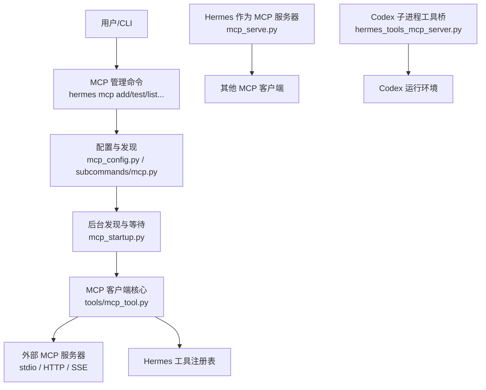
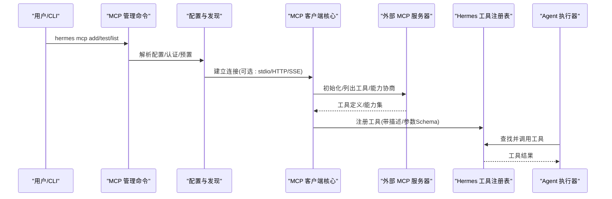
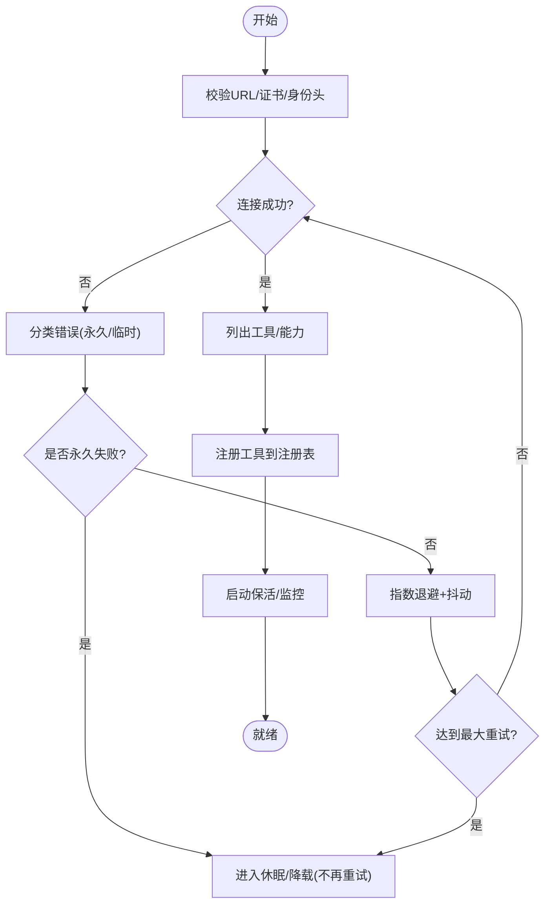
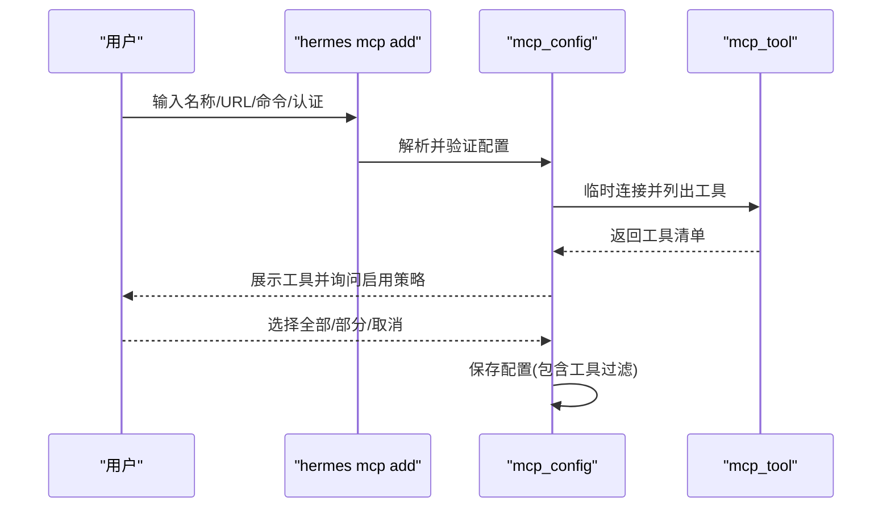
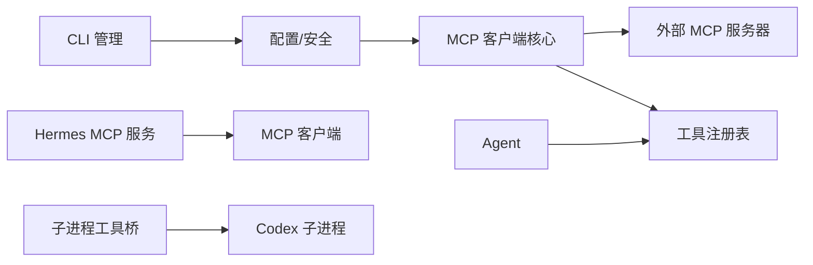

# MCP 协议概述

<cite>
**本文引用的文件**
- [mcp_serve.py](file://mcp_serve.py)
- [tools/mcp_tool.py](file://tools/mcp_tool.py)
- [hermes_cli/mcp_config.py](file://hermes_cli/mcp_config.py)
- [hermes_cli/mcp_startup.py](file://hermes_cli/mcp_startup.py)
- [agent/transports/hermes_tools_mcp_server.py](file://agent/transports/hermes_tools_mcp_server.py)
- [hermes_cli/subcommands/mcp.py](file://hermes_cli/subcommands/mcp.py)
</cite>

## 目录
1. [简介](#简介)
2. [项目结构](#项目结构)
3. [核心组件](#核心组件)
4. [架构总览](#架构总览)
5. [详细组件分析](#详细组件分析)
6. [依赖关系分析](#依赖关系分析)
7. [性能与可靠性](#性能与可靠性)
8. [故障排查指南](#故障排查指南)
9. [结论](#结论)
10. [附录：配置与传输速查](#附录配置与传输速查)

## 简介
本文件面向初学者，系统性说明 Hermes Agent 中的 MCP（Model Context Protocol）集成方案。内容涵盖：
- 核心理念与设计目标：通过标准化“工具接口”将外部 MCP 服务器能力无缝接入 Hermes Agent，使模型在对话中可调用远程工具。
- 传输层支持：stdio、HTTP/StreamableHTTP、SSE，以及连接管理（自动重连、保活、错误分类）。
- 版本管理与兼容性：对 MCP SDK 能力进行探测与降级，确保新旧版本共存。
- 数据流与架构图：从 CLI 配置到运行时工具注册的全链路视图。
- 实践要点：如何添加、测试、启用外部 MCP 服务器，以及在 Hermes 内部以 MCP 形式暴露自身能力。

## 项目结构
围绕 MCP 的关键代码分布在以下模块：
- 客户端与运行时集成：tools/mcp_tool.py（连接、发现、注册、重连、采样等）
- CLI 管理：hermes_cli/mcp_config.py、hermes_cli/subcommands/mcp.py（添加/删除/列表/测试/登录/安装）
- 启动期后台发现：hermes_cli/mcp_startup.py（后台线程、超时控制、首次构建前等待）
- 内置 MCP 服务：mcp_serve.py（Hermes 作为 MCP 服务器对外暴露会话能力）
- 子进程工具桥接：agent/transports/hermes_tools_mcp_server.py（为 Codex 等子进程暴露精选工具）

图表来源
- [hermes_cli/subcommands/mcp.py:15-127](file://hermes_cli/subcommands/mcp.py#L15-L127)
- [hermes_cli/mcp_config.py:78-150](file://hermes_cli/mcp_config.py#L78-L150)
- [hermes_cli/mcp_startup.py:32-119](file://hermes_cli/mcp_startup.py#L32-L119)
- [tools/mcp_tool.py:1-95](file://tools/mcp_tool.py#L1-L95)
- [mcp_serve.py:1-28](file://mcp_serve.py#L1-L28)
- [agent/transports/hermes_tools_mcp_server.py:1-43](file://agent/transports/hermes_tools_mcp_server.py#L1-L43)

章节来源
- [hermes_cli/subcommands/mcp.py:15-127](file://hermes_cli/subcommands/mcp.py#L15-L127)
- [hermes_cli/mcp_config.py:78-150](file://hermes_cli/mcp_config.py#L78-L150)
- [hermes_cli/mcp_startup.py:32-119](file://hermes_cli/mcp_startup.py#L32-L119)
- [tools/mcp_tool.py:1-95](file://tools/mcp_tool.py#L1-L95)
- [mcp_serve.py:1-28](file://mcp_serve.py#L1-L28)
- [agent/transports/hermes_tools_mcp_server.py:1-43](file://agent/transports/hermes_tools_mcp_server.py#L1-L43)

## 核心组件
- MCP 客户端核心（tools/mcp_tool.py）
  - 负责连接多种传输（stdio、HTTP/StreamableHTTP、SSE）、工具发现、动态注册、自动重连、保活、错误分类、资源与图片缓存、采样回调等。
- CLI 管理（hermes_cli/mcp_config.py、subcommands/mcp.py）
  - 提供交互式或命令行方式添加/删除/列出/测试/登录/安装 MCP 服务器；支持 OAuth、Header 认证、环境变量插值、预置模板。
- 启动期后台发现（hermes_cli/mcp_startup.py）
  - 在进程内启动后台线程进行非阻塞发现，支持单查询模式更长的等待上限，避免阻塞首回合。
- 内置 MCP 服务（mcp_serve.py）
  - 将 Hermes 的会话、消息、事件、权限审批等能力以 MCP 工具形式暴露给任意 MCP 客户端。
- 子进程工具桥（agent/transports/hermes_tools_mcp_server.py）
  - 在 Codex 等子进程中，通过 stdio MCP 暴露精选 Hermes 工具，补齐子进程能力面。

章节来源
- [tools/mcp_tool.py:1-95](file://tools/mcp_tool.py#L1-L95)
- [hermes_cli/mcp_config.py:78-150](file://hermes_cli/mcp_config.py#L78-L150)
- [hermes_cli/subcommands/mcp.py:15-127](file://hermes_cli/subcommands/mcp.py#L15-L127)
- [hermes_cli/mcp_startup.py:32-119](file://hermes_cli/mcp_startup.py#L32-L119)
- [mcp_serve.py:1-28](file://mcp_serve.py#L1-L28)
- [agent/transports/hermes_tools_mcp_server.py:1-43](file://agent/transports/hermes_tools_mcp_server.py#L1-L43)

## 架构总览
下图展示“外部 MCP 服务器 → Hermes 工具注册表 → 模型调用”的主路径，以及“Hermes 作为 MCP 服务器”的反向路径。

图表来源
- [hermes_cli/subcommands/mcp.py:15-127](file://hermes_cli/subcommands/mcp.py#L15-L127)
- [hermes_cli/mcp_config.py:278-378](file://hermes_cli/mcp_config.py#L278-L378)
- [tools/mcp_tool.py:661-699](file://tools/mcp_tool.py#L661-L699)

章节来源
- [hermes_cli/subcommands/mcp.py:15-127](file://hermes_cli/subcommands/mcp.py#L15-L127)
- [hermes_cli/mcp_config.py:278-378](file://hermes_cli/mcp_config.py#L278-L378)
- [tools/mcp_tool.py:661-699](file://tools/mcp_tool.py#L661-L699)

## 详细组件分析

### 组件A：MCP 客户端核心（tools/mcp_tool.py）
职责
- 多传输适配：stdio（本地子进程）、HTTP/StreamableHTTP（含 mTLS、身份头）、SSE。
- 工具发现与注册：分页拉取 tools/resources/prompts，按能力开关选择。
- 连接管理：指数退避重连、保活心跳、永久/临时错误分类、空闲回收。
- 安全与健壮性：环境变量白名单、敏感信息脱敏、注入检测、资源大小限制。
- 采样回调：将 MCP server 发起的 LLM 请求转换为内部调用，限流与审计。

关键流程（连接与重连）

图表来源
- [tools/mcp_tool.py:1072-1103](file://tools/mcp_tool.py#L1072-L1103)
- [tools/mcp_tool.py:1106-1155](file://tools/mcp_tool.py#L1106-L1155)
- [tools/mcp_tool.py:1158-1228](file://tools/mcp_tool.py#L1158-L1228)
- [tools/mcp_tool.py:1231-1303](file://tools/mcp_tool.py#L1231-L1303)

章节来源
- [tools/mcp_tool.py:1-95](file://tools/mcp_tool.py#L1-L95)
- [tools/mcp_tool.py:661-699](file://tools/mcp_tool.py#L661-L699)
- [tools/mcp_tool.py:1072-1103](file://tools/mcp_tool.py#L1072-L1103)
- [tools/mcp_tool.py:1106-1155](file://tools/mcp_tool.py#L1106-L1155)
- [tools/mcp_tool.py:1158-1228](file://tools/mcp_tool.py#L1158-L1228)
- [tools/mcp_tool.py:1231-1303](file://tools/mcp_tool.py#L1231-L1303)

### 组件B：CLI 管理（hermes_cli/mcp_config.py、subcommands/mcp.py）
职责
- 提供 add/remove/list/test/configure/login/reauth/install/picker/catalog 等子命令。
- 支持 OAuth、Header 认证、环境变量插值、预置模板（如 codex）。
- 连接探测时尊重能力开关（prompts/resources），避免对不支持的服务端触发无关方法。

典型交互（添加服务器）

图表来源
- [hermes_cli/subcommands/mcp.py:15-127](file://hermes_cli/subcommands/mcp.py#L15-L127)
- [hermes_cli/mcp_config.py:415-617](file://hermes_cli/mcp_config.py#L415-L617)
- [hermes_cli/mcp_config.py:278-378](file://hermes_cli/mcp_config.py#L278-L378)

章节来源
- [hermes_cli/subcommands/mcp.py:15-127](file://hermes_cli/subcommands/mcp.py#L15-L127)
- [hermes_cli/mcp_config.py:415-617](file://hermes_cli/mcp_config.py#L415-L617)
- [hermes_cli/mcp_config.py:278-378](file://hermes_cli/mcp_config.py#L278-L378)

### 组件C：启动期后台发现（hermes_cli/mcp_startup.py）
职责
- 在进程内启动单一后台线程进行 MCP 工具发现，避免阻塞主流程。
- 支持单查询模式（-q/-z）使用更大的等待上限，保证一次性任务也能捕获慢启动服务器。
- 捕获并恢复之前失败的发现线程，允许重试。

章节来源
- [hermes_cli/mcp_startup.py:32-119](file://hermes_cli/mcp_startup.py#L32-L119)
- [hermes_cli/mcp_startup.py:175-194](file://hermes_cli/mcp_startup.py#L175-L194)
- [hermes_cli/mcp_startup.py:227-266](file://hermes_cli/mcp_startup.py#L227-L266)

### 组件D：Hermes 作为 MCP 服务器（mcp_serve.py）
职责
- 以 FastMCP 暴露一组工具：会话列表、会话详情、读取消息、附件获取、事件轮询/等待、权限审批等。
- 通过 EventBridge 后台轮询数据库，维护事件队列，供 MCP 客户端消费。

章节来源
- [mcp_serve.py:1-28](file://mcp_serve.py#L1-L28)
- [mcp_serve.py:284-584](file://mcp_serve.py#L284-L584)
- [mcp_serve.py:590-800](file://mcp_serve.py#L590-L800)

### 组件E：子进程工具桥（agent/transports/hermes_tools_mcp_server.py）
职责
- 在 Codex 等子进程中，通过 stdio MCP 暴露精选 Hermes 工具（搜索、浏览器、视觉、图像生成、技能、TTS、看板等）。
- 基于 model_tools 的工具定义动态生成签名与描述，屏蔽不需要的能力。

章节来源
- [agent/transports/hermes_tools_mcp_server.py:1-43](file://agent/transports/hermes_tools_mcp_server.py#L1-L43)
- [agent/transports/hermes_tools_mcp_server.py:100-149](file://agent/transports/hermes_tools_mcp_server.py#L100-L149)
- [agent/transports/hermes_tools_mcp_server.py:152-245](file://agent/transports/hermes_tools_mcp_server.py#L152-L245)

## 依赖关系分析
- CLI 层依赖配置解析与安全校验，再委托底层 MCP 客户端完成连接与发现。
- 运行时依赖 MCP 客户端核心提供的工具注册能力，将外部工具纳入统一调度。
- 启动期后台发现与 CLI 共享同一套发现逻辑，但隔离了交互与线程上下文。
- 内置 MCP 服务与子进程工具桥分别承担“对外暴露”和“对内补能”的角色。

图表来源
- [hermes_cli/mcp_config.py:78-150](file://hermes_cli/mcp_config.py#L78-L150)
- [tools/mcp_tool.py:1-95](file://tools/mcp_tool.py#L1-L95)
- [mcp_serve.py:1-28](file://mcp_serve.py#L1-L28)
- [agent/transports/hermes_tools_mcp_server.py:1-43](file://agent/transports/hermes_tools_mcp_server.py#L1-L43)

章节来源
- [hermes_cli/mcp_config.py:78-150](file://hermes_cli/mcp_config.py#L78-L150)
- [tools/mcp_tool.py:1-95](file://tools/mcp_tool.py#L1-L95)
- [mcp_serve.py:1-28](file://mcp_serve.py#L1-L28)
- [agent/transports/hermes_tools_mcp_server.py:1-43](file://agent/transports/hermes_tools_mcp_server.py#L1-L43)

## 性能与可靠性
- 自动重连与退避：对网络抖动等临时错误采用指数退避与抖动，避免雪崩；对认证失败、非法 URL、命令缺失等永久错误快速降载。
- 保活与生命周期：HTTP/SSE 会话通过 keepalive 维持活跃；stdio 子进程支持空闲/寿命回收，降低僵尸进程风险。
- 资源与内存保护：对图片/音频/嵌入资源设置大小上限，防止恶意或异常响应导致内存/磁盘压力。
- 安全加固：环境变量白名单、敏感信息脱敏、提示注入扫描、mTLS 与身份头支持。
- 启动优化：后台发现避免阻塞首回合；单查询模式放宽等待上限，提升一次性任务成功率。

章节来源
- [tools/mcp_tool.py:338-374](file://tools/mcp_tool.py#L338-L374)
- [tools/mcp_tool.py:493-532](file://tools/mcp_tool.py#L493-L532)
- [tools/mcp_tool.py:839-995](file://tools/mcp_tool.py#L839-L995)
- [tools/mcp_tool.py:1072-1103](file://tools/mcp_tool.py#L1072-L1103)
- [hermes_cli/mcp_startup.py:122-194](file://hermes_cli/mcp_startup.py#L122-L194)

## 故障排查指南
常见问题与定位建议：
- 无法连接或无工具
  - 检查 URL 是否为 http(s) 且主机有效；确认服务端确实提供 MCP 能力。
  - 查看 CLI 测试输出与后台日志，关注认证失败（401/403）与非 MCP 端点错误。
- 认证失败
  - 确认 OAuth 流程已完成或 Header 已正确设置；注意 Bearer 前缀处理。
- 工具未生效
  - 确认后台发现线程已启动且未超时；必要时使用单查询模式延长等待。
  - 检查工具过滤（include/exclude）是否正确。
- 子进程工具不可用
  - 确认子进程已启动 hermes-tools MCP 服务，且所需工具在暴露列表中。
- 资源过大或解码失败
  - 关注日志中的资源大小限制与解码错误；必要时调整服务端返回策略。

章节来源
- [hermes_cli/mcp_config.py:721-782](file://hermes_cli/mcp_config.py#L721-L782)
- [tools/mcp_tool.py:1003-1024](file://tools/mcp_tool.py#L1003-L1024)
- [tools/mcp_tool.py:1306-1363](file://tools/mcp_tool.py#L1306-L1363)
- [hermes_cli/mcp_startup.py:175-194](file://hermes_cli/mcp_startup.py#L175-L194)

## 结论
Hermes Agent 通过标准化的 MCP 协议，将外部工具能力以统一的“工具接口”接入，既保证了扩展性，又兼顾了安全性与稳定性。借助多传输支持、自动重连、保活机制与完善的 CLI 管理，用户可以快速集成第三方 MCP 服务器；同时，Hermes 自身也可作为 MCP 服务器被其他系统复用。对于初学者，建议从“添加一个本地 stdio 服务器”开始，逐步过渡到 HTTP/SSE 与 OAuth 场景。

## 附录：配置与传输速查
- 传输类型
  - stdio：command + args + env
  - HTTP/StreamableHTTP：url + headers + identity_header + client_cert/client_key
  - SSE：transport=sse + url
- 常用配置项
  - timeout/connect_timeout/keepalive_interval/idle_timeout_seconds/max_lifetime_seconds
  - supports_parallel_tool_calls（同服务器工具并行）
  - sampling（server-initiated LLM 请求）
- 推荐实践
  - 先使用 CLI 的 test 命令验证连通性与工具清单
  - 开启必要的工具过滤，减少噪声
  - 合理设置超时与保活，匹配后端会话 TTL
  - 对敏感信息使用环境变量与 .env，避免明文写入配置

章节来源
- [tools/mcp_tool.py:1-95](file://tools/mcp_tool.py#L1-L95)
- [hermes_cli/mcp_config.py:78-150](file://hermes_cli/mcp_config.py#L78-L150)
- [hermes_cli/mcp_config.py:278-378](file://hermes_cli/mcp_config.py#L278-L378)