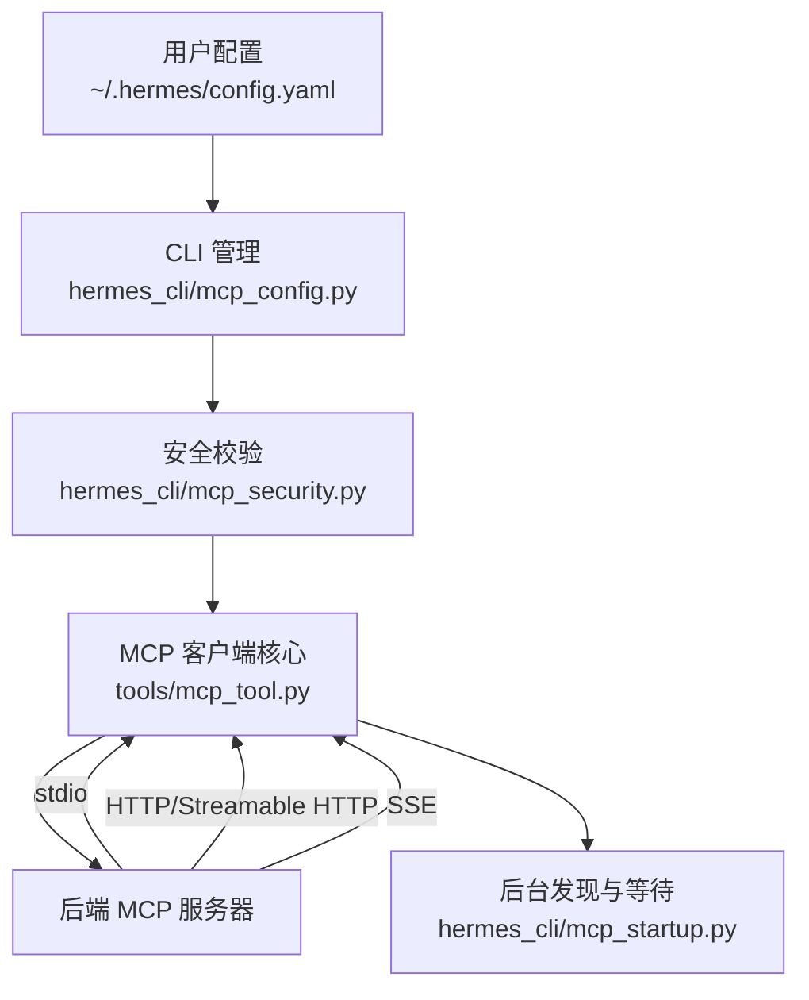
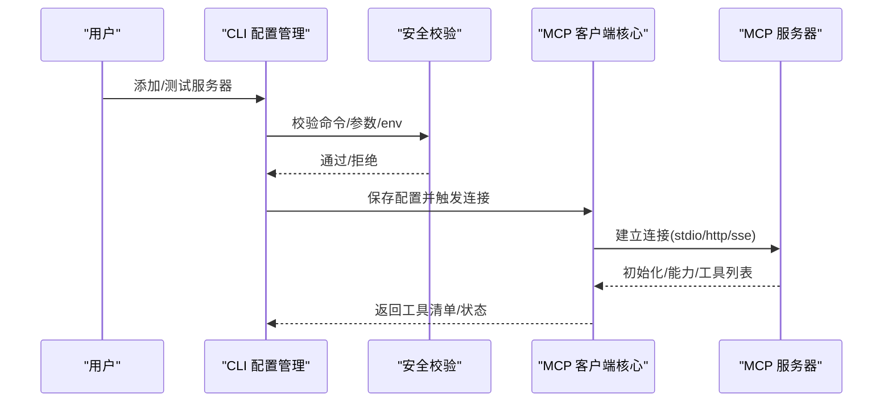
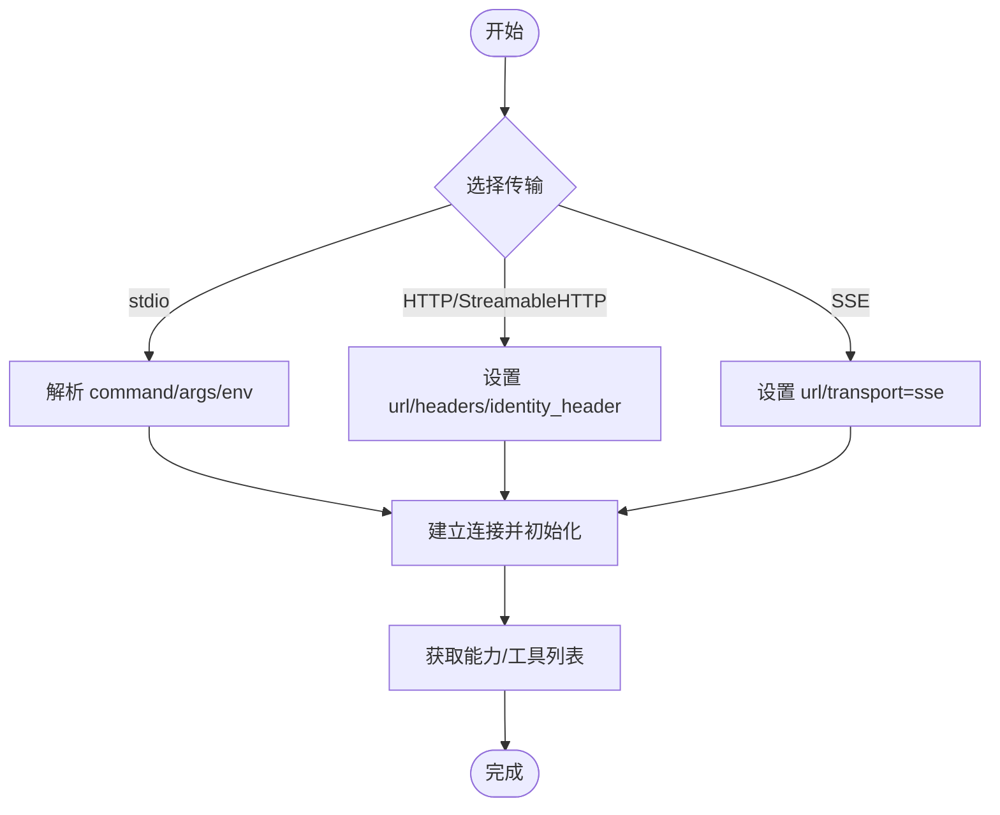
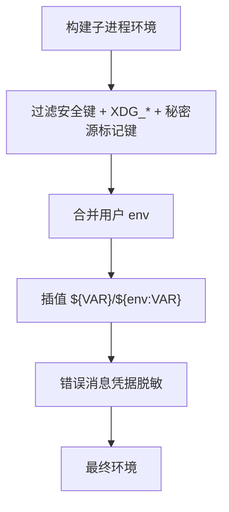
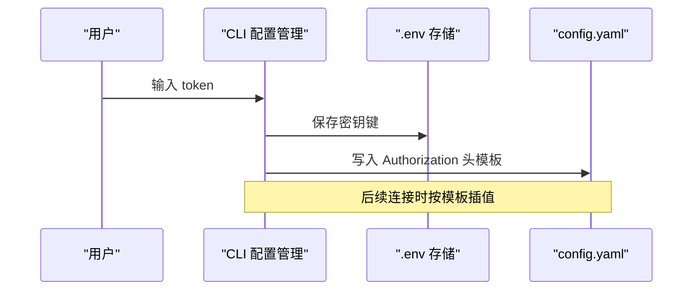
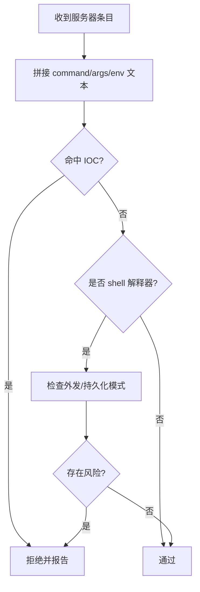
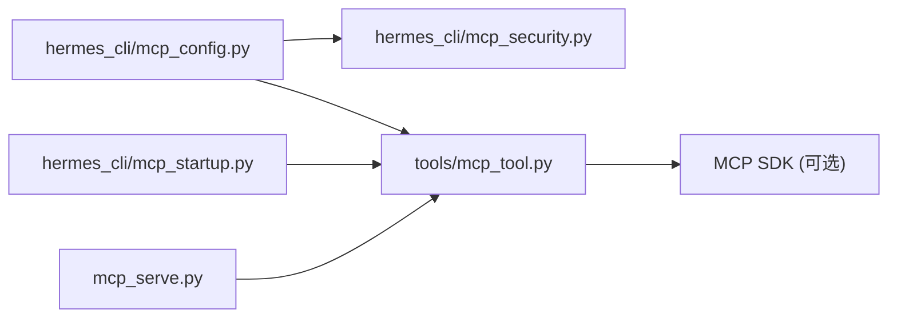

# MCP 服务器配置

<cite>
**本文引用的文件**
- [tools/mcp_tool.py](file://tools/mcp_tool.py)
- [hermes_cli/mcp_config.py](file://hermes_cli/mcp_config.py)
- [hermes_cli/mcp_security.py](file://hermes_cli/mcp_security.py)
- [hermes_cli/mcp_startup.py](file://hermes_cli/mcp_startup.py)
- [mcp_serve.py](file://mcp_serve.py)
</cite>

## 目录
1. [简介](#简介)
2. [项目结构](#项目结构)
3. [核心组件](#核心组件)
4. [架构总览](#架构总览)
5. [详细组件分析](#详细组件分析)
6. [依赖关系分析](#依赖关系分析)
7. [性能考虑](#性能考虑)
8. [故障排除指南](#故障排除指南)
9. [结论](#结论)
10. [附录：配置选项与示例](#附录：配置选项与示例)

## 简介
本文件面向需要在 Hermes Agent 中接入外部 MCP（Model Context Protocol）服务器的用户与运维人员，系统化说明配置结构、传输方式、认证与安全、采样能力以及故障排查方法。内容基于仓库中的 MCP 客户端实现与 CLI 管理逻辑，覆盖以下要点：
- 配置文件位置与键名：~/.hermes/config.yaml 下的 mcp_servers
- 传输类型：stdio、HTTP/StreamableHTTP、SSE
- 关键配置项：command、args、env、url、headers、identity_header、timeout、connect_timeout、keepalive_interval、idle/max lifetime、sampling、tools 过滤等
- 环境变量白名单与注入机制
- 安全校验与高危命令拦截
- 启动与后台发现流程
- 常见错误与排障建议

## 项目结构
围绕 MCP 的配置与运行，主要涉及以下模块：
- tools/mcp_tool.py：MCP 客户端核心，负责连接、发现、工具注册、重连、采样、环境过滤、错误脱敏等
- hermes_cli/mcp_config.py：CLI 交互式添加/测试/列出/保存 MCP 服务器配置，处理 Bearer 头模板与环境变量插值
- hermes_cli/mcp_security.py：对 stdio 命令进行安全校验，阻断可疑的 shell + 外发/持久化模式
- hermes_cli/mcp_startup.py：后台发现线程与超时控制，避免阻塞启动
- mcp_serve.py：Hermes 自身作为 MCP 服务端暴露消息会话工具（用于演示或集成场景）

图表来源
- [tools/mcp_tool.py:1-95](file://tools/mcp_tool.py#L1-L95)
- [hermes_cli/mcp_config.py:1-120](file://hermes_cli/mcp_config.py#L1-L120)
- [hermes_cli/mcp_security.py:1-182](file://hermes_cli/mcp_security.py#L1-L182)
- [hermes_cli/mcp_startup.py:1-120](file://hermes_cli/mcp_startup.py#L1-L120)

章节来源
- [tools/mcp_tool.py:1-95](file://tools/mcp_tool.py#L1-L95)
- [hermes_cli/mcp_config.py:1-120](file://hermes_cli/mcp_config.py#L1-L120)
- [hermes_cli/mcp_security.py:1-182](file://hermes_cli/mcp_security.py#L1-L182)
- [hermes_cli/mcp_startup.py:1-120](file://hermes_cli/mcp_startup.py#L1-L120)

## 核心组件
- MCP 客户端核心（tools/mcp_tool.py）
  - 支持 stdio、HTTP/StreamableHTTP、SSE 三种传输
  - 环境变量白名单过滤与用户 env 合并
  - 错误信息中的凭据脱敏
  - 自动重连、退避、空闲保活、生命周期回收
  - 采样能力（server 发起 LLM 请求）
  - 工具描述注入扫描（告警）
- CLI 配置管理（hermes_cli/mcp_config.py）
  - 交互式添加/测试/列出/删除服务器
  - 自动生成 Authorization 头模板并保存密钥到 .env
  - 解析 --env KEY=VALUE 并校验变量名
  - 预置模板（如 codex）快速填充 command/args/url
- 安全校验（hermes_cli/mcp_security.py）
  - 阻止 shell 解释器 + 网络外发/数据外泄模式
  - 阻止写入系统持久化路径（SSH/PAM/sudoers/cron/rc）
  - IOC 黑名单（已知攻击指标）
- 启动与后台发现（hermes_cli/mcp_startup.py）
  - 后台线程执行 MCP 发现，避免阻塞启动
  - 可配置的发现超时（普通/单查询模式）
  - 无交互 OAuth 抑制，防止阻塞
- 本地 MCP 服务（mcp_serve.py）
  - 以 stdio 方式暴露 Hermes 会话工具，便于其他 MCP 客户端集成

章节来源
- [tools/mcp_tool.py:97-432](file://tools/mcp_tool.py#L97-L432)
- [hermes_cli/mcp_config.py:1-183](file://hermes_cli/mcp_config.py#L1-L183)
- [hermes_cli/mcp_security.py:1-182](file://hermes_cli/mcp_security.py#L1-L182)
- [hermes_cli/mcp_startup.py:1-120](file://hermes_cli/mcp_startup.py#L1-L120)
- [mcp_serve.py:1-28](file://mcp_serve.py#L1-L28)

## 架构总览
下图展示从配置到连接的端到端流程，包括 CLI 添加、安全校验、后台发现、连接建立与工具注册。

图表来源
- [hermes_cli/mcp_config.py:415-617](file://hermes_cli/mcp_config.py#L415-L617)
- [hermes_cli/mcp_security.py:121-182](file://hermes_cli/mcp_security.py#L121-L182)
- [tools/mcp_tool.py:219-281](file://tools/mcp_tool.py#L219-L281)

## 详细组件分析

### 传输与连接
- stdio 传输
  - 使用 command 与 args 启动子进程，并通过标准输入输出通信
  - 支持父进程死亡监控（watchdog），提升稳定性
  - PATH 解析优化，确保 npx/npm/node 在受限环境中可执行
- HTTP/StreamableHTTP 传输
  - 通过 url 指定端点；可选 headers 与 identity_header
  - 支持 skip_preflight 跳过内容类型探测，适用于某些网关行为
  - keepalive_interval 维持长连接存活，避免空闲过期
- SSE 传输
  - 通过 transport: sse 启用；适合仅支持 SSE 的服务器
  - 与 HTTP 共享部分连接与保活逻辑

图表来源
- [tools/mcp_tool.py:1-95](file://tools/mcp_tool.py#L1-L95)
- [tools/mcp_tool.py:219-281](file://tools/mcp_tool.py#L219-L281)

章节来源
- [tools/mcp_tool.py:702-774](file://tools/mcp_tool.py#L702-L774)
- [tools/mcp_tool.py:219-281](file://tools/mcp_tool.py#L219-L281)

### 环境变量与注入
- 安全白名单
  - 基础安全键：PATH、HOME、USER、LANG、LC_ALL、TERM、SHELL、TMPDIR
  - Windows 兼容键：ALLUSERSPROFILE、APPDATA、COMMONPROGRAMFILES 等
  - XDG_* 变量透传
- 用户自定义 env
  - 来自服务器配置的 env 会合并到白名单后的环境
  - CLI 支持 --env KEY=VALUE 并校验变量名格式
- 插值与引用
  - 支持 ${VAR} 与 Cursor 风格 ${env:VAR}
  - 上下文变量：userHome、workspaceFolder、workspaceFolderBasename、pathSeparator
- 错误脱敏
  - 错误消息中的凭据模式会被替换为占位符，避免泄露

图表来源
- [tools/mcp_tool.py:376-432](file://tools/mcp_tool.py#L376-L432)
- [tools/mcp_tool.py:493-533](file://tools/mcp_tool.py#L493-L533)
- [hermes_cli/mcp_config.py:199-215](file://hermes_cli/mcp_config.py#L199-L215)

章节来源
- [tools/mcp_tool.py:376-432](file://tools/mcp_tool.py#L376-L432)
- [tools/mcp_tool.py:493-533](file://tools/mcp_tool.py#L493-L533)
- [hermes_cli/mcp_config.py:199-215](file://hermes_cli/mcp_config.py#L199-L215)

### 认证与头部
- Bearer 认证
  - CLI 引导用户输入 token，保存到 .env 对应键
  - 自动生成 Authorization: Bearer ${MCP_<NAME>_API_KEY} 模板
  - 自动去除粘贴时可能包含的 Bearer 前缀
- identity_header
  - 为 HTTP/SSE 请求附加 per-user 身份头
  - value_from: static/profile；static 需显式 value，profile 使用当前 Hermes profile 名称

图表来源
- [hermes_cli/mcp_config.py:153-196](file://hermes_cli/mcp_config.py#L153-L196)

章节来源
- [hermes_cli/mcp_config.py:153-196](file://hermes_cli/mcp_config.py#L153-L196)

### 采样（Sampling）
- 启用与限制
  - sampling.enabled：默认开启
  - model：可选覆盖模型
  - max_tokens_cap：单次最大 token 数
  - timeout：LLM 调用超时
  - max_rpm：每分钟最大请求数
  - allowed_models：模型白名单（空表示全部允许）
  - max_tool_rounds：工具循环上限（0 禁用）
  - log_level：审计日志级别
- 作用
  - 允许 MCP 服务器向客户端发起 LLM 请求，实现“服务器即工具”的能力

章节来源
- [tools/mcp_tool.py:1-95](file://tools/mcp_tool.py#L1-L95)

### 工具过滤与能力探测
- tools.include / tools.exclude：精确控制启用的工具集合
- prompts/resources 探测：根据服务器能力与配置决定是否探测
- 分页拉取：遵循 nextCursor 遍历，最多 50 页，防止无限循环

章节来源
- [hermes_cli/mcp_config.py:324-367](file://hermes_cli/mcp_config.py#L324-L367)
- [tools/mcp_tool.py:655-699](file://tools/mcp_tool.py#L655-L699)

### 安全校验
- 危险形状检测
  - shell 解释器 + 网络外发（curl/wget/nc/Invoke-WebRequest 等）
  - shell 解释器 + 写入系统持久化路径（authorized_keys、/etc/ssh、sudoers、cron、rc 等）
- IOC 黑名单
  - 已知攻击指标（公钥、IP、字符串）直接拒绝
- 应用时机
  - 保存配置时（CLI/Dashboard API）
  - 启动/发现时（运行时过滤）

图表来源
- [hermes_cli/mcp_security.py:121-182](file://hermes_cli/mcp_security.py#L121-L182)

章节来源
- [hermes_cli/mcp_security.py:1-182](file://hermes_cli/mcp_security.py#L1-L182)

### 启动与后台发现
- 后台发现线程
  - 非阻塞启动，避免长时间冷启动
  - 支持重试：若首次无连接成功，后续可再次尝试
  - 抑制交互 OAuth，防止阻塞
- 超时策略
  - 普通模式：mcp_discovery_timeout（默认较短）
  - 单查询模式：mcp_single_query_discovery_timeout（更长，保证一次性会话能捕获慢服务器）

章节来源
- [hermes_cli/mcp_startup.py:14-120](file://hermes_cli/mcp_startup.py#L14-L120)
- [hermes_cli/mcp_startup.py:122-195](file://hermes_cli/mcp_startup.py#L122-L195)

## 依赖关系分析
- CLI 层依赖安全校验与配置读写
- 客户端核心依赖 MCP SDK（可选），并动态适配不同版本特性
- 启动模块依赖配置读取与 OAuth 抑制能力
- 本地服务模块独立提供 MCP 工具集，便于集成

图表来源
- [hermes_cli/mcp_config.py:1-120](file://hermes_cli/mcp_config.py#L1-L120)
- [hermes_cli/mcp_security.py:1-182](file://hermes_cli/mcp_security.py#L1-L182)
- [tools/mcp_tool.py:219-281](file://tools/mcp_tool.py#L219-L281)
- [hermes_cli/mcp_startup.py:1-120](file://hermes_cli/mcp_startup.py#L1-L120)
- [mcp_serve.py:1-28](file://mcp_serve.py#L1-L28)

章节来源
- [hermes_cli/mcp_config.py:1-120](file://hermes_cli/mcp_config.py#L1-L120)
- [hermes_cli/mcp_security.py:1-182](file://hermes_cli/mcp_security.py#L1-L182)
- [tools/mcp_tool.py:219-281](file://tools/mcp_tool.py#L219-L281)
- [hermes_cli/mcp_startup.py:1-120](file://hermes_cli/mcp_startup.py#L1-L120)
- [mcp_serve.py:1-28](file://mcp_serve.py#L1-L28)

## 性能考虑
- 连接与重连
  - 指数退避与抖动，避免雪崩
  - 空闲保活间隔可调，匹配后端会话 TTL
  - 生命周期回收：idle/max lifetime，减少僵尸进程
- 工具发现
  - 分页限制（最多 50 页），防止无限拉取
  - 能力探测受 tools.prompts/resources 开关控制
- 启动等待
  - 后台发现 + 可配置超时，避免阻塞首屏
  - 单查询模式更宽松，保障一次性任务可用

章节来源
- [tools/mcp_tool.py:338-374](file://tools/mcp_tool.py#L338-L374)
- [tools/mcp_tool.py:655-699](file://tools/mcp_tool.py#L655-L699)
- [hermes_cli/mcp_startup.py:122-195](file://hermes_cli/mcp_startup.py#L122-L195)

## 故障排除指南
- 连接失败
  - 检查 url/command/args/env 是否正确
  - 查看错误消息中的凭据已被脱敏，确认是否为网络/鉴权问题
  - 调整 connect_timeout 与 keepalive_interval
- 工具未出现
  - 检查 tools.include/exclude 过滤
  - 确认服务器能力（prompts/resources）与探测开关
  - 关注分页限制与 nextCursor 行为
- 启动卡顿
  - 调整 mcp_discovery_timeout 或 mcp_single_query_discovery_timeout
  - 确认后台发现线程是否被抑制交互 OAuth
- 安全拦截
  - 若被拒绝，检查是否存在 shell + 外发/持久化模式或 IOC 命中
  - 修改 command/args/env 以规避危险形状

章节来源
- [tools/mcp_tool.py:526-533](file://tools/mcp_tool.py#L526-L533)
- [hermes_cli/mcp_startup.py:122-195](file://hermes_cli/mcp_startup.py#L122-L195)
- [hermes_cli/mcp_security.py:121-182](file://hermes_cli/mcp_security.py#L121-L182)

## 结论
本配置体系通过 CLI 简化了 MCP 服务器的接入与管理，结合严格的安全校验与环境隔离，确保在多种传输方式下稳定可靠地工作。通过可配置的超时、保活与生命周期回收，兼顾了性能与健壮性；采样能力进一步扩展了 MCP 服务器的智能协作空间。建议在生产环境中结合最小权限原则与严格的 env 白名单，配合定期审计与监控，最大化降低风险。

## 附录：配置选项与示例

### 配置结构与默认值
- 通用
  - enabled：是否启用（默认 true）
  - connect_timeout：初始连接超时（秒，默认约 60）
  - timeout：工具调用超时（秒，默认约 300）
  - keepalive_interval：HTTP/SSE 保活间隔（秒，默认约 180，下限 5）
  - idle_timeout_seconds：stdio 空闲回收时间（秒，0 禁用）
  - max_lifetime_seconds：stdio 最大生命周期（秒，0 禁用）
  - lifecycle：可替代上述回收字段（见注释）
  - supports_parallel_tool_calls：是否允许并发工具调用（布尔）
  - skip_preflight：跳过 Streamable HTTP 内容类型探测（布尔）
- stdio
  - command：要执行的命令
  - args：命令参数数组
  - env：环境变量映射（与白名单合并）
- HTTP/StreamableHTTP
  - url：服务端地址
  - headers：请求头（支持 ${VAR} 插值）
  - identity_header：
    - name：头名
    - value_from：static 或 profile
    - value：静态值（当 value_from=static 时必须）
- SSE
  - transport：sse
  - url：服务端地址
- 工具与能力
  - tools.include：工具白名单
  - tools.exclude：工具黑名单
  - tools.prompts：是否探测 prompts（布尔）
  - tools.resources：是否探测 resources（布尔）
- 采样
  - sampling.enabled：是否启用（默认 true）
  - sampling.model：覆盖模型（可选）
  - sampling.max_tokens_cap：单次最大 token
  - sampling.timeout：LLM 调用超时（秒）
  - sampling.max_rpm：每分钟最大请求数
  - sampling.allowed_models：模型白名单（空=全部）
  - sampling.max_tool_rounds：工具循环上限（0 禁用）
  - sampling.log_level：审计日志级别

章节来源
- [tools/mcp_tool.py:1-95](file://tools/mcp_tool.py#L1-L95)
- [tools/mcp_tool.py:338-374](file://tools/mcp_tool.py#L338-L374)
- [tools/mcp_tool.py:655-699](file://tools/mcp_tool.py#L655-L699)

### 示例配置

- 本地文件系统服务器（stdio）
  - 传输：stdio
  - 关键点：command、args、env（如需）、timeout、connect_timeout
  - 参考路径
    - [tools/mcp_tool.py:1-95](file://tools/mcp_tool.py#L1-L95)

- GitHub API 服务器（stdio）
  - 传输：stdio
  - 关键点：command、args、env（GITHUB_PERSONAL_ACCESS_TOKEN）
  - 参考路径
    - [tools/mcp_tool.py:1-95](file://tools/mcp_tool.py#L1-L95)

- 远程 API 服务器（HTTP/StreamableHTTP）
  - 传输：HTTP/StreamableHTTP
  - 关键点：url、headers（Authorization 模板）、identity_header（name/value_from/value）、timeout、skip_preflight
  - 参考路径
    - [tools/mcp_tool.py:1-95](file://tools/mcp_tool.py#L1-L95)

- SSE 服务器
  - 传输：SSE
  - 关键点：transport=sse、url、timeout、connect_timeout
  - 参考路径
    - [tools/mcp_tool.py:1-95](file://tools/mcp_tool.py#L1-L95)

- 采样配置（适用于任意传输）
  - 关键点：sampling.* 各项
  - 参考路径
    - [tools/mcp_tool.py:1-95](file://tools/mcp_tool.py#L1-L95)

### 环境变量过滤机制
- 白名单键：PATH、HOME、USER、LANG、LC_ALL、TERM、SHELL、TMPDIR
- Windows 兼容键：ALLUSERSPROFILE、APPDATA、COMMONPROGRAMFILES 等
- XDG_* 透传
- 秘密源注入键：由外部秘密源标记的键可透传
- 用户 env：与白名单合并后生效
- 插值：${VAR} 与 ${env:VAR}，支持 userHome/workspaceFolder 等上下文变量

章节来源
- [tools/mcp_tool.py:376-432](file://tools/mcp_tool.py#L376-L432)
- [tools/mcp_tool.py:493-533](file://tools/mcp_tool.py#L493-L533)

### 安全考虑
- 禁止 shell 解释器 + 网络外发/数据外泄
- 禁止 shell 解释器 + 写入系统持久化路径
- IOC 黑名单直接拒绝
- 错误消息凭据脱敏
- CLI 保存前强制校验，启动/发现时再次过滤

章节来源
- [hermes_cli/mcp_security.py:121-182](file://hermes_cli/mcp_security.py#L121-L182)
- [tools/mcp_tool.py:526-533](file://tools/mcp_tool.py#L526-L533)

### 故障排除方法
- 连接失败：检查 url/command/args/env，调整 connect_timeout/keepalive_interval
- 工具缺失：检查 tools.include/exclude、能力探测开关、分页限制
- 启动卡顿：调整 discovery 超时，确认后台发现线程未被阻塞
- 安全拦截：修正 command/args/env 以规避危险形状或 IOC 命中

章节来源
- [hermes_cli/mcp_startup.py:122-195](file://hermes_cli/mcp_startup.py#L122-L195)
- [hermes_cli/mcp_security.py:121-182](file://hermes_cli/mcp_security.py#L121-L182)
- [tools/mcp_tool.py:655-699](file://tools/mcp_tool.py#L655-L699)