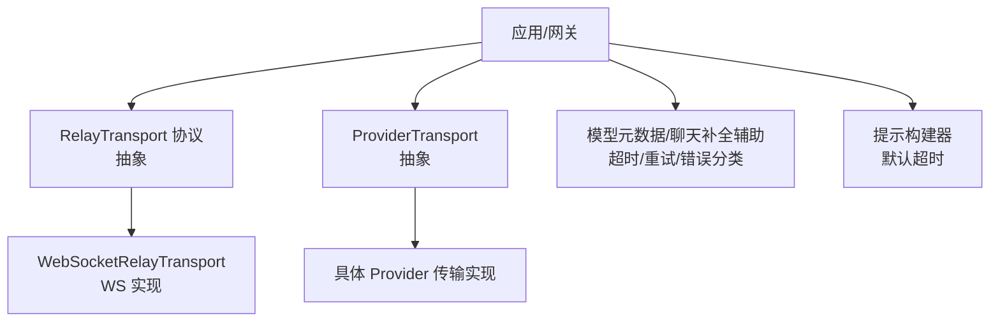
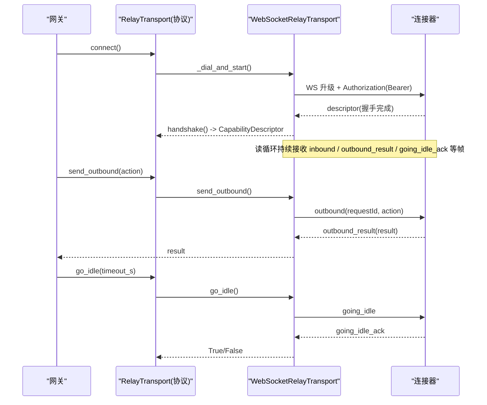
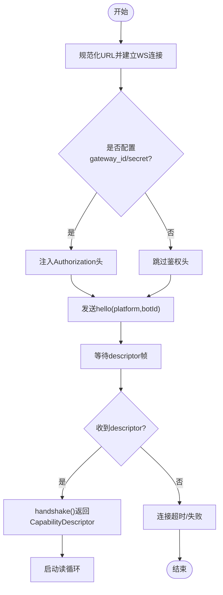
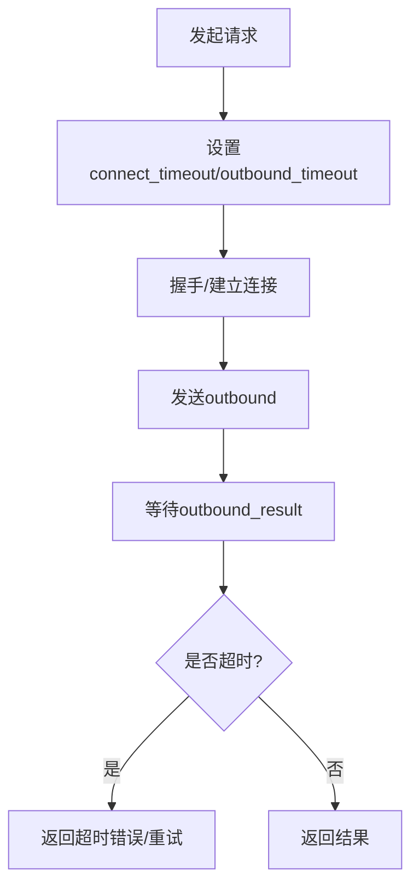
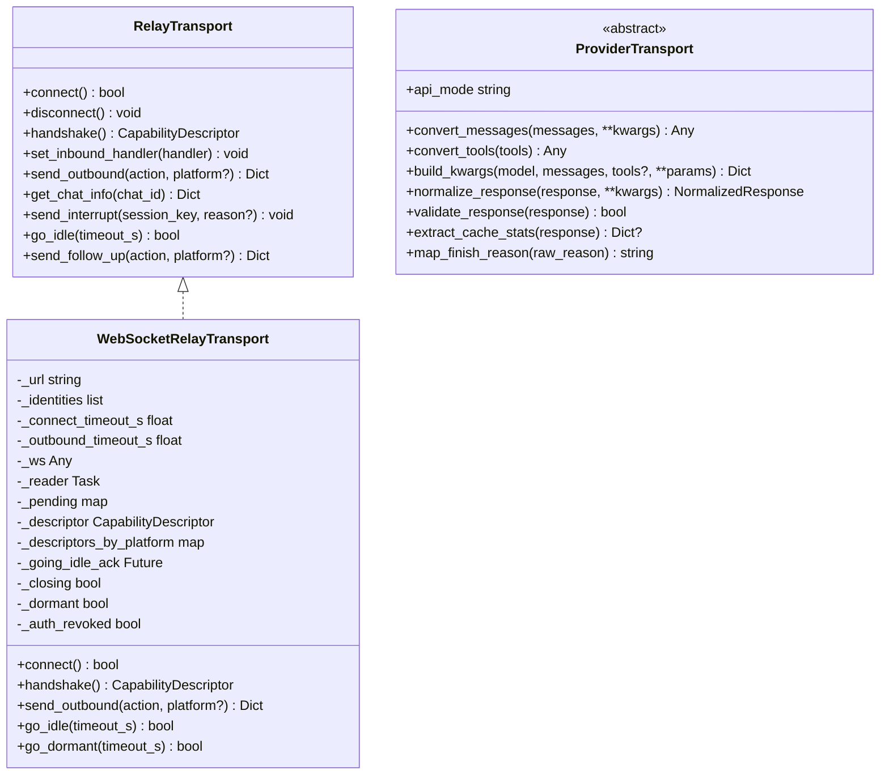

# HTTP/StreamableHTTP 传输

<cite>
**本文引用的文件**
- [gateway/relay/transport.py](file://gateway/relay/transport.py)
- [gateway/relay/ws_transport.py](file://gateway/relay/ws_transport.py)
- [agent/transports/base.py](file://agent/transports/base.py)
- [agent/model_metadata.py](file://agent/model_metadata.py)
- [agent/chat_completion_helpers.py](file://agent/chat_completion_helpers.py)
- [agent/prompt_builder.py](file://agent/prompt_builder.py)
</cite>

## 目录
1. [简介](#简介)
2. [项目结构](#项目结构)
3. [核心组件](#核心组件)
4. [架构总览](#架构总览)
5. [详细组件分析](#详细组件分析)
6. [依赖关系分析](#依赖关系分析)
7. [性能考量](#性能考量)
8. [故障排查指南](#故障排查指南)
9. [结论](#结论)
10. [附录](#附录)

## 简介
本文件聚焦于 HTTP/StreamableHTTP 传输在系统中的实现与使用方式，覆盖连接管理、身份验证（Authorization）、请求头处理、超时控制（connect_timeout、timeout）、预检机制（skip_preflight）、会话管理与连接池、SSE 支持与事件流处理、配置示例、性能优化与故障恢复策略，以及与标准 HTTP 的差异说明。文档同时给出调试工具与监控指标建议，帮助在生产环境中稳定运行并快速定位问题。

## 项目结构
与 HTTP/StreamableHTTP 相关的代码主要分布在以下模块：
- 网关侧的“中继传输协议”抽象与 WebSocket 实现，定义了连接生命周期、握手、入站/出站消息、中断、空闲/休眠等能力。
- 代理传输层抽象，定义消息/工具转换与响应归一化接口，供上层统一调用。
- 模型元数据与聊天补全辅助模块，提供连接超时识别、请求超时解析与默认值等通用逻辑。
- 提示构建器中可见对 timeout 的默认值设置，体现端到端超时链路的起点之一。

图表来源
- [gateway/relay/transport.py:1-144](file://gateway/relay/transport.py#L1-L144)
- [gateway/relay/ws_transport.py:339-541](file://gateway/relay/ws_transport.py#L339-L541)
- [agent/transports/base.py:16-90](file://agent/transports/base.py#L16-L90)
- [agent/model_metadata.py:218-220](file://agent/model_metadata.py#L218-L220)
- [agent/chat_completion_helpers.py:3191-3199](file://agent/chat_completion_helpers.py#L3191-L3199)
- [agent/prompt_builder.py:1114-1114](file://agent/prompt_builder.py#L1114-L1114)

章节来源
- [gateway/relay/transport.py:1-144](file://gateway/relay/transport.py#L1-L144)
- [gateway/relay/ws_transport.py:339-541](file://gateway/relay/ws_transport.py#L339-L541)
- [agent/transports/base.py:16-90](file://agent/transports/base.py#L16-L90)
- [agent/model_metadata.py:218-220](file://agent/model_metadata.py#L218-L220)
- [agent/chat_completion_helpers.py:3191-3199](file://agent/chat_completion_helpers.py#L3191-L3199)
- [agent/prompt_builder.py:1114-1114](file://agent/prompt_builder.py#L1114-L1114)

## 核心组件
- RelayTransport 协议：定义连接生命周期（connect/disconnect）、握手（handshake）、入站回调注册（set_inbound_handler）、出站发送（send_outbound/get_chat_info/send_interrupt）、空闲切换（go_idle）以及可选的 passthrough/follow_up 能力。
- WebSocketRelayTransport：基于 websockets 的具体实现，负责 WS 拨号、鉴权头注入、心跳/重连、帧编解码、缓冲/去重、授权撤销处理、休眠/唤醒等。
- ProviderTransport 抽象：将消息/工具转换为上游 provider 格式，并归一化响应；不包含客户端构造、流式、凭据刷新、中断与重试逻辑。
- 超时与错误：模型元数据模块提供连接超时识别；聊天补全辅助模块提供 per-provider/request 超时解析；提示构建器提供默认超时。

章节来源
- [gateway/relay/transport.py:41-144](file://gateway/relay/transport.py#L41-L144)
- [gateway/relay/ws_transport.py:339-541](file://gateway/relay/ws_transport.py#L339-L541)
- [agent/transports/base.py:16-90](file://agent/transports/base.py#L16-L90)
- [agent/model_metadata.py:218-220](file://agent/model_metadata.py#L218-L220)
- [agent/chat_completion_helpers.py:3191-3199](file://agent/chat_completion_helpers.py#L3191-L3199)
- [agent/prompt_builder.py:1114-1114](file://agent/prompt_builder.py#L1114-L1114)

## 架构总览
下图展示了从网关到连接器（connector）的通信路径，包括握手、入站事件、出站动作、中断与空闲/休眠流程。

图表来源
- [gateway/relay/transport.py:45-115](file://gateway/relay/transport.py#L45-L115)
- [gateway/relay/ws_transport.py:441-541](file://gateway/relay/ws_transport.py#L441-L541)
- [gateway/relay/ws_transport.py:609-632](file://gateway/relay/ws_transport.py#L609-L632)
- [gateway/relay/ws_transport.py:692-723](file://gateway/relay/ws_transport.py#L692-L723)

## 详细组件分析

### 连接管理与握手
- 连接建立：通过 _ws_dial_url 规范化 URL（http->ws，https->wss，确保路径为 /relay），并使用 websockets.connect 建立连接。
- 握手：发送 hello（含 platform/botId，必要时携带 command_manifest），等待 descriptor 帧返回，填充多平台 descriptors_by_platform。
- 鉴权：当配置了 gateway_id 与 upgrade_secret 时，自动注入 Authorization: Bearer <token> 至 WS 升级头；若后续收到 4401 且已握手成功，则视为授权撤销，停止重连。
- 会话状态：维护 _descriptor_ready、_descriptors_by_platform、_pending 请求映射、_going_idle_ack、_closing、_dormant、_auth_revoked 等状态。

图表来源
- [gateway/relay/ws_transport.py:69-95](file://gateway/relay/ws_transport.py#L69-L95)
- [gateway/relay/ws_transport.py:445-484](file://gateway/relay/ws_transport.py#L445-L484)
- [gateway/relay/ws_transport.py:486-501](file://gateway/relay/ws_transport.py#L486-L501)
- [gateway/relay/ws_transport.py:536-541](file://gateway/relay/ws_transport.py#L536-L541)

章节来源
- [gateway/relay/ws_transport.py:69-95](file://gateway/relay/ws_transport.py#L69-L95)
- [gateway/relay/ws_transport.py:445-501](file://gateway/relay/ws_transport.py#L445-L501)
- [gateway/relay/ws_transport.py:536-541](file://gateway/relay/ws_transport.py#L536-L541)

### 身份验证（Authorization）与请求头处理
- WS 升级阶段：当存在 per-gateway secret 与 gateway_id 时，生成签名 token 并通过 Authorization: Bearer 传递。
- 认证失败处理：若握手成功后收到 4401 关闭码，标记 auth_revoked=true，不再尝试重连，避免无效重试风暴。
- 请求头透传：passthrough_forward 场景下，连接器会转发原始 HTTP 请求的 headers/body，由网关侧按业务需求处理。

章节来源
- [gateway/relay/ws_transport.py:486-501](file://gateway/relay/ws_transport.py#L486-L501)
- [gateway/relay/ws_transport.py:745-758](file://gateway/relay/ws_transport.py#L745-L758)
- [gateway/relay/ws_transport.py:877-886](file://gateway/relay/ws_transport.py#L877-L886)

### 超时控制（connect_timeout、timeout）
- 连接/握手超时：handshake() 等待 descriptor 时使用 connect_timeout_s；默认常量 _HANDSHAKE_TIMEOUT_S=30s。
- 出站超时：send_outbound/_request_response 使用 outbound_timeout_s；默认常量 _OUTBOUND_TIMEOUT_S=30s。
- 下游请求超时：聊天补全辅助模块支持 per-provider/request request_timeout_seconds；提示构建器提供默认 timeout（如 180s）。
- 连接超时识别：模型元数据模块提供 _is_connect_timeout 用于区分连接类异常，便于上层做差异化重试/降级。

图表来源
- [gateway/relay/ws_transport.py:53-59](file://gateway/relay/ws_transport.py#L53-L59)
- [gateway/relay/ws_transport.py:536-541](file://gateway/relay/ws_transport.py#L536-L541)
- [gateway/relay/ws_transport.py:692-723](file://gateway/relay/ws_transport.py#L692-L723)
- [agent/chat_completion_helpers.py:3191-3199](file://agent/chat_completion_helpers.py#L3191-L3199)
- [agent/prompt_builder.py:1114-1114](file://agent/prompt_builder.py#L1114-L1114)
- [agent/model_metadata.py:218-220](file://agent/model_metadata.py#L218-L220)

章节来源
- [gateway/relay/ws_transport.py:53-59](file://gateway/relay/ws_transport.py#L53-L59)
- [gateway/relay/ws_transport.py:536-541](file://gateway/relay/ws_transport.py#L536-L541)
- [gateway/relay/ws_transport.py:692-723](file://gateway/relay/ws_transport.py#L692-L723)
- [agent/chat_completion_helpers.py:3191-3199](file://agent/chat_completion_helpers.py#L3191-L3199)
- [agent/prompt_builder.py:1114-1114](file://agent/prompt_builder.py#L1114-L1114)
- [agent/model_metadata.py:218-220](file://agent/model_metadata.py#L218-L220)

### 预检机制（skip_preflight）
- 在本仓库中，“preflight”更多出现在上下文压缩、LLM 调用前的估算与校验环节（例如上下文压缩器的 preflight 估计、某些适配器的输入预检）。当前 HTTP/WS 传输层未直接暴露 skip_preflight 开关；如需跳过预检，应在上层调用链（如 LLM 调用或上下文压缩决策）中根据配置或条件判断决定是否执行预检步骤。
- 实践建议：在高吞吐场景下，可结合模型元数据的连接超时识别与请求超时配置，减少不必要的预检开销；对于关键路径，保留预检以保障稳定性。

章节来源
- [agent/context_compressor.py:2681-2707](file://agent/context_compressor.py#L2681-L2707)
- [agent/codex_responses_adapter.py:697-700](file://agent/codex_responses_adapter.py#L697-L700)
- [agent/codex_responses_adapter.py:933-962](file://agent/codex_responses_adapter.py#L933-L962)

### 会话管理与连接池
- 会话键与上下文：入站事件包含 source 信息（platform/chat_id/user_id 等），用于构建 session_key 与路由；多平台场景下通过 descriptors_by_platform 区分不同平台的特性。
- 连接复用：WS 连接为长连接，read_loop 持续消费帧；reconnect supervisor 在意外断开后指数退避重连；go_dormant/go_idle 支持零扩缩容与缓冲模式。
- 连接池：当前实现以单实例连接为主；若需连接池，可在网关层封装多个 transport 实例并按会话/平台选择连接，配合健康检查与负载均衡。

章节来源
- [gateway/relay/ws_transport.py:172-288](file://gateway/relay/ws_transport.py#L172-L288)
- [gateway/relay/ws_transport.py:543-553](file://gateway/relay/ws_transport.py#L543-L553)
- [gateway/relay/ws_transport.py:791-822](file://gateway/relay/ws_transport.py#L791-L822)
- [gateway/relay/ws_transport.py:634-678](file://gateway/relay/ws_transport.py#L634-L678)

### SSE 支持与事件流处理
- 当前 WS 传输采用 newline-delimited JSON 帧（inbound/outbound_result/going_idle_ack 等），并非传统 SSE text/event-stream。但语义上等价于“服务端推送事件”，具备低延迟、双向通信与可靠回执（bufferId ack）能力。
- 事件流处理：读循环累积缓冲区，按行拆分，逐条解析并分发到对应处理器（inbound、outbound_result、going_idle_ack、interrupt_inbound、passthrough_forward）。
- 与标准 HTTP 的区别：WS 适合长连接与实时事件；标准 HTTP 更适合无状态请求/响应。若必须使用 HTTP SSE，需在网关层实现 SSE 端点并将内部事件流桥接到 HTTP 响应流。

章节来源
- [gateway/relay/ws_transport.py:731-741](file://gateway/relay/ws_transport.py#L731-L741)
- [gateway/relay/ws_transport.py:823-889](file://gateway/relay/ws_transport.py#L823-L889)

### 与标准 HTTP 的区别
- 连接模型：WS 为全双工长连接；HTTP 为请求/响应短连接（除非使用流式）。
- 认证：WS 在升级阶段通过 Authorization 头进行鉴权；HTTP 通常在每个请求头携带。
- 事件流：WS 通过帧类型区分消息；HTTP SSE 通过 event/data 字段推送。
- 可靠性：WS 支持 bufferId 确认与重放；HTTP 通常依赖应用层 ACK。

章节来源
- [gateway/relay/ws_transport.py:486-501](file://gateway/relay/ws_transport.py#L486-L501)
- [gateway/relay/ws_transport.py:680-690](file://gateway/relay/ws_transport.py#L680-L690)
- [gateway/relay/ws_transport.py:852-862](file://gateway/relay/ws_transport.py#L852-L862)

## 依赖关系分析
- 网关侧依赖：websockets（可选，缺失时抛出运行时错误）；gateway.platforms.base.MessageEvent；gateway.session.SessionSource；gateway.relay.descriptor.CapabilityDescriptor。
- 传输抽象：RelayTransport 协议被 ws_transport 实现；ProviderTransport 抽象被各 provider 传输实现复用。
- 超时与错误：model_metadata 提供连接超时识别；chat_completion_helpers 提供 per-request 超时解析；prompt_builder 提供默认超时。

图表来源
- [gateway/relay/transport.py:41-144](file://gateway/relay/transport.py#L41-L144)
- [gateway/relay/ws_transport.py:339-541](file://gateway/relay/ws_transport.py#L339-L541)
- [agent/transports/base.py:16-90](file://agent/transports/base.py#L16-L90)

章节来源
- [gateway/relay/transport.py:41-144](file://gateway/relay/transport.py#L41-L144)
- [gateway/relay/ws_transport.py:339-541](file://gateway/relay/ws_transport.py#L339-L541)
- [agent/transports/base.py:16-90](file://agent/transports/base.py#L16-L90)

## 性能考量
- 连接复用与重连：WS 长连接减少握手开销；指数退避重连降低雪崩风险。
- 超时调优：合理设置 connect_timeout 与 outbound_timeout，避免长时间阻塞；per-request 超时与默认超时协同，防止慢下游拖垮整体。
- 缓冲与去重：bufferId 确认机制保证可靠投递，避免重复处理；go_idle 切换缓冲模式，利于优雅停机与零扩缩容。
- 资源释放：disconnect 时取消 reader/supervisor，清理 pending futures，避免悬挂任务。
- 鉴权与头部：仅在需要时注入 Authorization，减少不必要开销；passthrough 场景保持 header 顺序与字节一致性。

[本节为通用指导，不直接分析具体文件]

## 故障排查指南
- 连接失败/握手超时：检查 URL 规范化是否正确（scheme/path），确认 connector 可达；查看 handshake 超时日志。
- 授权撤销（4401）：若握手成功后收到 4401，视为凭证撤销，停止重连；需重新配置/启用实例。
- 出站超时：检查 outbound_timeout 与下游处理能力；必要时调整超时或扩容。
- 读循环异常：捕获 JSON 解析失败、网络异常等；记录警告日志并触发重连。
- 会话丢失/重复：确认 bufferId 确认链路正常；检查 reconnect 后的重放行为。

章节来源
- [gateway/relay/ws_transport.py:536-541](file://gateway/relay/ws_transport.py#L536-L541)
- [gateway/relay/ws_transport.py:745-758](file://gateway/relay/ws_transport.py#L745-L758)
- [gateway/relay/ws_transport.py:823-828](file://gateway/relay/ws_transport.py#L823-L828)
- [gateway/relay/ws_transport.py:852-862](file://gateway/relay/ws_transport.py#L852-L862)

## 结论
本系统通过 RelayTransport 协议与 WebSocketRelayTransport 实现，提供了可靠的连接管理、鉴权、超时控制、事件流处理与重连机制。虽然当前未直接使用 HTTP SSE，但其帧式事件流在功能上等价并可扩展。结合 per-request 超时、默认超时与连接超时识别，可实现稳定的端到端超时链路。生产环境建议关注授权撤销、超时调优与缓冲确认，以提升鲁棒性与性能。

[本节为总结性内容，不直接分析具体文件]

## 附录

### 配置示例（节选）
- 连接器地址与路径：GATEWAY_RELAY_URL（会被规范化为 ws(s)://.../relay）。
- 鉴权：gateway_id 与 upgrade_secret（用于生成 Authorization Bearer）。
- 超时：connect_timeout_s（握手）、outbound_timeout_s（出站）、per-request request_timeout_seconds（下游）。
- 默认超时：提示构建器中的 timeout 默认值（如 180s）。

章节来源
- [gateway/relay/ws_transport.py:69-95](file://gateway/relay/ws_transport.py#L69-L95)
- [gateway/relay/ws_transport.py:486-501](file://gateway/relay/ws_transport.py#L486-L501)
- [gateway/relay/ws_transport.py:53-59](file://gateway/relay/ws_transport.py#L53-L59)
- [agent/chat_completion_helpers.py:3191-3199](file://agent/chat_completion_helpers.py#L3191-L3199)
- [agent/prompt_builder.py:1114-1114](file://agent/prompt_builder.py#L1114-L1114)

### 调试工具与监控指标
- 调试工具：
  - 启用详细日志（relay-ws-reader、relay-ws-reconnect、handshake、outbound_result）。
  - 抓包分析 WS 升级帧与鉴权头。
  - 模拟 4401 关闭码验证授权撤销路径。
- 监控指标：
  - 连接建立耗时（握手时间）。
  - 出站请求耗时分布与超时率。
  - 重连次数与退避曲线。
  - 授权撤销事件计数。
  - 缓冲确认成功率（bufferId ack）。

[本节为通用指导，不直接分析具体文件]