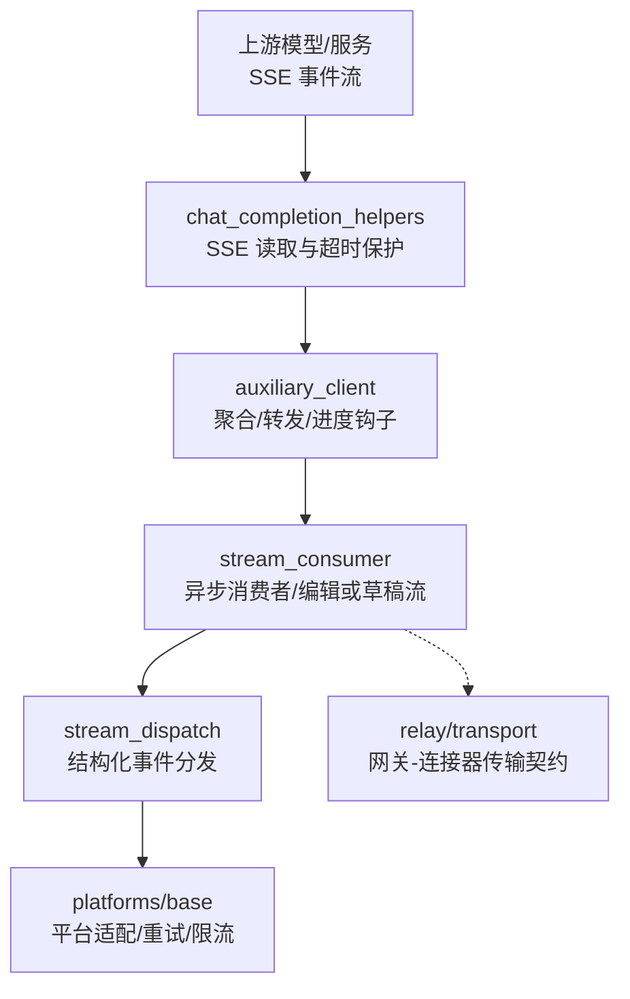
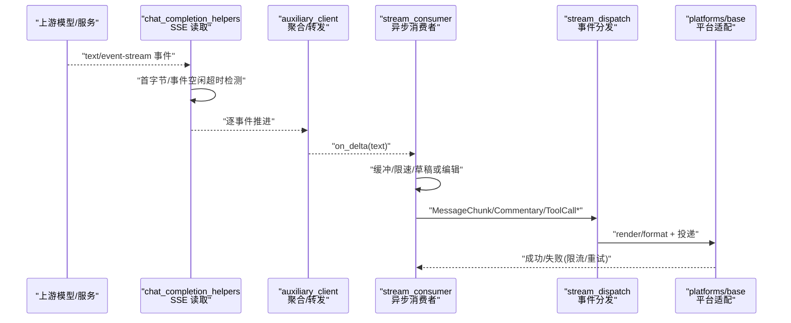
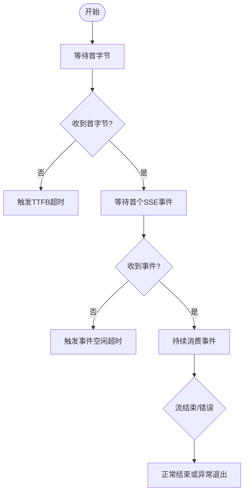
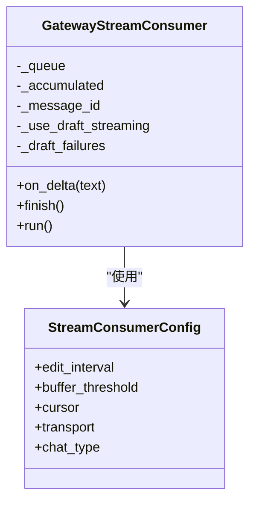
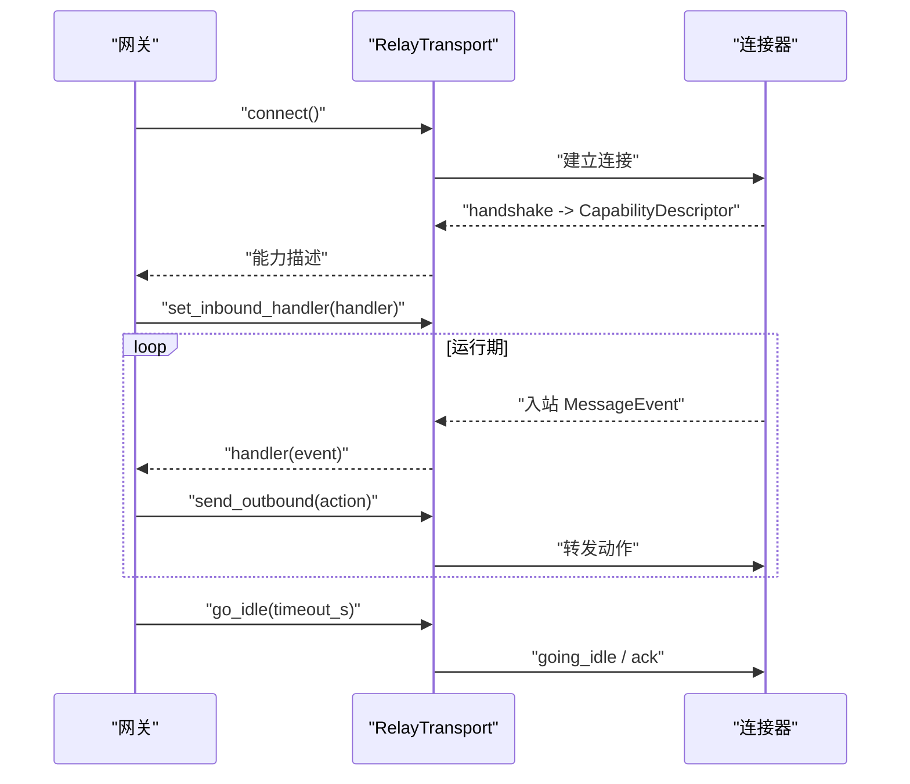
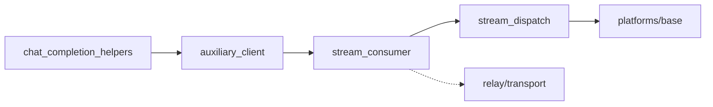

# SSE 传输

<cite>
**本文引用的文件**
- [agent/chat_completion_helpers.py](file://agent/chat_completion_helpers.py)
- [agent/auxiliary_client.py](file://agent/auxiliary_client.py)
- [gateway/stream_consumer.py](file://gateway/stream_consumer.py)
- [gateway/stream_dispatch.py](file://gateway/stream_dispatch.py)
- [gateway/relay/transport.py](file://gateway/relay/transport.py)
- [gateway/platforms/base.py](file://gateway/platforms/base.py)
- [agent/transports/base.py](file://agent/transports/base.py)
- [agent/transports/chat_completions.py](file://agent/transports/chat_completions.py)
- [tests/gateway/test_adapter_connect_is_reconnect_contract.py](file://tests/gateway/test_adapter_connect_is_reconnect_contract.py)
</cite>

## 目录
1. [简介](#简介)
2. [项目结构](#项目结构)
3. [核心组件](#核心组件)
4. [架构总览](#架构总览)
5. [详细组件分析](#详细组件分析)
6. [依赖关系分析](#依赖关系分析)
7. [性能考量](#性能考量)
8. [故障排查指南](#故障排查指南)
9. [结论](#结论)
10. [附录](#附录)

## 简介
本文件聚焦于项目中与 Server-Sent Events（SSE）相关的传输实现，覆盖事件流处理、连接建立与维护、消息格式与解析、自动重连与指数退避、连接状态管理与错误恢复，以及与 StreamableHTTP 的区别、适用场景和性能特点。文档同时提供配置要点、事件监听与处理模式、调试方法与常见问题解决方案，帮助读者在网关与代理侧正确理解并可靠地使用 SSE。

## 项目结构
围绕 SSE 的关键代码分布在以下模块：
- 上游模型调用与 SSE 流消费：agent/chat_completion_helpers.py、agent/auxiliary_client.py
- 网关侧流式输出与平台投递：gateway/stream_consumer.py、gateway/stream_dispatch.py
- 网关与连接器之间的传输契约（含重连语义）：gateway/relay/transport.py
- 平台适配器通用能力与重试策略：gateway/platforms/base.py
- 传输抽象与标准化：agent/transports/base.py、agent/transports/chat_completions.py

图表来源
- [agent/chat_completion_helpers.py:245-1255](file://agent/chat_completion_helpers.py#L245-L1255)
- [agent/auxiliary_client.py:367-1506](file://agent/auxiliary_client.py#L367-L1506)
- [gateway/stream_consumer.py:156-800](file://gateway/stream_consumer.py#L156-L800)
- [gateway/stream_dispatch.py:40-133](file://gateway/stream_dispatch.py#L40-L133)
- [gateway/relay/transport.py:41-144](file://gateway/relay/transport.py#L41-L144)
- [gateway/platforms/base.py:2240-5190](file://gateway/platforms/base.py#L2240-L5190)

章节来源
- [agent/chat_completion_helpers.py:245-1255](file://agent/chat_completion_helpers.py#L245-L1255)
- [agent/auxiliary_client.py:367-1506](file://agent/auxiliary_client.py#L367-L1506)
- [gateway/stream_consumer.py:156-800](file://gateway/stream_consumer.py#L156-L800)
- [gateway/stream_dispatch.py:40-133](file://gateway/stream_dispatch.py#L40-L133)
- [gateway/relay/transport.py:41-144](file://gateway/relay/transport.py#L41-L144)
- [gateway/platforms/base.py:2240-5190](file://gateway/platforms/base.py#L2240-L5190)

## 核心组件
- SSE 读取与保活：负责以流式方式读取上游 SSE 事件，维护首字节与事件空闲超时，保障 SSL 握手后尽快产出首个事件，避免“只发帧不传数据”的挂起。
- 聚合与转发：将上游 SSE 事件转换为内部统一的事件流，支持进度钩子、总量上限控制、以及按事件推进的心跳。
- 网关流式消费者：接收同步回调，队列化到异步任务，进行缓冲、限速、渐进式编辑或原生草稿流，最终完成消息发送。
- 结构化事件分发：将消息片段、工具调用、评论等事件路由到平台适配器渲染与投递。
- 传输契约与重连：定义网关与连接器之间的连接生命周期、入站/出站处理、中断与空闲切换；测试约束了平台适配器的重连参数契约。

章节来源
- [agent/chat_completion_helpers.py:245-1255](file://agent/chat_completion_helpers.py#L245-L1255)
- [agent/auxiliary_client.py:367-1506](file://agent/auxiliary_client.py#L367-L1506)
- [gateway/stream_consumer.py:156-800](file://gateway/stream_consumer.py#L156-L800)
- [gateway/stream_dispatch.py:40-133](file://gateway/stream_dispatch.py#L40-L133)
- [gateway/relay/transport.py:41-144](file://gateway/relay/transport.py#L41-L144)
- [tests/gateway/test_adapter_connect_is_reconnect_contract.py:1-145](file://tests/gateway/test_adapter_connect_is_reconnect_contract.py#L1-L145)

## 架构总览
下图展示了从上游 SSE 到平台展示的端到端流程，包括超时保护、事件聚合、异步消费与平台投递。

图表来源
- [agent/chat_completion_helpers.py:245-1255](file://agent/chat_completion_helpers.py#L245-L1255)
- [agent/auxiliary_client.py:367-1506](file://agent/auxiliary_client.py#L367-L1506)
- [gateway/stream_consumer.py:156-800](file://gateway/stream_consumer.py#L156-L800)
- [gateway/stream_dispatch.py:40-133](file://gateway/stream_dispatch.py#L40-L133)
- [gateway/platforms/base.py:2240-5190](file://gateway/platforms/base.py#L2240-L5190)

## 详细组件分析

### SSE 读取与保活（chat_completion_helpers）
- 事件流处理：以流式方式消费上游 SSE，对每个事件视为“向前进展”，用于心跳与空闲检测。
- 连接建立与维护：关注 SSL/TLS 握手后的首字节与首个 SSE 事件到达时间，防止“仅发送帧但无数据”的假活。
- 超时与保活：设置合理的 TTFB 与“无事件空闲”超时，避免长时间阻塞；当检测到异常空转时主动终止流。
- 错误恢复：对 SSE 结束但未携带 finish_reason 的情况进行兜底判断，必要时向上抛出以便上层重试或降级。

图表来源
- [agent/chat_completion_helpers.py:245-1255](file://agent/chat_completion_helpers.py#L245-L1255)

章节来源
- [agent/chat_completion_helpers.py:245-1255](file://agent/chat_completion_helpers.py#L245-L1255)

### 聚合与转发（auxiliary_client）
- 事件聚合：将上游 SSE 事件聚合为统一的内部表示，支持进度钩子与总量上限控制。
- 心跳与推进：每个 SSE 事件都作为“前进信号”，用于主机侧观察器感知活动。
- 流式与非流式兼容：在某些后端返回完整 Responses 对象而非迭代器时，做兼容处理。
- 错误分类：识别流不可用、流被拒绝等错误，便于上层决策重试或降级。

章节来源
- [agent/auxiliary_client.py:367-1506](file://agent/auxiliary_client.py#L367-L1506)

### 网关流式消费者（stream_consumer）
- 线程安全回调：在 agent 工作线程中同步接收 on_delta，通过队列转入异步任务。
- 缓冲与限速：对文本增量进行缓冲，按阈值与间隔进行渐进式编辑或草稿流更新。
- 平台适配：优先使用原生草稿流（如 Telegram DM），否则回退到 edit_message 渐进编辑。
- 段边界与最终化：支持段落/工具调用边界，确保最终内容一致性与去重。
- 反洪水与自适应退避：连续失败时禁用渐进编辑，采用自适应退避降低平台限流风险。

图表来源
- [gateway/stream_consumer.py:127-323](file://gateway/stream_consumer.py#L127-L323)
- [gateway/stream_consumer.py:590-800](file://gateway/stream_consumer.py#L590-L800)

章节来源
- [gateway/stream_consumer.py:156-800](file://gateway/stream_consumer.py#L156-L800)

### 结构化事件分发（stream_dispatch）
- 事件类型：MessageChunk、MessageStop、Commentary、ToolCallChunk、ToolCallFinished、LongToolHint、GatewayNotice。
- 路由策略：根据工具进度模式（all/new/verbose/off）与预览长度限制，决定是否渲染与投递。
- 平台无关：仅负责路由，具体渲染由平台适配器完成，无法渲染的工具事件可被“吃掉”。

章节来源
- [gateway/stream_dispatch.py:40-133](file://gateway/stream_dispatch.py#L40-L133)

### 传输契约与重连（relay/transport）
- 生命周期：connect/disconnect/handshake。
- 入站/出站：set_inbound_handler 注册入站回调；send_outbound 发送动作；get_chat_info 查询会话信息；send_interrupt 中断当前轮次。
- 空闲与缓冲：go_idle 切换到缓冲模式，配合断线重连回放。
- 重连契约：测试强制要求平台适配器的 connect 接受 is_reconnect 关键字，保证网关重连器能正确传递重连上下文。

图表来源
- [gateway/relay/transport.py:41-144](file://gateway/relay/transport.py#L41-L144)
- [tests/gateway/test_adapter_connect_is_reconnect_contract.py:1-145](file://tests/gateway/test_adapter_connect_is_reconnect_contract.py#L1-L145)

章节来源
- [gateway/relay/transport.py:41-144](file://gateway/relay/transport.py#L41-L144)
- [tests/gateway/test_adapter_connect_is_reconnect_contract.py:1-145](file://tests/gateway/test_adapter_connect_is_reconnect_contract.py#L1-L145)

### 平台适配器重试与退避（platforms/base）
- 服务器请求的重试延迟：例如 FloodWait 的 retry_after，用于平台级限流。
- 瞬态错误重试：对网络抖动、临时不可用等进行带退避的重试。
- 自适应退避：连续失败时调整编辑间隔，避免进一步触发限流。

章节来源
- [gateway/platforms/base.py:2240-5190](file://gateway/platforms/base.py#L2240-L5190)

### 传输抽象与标准化（transports/base, chat_completions）
- ProviderTransport 抽象：封装消息/工具转换、构建请求参数、响应标准化。
- ChatCompletionsTransport：针对 OpenAI 兼容接口的消息清洗、工具清理、推理配置注入、缓存键生成等。

章节来源
- [agent/transports/base.py:1-90](file://agent/transports/base.py#L1-L90)
- [agent/transports/chat_completions.py:207-748](file://agent/transports/chat_completions.py#L207-L748)

## 依赖关系分析
- 上游依赖：SSE 来自上游模型或服务，通过 chat_completion_helpers 读取并做超时保护。
- 中间层：auxiliary_client 聚合事件并驱动进度钩子；stream_consumer 将同步回调转为异步任务，执行缓冲、限速与平台投递。
- 下游依赖：stream_dispatch 将结构化事件分发给平台适配器；platforms/base 提供重试与限流策略；relay/transport 定义网关与连接器之间的传输契约与重连行为。

图表来源
- [agent/chat_completion_helpers.py:245-1255](file://agent/chat_completion_helpers.py#L245-L1255)
- [agent/auxiliary_client.py:367-1506](file://agent/auxiliary_client.py#L367-L1506)
- [gateway/stream_consumer.py:156-800](file://gateway/stream_consumer.py#L156-L800)
- [gateway/stream_dispatch.py:40-133](file://gateway/stream_dispatch.py#L40-L133)
- [gateway/platforms/base.py:2240-5190](file://gateway/platforms/base.py#L2240-L5190)
- [gateway/relay/transport.py:41-144](file://gateway/relay/transport.py#L41-L144)

章节来源
- [agent/chat_completion_helpers.py:245-1255](file://agent/chat_completion_helpers.py#L245-L1255)
- [agent/auxiliary_client.py:367-1506](file://agent/auxiliary_client.py#L367-L1506)
- [gateway/stream_consumer.py:156-800](file://gateway/stream_consumer.py#L156-L800)
- [gateway/stream_dispatch.py:40-133](file://gateway/stream_dispatch.py#L40-L133)
- [gateway/platforms/base.py:2240-5190](file://gateway/platforms/base.py#L2240-L5190)
- [gateway/relay/transport.py:41-144](file://gateway/relay/transport.py#L41-L144)

## 性能考量
- 首字节与事件空闲超时：避免 SSL 握手后无数据导致的长阻塞，提高整体吞吐与稳定性。
- 缓冲与限速：按阈值与间隔渐进编辑，减少平台限流与渲染抖动。
- 草稿流优先：在支持的平台（如 Telegram DM）使用原生草稿流，提升动画与用户体验。
- 自适应退避：连续失败时增大编辑间隔，降低平台限流概率。
- 事件粒度：SSE 事件即心跳，有助于快速感知活动并避免误判空闲。

[本节为通用指导，无需特定文件引用]

## 故障排查指南
- 无首字节或无事件：检查上游是否返回 text/event-stream，确认 TTFB 与事件空闲超时配置合理。
- 频繁限流：降低编辑频率，启用自适应退避；必要时切换到非草稿路径。
- 重连失败：确保平台适配器的 connect 接受 is_reconnect 关键字；检查网关重连器是否正确传递重连上下文。
- 流提前结束：若流结束且无 finish_reason，检查上游是否异常关闭；必要时触发重试或降级。
- 平台渲染异常：查看 stream_dispatch 的路由与平台适配器的渲染逻辑，确认工具事件是否被“吃掉”。

章节来源
- [agent/chat_completion_helpers.py:245-1255](file://agent/chat_completion_helpers.py#L245-L1255)
- [gateway/stream_consumer.py:156-800](file://gateway/stream_consumer.py#L156-L800)
- [gateway/stream_dispatch.py:40-133](file://gateway/stream_dispatch.py#L40-L133)
- [tests/gateway/test_adapter_connect_is_reconnect_contract.py:1-145](file://tests/gateway/test_adapter_connect_is_reconnect_contract.py#L1-L145)

## 结论
本项目对 SSE 的支持贯穿上游读取、聚合转发、网关消费与平台投递全链路。通过首字节与事件空闲超时、缓冲限速、草稿流优先与自适应退避，实现了高可用与良好体验。传输契约与重连契约确保了网关与连接器之间的稳定交互。建议在生产环境中结合平台特性调优超时与退避参数，并严格遵循重连契约以避免静默断开。

[本节为总结，无需特定文件引用]

## 附录

### 配置示例与要点
- 上游 SSE 超时：
  - 首字节超时：建议在 SSL 握手后尽快检测首字节，避免假活。
  - 事件空闲超时：在无事件期间及时终止，防止长期阻塞。
- 网关流式消费者：
  - 编辑间隔与缓冲阈值：根据平台限流策略调整，避免频繁编辑。
  - 传输模式：优先草稿流（如 Telegram DM），否则回退编辑。
  - 聊天类型：影响草稿流可用性（如 DM 专属）。
- 平台适配器重试：
  - 服务器重试延迟：尊重平台 retry_after。
  - 瞬态错误重试：使用指数退避与抖动，避免雪崩。

章节来源
- [agent/chat_completion_helpers.py:245-1255](file://agent/chat_completion_helpers.py#L245-L1255)
- [gateway/stream_consumer.py:127-323](file://gateway/stream_consumer.py#L127-L323)
- [gateway/platforms/base.py:2240-5190](file://gateway/platforms/base.py#L2240-L5190)

### 事件监听与处理模式
- 监听 on_delta：在 agent 工作线程中同步接收增量，交由 stream_consumer 异步处理。
- 结构化事件：MessageChunk/Commentary/ToolCall* 等由 stream_dispatch 路由至平台适配器。
- 最终化：流结束时记录已交付的最终文本，避免重复发送。

章节来源
- [gateway/stream_consumer.py:590-800](file://gateway/stream_consumer.py#L590-L800)
- [gateway/stream_dispatch.py:40-133](file://gateway/stream_dispatch.py#L40-L133)

### 与 StreamableHTTP 的区别与适用场景
- SSE 特点：单向推送、低开销、适合实时增量更新；本项目利用其进行模型输出的实时展示。
- StreamableHTTP：通常指基于 HTTP 的可流式传输协议（如 HTTP/2 或 HTTP/3 的流式响应），在本项目中更多体现为上游模型的流式接口；两者在网关侧均通过统一的流式消费与投递机制处理。
- 适用场景：SSE 适用于需要服务端主动推送的场景（如对话输出、工具进度）；StreamableHTTP 更偏向于客户端发起的流式下载或响应。

[本节为概念性说明，无需特定文件引用]

### 调试方法
- 日志定位：关注 SSE 读取、事件空闲超时、流结束与错误分类日志。
- 平台限流：观察 stream_consumer 的自适应退避与 flood strikes，必要时降低频率。
- 重连验证：确保平台适配器的 connect 接受 is_reconnect，并通过测试用例验证契约。

章节来源
- [agent/chat_completion_helpers.py:245-1255](file://agent/chat_completion_helpers.py#L245-L1255)
- [gateway/stream_consumer.py:156-800](file://gateway/stream_consumer.py#L156-L800)
- [tests/gateway/test_adapter_connect_is_reconnect_contract.py:1-145](file://tests/gateway/test_adapter_connect_is_reconnect_contract.py#L1-L145)