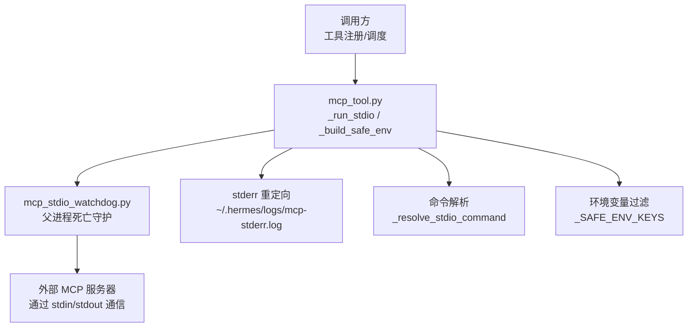
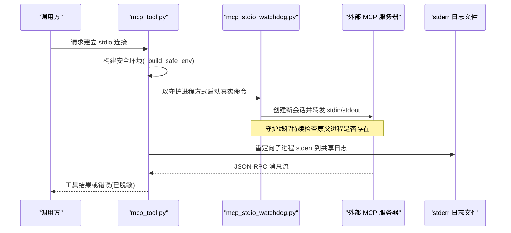
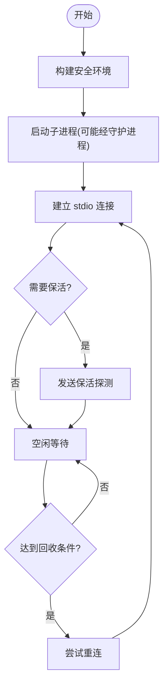
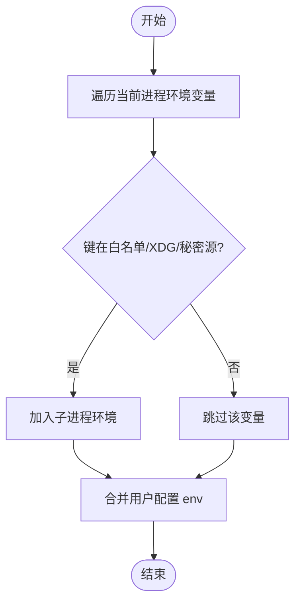
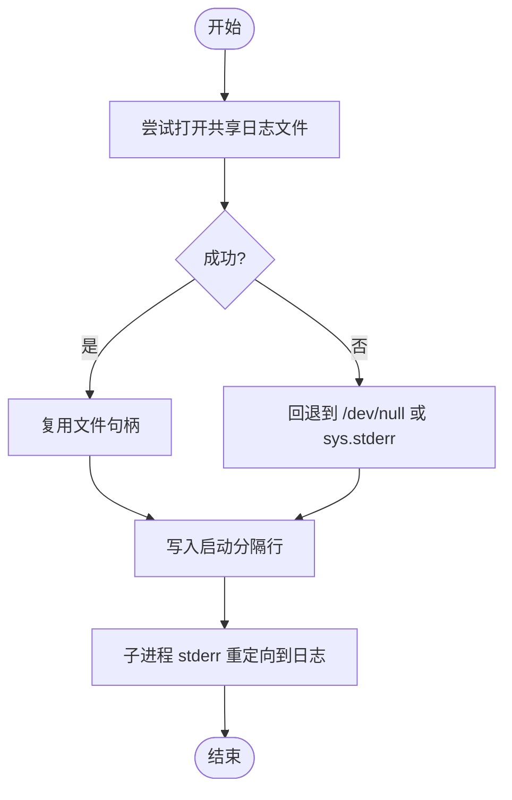
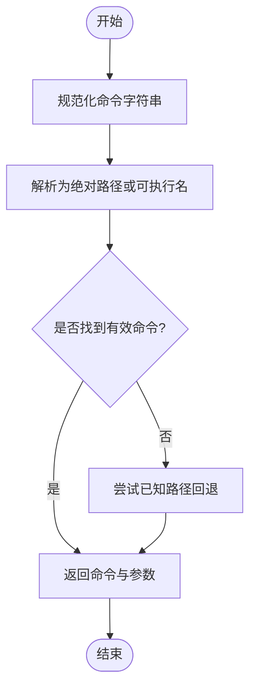
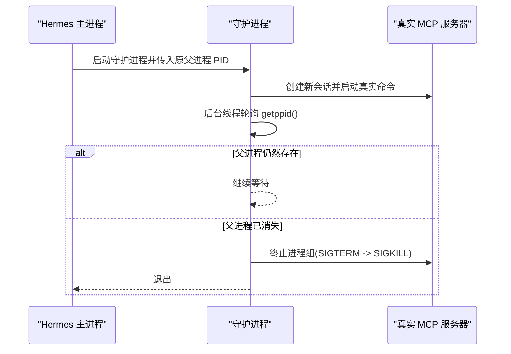
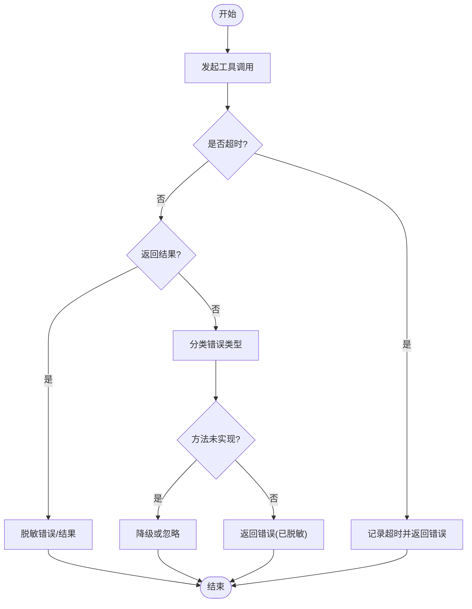
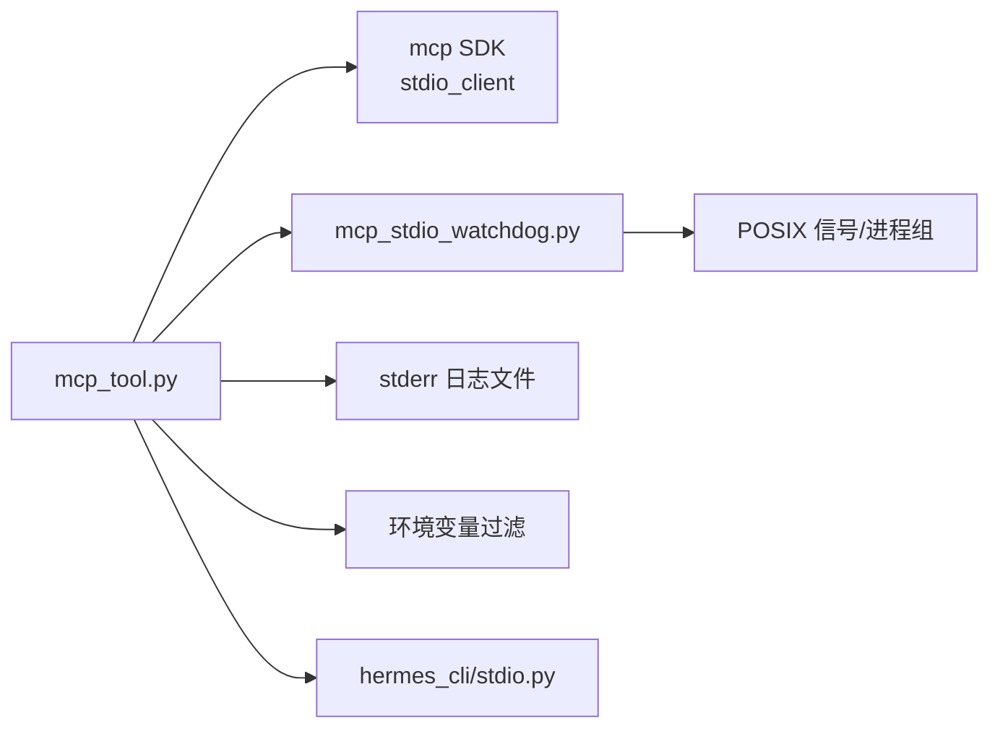

# STDIO 子进程传输

<cite>
**本文引用的文件**
- [tools/mcp_tool.py](file://tools/mcp_tool.py)
- [tools/mcp_stdio_watchdog.py](file://tools/mcp_stdio_watchdog.py)
- [hermes_cli/stdio.py](file://hermes_cli/stdio.py)
- [tests/tools/test_mcp_stdio_watchdog.py](file://tests/tools/test_mcp_stdio_watchdog.py)
- [tests/tools/test_mcp_stdio_init_timeout.py](file://tests/tools/test_mcp_stdio_init_timeout.py)
- [tests/tools/test_mcp_stdio_encoding_handler.py](file://tests/tools/test_mcp_stdio_encoding_handler.py)
</cite>

## 目录
1. [简介](#简介)
2. [项目结构](#项目结构)
3. [核心组件](#核心组件)
4. [架构总览](#架构总览)
5. [详细组件分析](#详细组件分析)
6. [依赖关系分析](#依赖关系分析)
7. [性能考量](#性能考量)
8. [故障排除指南](#故障排除指南)
9. [结论](#结论)
10. [附录](#附录)

## 简介
本文件聚焦于基于标准输入输出（STDIO）的 MCP 子进程传输机制，系统性说明其技术实现与工程实践。内容涵盖：
- 子进程的启动、管理与生命周期
- 环境变量过滤与安全隔离（_SAFE_ENV_KEYS）
- stderr 重定向到日志文件
- 命令解析与路径查找（_resolve_stdio_command）
- 父进程死亡检测（watchdog 机制）
- 超时控制与错误处理
- 配置示例、调试方法与故障排除
- 安全考虑：环境变量白名单、命令注入防护与资源限制

## 项目结构
STDIO 子进程传输的核心代码集中在以下模块：
- tools/mcp_tool.py：MCP 客户端支持，包含 stdio 子进程启动、stderr 重定向、环境变量过滤、命令解析等
- tools/mcp_stdio_watchdog.py：父进程死亡守护进程，确保孤儿进程被清理
- hermes_cli/stdio.py：Windows 平台下的 UTF-8 stdio 配置，保证子进程编码一致
- tests/*：针对 watchdog、初始化超时、编码处理的测试用例

图表来源
- [tools/mcp_tool.py:134-200](file://tools/mcp_tool.py#L134-L200)
- [tools/mcp_stdio_watchdog.py:1-158](file://tools/mcp_stdio_watchdog.py#L1-L158)
- [hermes_cli/stdio.py:85-158](file://hermes_cli/stdio.py#L85-L158)

章节来源
- [tools/mcp_tool.py:134-200](file://tools/mcp_tool.py#L134-L200)
- [tools/mcp_stdio_watchdog.py:1-158](file://tools/mcp_stdio_watchdog.py#L1-L158)
- [hermes_cli/stdio.py:85-158](file://hermes_cli/stdio.py#L85-L158)

## 核心组件
- 子进程启动与管理：通过 mcp_tool.py 中的 stdio 客户端接口创建子进程，维护连接、重连与回收策略
- 环境变量过滤：使用 _SAFE_ENV_KEYS 白名单与 XDG_* 变量，结合秘密源注入变量，避免泄露敏感信息
- stderr 重定向：将子进程 stderr 写入共享日志文件，避免污染 TUI 显示
- 命令解析与路径查找：_resolve_stdio_command 负责命令规范化与路径解析，提升跨平台兼容性
- 父进程死亡检测：mcp_stdio_watchdog.py 在 POSIX 上监控原父进程是否存活，必要时终止子进程组
- 超时控制与错误处理：连接超时、工具调用超时、重连退避；错误消息脱敏，防止凭据泄露

章节来源
- [tools/mcp_tool.py:376-523](file://tools/mcp_tool.py#L376-L523)
- [tools/mcp_stdio_watchdog.py:57-153](file://tools/mcp_stdio_watchdog.py#L57-L153)
- [hermes_cli/stdio.py:85-158](file://hermes_cli/stdio.py#L85-L158)

## 架构总览
下图展示了从调用方到外部 MCP 服务器的完整流程，包括守护进程、日志重定向与环境过滤。

图表来源
- [tools/mcp_tool.py:134-200](file://tools/mcp_tool.py#L134-L200)
- [tools/mcp_stdio_watchdog.py:118-153](file://tools/mcp_stdio_watchdog.py#L118-L153)

## 详细组件分析

### 子进程启动与管理
- 启动方式：通过 stdio 客户端接口创建子进程，保持长连接，支持重连与保活
- 生命周期：每个服务器任务运行在独立事件循环中，关闭时按顺序取消并等待清理
- 回收策略：支持空闲回收与最大生命周期回收，避免长期驻留导致资源泄漏

图表来源
- [tools/mcp_tool.py:338-374](file://tools/mcp_tool.py#L338-L374)

章节来源
- [tools/mcp_tool.py:338-374](file://tools/mcp_tool.py#L338-L374)

### 环境变量过滤与安全隔离
- 白名单策略：仅传递 PATH、HOME、USER、LANG、LC_ALL、TERM、SHELL、TMPDIR 等基础变量
- Windows 兼容：大小写不敏感的环境变量集合，覆盖系统路径与用户配置文件相关变量
- XDG 变量：允许 XDG_* 变量通过，满足桌面集成需求
- 秘密源注入：来自秘密源的变量可显式透传，无需在每个服务器配置中重复设置
- 用户覆盖：最终合并用户配置的 env 字段，便于按需扩展

图表来源
- [tools/mcp_tool.py:376-523](file://tools/mcp_tool.py#L376-L523)

章节来源
- [tools/mcp_tool.py:376-523](file://tools/mcp_tool.py#L376-L523)

### stderr 重定向到日志文件
- 目的：避免 MCP 服务器启动时的 banner 或日志污染 TUI 显示
- 实现：首次打开共享日志文件句柄，后续所有 stdio 子进程共用同一文件描述符
- 降级策略：若无法打开日志文件，则回退到 /dev/null 或直接使用 sys.stderr
- 标记分隔：每次启动新的 MCP 服务器前写入带时间戳的分隔行，便于定位日志

图表来源
- [tools/mcp_tool.py:155-200](file://tools/mcp_tool.py#L155-L200)

章节来源
- [tools/mcp_tool.py:155-200](file://tools/mcp_tool.py#L155-L200)

### 命令解析与路径查找（_resolve_stdio_command）
- 目标：确保命令在不同平台上可被正确解析与执行
- 行为：对命令进行规范化处理，必要时回退到已知路径（如 Hermes 管理的 Node 安装目录）
- 作用域：主要影响 stdio 子进程的命令解析，提升跨平台一致性

图表来源
- [tools/mcp_tool.py:702-702](file://tools/mcp_tool.py#L702-L702)

章节来源
- [tools/mcp_tool.py:702-702](file://tools/mcp_tool.py#L702-L702)

### 父进程死亡检测（watchdog 机制）
- 问题：Hermes 进程崩溃或被强制终止时，直接子进程可能成为孤儿，占用资源并引发冲突
- 方案：通过独立的守护脚本包装真实命令，记录原始父进程 PID，后台线程轮询父进程是否存在
- 清理策略：检测到父进程消失后，向子进程组发送 SIGTERM，等待宽限期后升级为 SIGKILL
- 信号转发：将 SIGTERM/SIGINT 转发给子进程组，确保优雅关闭仍能有效终止卡住的服务器

图表来源
- [tools/mcp_stdio_watchdog.py:57-153](file://tools/mcp_stdio_watchdog.py#L57-L153)

章节来源
- [tools/mcp_stdio_watchdog.py:57-153](file://tools/mcp_stdio_watchdog.py#L57-L153)

### 超时控制与错误处理
- 连接超时：初始连接失败时进行有限次重试，配合指数退避与抖动，避免雪崩
- 工具调用超时：每个工具调用有独立超时上限，防止长时间阻塞
- 错误脱敏：错误消息中匹配常见凭据模式并替换为占位符，防止泄露敏感信息
- 方法未实现：对“method not found”等特定错误进行识别与降级处理

图表来源
- [tools/mcp_tool.py:338-374](file://tools/mcp_tool.py#L338-L374)
- [tools/mcp_tool.py:526-586](file://tools/mcp_tool.py#L526-L586)

章节来源
- [tools/mcp_tool.py:338-374](file://tools/mcp_tool.py#L338-L374)
- [tools/mcp_tool.py:526-586](file://tools/mcp_tool.py#L526-L586)

### Windows 平台 stdio 配置
- 目标：确保 Python 子进程与终端使用一致的 UTF-8 编码，避免 UnicodeEncodeError
- 实现：设置控制台代码页为 UTF-8，重新配置 sys.stdout/stderr/stdin 的编码
- 环境变量：设置 PYTHONIOENCODING 与 PYTHONUTF8，确保子进程继承 UTF-8 行为
- 编辑器与 PATH：提供默认编辑器与预置常用工具路径，改善首次启动体验

章节来源
- [hermes_cli/stdio.py:85-158](file://hermes_cli/stdio.py#L85-L158)
- [hermes_cli/stdio.py:161-252](file://hermes_cli/stdio.py#L161-L252)

## 依赖关系分析
- mcp_tool.py 依赖 mcp SDK 的 stdio_client 接口进行子进程通信
- mcp_stdio_watchdog.py 依赖 POSIX 信号与进程组管理，用于父进程死亡检测
- hermes_cli/stdio.py 依赖 Windows API 与 Python 流重配置能力，确保编码一致
- 测试用例验证 watchdog、初始化超时与编码处理的行为

图表来源
- [tools/mcp_tool.py:219-281](file://tools/mcp_tool.py#L219-L281)
- [tools/mcp_stdio_watchdog.py:62-93](file://tools/mcp_stdio_watchdog.py#L62-L93)
- [hermes_cli/stdio.py:85-158](file://hermes_cli/stdio.py#L85-L158)

章节来源
- [tools/mcp_tool.py:219-281](file://tools/mcp_tool.py#L219-L281)
- [tools/mcp_stdio_watchdog.py:62-93](file://tools/mcp_stdio_watchdog.py#L62-L93)
- [hermes_cli/stdio.py:85-158](file://hermes_cli/stdio.py#L85-L158)

## 性能考量
- 重连退避：使用指数退避与随机抖动，降低多服务器同时重连造成的负载峰值
- 保活间隔：默认 180 秒，最小 5 秒，避免过于频繁的探测造成资源浪费
- 日志缓冲：stderr 日志采用行缓冲，兼顾实时性与 I/O 开销
- 守护进程开销：watchdog 使用轻量级线程轮询，间隔 2 秒，CPU 占用极低

[本节为通用性能讨论，不直接分析具体文件]

## 故障排除指南
- 子进程无法启动：检查命令解析是否正确，确认 PATH 与已知工具路径是否可用
- 连接超时：调整 connect_timeout 与 keepalive_interval，观察网络与服务端状态
- 日志缺失：确认 ~/.hermes/logs 目录存在且可写，查看 mcp-stderr.log 中的启动分隔行
- 父进程死亡未清理：验证 watchdog 是否正常运行，检查 POSIX 信号与进程组权限
- 编码乱码：在 Windows 上启用 UTF-8 stdio 配置，或设置 HERMES_DISABLE_WINDOWS_UTF8 进行对比诊断

章节来源
- [tests/tools/test_mcp_stdio_watchdog.py](file://tests/tools/test_mcp_stdio_watchdog.py)
- [tests/tools/test_mcp_stdio_init_timeout.py](file://tests/tools/test_mcp_stdio_init_timeout.py)
- [tests/tools/test_mcp_stdio_encoding_handler.py](file://tests/tools/test_mcp_stdio_encoding_handler.py)

## 结论
STDIO 子进程传输通过严格的环境变量白名单、安全的命令解析、可靠的 stderr 重定向与父进程死亡检测，实现了稳定、安全、可观测的外部 MCP 服务器集成。结合超时控制与错误脱敏，系统在复杂环境下仍能保持健壮性。建议在生产环境中合理配置保活与回收策略，并定期审查日志与守护进程状态。

[本节为总结性内容，不直接分析具体文件]

## 附录

### 配置示例
- 基本 stdio 服务器配置：
  - command: 可执行文件或脚本路径
  - args: 命令行参数列表
  - env: 可选的环境变量覆盖
  - timeout: 工具调用超时（秒）
  - connect_timeout: 初始连接超时（秒）
  - keepalive_interval: 保活探测间隔（秒）
  - idle_timeout_seconds: 空闲回收阈值（秒）
  - max_lifetime_seconds: 最大生命周期（秒）

章节来源
- [tools/mcp_tool.py:13-79](file://tools/mcp_tool.py#L13-L79)

### 调试方法
- 启用详细日志：观察 mcp-stderr.log 中的启动分隔行与错误信息
- 模拟父进程死亡：通过 kill -9 终止主进程，验证 watchdog 是否能清理子进程组
- 编码问题排查：在 Windows 上切换 HERMES_DISABLE_WINDOWS_UTF8 环境变量，对比行为差异

章节来源
- [tools/mcp_stdio_watchdog.py:118-153](file://tools/mcp_stdio_watchdog.py#L118-L153)
- [hermes_cli/stdio.py:93-110](file://hermes_cli/stdio.py#L93-L110)

### 安全考虑
- 环境变量白名单：仅传递必要的基础变量与 XDG_* 变量，避免泄露敏感信息
- 命令注入防护：命令解析与路径查找限制在受控范围内，减少任意命令执行风险
- 资源限制：通过超时与回收策略限制子进程生命周期，防止资源耗尽
- 错误脱敏：错误消息中自动屏蔽常见凭据模式，降低泄露风险

章节来源
- [tools/mcp_tool.py:376-523](file://tools/mcp_tool.py#L376-L523)
- [tools/mcp_tool.py:526-586](file://tools/mcp_tool.py#L526-L586)