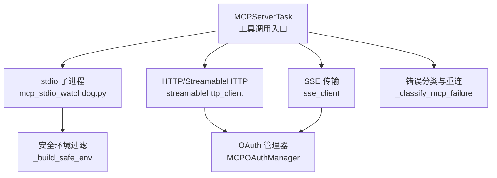
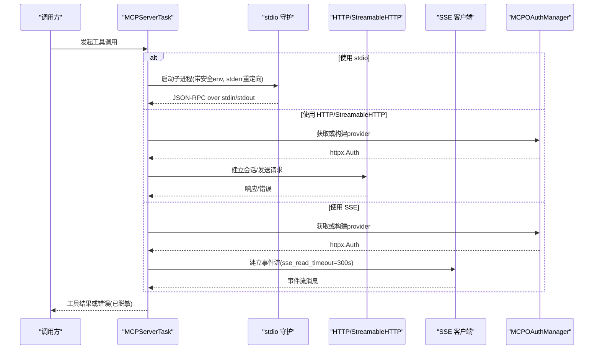
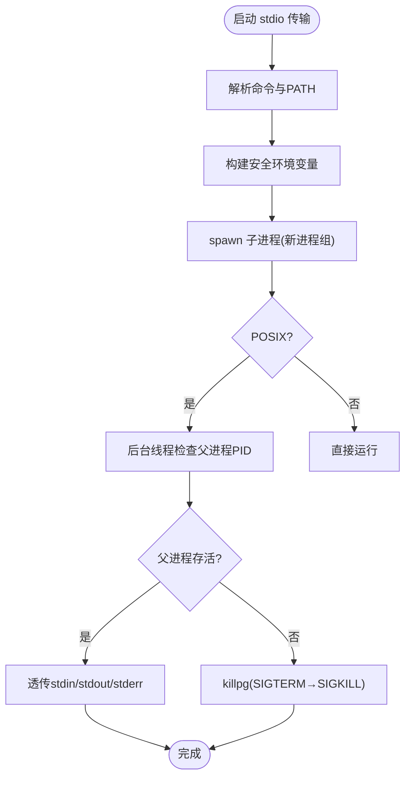
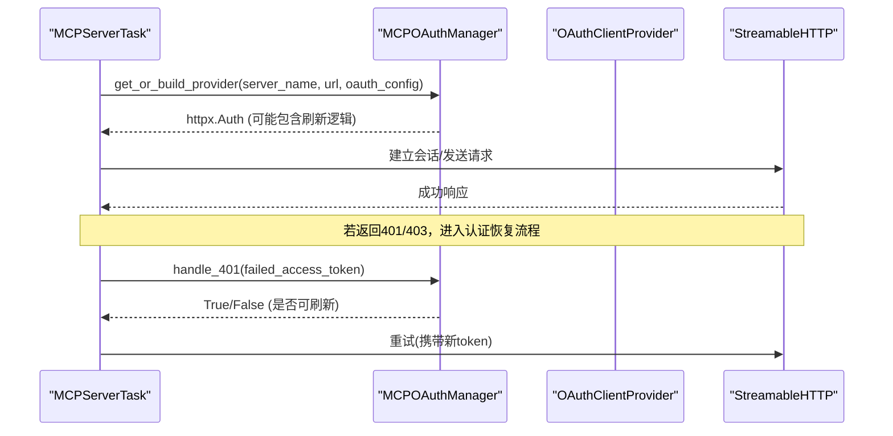
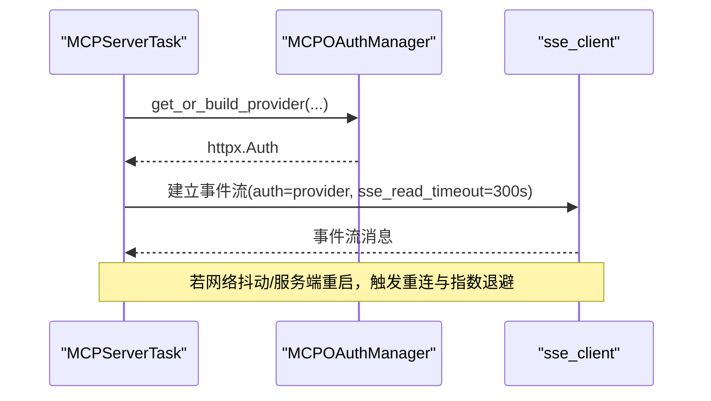
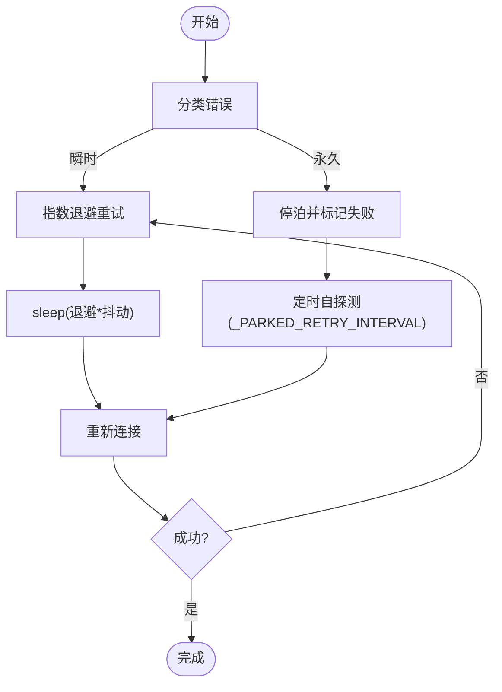
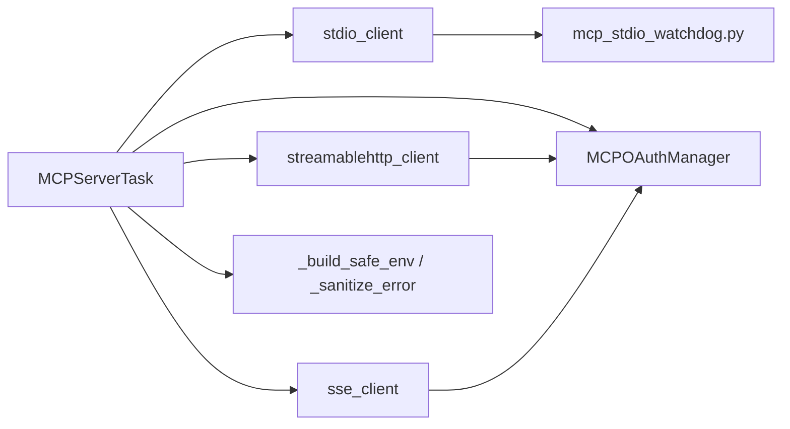

# 传输层实现

<cite>
**本文引用的文件**
- [tools/mcp_tool.py](file://tools/mcp_tool.py)
- [tools/mcp_stdio_watchdog.py](file://tools/mcp_stdio_watchdog.py)
- [hermes_cli/stdio.py](file://hermes_cli/stdio.py)
- [tools/mcp_oauth.py](file://tools/mcp_oauth.py)
- [tools/mcp_oauth_manager.py](file://tools/mcp_oauth_manager.py)
- [tests/tools/test_mcp_sse_transport.py](file://tests/tools/test_mcp_sse_transport.py)
</cite>

## 目录
1. [简介](#简介)
2. [项目结构](#项目结构)
3. [核心组件](#核心组件)
4. [架构总览](#架构总览)
5. [详细组件分析](#详细组件分析)
6. [依赖关系分析](#依赖关系分析)
7. [性能考量](#性能考量)
8. [故障排查指南](#故障排查指南)
9. [结论](#结论)
10. [附录：配置与调试](#附录：配置与调试)

## 简介
本文件聚焦于 MCP（Model Context Protocol）传输层的实现，覆盖三种传输方式的技术细节与工程实践：
- stdio 子进程传输：命令执行、环境变量隔离、stderr 重定向、父进程死亡守护。
- HTTP/StreamableHTTP 传输：连接管理、身份验证、超时控制、mTLS 支持。
- SSE 传输：事件流处理、独立读超时、OAuth 转发、重连策略。

同时记录连接池管理、自动重连策略与指数退避算法，并给出安全考虑、性能优化和故障恢复机制，以及每种传输方式的配置示例与调试方法。

## 项目结构
MCP 传输层主要位于 tools 目录下，围绕 MCPServerTask 统一封装不同传输后端；stdio 子进程通过独立守护脚本提升健壮性；OAuth 能力由专用模块集中管理；SSE 行为由测试用例约束以保证稳定性。

图表来源
- [tools/mcp_tool.py:134-187](file://tools/mcp_tool.py#L134-L187)
- [tools/mcp_stdio_watchdog.py:1-158](file://tools/mcp_stdio_watchdog.py#L1-L158)
- [tools/mcp_oauth_manager.py:446-500](file://tools/mcp_oauth_manager.py#L446-L500)
- [tests/tools/test_mcp_sse_transport.py:82-140](file://tests/tools/test_mcp_sse_transport.py#L82-L140)

章节来源
- [tools/mcp_tool.py:1-120](file://tools/mcp_tool.py#L1-L120)
- [tools/mcp_stdio_watchdog.py:1-158](file://tools/mcp_stdio_watchdog.py#L1-L158)
- [tools/mcp_oauth_manager.py:1-120](file://tools/mcp_oauth_manager.py#L1-L120)
- [tests/tools/test_mcp_sse_transport.py:1-210](file://tests/tools/test_mcp_sse_transport.py#L1-L210)

## 核心组件
- MCPServerTask：统一调度 stdio、HTTP/StreamableHTTP、SSE 三种传输，负责生命周期、重连、错误分类、采样回调等。
- stdio 守护：mcp_stdio_watchdog.py 在 POSIX 上以独立进程组运行真实 MCP 命令，监控父进程死亡并清理子进程树。
- OAuth 管理器：MCPOAuthManager 提供 per-server provider 缓存、外部刷新检测、401 去重、客户端注册中毒自愈。
- 安全与环境：_build_safe_env 过滤环境变量；_sanitize_error 脱敏错误信息；mTLS 证书解析；identity_header 注入。
- SSE 行为保障：测试确保 sse_read_timeout 固定为 300s 且 OAuth 正确转发。

章节来源
- [tools/mcp_tool.py:338-375](file://tools/mcp_tool.py#L338-L375)
- [tools/mcp_tool.py:493-533](file://tools/mcp_tool.py#L493-L533)
- [tools/mcp_stdio_watchdog.py:57-100](file://tools/mcp_stdio_watchdog.py#L57-L100)
- [tools/mcp_oauth_manager.py:682-760](file://tools/mcp_oauth_manager.py#L682-L760)
- [tests/tools/test_mcp_sse_transport.py:82-140](file://tests/tools/test_mcp_sse_transport.py#L82-L140)

## 架构总览
下图展示从工具调用到具体传输后端的流程，包括重连、认证和环境隔离。

图表来源
- [tools/mcp_tool.py:134-187](file://tools/mcp_tool.py#L134-L187)
- [tools/mcp_tool.py:1158-1229](file://tools/mcp_tool.py#L1158-L1229)
- [tools/mcp_oauth_manager.py:464-500](file://tools/mcp_oauth_manager.py#L464-L500)
- [tests/tools/test_mcp_sse_transport.py:82-140](file://tests/tools/test_mcp_sse_transport.py#L82-L140)

## 详细组件分析

### stdio 子进程传输
- 命令执行与环境隔离
  - 通过 _resolve_stdio_command 解析命令与 PATH，优先使用绝对路径，必要时追加常见 Node/bin 目录。
  - 使用 _build_safe_env 仅放行安全变量（PATH、HOME、USER、LANG、XDG_* 等），防止泄露密钥。
  - 用户可配置的 env 会合并到安全环境中。
- stderr 重定向
  - 所有 stdio MCP 子进程的 stderr 被重定向到共享日志文件 mcp-stderr.log，按服务器名区分，避免污染 TUI。
- 父进程死亡守护
  - 在 POSIX 上，通过 mcp_stdio_watchdog.py 以新进程组运行真实命令，后台线程轮询 getppid()，一旦原父进程消失，立即向子进程组发送 SIGTERM/SIGKILL。
  - 信号转发：SIGTERM/SIGINT 转发给子进程组，保证优雅关闭。
- Windows 兼容
  - hermes_cli/stdio.py 强制 UTF-8 控制台编码，设置 PYTHONIOENCODING/PYTHONUTF8，修正编辑器默认值，增强 PATH 查找。

图表来源
- [tools/mcp_tool.py:702-774](file://tools/mcp_tool.py#L702-L774)
- [tools/mcp_stdio_watchdog.py:57-100](file://tools/mcp_stdio_watchdog.py#L57-L100)
- [hermes_cli/stdio.py:85-158](file://hermes_cli/stdio.py#L85-L158)

章节来源
- [tools/mcp_tool.py:702-774](file://tools/mcp_tool.py#L702-L774)
- [tools/mcp_stdio_watchdog.py:1-158](file://tools/mcp_stdio_watchdog.py#L1-L158)
- [hermes_cli/stdio.py:1-252](file://hermes_cli/stdio.py#L1-L252)

### HTTP/StreamableHTTP 传输
- 连接管理与预检
  - 使用 streamablehttp_client/streamable_http_client 建立会话；支持 skip_preflight 跳过内容类型探测。
  - 非 MCP 端点会被识别为非重试的 NonMcpEndpointError，快速失败。
- 身份验证
  - 通过 MCPOAuthManager.get_or_build_provider 获取 httpx.Auth，支持动态注册、PKCE、token 刷新、元数据持久化。
  - 支持 mTLS：client_cert/client_key 解析为 httpx 接受的格式；支持 identity_header 注入（静态或 profile）。
- 超时控制
  - connect_timeout 用于初始连接；tool timeout 用于单次调用；SSE 路径有独立的 sse_read_timeout。
- 错误分类与重连
  - _classify_mcp_failure 将错误分为“永久”与“瞬时”，对 401/403、无效 URL、ENOENT 等走永久路径，其他走指数退避重试。

图表来源
- [tools/mcp_oauth_manager.py:464-500](file://tools/mcp_oauth_manager.py#L464-L500)
- [tools/mcp_oauth_manager.py:682-760](file://tools/mcp_oauth_manager.py#L682-L760)
- [tools/mcp_tool.py:1158-1229](file://tools/mcp_tool.py#L1158-L1229)
- [tools/mcp_tool.py:1072-1103](file://tools/mcp_tool.py#L1072-L1103)

章节来源
- [tools/mcp_tool.py:1003-1103](file://tools/mcp_tool.py#L1003-L1103)
- [tools/mcp_tool.py:1158-1229](file://tools/mcp_tool.py#L1158-L1229)
- [tools/mcp_oauth_manager.py:446-500](file://tools/mcp_oauth_manager.py#L446-L500)
- [tools/mcp_oauth_manager.py:682-760](file://tools/mcp_oauth_manager.py#L682-L760)

### SSE 传输
- 事件流处理
  - 使用 sse_client 建立事件流；测试确保 sse_read_timeout=300s，避免长空闲断开。
- OAuth 转发
  - 当配置 auth=oauth 时，将构建好的 OAuth provider 传入 sse_client 的 auth 参数，确保远程 SSE 服务鉴权成功。
- 重连机制
  - 与 HTTP 路径共用 _classify_mcp_failure 与指数退避；SSE 读超时独立于工具超时，避免误杀长空闲流。

图表来源
- [tests/tools/test_mcp_sse_transport.py:82-140](file://tests/tools/test_mcp_sse_transport.py#L82-L140)
- [tests/tools/test_mcp_sse_transport.py:143-210](file://tests/tools/test_mcp_sse_transport.py#L143-L210)
- [tools/mcp_oauth_manager.py:464-500](file://tools/mcp_oauth_manager.py#L464-L500)

章节来源
- [tests/tools/test_mcp_sse_transport.py:1-210](file://tests/tools/test_mcp_sse_transport.py#L1-L210)
- [tools/mcp_oauth_manager.py:446-500](file://tools/mcp_oauth_manager.py#L446-L500)

### 连接池管理、自动重连与指数退避
- 连接池
  - 每个 MCPServerTask 维护一个长期运行的 asyncio Task，持有传输上下文；多服务器间通过任务隔离。
  - OAuth provider 按 server_name + hermes_home 缓存，URL 变化时重建。
- 自动重连
  - 基于 _classify_mcp_failure 判断“瞬时”错误，进入重试；“永久”错误直接 park，不再浪费重试预算。
  - 首次连接最多重试 _MAX_INITIAL_CONNECT_RETRIES 次。
- 指数退避
  - 最大重试次数 _MAX_RECONNECT_RETRIES，最大退避时间 _MAX_BACKOFF_SECONDS，加入随机抖动 _BACKOFF_JITTER 防惊群。
  - 停泊状态每 _PARKED_RETRY_INTERVAL 秒进行一次自探测，避免完全不可恢复。

图表来源
- [tools/mcp_tool.py:338-375](file://tools/mcp_tool.py#L338-L375)
- [tools/mcp_tool.py:1072-1103](file://tools/mcp_tool.py#L1072-L1103)

章节来源
- [tools/mcp_tool.py:338-375](file://tools/mcp_tool.py#L338-L375)
- [tools/mcp_tool.py:1072-1103](file://tools/mcp_tool.py#L1072-L1103)

## 依赖关系分析
- MCPServerTask 依赖：
  - mcp SDK（可选）：stdio_client、streamablehttp_client、sse_client、types。
  - OAuth 管理器：MCPOAuthManager 提供 httpx.Auth。
  - stdio 守护：mcp_stdio_watchdog.py（POSIX）。
  - 安全与环境：hermes_cli/stdio.py（Windows UTF-8）、_build_safe_env、_sanitize_error。
- 耦合与内聚：
  - 传输选择集中在 MCPServerTask，降低上层复杂度。
  - OAuth 状态集中管理，避免分散导致的一致性问题。
  - stdio 守护独立进程，提高鲁棒性。

图表来源
- [tools/mcp_tool.py:219-281](file://tools/mcp_tool.py#L219-L281)
- [tools/mcp_oauth_manager.py:446-500](file://tools/mcp_oauth_manager.py#L446-L500)
- [tools/mcp_stdio_watchdog.py:1-158](file://tools/mcp_stdio_watchdog.py#L1-L158)

章节来源
- [tools/mcp_tool.py:219-281](file://tools/mcp_tool.py#L219-L281)
- [tools/mcp_oauth_manager.py:446-500](file://tools/mcp_oauth_manager.py#L446-L500)
- [tools/mcp_stdio_watchdog.py:1-158](file://tools/mcp_stdio_watchdog.py#L1-L158)

## 性能考量
- 事件流读超时：SSE 使用 300s 读超时，避免长空闲断开，适合云函数/CDN 场景。
- 心跳保活：keepalive_interval 默认 180s，最小 5s，防止负载均衡/NAT 过期。
- 资源限制：图片/音频/文档缓存大小上限，防止恶意大负载耗尽内存或磁盘。
- 错误分类：减少无效重试，降低网络与 CPU 开销。
- 环境变量过滤：减少不必要的环境传递，降低子进程初始化成本。

[本节为通用指导，不直接分析具体文件]

## 故障排查指南
- stdio 子进程无输出或卡死
  - 检查 mcp-stderr.log 中对应服务器的启动标记与错误。
  - 确认守护进程是否仍在运行（POSIX 下父进程死亡会自动清理）。
- HTTP/StreamableHTTP 401/403
  - 查看 MCPOAuthManager.handle_401 的去重与刷新逻辑；检查 token 文件是否被外部刷新。
  - 若检测到 invalid_client，Hermes 会尝试毒化客户端注册并重新注册。
- SSE 频繁断开
  - 确认 sse_read_timeout 是否为 300s；检查网络与代理；确认 OAuth 是否正确转发。
- 环境变量泄露风险
  - 使用 _build_safe_env 过滤后的环境变量；避免在 config.yaml 中写入敏感键。
- 错误信息脱敏
  - 使用 _sanitize_error 去除令牌、密钥等模式，避免回传给 LLM。

章节来源
- [tools/mcp_tool.py:134-187](file://tools/mcp_tool.py#L134-L187)
- [tools/mcp_tool.py:526-533](file://tools/mcp_tool.py#L526-L533)
- [tools/mcp_oauth_manager.py:682-760](file://tools/mcp_oauth_manager.py#L682-L760)
- [tests/tools/test_mcp_sse_transport.py:82-140](file://tests/tools/test_mcp_sse_transport.py#L82-L140)

## 结论
该传输层通过统一的 MCPServerTask 抽象了 stdio、HTTP/StreamableHTTP、SSE 三种传输，结合 OAuth 管理器与安全环境过滤，提供了高可用、可扩展且安全的 MCP 集成方案。指数退避、错误分类与守护进程提升了鲁棒性；SSE 独立读超时与 OAuth 转发保障了远端服务的可用性。建议在生产环境中合理配置 keepalive、超时与重连策略，并启用日志与监控以便快速定位问题。

[本节为总结，不直接分析具体文件]

## 附录：配置与调试

### 配置示例
- stdio 传输
  - command/args/env/timeout/connect_timeout/keepalive_interval/idle_timeout_seconds/max_lifetime_seconds
- HTTP/StreamableHTTP 传输
  - url/headers/identity_header/timeout/connect_timeout/skip_preflight/client_cert/client_key
- SSE 传输
  - url/transport="sse"/timeout/connect_timeout/auth="oauth"

章节来源
- [tools/mcp_tool.py:13-79](file://tools/mcp_tool.py#L13-L79)
- [tools/mcp_tool.py:1158-1229](file://tools/mcp_tool.py#L1158-L1229)
- [tests/tools/test_mcp_sse_transport.py:82-140](file://tests/tools/test_mcp_sse_transport.py#L82-L140)

### 调试方法
- 查看 stdio 子进程 stderr 日志：~/.hermes/logs/mcp-stderr.log
- 启用 OAuth 调试：观察 MCPOAuthManager 的日志与 token 文件变更
- 验证 SSE 读超时：通过测试断言 sse_read_timeout=300s
- 检查环境变量：确认 _build_safe_env 过滤结果与用户 env 合并
- 错误信息脱敏：确认 _sanitize_error 替换令牌与密钥

章节来源
- [tools/mcp_tool.py:134-187](file://tools/mcp_tool.py#L134-L187)
- [tools/mcp_tool.py:526-533](file://tools/mcp_tool.py#L526-L533)
- [tests/tools/test_mcp_sse_transport.py:82-140](file://tests/tools/test_mcp_sse_transport.py#L82-L140)