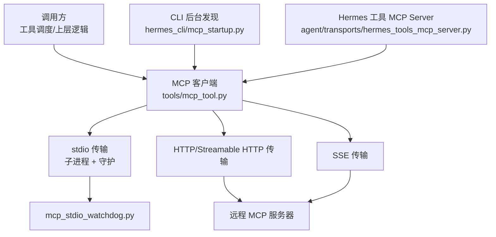
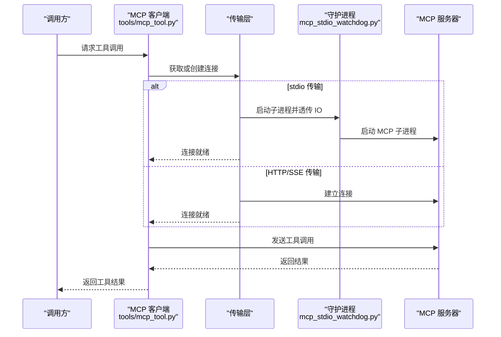
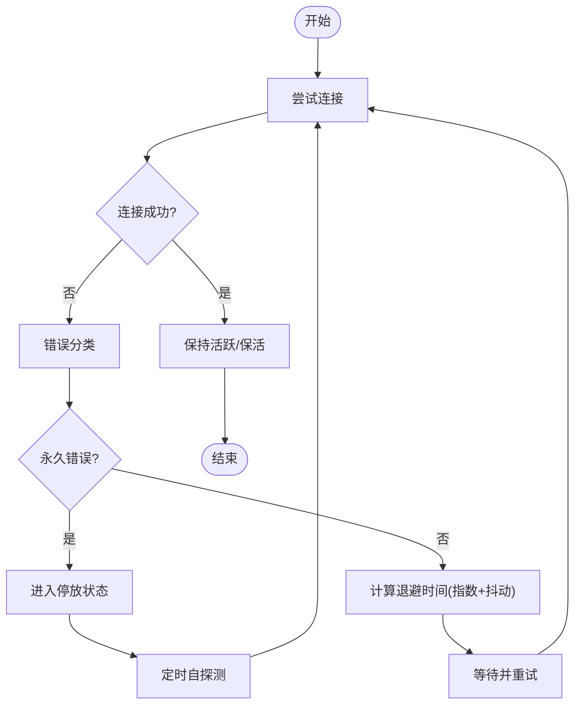
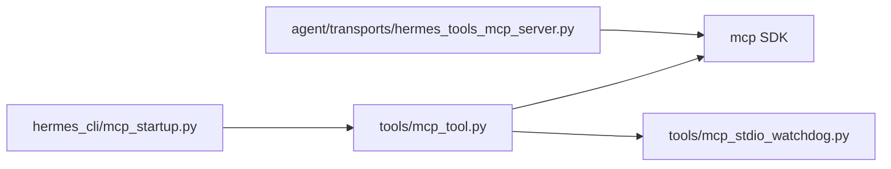

# 连接管理

<cite>
**本文引用的文件**
- [tools/mcp_tool.py](file://tools/mcp_tool.py)
- [tools/mcp_stdio_watchdog.py](file://tools/mcp_stdio_watchdog.py)
- [agent/transports/hermes_tools_mcp_server.py](file://agent/transports/hermes_tools_mcp_server.py)
- [hermes_cli/mcp_startup.py](file://hermes_cli/mcp_startup.py)
- [tests/gateway/test_adapter_connect_is_reconnect_contract.py](file://tests/gateway/test_adapter_connect_is_reconnect_contract.py)
</cite>

## 目录
1. [简介](#简介)
2. [项目结构](#项目结构)
3. [核心组件](#核心组件)
4. [架构总览](#架构总览)
5. [详细组件分析](#详细组件分析)
6. [依赖关系分析](#依赖关系分析)
7. [性能考量](#性能考量)
8. [故障排查指南](#故障排查指南)
9. [结论](#结论)
10. [附录](#附录)

## 简介
本文件聚焦于 MCP（Model Context Protocol）传输层的连接管理，覆盖连接池与复用、连接状态跟踪与生命周期、自动重连与指数退避、重试策略与失败处理、健康检查与 keepalive、超时配置与资源清理、并发控制与泄漏防护、内存管理，以及监控诊断与性能优化建议。内容基于仓库中 MCP 客户端实现、守护进程、CLI 启动流程与平台适配器重连契约等源码进行梳理与总结。

## 项目结构
MCP 连接管理涉及以下关键模块：
- tools/mcp_tool.py：MCP 客户端主实现，负责多传输（stdio/HTTP/SSE）连接、重连、keepalive、资源回收、错误分类与诊断。
- tools/mcp_stdio_watchdog.py：stdio 子进程的父进程死亡守护，防止僵尸进程与资源泄漏。
- agent/transports/hermes_tools_mcp_server.py：将 Hermes 工具以 MCP server 形式暴露给外部运行时（如 Codex），使用 stdio 传输。
- hermes_cli/mcp_startup.py：后台发现与等待机制，确保首次工具快照前完成 MCP 工具注册。
- tests/gateway/test_adapter_connect_is_reconnect_contract.py：校验平台适配器 connect() 必须接受 is_reconnect 参数，保障网关重连路径一致性。

图表来源
- [tools/mcp_tool.py:1-120](file://tools/mcp_tool.py#L1-L120)
- [tools/mcp_stdio_watchdog.py:1-60](file://tools/mcp_stdio_watchdog.py#L1-L60)
- [agent/transports/hermes_tools_mcp_server.py:1-60](file://agent/transports/hermes_tools_mcp_server.py#L1-L60)
- [hermes_cli/mcp_startup.py:1-60](file://hermes_cli/mcp_startup.py#L1-L60)

章节来源
- [tools/mcp_tool.py:1-120](file://tools/mcp_tool.py#L1-L120)
- [tools/mcp_stdio_watchdog.py:1-60](file://tools/mcp_stdio_watchdog.py#L1-L60)
- [agent/transports/hermes_tools_mcp_server.py:1-60](file://agent/transports/hermes_tools_mcp_server.py#L1-L60)
- [hermes_cli/mcp_startup.py:1-60](file://hermes_cli/mcp_startup.py#L1-L60)

## 核心组件
- MCP 客户端任务（MCPServerTask）：为每个配置的 MCP 服务器维护一个长生命周期任务，持有传输上下文，统一处理连接、重连、keepalive、工具发现与注销、资源回收。
- 传输层抽象：支持 stdio、HTTP/Streamable HTTP、SSE；根据配置选择具体实现。
- 守护进程（Watchdog）：对 stdio 子进程进行父进程死亡检测与进程组级清理，避免僵尸进程。
- CLI 后台发现：在进程启动时异步发现并连接 MCP 服务器，保证首条消息前工具已注册。
- 平台适配器重连契约：所有平台适配器的 connect() 必须接受 is_reconnect 关键字参数，确保网关重连路径一致。

章节来源
- [tools/mcp_tool.py:1-120](file://tools/mcp_tool.py#L1-L120)
- [tools/mcp_stdio_watchdog.py:1-60](file://tools/mcp_stdio_watchdog.py#L1-L60)
- [hermes_cli/mcp_startup.py:1-60](file://hermes_cli/mcp_startup.py#L1-L60)
- [tests/gateway/test_adapter_connect_is_reconnect_contract.py:1-40](file://tests/gateway/test_adapter_connect_is_reconnect_contract.py#L1-L40)

## 架构总览
MCP 客户端在独立后台事件循环中运行，每个服务器对应一个 Task。连接建立后，通过 keepalive 维持会话活性；当检测到错误或空闲超时时触发重连，采用指数退避与抖动避免雪崩。stdio 子进程由守护进程托管，父进程异常退出时也能安全回收。

图表来源
- [tools/mcp_tool.py:1-120](file://tools/mcp_tool.py#L1-L120)
- [tools/mcp_stdio_watchdog.py:1-60](file://tools/mcp_stdio_watchdog.py#L1-L60)

## 详细组件分析

### 连接池与连接复用
- 每服务器一连接：每个 MCP 服务器维护独立的连接上下文，避免跨服务器共享导致的认证/会话污染。
- 长连接复用：在连接存活期间复用同一传输通道，减少握手开销。
- 资源隔离：stdio 子进程与守护进程隔离，HTTP/SSE 会话按服务器区分。

章节来源
- [tools/mcp_tool.py:1-120](file://tools/mcp_tool.py#L1-L120)

### 连接状态跟踪与生命周期
- 生命周期阶段：初始化 → 连接建立 → 活跃 → 空闲/保活 → 断开 → 重连 → 恢复/停机。
- 状态标记：连接成功/失败、是否处于重连预算耗尽的“停放”状态、是否已注销工具。
- 停机清理：关闭事件循环前给予有限时间让任务协作退出，避免阻塞进程退出。

章节来源
- [tools/mcp_tool.py:338-375](file://tools/mcp_tool.py#L338-L375)

### 自动重连机制与指数退避
- 重连上限：默认最大重连次数限制，避免无限重试。
- 指数退避：每次失败后增加等待时间，叠加随机抖动，降低多实例同时重试造成的雪崩。
- 停放与自探测：当重连预算耗尽且工具已注销时，定时唤醒一次探测尝试恢复。

图表来源
- [tools/mcp_tool.py:338-375](file://tools/mcp_tool.py#L338-L375)

章节来源
- [tools/mcp_tool.py:338-375](file://tools/mcp_tool.py#L338-L375)

### 重试策略与失败处理
- 错误分类：区分“永久错误”（如认证失败、URL 无效、命令不存在）与“瞬时错误”（网络抖动、EOF、超时）。
- 永久错误：立即停止重试，记录可操作提示，避免日志噪音。
- 瞬时错误：按退避策略重试，直至达到上限或恢复。

章节来源
- [tools/mcp_tool.py:1072-1104](file://tools/mcp_tool.py#L1072-L1104)

### 健康检查与 Keepalive
- Keepalive 间隔：默认保活间隔，低于服务器会话 TTL，防止空闲过期。
- 最小间隔保护：配置的最小值下限，避免忙轮询。
- 方法未找到兼容：某些服务器不实现 ping，需兼容降级到 list_tools 等探测方式。

章节来源
- [tools/mcp_tool.py:360-370](file://tools/mcp_tool.py#L360-L370)
- [tools/mcp_tool.py:547-587](file://tools/mcp_tool.py#L547-L587)

### 超时配置
- 工具调用超时：默认工具调用超时时间。
- 初始连接超时：首次连接超时阈值。
- 单次查询模式：CLI 单查询场景下使用更大的发现超时，确保一次性会话能捕获慢启动服务。

章节来源
- [tools/mcp_tool.py:338-348](file://tools/mcp_tool.py#L338-L348)
- [hermes_cli/mcp_startup.py:122-160](file://hermes_cli/mcp_startup.py#L122-L160)

### 资源清理与泄漏防护
- stdio 子进程守护：父进程异常退出时，守护进程检测孤儿并终止子进程组，避免僵尸进程与端口占用。
- 优雅关闭：事件循环关闭前给予有限时间让任务协作退出，避免死锁。
- 环境变量过滤：仅传递安全变量，防止敏感信息泄露至子进程。

章节来源
- [tools/mcp_stdio_watchdog.py:1-60](file://tools/mcp_stdio_watchdog.py#L1-L60)
- [tools/mcp_stdio_watchdog.py:95-153](file://tools/mcp_stdio_watchdog.py#L95-L153)
- [tools/mcp_tool.py:376-412](file://tools/mcp_tool.py#L376-L412)

### 并发连接控制与内存管理
- 线程安全：后台事件循环与调用线程通过安全调度执行协程，避免竞态。
- 资源上限：分页列表的最大页数限制，防止恶意服务器导致无限遍历。
- 资源块大小限制：图片/音频/文档等资源解码前后的大小限制，避免内存膨胀。

章节来源
- [tools/mcp_tool.py:655-699](file://tools/mcp_tool.py#L655-L699)
- [tools/mcp_tool.py:839-846](file://tools/mcp_tool.py#L839-L846)
- [tools/mcp_tool.py:883-920](file://tools/mcp_tool.py#L883-L920)

### 监控与诊断
- 错误格式化：展开嵌套异常，提取缺失文件或认证问题等关键信息，便于定位。
- 日志级别映射：将 MCP 日志级别映射到 Python 日志级别，统一观测。
- 采样审计：对服务端发起的 LLM 采样请求进行速率限制与审计日志。

章节来源
- [tools/mcp_tool.py:1306-1364](file://tools/mcp_tool.py#L1306-L1364)
- [tools/mcp_tool.py:321-333](file://tools/mcp_tool.py#L321-L333)
- [tools/mcp_tool.py:1385-1420](file://tools/mcp_tool.py#L1385-L1420)

### 平台适配器重连契约
- 契约要求：所有平台适配器的 connect() 必须接受 is_reconnect 关键字参数，否则网关重连时会抛出类型错误并静默断开。
- 静态校验：测试通过 AST 扫描确保所有适配器符合该签名约定。

章节来源
- [tests/gateway/test_adapter_connect_is_reconnect_contract.py:1-40](file://tests/gateway/test_adapter_connect_is_reconnect_contract.py#L1-L40)
- [tests/gateway/test_adapter_connect_is_reconnect_contract.py:84-103](file://tests/gateway/test_adapter_connect_is_reconnect_contract.py#L84-L103)
- [tests/gateway/test_adapter_connect_is_reconnect_contract.py:114-145](file://tests/gateway/test_adapter_connect_is_reconnect_contract.py#L114-L145)

## 依赖关系分析
- MCP 客户端依赖 mcp SDK（可选），支持不同版本的能力探测（message_handler、logging_callback、SSE 等）。
- CLI 后台发现依赖配置读取与 OAuth 抑制，确保非交互环境稳定。
- 守护进程为标准库实现，无第三方依赖，保证快速启动与低资源占用。
- Hermes 工具 MCP Server 依赖 FastMCP，用于向外部运行时暴露工具能力。

图表来源
- [tools/mcp_tool.py:209-300](file://tools/mcp_tool.py#L209-L300)
- [hermes_cli/mcp_startup.py:1-60](file://hermes_cli/mcp_startup.py#L1-L60)
- [agent/transports/hermes_tools_mcp_server.py:152-178](file://agent/transports/hermes_tools_mcp_server.py#L152-L178)

章节来源
- [tools/mcp_tool.py:209-300](file://tools/mcp_tool.py#L209-L300)
- [hermes_cli/mcp_startup.py:1-60](file://hermes_cli/mcp_startup.py#L1-L60)
- [agent/transports/hermes_tools_mcp_server.py:152-178](file://agent/transports/hermes_tools_mcp_server.py#L152-L178)

## 性能考量
- 指数退避加抖动：降低多实例同时重试带来的突发流量与日志风暴。
- Keepalive 间隔调优：根据服务器会话 TTL 调整，避免频繁断连重连。
- 资源大小限制：对图片/音频/文档设置上限，防止内存与磁盘压力。
- 分页上限：限制 list_* 分页次数，避免恶意服务器拖垮客户端。
- 守护进程轻量：标准库实现，快速启动，低开销守护。

[本节提供通用指导，无需特定文件引用]

## 故障排查指南
- 认证失败（401/403）：属于永久错误，检查凭据与身份头配置。
- URL 无效或非 MCP 端点：检查 url 配置与 skip_preflight 选项。
- 命令不存在（ENOENT）：确认 command 与 PATH，必要时使用绝对路径。
- 子进程孤儿：检查守护进程是否正常运行，查看系统进程树。
- 工具不可见：确认后台发现已完成，必要时延长 discovery timeout。

章节来源
- [tools/mcp_tool.py:1072-1104](file://tools/mcp_tool.py#L1072-L1104)
- [tools/mcp_stdio_watchdog.py:95-153](file://tools/mcp_stdio_watchdog.py#L95-L153)
- [hermes_cli/mcp_startup.py:122-160](file://hermes_cli/mcp_startup.py#L122-L160)

## 结论
本项目的 MCP 传输层连接管理通过模块化设计实现了高可用与可观测性：统一的连接生命周期、健壮的重连与退避、严格的资源与内存保护、完善的守护与清理机制，以及面向运维的诊断与监控能力。配合平台适配器的重连契约，确保了网关侧重连路径的一致性与稳定性。

[本节为总结，无需特定文件引用]

## 附录
- 配置项参考（节选）：
  - 工具调用超时：默认 300 秒
  - 初始连接超时：默认 60 秒
  - 最大重连次数：默认 5 次
  - 最大退避时间：默认 60 秒
  - Keepalive 间隔：默认 180 秒，最小 5 秒
  - 单次查询发现超时：默认 15 秒（交互式 1.5 秒）

章节来源
- [tools/mcp_tool.py:338-375](file://tools/mcp_tool.py#L338-L375)
- [hermes_cli/mcp_startup.py:122-160](file://hermes_cli/mcp_startup.py#L122-L160)