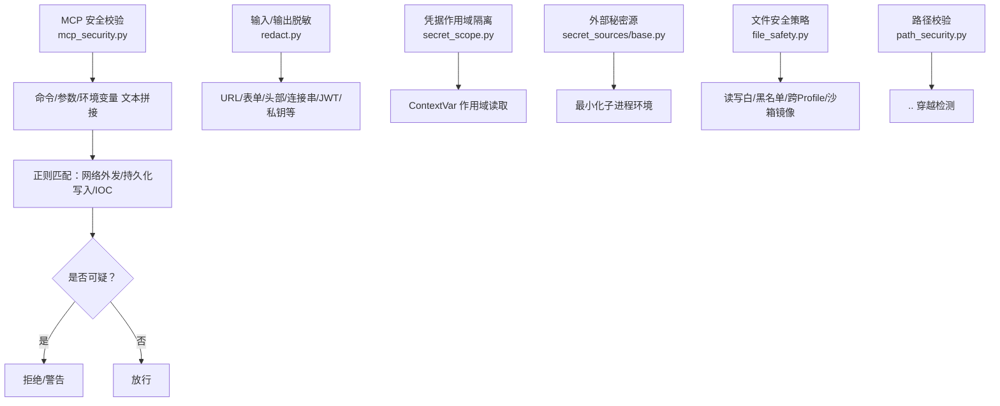
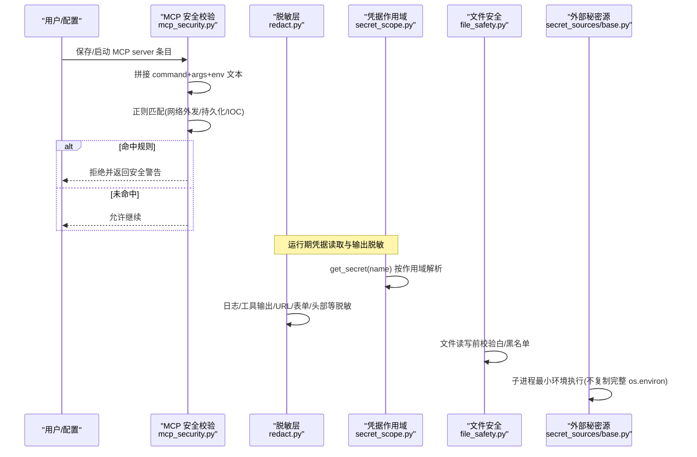
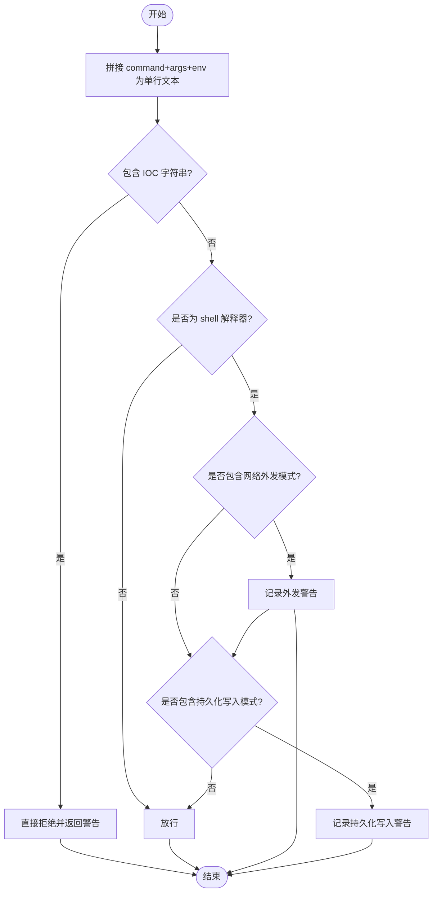
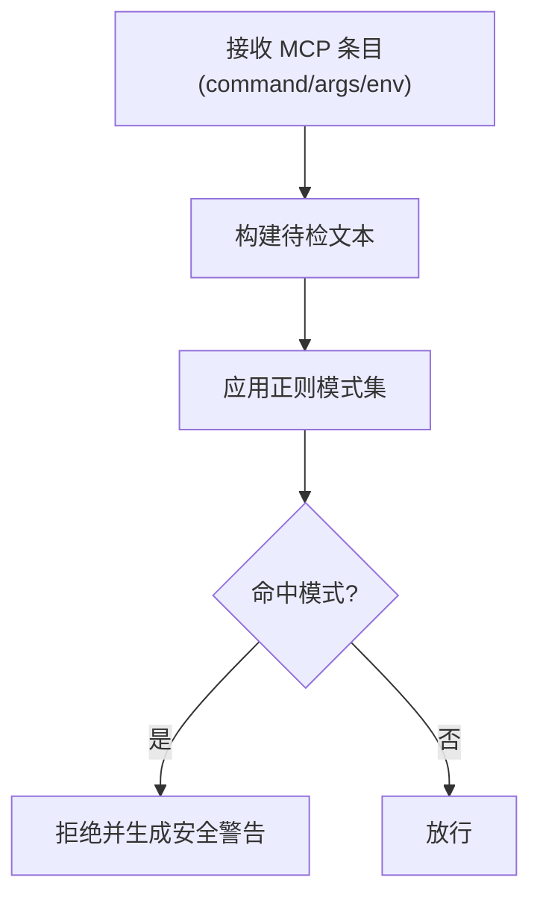
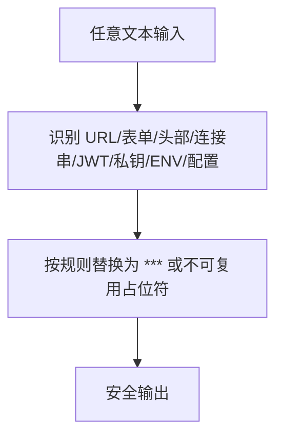
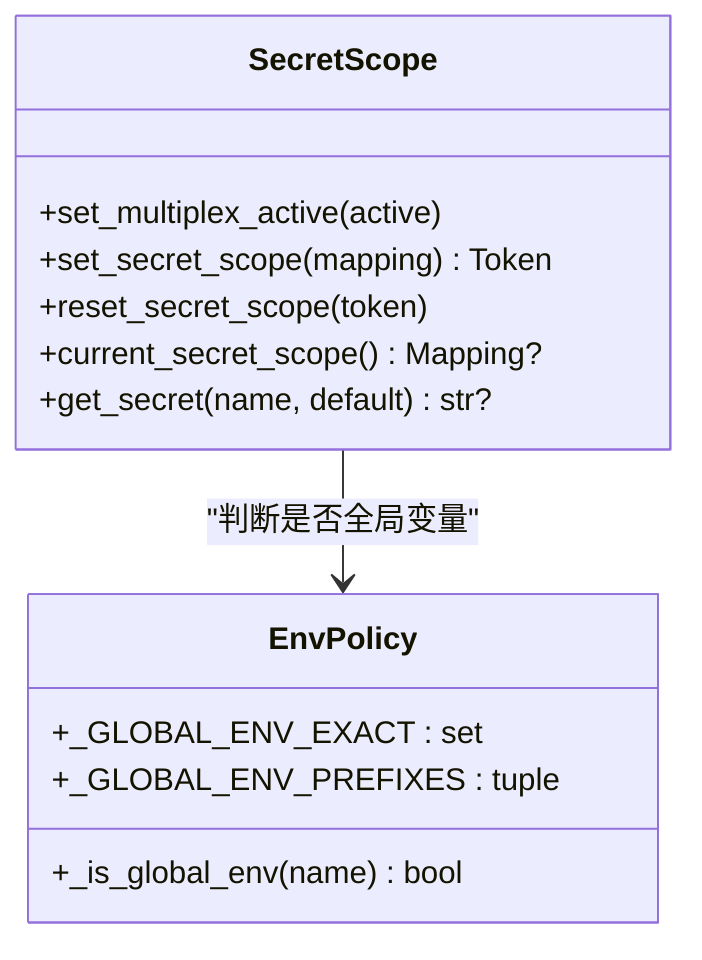
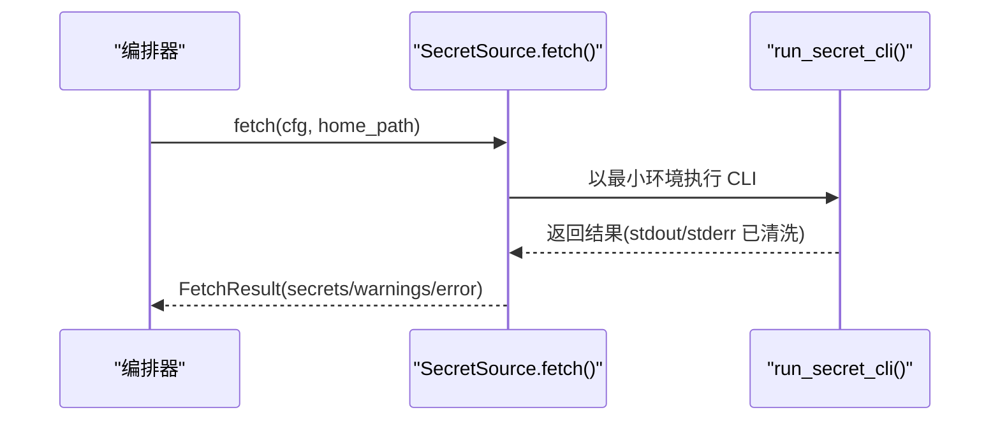
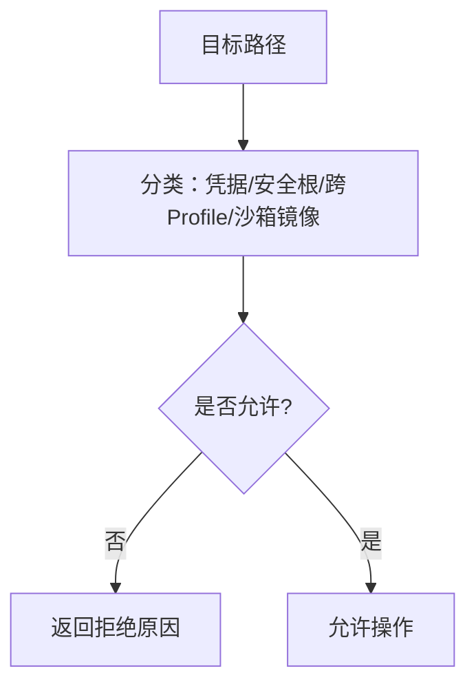
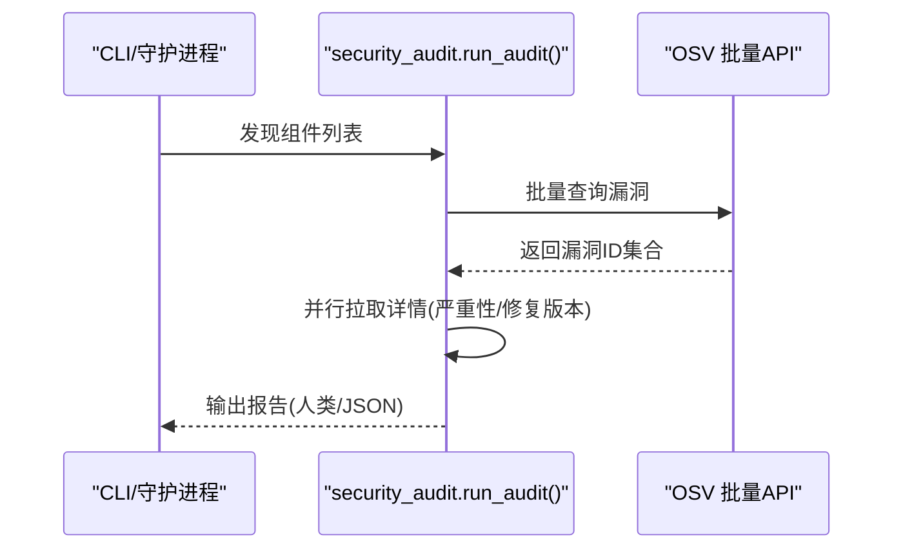
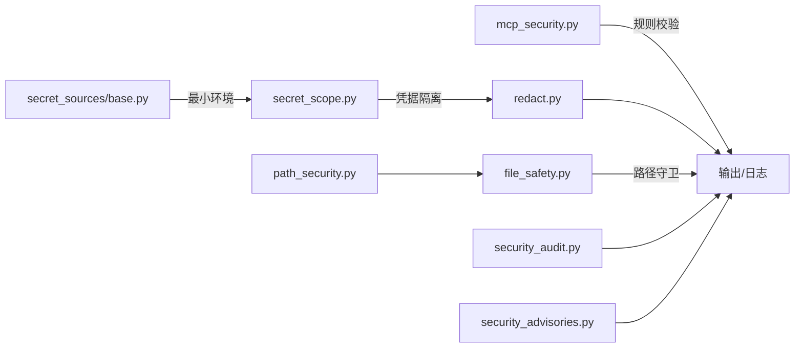

# 安全控制机制

<cite>
**本文引用的文件**
- [mcp_security.py](file://hermes_cli/mcp_security.py)
- [redact.py](file://agent/redact.py)
- [secret_scope.py](file://agent/secret_scope.py)
- [base.py](file://agent/secret_sources/base.py)
- [security_audit.py](file://hermes_cli/security_audit.py)
- [security_advisories.py](file://hermes_cli/security_advisories.py)
- [file_safety.py](file://agent/file_safety.py)
- [path_security.py](file://tools/path_security.py)
</cite>

## 目录
1. [简介](#简介)
2. [项目结构](#项目结构)
3. [核心组件](#核心组件)
4. [架构总览](#架构总览)
5. [详细组件分析](#详细组件分析)
6. [依赖关系分析](#依赖关系分析)
7. [性能考虑](#性能考虑)
8. [故障排查指南](#故障排查指南)
9. [结论](#结论)
10. [附录](#附录)

## 简介
本文件系统性梳理并说明 Hermes Agent 中与安全相关的控制机制，重点覆盖：
- MCP 安全控制：环境变量过滤、敏感信息保护、秘密源集成
- 提示注入检测模式、恶意内容识别与安全告警
- 凭证清理正则表达式与错误消息脱敏
- 文件路径安全检查、沙箱执行环境与权限控制
- 安全配置完整指南与常见威胁防护方法
- 安全审计日志与违规检测机制

目标是帮助读者理解从“入口校验—运行时隔离—输出脱敏—审计告警”的全链路安全设计。

## 项目结构
围绕安全能力的关键模块分布如下：
- hermes_cli/mcp_security.py：MCP 服务器条目保存与启动时的安全校验（网络外发、持久化写入、IOC 黑名单）
- agent/redact.py：统一的日志/工具输出/URL/表单/头部等内容的敏感信息脱敏
- agent/secret_scope.py：多 Profile 下的凭据作用域隔离（ContextVar 实现），全局/非全局环境变量白名单
- agent/secret_sources/base.py：外部秘密源抽象与子进程最小环境调用规范
- hermes_cli/security_audit.py：供应链漏洞扫描（OSV 批量查询）
- hermes_cli/security_advisories.py：已知高危包公告检测与可确认的告警缓存
- agent/file_safety.py：读写路径白/黑名单、跨 Profile 与沙箱镜像写保护
- tools/path_security.py：通用路径合法性校验（相对路径穿越检测）

**图表来源**
- [mcp_security.py:1-182](file://hermes_cli/mcp_security.py#L1-L182)
- [redact.py:1-800](file://agent/redact.py#L1-L800)
- [secret_scope.py:1-294](file://agent/secret_scope.py#L1-L294)
- [base.py:1-337](file://agent/secret_sources/base.py#L1-L337)
- [file_safety.py:1-694](file://agent/file_safety.py#L1-L694)
- [path_security.py:1-44](file://tools/path_security.py#L1-L44)

**章节来源**
- [mcp_security.py:1-182](file://hermes_cli/mcp_security.py#L1-L182)
- [redact.py:1-800](file://agent/redact.py#L1-L800)
- [secret_scope.py:1-294](file://agent/secret_scope.py#L1-L294)
- [base.py:1-337](file://agent/secret_sources/base.py#L1-L337)
- [file_safety.py:1-694](file://agent/file_safety.py#L1-L694)
- [path_security.py:1-44](file://tools/path_security.py#L1-L44)

## 核心组件
- MCP 安全校验：在保存与启动两个阶段对 MCP server entry 进行强规则检查，阻断典型攻击形状（网络外发、系统持久化写入）和已知 IOC。
- 统一脱敏：集中处理日志、工具输出、URL、表单、请求头、连接串、JWT、私钥等，避免凭据泄露。
- 凭据作用域：在多 Profile 并发场景下通过 ContextVar 隔离凭据，禁止未设置作用域的凭据读取。
- 外部秘密源：提供标准化接口，限制子进程最小环境，避免凭据扩散。
- 文件安全：严格的读写白/黑名单，防止误写关键系统/凭据文件；跨 Profile 与沙箱镜像写保护。
- 供应链审计：基于 OSV 的按需扫描，结合公告检测与可确认机制，降低供应链风险。

**章节来源**
- [mcp_security.py:1-182](file://hermes_cli/mcp_security.py#L1-L182)
- [redact.py:1-800](file://agent/redact.py#L1-L800)
- [secret_scope.py:1-294](file://agent/secret_scope.py#L1-L294)
- [base.py:1-337](file://agent/secret_sources/base.py#L1-L337)
- [file_safety.py:1-694](file://agent/file_safety.py#L1-L694)
- [security_audit.py:1-590](file://hermes_cli/security_audit.py#L1-L590)
- [security_advisories.py:1-454](file://hermes_cli/security_advisories.py#L1-L454)

## 架构总览
下图展示一次 MCP 服务器条目从配置保存到启动执行的完整安全流程，以及脱敏、作用域隔离与文件访问控制的协同。

**图表来源**
- [mcp_security.py:1-182](file://hermes_cli/mcp_security.py#L1-L182)
- [redact.py:1-800](file://agent/redact.py#L1-L800)
- [secret_scope.py:1-294](file://agent/secret_scope.py#L1-L294)
- [file_safety.py:1-694](file://agent/file_safety.py#L1-L694)
- [base.py:1-337](file://agent/secret_sources/base.py#L1-L337)

## 详细组件分析

### MCP 安全控制（保存与启动双阶段）
- 目标：阻止两类高信号滥用形态
  - 网络外泄：shell 解释器内联脚本调用 curl/wget/nc 等外发工具
  - 系统持久化：写入 SSH/PAM/sudoers/cron/rc 等持久化面
- 附加：硬编码 IOC 黑名单（如特定公钥、IP 段），命中即拒绝
- 触发点：保存时（dashboard API + CLI）与启动时（发现/定时任务/启动）均执行

**图表来源**
- [mcp_security.py:1-182](file://hermes_cli/mcp_security.py#L1-L182)

**章节来源**
- [mcp_security.py:1-182](file://hermes_cli/mcp_security.py#L1-L182)

### 提示注入检测模式与恶意内容识别
- 通过 MCP 安全规则间接防御提示注入载体：
  - 阻止将敏感或危险指令以 MCP 命令形式注入执行
  - 对 shell 解释器内联脚本进行严格模式匹配，阻断外发与持久化
- 配合统一脱敏，避免在日志/输出中暴露可能用于二次注入的凭据片段

**图表来源**
- [mcp_security.py:1-182](file://hermes_cli/mcp_security.py#L1-L182)
- [redact.py:1-800](file://agent/redact.py#L1-L800)

**章节来源**
- [mcp_security.py:1-182](file://hermes_cli/mcp_security.py#L1-L182)
- [redact.py:1-800](file://agent/redact.py#L1-L800)

### 凭证清理正则表达式与错误消息脱敏
- 覆盖范围：
  - URL 查询参数中的敏感键值（如 access_token、api_key 等）
  - 表单 body、HTTP 请求目标中的查询串
  - Authorization 及自定义密钥头
  - 数据库连接串、JWT、私钥块、裸令牌 URL
  - 环境变量赋值、配置文件键值、YAML 键值
- 行为：
  - 短令牌全掩码，长令牌保留首尾若干字符便于调试
  - 支持“不可复用”占位符，避免回写破坏真实凭据
  - 针对 CDP/浏览器端点 URL 做更严格的凭据脱敏

**图表来源**
- [redact.py:1-800](file://agent/redact.py#L1-L800)

**章节来源**
- [redact.py:1-800](file://agent/redact.py#L1-L800)

### 环境变量过滤机制（安全变量白名单与作用域）
- 全局环境变量白名单：部署级/进程级变量（如 HERMES_*、PATH、HOME、LANG 等）始终从进程环境读取
- 非全局变量：
  - 若存在作用域（多 Profile），优先从作用域映射读取；缺失时根据是否启用多 Profile 决定失败关闭或回退到进程环境
  - 多 Profile 模式下未设置作用域的凭据读取会抛出异常，防止跨 Profile 泄漏
- .env 加载：仅解析 profile 的 .env 到映射，不污染进程环境

**图表来源**
- [secret_scope.py:1-294](file://agent/secret_scope.py#L1-L294)

**章节来源**
- [secret_scope.py:1-294](file://agent/secret_scope.py#L1-L294)

### 秘密源集成（外部凭据后端）
- 抽象契约：
  - 只读、启动时同步获取、永不阻塞/提示
  - 返回 FetchResult（secrets/warnings/error），由编排器负责合并与写入
- 子进程最小环境：
  - 仅传递 PATH/HOME/locale 基础变量与 allowlist 中的认证/会话变量
  - 禁用 ANSI 颜色，stdin 指向 /dev/null，超时控制
- 错误分类：NOT_CONFIGURED/BINARY_MISSING/AUTH_FAILED/NETWORK/TIMEOUT 等，便于统一提示与恢复建议

**图表来源**
- [base.py:1-337](file://agent/secret_sources/base.py#L1-L337)

**章节来源**
- [base.py:1-337](file://agent/secret_sources/base.py#L1-L337)

### 文件路径安全检查与权限控制
- 写保护：
  - 精确黑名单：SSH 私钥/公钥、.env、OAuth 存储、sudoers、shadow 等
  - 前缀黑名单：.ssh/.aws/.kube/.docker/.azure/.config/gh 等敏感目录
  - 安全根目录：HERMES_WRITE_SAFE_ROOT 限定可写范围
- 读保护：
  - 内部缓存（skills/.hub）、凭据存储、mcp-tokens、项目 .env 等禁止直接读取
- 跨 Profile 与沙箱镜像写保护：
  - 跨 Profile 写拦截并给出明确警告
  - 沙箱镜像路径（含容器内镜像）写拦截并提示权威路径

**图表来源**
- [file_safety.py:1-694](file://agent/file_safety.py#L1-L694)
- [path_security.py:1-44](file://tools/path_security.py#L1-L44)

**章节来源**
- [file_safety.py:1-694](file://agent/file_safety.py#L1-L694)
- [path_security.py:1-44](file://tools/path_security.py#L1-L44)

### 安全审计日志与违规检测
- 供应链审计：
  - 扫描 venv、插件依赖、MCP 命令中的 npx/uvx 版本
  - 批量查询 OSV.dev，并行拉取详情，输出人类可读/JSON
  - 支持 --fail-on 阈值控制退出码
- 公告检测：
  - 检测已知被攻陷包（如 mistralai 2.4.6）
  - 支持确认（ack）与 24 小时缓存，避免重复打扰
  - 启动横幅与网关日志提示

**图表来源**
- [security_audit.py:1-590](file://hermes_cli/security_audit.py#L1-L590)
- [security_advisories.py:1-454](file://hermes_cli/security_advisories.py#L1-L454)

**章节来源**
- [security_audit.py:1-590](file://hermes_cli/security_audit.py#L1-L590)
- [security_advisories.py:1-454](file://hermes_cli/security_advisories.py#L1-L454)

## 依赖关系分析
- mcp_security.py 依赖正则与 shlex 解析，独立于其他安全模块，但与其他组件共同构成“入口校验”防线
- redact.py 被多处调用（终端工具、网关、日志导出等），是“输出侧”的统一脱敏中心
- secret_scope.py 与 secret_sources/base.py 协作，确保凭据仅在正确作用域内可见，且外部子进程最小化暴露
- file_safety.py 与 path_security.py 提供“文件系统边界”保护，贯穿工具链
- security_audit.py 与 security_advisories.py 提供“供应链风险”检测与提示

**图表来源**
- [mcp_security.py:1-182](file://hermes_cli/mcp_security.py#L1-L182)
- [redact.py:1-800](file://agent/redact.py#L1-L800)
- [secret_scope.py:1-294](file://agent/secret_scope.py#L1-L294)
- [base.py:1-337](file://agent/secret_sources/base.py#L1-L337)
- [file_safety.py:1-694](file://agent/file_safety.py#L1-L694)
- [path_security.py:1-44](file://tools/path_security.py#L1-L44)
- [security_audit.py:1-590](file://hermes_cli/security_audit.py#L1-L590)
- [security_advisories.py:1-454](file://hermes_cli/security_advisories.py#L1-L454)

**章节来源**
- [mcp_security.py:1-182](file://hermes_cli/mcp_security.py#L1-L182)
- [redact.py:1-800](file://agent/redact.py#L1-L800)
- [secret_scope.py:1-294](file://agent/secret_scope.py#L1-L294)
- [base.py:1-337](file://agent/secret_sources/base.py#L1-L337)
- [file_safety.py:1-694](file://agent/file_safety.py#L1-L694)
- [path_security.py:1-44](file://tools/path_security.py#L1-L44)
- [security_audit.py:1-590](file://hermes_cli/security_audit.py#L1-L590)
- [security_advisories.py:1-454](file://hermes_cli/security_advisories.py#L1-L454)

## 性能考虑
- 脱敏正则：
  - 使用预编译模式与快速短路（如先检测是否存在关键字再执行复杂匹配）
  - 对超长文本采用保守策略，避免回溯灾难（例如 URL userinfo 的正则优化）
- 供应链审计：
  - OSV 批量查询分片（每批最多 1000 项）
  - 详情拉取并行（线程池）
- 文件安全：
  - 路径解析与相对路径检查开销低，适合高频调用
- 外部秘密源：
  - 子进程调用带超时，避免启动阻塞

[本节为通用指导，无需具体文件引用]

## 故障排查指南
- MCP 条目被拒绝：
  - 检查 command/args/env 是否包含网络外发或持久化写入模式
  - 检查是否命中 IOC 黑名单
- 凭据未生效：
  - 确认当前处于正确的 secret scope（多 Profile 场景）
  - 确认变量名属于全局白名单或非全局但存在于作用域
- 文件写入失败：
  - 检查是否在写保护黑名单或安全根之外
  - 检查是否跨 Profile 或落入沙箱镜像路径
- 供应链告警：
  - 查看审计输出，定位受影响组件与修复版本
  - 使用公告确认功能减少重复提示

**章节来源**
- [mcp_security.py:1-182](file://hermes_cli/mcp_security.py#L1-L182)
- [secret_scope.py:1-294](file://agent/secret_scope.py#L1-L294)
- [file_safety.py:1-694](file://agent/file_safety.py#L1-L694)
- [security_audit.py:1-590](file://hermes_cli/security_audit.py#L1-L590)
- [security_advisories.py:1-454](file://hermes_cli/security_advisories.py#L1-L454)

## 结论
Hermes Agent 的安全控制机制以“入口校验—作用域隔离—输出脱敏—文件边界—供应链审计”为主线，形成纵深防御：
- MCP 安全规则在保存与启动阶段双重拦截高风险行为
- 统一脱敏确保凭据不会出现在日志/输出/URL 中
- 凭据作用域与外部秘密源最小化暴露，避免跨 Profile 泄漏
- 文件安全策略防止误写/误读关键系统/凭据文件
- 供应链审计与公告检测持续降低第三方依赖风险

建议在生产环境中：
- 保持脱敏开启，谨慎调整配置
- 合理配置 HERMES_WRITE_SAFE_ROOT，限制可写范围
- 定期运行安全审计与公告检查，及时修复漏洞
- 对外部秘密源进行最小权限与环境隔离

[本节为总结性内容，无需具体文件引用]

## 附录
- 安全配置要点
  - 启用并维护 MCP 安全规则（默认开启）
  - 使用 secret scope 管理多 Profile 凭据
  - 配置外部秘密源的最小环境变量与超时
  - 设置 HERMES_WRITE_SAFE_ROOT 限制可写目录
  - 定期运行 hermes security audit 与 doctor 公告检查

[本节为补充说明，无需具体文件引用]