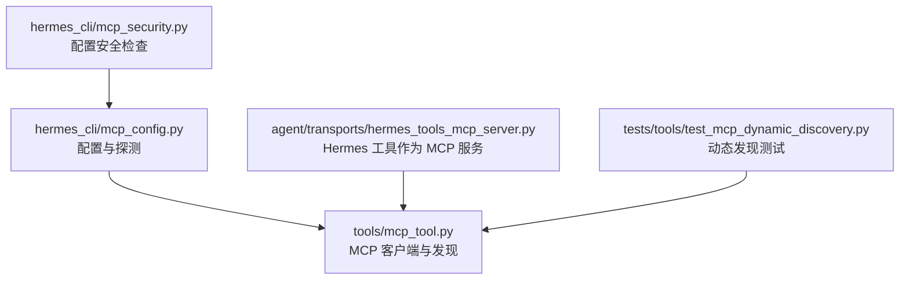
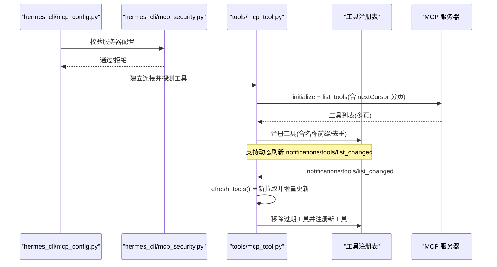
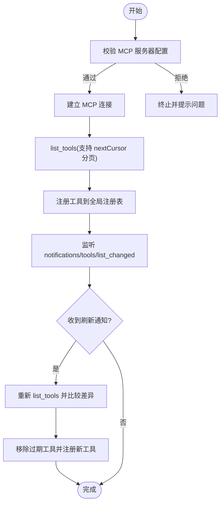
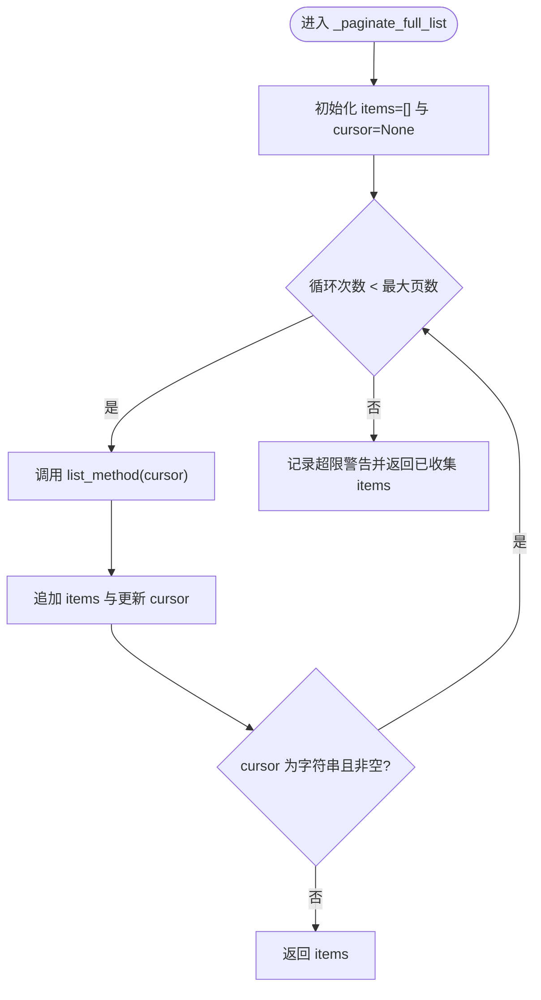
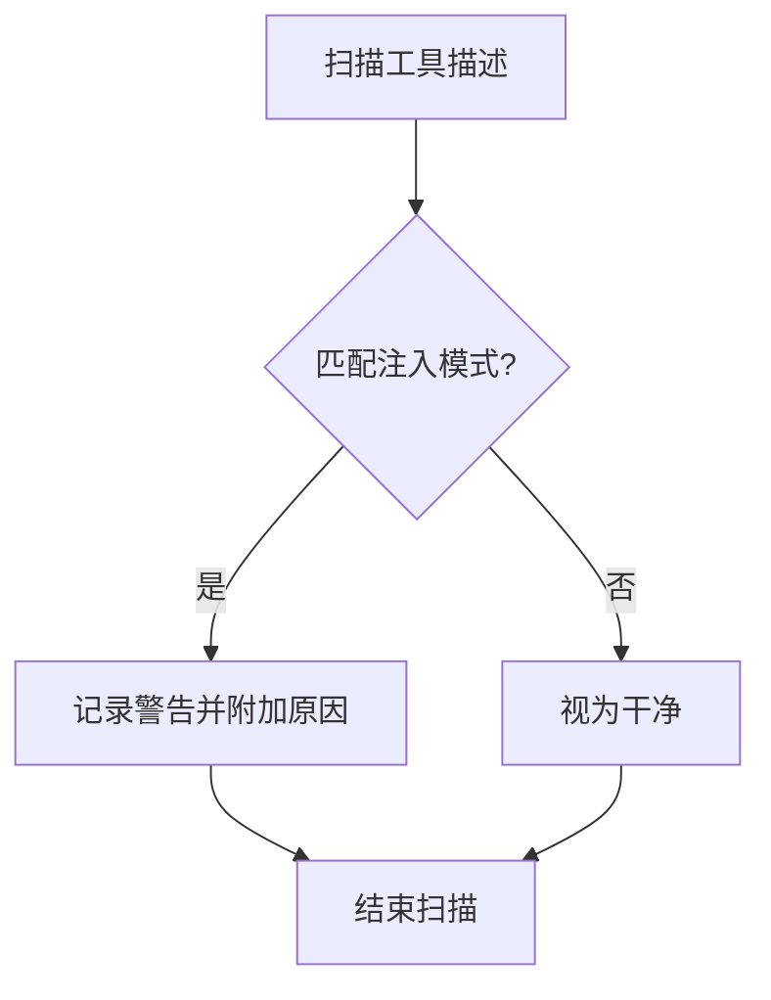
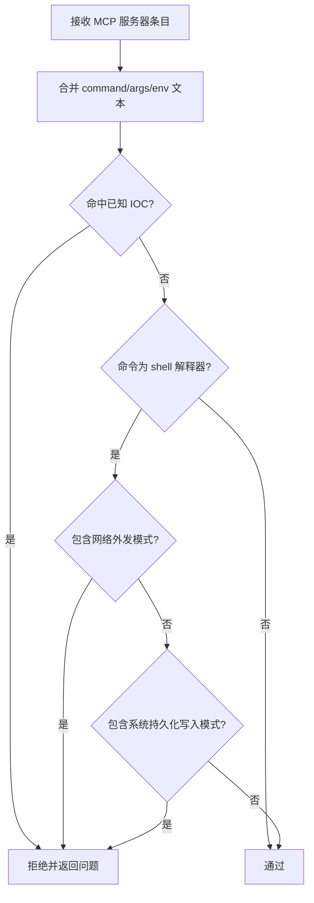
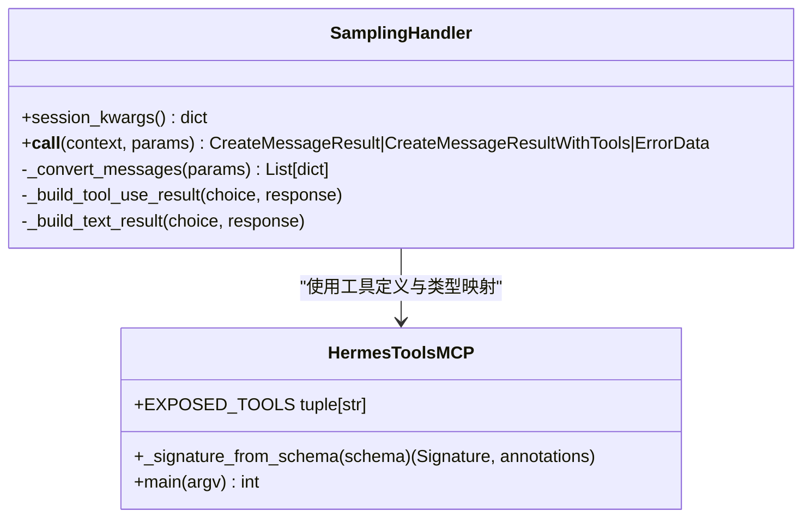
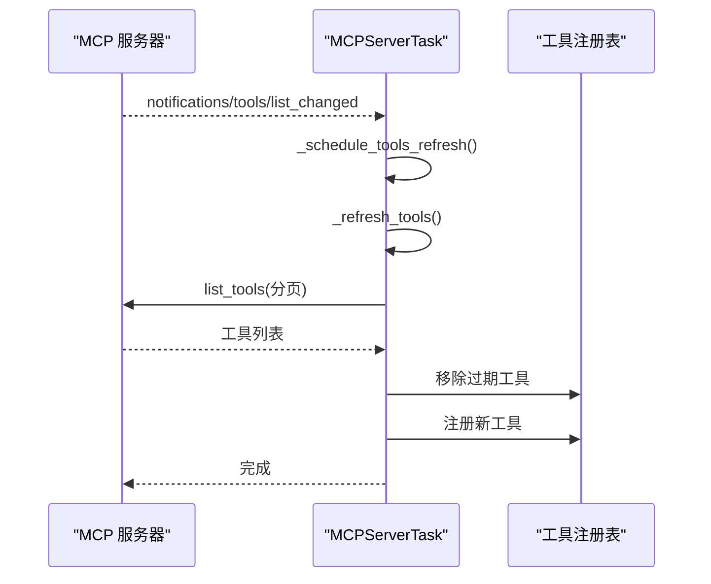
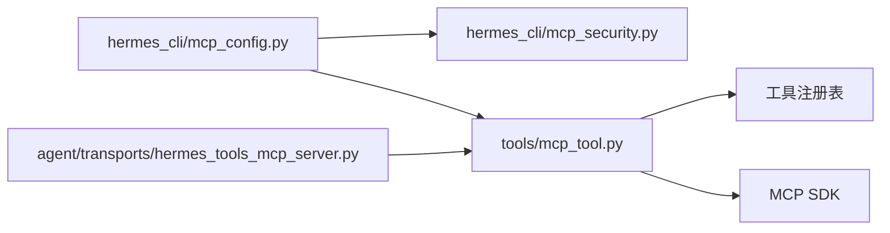

# 工具发现机制

<cite>
**本文引用的文件**
- [tools/mcp_tool.py](file://tools/mcp_tool.py)
- [hermes_cli/mcp_config.py](file://hermes_cli/mcp_config.py)
- [hermes_cli/mcp_security.py](file://hermes_cli/mcp_security.py)
- [agent/transports/hermes_tools_mcp_server.py](file://agent/transports/hermes_tools_mcp_server.py)
- [tests/tools/test_mcp_dynamic_discovery.py](file://tests/tools/test_mcp_dynamic_discovery.py)
</cite>

## 目录
1. [简介](#简介)
2. [项目结构](#项目结构)
3. [核心组件](#核心组件)
4. [架构总览](#架构总览)
5. [详细组件分析](#详细组件分析)
6. [依赖关系分析](#依赖关系分析)
7. [性能考量](#性能考量)
8. [故障排查指南](#故障排查指南)
9. [结论](#结论)
10. [附录](#附录)

## 简介
本文件系统性说明 Hermes 中 MCP（Model Context Protocol）工具的发现与注册机制，覆盖以下主题：
- 工具注册流程、动态工具发现与工具列表更新机制
- tools/list 调用过程、分页处理（nextCursor）与最大页面限制
- 工具描述扫描、提示注入检测与安全性检查
- 工具元数据处理、参数验证与类型映射
- 工具发现的完整流程图与错误处理策略
- 动态工具更新通知（notifications/tools/list_changed）与工具缓存机制

## 项目结构
围绕 MCP 工具发现的关键代码分布在如下模块：
- tools/mcp_tool.py：MCP 客户端核心实现，负责连接、发现、分页、动态刷新、安全扫描、资源/媒体处理、采样与请求等。
- hermes_cli/mcp_config.py：CLI 侧的 MCP 服务器配置管理与临时探测（测试/添加），复用底层发现能力。
- hermes_cli/mcp_security.py：对用户配置的 MCP 服务器条目进行安全检查（防外泄、持久化攻击、IOC 拦截）。
- agent/transports/hermes_tools_mcp_server.py：将 Hermes 内部工具以 MCP 服务形式暴露给外部运行时（如 Codex），用于跨进程工具发现与调用。
- tests/tools/test_mcp_dynamic_discovery.py：针对动态工具发现（notifications/tools/list_changed）与注册/注销行为的单元测试。

**图表来源**
- [tools/mcp_tool.py:655-699](file://tools/mcp_tool.py#L655-L699)
- [hermes_cli/mcp_config.py:278-378](file://hermes_cli/mcp_config.py#L278-L378)
- [hermes_cli/mcp_security.py:121-177](file://hermes_cli/mcp_security.py#L121-L177)
- [agent/transports/hermes_tools_mcp_server.py:152-245](file://agent/transports/hermes_tools_mcp_server.py#L152-L245)
- [tests/tools/test_mcp_dynamic_discovery.py:79-113](file://tests/tools/test_mcp_dynamic_discovery.py#L79-L113)

**章节来源**
- [tools/mcp_tool.py:655-699](file://tools/mcp_tool.py#L655-L699)
- [hermes_cli/mcp_config.py:278-378](file://hermes_cli/mcp_config.py#L278-L378)
- [hermes_cli/mcp_security.py:121-177](file://hermes_cli/mcp_security.py#L121-L177)
- [agent/transports/hermes_tools_mcp_server.py:152-245](file://agent/transports/hermes_tools_mcp_server.py#L152-L245)
- [tests/tools/test_mcp_dynamic_discovery.py:79-113](file://tests/tools/test_mcp_dynamic_discovery.py#L79-L113)

## 核心组件
- MCPServerTask：管理单个 MCP 服务器的连接生命周期、工具列表维护、动态刷新、保活探测、重连与回收。
- _paginate_full_list：按 nextCursor 拉取 tools/resources/prompts 的全量列表，带最大页限制保护。
- _scan_mcp_description：扫描工具描述中的提示注入模式并记录告警。
- SamplingHandler/ElicitationHandler：处理 MCP 服务端发起的 LLM 采样与交互式输入请求。
- CLI 探测与配置：_probe_single_server 提供一次性连接与工具列表获取，配合 mcp_security 校验配置。
- 外部 MCP 服务桥接：hermes_tools_mcp_server 将 Hermes 工具以 MCP 方式暴露，供外部运行时发现与调用。

**章节来源**
- [tools/mcp_tool.py:1943-2036](file://tools/mcp_tool.py#L1943-L2036)
- [tools/mcp_tool.py:655-699](file://tools/mcp_tool.py#L655-L699)
- [tools/mcp_tool.py:593-638](file://tools/mcp_tool.py#L593-L638)
- [tools/mcp_tool.py:1385-1749](file://tools/mcp_tool.py#L1385-L1749)
- [hermes_cli/mcp_config.py:278-378](file://hermes_cli/mcp_config.py#L278-L378)
- [agent/transports/hermes_tools_mcp_server.py:152-245](file://agent/transports/hermes_tools_mcp_server.py#L152-L245)

## 架构总览
下图展示了从配置到工具注册的端到端流程，包括动态刷新与分页拉取。

**图表来源**
- [hermes_cli/mcp_config.py:278-378](file://hermes_cli/mcp_config.py#L278-L378)
- [hermes_cli/mcp_security.py:121-177](file://hermes_cli/mcp_security.py#L121-L177)
- [tools/mcp_tool.py:655-699](file://tools/mcp_tool.py#L655-L699)
- [tools/mcp_tool.py:2161-2288](file://tools/mcp_tool.py#L2161-L2288)

## 详细组件分析

### 工具注册与发现流程
- 配置校验：在保存或启动时，使用 mcp_security.validate_mcp_server_entry 对命令、参数与环境变量进行安全检查，阻断可疑外发与持久化写入行为，并拦截已知 IOC。
- 临时探测：CLI 通过 _probe_single_server 建立一次连接，读取工具列表并断开；同时根据能力开关探测 prompts/resources。
- 工具注册：底层通过 _register_server_tools 将工具注册到全局注册表，并为每个工具生成带服务器名前缀的唯一名称，避免冲突。
- 动态刷新：当收到 notifications/tools/list_changed 时，MCPServerTask 调度后台任务执行 _refresh_tools，重新拉取并更新注册表。

**图表来源**
- [hermes_cli/mcp_security.py:121-177](file://hermes_cli/mcp_security.py#L121-L177)
- [hermes_cli/mcp_config.py:278-378](file://hermes_cli/mcp_config.py#L278-L378)
- [tools/mcp_tool.py:655-699](file://tools/mcp_tool.py#L655-L699)
- [tools/mcp_tool.py:2161-2288](file://tools/mcp_tool.py#L2161-L2288)

**章节来源**
- [hermes_cli/mcp_security.py:121-177](file://hermes_cli/mcp_security.py#L121-L177)
- [hermes_cli/mcp_config.py:278-378](file://hermes_cli/mcp_config.py#L278-L378)
- [tools/mcp_tool.py:2161-2288](file://tools/mcp_tool.py#L2161-L2288)

### tools/list 调用与分页处理（nextCursor）
- 分页拉取：_paginate_full_list 循环调用 list_* 方法，直到返回结果中不包含字符串类型的 nextCursor 或达到最大页数。
- 最大页面限制：_MCP_LIST_MAX_PAGES=50，防止恶意服务器无限返回游标导致死循环。
- 容错与日志：超过上限会记录警告并截断结果，确保系统稳定。

**图表来源**
- [tools/mcp_tool.py:655-699](file://tools/mcp_tool.py#L655-L699)

**章节来源**
- [tools/mcp_tool.py:655-699](file://tools/mcp_tool.py#L655-L699)

### 工具描述扫描与提示注入检测
- 扫描规则：_scan_mcp_description 使用一组正则匹配潜在提示注入模式（如“忽略之前指令”、“你是…”、“system:”等），发现可疑内容后记录警告日志。
- 影响范围：仅记录告警，不阻断注册，以避免误报影响合法 MCP 服务器。

**图表来源**
- [tools/mcp_tool.py:593-638](file://tools/mcp_tool.py#L593-L638)

**章节来源**
- [tools/mcp_tool.py:593-638](file://tools/mcp_tool.py#L593-L638)

### 安全性检查（配置与运行期）
- 配置阶段：validate_mcp_server_entry 检查命令基名是否为 shell 解释器，若为 shell，则进一步检查参数是否包含网络外发或系统持久化写入模式，并拦截已知 IOC。
- 运行期：错误消息脱敏（_sanitize_error）去除凭据模式，避免泄露敏感信息。

**图表来源**
- [hermes_cli/mcp_security.py:121-177](file://hermes_cli/mcp_security.py#L121-L177)
- [tools/mcp_tool.py:526-532](file://tools/mcp_tool.py#L526-L532)

**章节来源**
- [hermes_cli/mcp_security.py:121-177](file://hermes_cli/mcp_security.py#L121-L177)
- [tools/mcp_tool.py:526-532](file://tools/mcp_tool.py#L526-L532)

### 工具元数据处理、参数验证与类型映射
- 元数据：工具名称、描述、inputSchema 由 MCP 服务器提供，注册时使用规范化名称（带服务器名前缀）避免冲突。
- 参数验证：SamplingHandler 在转发 server-provided tools 时对 inputSchema 进行归一化处理（_normalize_mcp_input_schema），保证 LLM 调用时的参数结构一致。
- 类型映射：hermes_tools_mcp_server 将 JSON Schema 类型映射为 Python 类型，构建函数签名与注解，便于 FastMCP 正确生成工具定义。

**图表来源**
- [tools/mcp_tool.py:1385-1749](file://tools/mcp_tool.py#L1385-L1749)
- [agent/transports/hermes_tools_mcp_server.py:56-97](file://agent/transports/hermes_tools_mcp_server.py#L56-L97)
- [agent/transports/hermes_tools_mcp_server.py:152-245](file://agent/transports/hermes_tools_mcp_server.py#L152-L245)

**章节来源**
- [tools/mcp_tool.py:1385-1749](file://tools/mcp_tool.py#L1385-L1749)
- [agent/transports/hermes_tools_mcp_server.py:56-97](file://agent/transports/hermes_tools_mcp_server.py#L56-L97)
- [agent/transports/hermes_tools_mcp_server.py:152-245](file://agent/transports/hermes_tools_mcp_server.py#L152-L245)

### 动态工具更新通知（notifications/tools/list_changed）与工具缓存机制
- 通知处理：MCPServerTask._make_message_handler 识别 ToolListChangedNotification，调度后台任务执行 _refresh_tools。
- 刷新逻辑：_refresh_tools 使用 _rpc_lock 串行化 RPC，先拉取全量工具列表，再计算差集移除过期工具，最后重新注册新工具并记录变更。
- 工具缓存：工具列表在 MCPServerTask._tools 中维护，并在刷新时替换；注册表中的工具名称与处理器保持最新，避免并发调用期间的不一致。

**图表来源**
- [tools/mcp_tool.py:2161-2288](file://tools/mcp_tool.py#L2161-L2288)
- [tests/tools/test_mcp_dynamic_discovery.py:79-113](file://tests/tools/test_mcp_dynamic_discovery.py#L79-L113)

**章节来源**
- [tools/mcp_tool.py:2161-2288](file://tools/mcp_tool.py#L2161-L2288)
- [tests/tools/test_mcp_dynamic_discovery.py:79-113](file://tests/tools/test_mcp_dynamic_discovery.py#L79-L113)

## 依赖关系分析
- 模块耦合：
  - hermes_cli/mcp_config.py 依赖 tools/mcp_tool.py 的连接与发现能力，以及 hermes_cli/mcp_security.py 的配置校验。
  - tools/mcp_tool.py 依赖全局工具注册表（registry）进行工具注册与注销，并依赖 MCP SDK 的类型与通知。
  - agent/transports/hermes_tools_mcp_server.py 依赖 model_tools 的工具定义与分发，以便将 Hermes 工具暴露为 MCP 服务。
- 外部依赖：
  - MCP SDK（mcp）：可选依赖，缺失时降级为无操作并记录调试日志。
  - anyio/asyncio：用于异步事件循环与任务管理。
  - gateway.platforms.base：用于图片/音频/文档缓存（可选路径，不可用时跳过）。

**图表来源**
- [hermes_cli/mcp_config.py:278-378](file://hermes_cli/mcp_config.py#L278-L378)
- [hermes_cli/mcp_security.py:121-177](file://hermes_cli/mcp_security.py#L121-L177)
- [tools/mcp_tool.py:209-300](file://tools/mcp_tool.py#L209-L300)
- [agent/transports/hermes_tools_mcp_server.py:152-245](file://agent/transports/hermes_tools_mcp_server.py#L152-L245)

**章节来源**
- [hermes_cli/mcp_config.py:278-378](file://hermes_cli/mcp_config.py#L278-L378)
- [hermes_cli/mcp_security.py:121-177](file://hermes_cli/mcp_security.py#L121-L177)
- [tools/mcp_tool.py:209-300](file://tools/mcp_tool.py#L209-L300)
- [agent/transports/hermes_tools_mcp_server.py:152-245](file://agent/transports/hermes_tools_mcp_server.py#L152-L245)

## 性能考量
- 分页上限：_MCP_LIST_MAX_PAGES=50，防止无限游标导致的资源耗尽。
- 保活探测：优先使用 ping，不支持时回退到 list_tools；keepalive_interval 可配置，最小值下限为 5 秒，避免忙轮询。
- 会话证明：仅在会话存活一个完整保活周期或成功执行一次工具调用后才清除重连预算，减少抖动导致的频繁重建。
- 资源大小限制：图片/音频/文档缓存有字节上限，防止恶意大负载撑爆内存或磁盘。

[本节为通用性能讨论，无需特定文件引用]

## 故障排查指南
- 连接失败分类：
  - 永久失败：认证失败（401/403）、URL 无效、非 MCP 端点、stdio 命令不存在。
  - 瞬态失败：网络抖动、超时、关闭的资源等，走指数退避重试。
- 常见错误与修复：
  - 缺少可执行文件：错误消息会提示具体缺失的可执行名，并给出 PATH 设置建议。
  - 非 MCP 端点：确认 URL 指向正确的 MCP Streamable HTTP/SSE 端点。
  - 认证失败：检查 Authorization 头或 OAuth 配置是否正确。
- 日志定位：
  - MCP 子进程 stderr 统一写入共享日志文件，便于排查启动与运行期问题。
  - 动态刷新失败会在后台任务中记录异常堆栈。

**章节来源**
- [tools/mcp_tool.py:1072-1103](file://tools/mcp_tool.py#L1072-L1103)
- [tools/mcp_tool.py:1306-1363](file://tools/mcp_tool.py#L1306-L1363)
- [tools/mcp_tool.py:155-187](file://tools/mcp_tool.py#L155-L187)
- [tools/mcp_tool.py:2111-2118](file://tools/mcp_tool.py#L2111-L2118)

## 结论
Hermes 的 MCP 工具发现机制通过严格的配置校验、安全的连接与分页拉取、动态刷新与健壮的保活/重连策略，实现了高可用与可扩展的工具生态集成。其设计兼顾了安全性（提示注入检测、配置安全检查、错误脱敏）、稳定性（分页上限、会话证明、串行化 RPC）与可观测性（日志与指标），为复杂环境下的 MCP 工具管理提供了坚实基础。

[本节为总结性内容，无需特定文件引用]

## 附录
- 关键常量与默认值：
  - 工具调用超时：_DEFAULT_TOOL_TIMEOUT=300 秒
  - 初始连接超时：_DEFAULT_CONNECT_TIMEOUT=60 秒
  - 最大重连尝试：_MAX_RECONNECT_RETRIES=5
  - 保活间隔：_DEFAULT_KEEPALIVE_INTERVAL=180 秒，下限 5 秒
  - 分页上限：_MCP_LIST_MAX_PAGES=50
- 相关能力开关：
  - sampling.enabled / max_rpm / timeout / max_tokens_cap / allowed_models
  - tools.prompts / tools.resources（控制能力探测）

[本节为补充信息，无需特定文件引用]