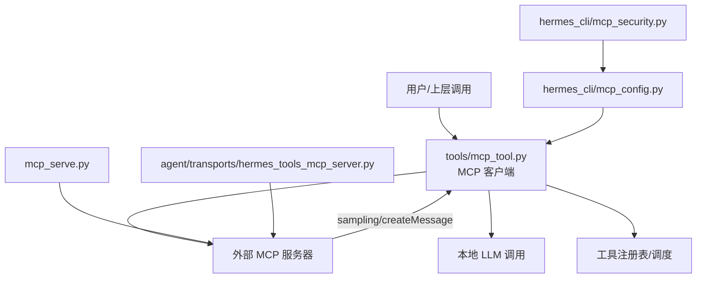
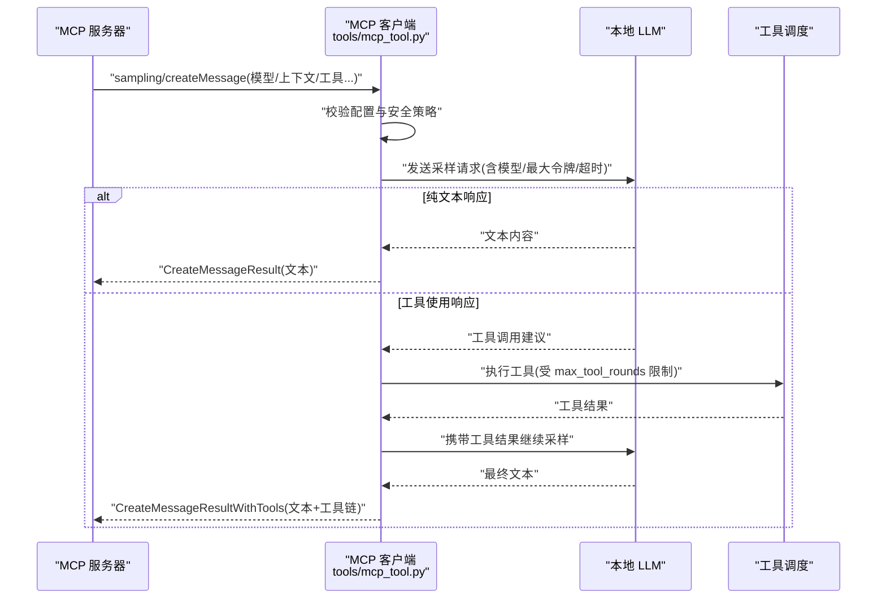
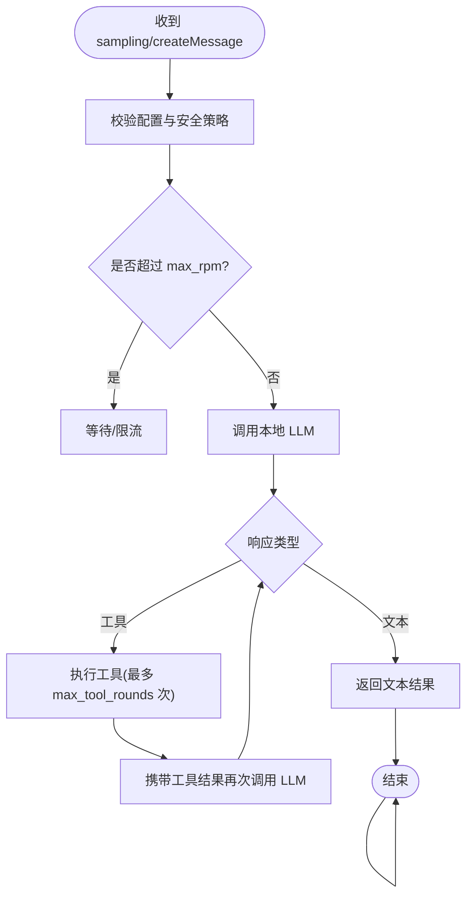
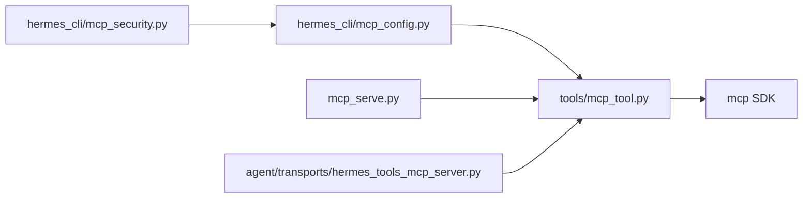

# 采样系统

<cite>
**本文引用的文件**
- [tools/mcp_tool.py](file://tools/mcp_tool.py)
- [hermes_cli/mcp_config.py](file://hermes_cli/mcp_config.py)
- [hermes_cli/mcp_security.py](file://hermes_cli/mcp_security.py)
- [mcp_serve.py](file://mcp_serve.py)
- [agent/transports/hermes_tools_mcp_server.py](file://agent/transports/hermes_tools_mcp_server.py)
</cite>

## 目录
1. [简介](#简介)
2. [项目结构](#项目结构)
3. [核心组件](#核心组件)
4. [架构总览](#架构总览)
5. [详细组件分析](#详细组件分析)
6. [依赖关系分析](#依赖关系分析)
7. [性能与速率限制](#性能与速率限制)
8. [故障排查指南](#故障排查指南)
9. [结论](#结论)
10. [附录：配置示例与监控](#附录：配置示例与监控)

## 简介
本文件面向“MCP 采样系统”，聚焦服务器发起的 LLM 请求机制，特别是 sampling/createMessage 接口的使用方式、安全控制、文本内容与工具使用内容的处理流程、生命周期管理、速率限制与日志记录，以及与主对话循环的集成和资源隔离。该能力由 MCP 客户端层（tools/mcp_tool.py）提供，并在 CLI/启动流程中通过配置与安全校验进行治理；同时提供两个内置 MCP 服务示例用于演示与集成：消息桥接服务（mcp_serve.py）与 Codex 工具子集服务（agent/transports/hermes_tools_mcp_server.py）。

## 项目结构
- tools/mcp_tool.py：MCP 客户端核心实现，负责连接外部 MCP 服务器、发现工具、调用工具，以及处理服务端发起的采样请求（sampling/createMessage）。
- hermes_cli/mcp_config.py：MCP 服务器配置的增删改查、连接探测、OAuth/鉴权配置、工具选择等。
- hermes_cli/mcp_security.py：对 MCP 服务器条目进行安全校验，阻断高危命令形状与已知 IOC。
- mcp_serve.py：Hermes 消息桥接 MCP 服务，暴露会话与消息读取等工具，并包含事件轮询队列。
- agent/transports/hermes_tools_mcp_server.py：为 Codex 运行时暴露精选 Hermes 工具的 MCP 服务。

图表来源
- [tools/mcp_tool.py:1-120](file://tools/mcp_tool.py#L1-L120)
- [hermes_cli/mcp_config.py:1-120](file://hermes_cli/mcp_config.py#L1-L120)
- [hermes_cli/mcp_security.py:1-120](file://hermes_cli/mcp_security.py#L1-L120)
- [mcp_serve.py:1-120](file://mcp_serve.py#L1-L120)
- [agent/transports/hermes_tools_mcp_server.py:1-60](file://agent/transports/hermes_tools_mcp_server.py#L1-L60)

章节来源
- [tools/mcp_tool.py:1-120](file://tools/mcp_tool.py#L1-L120)
- [hermes_cli/mcp_config.py:1-120](file://hermes_cli/mcp_config.py#L1-L120)
- [hermes_cli/mcp_security.py:1-120](file://hermes_cli/mcp_security.py#L1-L120)
- [mcp_serve.py:1-120](file://mcp_serve.py#L1-L120)
- [agent/transports/hermes_tools_mcp_server.py:1-60](file://agent/transports/hermes_tools_mcp_server.py#L1-L60)

## 核心组件
- MCP 客户端与采样处理器（tools/mcp_tool.py）
  - 维护后台事件循环与每个服务器的长连接任务。
  - 支持 stdio、HTTP/Streamable HTTP、SSE 传输。
  - 解析并执行 sampling/createMessage 请求，返回文本或工具使用结果。
  - 提供 per-server 超时、重连退避、keepalive、日志回调等。
- MCP 配置与安全（hermes_cli/mcp_config.py、hermes_cli/mcp_security.py）
  - 添加/删除/测试/列出 MCP 服务器，支持 OAuth、Bearer 头、环境变量插值。
  - 在保存与启动时校验命令形状，阻止网络外发与持久化写入等高危模式，并拦截已知 IOC。
- 内置 MCP 服务示例
  - mcp_serve.py：消息桥接，提供会话列表、消息读取、附件提取、事件轮询等工具。
  - agent/transports/hermes_tools_mcp_server.py：为 Codex 暴露精选工具（搜索、浏览器自动化、视觉、图像生成、TTS、看板等）。

章节来源
- [tools/mcp_tool.py:1-120](file://tools/mcp_tool.py#L1-L120)
- [hermes_cli/mcp_config.py:1-120](file://hermes_cli/mcp_config.py#L1-L120)
- [hermes_cli/mcp_security.py:1-120](file://hermes_cli/mcp_security.py#L1-L120)
- [mcp_serve.py:1-120](file://mcp_serve.py#L1-L120)
- [agent/transports/hermes_tools_mcp_server.py:1-60](file://agent/transports/hermes_tools_mcp_server.py#L1-L60)

## 架构总览
MCP 采样系统以“客户端驱动”的方式工作：当外部 MCP 服务器需要 LLM 能力时，会通过 sampling/createMessage 向客户端发起请求。客户端根据服务器配置的安全策略与速率限制，调用本地 LLM，并将文本或工具使用结果回传给服务器。

图表来源
- [tools/mcp_tool.py:1367-1450](file://tools/mcp_tool.py#L1367-L1450)
- [tools/mcp_tool.py:1386-1500](file://tools/mcp_tool.py#L1386-L1500)

章节来源
- [tools/mcp_tool.py:1367-1500](file://tools/mcp_tool.py#L1367-L1500)

## 详细组件分析

### 采样处理器（sampling/createMessage）
- 职责
  - 接收服务器发起的采样请求，解析模型、上下文、工具定义等参数。
  - 应用 per-server 采样配置（model、max_tokens_cap、timeout、max_rpm、allowed_models、max_tool_rounds、log_level）。
  - 将请求转发到本地 LLM，并根据响应类型返回文本或工具使用结果。
  - 在工具使用场景下，按 max_tool_rounds 限制工具循环次数，避免无限递归。
- 数据流
  - 输入：服务器提供的采样请求（包含模型、上下文、工具等）。
  - 处理：安全校验、速率限制、超时控制、工具执行。
  - 输出：文本或工具使用结果，回传至服务器。
- 错误处理
  - 对异常进行脱敏（移除凭据），记录日志，返回结构化错误。
  - 支持重试与退避策略，保障稳定性。

图表来源
- [tools/mcp_tool.py:1367-1500](file://tools/mcp_tool.py#L1367-L1500)

章节来源
- [tools/mcp_tool.py:1367-1500](file://tools/mcp_tool.py#L1367-L1500)

### 配置与安全控制
- 配置项（per-server）
  - model：覆盖默认模型。
  - max_tokens_cap：单次请求最大令牌数。
  - timeout：LLM 调用超时（秒）。
  - max_rpm：每分钟最大请求数。
  - allowed_models：白名单（空表示允许全部）。
  - max_tool_rounds：工具循环上限（0 表示禁用）。
  - log_level：审计日志级别。
- 安全校验
  - 阻止 shell 解释器配合网络外发或持久化写入的高危形状。
  - 拦截已知 IOC（如特定 SSH 公钥、IP 段）。
  - 在保存与启动时双重校验，防止预置恶意配置执行。

章节来源
- [tools/mcp_tool.py:1-120](file://tools/mcp_tool.py#L1-L120)
- [hermes_cli/mcp_security.py:1-182](file://hermes_cli/mcp_security.py#L1-L182)

### 文本内容与工具使用内容的处理
- 文本内容
  - 从消息中提取纯文本部分，支持多部分内容块拼接。
  - 对过长内容进行截断，避免过大负载。
- 工具使用内容
  - 识别非文本附件（图片、媒体标签、URL、文件引用）。
  - 在采样响应为工具使用时，执行工具并收集结果，必要时多次调用 LLM 直至收敛。

章节来源
- [mcp_serve.py:234-282](file://mcp_serve.py#L234-L282)
- [tools/mcp_tool.py:1367-1500](file://tools/mcp_tool.py#L1367-L1500)

### 生命周期管理与资源隔离
- 生命周期
  - 后台事件循环：每个 MCP 服务器作为独立 Task 运行，保持传输上下文存活。
  - 重连与保活：指数退避重连，HTTP/SSE 会话 keepalive 心跳。
  - 回收策略：空闲时长与最大生命周期可配置，避免僵尸进程。
- 资源隔离
  - 环境变量过滤：仅传递安全变量，防止敏感信息泄露。
  - 日志隔离：stderr 重定向到共享日志文件，按服务器名标记。
  - 线程安全：全局锁保护共享状态，适配自由线程环境。

章节来源
- [tools/mcp_tool.py:136-200](file://tools/mcp_tool.py#L136-L200)
- [tools/mcp_tool.py:338-375](file://tools/mcp_tool.py#L338-L375)
- [tools/mcp_tool.py:493-500](file://tools/mcp_tool.py#L493-L500)

### 与主对话循环的集成
- 工具注册：MCP 工具通过工具注册表暴露给主对话循环，模型可在 turn 中直接调用。
- 背景发现：CLI/TUI 启动时后台发现 MCP 工具，确保首 turn 可用。
- 集成点：hermes_cli/mcp_config.py 提供 add/list/test/configure 等命令，便于运维与调试。

章节来源
- [hermes_cli/mcp_config.py:1-120](file://hermes_cli/mcp_config.py#L1-L120)
- [hermes_cli/mcp_startup.py:1-120](file://hermes_cli/mcp_startup.py#L1-L120)

## 依赖关系分析
- tools/mcp_tool.py 依赖 mcp SDK（可选），动态检测功能可用性（采样、通知、elicitation）。
- hermes_cli/mcp_config.py 依赖 hermes_cli.config 与 tools.mcp_tool，负责配置与探测。
- hermes_cli/mcp_security.py 提供安全校验，被配置模块与启动流程复用。
- mcp_serve.py 与 agent/transports/hermes_tools_mcp_server.py 作为示例服务，供客户端连接与测试。

图表来源
- [tools/mcp_tool.py:209-282](file://tools/mcp_tool.py#L209-L282)
- [hermes_cli/mcp_config.py:1-120](file://hermes_cli/mcp_config.py#L1-L120)
- [hermes_cli/mcp_security.py:1-120](file://hermes_cli/mcp_security.py#L1-L120)
- [mcp_serve.py:1-120](file://mcp_serve.py#L1-L120)
- [agent/transports/hermes_tools_mcp_server.py:1-60](file://agent/transports/hermes_tools_mcp_server.py#L1-L60)

章节来源
- [tools/mcp_tool.py:209-282](file://tools/mcp_tool.py#L209-L282)
- [hermes_cli/mcp_config.py:1-120](file://hermes_cli/mcp_config.py#L1-L120)
- [hermes_cli/mcp_security.py:1-120](file://hermes_cli/mcp_security.py#L1-L120)
- [mcp_serve.py:1-120](file://mcp_serve.py#L1-L120)
- [agent/transports/hermes_tools_mcp_server.py:1-60](file://agent/transports/hermes_tools_mcp_server.py#L1-L60)

## 性能与速率限制
- 速率限制
  - max_rpm：按服务器维度限制每分钟请求数，避免过载。
  - 重连退避：指数退避 + 抖动，减少雪崩效应。
  - Keepalive：HTTP/SSE 会话保活，降低因空闲导致的会话失效。
- 超时控制
  - connect_timeout：初始连接超时。
  - timeout：LLM 调用超时，防止长时间阻塞。
- 资源回收
  - idle_timeout_seconds：空闲回收。
  - max_lifetime_seconds：最大生命周期回收。
- 日志与诊断
  - logging_callback：捕获服务器侧诊断信息。
  - stderr 重定向：统一日志文件，便于排障。

章节来源
- [tools/mcp_tool.py:338-375](file://tools/mcp_tool.py#L338-L375)
- [tools/mcp_tool.py:136-200](file://tools/mcp_tool.py#L136-L200)

## 故障排查指南
- 常见问题
  - 连接失败：检查 connect_timeout、网络可达性、认证头是否正确。
  - 工具不可用：确认工具已启用，且未被安全规则拦截。
  - 采样无响应：检查 timeout、max_rpm 是否过严，查看日志定位阻塞点。
- 日志位置
  - 标准错误重定向至 ~/.hermes/logs/mcp-stderr.log，按服务器名区分。
  - 采样相关日志可通过 log_level 调整粒度。
- 安全拦截
  - 若配置被拒绝，检查命令形状是否触发高危模式或 IOC 匹配。

章节来源
- [tools/mcp_tool.py:136-200](file://tools/mcp_tool.py#L136-L200)
- [hermes_cli/mcp_security.py:121-182](file://hermes_cli/mcp_security.py#L121-L182)

## 结论
MCP 采样系统通过标准化的 sampling/createMessage 接口，使外部 MCP 服务器能够安全、可控地调用本地 LLM，并支持工具链式推理。系统在配置、安全、速率限制、超时与日志方面提供了完善的能力，同时通过后台事件循环与资源回收机制保障稳定性。内置示例服务便于快速验证与集成。

## 附录：配置示例与监控
- 配置示例（per-server）
  - enabled：是否启用。
  - model：覆盖模型。
  - max_tokens_cap：最大令牌数。
  - timeout：LLM 调用超时（秒）。
  - max_rpm：每分钟最大请求数。
  - allowed_models：模型白名单。
  - max_tool_rounds：工具循环上限。
  - log_level：日志级别。
- 监控方法
  - 使用 hermes mcp test 测试连接与工具发现。
  - 查看 ~/.hermes/logs/mcp-stderr.log 获取服务器 stderr 输出。
  - 通过 get_mcp_status() 查询连接状态与工具数量。

章节来源
- [tools/mcp_tool.py:1-120](file://tools/mcp_tool.py#L1-L120)
- [hermes_cli/mcp_config.py:721-783](file://hermes_cli/mcp_config.py#L721-L783)