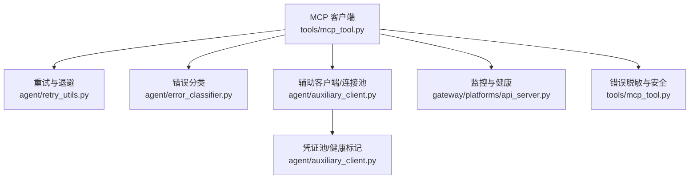
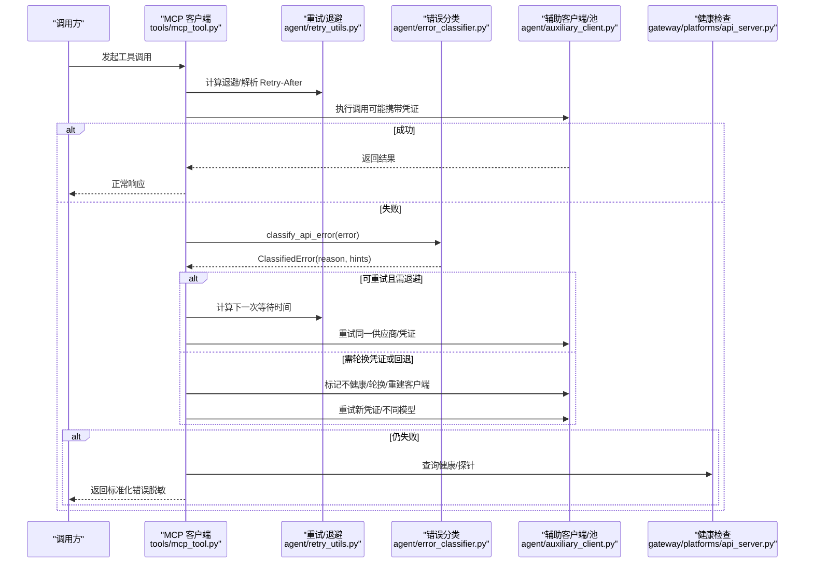
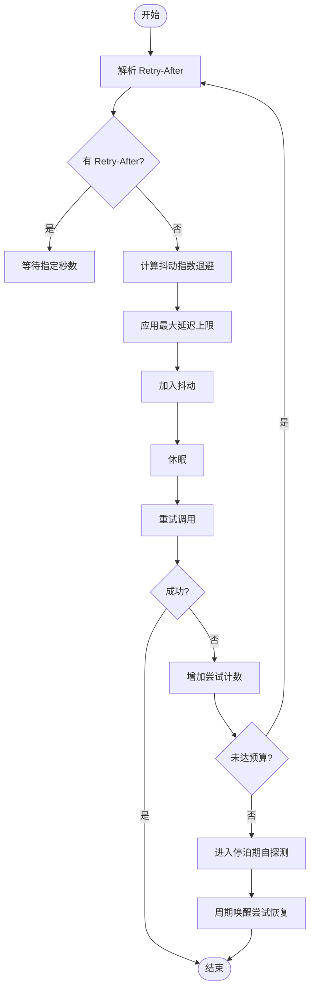
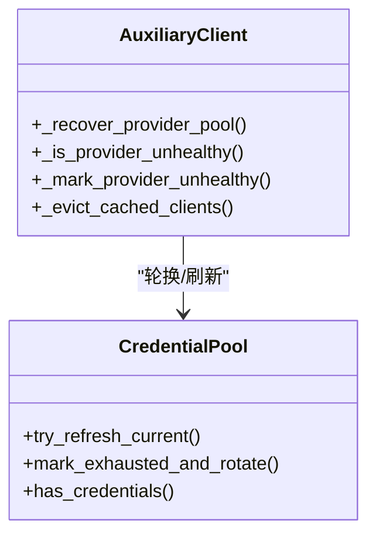
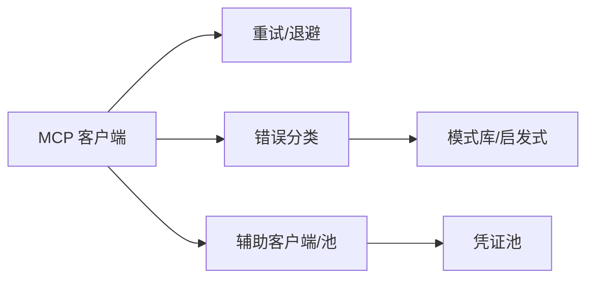

# 错误处理与恢复

<cite>
**本文引用的文件**
- [tools/mcp_tool.py](file://tools/mcp_tool.py)
- [agent/retry_utils.py](file://agent/retry_utils.py)
- [agent/error_classifier.py](file://agent/error_classifier.py)
- [agent/auxiliary_client.py](file://agent/auxiliary_client.py)
- [agent/errors.py](file://agent/errors.py)
- [tests/tools/test_terminal_error_redaction.py](file://tests/tools/test_terminal_error_redaction.py)
- [gateway/platforms/api_server.py](file://gateway/platforms/api_server.py)
</cite>

## 目录
1. [简介](#简介)
2. [项目结构](#项目结构)
3. [核心组件](#核心组件)
4. [架构总览](#架构总览)
5. [详细组件分析](#详细组件分析)
6. [依赖关系分析](#依赖关系分析)
7. [性能考量](#性能考量)
8. [故障排查指南](#故障排查指南)
9. [结论](#结论)
10. [附录](#附录)

## 简介
本文件聚焦于 MCP（Model Context Protocol）在 hermes-agent 中的错误处理与恢复机制，覆盖连接错误的分类处理、自动重连策略与指数退避算法；记录工具调用超时、网络异常与服务不可用情况的处理；说明错误消息的标准化格式、用户友好提示与诊断信息；包含连接池健康检查、服务状态监控与故障转移策略；提供错误日志分析方法与故障排除指南；并记录优雅关闭流程与资源清理机制。

## 项目结构
围绕 MCP 的错误处理与恢复涉及以下关键模块：
- MCP 客户端与连接管理：负责连接建立、工具发现、心跳保活、重连与优雅关闭
- 重试与退避：提供抖动指数退避、特定供应商过载自适应退避、Retry-After 解析
- 错误分类：将 API/传输层错误归类为可重试、需压缩上下文、需轮换凭证或需回退等
- 辅助客户端与连接池：对认证失败、配额/限流、模型不可用等场景进行同供应商凭证池轮换与缓存回收
- 监控与健康检查：网关健康端点、MCP 子进程 stderr 日志、停泊期自探测
- 安全与脱敏：错误消息中凭据脱敏，避免泄露敏感信息

图表来源
- [tools/mcp_tool.py:338-374](file://tools/mcp_tool.py#L338-L374)
- [agent/retry_utils.py:38-128](file://agent/retry_utils.py#L38-L128)
- [agent/error_classifier.py:24-94](file://agent/error_classifier.py#L24-L94)
- [agent/auxiliary_client.py:3664-3715](file://agent/auxiliary_client.py#L3664-L3715)
- [gateway/platforms/api_server.py:2923-2929](file://gateway/platforms/api_server.py#L2923-L2929)

章节来源
- [tools/mcp_tool.py:338-374](file://tools/mcp_tool.py#L338-L374)
- [agent/retry_utils.py:38-128](file://agent/retry_utils.py#L38-L128)
- [agent/error_classifier.py:24-94](file://agent/error_classifier.py#L24-L94)
- [agent/auxiliary_client.py:3664-3715](file://agent/auxiliary_client.py#L3664-L3715)
- [gateway/platforms/api_server.py:2923-2929](file://gateway/platforms/api_server.py#L2923-L2929)

## 核心组件
- MCP 客户端（tools/mcp_tool.py）
  - 支持 stdio、HTTP/Streamable HTTP、SSE 多种传输
  - 自动重连：指数退避 + 抖动，最大重连次数与初始连接重试上限
  - 心跳保活：可配置 keepalive_interval，防止空闲会话被服务端回收
  - 停泊期自探测：当重连预算耗尽时，周期性唤醒尝试恢复
  - 优雅关闭：后台事件循环任务在关闭时有序取消，确保 anyio 作用域正确清理
  - 错误脱敏：正则替换令牌、密钥、Bearer 等敏感片段
- 重试与退避（agent/retry_utils.py）
  - jittered_backoff：抖动指数退避，防“惊群”
  - parse_retry_after_seconds：解析 Retry-After 头（秒数或 HTTP-date）
  - adaptive_rate_limit_backoff：针对特定供应商过载（如 Z.AI Coding Plan GLM-5.2）的短/长退避切换
- 错误分类（agent/error_classifier.py）
  - 结构化分类结果 ClassifiedError，含 reason、status_code、provider、model、message、error_context 及恢复建议（retryable、should_compress、should_rotate_credential、should_fallback）
  - 优先级分类管线：先处理供应商特定模式，再按状态码/消息体/类型启发式分类
  - 覆盖认证、计费/配额、服务器过载、传输超时、SSL/TLS、上下文溢出、负载过大、图片过大、模型不存在、内容策略拦截、请求格式错误等
- 辅助客户端与连接池（agent/auxiliary_client.py）
  - 同供应商凭证池轮换：认证失败、付费/配额、限流等触发旋转
  - 健康标记：临时标记供应商不健康，跳过无效目标
  - 缓存回收：关闭损坏客户端后从缓存驱逐，下次重建
  - 重试封装：同步/异步 _retry_same_provider_* 统一重建客户端并重试
- 监控与健康（gateway/platforms/api_server.py）
  - 暴露 /health 与详细健康端点，便于外部探针检测服务可用性
- 安全与脱敏（tools/mcp_tool.py, tests/tools/test_terminal_error_redaction.py）
  - 错误消息中凭据脱敏，测试验证错误与回溯字段不包含明文密钥

章节来源
- [tools/mcp_tool.py:338-374](file://tools/mcp_tool.py#L338-L374)
- [agent/retry_utils.py:38-128](file://agent/retry_utils.py#L38-L128)
- [agent/error_classifier.py:24-94](file://agent/error_classifier.py#L24-L94)
- [agent/auxiliary_client.py:3664-3715](file://agent/auxiliary_client.py#L3664-L3715)
- [gateway/platforms/api_server.py:2923-2929](file://gateway/platforms/api_server.py#L2923-L2929)
- [tests/tools/test_terminal_error_redaction.py:47-154](file://tests/tools/test_terminal_error_redaction.py#L47-L154)

## 架构总览
下图展示了 MCP 工具调用从发起、错误分类、重试/回退到最终返回或失败的完整流程，以及健康检查与优雅关闭的协同。

图表来源
- [tools/mcp_tool.py:338-374](file://tools/mcp_tool.py#L338-L374)
- [agent/retry_utils.py:38-128](file://agent/retry_utils.py#L38-L128)
- [agent/error_classifier.py:624-717](file://agent/error_classifier.py#L624-L717)
- [agent/auxiliary_client.py:4215-4261](file://agent/auxiliary_client.py#L4215-L4261)
- [gateway/platforms/api_server.py:2923-2929](file://gateway/platforms/api_server.py#L2923-L2929)

## 详细组件分析

### 连接错误分类与处理
- 分类维度
  - 认证失败（401/403 语义）、计费/配额（402/429）、服务器过载（503/529）、传输超时、SSL/TLS 证书校验失败、上下文溢出、负载过大、图片过大、模型不存在、内容策略拦截、请求格式错误等
- 分类输出
  - ClassifiedError.reason：决定恢复策略（重试、压缩、轮换凭证、回退）
  - 附加字段：status_code、provider、model、message、error_context
- 典型路径
  - 认证失败 → 尝试刷新凭证或轮换至下一凭证
  - 限流/配额 → 退避重试，必要时轮换
  - 过载 → 退避重试，不轮换凭证
  - SSL 证书校验失败 → 快速失败并给出可操作指引（不重试）
  - 上下文溢出 → 压缩上下文后重试
  - 负载过大/图片过大 → 压缩/缩小后重试
  - 模型不存在/能力不匹配 → 回退到其他模型或供应商
  - 内容策略拦截 → 立即回退或提示用户，不再重试相同请求

章节来源
- [agent/error_classifier.py:24-94](file://agent/error_classifier.py#L24-L94)
- [agent/error_classifier.py:624-717](file://agent/error_classifier.py#L624-L717)

### 自动重连策略与指数退避
- 基础退避
  - jittered_backoff：以 base_delay * 2^(attempt-1) 计算延迟，限制 max_delay，并加入随机抖动防止并发“惊群”
  - parse_retry_after_seconds：优先使用服务端 Retry-After 指示的等待时间
- 供应商自适应
  - adaptive_rate_limit_backoff：对特定供应商过载（如 Z.AI Coding Plan GLM-5.2）采用短重试后切换到更长的固定间隔表（30/60/90/120s），并带小抖动
- MCP 客户端重连
  - 最大重连次数与初始连接重试上限
  - 停泊期自探测：重连预算耗尽后每 _PARKED_RETRY_INTERVAL 唤醒一次尝试恢复
  - 心跳保活：keepalive_interval 控制 liveness ping 频率，避免空闲会话被回收

图表来源
- [agent/retry_utils.py:38-128](file://agent/retry_utils.py#L38-L128)
- [tools/mcp_tool.py:338-374](file://tools/mcp_tool.py#L338-L374)

章节来源
- [agent/retry_utils.py:38-128](file://agent/retry_utils.py#L38-L128)
- [tools/mcp_tool.py:338-374](file://tools/mcp_tool.py#L338-L374)

### 工具调用超时、网络异常与服务不可用
- 超时
  - 传输层超时（ConnectTimeout/ReadTimeout/PoolTimeout）与上游超时（upstream timed out）均会被分类为 timeout，触发重建客户端并重试
- 网络异常
  - 连接断开、连接重置、管道破裂、SSL 中间握手失败等属于传输层异常，通常可重试
- 服务不可用
  - 过载（overloaded）与限流（rate_limit）通过退避重试；若持续不可用则考虑回退到其他模型/供应商
- 处理要点
  - 区分“可重试”与“确定性失败”（如 SSL 证书校验失败、内容策略拦截）
  - 结合上下文大小与负载情况选择压缩/缩小策略

章节来源
- [agent/error_classifier.py:518-546](file://agent/error_classifier.py#L518-L546)
- [agent/error_classifier.py:564-619](file://agent/error_classifier.py#L564-L619)

### 错误消息标准化、用户友好提示与诊断信息
- 标准化结构
  - ClassifiedError.message 来自异常字符串、结构化 body、metadata.raw 的聚合
  - error_context 包含 status_code、provider、model 等上下文
- 用户友好提示
  - 对 SSL 证书问题直接给出修复指引，避免无意义重试
  - 对内容策略拦截明确告知不可重试，引导调整输入或切换模型
- 诊断信息
  - 保留 provider/model/status_code，便于定位问题
  - MCP 子进程 stderr 重定向到共享日志文件，便于逐服务器排障

章节来源
- [agent/error_classifier.py:665-717](file://agent/error_classifier.py#L665-L717)
- [tools/mcp_tool.py:155-187](file://tools/mcp_tool.py#L155-L187)

### 连接池健康检查、服务状态监控与故障转移
- 健康检查
  - 网关暴露 /health 与详细健康端点，供外部探针检测服务可用性
- 服务状态监控
  - 辅助客户端维护供应商健康标记，短暂标记不健康以避免无效重试
- 故障转移
  - 认证失败/付费/限流 → 同供应商凭证池轮换
  - 模型不存在/能力不匹配 → 回退到其他模型或供应商
  - 缓存回收：关闭损坏客户端后从缓存驱逐，下次重建

图表来源
- [agent/auxiliary_client.py:3664-3715](file://agent/auxiliary_client.py#L3664-L3715)
- [agent/auxiliary_client.py:4215-4261](file://agent/auxiliary_client.py#L4215-L4261)

章节来源
- [gateway/platforms/api_server.py:2923-2929](file://gateway/platforms/api_server.py#L2923-L2929)
- [agent/auxiliary_client.py:3664-3715](file://agent/auxiliary_client.py#L3664-L3715)
- [agent/auxiliary_client.py:4215-4261](file://agent/auxiliary_client.py#L4215-L4261)

### 优雅关闭与资源清理
- MCP 客户端
  - 后台事件循环任务在关闭时有序取消，确保 anyio cancel-scope 在正确的 Task 内完成清理
  - 停泊期自探测在关闭时立即退出，避免阻塞进程退出
- 辅助客户端
  - 关闭损坏客户端并从缓存驱逐，避免后续复用死连接
- 日志与资源
  - MCP 子进程 stderr 重定向到共享日志文件，关闭时确保句柄释放
  - 环境变量过滤与凭据脱敏降低安全风险

章节来源
- [tools/mcp_tool.py:371-374](file://tools/mcp_tool.py#L371-L374)
- [tools/mcp_tool.py:155-187](file://tools/mcp_tool.py#L155-L187)
- [agent/auxiliary_client.py:4093-4140](file://agent/auxiliary_client.py#L4093-L4140)

## 依赖关系分析
- 低耦合高内聚
  - 错误分类独立于重试逻辑，重试逻辑仅消费 ClassifiedError.hints
  - MCP 客户端依赖 retry_utils 与 error_classifier，但不直接感知底层供应商细节
  - 辅助客户端与凭证池解耦，通过接口进行轮换与刷新
- 潜在风险
  - 过度依赖文本模式匹配（错误分类）需持续维护以适配供应商变更
  - 重连与心跳参数不当可能导致“惊群”或频繁重建连接

图表来源
- [tools/mcp_tool.py:338-374](file://tools/mcp_tool.py#L338-L374)
- [agent/retry_utils.py:38-128](file://agent/retry_utils.py#L38-L128)
- [agent/error_classifier.py:24-94](file://agent/error_classifier.py#L24-L94)
- [agent/auxiliary_client.py:4215-4261](file://agent/auxiliary_client.py#L4215-L4261)

章节来源
- [tools/mcp_tool.py:338-374](file://tools/mcp_tool.py#L338-L374)
- [agent/retry_utils.py:38-128](file://agent/retry_utils.py#L38-L128)
- [agent/error_classifier.py:24-94](file://agent/error_classifier.py#L24-L94)
- [agent/auxiliary_client.py:4215-4261](file://agent/auxiliary_client.py#L4215-L4261)

## 性能考量
- 抖动指数退避有效降低并发重试风暴
- 自适应退避针对特定供应商过载优化用户体验（短时快速重试后拉长等待）
- 心跳保活间隔需小于服务端会话 TTL，避免频繁重建
- 停泊期自探测间隔应平衡恢复速度与资源消耗
- 错误分类的模式匹配开销较低，但需定期更新以覆盖新错误形态

[本节为通用指导，无需具体文件引用]

## 故障排查指南
- 常见问题定位
  - 认证失败：检查凭证是否过期或被吊销，观察是否触发轮换
  - 限流/配额：查看是否命中 rate_limit/billing，确认 Retry-After 与退避策略
  - 过载：观察 overloaded 分类，确认退避是否生效
  - SSL 证书问题：快速失败并检查 CA 包、代理设置、证书有效期
  - 上下文溢出：确认是否触发 should_compress，检查上下文大小与模型窗口
  - 负载过大/图片过大：确认是否触发 payload/image 过大路径，执行压缩/缩小
- 日志与诊断
  - 查看 MCP 子进程 stderr 日志（mcp-stderr.log）定位具体服务器问题
  - 关注 ClassifiedError.message 与 error_context 中的 provider/model/status_code
  - 使用网关健康端点 /health 与详细健康端点检查服务状态
- 安全与脱敏
  - 确认错误消息与回溯已脱敏，避免泄露密钥
  - 参考测试用例验证脱敏行为

章节来源
- [agent/error_classifier.py:624-717](file://agent/error_classifier.py#L624-L717)
- [tools/mcp_tool.py:155-187](file://tools/mcp_tool.py#L155-L187)
- [gateway/platforms/api_server.py:2923-2929](file://gateway/platforms/api_server.py#L2923-L2929)
- [tests/tools/test_terminal_error_redaction.py:47-154](file://tests/tools/test_terminal_error_redaction.py#L47-L154)

## 结论
hermes-agent 的 MCP 错误处理与恢复体系通过结构化错误分类、智能重试与退避、连接池健康管理与故障转移，实现了高可用的工具调用体验。配合优雅关闭与资源清理、健康检查与监控、以及严格的安全脱敏，能够在复杂网络与多供应商环境下保持稳定与可观测性。持续维护错误模式库与调优重连/心跳参数是保持系统健壮性的关键。

[本节为总结，无需具体文件引用]

## 附录
- 关键常量与默认值
  - 工具调用超时、连接超时、最大重连次数、最大初始连接重试次数、最大退避秒数、停泊期自探测间隔、心跳保活间隔等
- 供应商特定策略
  - Z.AI Coding Plan GLM-5.2 过载的短/长退避切换
- 安全最佳实践
  - 环境变量白名单、凭据脱敏、子进程 stderr 隔离

章节来源
- [tools/mcp_tool.py:338-374](file://tools/mcp_tool.py#L338-L374)
- [agent/retry_utils.py:142-209](file://agent/retry_utils.py#L142-L209)
- [agent/errors.py:1-14](file://agent/errors.py#L1-L14)