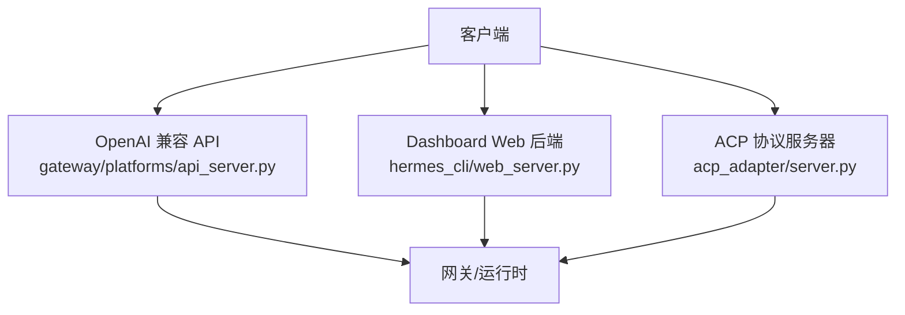
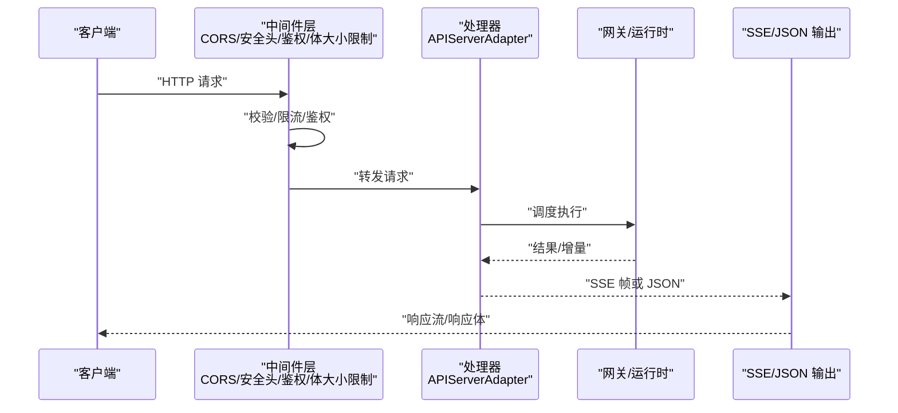
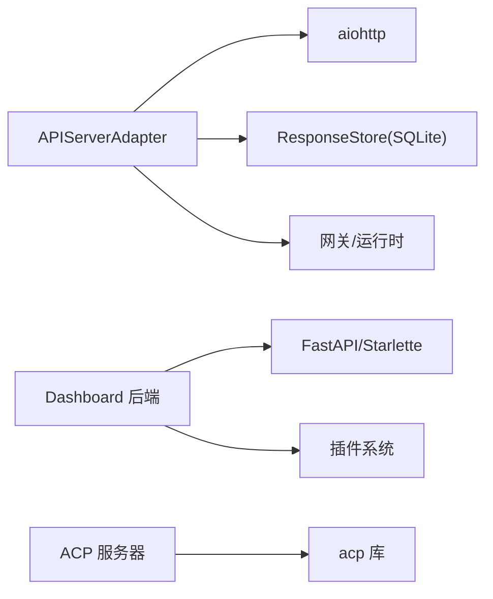

# REST API

<cite>
**本文引用的文件**
- [gateway/platforms/api_server.py](file://gateway/platforms/api_server.py)
- [hermes_cli/web_server.py](file://hermes_cli/web_server.py)
- [acp_adapter/server.py](file://acp_adapter/server.py)
</cite>

## 目录
1. [简介](#简介)
2. [项目结构](#项目结构)
3. [核心组件](#核心组件)
4. [架构总览](#架构总览)
5. [详细端点文档](#详细端点文档)
6. [依赖关系分析](#依赖关系分析)
7. [性能与限流](#性能与限流)
8. [故障排查指南](#故障排查指南)
9. [结论](#结论)
10. [附录](#附录)

## 简介
本文件为 Hermes Agent 的 REST API 文档，覆盖以下三类对外接口：
- OpenAI 兼容 HTTP API（aiohttp 服务）：提供聊天补全、响应式对话、模型列表、能力查询、会话管理、运行任务等。
- Dashboard Web UI 后端（FastAPI）：提供配置、环境变量、会话管理等本地管理接口。
- ACP（Agent Client Protocol）服务器：通过 ACP 协议暴露代理能力（非 REST，但常与 REST 配合使用）。

所有端点均包含认证方式、权限控制、错误处理、速率限制、请求/响应格式、状态码以及版本兼容性说明。

## 项目结构
Hermes Agent 将对外 HTTP 能力拆分为多个平台适配器与 Web 服务：
- gateway/platforms/api_server.py：OpenAI 兼容 HTTP 服务器，实现 /v1/* 与 /api/sessions* 等端点。
- hermes_cli/web_server.py：Dashboard 的 FastAPI 后端，提供 /api/* 管理接口。
- acp_adapter/server.py：ACP 协议服务器，用于编辑器/IDE 集成。

图表来源
- [gateway/platforms/api_server.py:1-40](file://gateway/platforms/api_server.py#L1-L40)
- [hermes_cli/web_server.py:1-10](file://hermes_cli/web_server.py#L1-L10)
- [acp_adapter/server.py:1-10](file://acp_adapter/server.py#L1-L10)

章节来源
- [gateway/platforms/api_server.py:1-40](file://gateway/platforms/api_server.py#L1-L40)
- [hermes_cli/web_server.py:1-10](file://hermes_cli/web_server.py#L1-L10)
- [acp_adapter/server.py:1-10](file://acp_adapter/server.py#L1-L10)

## 核心组件
- APIServerAdapter：基于 aiohttp 的 OpenAI 兼容 HTTP 服务，承载 /v1/chat/completions、/v1/responses、/v1/runs、/v1/models、/v1/capabilities、/health 等端点，并支持 SSE 流式事件。
- ResponseStore：SQLite-backed LRU 存储，持久化 Responses API 的历史上下文，支持按 response_id 检索与删除。
- Dashboard Web 后端：FastAPI 应用，提供 /api/* 管理接口，内置鉴权中间件、CORS、健康检查、插件路由门控等。
- ACP Server：以 ACP 协议封装 Hermes Agent 能力，供 IDE/编辑器调用。

章节来源
- [gateway/platforms/api_server.py:1351-1474](file://gateway/platforms/api_server.py#L1351-L1474)
- [gateway/platforms/api_server.py:816-982](file://gateway/platforms/api_server.py#L816-L982)
- [hermes_cli/web_server.py:313-378](file://hermes_cli/web_server.py#L313-L378)
- [acp_adapter/server.py:566-640](file://acp_adapter/server.py#L566-L640)

## 架构总览
下图展示了典型请求在 OpenAI 兼容 API 中的流转：客户端发送请求，经过 CORS、安全头、鉴权、体大小限制等中间件后进入处理器，最终由 APIServerAdapter 调度到网关/运行时执行，并以 JSON 或 SSE 形式返回。

图表来源
- [gateway/platforms/api_server.py:988-1016](file://gateway/platforms/api_server.py#L988-L1016)
- [gateway/platforms/api_server.py:1162-1185](file://gateway/platforms/api_server.py#L1162-L1185)
- [gateway/platforms/api_server.py:1187-1207](file://gateway/platforms/api_server.py#L1187-L1207)
- [gateway/platforms/api_server.py:1107-1136](file://gateway/platforms/api_server.py#L1107-L1136)

## 详细端点文档

### 通用约定
- 基础路径
  - OpenAI 兼容 API：/v1
  - Dashboard 管理 API：/api
- 认证
  - OpenAI 兼容 API：通过 API_SERVER_KEY 进行鉴权；请求头 Authorization 或密钥由适配器配置决定。
  - Dashboard API：默认需要 X-Hermes-Session-Token 或 Bearer Token；非回环绑定启用 OAuth 门控。
- 内容类型：application/json（除非另有说明）
- 字符编码：UTF-8
- 幂等键：Idempotency-Key（部分端点支持）
- 跨域：允许指定 Origin 白名单，预检 OPTIONS 自动处理

章节来源
- [gateway/platforms/api_server.py:988-1016](file://gateway/platforms/api_server.py#L988-L1016)
- [hermes_cli/web_server.py:398-468](file://hermes_cli/web_server.py#L398-L468)

### OpenAI 兼容 API（/v1）

#### POST /v1/chat/completions
- 功能：无状态聊天补全，支持流式与非流式；可选会话连续性（X-Hermes-Session-Id）与长期记忆作用域（X-Hermes-Session-Key）。
- 请求体关键字段：model、messages、stream、provider、model_options、reasoning_effort、service_tier/fast 等。
- 响应：标准 OpenAI 格式；流式时以 SSE 帧推送增量。
- 状态码：200 成功；400 参数错误；413 请求体过大；503 网关正在排水。
- 错误格式：{"error": {"message": "...", "type": "...", "param": "...", "code": "..."}}
- 速率限制：受并发上限与网关排水策略影响。
- 版本兼容：虚拟模型 hermes-agent 作为稳定别名；direct_model_requests 可允许裸 model 值直通。

章节来源
- [gateway/platforms/api_server.py:1-28](file://gateway/platforms/api_server.py#L1-L28)
- [gateway/platforms/api_server.py:1389-1416](file://gateway/platforms/api_server.py#L1389-L1416)
- [gateway/platforms/api_server.py:1107-1136](file://gateway/platforms/api_server.py#L1107-L1136)
- [gateway/platforms/api_server.py:1162-1185](file://gateway/platforms/api_server.py#L1162-L1185)
- [gateway/platforms/api_server.py:1555-1566](file://gateway/platforms/api_server.py#L1555-L1566)

#### POST /v1/responses
- 功能：响应式对话（stateful），通过 previous_response_id 维持上下文；支持 X-Hermes-Session-Key。
- 请求体关键字段：previous_response_id、input/message、model、provider、model_options。
- 响应：完整响应对象；历史被持久化于 ResponseStore。
- 状态码：200 成功；400 参数错误；413 请求体过大；503 网关排水。
- 错误格式：同 chat/completions。
- 速率限制：同上。

章节来源
- [gateway/platforms/api_server.py:1-28](file://gateway/platforms/api_server.py#L1-L28)
- [gateway/platforms/api_server.py:816-982](file://gateway/platforms/api_server.py#L816-L982)

#### GET /v1/responses/{response_id}
- 功能：获取已存储的响应。
- 状态码：200 成功；404 未找到。

章节来源
- [gateway/platforms/api_server.py:1-28](file://gateway/platforms/api_server.py#L1-L28)
- [gateway/platforms/api_server.py:888-912](file://gateway/platforms/api_server.py#L888-L912)

#### DELETE /v1/responses/{response_id}
- 功能：删除已存储的响应。
- 状态码：200 成功；404 未找到。

章节来源
- [gateway/platforms/api_server.py:1-28](file://gateway/platforms/api_server.py#L1-L28)
- [gateway/platforms/api_server.py:945-955](file://gateway/platforms/api_server.py#L945-L955)

#### GET /v1/models
- 功能：列出 hermes-agent 及配置的 model_routes 别名。
- 状态码：200 成功。

章节来源
- [gateway/platforms/api_server.py:1-28](file://gateway/platforms/api_server.py#L1-L28)

#### GET /v1/capabilities
- 功能：机器可读的 API 能力描述。
- 状态码：200 成功。

章节来源
- [gateway/platforms/api_server.py:1-28](file://gateway/platforms/api_server.py#L1-L28)

#### 会话管理（/api/sessions）
- POST /api/sessions：创建空会话。
- GET /api/sessions：列出可见会话。
- GET /api/sessions/{session_id}：读取会话。
- PATCH /api/sessions/{session_id}：更新会话。
- DELETE /api/sessions/{session_id}：删除会话。
- GET /api/sessions/{session_id}/messages：读取消息历史。
- POST /api/sessions/{session_id}/fork：基于 SessionDB 分支会话。
- POST /api/sessions/{session_id}/chat[/stream]：与持久化会话聊天（支持流式）。
- 状态码：200/201/400/404/503 等。
- 认证：遵循 OpenAI 兼容 API 的鉴权策略。

章节来源
- [gateway/platforms/api_server.py:1-28](file://gateway/platforms/api_server.py#L1-L28)

#### 运行任务（/v1/runs）
- POST /v1/runs：启动运行，立即返回 run_id（202）。
- GET /v1/runs/{run_id}：查询当前运行状态。
- GET /v1/runs/{run_id}/events：SSE 结构化生命周期事件流。
- POST /v1/runs/{run_id}/approval：解决待审批的运行。
- POST /v1/runs/{run_id}/stop：中断正在运行的代理。
- 状态码：202/200/400/404/503 等。
- 并发限制：受 max_concurrent_runs 控制。

章节来源
- [gateway/platforms/api_server.py:1-28](file://gateway/platforms/api_server.py#L1-L28)
- [gateway/platforms/api_server.py:1447-1465](file://gateway/platforms/api_server.py#L1447-L1465)

#### 健康检查
- GET /health：健康检查。
- GET /health/detailed：丰富状态（跨容器仪表板探测）。
- 状态码：200 正常；503 降级/排水。

章节来源
- [gateway/platforms/api_server.py:1-28](file://gateway/platforms/api_server.py#L1-L28)

### Dashboard Web 后端（/api）
- 认证：默认要求 X-Hermes-Session-Token 或 Bearer Token；非回环绑定启用 OAuth 门控。
- CORS：仅允许 localhost/127.0.0.1 源。
- 插件路由：/api/plugins/{name}/... 受运行时启用/禁用门控保护。
- 公共路径：少数只读端点无需鉴权（见 public_paths）。
- 示例端点：/api/sessions、/api/status、/api/files/download（支持 ?token=）。
- 状态码：200/401/404/500 等。

章节来源
- [hermes_cli/web_server.py:313-378](file://hermes_cli/web_server.py#L313-L378)
- [hermes_cli/web_server.py:398-468](file://hermes_cli/web_server.py#L398-L468)
- [hermes_cli/web_server.py:568-633](file://hermes_cli/web_server.py#L568-L633)
- [hermes_cli/web_server.py:644-671](file://hermes_cli/web_server.py#L644-L671)

### ACP 协议服务器（非 REST）
- 协议：ACP（Agent Client Protocol），用于编辑器/IDE 集成。
- 能力：会话管理、模型选择、工具调用、资源附件等。
- 注意：该接口不采用 REST 风格，但与 REST API 协同工作。

章节来源
- [acp_adapter/server.py:1-10](file://acp_adapter/server.py#L1-L10)
- [acp_adapter/server.py:566-640](file://acp_adapter/server.py#L566-L640)

## 依赖关系分析
- APIServerAdapter 依赖：
  - aiohttp：HTTP 服务器与中间件。
  - ResponseStore：SQLite 持久化 Responses 历史。
  - 网关/运行时：实际执行代理逻辑。
- Dashboard 后端依赖：
  - FastAPI/Starlette：Web 框架与中间件。
  - 插件系统：运行时启用/禁用门控。
- ACP 服务器依赖：
  - acp 库：协议定义与序列化。

图表来源
- [gateway/platforms/api_server.py:79-84](file://gateway/platforms/api_server.py#L79-L84)
- [gateway/platforms/api_server.py:816-982](file://gateway/platforms/api_server.py#L816-L982)
- [hermes_cli/web_server.py:103-133](file://hermes_cli/web_server.py#L103-L133)
- [acp_adapter/server.py:18-63](file://acp_adapter/server.py#L18-L63)

章节来源
- [gateway/platforms/api_server.py:79-84](file://gateway/platforms/api_server.py#L79-L84)
- [gateway/platforms/api_server.py:816-982](file://gateway/platforms/api_server.py#L816-L982)
- [hermes_cli/web_server.py:103-133](file://hermes_cli/web_server.py#L103-L133)
- [acp_adapter/server.py:18-63](file://acp_adapter/server.py#L18-L63)

## 性能与限流
- 请求体大小限制：最大 10 MB（MAX_REQUEST_BYTES），超限返回 413。
- 并发限制：max_concurrent_runs 控制同时运行的代理数量，防止资源耗尽。
- 排水模式：网关排水期间返回 503 并提示重试。
- SSE 心跳：聊天补全 SSE 保持心跳间隔。
- 多模态内容长度限制：文本归一化最大 64 KB，列表项最大 1000。
- 响应历史自动截断：Responses API 保留最近 N 条（默认 100）。

章节来源
- [gateway/platforms/api_server.py:152-158](file://gateway/platforms/api_server.py#L152-L158)
- [gateway/platforms/api_server.py:1162-1185](file://gateway/platforms/api_server.py#L1162-L1185)
- [gateway/platforms/api_server.py:1447-1465](file://gateway/platforms/api_server.py#L1447-L1465)
- [gateway/platforms/api_server.py:1555-1566](file://gateway/platforms/api_server.py#L1555-L1566)
- [gateway/platforms/api_server.py:439-475](file://gateway/platforms/api_server.py#L439-L475)

## 故障排查指南
- 常见错误
  - 400 参数错误：检查 messages/input 字段、content 类型、image_url 格式。
  - 413 请求体过大：减少消息长度或图片数据。
  - 503 网关排水：等待重试或检查网关状态。
  - 401 未授权：确认 API_SERVER_KEY 或 Dashboard Token。
- 诊断步骤
  - 查看 /health 与 /health/detailed 了解服务状态。
  - 检查 ResponseStore 是否可用（SQLite WAL 回退机制）。
  - 审查 SSE 事件流以定位运行阶段问题。
- 日志与审计
  - 错误信息会进行敏感信息脱敏。
  - 插件路由访问受运行时启用/禁用门控保护。

章节来源
- [gateway/platforms/api_server.py:1082-1099](file://gateway/platforms/api_server.py#L1082-L1099)
- [gateway/platforms/api_server.py:816-982](file://gateway/platforms/api_server.py#L816-L982)
- [hermes_cli/web_server.py:568-633](file://hermes_cli/web_server.py#L568-L633)

## 结论
Hermes Agent 提供了完善的 REST API 与相关服务，涵盖 OpenAI 兼容接口、Dashboard 管理与 ACP 协议。通过严格的鉴权、限流、排水与安全头策略，确保在生产环境中的稳定性与安全性。建议客户端遵循幂等键、流式处理与错误重试最佳实践，并结合 /v1/models 与 /v1/capabilities 动态适配能力变化。

## 附录

### 客户端集成指南
- 使用 /v1/models 获取可用模型与别名。
- 使用 /v1/capabilities 检测服务端能力。
- 对长对话使用流式 SSE 以减少延迟。
- 使用 Idempotency-Key 保证幂等性。
- 合理设置超时与重试策略，处理 503 排水场景。

### 最佳实践
- 避免发送超大请求体，必要时分片或压缩。
- 对敏感信息进行脱敏后再发送到服务端。
- 使用会话连续性（X-Hermes-Session-Id）提升体验。
- 监控 /health 与 /health/detailed 进行健康检查。

### 性能优化建议
- 启用流式响应以降低首字节延迟。
- 合理设置 max_concurrent_runs 以平衡吞吐与资源占用。
- 利用 Responses API 的历史截断机制控制上下文大小。
- 使用模型路由（model_routes）将不同客户端映射到最优后端。

### API 版本管理与向后兼容
- 虚拟模型 hermes-agent 提供稳定别名，屏蔽底层模型变更。
- direct_model_requests 允许裸 model 值直通，便于兼容旧客户端。
- Responses API 保留最近 N 条历史，确保上下文一致性。
- 能力枚举（/v1/capabilities）帮助客户端动态适配新特性。