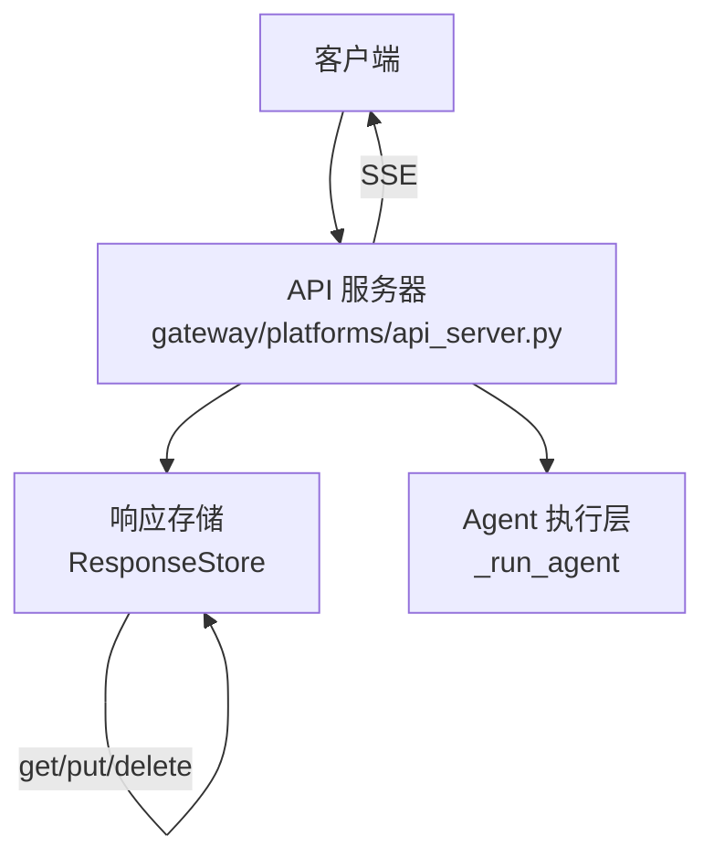
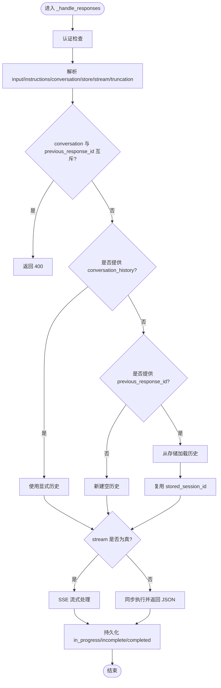
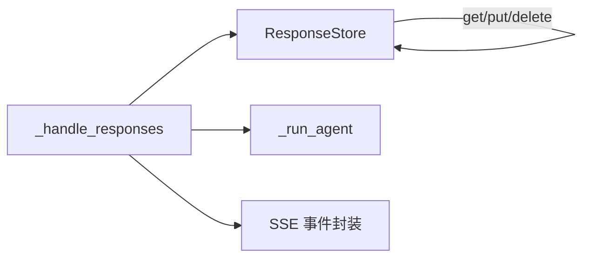

# Responses API

<cite>
**本文引用的文件**
- [gateway/platforms/api_server.py](file://gateway/platforms/api_server.py)
</cite>

## 目录
1. [简介](#简介)
2. [项目结构](#项目结构)
3. [核心组件](#核心组件)
4. [架构总览](#架构总览)
5. [详细组件分析](#详细组件分析)
6. [依赖关系分析](#依赖关系分析)
7. [性能考量](#性能考量)
8. [故障排查指南](#故障排查指南)
9. [结论](#结论)
10. [附录：接口规范与示例](#附录接口规范与示例)

## 简介
本文件面向使用 /v1/responses 端点的开发者，系统性说明该接口的状态管理能力、会话历史维护机制（previous_response_id）、以及存储响应的查询与删除能力。文档同时给出请求/响应数据模型、状态码与错误处理约定，并提供完整的调用流程示意，帮助读者理解 Responses API 与聊天补全 API 的区别及适用场景。

## 项目结构
Responses API 由网关平台的 HTTP 服务暴露，路由注册在平台服务器中，具体处理逻辑集中在同一文件的处理器方法内。关键路径包括：
- 路由注册：POST /v1/responses、GET /v1/responses/{response_id}、DELETE /v1/responses/{response_id}
- 请求处理：_handle_responses（创建/流式响应）
- 读取/删除：_handle_get_response、_handle_delete_response
- 持久化：ResponseStore（内存存储，支持 conversation 名称到最新 response_id 的映射）



图表来源
- [gateway/platforms/api_server.py:2067-2069](file://gateway/platforms/api_server.py#L2067-L2069)
- [gateway/platforms/api_server.py:4580-4608](file://gateway/platforms/api_server.py#L4580-L4608)
- [gateway/platforms/api_server.py:5496-5524](file://gateway/platforms/api_server.py#L5496-L5524)

章节来源
- [gateway/platforms/api_server.py:2067-2069](file://gateway/platforms/api_server.py#L2067-L2069)

## 核心组件
- 路由与认证
  - 路由：POST /v1/responses、GET /v1/responses/{response_id}、DELETE /v1/responses/{response_id}
  - 认证：所有端点均通过 _check_auth 进行鉴权
- 请求解析与会话历史
  - 支持 input（字符串或消息数组）、instructions、conversation、store、stream、truncation、conversation_history 等字段
  - previous_response_id 与 conversation 互斥；当提供 conversation 时，会解析为对应的 previous_response_id
  - 若未提供 conversation_history 且提供了 previous_response_id，则从存储加载历史并复用 session_id
- 响应存储
  - ResponseStore 提供 get、put、delete、set_conversation/get_conversation 等方法
  - 流式模式下，response.created 后写入 in_progress 快照；异常断开时写入 incomplete 快照，保证 GET/previous_response_id 可恢复
- SSE 流式事件
  - 标准事件类型：response.created、response.output_text.delta/done、response.output_item.added/done（function_call/function_call_output）、response.completed、response.failed
  - 每个事件包含 sequence_number，便于客户端校验顺序

章节来源
- [gateway/platforms/api_server.py:2067-2069](file://gateway/platforms/api_server.py#L2067-L2069)
- [gateway/platforms/api_server.py:4580-4608](file://gateway/platforms/api_server.py#L4580-L4608)
- [gateway/platforms/api_server.py:5190-5389](file://gateway/platforms/api_server.py#L5190-L5389)
- [gateway/platforms/api_server.py:5496-5524](file://gateway/platforms/api_server.py#L5496-L5524)

## 架构总览
下图展示了 Responses API 的核心交互：客户端发起请求，服务端解析参数并构建会话历史，必要时从存储加载 previous_response_id 的历史；随后以同步或流式方式执行 Agent，并将中间结果和最终结果持久化到 ResponseStore；最后通过 JSON 或 SSE 返回给客户端。

```mermaid
sequenceDiagram
participant C as "客户端"
participant A as "API 服务器"
participant S as "ResponseStore"
participant G as "Agent"
C->>A : POST /v1/responses {input, instructions, conversation, store, stream}
A->>A : 校验输入/认证/解析 previous_response_id 或 conversation
alt 需要历史
A->>S : get(previous_response_id)
S-->>A : 历史+session_id
end
opt 流式模式
A->>C : SSE response.created (in_progress)
A->>G : run(...) with callbacks
loop 文本/工具调用
G-->>A : delta/tool_start/tool_complete
A-->>C : output_text.delta / output_item.*
end
A->>S : put(response_env + history)
A-->>C : response.completed
else 非流式
A->>G : run(...)
G-->>A : 完整结果
A->>S : put(response_env + history)
A-->>C : JSON response
end
```

图表来源
- [gateway/platforms/api_server.py:4580-4608](file://gateway/platforms/api_server.py#L4580-L4608)
- [gateway/platforms/api_server.py:5190-5389](file://gateway/platforms/api_server.py#L5190-L5389)
- [gateway/platforms/api_server.py:5496-5524](file://gateway/platforms/api_server.py#L5496-L5524)

## 详细组件分析

### 创建响应：POST /v1/responses
- 功能
  - 支持同步与流式两种模式
  - 支持通过 previous_response_id 或 conversation 恢复上下文
  - 支持 store=true 将响应与对话历史持久化，供后续 GET/previous_response_id 使用
- 关键参数
  - input：字符串或消息数组（role/content），最后一个元素作为用户消息
  - instructions：临时系统提示
  - conversation：会话名，用于关联到最近一次 response_id
  - previous_response_id：与 conversation 互斥；若未提供 conversation_history，则从存储加载历史
  - conversation_history：显式传入历史，优先级高于 previous_response_id
  - stream：是否启用 SSE 流式输出
  - store：是否持久化响应（默认 true）
  - truncation：auto 时自动裁剪历史
- 流式事件
  - response.created：初始信封，status=in_progress
  - response.output_text.delta/done：助手文本增量
  - response.output_item.added/done：函数调用开始与完成
  - response.completed：终端事件，携带完整 response 对象与 usage
  - response.failed：终端事件，表示失败
- 错误与状态码
  - 缺少 input 或无可见用户消息：400
  - conversation 与 previous_response_id 同时提供：400
  - previous_response_id 不存在：404
  - 其他参数校验失败：400
  - 认证失败：401/403（由 _check_auth 决定）



图表来源
- [gateway/platforms/api_server.py:5190-5389](file://gateway/platforms/api_server.py#L5190-L5389)
- [gateway/platforms/api_server.py:4580-4608](file://gateway/platforms/api_server.py#L4580-L4608)

章节来源
- [gateway/platforms/api_server.py:5190-5389](file://gateway/platforms/api_server.py#L5190-L5389)
- [gateway/platforms/api_server.py:4580-4608](file://gateway/platforms/api_server.py#L4580-L4608)

### 获取存储响应：GET /v1/responses/{response_id}
- 功能：根据 response_id 检索已存储的响应对象
- 行为：
  - 认证通过后，从 ResponseStore.get 读取
  - 不存在则返回 404
  - 存在则返回 stored["response"]
- 典型用途：
  - 断线重连后拉取未完成响应
  - 前端展示历史响应详情

章节来源
- [gateway/platforms/api_server.py:5496-5507](file://gateway/platforms/api_server.py#L5496-L5507)

### 删除存储响应：DELETE /v1/responses/{response_id}
- 功能：删除指定 response_id 的存储记录
- 行为：
  - 认证通过后，调用 ResponseStore.delete
  - 不存在则返回 404
  - 成功则返回包含 id、object、deleted 的确认体
- 典型用途：
  - 清理过期或敏感响应
  - 释放存储空间

章节来源
- [gateway/platforms/api_server.py:5509-5524](file://gateway/platforms/api_server.py#L5509-L5524)

### 会话历史与 previous_response_id 的状态管理
- 互斥规则：conversation 与 previous_response_id 不可同时提供
- 解析顺序：
  - 若提供 conversation，先解析为 latest response_id
  - 若未提供 conversation_history 且提供 previous_response_id，则从存储加载历史并复用 session_id
  - 若同时提供 conversation_history 与 previous_response_id，优先使用 conversation_history
- 历史追加：
  - 除最后一个 input 外，其余 input 会追加到 conversation_history
  - 流式模式下，response.created 后立即写入 in_progress 快照；异常断开时写入 incomplete 快照，确保 GET/previous_response_id 可用
- 会话复用：
  - 通过 previous_response_id 链式调用时，会复用 stored_session_id，使仪表板将整段对话归入同一会话条目

章节来源
- [gateway/platforms/api_server.py:5190-5389](file://gateway/platforms/api_server.py#L5190-L5389)
- [gateway/platforms/api_server.py:4580-4608](file://gateway/platforms/api_server.py#L4580-L4608)

## 依赖关系分析
- 模块耦合
  - API 服务器依赖 ResponseStore 进行响应与历史的读写
  - 流式处理依赖 Agent 回调（delta、tool_start、tool_complete）生成 SSE 事件
- 外部依赖
  - 认证与路由由平台服务器统一处理
  - 模型选择与路由通过 _resolve_route/_request_agent_overrides 实现



图表来源
- [gateway/platforms/api_server.py:4580-4608](file://gateway/platforms/api_server.py#L4580-L4608)
- [gateway/platforms/api_server.py:5190-5389](file://gateway/platforms/api_server.py#L5190-L5389)

章节来源
- [gateway/platforms/api_server.py:4580-4608](file://gateway/platforms/api_server.py#L4580-L4608)
- [gateway/platforms/api_server.py:5190-5389](file://gateway/platforms/api_server.py#L5190-L5389)

## 性能考量
- 流式传输：SSE 逐步推送文本与工具调用结果，降低首字节延迟
- 历史裁剪：truncation=auto 可在长对话中控制上下文大小，减少上游 LLM 调用成本
- 存储快照：in_progress/incomplete 快照避免断线丢失，但会增加少量写放大；可根据业务权衡 store 开关
- 并发与队列：流式路径使用线程安全队列传递 delta 与工具事件，避免阻塞事件循环

[本节为通用指导，不直接分析具体文件]

## 故障排查指南
- 常见错误
  - 400：缺少 input、无可见用户消息、conversation 与 previous_response_id 同时提供、conversation_history 格式错误
  - 404：previous_response_id 不存在、GET/DELETE 目标不存在
  - 401/403：认证失败（未配置 API key 或 token 无效）
- 诊断建议
  - 检查请求体字段是否符合约束
  - 确认 previous_response_id 是否存在于存储
  - 流式模式下关注 response.failed 事件，定位 Agent 侧错误
  - 若断线后无法恢复，检查 store 是否开启以及 incomplete 快照是否写入

章节来源
- [gateway/platforms/api_server.py:5190-5389](file://gateway/platforms/api_server.py#L5190-L5389)
- [gateway/platforms/api_server.py:5496-5524](file://gateway/platforms/api_server.py#L5496-L5524)

## 结论
Responses API 提供基于 previous_response_id 的状态管理与会话历史维护能力，结合 store 与 SSE 流式输出，既适合实时交互，也便于离线查询与恢复。通过明确的错误码与校验规则，开发者可以稳定地集成到前端或后端系统中。对于需要长上下文、工具调用与可观测性的场景，Responses API 是比传统聊天补全更合适的选择。

[本节为总结性内容，不直接分析具体文件]

## 附录：接口规范与示例

### 接口定义
- POST /v1/responses
  - 描述：创建响应（同步或流式）
  - 请求体关键字段：
    - input：string 或 array（role/content）
    - instructions：string（可选）
    - conversation：string（可选）
    - previous_response_id：string（可选，与 conversation 互斥）
    - conversation_history：array（可选，优先级高于 previous_response_id）
    - stream：boolean（可选，默认 false）
    - store：boolean（可选，默认 true）
    - truncation：string（可选，如 auto）
  - 响应：
    - 非流式：JSON 响应对象（含 id、object、status、created_at、model、output、usage 等）
    - 流式：SSE 事件序列（response.created/output_text.delta/output_item.added/done/response.completed/response.failed）
  - 状态码：200/400/404/401/403
- GET /v1/responses/{response_id}
  - 描述：获取已存储的响应
  - 路径参数：response_id
  - 响应：stored["response"]
  - 状态码：200/404/401/403
- DELETE /v1/responses/{response_id}
  - 描述：删除已存储的响应
  - 路径参数：response_id
  - 响应：{id, object, deleted}
  - 状态码：200/404/401/403

章节来源
- [gateway/platforms/api_server.py:2067-2069](file://gateway/platforms/api_server.py#L2067-L2069)
- [gateway/platforms/api_server.py:5190-5389](file://gateway/platforms/api_server.py#L5190-L5389)
- [gateway/platforms/api_server.py:5496-5524](file://gateway/platforms/api_server.py#L5496-L5524)

### 调用示例（文字步骤）
- 创建响应（同步）
  - 发送 POST /v1/responses，设置 input="你好"，store=true
  - 等待返回 JSON 响应对象
- 创建响应（流式）
  - 发送 POST /v1/responses，设置 stream=true
  - 订阅 SSE 事件，依次处理 response.created、output_text.delta、output_item.added/done、response.completed
- 查询历史
  - 发送 GET /v1/responses/{response_id}
  - 若 previous_response_id 不存在，返回 404
- 删除历史
  - 发送 DELETE /v1/responses/{response_id}
  - 成功后返回 deleted=true

[本节为操作指引，不直接分析具体文件]

### 与聊天补全 API 的区别与适用场景
- 区别
  - Responses API 强调状态化会话与历史恢复（previous_response_id、conversation），并原生支持工具调用的结构化事件
  - 聊天补全 API 通常是无状态的单轮或多轮消息拼接，历史需客户端自行维护
- 适用场景
  - 需要断线恢复、工具调用追踪、完整响应快照的场景优先选用 Responses API
  - 简单问答、无需复杂状态管理的场景可使用聊天补全 API

[本节为概念对比，不直接分析具体文件]