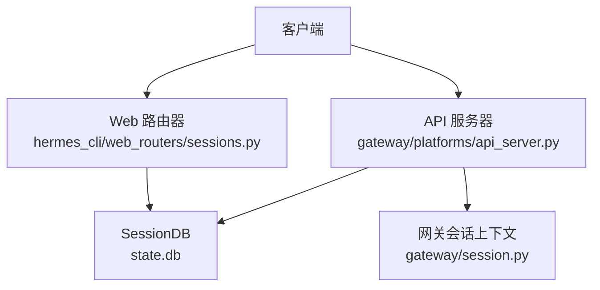
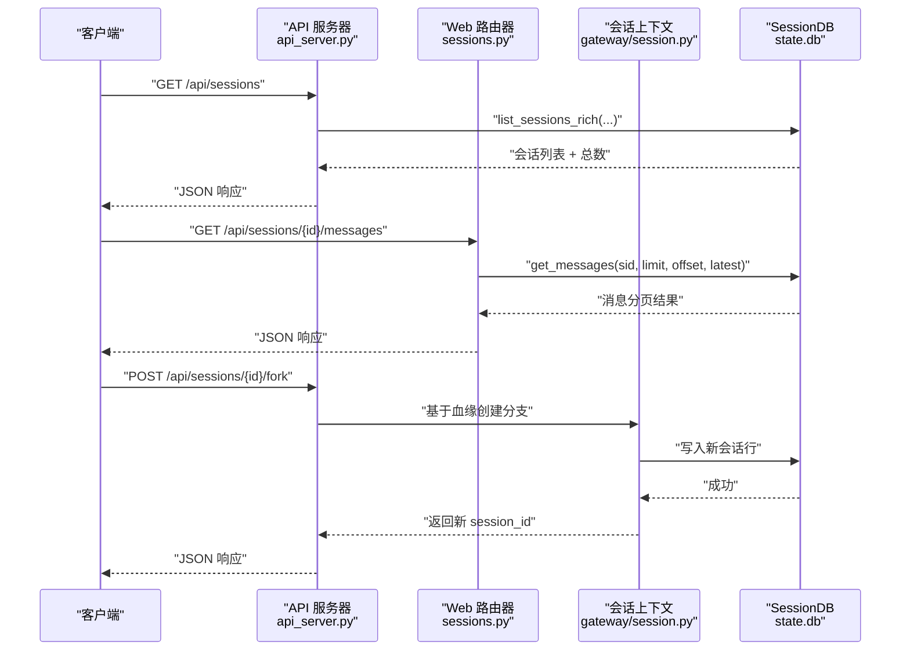
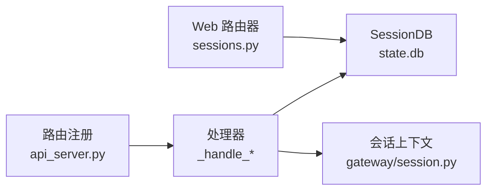

# 会话管理 API

<cite>
**本文引用的文件**
- [gateway/platforms/api_server.py](file://gateway/platforms/api_server.py)
- [hermes_cli/web_routers/sessions.py](file://hermes_cli/web_routers/sessions.py)
- [gateway/session.py](file://gateway/session.py)
</cite>

## 目录
1. [简介](#简介)
2. [项目结构](#项目结构)
3. [核心组件](#核心组件)
4. [架构总览](#架构总览)
5. [详细接口规范](#详细接口规范)
6. [依赖关系分析](#依赖关系分析)
7. [性能与限制](#性能与限制)
8. [故障排查指南](#故障排查指南)
9. [结论](#结论)

## 简介
本文件面向使用 Hermes Agent 的开发者，提供“会话管理”RESTful API 的完整规范。覆盖以下端点：
- GET /api/sessions：列出会话
- POST /api/sessions：创建会话
- GET /api/sessions/{session_id}：读取会话
- PATCH /api/sessions/{session_id}：更新会话（重命名、归档/恢复、置顶）
- DELETE /api/sessions/{session_id}：删除会话
- GET /api/sessions/{session_id}/messages：查询会话消息历史
- POST /api/sessions/{session_id}/fork：基于会话血缘进行分支

文档包含请求参数、响应格式、数据校验规则、错误处理以及典型调用示例。

## 项目结构
Hermes 的会话管理由两部分组成：
- API 服务器平台适配器：负责路由注册与 HTTP 层处理（aiohttp），并复用底层 SessionDB。
- Web 路由器（FastAPI）：提供与 CLI 仪表盘一致的会话列表、搜索、详情、消息、删除、重命名等 REST 接口。

图表来源
- [gateway/platforms/api_server.py:2056-2065](file://gateway/platforms/api_server.py#L2056-L2065)
- [hermes_cli/web_routers/sessions.py:53-68](file://hermes_cli/web_routers/sessions.py#L53-L68)
- [gateway/session.py:1-10](file://gateway/session.py#L1-L10)

章节来源
- [gateway/platforms/api_server.py:2056-2065](file://gateway/platforms/api_server.py#L2056-L2065)
- [hermes_cli/web_routers/sessions.py:53-68](file://hermes_cli/web_routers/sessions.py#L53-L68)
- [gateway/session.py:1-10](file://gateway/session.py#L1-L10)

## 核心组件
- API 服务器（aiohttp）：注册 /api/sessions* 路由，并通过内部方法访问 SessionDB。
- Web 路由器（FastAPI）：实现完整的 CRUD 与分页、过滤、搜索、导出等能力。
- 会话上下文与持久化：通过 gateway.session 中的数据结构与策略，结合 hermes_state.SessionDB 完成状态存储与查询。

章节来源
- [gateway/platforms/api_server.py:2056-2065](file://gateway/platforms/api_server.py#L2056-L2065)
- [hermes_cli/web_routers/sessions.py:53-68](file://hermes_cli/web_routers/sessions.py#L53-L68)
- [gateway/session.py:1-10](file://gateway/session.py#L1-L10)

## 架构总览
下图展示了从客户端到数据库的关键调用路径，包括会话列表、消息历史与分支操作。

图表来源
- [gateway/platforms/api_server.py:2056-2065](file://gateway/platforms/api_server.py#L2056-L2065)
- [hermes_cli/web_routers/sessions.py:601-652](file://hermes_cli/web_routers/sessions.py#L601-L652)
- [gateway/session.py:1-10](file://gateway/session.py#L1-L10)

## 详细接口规范

### 通用说明
- 认证：若启用长时记忆作用域（X-Hermes-Session-Key），需配置 API_SERVER_KEY；否则该头将被拒绝。
- 错误格式：遵循 OpenAI 兼容的错误体结构，包含 message、type、param 等字段。
- 分页：列表与消息接口支持 limit/offset；消息默认返回最新一页（latest）。

章节来源
- [gateway/platforms/api_server.py:2107-2157](file://gateway/platforms/api_server.py#L2107-L2157)
- [hermes_cli/web_routers/sessions.py:53-68](file://hermes_cli/web_routers/sessions.py#L53-L68)
- [hermes_cli/web_routers/sessions.py:601-652](file://hermes_cli/web_routers/sessions.py#L601-L652)

### GET /api/sessions — 列出会话
- 功能：列出当前 profile 可见的会话，支持分页、过滤与排序。
- 查询参数
  - limit: int，范围 0..100，默认 20
  - offset: int，>=0，默认 0
  - min_messages: int，>=0，默认 0
  - archived: string，枚举 exclude|only|include，默认 exclude
  - order: string，枚举 created|recent，默认 created
  - source: string，可选，按来源类过滤
  - sources: string，逗号分隔，包含多个来源类
  - exclude_sources: string，逗号分隔，排除来源类
  - cwd_prefix: string，可选，工作目录前缀过滤
  - full: bool，是否返回完整行（含 system_prompt/model_config）
  - profile: string，可选，指定目标 profile
- 响应体
  - sessions: 数组，元素为会话对象（当 full=false 时会裁剪大字段）
  - total: 总数
  - limit: 本次限制
  - offset: 本次偏移
- 校验规则
  - archived 仅接受 exclude|only|include
  - order 仅接受 created|recent
- 错误码
  - 400：参数非法
  - 500：内部错误

示例
- 请求：GET /api/sessions?limit=20&order=recent&archived=exclude
- 响应：{ "sessions": [...], "total": 123, "limit": 20, "offset": 0 }

章节来源
- [hermes_cli/web_routers/sessions.py:53-166](file://hermes_cli/web_routers/sessions.py#L53-L166)

### POST /api/sessions — 创建会话
- 功能：创建一个空会话（或带初始模型配置的会话），用于后续对话与持久化。
- 请求体（建议）
  - model: string，可选，会话级模型偏好
  - provider: string，可选，会话级提供者
  - base_url: string，可选，会话级基础 URL
  - title: string，可选，会话标题
- 响应体
  - id: string，新会话 ID
  - model: string，最终生效模型
  - provider: string，最终生效提供者
  - base_url: string，最终生效基础 URL
  - title: string，会话标题
  - created_at: number，创建时间戳
  - updated_at: number，更新时间戳
- 错误码
  - 400：请求体非法
  - 500：内部错误

示例
- 请求：POST /api/sessions { "model": "hermes-agent", "title": "测试会话" }
- 响应：{ "id": "...", "model": "hermes-agent", "provider": "...", "base_url": "...", "title": "测试会话", "created_at": ..., "updated_at": ... }

章节来源
- [gateway/platforms/api_server.py:2056-2065](file://gateway/platforms/api_server.py#L2056-L2065)

### GET /api/sessions/{session_id} — 读取会话
- 功能：获取指定会话的详细信息。
- 路径参数
  - session_id: string，支持精确 ID 或唯一前缀解析
- 响应体：会话对象（包含元数据、统计、预览等）
- 错误码
  - 404：会话不存在

示例
- 请求：GET /api/sessions/{session_id}
- 响应：{ "id": "...", "title": "...", "message_count": 10, ... }

章节来源
- [hermes_cli/web_routers/sessions.py:555-575](file://hermes_cli/web_routers/sessions.py#L555-L575)

### PATCH /api/sessions/{session_id} — 更新会话
- 功能：重命名、归档/恢复、置顶。
- 请求体
  - title: string|null，设置/清空标题
  - archived: boolean|null，软隐藏或恢复
  - pinned: boolean|null，置顶标记
  - profile: string，可选，目标 profile
- 响应体
  - ok: true
  - title: string，当前标题
  - archived: boolean，是否归档
  - pinned: boolean，是否置顶
- 校验规则
  - 至少提供一个可更新的字段（title/archived/pinned）
- 错误码
  - 400：无更新字段或标题无效
  - 404：会话不存在

示例
- 请求：PATCH /api/sessions/{session_id} { "title": "新标题", "pinned": true }
- 响应：{ "ok": true, "title": "新标题", "pinned": true }

章节来源
- [hermes_cli/web_routers/sessions.py:683-719](file://hermes_cli/web_routers/sessions.py#L683-L719)

### DELETE /api/sessions/{session_id} — 删除会话
- 功能：删除指定会话。对已不存在的 ID 幂等返回成功。
- 路径参数
  - session_id: string
- 响应体
  - ok: true
  - already_absent: boolean，若原本就不存在则为 true
- 错误码
  - 500：内部错误

示例
- 请求：DELETE /api/sessions/{session_id}
- 响应：{ "ok": true }

章节来源
- [hermes_cli/web_routers/sessions.py:655-680](file://hermes_cli/web_routers/sessions.py#L655-L680)

### GET /api/sessions/{session_id}/messages — 查询消息历史
- 功能：分页查询会话的消息历史。默认返回最新一页（chronological latest）。
- 路径参数
  - session_id: string
- 查询参数
  - limit: int，>=0，默认 500（未显式传限时）
  - offset: int，>=0，默认 0
  - order: string，可选 oldest|latest；未传且未传 limit 时等价于 latest
- 响应体
  - session_id: string
  - messages: 数组，消息项
  - pagination: 对象
    - limit: number
    - offset: number
    - order: string
    - returned: number
- 校验规则
  - order 仅接受 oldest|latest
- 错误码
  - 400：order 非法
  - 404：会话不存在

示例
- 请求：GET /api/sessions/{session_id}/messages?limit=100&order=oldest
- 响应：{ "session_id": "...", "messages": [...], "pagination": { "limit": 100, "offset": 0, "order": "oldest", "returned": 100 } }

章节来源
- [hermes_cli/web_routers/sessions.py:601-652](file://hermes_cli/web_routers/sessions.py#L601-L652)

### POST /api/sessions/{session_id}/fork — 会话分支
- 功能：基于当前会话的血缘关系创建分支会话。
- 路径参数
  - session_id: string
- 请求体（建议）
  - title: string，分支标题
  - model/provider/base_url: 可选，继承或覆盖
- 响应体
  - id: string，新分支会话 ID
  - parent_session_id: string，父会话 ID
  - title: string，分支标题
  - created_at: number
  - updated_at: number
- 错误码
  - 400：请求体非法
  - 404：父会话不存在
  - 500：内部错误

示例
- 请求：POST /api/sessions/{session_id}/fork { "title": "实验分支" }
- 响应：{ "id": "...", "parent_session_id": "...", "title": "实验分支", "created_at": ..., "updated_at": ... }

章节来源
- [gateway/platforms/api_server.py:2056-2065](file://gateway/platforms/api_server.py#L2056-L2065)

## 依赖关系分析
- 路由注册：API 服务器在启动时将 /api/sessions* 映射到对应处理器。
- 会话数据：Web 路由器直接通过 SessionDB 读写 state.db；API 服务器通过内部缓存的 SessionDB 实例访问同一存储。
- 会话上下文：gateway.session 提供会话上下文构建、PII 脱敏、系统提示注入等能力，供上层逻辑使用。

图表来源
- [gateway/platforms/api_server.py:2056-2065](file://gateway/platforms/api_server.py#L2056-L2065)
- [hermes_cli/web_routers/sessions.py:53-68](file://hermes_cli/web_routers/sessions.py#L53-L68)
- [gateway/session.py:1-10](file://gateway/session.py#L1-L10)

章节来源
- [gateway/platforms/api_server.py:2056-2065](file://gateway/platforms/api_server.py#L2056-L2065)
- [hermes_cli/web_routers/sessions.py:53-68](file://hermes_cli/web_routers/sessions.py#L53-L68)
- [gateway/session.py:1-10](file://gateway/session.py#L1-L10)

## 性能与限制
- 列表分页：limit 上限 100，避免单次拉取过多导致 SQLite 压力。
- 消息分页：默认返回最新 500 条；可通过 limit/offset/order 控制。
- 全量行：full=true 会返回 system_prompt/model_config 等大字段，仅在需要时开启。
- 搜索：支持 FTS5 全文检索，自动去重压缩血缘根，避免重复展示。
- 并发：SessionDB 打开与初始化通过异步锁保护，避免重复构造。

章节来源
- [hermes_cli/web_routers/sessions.py:53-68](file://hermes_cli/web_routers/sessions.py#L53-L68)
- [hermes_cli/web_routers/sessions.py:601-652](file://hermes_cli/web_routers/sessions.py#L601-L652)
- [gateway/platforms/api_server.py:2185-2237](file://gateway/platforms/api_server.py#L2185-L2237)

## 故障排查指南
- 400 参数错误
  - archived/order 值不在允许集合内
  - order 在消息接口中必须为 oldest|latest
  - 更新会话时未提供任何可更新字段
- 404 资源不存在
  - 会话 ID 解析失败或会话已被删除
- 403 认证缺失
  - 使用 X-Hermes-Session-Key 但未配置 API_SERVER_KEY
- 500 内部错误
  - 数据库不可用或异常
  - 其他未捕获异常

常见修复步骤
- 检查查询参数是否在允许范围内
- 确认会话 ID 是否存在（可使用 GET /api/sessions/{session_id} 验证）
- 如需长时记忆作用域，确保已配置 API_SERVER_KEY
- 查看服务端日志定位具体异常堆栈

章节来源
- [hermes_cli/web_routers/sessions.py:85-94](file://hermes_cli/web_routers/sessions.py#L85-L94)
- [hermes_cli/web_routers/sessions.py:609-613](file://hermes_cli/web_routers/sessions.py#L609-L613)
- [hermes_cli/web_routers/sessions.py:697-701](file://hermes_cli/web_routers/sessions.py#L697-L701)
- [gateway/platforms/api_server.py:2126-2157](file://gateway/platforms/api_server.py#L2126-L2157)

## 结论
本 API 提供了完整的会话管理能力，涵盖创建、读取、更新、删除、消息历史查询与会话分支。通过分页与过滤机制，可在大规模会话场景下保持良好性能。配合认证与作用域控制，可安全地暴露给外部客户端使用。建议在集成时严格遵循参数校验与错误处理约定，以获得稳定可靠的体验。