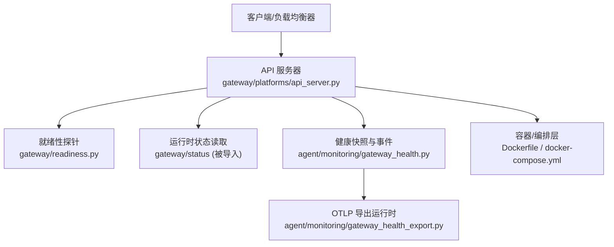
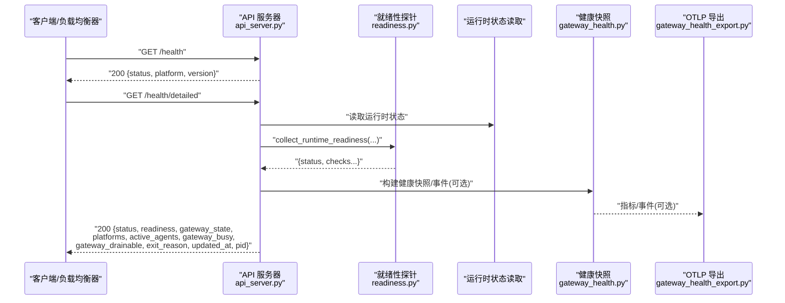
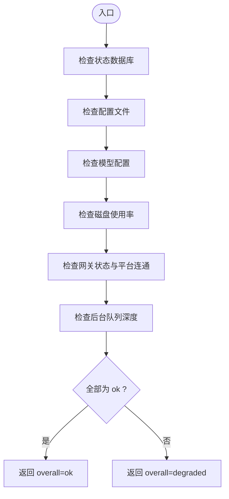
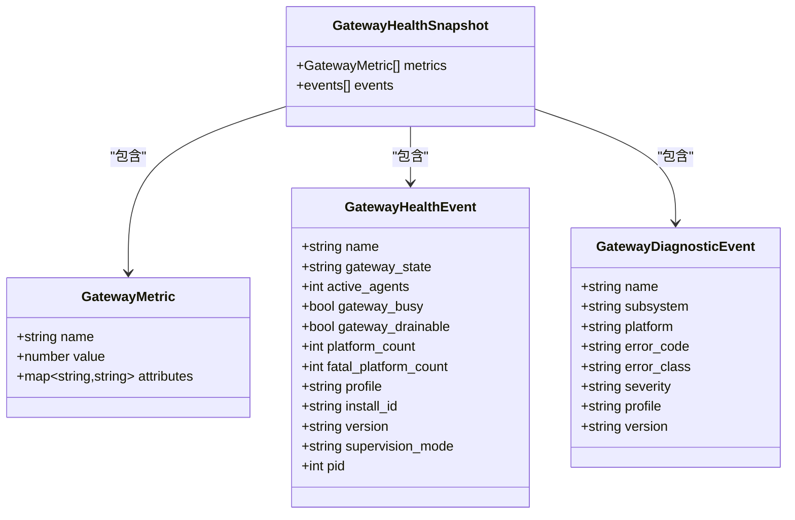
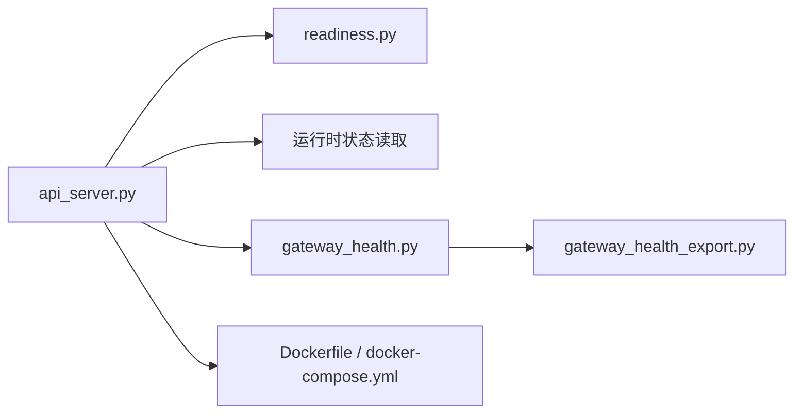

# 健康检查和监控 API

<cite>
**本文引用的文件**
- [gateway/platforms/api_server.py](file://gateway/platforms/api_server.py)
- [gateway/readiness.py](file://gateway/readiness.py)
- [agent/monitoring/gateway_health.py](file://agent/monitoring/gateway_health.py)
- [agent/monitoring/gateway_health_export.py](file://agent/monitoring/gateway_health_export.py)
- [Dockerfile](file://Dockerfile)
- [docker-compose.yml](file://docker-compose.yml)
</cite>

## 目录
1. [简介](#简介)
2. [项目结构](#项目结构)
3. [核心组件](#核心组件)
4. [架构总览](#架构总览)
5. [详细组件分析](#详细组件分析)
6. [依赖关系分析](#依赖关系分析)
7. [性能考量](#性能考量)
8. [故障诊断指南](#故障诊断指南)
9. [结论](#结论)
10. [附录](#附录)

## 简介
本文件面向容器化部署与运维场景，系统化说明 Hermes Agent 网关暴露的健康检查与监控端点：
- GET /health：基础健康检查，用于快速判定进程是否存活。
- GET /health/detailed：跨容器仪表板探测的丰富状态端点，返回网关运行态、平台连接情况、就绪性探针结果、负载与可排空标志等。

文档同时给出响应字段含义、HTTP 状态码约定、指标语义、在负载均衡与服务网格中的使用建议，以及容器编排（Docker/s6-overlay）下的健康检查配置思路与常见问题排查路径。

## 项目结构
与健康检查和监控相关的代码主要分布在以下模块：
- HTTP 路由与处理器：gateway/platforms/api_server.py
- 就绪性探针聚合：gateway/readiness.py
- 健康快照与事件生成：agent/monitoring/gateway_health.py
- OTLP 导出运行时：agent/monitoring/gateway_health_export.py
- 容器镜像与编排：Dockerfile、docker-compose.yml

图示来源
- [gateway/platforms/api_server.py:2923-2986](file://gateway/platforms/api_server.py#L2923-L2986)
- [gateway/readiness.py:89-119](file://gateway/readiness.py#L89-L119)
- [agent/monitoring/gateway_health.py:210-291](file://agent/monitoring/gateway_health.py#L210-L291)
- [agent/monitoring/gateway_health_export.py:167-181](file://agent/monitoring/gateway_health_export.py#L167-L181)

章节来源
- [gateway/platforms/api_server.py:2923-2986](file://gateway/platforms/api_server.py#L2923-L2986)
- [gateway/readiness.py:89-119](file://gateway/readiness.py#L89-L119)
- [agent/monitoring/gateway_health.py:210-291](file://agent/monitoring/gateway_health.py#L210-L291)
- [agent/monitoring/gateway_health_export.py:167-181](file://agent/monitoring/gateway_health_export.py#L167-L181)
- [Dockerfile:336-357](file://Dockerfile#L336-L357)
- [docker-compose.yml:29-61](file://docker-compose.yml#L29-L61)

## 核心组件
- 基础健康端点 GET /health
  - 用途：快速存活探测，返回固定结构与版本信息。
  - 典型响应体包含：status、platform、version。
  - 适用：Kubernetes liveness、简单心跳。

- 详细健康端点 GET /health/detailed
  - 用途：跨容器仪表板探测，返回网关运行态、平台列表、活跃代理数、就绪性探针、忙/可排空标志、退出原因、更新时间戳、进程 ID 等。
  - 鉴权：需要与其他 API 路由相同的 Bearer 鉴权。
  - 适用：Kubernetes readiness、服务发现、负载均衡健康检查、服务网格侧车健康探测。

- 就绪性探针 collect_runtime_readiness
  - 组合多个非破坏性探针：状态数据库、配置文件、模型配置、磁盘空间、网关状态、后台队列深度等。
  - 输出整体 status 与各子项 status/detail。

- 健康快照与事件
  - 将运行时状态转换为指标与事件，供 OTLP 导出或内部告警消费。
  - 对平台状态进行分类与降级计数，并生成生命周期与致命错误事件。

- OTLP 导出运行时
  - 可选启用，将健康指标与诊断事件以 OpenTelemetry OTLP 协议导出到后端。
  - 资源属性白名单与值长度限制，确保可观测数据可控。

章节来源
- [gateway/platforms/api_server.py:2923-2986](file://gateway/platforms/api_server.py#L2923-L2986)
- [gateway/readiness.py:89-119](file://gateway/readiness.py#L89-L119)
- [agent/monitoring/gateway_health.py:210-291](file://agent/monitoring/gateway_health.py#L210-L291)
- [agent/monitoring/gateway_health_export.py:167-181](file://agent/monitoring/gateway_health_export.py#L167-L181)

## 架构总览
下图展示从请求到健康数据的完整链路：客户端请求进入 API 服务器，处理器调用就绪性探针与运行时状态读取，生成详细健康响应；同时健康快照与事件通过导出运行时发送到可观测后端。

图示来源
- [gateway/platforms/api_server.py:2923-2986](file://gateway/platforms/api_server.py#L2923-L2986)
- [gateway/readiness.py:89-119](file://gateway/readiness.py#L89-L119)
- [agent/monitoring/gateway_health.py:210-291](file://agent/monitoring/gateway_health.py#L210-L291)
- [agent/monitoring/gateway_health_export.py:167-181](file://agent/monitoring/gateway_health_export.py#L167-L181)

## 详细组件分析

### 端点：GET /health
- 功能：基础存活检查。
- 鉴权：通常不需要鉴权（仅进程存活）。
- 成功响应示例字段：
  - status: 字符串，通常为 "ok"
  - platform: 字符串，如 "hermes-agent"
  - version: 字符串，当前版本
- 失败情形：若进程不可达，HTTP 层会返回连接错误；应用内异常由框架统一处理。

章节来源
- [gateway/platforms/api_server.py:2923-2927](file://gateway/platforms/api_server.py#L2923-L2927)

### 端点：GET /health/detailed
- 功能：跨容器仪表板探测，返回丰富的运行期状态。
- 鉴权：需要 Bearer Token（与 API 路由一致）。
- 成功响应关键字段：
  - status: 整体健康状态（如 "ok"/"degraded"）
  - readiness: 就绪性探针集合，含各子项 status/detail
  - platform/version: 平台标识与版本
  - gateway_state: 网关状态（running/draining/stopping 等）
  - platforms: 已配置平台及其状态
  - active_agents: 活跃代理数量
  - gateway_busy: 是否繁忙（影响流量调度）
  - gateway_drainable: 是否可安全排空（用于优雅下线）
  - exit_reason: 退出原因（如有）
  - updated_at: 更新时间戳（RFC3339 或 null）
  - pid: 进程 ID
- 失败情形：鉴权失败返回 401；其他异常按框架默认策略处理。

章节来源
- [gateway/platforms/api_server.py:2929-2986](file://gateway/platforms/api_server.py#L2929-L2986)

### 就绪性探针：collect_runtime_readiness
- 探针项：
  - state_db: 状态数据库可读性检查（只读查询，避免竞争写）
  - config: 配置文件解析校验
  - model: 模型配置是否存在
  - disk: 磁盘使用率（超过阈值标记为 degraded）
  - gateway: 网关状态与平台连通统计
  - background_queues: 后台队列深度与活跃委托数
- 整体 status：所有子项均为 ok 时为 ok，否则为 degraded。
- 设计原则：非破坏性、不泄露敏感信息、轻量快速。

图示来源
- [gateway/readiness.py:27-87](file://gateway/readiness.py#L27-L87)
- [gateway/readiness.py:89-119](file://gateway/readiness.py#L89-L119)

章节来源
- [gateway/readiness.py:27-87](file://gateway/readiness.py#L27-L87)
- [gateway/readiness.py:89-119](file://gateway/readiness.py#L89-L119)

### 健康快照与事件：build_gateway_health_snapshot
- 输入：运行时状态字典、网关运行标志、profile/install_id/version/supervision_mode。
- 输出：指标列表与事件列表。
- 指标示例：
  - hermes.gateway.up / hermes.gateway.active_agents / hermes.gateway.busy / hermes.gateway.drainable / hermes.gateway.restart_requested
  - hermes.platform.up / hermes.platform.degraded（带平台名与状态标签）
- 事件示例：
  - gateway.health_snapshot（汇总快照）
  - platform.fatal（平台致命错误）
  - gateway.lifecycle / gateway.exit（生命周期变更）
- 分类与脱敏：对错误文本进行归类与长度限制，避免泄露敏感信息。

图示来源
- [agent/monitoring/gateway_health.py:20-31](file://agent/monitoring/gateway_health.py#L20-L31)
- [agent/monitoring/gateway_health.py:210-291](file://agent/monitoring/gateway_health.py#L210-L291)

章节来源
- [agent/monitoring/gateway_health.py:210-291](file://agent/monitoring/gateway_health.py#L210-L291)

### OTLP 导出运行时
- 启用条件：monitoring.gateway_health_export.enabled 与 monitoring.export.otlp.enabled 且 endpoint 存在。
- 资源属性白名单：service.name、service.namespace、service.version、service.instance.id、deployment.environment.name、cloud.*、telemetry.scope。
- 诊断属性白名单：name、subsystem、error_class、error_code、platform、old_state、new_state、version、severity。
- 关闭流程：停止线程、移除日志处理器、退订订阅者、异步关闭导出器，确保不影响网关生命周期。

章节来源
- [agent/monitoring/gateway_health_export.py:167-181](file://agent/monitoring/gateway_health_export.py#L167-L181)
- [agent/monitoring/gateway_health_export.py:101-164](file://agent/monitoring/gateway_health_export.py#L101-L164)

## 依赖关系分析
- API 服务器依赖就绪性探针与运行时状态读取，产出详细健康响应。
- 健康快照模块依赖运行时状态与分类逻辑，生成指标与事件。
- OTLP 导出运行时依赖健康快照与事件发射器，将数据发送至可观测后端。
- 容器编排层提供进程管理与监督（s6-overlay），保障服务启动顺序与重启策略。

图示来源
- [gateway/platforms/api_server.py:2923-2986](file://gateway/platforms/api_server.py#L2923-L2986)
- [gateway/readiness.py:89-119](file://gateway/readiness.py#L89-L119)
- [agent/monitoring/gateway_health.py:210-291](file://agent/monitoring/gateway_health.py#L210-L291)
- [agent/monitoring/gateway_health_export.py:167-181](file://agent/monitoring/gateway_health_export.py#L167-L181)
- [Dockerfile:336-357](file://Dockerfile#L336-L357)

章节来源
- [gateway/platforms/api_server.py:2923-2986](file://gateway/platforms/api_server.py#L2923-L2986)
- [gateway/readiness.py:89-119](file://gateway/readiness.py#L89-L119)
- [agent/monitoring/gateway_health.py:210-291](file://agent/monitoring/gateway_health.py#L210-L291)
- [agent/monitoring/gateway_health_export.py:167-181](file://agent/monitoring/gateway_health_export.py#L167-L181)
- [Dockerfile:336-357](file://Dockerfile#L336-L357)

## 性能考量
- 健康检查应轻量：/health 仅返回进程存活信息；/health/detailed 虽包含多项探针，但均为只读与非破坏性操作。
- 数据库探针使用只读模式与短超时，避免阻塞与锁竞争。
- 磁盘探针仅在必要时计算使用率，并在超过阈值时标记为 degraded。
- OTLP 导出为可选且 fail-open，网络异常不会回滚主流程。

[本节为通用指导，无需特定文件引用]

## 故障诊断指南
- 鉴权失败
  - 现象：/health/detailed 返回 401。
  - 排查：确认携带正确的 Bearer Token；检查 API 服务器是否启用了鉴权。
  - 参考：/health/detailed 处理器在鉴权失败时返回鉴权错误。

- 就绪性探针失败
  - 现象：/health/detailed 中 readiness.overall 为 degraded。
  - 排查：
    - state_db：检查状态数据库文件是否存在与可读。
    - config：检查配置文件格式与权限。
    - model：确认模型配置已设置。
    - disk：检查磁盘使用率是否过高。
    - gateway：检查网关状态与平台连通数。
    - background_queues：检查队列深度与活跃委托数。
  - 参考：就绪性探针实现。

- 平台状态异常
  - 现象：platforms 中某平台状态为 fatal/degraded/error/failed。
  - 排查：查看对应平台的 error_code 与错误分类；关注 gateway_health 生成的 platform.fatal 事件。
  - 参考：健康快照与事件生成。

- 导出异常
  - 现象：未收到 OTLP 指标或事件。
  - 排查：确认 monitoring.gateway_health_export.enabled 与 monitoring.export.otlp.enabled 及 endpoint 配置；检查导出器关闭流程是否提前触发。
  - 参考：OTLP 导出运行时配置与关闭流程。

- 容器编排问题
  - 现象：服务无法启动或频繁重启。
  - 排查：确认 s6-overlay 监督树正确初始化；检查 cont-init.d 脚本执行顺序；验证数据卷挂载与权限。
  - 参考：Dockerfile 中 s6-overlay 安装与服务注册。

章节来源
- [gateway/platforms/api_server.py:2929-2986](file://gateway/platforms/api_server.py#L2929-L2986)
- [gateway/readiness.py:27-87](file://gateway/readiness.py#L27-L87)
- [agent/monitoring/gateway_health.py:210-291](file://agent/monitoring/gateway_health.py#L210-L291)
- [agent/monitoring/gateway_health_export.py:167-181](file://agent/monitoring/gateway_health_export.py#L167-L181)
- [Dockerfile:336-357](file://Dockerfile#L336-L357)

## 结论
Hermes Agent 提供了明确分层的健康检查与监控能力：
- /health 用于快速存活探测。
- /health/detailed 提供跨容器仪表板所需的丰富状态与就绪性信息，支持负载均衡与服务网格的健康探测与流量调度。
- 健康快照与 OTLP 导出为可观测性提供标准化指标与事件。
建议在容器化部署中结合 Kubernetes 或编排系统的健康检查机制，合理配置 liveness/readiness 探针，并利用 gateway_busy 与 gateway_drainable 控制流量与优雅下线。

[本节为总结，无需特定文件引用]

## 附录

### 端点规范摘要
- GET /health
  - 鉴权：通常不需要
  - 成功响应字段：status、platform、version
  - 用途：liveness 探针

- GET /health/detailed
  - 鉴权：需要 Bearer Token
  - 成功响应字段：status、readiness、platform、version、gateway_state、platforms、active_agents、gateway_busy、gateway_drainable、exit_reason、updated_at、pid
  - 用途：readiness 探针、服务发现、负载均衡健康检查

章节来源
- [gateway/platforms/api_server.py:2923-2986](file://gateway/platforms/api_server.py#L2923-L2986)

### 容器化部署与健康检查配置建议
- 使用 s6-overlay 监督主进程与子服务，确保启动顺序与重启策略。
- 将 /opt/data 作为持久化卷挂载，保证状态与配置持久。
- 如需暴露 API 服务器，需设置 API_SERVER_HOST 与 API_SERVER_KEY，并通过反向代理或隧道保护。
- 在编排系统中：
  - liveness：使用 /health
  - readiness：使用 /health/detailed，并结合 readiness.overall 与 gateway_busy/gateway_drainable 做流量控制

章节来源
- [Dockerfile:336-357](file://Dockerfile#L336-L357)
- [docker-compose.yml:29-61](file://docker-compose.yml#L29-L61)