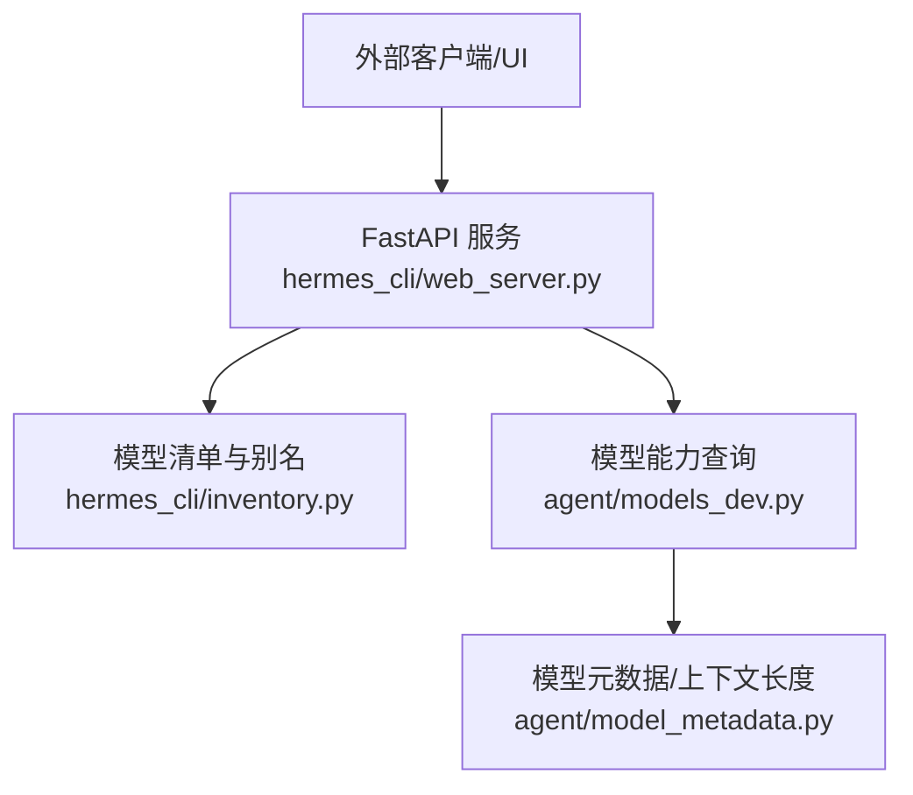
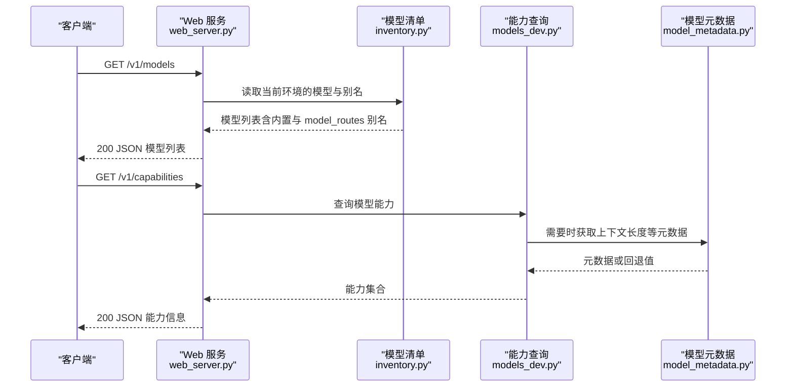
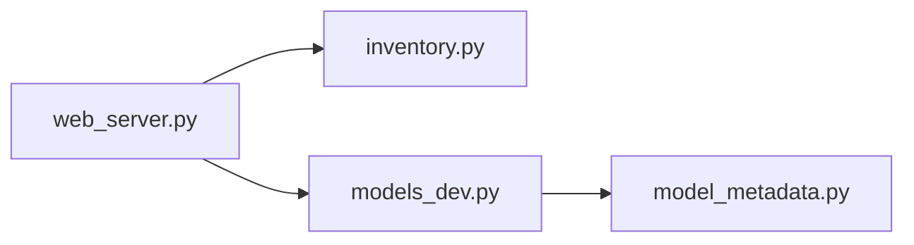
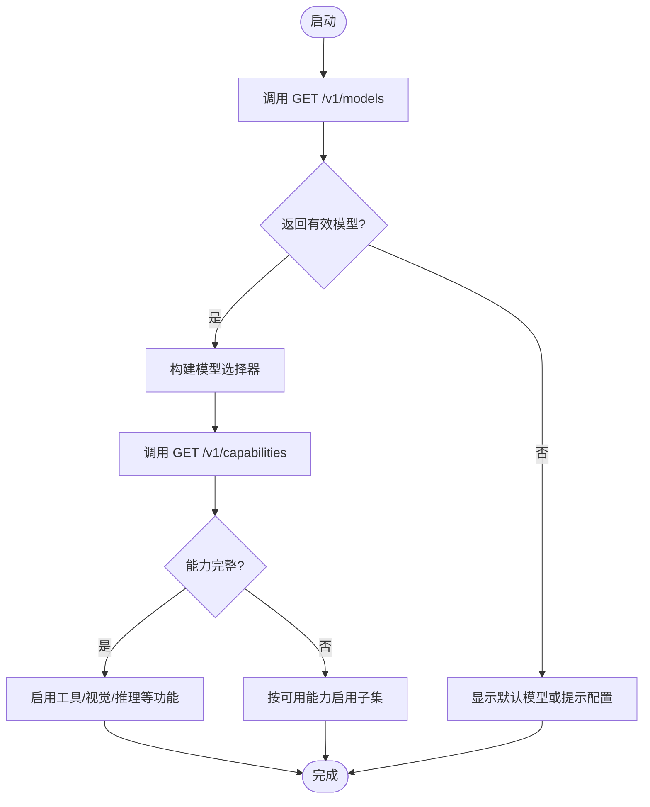

# 模型和能力 API

<cite>
**本文引用的文件**
- [web_server.py](file://hermes_cli/web_server.py)
- [inventory.py](file://hermes_cli/inventory.py)
- [models_dev.py](file://agent/models_dev.py)
- [model_metadata.py](file://agent/model_metadata.py)
- [test_web_server.py](file://tests/test_web_server.py)
</cite>

## 目录
1. [简介](#简介)
2. [项目结构](#项目结构)
3. [核心组件](#核心组件)
4. [架构总览](#架构总览)
5. [详细组件分析](#详细组件分析)
6. [依赖关系分析](#依赖关系分析)
7. [性能考虑](#性能考虑)
8. [故障排查指南](#故障排查指南)
9. [结论](#结论)
10. [附录：客户端使用示例与版本兼容](#附录客户端使用示例与版本兼容)

## 简介
本文件面向外部 UI 和集成方，说明 hermes-agent 提供的“模型发现”和“能力查询”两类接口。重点包括：
- GET /v1/models：列出当前环境可用的模型别名（含 hermes-agent 内置模型与配置的 model_routes 别名），支持多配置文件环境下的模型发现。
- GET /v1/capabilities：返回机器可读的 API 能力信息，供外部 UI 动态检测并适配功能。

文档同时给出响应数据模型、字段说明、版本兼容性建议，以及客户端如何基于能力信息进行动态适配的示例路径。

## 项目结构
与模型和能力 API 相关的实现集中在 Web Dashboard 后端与模型/能力元数据模块中：
- Web 服务路由与中间件：hermes_cli/web_server.py
- 模型清单与别名解析：hermes_cli/inventory.py
- 模型能力查询与缓存：agent/models_dev.py
- 模型元数据与上下文长度等探测：agent/model_metadata.py
- 相关测试用例：tests/test_web_server.py

图表来源
- [web_server.py:1-120](file://hermes_cli/web_server.py#L1-L120)
- [inventory.py:380-430](file://hermes_cli/inventory.py#L380-L430)
- [models_dev.py:600-650](file://agent/models_dev.py#L600-L650)
- [model_metadata.py:2400-2510](file://agent/model_metadata.py#L2400-L2510)

章节来源
- [web_server.py:1-120](file://hermes_cli/web_server.py#L1-L120)
- [inventory.py:380-430](file://hermes_cli/inventory.py#L380-L430)
- [models_dev.py:600-650](file://agent/models_dev.py#L600-L650)
- [model_metadata.py:2400-2510](file://agent/model_metadata.py#L2400-L2510)

## 核心组件
- 模型列表端点（GET /v1/models）
  - 作用：在当前运行环境中枚举可用模型，包含 hermes-agent 内置模型及通过配置暴露的 model_routes 别名。
  - 数据来源：模型清单与别名解析逻辑位于 inventory 模块；Web 层负责对外暴露。
  - 多配置文件支持：当存在多个配置文件时，端点会聚合各配置中的模型与别名，确保跨配置可见性。
- 能力查询端点（GET /v1/capabilities）
  - 作用：返回机器可读的能力集，例如是否支持工具调用、视觉输入、推理模式、上下文窗口大小、最大输出 token 数、模型家族等。
  - 数据来源：能力由 models_dev 提供，必要时结合 model_metadata 对上下文长度等元数据进行探测或回退。

章节来源
- [inventory.py:380-430](file://hermes_cli/inventory.py#L380-L430)
- [models_dev.py:600-650](file://agent/models_dev.py#L600-L650)
- [model_metadata.py:2400-2510](file://agent/model_metadata.py#L2400-L2510)

## 架构总览
下面的序列图展示了客户端请求模型列表与能力信息的典型流程。

图表来源
- [web_server.py:1-120](file://hermes_cli/web_server.py#L1-L120)
- [inventory.py:380-430](file://hermes_cli/inventory.py#L380-L430)
- [models_dev.py:600-650](file://agent/models_dev.py#L600-L650)
- [model_metadata.py:2400-2510](file://agent/model_metadata.py#L2400-L2510)

## 详细组件分析

### 组件：GET /v1/models（模型列表）
- 功能要点
  - 列出当前环境可用的模型，包括 hermes-agent 内置模型与通过配置暴露的 model_routes 别名。
  - 在多配置文件环境下，合并并去重，保证跨配置可见性。
- 关键流程
  - Web 层接收请求后，调用 inventory 模块解析当前配置与模型清单。
  - 将结果以 JSON 数组形式返回，每项至少包含模型标识与提供者信息。
- 响应数据模型（JSON）
  - 顶层对象：
    - models: 数组，元素为模型条目
      - model: 字符串，模型名称或别名
      - provider: 字符串，模型提供方
      - 其他可选字段（如 context_length、max_output_tokens、model_family 等，取决于具体实现）
- 错误处理
  - 若无法加载配置或清单为空，返回空数组而非错误，便于前端降级显示。
- 版本兼容性
  - 新增字段应向后兼容，客户端需忽略未知字段。
  - 若 provider 或 model 格式变化，客户端应做最小化兼容判断。

章节来源
- [inventory.py:380-430](file://hermes_cli/inventory.py#L380-L430)
- [web_server.py:1-120](file://hermes_cli/web_server.py#L1-L120)

### 组件：GET /v1/capabilities（能力查询）
- 功能要点
  - 返回机器可读的能力集合，供外部 UI 进行功能检测与适配。
  - 能力项包括但不限于：工具调用、视觉输入、推理模式、上下文窗口、最大输出 token、模型家族等。
- 关键流程
  - Web 层调用 models_dev 获取能力；如需上下文长度等元数据，则委托 model_metadata 进行探测或回退。
- 响应数据模型（JSON）
  - 顶层对象：
    - capabilities: 对象，键值对表示能力开关或数值
      - supports_tools: 布尔，是否支持工具调用
      - supports_vision: 布尔，是否支持视觉输入
      - supports_reasoning: 布尔，是否支持推理模式
      - context_window: 整数，上下文窗口大小（可能为 null）
      - max_output_tokens: 整数，最大输出 token 数（可能为 null）
      - model_family: 字符串，模型家族（可能为 null）
- 错误处理
  - 能力缺失或探测失败时，对应字段可为 null 或 false，避免中断整体响应。
- 版本兼容性
  - 新增能力键应向后兼容；客户端应仅依赖已知能力键，忽略未知键。

章节来源
- [models_dev.py:600-650](file://agent/models_dev.py#L600-L650)
- [model_metadata.py:2400-2510](file://agent/model_metadata.py#L2400-L2510)
- [web_server.py:1-120](file://hermes_cli/web_server.py#L1-L120)

### 组件：模型元数据与上下文长度探测
- 功能要点
  - 从多种来源（本地缓存、远程 API、默认值）获取模型的上下文长度等元数据。
  - 在 OAuth 或网络不可用时，采用回退策略，保证能力查询不阻塞。
- 关键流程
  - 优先尝试权威来源（如门户或远程 API），失败时回退到本地缓存或默认值。
- 影响范围
  - 直接影响 /v1/capabilities 中 context_window 等字段的准确性。

章节来源
- [model_metadata.py:2400-2510](file://agent/model_metadata.py#L2400-L2510)

## 依赖关系分析
- 耦合与内聚
  - web_server.py 作为对外路由层，低耦合地调用 inventory.py 与 models_dev.py。
  - models_dev.py 与 model_metadata.py 形成能力与元数据的内聚单元。
- 直接依赖
  - web_server.py → inventory.py（模型清单）
  - web_server.py → models_dev.py（能力查询）
  - models_dev.py → model_metadata.py（元数据探测）
- 间接依赖
  - 配置加载、插件注册、缓存机制等通过上述模块间接影响最终结果。
- 循环依赖
  - 未发现明显的循环导入；模块边界清晰。

图表来源
- [web_server.py:1-120](file://hermes_cli/web_server.py#L1-L120)
- [inventory.py:380-430](file://hermes_cli/inventory.py#L380-L430)
- [models_dev.py:600-650](file://agent/models_dev.py#L600-L650)
- [model_metadata.py:2400-2510](file://agent/model_metadata.py#L2400-L2510)

章节来源
- [web_server.py:1-120](file://hermes_cli/web_server.py#L1-L120)
- [inventory.py:380-430](file://hermes_cli/inventory.py#L380-L430)
- [models_dev.py:600-650](file://agent/models_dev.py#L600-L650)
- [model_metadata.py:2400-2510](file://agent/model_metadata.py#L2400-L2510)

## 性能考虑
- 非阻塞设计
  - 模型与能力查询尽量使用异步或线程池执行，避免阻塞事件循环。
- 缓存与回退
  - 模型元数据具备缓存与回退机制，降低网络开销与失败概率。
- 多配置聚合
  - 多配置文件场景下，合并与去重应在内存中进行，避免重复 IO。

[本节为通用指导，无需特定文件引用]

## 故障排查指南
- 常见问题
  - 模型列表为空：检查配置文件是否正确加载，确认 model_routes 是否生效。
  - 能力字段缺失：确认模型元数据探测是否成功，必要时查看日志与回退逻辑。
  - 多配置冲突：确认别名未发生覆盖或冲突，必要时调整优先级。
- 定位方法
  - 通过 Web 服务的健康自检与日志，观察请求链路是否到达 inventory 与 models_dev。
  - 检查 model_metadata 的回退路径是否被触发。

章节来源
- [web_server.py:1-120](file://hermes_cli/web_server.py#L1-L120)
- [model_metadata.py:2400-2510](file://agent/model_metadata.py#L2400-L2510)

## 结论
- GET /v1/models 提供当前环境的模型与别名清单，适合用于模型选择器与路由展示。
- GET /v1/capabilities 提供机器可读的能力信息，适合用于 UI 的功能检测与动态适配。
- 建议在客户端实现健壮的错误处理与版本兼容逻辑，忽略未知字段，并在能力缺失时优雅降级。

[本节为总结，无需特定文件引用]

## 附录：客户端使用示例与版本兼容

### 客户端使用流程（概念性流程图）

[此图为概念流程，不映射具体代码文件]

### 响应数据模型定义（参考）
- 模型列表（GET /v1/models）
  - 顶层对象：
    - models: 数组
      - model: 字符串
      - provider: 字符串
      - 其他可选字段（context_length、max_output_tokens、model_family 等）
- 能力信息（GET /v1/capabilities）
  - 顶层对象：
    - capabilities: 对象
      - supports_tools: 布尔
      - supports_vision: 布尔
      - supports_reasoning: 布尔
      - context_window: 整数或 null
      - max_output_tokens: 整数或 null
      - model_family: 字符串或 null

章节来源
- [models_dev.py:600-650](file://agent/models_dev.py#L600-L650)
- [model_metadata.py:2400-2510](file://agent/model_metadata.py#L2400-L2510)

### 版本兼容性建议
- 新增字段应向后兼容，客户端忽略未知字段。
- 能力键变更时，客户端应仅依赖已知键，并对缺失能力进行降级。
- 模型标识格式变化时，客户端应做最小化兼容判断，避免破坏现有选择器。

[本节为通用指导，无需特定文件引用]