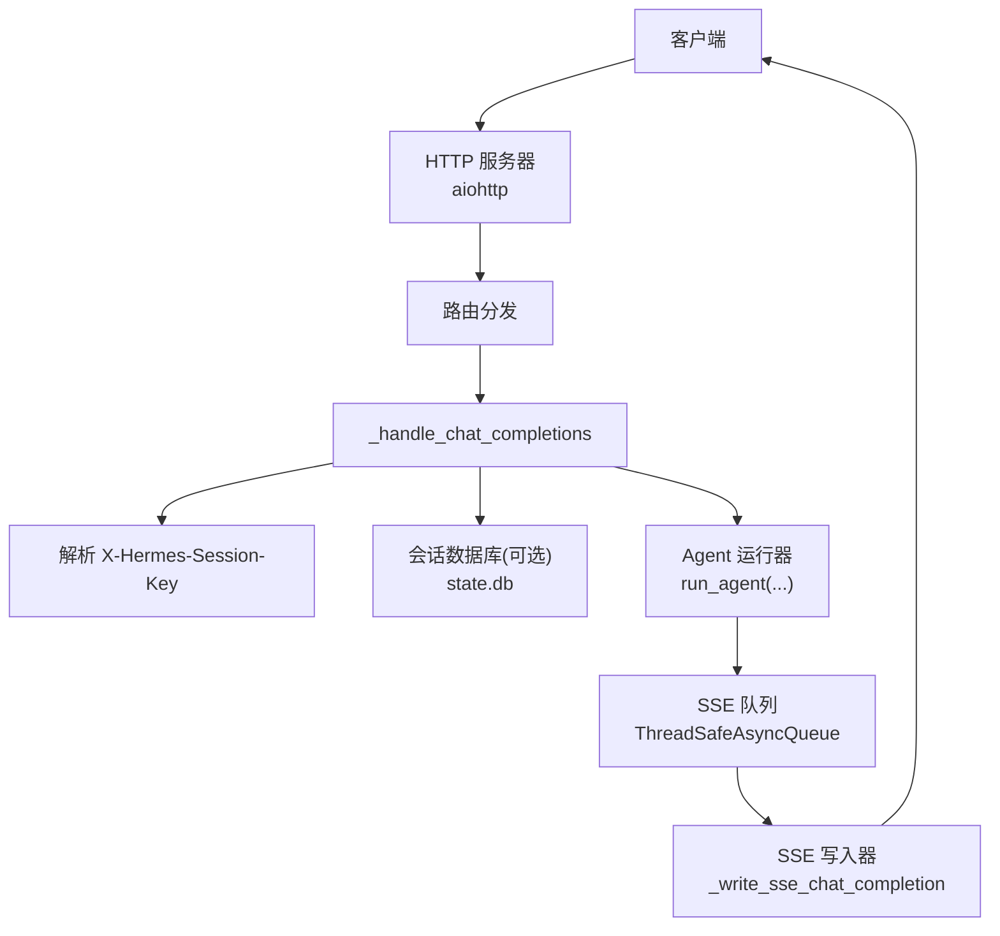
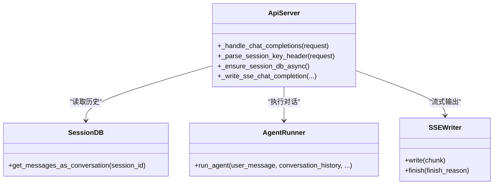

# 聊天补全 API

<cite>
**本文引用的文件**
- [gateway/platforms/api_server.py](file://gateway/platforms/api_server.py)
</cite>

## 目录
1. [简介](#简介)
2. [项目结构](#项目结构)
3. [核心组件](#核心组件)
4. [架构总览](#架构总览)
5. [详细组件分析](#详细组件分析)
6. [依赖关系分析](#依赖关系分析)
7. [性能考量](#性能考量)
8. [故障排查指南](#故障排查指南)
9. [结论](#结论)
10. [附录：请求与响应示例](#附录请求与响应示例)

## 简介
本文件为 Hermes Agent 提供的 OpenAI 兼容的 /v1/chat/completions 端点文档。该端点支持文本与多模态消息、流式与非流式响应，并提供会话连续性（X-Hermes-Session-Id）与长期记忆作用域（X-Hermes-Session-Key）能力。服务端基于 aiohttp 实现，内部通过“Agent”运行对话流程，并将结果以 OpenAI 兼容格式返回。

## 项目结构
- 聊天补全端点由 gateway/platforms/api_server.py 提供，路由注册在类方法中，处理逻辑集中在 _handle_chat_completions 及其辅助函数。
- 会话头解析与校验位于同一文件的会话键解析器中。
- 错误封装、多模态校验等工具函数也定义在同一文件中。



图表来源
- [gateway/platforms/api_server.py:4010-4252](file://gateway/platforms/api_server.py#L4010-L4252)
- [gateway/platforms/api_server.py:4370-4500](file://gateway/platforms/api_server.py#L4370-L4500)
- [gateway/platforms/api_server.py:2107-2157](file://gateway/platforms/api_server.py#L2107-L2157)

章节来源
- [gateway/platforms/api_server.py:4010-4252](file://gateway/platforms/api_server.py#L4010-L4252)
- [gateway/platforms/api_server.py:4370-4500](file://gateway/platforms/api_server.py#L4370-L4500)
- [gateway/platforms/api_server.py:2107-2157](file://gateway/platforms/api_server.py#L2107-L2157)

## 核心组件
- 端点处理器：POST /v1/chat/completions，负责解析请求体、校验 messages、提取 system/user/assistant 内容、选择模型路由、执行 Agent、并以 JSON 或 SSE 形式返回。
- 会话连续性：通过请求头 X-Hermes-Session-Id 恢复历史；若未提供则根据首条用户消息与系统提示推导稳定 session_id。
- 长期记忆作用域：通过请求头 X-Hermes-Session-Key 限定跨会话的长期记忆范围；需要启用 API 密钥认证。
- 流式传输：当 stream=true 时，使用 SSE 推送 chat.completion.chunk，并附带 hermes.tool.progress 事件用于工具调用状态。
- 幂等性：支持 Idempotency-Key 请求头，对相同指纹的请求进行缓存复用。

章节来源
- [gateway/platforms/api_server.py:4010-4252](file://gateway/platforms/api_server.py#L4010-L4252)
- [gateway/platforms/api_server.py:4254-4368](file://gateway/platforms/api_server.py#L4254-L4368)
- [gateway/platforms/api_server.py:4370-4500](file://gateway/platforms/api_server.py#L4370-L4500)
- [gateway/platforms/api_server.py:2107-2157](file://gateway/platforms/api_server.py#L2107-L2157)

## 架构总览
下图展示了从客户端到 Agent 再到 SSE 输出的完整调用链，包括会话头解析、历史加载、流式与非流式分支。

```mermaid
sequenceDiagram
participant C as "客户端"
participant S as "API 服务器"
participant H as "_handle_chat_completions"
participant K as "会话键解析"
participant DB as "会话数据库"
participant A as "Agent 运行器"
participant Q as "SSE 队列"
participant W as "SSE 写入器"
C->>S : POST /v1/chat/completions
S->>H : 路由到处理器
H->>K : 解析 X-Hermes-Session-Key
alt 提供 X-Hermes-Session-Id
H->>DB : 加载历史消息
DB-->>H : 历史列表
else 未提供
H->>H : 推导 session_id
end
opt stream=true
H->>A : run_agent(..., stream_delta_callback=...)
A-->>Q : 增量片段
Q->>W : 写入 SSE 帧
W-->>C : event : message (chunk)
A-->>Q : tool progress events
Q-->>C : event : hermes.tool.progress
A-->>W : 完成/失败标记
W-->>C : finish_reason 结束块
else 非流式
H->>A : run_agent(...)
A-->>H : 最终响应 + usage
H-->>C : chat.completion 对象
end
```

图表来源
- [gateway/platforms/api_server.py:4010-4252](file://gateway/platforms/api_server.py#L4010-L4252)
- [gateway/platforms/api_server.py:4254-4368](file://gateway/platforms/api_server.py#L4254-L4368)
- [gateway/platforms/api_server.py:4370-4500](file://gateway/platforms/api_server.py#L4370-L4500)

## 详细组件分析

### 端点：POST /v1/chat/completions
- 方法：POST
- 路径：/v1/chat/completions
- 认证：可选 API 密钥（用于启用会话连续性与长期记忆作用域）
- 请求体关键字段：
  - messages：数组，元素包含 role（system/user/assistant）与 content（字符串或多模态内容）
  - model：可选，默认使用服务配置模型；可结合 model_routes 别名路由
  - stream：布尔值，是否启用流式 SSE 响应
  - tools/tool_choice/model_options 等：按 OpenAI 兼容字段透传至 Agent
- 请求头：
  - X-Hermes-Session-Id：可选，用于恢复历史会话；需启用 API 密钥认证
  - X-Hermes-Session-Key：可选，用于限定长期记忆作用域；需启用 API 密钥认证
  - Idempotency-Key：可选，用于幂等重复请求
- 响应：
  - 非流式：chat.completion 对象，包含 choices、usage、hermes 扩展字段（如 completed/partial/failed/error）
  - 流式：text/event-stream，包含 chat.completion.chunk 与 hermes.tool.progress 事件

章节来源
- [gateway/platforms/api_server.py:4010-4252](file://gateway/platforms/api_server.py#L4010-L4252)
- [gateway/platforms/api_server.py:4254-4368](file://gateway/platforms/api_server.py#L4254-L4368)
- [gateway/platforms/api_server.py:4370-4500](file://gateway/platforms/api_server.py#L4370-L4500)

### 会话连续性：X-Hermes-Session-Id
- 行为：
  - 若提供有效的 X-Hermes-Session-Id，服务端从 state.db 加载历史消息作为 conversation_history
  - 未提供时，根据首条 user 消息与 system prompt 推导稳定的 session_id
- 安全限制：
  - 必须启用 API 密钥认证才允许使用该头
  - 拒绝控制字符与不安全路径形状的值，长度受限
- 响应头：
  - 返回 X-Hermes-Session-Id，便于客户端后续续用

章节来源
- [gateway/platforms/api_server.py:4076-4133](file://gateway/platforms/api_server.py#L4076-L4133)
- [gateway/platforms/api_server.py:4307-4311](file://gateway/platforms/api_server.py#L4307-L4311)
- [gateway/platforms/api_server.py:4392-4395](file://gateway/platforms/api_server.py#L4392-L4395)

### 长期记忆作用域：X-Hermes-Session-Key
- 行为：
  - 将本次请求的长期记忆读写限定在该 key 范围内，独立于会话 ID
  - 常用于跨 transcript 的渠道级隔离（例如 Honcho 会话）
- 安全限制：
  - 必须启用 API 密钥认证才允许使用该头
  - 拒绝控制字符与超长值（最大 256 字符）
- 响应头：
  - 返回 X-Hermes-Session-Key，便于客户端后续复用

章节来源
- [gateway/platforms/api_server.py:2107-2157](file://gateway/platforms/api_server.py#L2107-L2157)
- [gateway/platforms/api_server.py:4307-4311](file://gateway/platforms/api_server.py#L4307-L4311)
- [gateway/platforms/api_server.py:4392-4395](file://gateway/platforms/api_server.py#L4392-L4395)

### 多模态内容支持
- 支持在 messages 的 content 中包含图片与文件等多模态数据
- 服务端会规范化多模态内容并在必要时进行校验；非法内容将返回 OpenAI 风格错误
- 最终响应会将媒体内容转换为 data URL，以便前端直接渲染

章节来源
- [gateway/platforms/api_server.py:4036-4052](file://gateway/platforms/api_server.py#L4036-L4052)
- [gateway/platforms/api_server.py:4290-4291](file://gateway/platforms/api_server.py#L4290-L4291)

### 流式传输（SSE）
- 触发条件：stream=true
- 事件类型：
  - chat.completion.chunk：delta.content 增量文本
  - hermes.tool.progress：工具调用生命周期事件，携带 toolCallId 与 status（running/completed）
- 连接管理：
  - 保持活动心跳（keepalive），防止代理超时
  - 客户端断开时中断 Agent，避免继续调用上游 LLM
- 结束标志：
  - 根据 Agent 结果决定 finish_reason（stop/length/error）
  - 非正常完成时附加 hermes 扩展字段

章节来源
- [gateway/platforms/api_server.py:4158-4252](file://gateway/platforms/api_server.py#L4158-L4252)
- [gateway/platforms/api_server.py:4370-4500](file://gateway/platforms/api_server.py#L4370-L4500)

### 幂等性（Idempotency-Key）
- 支持通过 Idempotency-Key 对相同请求指纹进行缓存，避免重复执行
- 指纹包含 model、provider、model_options、messages、tools、tool_choice、stream 等关键参数

章节来源
- [gateway/platforms/api_server.py:4266-4279](file://gateway/platforms/api_server.py#L4266-L4279)

## 依赖关系分析
- 路由与处理器：api_server.py 中的类方法注册路由，统一进入 _handle_chat_completions
- 会话存储：state.db（SQLite）用于持久化会话历史，异步初始化以避免阻塞事件循环
- Agent 运行：run_agent 接收消息、历史、系统提示与回调，产出增量片段与最终结果
- SSE 输出：_write_sse_chat_completion 负责将增量与工具事件写入 text/event-stream



图表来源
- [gateway/platforms/api_server.py:4010-4252](file://gateway/platforms/api_server.py#L4010-L4252)
- [gateway/platforms/api_server.py:2163-2237](file://gateway/platforms/api_server.py#L2163-L2237)
- [gateway/platforms/api_server.py:4370-4500](file://gateway/platforms/api_server.py#L4370-L4500)

章节来源
- [gateway/platforms/api_server.py:4010-4252](file://gateway/platforms/api_server.py#L4010-L4252)
- [gateway/platforms/api_server.py:2163-2237](file://gateway/platforms/api_server.py#L2163-L2237)
- [gateway/platforms/api_server.py:4370-4500](file://gateway/platforms/api_server.py#L4370-L4500)

## 性能考量
- 并发限制：入站请求受并发上限保护，避免过多 Agent 任务同时运行
- SSE 心跳：定期发送 keepalive 帧，降低中间层超时风险
- 队列设计：使用线程安全队列传递增量，避免轮询延迟
- 幂等缓存：对相同请求指纹进行缓存，减少重复计算
- 资源释放：客户端断开时中断 Agent，及时释放上游 LLM 调用

章节来源
- [gateway/platforms/api_server.py:4012-4015](file://gateway/platforms/api_server.py#L4012-L4015)
- [gateway/platforms/api_server.py:4452-4454](file://gateway/platforms/api_server.py#L4452-L4454)
- [gateway/platforms/api_server.py:4222-4246](file://gateway/platforms/api_server.py#L4222-L4246)
- [gateway/platforms/api_server.py:4266-4279](file://gateway/platforms/api_server.py#L4266-L4279)

## 故障排查指南
- 常见错误类型：
  - 无效 JSON：返回 invalid_request_error
  - 缺少 messages 或无可见用户内容：返回 invalid_request_error
  - 多模态内容校验失败：返回 OpenAI 风格错误，含 param 定位
  - 会话连续性未启用 API 密钥：返回 403
  - 会话 ID 过长或包含控制字符：返回 400
  - 会话数据库不可用：返回 503
  - 内部错误：返回 server_error，并可能包含 hermes 扩展信息
- 诊断建议：
  - 检查请求体结构与 messages 字段
  - 确认是否启用了 API 密钥以使用会话头
  - 查看响应头 X-Hermes-Completed/X-Hermes-Partial/X-Hermes-Error 获取部分/失败信息
  - 流式场景下关注 hermes.tool.progress 事件以定位工具调用问题

章节来源
- [gateway/platforms/api_server.py:4018-4065](file://gateway/platforms/api_server.py#L4018-L4065)
- [gateway/platforms/api_server.py:4083-4113](file://gateway/platforms/api_server.py#L4083-L4113)
- [gateway/platforms/api_server.py:2130-2157](file://gateway/platforms/api_server.py#L2130-L2157)
- [gateway/platforms/api_server.py:4313-4368](file://gateway/platforms/api_server.py#L4313-L4368)

## 结论
Hermes Agent 的 /v1/chat/completions 端点提供了完整的 OpenAI 兼容接口，支持文本与多模态消息、流式与非流式响应、会话连续性与长期记忆作用域。通过严格的输入校验、安全限制与幂等机制，确保稳定性与安全性。建议在集成时合理设置会话头、启用幂等键，并根据业务需求选择流式或非流式模式。

## 附录：请求与响应示例

### 非流式请求（文本）
- 方法：POST
- 路径：/v1/chat/completions
- 请求体要点：
  - messages：包含 system/user/assistant 角色与文本内容
  - model：可选
  - stream：false 或未提供
- 响应要点：
  - object: "chat.completion"
  - choices[0].message.content：助手回复文本
  - usage：token 用量统计
  - 可选 hermes 扩展字段：completed/partial/failed/error

章节来源
- [gateway/platforms/api_server.py:4254-4368](file://gateway/platforms/api_server.py#L4254-L4368)

### 流式请求（文本）
- 方法：POST
- 路径：/v1/chat/completions
- 请求体要点：
  - stream：true
- 响应要点：
  - Content-Type: text/event-stream
  - 事件：chat.completion.chunk（delta.content）
  - 事件：hermes.tool.progress（工具调用状态）
  - 结束：finish_reason 为 stop/length/error

章节来源
- [gateway/platforms/api_server.py:4158-4252](file://gateway/platforms/api_server.py#L4158-L4252)
- [gateway/platforms/api_server.py:4370-4500](file://gateway/platforms/api_server.py#L4370-L4500)

### 多模态请求（图片与文件）
- 方法：POST
- 路径：/v1/chat/completions
- 请求体要点：
  - messages[].content：包含图片与文件的多模态结构
- 响应要点：
  - 媒体内容会被转换为 data URL，便于前端直接展示
  - 若校验失败，返回 OpenAI 风格错误并标注 param

章节来源
- [gateway/platforms/api_server.py:4036-4052](file://gateway/platforms/api_server.py#L4036-L4052)
- [gateway/platforms/api_server.py:4290-4291](file://gateway/platforms/api_server.py#L4290-L4291)

### 会话连续性示例
- 请求头：
  - X-Hermes-Session-Id：上次会话 ID
- 行为：
  - 服务端加载历史消息作为上下文
  - 响应头回显 X-Hermes-Session-Id
- 注意：
  - 需启用 API 密钥认证

章节来源
- [gateway/platforms/api_server.py:4076-4133](file://gateway/platforms/api_server.py#L4076-L4133)
- [gateway/platforms/api_server.py:4307-4311](file://gateway/platforms/api_server.py#L4307-L4311)

### 长期记忆作用域示例
- 请求头：
  - X-Hermes-Session-Key：稳定的渠道/用户标识
- 行为：
  - 限定长期记忆读写范围
  - 响应头回显 X-Hermes-Session-Key
- 注意：
  - 需启用 API 密钥认证

章节来源
- [gateway/platforms/api_server.py:2107-2157](file://gateway/platforms/api_server.py#L2107-L2157)
- [gateway/platforms/api_server.py:4307-4311](file://gateway/platforms/api_server.py#L4307-L4311)

### 幂等请求示例
- 请求头：
  - Idempotency-Key：唯一键
- 行为：
  - 相同指纹的请求将被缓存并复用结果

章节来源
- [gateway/platforms/api_server.py:4266-4279](file://gateway/platforms/api_server.py#L4266-L4279)