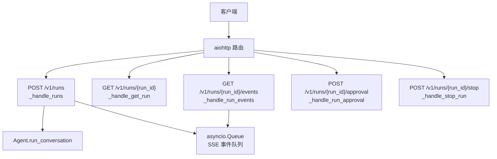
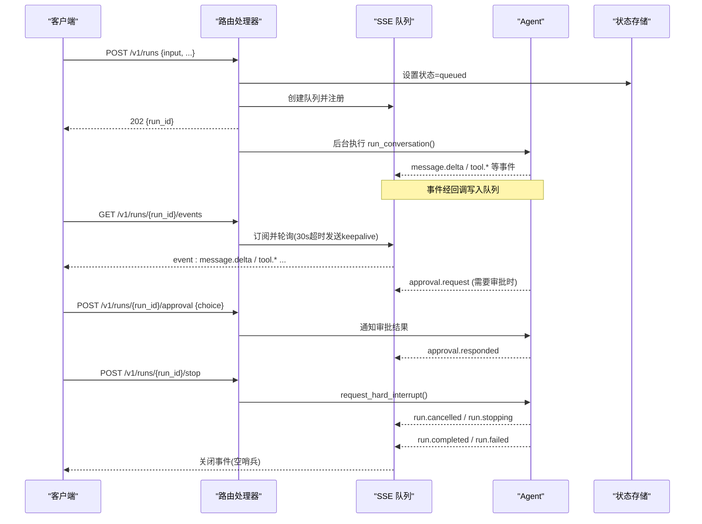
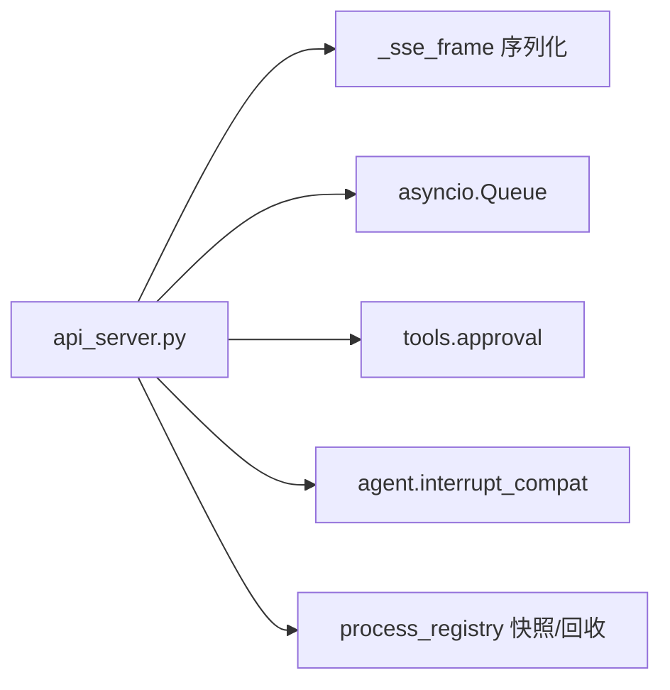

# 运行任务 API

<cite>
**本文引用的文件**
- [gateway/platforms/api_server.py](file://gateway/platforms/api_server.py)
</cite>

## 目录
1. [简介](#简介)
2. [项目结构](#项目结构)
3. [核心组件](#核心组件)
4. [架构总览](#架构总览)
5. [详细组件分析](#详细组件分析)
6. [依赖关系分析](#依赖关系分析)
7. [性能考量](#性能考量)
8. [故障排查指南](#故障排查指南)
9. [结论](#结论)
10. [附录](#附录)

## 简介
本文件面向“运行任务”API，提供完整的接口规范、生命周期与事件说明。该能力通过 OpenAI 兼容的 API 服务器平台适配器暴露，支持：
- 异步启动任务并立即返回 run_id（202）
- 查询任务状态
- 通过 SSE 流式获取结构化生命周期事件
- 任务批准机制
- 任务中断

## 项目结构
运行任务相关路由由 API 服务器平台适配器统一注册与处理，核心实现集中在单一文件中。

图表来源
- [gateway/platforms/api_server.py:2082-2086](file://gateway/platforms/api_server.py#L2082-L2086)
- [gateway/platforms/api_server.py:6444-6839](file://gateway/platforms/api_server.py#L6444-L6839)
- [gateway/platforms/api_server.py:6851-7050](file://gateway/platforms/api_server.py#L6851-L7050)

章节来源
- [gateway/platforms/api_server.py:1-40](file://gateway/platforms/api_server.py#L1-L40)
- [gateway/platforms/api_server.py:2082-2086](file://gateway/platforms/api_server.py#L2082-L2086)

## 核心组件
- 路由注册：/v1/runs 系列端点集中注册于路由表。
- 任务启动：POST /v1/runs 解析请求体、校验输入、创建 run_id、建立 SSE 队列、设置初始状态为 queued，并在后台执行 agent.run_conversation。
- 状态查询：GET /v1/runs/{run_id} 返回当前任务状态对象。
- 事件流：GET /v1/runs/{run_id}/events 以 text/event-stream 推送结构化事件，包含 keepalive 保活。
- 批准：POST /v1/runs/{run_id}/approval 用于响应 approval.request 事件，支持 once/session/always/deny。
- 中断：POST /v1/runs/{run_id}/stop 触发硬中断，并将任务置为 stopping，随后清理资源。

章节来源
- [gateway/platforms/api_server.py:2082-2086](file://gateway/platforms/api_server.py#L2082-L2086)
- [gateway/platforms/api_server.py:6444-6839](file://gateway/platforms/api_server.py#L6444-L6839)
- [gateway/platforms/api_server.py:6851-7050](file://gateway/platforms/api_server.py#L6851-L7050)

## 架构总览
下图展示从请求到事件流的完整时序，包括批准与中断路径。

图表来源
- [gateway/platforms/api_server.py:6444-6839](file://gateway/platforms/api_server.py#L6444-L6839)
- [gateway/platforms/api_server.py:6851-7050](file://gateway/platforms/api_server.py#L6851-L7050)

## 详细组件分析

### 启动任务：POST /v1/runs
- 功能：接收 input（字符串或消息数组），可选 instructions、previous_response_id、conversation_history、session_id、model/model_options/provider 等；立即返回 run_id 与 202。
- 关键流程：
  - 解析并校验输入，构建会话历史。
  - 生成 run_id，创建 asyncio.Queue 作为事件通道。
  - 设置初始状态 queued，记录创建时间。
  - 在后台线程执行 agent.run_conversation，期间通过回调将 message.delta、tool.*、approval.request 等事件入队。
  - 完成时根据结果设置 completed/failed/cancelled，并向队列写入结束哨兵。
- 并发控制：受全局并发限制保护，超限返回错误。
- 认证：遵循全局鉴权策略（如 API_SERVER_KEY）。

章节来源
- [gateway/platforms/api_server.py:6444-6839](file://gateway/platforms/api_server.py#L6444-L6839)

### 查询状态：GET /v1/runs/{run_id}
- 功能：返回当前 run 的状态对象（status、last_event、updated_at、error/output/usage 等字段随阶段变化）。
- 行为：未找到返回 404。

章节来源
- [gateway/platforms/api_server.py:6851-6864](file://gateway/platforms/api_server.py#L6851-L6864)

### 事件流：GET /v1/runs/{run_id}/events
- 协议：text/event-stream，使用统一的 SSE 帧格式。
- 保活：每 30 秒无事件时发送 keepalive 注释行，避免中间层断开连接。
- 关闭：当任务结束时向队列写入 None 哨兵，流式处理器收到后发送关闭注释并终止流。
- 订阅容错：若客户端稍早订阅，处理器会短暂等待 run 注册完成。

章节来源
- [gateway/platforms/api_server.py:6866-6915](file://gateway/platforms/api_server.py#L6866-L6915)

### 任务批准：POST /v1/runs/{run_id}/approval
- 触发时机：当任务执行过程中出现需要人工确认的操作时，事件流会推送 approval.request。
- 参数：
  - choice：once / session / always / deny（也接受 approve/approved/allow 等同义值）。
  - all/resolve_all：布尔值，决定是否批量解决多个待批事项。
- 行为：
  - 校验 choice 合法性。
  - 调用底层批准解析器 resolve_gateway_approval。
  - 成功后将状态切回 running，并通过事件流推送 approval.responded。
  - 若无活跃审批会话或无可批事项，返回相应错误码。

章节来源
- [gateway/platforms/api_server.py:6918-7004](file://gateway/platforms/api_server.py#L6918-L7004)

### 任务中断：POST /v1/runs/{run_id}/stop
- 行为：
  - 标记任务为 stopping，加入停止集合。
  - 对活动中的 agent 发起硬中断。
  - 清理该任务创建的后台进程（按 epoch 隔离，避免误杀共享会话的其他任务）。
  - 返回 status=stopping。
- 后续：任务可能以 cancelled 或 stopping 结束，具体取决于中断时机。

章节来源
- [gateway/platforms/api_server.py:7006-7036](file://gateway/platforms/api_server.py#L7006-L7036)

### 事件类型与数据结构
- 事件通过统一 SSE 帧序列化，包含 event、data(JSON)。
- 常见事件：
  - message.delta：文本增量。
  - tool.*：工具调用进度/结果（例如开始、完成、错误等）。
  - approval.request：需要人工批准的提示，附带 choices 列表。
  - approval.responded：审批已处理的确认。
  - run.stopping：开始中断。
  - run.cancelled：被取消。
  - run.completed：成功完成，包含 output 与 usage。
  - run.failed：失败，包含 error。
- 注意：命令与敏感信息在事件出口处会被脱敏处理，避免泄露。

章节来源
- [gateway/platforms/api_server.py:187-206](file://gateway/platforms/api_server.py#L187-L206)
- [gateway/platforms/api_server.py:6554-6567](file://gateway/platforms/api_server.py#L6554-L6567)
- [gateway/platforms/api_server.py:6610-6637](file://gateway/platforms/api_server.py#L6610-L6637)
- [gateway/platforms/api_server.py:6720-6752](file://gateway/platforms/api_server.py#L6720-L6752)
- [gateway/platforms/api_server.py:6753-6809](file://gateway/platforms/api_server.py#L6753-L6809)

### 任务生命周期示例（端到端）
- 步骤 1：POST /v1/runs
  - 请求体包含 input（必需）、可选 instructions、conversation_history、previous_response_id、session_id、model/model_options/provider。
  - 响应：202 + {run_id}。
- 步骤 2：GET /v1/runs/{run_id}/events
  - 订阅事件流，依次可能收到：
    - queued/running（状态变更）
    - message.delta（文本增量）
    - tool.*（工具调用过程）
    - approval.request（如需审批）
- 步骤 3（可选）：POST /v1/runs/{run_id}/approval
  - 选择 once/session/always/deny，并可选择 resolve_all。
  - 事件流返回 approval.responded。
- 步骤 4（可选）：POST /v1/runs/{run_id}/stop
  - 触发中断，事件流返回 run.stopping/run.cancelled。
- 步骤 5：最终事件
  - run.completed（含 output、usage）或 run.failed（含 error）。
  - 流关闭（空哨兵）。

章节来源
- [gateway/platforms/api_server.py:6444-6839](file://gateway/platforms/api_server.py#L6444-L6839)
- [gateway/platforms/api_server.py:6866-6915](file://gateway/platforms/api_server.py#L6866-L6915)
- [gateway/platforms/api_server.py:6918-7036](file://gateway/platforms/api_server.py#L6918-L7036)

## 依赖关系分析
- HTTP 框架：aiohttp web 应用与 StreamResponse。
- 事件序列化：统一 _sse_frame 函数保证 wire 格式一致。
- 并发与资源：
  - asyncio.Queue 用于事件桥接。
  - 后台线程执行 agent.run_conversation，避免阻塞事件循环。
  - 进程回收：通过 epoch 隔离与快照，安全清理后台进程。
- 批准系统：tools.approval 模块提供注册/注销与解析。
- 中断：agent.interrupt_compat 提供硬中断能力。

图表来源
- [gateway/platforms/api_server.py:187-206](file://gateway/platforms/api_server.py#L187-L206)
- [gateway/platforms/api_server.py:6444-6839](file://gateway/platforms/api_server.py#L6444-L6839)
- [gateway/platforms/api_server.py:6918-7036](file://gateway/platforms/api_server.py#L6918-L7036)

章节来源
- [gateway/platforms/api_server.py:187-206](file://gateway/platforms/api_server.py#L187-L206)
- [gateway/platforms/api_server.py:6444-6839](file://gateway/platforms/api_server.py#L6444-L6839)
- [gateway/platforms/api_server.py:6918-7036](file://gateway/platforms/api_server.py#L6918-L7036)

## 性能考量
- 事件流保活：30 秒超时发送 keepalive，降低代理/负载均衡器断连风险。
- 非阻塞执行：agent 运行在独立线程，事件通过线程安全队列投递，避免阻塞事件循环。
- 内存与缓冲：SSE 队列仅在任务生命周期内存在，配合定期清扫过期传输与状态，防止内存泄漏。
- 并发限制：全局并发上限保护后端资源不被压垮。
- 文本截断：对多模态内容做长度限制，避免过大负载。

章节来源
- [gateway/platforms/api_server.py:6866-6915](file://gateway/platforms/api_server.py#L6866-L6915)
- [gateway/platforms/api_server.py:6444-6839](file://gateway/platforms/api_server.py#L6444-L6839)
- [gateway/platforms/api_server.py:7038-7084](file://gateway/platforms/api_server.py#L7038-L7084)

## 故障排查指南
- 404 未找到：
  - 查询状态或事件流时 run_id 不存在，检查是否已启动或已过期。
- 400 无效请求：
  - 缺少 input、JSON 解析失败、approval.choice 不合法。
- 409 冲突：
  - 审批无活跃会话或无可批事项。
- 500 内部错误：
  - 审批解析异常或上游服务异常。
- 流中断：
  - 长时间无事件且网络不稳定，需重连；客户端应处理 keepalive 与关闭信号。
- 中断后状态：
  - stop 后立即返回 stopping，后续可能变为 cancelled；关注事件流最终状态。

章节来源
- [gateway/platforms/api_server.py:6851-6915](file://gateway/platforms/api_server.py#L6851-L6915)
- [gateway/platforms/api_server.py:6918-7036](file://gateway/platforms/api_server.py#L6918-L7036)

## 结论
运行任务 API 提供了稳定、可扩展的异步任务执行能力，结合 SSE 事件流与批准机制，满足复杂工作流中的人机协同需求。通过严格的输入校验、并发控制、资源清理与错误处理，确保在高负载场景下的可靠性与可观测性。

## 附录

### 接口速查表
- POST /v1/runs
  - 作用：启动任务，立即返回 run_id（202）
  - 请求体关键字段：input（必需）、instructions、conversation_history、previous_response_id、session_id、model/model_options/provider
  - 响应：{run_id}
- GET /v1/runs/{run_id}
  - 作用：查询任务状态
  - 响应：状态对象（status、last_event、updated_at、error/output/usage 等）
- GET /v1/runs/{run_id}/events
  - 作用：SSE 事件流
  - 事件：message.delta、tool.*、approval.request、approval.responded、run.stopping、run.cancelled、run.completed、run.failed
- POST /v1/runs/{run_id}/approval
  - 作用：响应审批
  - 请求体关键字段：choice（once/session/always/deny）、all/resolve_all（布尔）
  - 响应：{object, run_id, choice, resolved}
- POST /v1/runs/{run_id}/stop
  - 作用：中断任务
  - 响应：{run_id, status="stopping"}

章节来源
- [gateway/platforms/api_server.py:2082-2086](file://gateway/platforms/api_server.py#L2082-L2086)
- [gateway/platforms/api_server.py:6444-6839](file://gateway/platforms/api_server.py#L6444-L6839)
- [gateway/platforms/api_server.py:6851-7036](file://gateway/platforms/api_server.py#L6851-L7036)