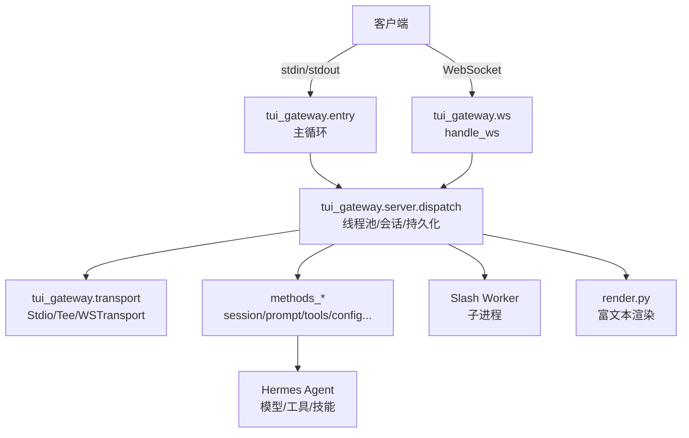
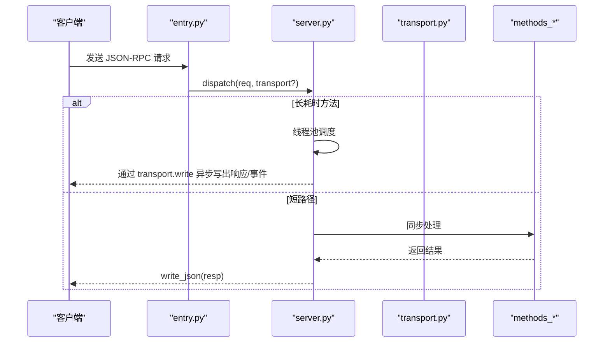
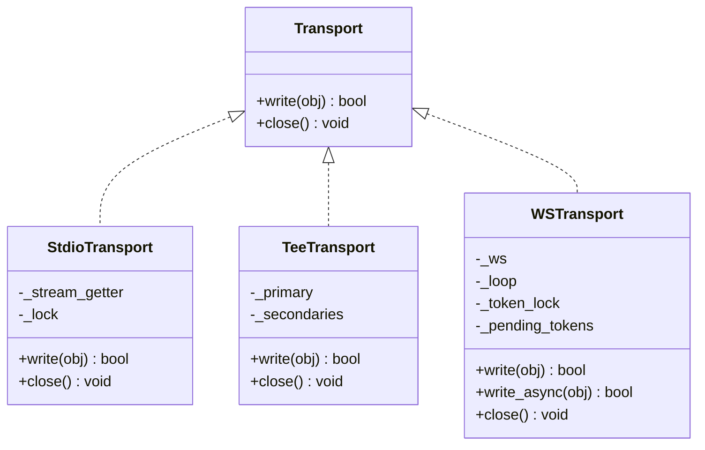
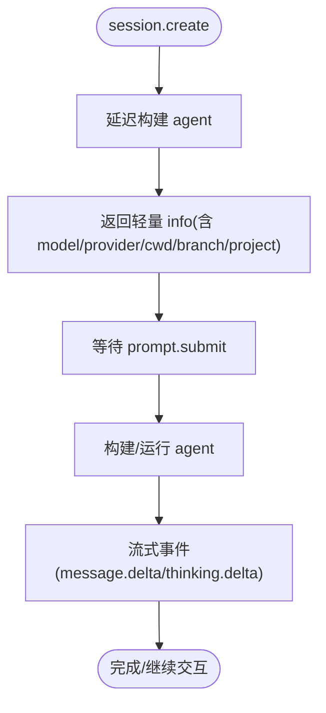
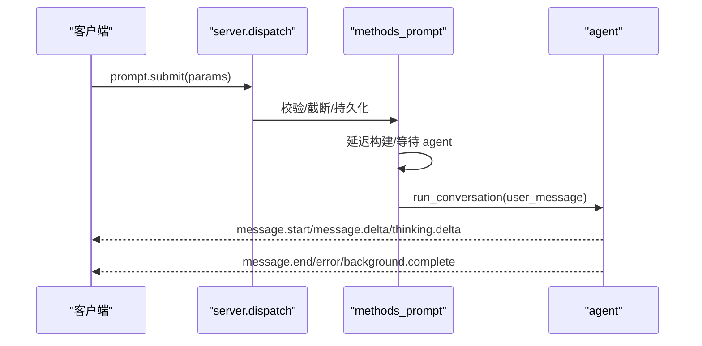
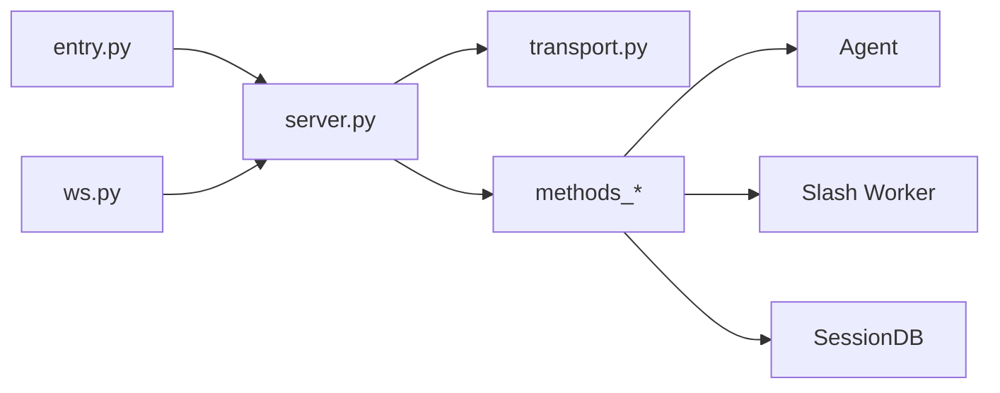

# TUI 网关接口

<cite>
**本文引用的文件**
- [entry.py](file://tui_gateway/entry.py)
- [server.py](file://tui_gateway/server.py)
- [ws.py](file://tui_gateway/ws.py)
- [transport.py](file://tui_gateway/transport.py)
- [methods_session.py](file://tui_gateway/methods_session.py)
- [methods_prompt.py](file://tui_gateway/methods_prompt.py)
- [methods_tools.py](file://tui_gateway/methods_tools.py)
- [render.py](file://tui_gateway/render.py)
</cite>

## 目录
1. [简介](#简介)
2. [项目结构](#项目结构)
3. [核心组件](#核心组件)
4. [架构总览](#架构总览)
5. [详细组件分析](#详细组件分析)
6. [依赖关系分析](#依赖关系分析)
7. [性能与流式优化](#性能与流式优化)
8. [故障排查指南](#故障排查指南)
9. [结论](#结论)
10. [附录：API 参考与示例](#附录api-参考与示例)

## 简介
本文件为 TUI 网关的对外通信协议文档，面向终端用户界面（TUI）及桌面/Web 客户端。网关通过 JSON-RPC 在标准输入输出或 WebSocket 上提供服务，统一处理会话管理、提示提交、工具调用、文件附件、系统命令、配置重载等能力。本文档覆盖方法调用格式、参数传递、结果返回、错误码、异步与流式响应、连接与超时、资源清理、客户端集成与调试要点。

## 项目结构
TUI 网关由以下关键模块组成：
- entry.py：进程入口，负责信号处理、MCP 发现、启动事件、主循环读取 stdin 并分发请求。
- server.py：核心调度器、会话状态、线程池、持久化、Slash 子进程、崩溃日志、皮肤监听等。
- ws.py：WebSocket 传输层，复用 server.dispatch，提供 token 合并与写超时保护。
- transport.py：传输抽象（StdioTransport、TeeTransport），屏蔽底层 I/O 差异。
- methods_*.py：按功能划分的 JSON-RPC 处理器注册（会话、提示、工具等）。
- render.py：富文本渲染桥接，将消息转换为可展示格式。

**图示来源**
- [entry.py:421-487](file://tui_gateway/entry.py#L421-L487)
- [ws.py:286-477](file://tui_gateway/ws.py#L286-L477)
- [server.py:184-296](file://tui_gateway/server.py#L184-L296)
- [transport.py:100-183](file://tui_gateway/transport.py#L100-L183)
- [methods_session.py:14-159](file://tui_gateway/methods_session.py#L14-L159)
- [methods_prompt.py:67-367](file://tui_gateway/methods_prompt.py#L67-L367)
- [methods_tools.py:14-82](file://tui_gateway/methods_tools.py#L14-L82)
- [render.py:10-49](file://tui_gateway/render.py#L10-L49)

**章节来源**
- [entry.py:421-487](file://tui_gateway/entry.py#L421-L487)
- [ws.py:286-477](file://tui_gateway/ws.py#L286-L477)
- [server.py:184-296](file://tui_gateway/server.py#L184-L296)
- [transport.py:100-183](file://tui_gateway/transport.py#L100-L183)

## 核心组件
- 传输抽象
  - StdioTransport：向 stdout 写入 JSON 行，捕获“对端消失”错误并返回 False，供 entry 安全退出。
  - TeeTransport：将同一帧同时写入主通道和侧边通道（如 dashboard WS），失败被吞掉不影响主路径。
  - WSTransport：WebSocket 专用，支持 token 合并、写超时、顺序保证、关闭清理。
- 调度与并发
  - 长耗时方法路由到线程池，避免阻塞 stdin/WS 读循环；短路径保持顺序。
  - 会话级锁与全局锁保护历史、配置、会话表等共享状态。
- 会话与生命周期
  - session.create/resume/list/most_recent 等；支持懒构建、分支、压缩续接、活跃会话槽位。
  - 异常/断开时 finalize 持久化未刷消息、结束插件钩子、中断委派任务、释放资源。
- 提示与执行
  - prompt.submit：支持截断重放、后台运行、语音停止短语、计算主机隔离、延迟构建等待。
  - slash.exec 通过 Slash Worker 子进程执行 CLI 命令，带超时与 stderr 尾追踪。
- 工具与系统
  - reload.mcp：序列化刷新 MCP 工具集，支持确认策略与生成号合并。
  - cli.exec/process.*：进程管理与 CLI 子进程执行，含超时与输出限制。
- 渲染
  - render_message/render_diff/make_stream_renderer：可选富文本渲染，失败回退到纯文本。

**章节来源**
- [transport.py:100-220](file://tui_gateway/transport.py#L100-L220)
- [server.py:184-296](file://tui_gateway/server.py#L184-L296)
- [methods_session.py:14-159](file://tui_gateway/methods_session.py#L14-L159)
- [methods_prompt.py:67-367](file://tui_gateway/methods_prompt.py#L67-L367)
- [methods_tools.py:84-231](file://tui_gateway/methods_tools.py#L84-L231)
- [render.py:10-49](file://tui_gateway/render.py#L10-L49)

## 架构总览
JSON-RPC 协议在两种传输上等价：
- stdio：newline-delimited JSON-RPC，entry 主循环读取 stdin 并调用 dispatch。
- WebSocket：ws.handle_ws 接受连接后发送 gateway.ready，随后复用同一 dispatch。

**图示来源**
- [entry.py:460-487](file://tui_gateway/entry.py#L460-L487)
- [server.py:184-296](file://tui_gateway/server.py#L184-L296)
- [transport.py:100-183](file://tui_gateway/transport.py#L100-L183)
- [methods_session.py:14-159](file://tui_gateway/methods_session.py#L14-L159)

**章节来源**
- [entry.py:460-487](file://tui_gateway/entry.py#L460-L487)
- [ws.py:286-477](file://tui_gateway/ws.py#L286-L477)
- [server.py:184-296](file://tui_gateway/server.py#L184-L296)

## 详细组件分析

### 传输层（stdio / websocket）
- 设计要点
  - 所有 handler 通过当前上下文绑定的 Transport 写出，确保多连接/多会话正确路由。
  - StdioTransport 对“对端消失”做精确识别，返回 False 触发 entry 安全退出。
  - WSTransport 对高频 token 事件进行合并，避免事件循环抖动；非 token 事件立即冲刷以保证顺序。
  - TeeTransport 用于将事件镜像到 dashboard 侧边栏 WS，失败不阻塞主路径。
- 关键行为
  - 写超时：WSTransport 在事件循环停滞时记录警告并保持连接存活，避免误判断开。
  - Nagle 禁用：WS 连接设置 TCP_NODELAY，保证 token 实时性。
  - 关闭流程：取消合并定时器、注销传输、释放唤醒词资源、回收会话。

**图示来源**
- [transport.py:66-220](file://tui_gateway/transport.py#L66-L220)
- [ws.py:70-256](file://tui_gateway/ws.py#L70-L256)

**章节来源**
- [transport.py:66-220](file://tui_gateway/transport.py#L66-L220)
- [ws.py:70-256](file://tui_gateway/ws.py#L70-L256)

### 会话管理（session.*）
- 主要方法
  - session.create：创建会话，支持 cwd/source/profile/model/effort/fast 等参数；返回轻量信息并延迟构建 agent。
  - session.resume：恢复会话，支持 lazy/watch/cold 路径、压缩续接、消息裁剪与显示投影。
  - session.list/most_recent：列出最近会话，过滤内部来源。
  - project.facts/verification.status：项目事实与验证状态查询。
- 关键点
  - 懒构建：首次 prompt 或显式构建才真正初始化 agent，减少冷启动延迟。
  - 活跃会话槽位：首条真实 turn 时才占用槽位，避免空闲窗口占满上限。
  - 数据库句柄转移：resume 后将 DB 所有权交给 agent，避免句柄泄漏与“已关闭”错误。

**图示来源**
- [methods_session.py:14-159](file://tui_gateway/methods_session.py#L14-L159)
- [methods_session.py:306-602](file://tui_gateway/methods_session.py#L306-L602)

**章节来源**
- [methods_session.py:14-159](file://tui_gateway/methods_session.py#L14-L159)
- [methods_session.py:306-602](file://tui_gateway/methods_session.py#L306-L602)

### 提示与输入（prompt.*）
- 主要方法
  - prompt.submit：提交用户消息，支持截断重放、语音停止短语、后台运行、计算主机隔离、延迟构建等待。
  - clipboard.paste/image.attach(image.attach_bytes)/pdf.attach/file.attach：附件与文件暂存，返回引用以便 agent 工具读取。
  - image.detach/input.detect_drop：移除附件或检测拖拽。
  - prompt.background：后台独立任务，完成后通过事件通知父会话。
- 关键点
  - 截断重放：需要 confirm_truncate/confirm_empty_truncate 双重确认，防止误删历史。
  - 延迟构建：若 agent 尚未就绪，会等待构建完成再继续执行，期间支持取消。
  - 附件：PDF 使用 pdftoppm 转页为 PNG，限制大小与页数；远程上传通过 base64。

**图示来源**
- [methods_prompt.py:67-367](file://tui_gateway/methods_prompt.py#L67-L367)
- [methods_prompt.py:370-800](file://tui_gateway/methods_prompt.py#L370-L800)

**章节来源**
- [methods_prompt.py:67-367](file://tui_gateway/methods_prompt.py#L67-L367)
- [methods_prompt.py:370-800](file://tui_gateway/methods_prompt.py#L370-L800)

### 工具与系统（tools/*）
- 主要方法
  - system.battery：电池状态。
  - process.list/process.kill/process.stop：进程管理（会话级/全局）。
  - reload.mcp：重新加载 MCP 工具集，支持确认与生成号合并。
  - reload.env：重载环境变量。
  - commands.catalog/command.resolve/command.dispatch：命令目录与分发（含 skill/bundle/quick command）。
  - cli.exec：执行 hermes_cli.main 子进程，捕获输出与超时。
- 关键点
  - reload.mcp 串行化：避免并发刷新导致工具注册不一致。
  - 命令分发优先级：quick command → plugin → bundle → skill → send/exec。
  - 安全：子进程执行限制超时、UTF-8 容错解码、隐藏控制台窗口（Windows）。

**章节来源**
- [methods_tools.py:14-82](file://tui_gateway/methods_tools.py#L14-L82)
- [methods_tools.py:84-231](file://tui_gateway/methods_tools.py#L84-L231)
- [methods_tools.py:234-252](file://tui_gateway/methods_tools.py#L234-L252)
- [methods_tools.py:255-368](file://tui_gateway/methods_tools.py#L255-L368)
- [methods_tools.py:371-409](file://tui_gateway/methods_tools.py#L371-L409)
- [methods_tools.py:412-699](file://tui_gateway/methods_tools.py#L412-L699)

### 渲染与事件
- render.py 提供富文本渲染桥接，失败时回退到纯文本。
- 事件类型包括 message.delta/reasoning.delta/thinking.delta 等高频 token 事件，由 WSTransport 合并发送。

**章节来源**
- [render.py:10-49](file://tui_gateway/render.py#L10-L49)
- [ws.py:53-60](file://tui_gateway/ws.py#L53-L60)

## 依赖关系分析
- 入口与调度
  - entry.py 仅负责 I/O 与信号处理，核心逻辑委托给 server.dispatch。
  - ws.py 复用同一 dispatch，保证 stdio 与 WS 行为一致。
- 传输与上下文
  - transport.py 通过 contextvar 绑定当前请求的传输，使 handler 无需感知底层。
- 方法注册
  - methods_* 通过 HandlerRegistry 将函数绑定到 method 名，安装到 server._methods。
- 外部依赖
  - Slash Worker：子进程执行 CLI 命令，需 UTF-8 容错与 Windows 标志。
  - Agent：会话构建与对话执行，受 profile/home/secret scope 影响。
  - 数据库：hermes_state.SessionDB，支持会话恢复、消息替换、压缩续接。

**图示来源**
- [entry.py:421-487](file://tui_gateway/entry.py#L421-L487)
- [ws.py:286-477](file://tui_gateway/ws.py#L286-L477)
- [server.py:184-296](file://tui_gateway/server.py#L184-L296)
- [methods_session.py:14-159](file://tui_gateway/methods_session.py#L14-L159)

**章节来源**
- [entry.py:421-487](file://tui_gateway/entry.py#L421-L487)
- [ws.py:286-477](file://tui_gateway/ws.py#L286-L477)
- [server.py:184-296](file://tui_gateway/server.py#L184-L296)

## 性能与流式优化
- 线程池调度
  - 长耗时方法（如 billing、subscription、complete.path、slash.exec、shell.exec、reload.mcp 等）放入线程池，避免阻塞读循环。
  - 可通过 HERMES_TUI_RPC_POOL_WORKERS 调整工作线程数。
- 流式合并
  - WSTransport 对 message/reasoning/thinking delta 进行短时合并（约 33ms），降低事件循环唤醒频率。
  - 非 token 事件（RPC 响应、控制帧）会先冲刷 token 缓冲，保证顺序。
- I/O 优化
  - WS 禁用 Nagle，保证 token 实时到达。
  - StdioTransport 支持禁用 flush（HERMES_TUI_GATEWAY_NO_FLUSH），避免半关闭管道导致的阻塞。
- 资源清理
  - 断开 WS 后延迟回收孤儿会话（HERMES_TUI_WS_ORPHAN_REAP_GRACE_S），快速重连可恢复。
  - 信号处理与 atexit 钩子确保 crash 日志与资源释放。

**章节来源**
- [server.py:184-296](file://tui_gateway/server.py#L184-L296)
- [ws.py:38-60](file://tui_gateway/ws.py#L38-L60)
- [ws.py:268-284](file://tui_gateway/ws.py#L268-L284)
- [transport.py:47-63](file://tui_gateway/transport.py#L47-L63)

## 故障排查指南
- 崩溃日志
  - 未处理异常与线程异常会被记录到 ~/.hermes/logs/tui_gateway_crash.log，并在 stderr 输出一行摘要。
- 信号处理
  - SIGTERM/SIGHUP/SIGBREAK 会记录堆栈并优雅退出；SIGPIPE 忽略以避免后台线程写管道崩溃。
  - 退出前尝试 flush 会话并持久化未刷消息，超时则强制退出。
- 常见错误
  - 解析错误：-32700（parse error）。
  - 内部错误：-32603（internal error）。
  - 业务错误：各方法返回自定义错误码（如 4006/4007/4009/4012/4015/4016/4017/4018/4028/4029/4044/4130/5000/5006/5010/5012/5015/5016/5017/5019/5020/5027/5028/5030/5070/5071 等）。
- 调试建议
  - 启用 change_events：gateway.ready 中携带 change_events=true，客户端可用事件替代轮询。
  - 观察 WSTransport 日志：peer、parse_errors、dispatch_crashes、send_failures、reaped/detached sessions。
  - 检查 Slash Worker 超时与 stderr 尾部，定位子进程问题。
  - 使用 render.py 的富文本渲染失败回退特性，确认是否因渲染库缺失导致显示异常。

**章节来源**
- [server.py:62-132](file://tui_gateway/server.py#L62-L132)
- [entry.py:89-171](file://tui_gateway/entry.py#L89-L171)
- [entry.py:233-252](file://tui_gateway/entry.py#L233-L252)
- [ws.py:339-477](file://tui_gateway/ws.py#L339-L477)

## 结论
TUI 网关以 JSON-RPC 为核心协议，通过统一的传输抽象与调度机制，在 stdio 与 WebSocket 上提供一致的会话、提示、工具与系统管理能力。其设计强调：
- 高吞吐与低延迟：线程池调度长耗时操作，WS token 合并与 Nagle 禁用保障实时性。
- 健壮性与可观测性：完善的信号处理、崩溃日志、错误码与统计指标。
- 可扩展性：方法模块化注册、传输解耦、渲染桥接，便于新增能力与适配不同前端。

## 附录：API 参考与示例

### 通用协议
- 传输
  - stdio：每行一个 JSON-RPC 对象。
  - WebSocket：同 stdio 格式，连接后立即收到 gateway.ready 事件。
- 请求/响应
  - 请求：{jsonrpc, method, params, id?}
  - 响应：{jsonrpc, result, id?} 或 {jsonrpc, error, id?}
  - 事件：{jsonrpc, method:"event", params:{type, payload}}
- 错误码
  - 标准：-32700（解析错误）、-32603（内部错误）。
  - 业务：见各方法返回的错误码说明。

**章节来源**
- [entry.py:460-487](file://tui_gateway/entry.py#L460-L487)
- [ws.py:359-418](file://tui_gateway/ws.py#L359-L418)

### 会话管理
- session.create
  - 参数：cols、messages、title、parent_session_id、cwd、source、profile、model、provider、reasoning_effort、fast、close_on_disconnect
  - 返回：session_id、stored_session_id、message_count、messages、info（含 model/provider/tools/skills/cwd/branch/project/desktop_contract/profile_name/lazy）
  - 行为：延迟构建 agent，后台预热模型选择缓存。
- session.resume
  - 参数：session_id、cols、profile、omit_messages、lazy、eager_build
  - 返回：session_id、resumed、message_count、messages、info、running、status、auto_continue（可选）
  - 行为：支持懒/冷/热路径，压缩续接，显示/模型历史分离。
- session.list/most_recent
  - 返回：会话列表或最近会话元数据（过滤内部来源）。

**章节来源**
- [methods_session.py:14-159](file://tui_gateway/methods_session.py#L14-L159)
- [methods_session.py:162-260](file://tui_gateway/methods_session.py#L162-L260)
- [methods_session.py:306-602](file://tui_gateway/methods_session.py#L306-L602)

### 提示与输入
- prompt.submit
  - 参数：session_id、text、interrupted、truncate_before_user_ordinal、confirm_truncate、confirm_empty_truncate、queued
  - 返回：{"status":"streaming"}
  - 行为：截断重放需双重确认；语音模式支持 typed stop；延迟构建等待；后台任务通过 background.complete 通知。
- 附件
  - clipboard.paste：粘贴图片到会话。
  - image.attach/image.attach_bytes：附加本地或上传的图片。
  - pdf.attach：将 PDF 转为 PNG 页面并附加。
  - file.attach：附加任意文件，返回 @file 引用。
  - image.detach：移除图片。
  - input.detect_drop：检测拖拽并自动附加。

**章节来源**
- [methods_prompt.py:67-367](file://tui_gateway/methods_prompt.py#L67-L367)
- [methods_prompt.py:370-800](file://tui_gateway/methods_prompt.py#L370-L800)

### 工具与系统
- system.battery：返回电池可用性、电量、插电源状态、类别。
- process.list/process.kill/process.stop：会话/全局进程管理。
- reload.mcp：重新加载 MCP 工具集，支持确认与生成号合并。
- reload.env：重载环境变量。
- commands.catalog/command.resolve/command.dispatch：命令目录、解析与分发（含 quick command、plugin、bundle、skill）。
- cli.exec：执行 hermes_cli.main，捕获输出与超时。

**章节来源**
- [methods_tools.py:14-82](file://tui_gateway/methods_tools.py#L14-L82)
- [methods_tools.py:84-231](file://tui_gateway/methods_tools.py#L84-L231)
- [methods_tools.py:234-252](file://tui_gateway/methods_tools.py#L234-L252)
- [methods_tools.py:255-368](file://tui_gateway/methods_tools.py#L255-L368)
- [methods_tools.py:371-409](file://tui_gateway/methods_tools.py#L371-L409)
- [methods_tools.py:412-699](file://tui_gateway/methods_tools.py#L412-L699)

### 异步调用、流式响应与进度跟踪
- 异步调用
  - 长耗时方法通过线程池异步执行，handler 返回 None 表示异步，后续通过 transport.write 写出响应/事件。
- 流式响应
  - message.delta/reasoning.delta/thinking.delta 高频事件由 WSTransport 合并发送，保持顺序与实时性。
- 进度跟踪
  - 工具进度模式与开始时间由会话维护；可通过 config.set 调整显示策略。
  - Slash Worker 子进程输出通过队列收集，stderr 保留尾部用于诊断。

**章节来源**
- [server.py:184-296](file://tui_gateway/server.py#L184-L296)
- [ws.py:38-60](file://tui_gateway/ws.py#L38-L60)
- [methods_prompt.py:67-367](file://tui_gateway/methods_prompt.py#L67-L367)

### 连接管理、超时与资源清理
- 连接管理
  - WS 连接建立后发送 gateway.ready；断开后注销传输、回收会话、释放唤醒词资源。
- 超时处理
  - Slash Worker 超时、cli.exec 超时、WS 写超时均有明确处理与错误返回。
- 资源清理
  - 信号处理与 atexit 钩子确保崩溃日志与资源释放；finalize 持久化未刷消息并中断委派任务。

**章节来源**
- [ws.py:286-477](file://tui_gateway/ws.py#L286-L477)
- [entry.py:89-171](file://tui_gateway/entry.py#L89-L171)
- [server.py:661-800](file://tui_gateway/server.py#L661-L800)

### 客户端集成指南与调试
- 集成步骤
  - 选择传输：stdio 或 WebSocket。
  - 连接后订阅 gateway.ready，启用 change_events 以减少轮询。
  - 使用 session.create/resume 管理会话，prompt.submit 提交消息，监听 message.* 事件获取流式输出。
  - 使用 tools.* 管理工具与环境，必要时调用 reload.mcp/reload.env。
- 调试技巧
  - 关注 WSTransport 统计：messages、parse_errors、dispatch_crashes、send_failures。
  - 查看 tui_gateway_crash.log 与 stderr 中的 [gateway-*] 标记。
  - 对于 Slash Worker，检查 stderr 尾部与超时原因。
  - 使用 render.py 的富文本渲染失败回退特性，确认显示问题是否与渲染库相关。

**章节来源**
- [ws.py:286-477](file://tui_gateway/ws.py#L286-L477)
- [entry.py:421-487](file://tui_gateway/entry.py#L421-L487)
- [server.py:62-132](file://tui_gateway/server.py#L62-L132)
- [render.py:10-49](file://tui_gateway/render.py#L10-L49)