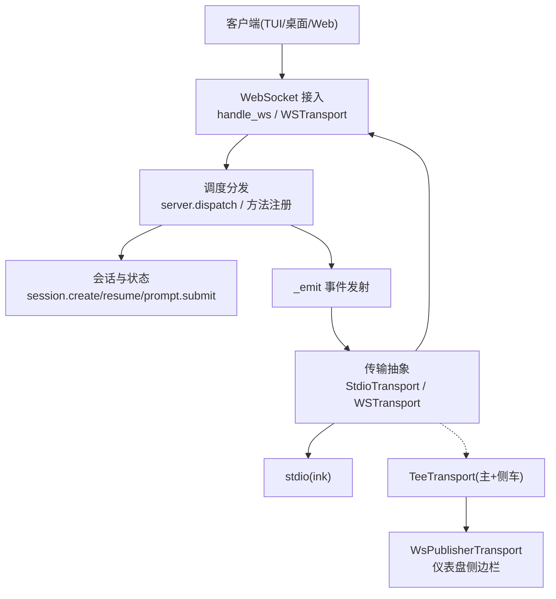
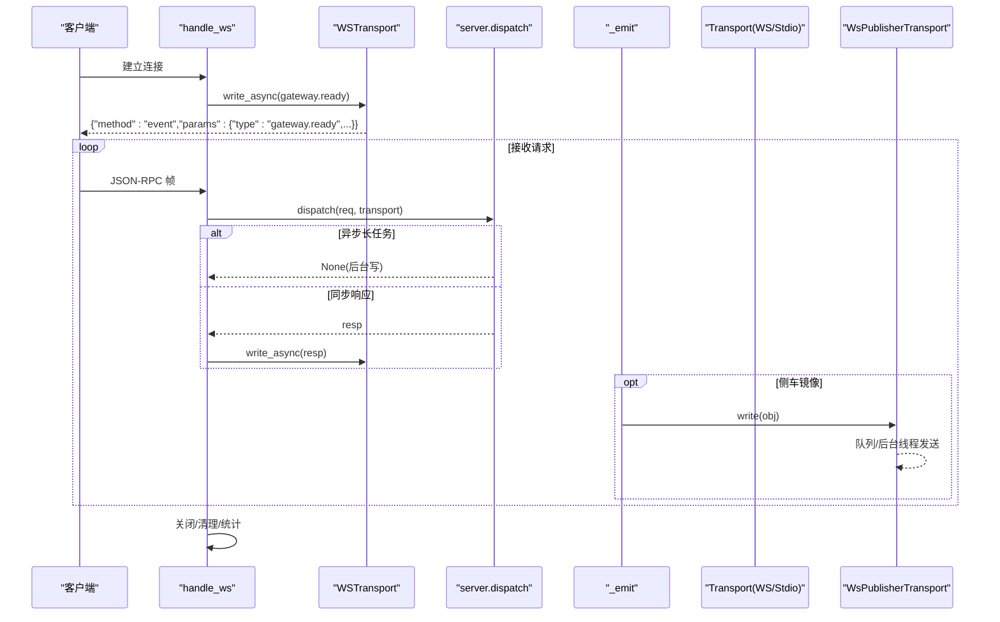
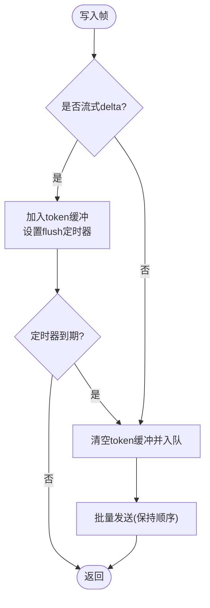
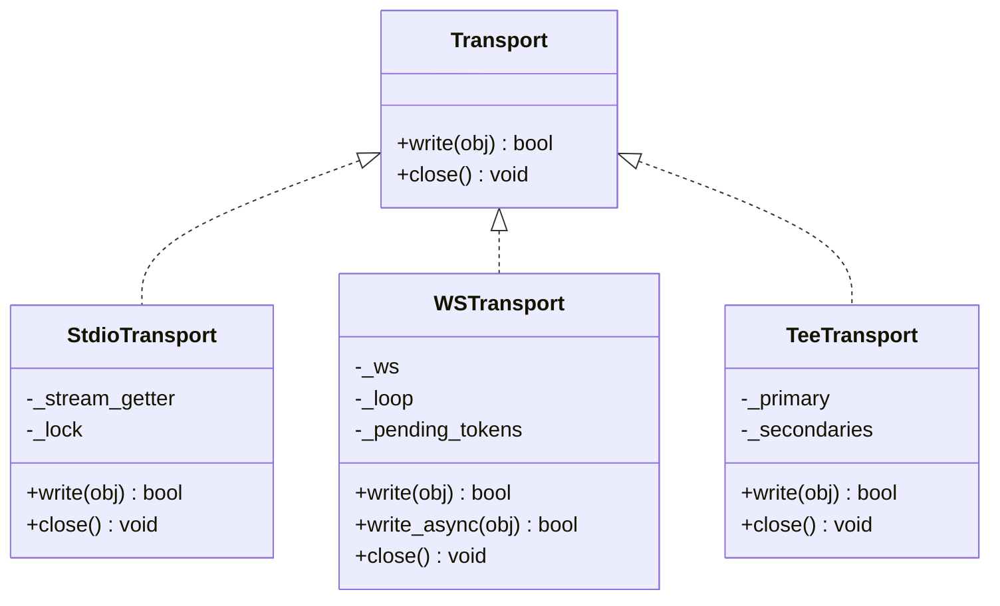
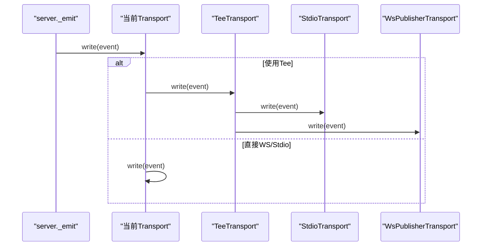
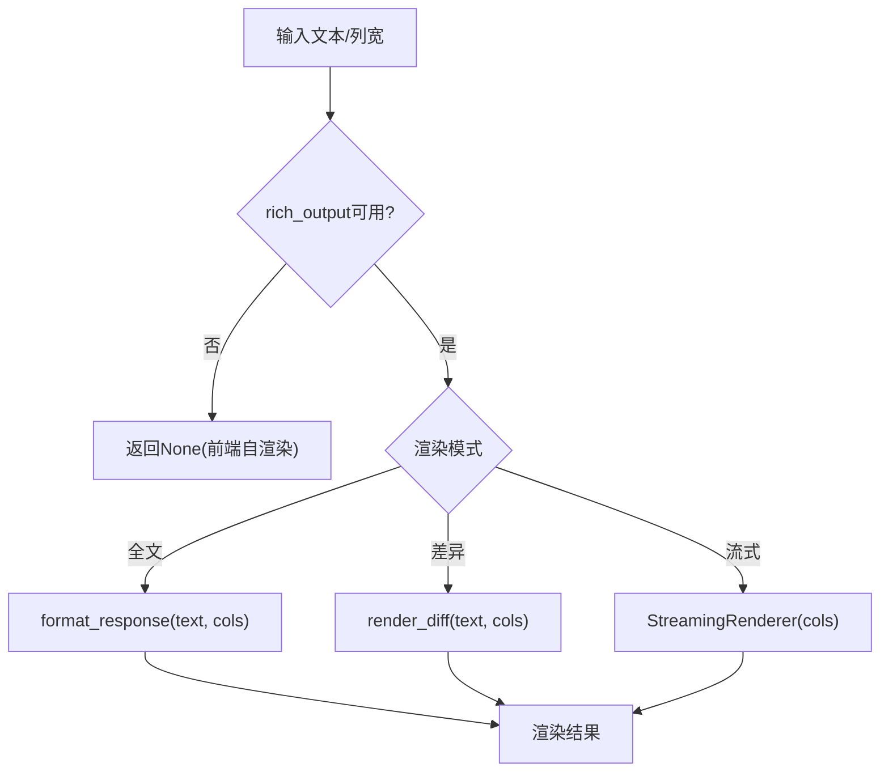
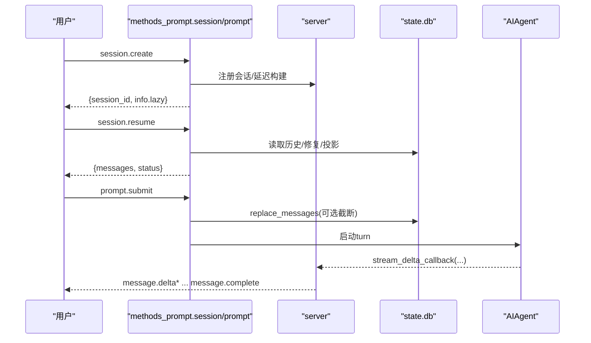
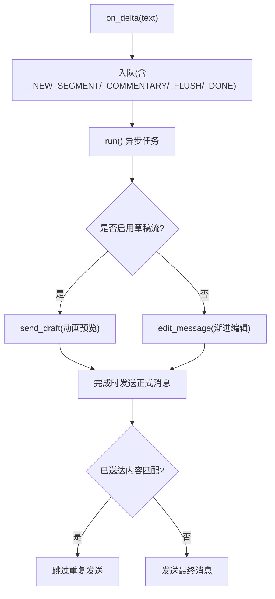
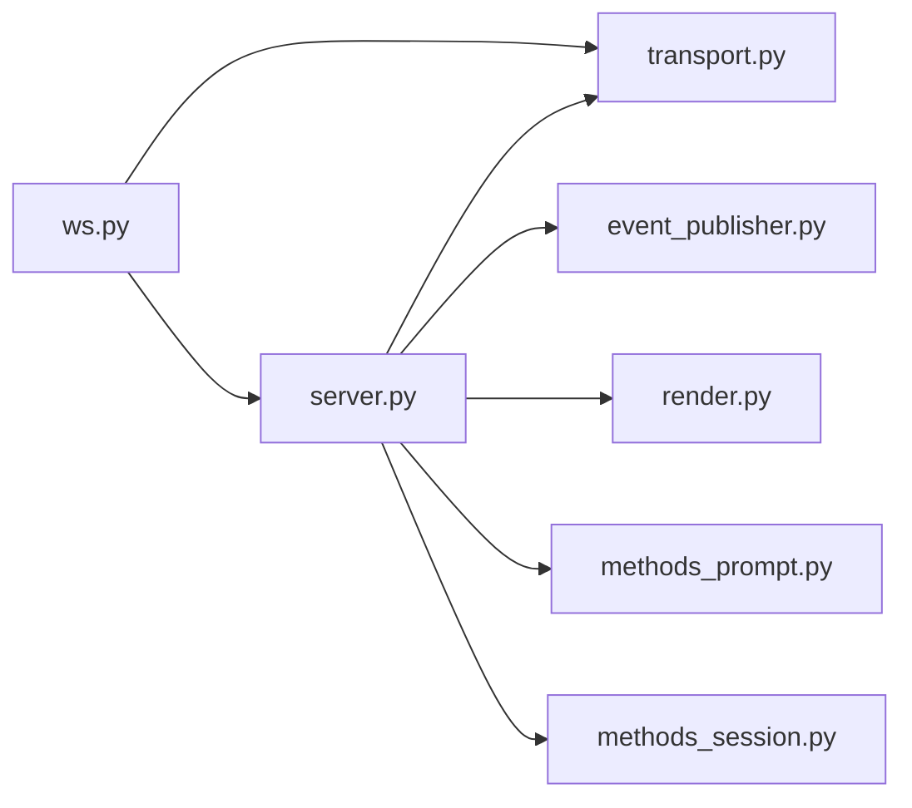

# 事件流式传输

<cite>
**本文引用的文件**
- [server.py](file://tui_gateway/server.py)
- [ws.py](file://tui_gateway/ws.py)
- [transport.py](file://tui_gateway/transport.py)
- [event_publisher.py](file://tui_gateway/event_publisher.py)
- [render.py](file://tui_gateway/render.py)
- [methods_prompt.py](file://tui_gateway/methods_prompt.py)
- [methods_session.py](file://tui_gateway/methods_session.py)
- [stream_consumer.py](file://gateway/stream_consumer.py)
</cite>

## 目录
1. [简介](#简介)
2. [项目结构](#项目结构)
3. [核心组件](#核心组件)
4. [架构总览](#架构总览)
5. [详细组件分析](#详细组件分析)
6. [依赖关系分析](#依赖关系分析)
7. [性能考量](#性能考量)
8. [故障排查指南](#故障排查指南)
9. [结论](#结论)
10. [附录：协议规范与最佳实践](#附录协议规范与最佳实践)

## 简介
本文件面向 TUI 网关的事件流式传输，系统性说明实时事件的发布、订阅与处理机制，覆盖消息渲染、差异计算、增量更新与状态同步；定义事件类型、优先级管理、去重机制与错误恢复；给出连接建立、消息格式与断开处理的完整协议规范；并记录事件监控、性能分析与调试工具，以及事件过滤、路由与聚合策略。

## 项目结构
TUI 网关的事件流由“传输抽象 + WebSocket 接入 + 调度分发 + 渲染桥 + 侧车发布”构成：
- 传输抽象：统一 JSON-RPC 帧的写入接口，支持 stdio 与 WebSocket，并提供 TeeTransport 将同一事件同时投递到主通道与侧车通道。
- WebSocket 接入：实现 WSTransport，负责令牌级流式帧合并、Nagle 优化、超时保护与连接生命周期管理。
- 调度分发：server 模块集中维护会话、RPC 方法注册、长任务线程池、事件发射器 _emit 等。
- 渲染桥：render 模块在 Python 侧调用 rich_output 进行富文本渲染与 diff 生成，供 UI 增量更新。
- 侧车发布：WsPublisherTransport 通过 WebSocket 将事件镜像到仪表盘侧边栏。

图表来源
- [ws.py:286-477](file://tui_gateway/ws.py#L286-L477)
- [transport.py:100-220](file://tui_gateway/transport.py#L100-L220)
- [event_publisher.py:40-127](file://tui_gateway/event_publisher.py#L40-L127)
- [server.py:184-296](file://tui_gateway/server.py#L184-L296)

章节来源
- [ws.py:1-477](file://tui_gateway/ws.py#L1-L477)
- [transport.py:1-220](file://tui_gateway/transport.py#L1-220)
- [event_publisher.py:1-127](file://tui_gateway/event_publisher.py#L1-L127)
- [server.py:1-800](file://tui_gateway/server.py#L1-L800)

## 核心组件
- 传输抽象（Transport）
  - StdioTransport：向 stdout 写入 JSON-RPC 帧，区分“对端消失”与真实 I/O 错误，避免误判退出。
  - WSTransport：按 token 粒度合并高频 delta 帧，保证非流式帧顺序优先，提供 write/write_async/close。
  - TeeTransport：主通道优先，旁路失败不阻塞主路径，用于镜像事件到仪表盘。
- WebSocket 接入
  - handle_ws：接受连接、发送 gateway.ready、解析请求、分派到 server.dispatch、统计指标、断连清理。
  - 流式帧合并：message.delta/reasoning.delta/thinking.delta 进入缓冲，定时批量发送，降低事件循环唤醒开销。
- 调度与事件
  - server._emit：统一事件发射点，携带 session_id，经当前 transport 写出。
  - 长任务线程池：billing/subscription/complete/slash/exec 等慢 RPC 走线程池，避免阻塞读取循环。
- 渲染桥
  - render_message/render_diff/make_stream_renderer：可选地调用 agent.rich_output 进行富文本渲染与流式渲染器构造。
- 侧车发布
  - WsPublisherTransport：后台线程队列化 JSON 帧，失败即置死，不影响主路径。

章节来源
- [transport.py:66-220](file://tui_gateway/transport.py#L66-L220)
- [ws.py:70-256](file://tui_gateway/ws.py#L70-L256)
- [server.py:184-296](file://tui_gateway/server.py#L184-L296)
- [render.py:1-50](file://tui_gateway/render.py#L1-L50)
- [event_publisher.py:40-127](file://tui_gateway/event_publisher.py#L40-L127)

## 架构总览
下图展示从客户端连接到事件落地的端到端流程，包括连接建立、ready 广播、请求分派、流式帧合并与侧车镜像。

图表来源
- [ws.py:286-477](file://tui_gateway/ws.py#L286-L477)
- [transport.py:186-220](file://tui_gateway/transport.py#L186-L220)
- [event_publisher.py:40-127](file://tui_gateway/event_publisher.py#L40-L127)
- [server.py:184-296](file://tui_gateway/server.py#L184-L296)

## 详细组件分析

### WebSocket 传输与流式帧合并
- 令牌级合并：识别 message.delta/reasoning.delta/thinking.delta，放入缓冲，定时器触发批量发送，约 30fps。
- 顺序保证：非流式帧会先清空缓冲再发送，确保控制帧不被延迟。
- 超时保护：write 等待事件循环 flush 超过阈值时不直接关闭连接，避免 GIL 压力导致的假死。
- Nagle 优化：禁用 TCP_NODELAY 以保留小帧即时性（GUI/WS 场景）。

图表来源
- [ws.py:110-226](file://tui_gateway/ws.py#L110-L226)

章节来源
- [ws.py:70-256](file://tui_gateway/ws.py#L70-L256)

### 传输抽象与多路复用
- StdioTransport：序列化后写入 stdout，捕获 BrokenPipe/EOF/特定 errno 判定对端消失，其他异常上抛以便崩溃日志。
- TeeTransport：主通道优先，旁路失败吞掉，防止侧车阻塞主 IO。
- 上下文绑定：通过 contextvar 绑定当前请求的 transport，跨线程安全写出。

图表来源
- [transport.py:66-220](file://tui_gateway/transport.py#L66-L220)

章节来源
- [transport.py:1-220](file://tui_gateway/transport.py#L1-220)

### 事件发射与侧车镜像
- _emit：统一事件发射入口，携带 session_id，经由当前 transport 写出。
- WsPublisherTransport：后台线程队列化 JSON 帧，最大队列长度限制，失败置死，write 非阻塞。

图表来源
- [transport.py:186-220](file://tui_gateway/transport.py#L186-L220)
- [event_publisher.py:40-127](file://tui_gateway/event_publisher.py#L40-L127)

章节来源
- [event_publisher.py:1-127](file://tui_gateway/event_publisher.py#L1-L127)
- [transport.py:186-220](file://tui_gateway/transport.py#L186-L220)

### 渲染桥与差异计算
- render_message：尝试调用 agent.rich_output.format_response 进行富文本渲染，失败回退。
- render_diff：调用 rich_output.render_diff 生成差异视图。
- make_stream_renderer：构造 StreamingRenderer 用于流式增量渲染。

图表来源
- [render.py:10-50](file://tui_gateway/render.py#L10-L50)

章节来源
- [render.py:1-50](file://tui_gateway/render.py#L1-L50)

### 会话与提示提交（状态同步）
- session.create：创建会话记录，延迟构建 AIAgent，返回轻量信息供 UI 预渲染。
- session.resume：冷/懒恢复，加载历史、修复交替、选择显示投影，必要时升级至活跃会话。
- prompt.submit：校验、截断、持久化、启动运行线程，标记 running/inflight，后续通过 _emit 推送 message.start/delta/complete。

图表来源
- [methods_session.py:14-159](file://tui_gateway/methods_session.py#L14-L159)
- [methods_session.py:306-800](file://tui_gateway/methods_session.py#L306-L800)
- [methods_prompt.py:67-367](file://tui_gateway/methods_prompt.py#L67-L367)

章节来源
- [methods_session.py:14-800](file://tui_gateway/methods_session.py#L14-L800)
- [methods_prompt.py:67-367](file://tui_gateway/methods_prompt.py#L67-L367)

### 流式消费者（平台侧增量更新）
GatewayStreamConsumer 将同步回调 on_delta 转为异步编辑，支持：
- 渐进式 editMessageText 或原生草稿流（draft streaming）
- 思考块过滤（think/reasoning 标签）
- 溢出拆分与最终消息去重
- 段边界与新消息通知

图表来源
- [stream_consumer.py:156-800](file://gateway/stream_consumer.py#L156-L800)

章节来源
- [stream_consumer.py:1-800](file://gateway/stream_consumer.py#L1-L800)

## 依赖关系分析
- ws.py 依赖 tui_gateway.server 的 dispatch 与皮肤监听；通过 WSTransport 写出事件。
- transport.py 被 server 与 ws 共同使用，提供统一的 write/close 语义。
- event_publisher.py 作为 TeeTransport 的旁路，将事件镜像到仪表盘。
- render.py 为可选依赖，若 rich_output 不可用则回退到前端渲染。
- methods_* 模块通过 method_ctx 注册到 server 的全局调度表。

图表来源
- [ws.py:1-477](file://tui_gateway/ws.py#L1-L477)
- [transport.py:1-220](file://tui_gateway/transport.py#L1-L220)
- [event_publisher.py:1-127](file://tui_gateway/event_publisher.py#L1-L127)
- [render.py:1-50](file://tui_gateway/render.py#L1-L50)
- [methods_prompt.py:1-800](file://tui_gateway/methods_prompt.py#L1-L800)
- [methods_session.py:1-800](file://tui_gateway/methods_session.py#L1-L800)

章节来源
- [ws.py:1-477](file://tui_gateway/ws.py#L1-L477)
- [transport.py:1-220](file://tui_gateway/transport.py#L1-L220)
- [event_publisher.py:1-127](file://tui_gateway/event_publisher.py#L1-L127)
- [render.py:1-50](file://tui_gateway/render.py#L1-L50)
- [methods_prompt.py:1-800](file://tui_gateway/methods_prompt.py#L1-L800)
- [methods_session.py:1-800](file://tui_gateway/methods_session.py#L1-L800)

## 性能考量
- 流式帧合并：将高频 token 帧合并为批次，减少事件循环唤醒与 GIL 竞争。
- 长任务隔离：慢 RPC 走线程池，避免阻塞 stdin/WS 读取循环。
- 旁路降级：TeeTransport 与 WsPublisherTransport 失败不阻塞主路径。
- 网络优化：WS 禁用 Nagle，提升小帧即时性。
- 渲染回退：rich_output 不可用时回退到前端渲染，避免阻塞。

[本节为通用指导，无需具体文件引用]

## 故障排查指南
- 连接与解析错误
  - WS 接收失败/解析失败：handle_ws 记录 parse_errors 并返回标准 JSON-RPC 错误。
  - 发送失败：write 超时或 socket 异常会记录 send_failures 并关闭连接。
- 对端消失
  - StdioTransport 对 EPIPE/ECONNRESET/EBADF/ESHUTDOWN 等视为对端消失，返回 False 触发上层清理。
- 崩溃日志
  - server.py 安装全局与线程异常钩子，将未处理异常写入 tui_gateway_crash.log 并输出到 stderr。
- 侧车失败
  - WsPublisherTransport 写失败置死，后续 write 直接返回 False，不影响主路径。

章节来源
- [ws.py:339-477](file://tui_gateway/ws.py#L339-L477)
- [transport.py:114-180](file://tui_gateway/transport.py#L114-L180)
- [server.py:62-132](file://tui_gateway/server.py#L62-L132)
- [event_publisher.py:72-127](file://tui_gateway/event_publisher.py#L72-L127)

## 结论
TUI 网关通过统一的传输抽象、WebSocket 接入、线程池隔离与流式帧合并，实现了高吞吐、低延迟的事件流式传输。配合渲染桥与侧车镜像，既保证了 Ink/stdio 主路径的稳定性，又提供了仪表盘侧边的实时事件能力。通过严格的错误分类、去重与恢复机制，系统在复杂环境下仍具备良好鲁棒性。

[本节为总结，无需具体文件引用]

## 附录：协议规范与最佳实践

### 连接建立
- 建立 WebSocket 后，服务端立即发送 gateway.ready 事件，包含 skin 与 change_events 标志。
- 客户端应等待 ready 后再发起 session 相关操作。

章节来源
- [ws.py:286-337](file://tui_gateway/ws.py#L286-L337)

### 消息格式
- 双向均为 newline-delimited JSON-RPC 帧。
- 事件采用 method=event 的帧，params.type 标识事件类型（如 gateway.ready、message.delta、reasoning.delta、thinking.delta）。
- 普通请求/响应遵循 JSON-RPC 2.0 规范。

章节来源
- [ws.py:8-12](file://tui_gateway/ws.py#L8-L12)
- [ws.py:314-326](file://tui_gateway/ws.py#L314-L326)

### 事件类型与优先级
- 高频流式事件：message.delta、reasoning.delta、thinking.delta，进入 token 缓冲合并发送。
- 控制/业务事件：prompt.submit、session.*、error 等，立即刷新，保证顺序与及时性。

章节来源
- [ws.py:44-60](file://tui_gateway/ws.py#L44-L60)
- [ws.py:110-167](file://tui_gateway/ws.py#L110-L167)

### 去重机制
- GatewayStreamConsumer 维护 delivered_final_text 与 has_delivered_text，避免重复发送已完成内容。
- 对多消息溢出场景，使用 stream_ledger 与 segment 状态保证一致性。

章节来源
- [stream_consumer.py:421-491](file://gateway/stream_consumer.py#L421-L491)

### 错误恢复
- 解析错误：返回 -32700 错误码。
- 内部错误：dispatch 异常返回 -32603。
- 对端消失：StdioTransport 返回 False，WS 层记录并关闭。
- 侧车失败：静默降级，不影响主路径。

章节来源
- [ws.py:359-417](file://tui_gateway/ws.py#L359-L417)
- [transport.py:114-180](file://tui_gateway/transport.py#L114-L180)
- [event_publisher.py:72-127](file://tui_gateway/event_publisher.py#L72-L127)

### 事件过滤、路由与聚合
- 过滤：GatewayStreamConsumer 过滤 think/reasoning 标签，避免泄露推理过程。
- 路由：_emit 通过当前 transport 路由到对应客户端；TeeTransport 将事件复制到侧车。
- 聚合：WSTransport 聚合高频 delta 帧；GatewayStreamConsumer 聚合段落与评论消息。

章节来源
- [stream_consumer.py:606-758](file://gateway/stream_consumer.py#L606-L758)
- [transport.py:186-220](file://tui_gateway/transport.py#L186-L220)
- [ws.py:110-226](file://tui_gateway/ws.py#L110-L226)

### 监控与调试
- WS 统计：messages、parse_errors、dispatch_crashes、send_failures、reaped_sessions、detached_sessions。
- 崩溃日志：全局与线程异常钩子写入 tui_gateway_crash.log。
- 调试建议：关注 WS 日志中的 peer 与错误码；检查 sidecar 队列是否堆积；确认 rich_output 可用性。

章节来源
- [ws.py:465-477](file://tui_gateway/ws.py#L465-L477)
- [server.py:62-132](file://tui_gateway/server.py#L62-L132)