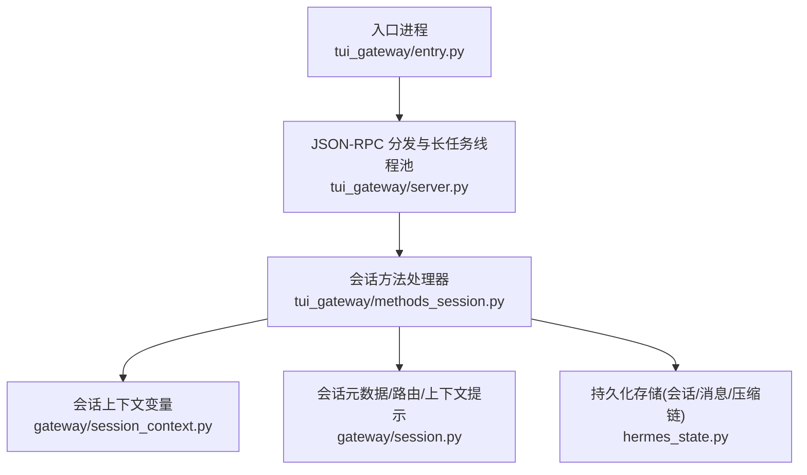
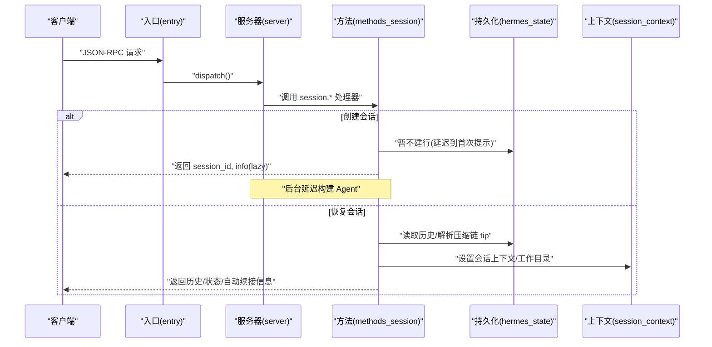
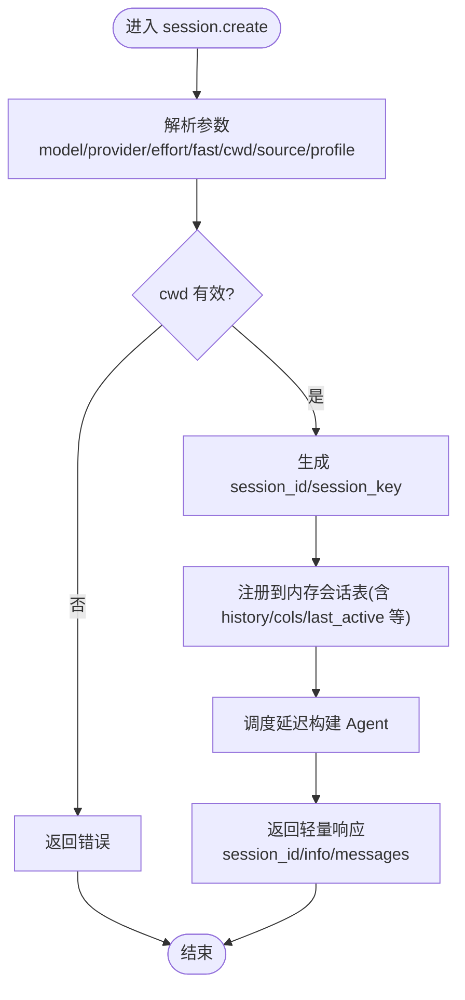
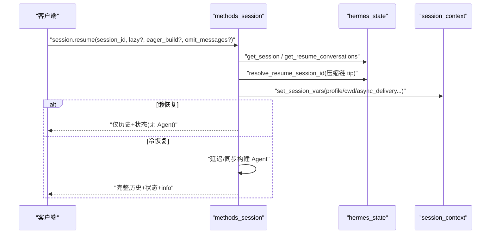
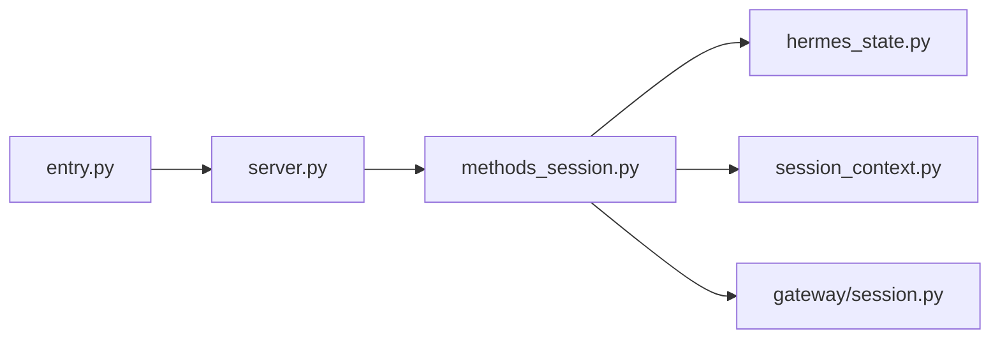

# 会话管理

<cite>
**本文引用的文件**
- [tui_gateway/entry.py](file://tui_gateway/entry.py)
- [tui_gateway/server.py](file://tui_gateway/server.py)
- [tui_gateway/methods_session.py](file://tui_gateway/methods_session.py)
- [gateway/session.py](file://gateway/session.py)
- [gateway/session_context.py](file://gateway/session_context.py)
- [hermes_state.py](file://hermes_state.py)
</cite>

## 目录
1. [简介](#简介)
2. [项目结构](#项目结构)
3. [核心组件](#核心组件)
4. [架构总览](#架构总览)
5. [详细组件分析](#详细组件分析)
6. [依赖关系分析](#依赖关系分析)
7. [性能考量](#性能考量)
8. [故障排查指南](#故障排查指南)
9. [结论](#结论)
10. [附录：API 参考](#附录api-参考)

## 简介
本文件面向 TUI 网关的“会话管理”能力，系统性说明会话的创建、恢复、切换、分支与压缩（续写）等关键流程；覆盖会话状态管理、上下文保持、数据持久化与恢复机制；提供会话列表查询、活动会话控制、会话间通信与资源共享；并给出完整的 API 参考（参数与返回值）、安全与权限隔离、监控统计与性能优化建议。

## 项目结构
TUI 网关通过 JSON-RPC 方法暴露会话管理能力，核心由入口进程、调度与线程池、会话内存态、持久化存储（SQLite）以及上下文变量系统组成。

图表来源
- [tui_gateway/entry.py:421-486](file://tui_gateway/entry.py#L421-L486)
- [tui_gateway/server.py:184-296](file://tui_gateway/server.py#L184-L296)
- [tui_gateway/methods_session.py:14-159](file://tui_gateway/methods_session.py#L14-L159)
- [gateway/session_context.py:206-311](file://gateway/session_context.py#L206-L311)
- [gateway/session.py:148-346](file://gateway/session.py#L148-L346)
- [hermes_state.py:1-16](file://hermes_state.py#L1-L16)

章节来源
- [tui_gateway/entry.py:421-486](file://tui_gateway/entry.py#L421-L486)
- [tui_gateway/server.py:184-296](file://tui_gateway/server.py#L184-L296)

## 核心组件
- 入口与事件循环：负责启动、侧车发布、信号处理、标准输入输出循环与错误日志落盘。
- 会话方法层：实现 session.create/resume/list/branch/compress/activate/delete/title/cwd/workspace.move 等 RPC。
- 会话上下文：以 ContextVar 维护并发安全的会话标识、平台、工作目录、异步投递能力等。
- 会话元数据与提示构建：描述来源、连接平台、家庭频道、动态注入系统提示片段。
- 持久化存储：SQLite WAL 模式，支持全文检索、会话拆分（压缩续写链）、安全限制（最大恢复条数）。

章节来源
- [tui_gateway/entry.py:48-65](file://tui_gateway/entry.py#L48-L65)
- [tui_gateway/methods_session.py:14-159](file://tui_gateway/methods_session.py#L14-L159)
- [gateway/session_context.py:206-311](file://gateway/session_context.py#L206-L311)
- [gateway/session.py:479-746](file://gateway/session.py#L479-L746)
- [hermes_state.py:1-16](file://hermes_state.py#L1-L16)

## 架构总览
TUI 网关采用“轻量即时响应 + 延迟构建”的会话模型：session.create 立即返回 UI 所需的最小信息，后台再构建 Agent；session.resume 支持懒加载与冷启动两种路径，避免阻塞前端；长耗时方法通过线程池执行，保证快速路径不被阻塞。

图表来源
- [tui_gateway/entry.py:421-486](file://tui_gateway/entry.py#L421-L486)
- [tui_gateway/server.py:184-296](file://tui_gateway/server.py#L184-L296)
- [tui_gateway/methods_session.py:14-159](file://tui_gateway/methods_session.py#L14-L159)
- [tui_gateway/methods_session.py:306-807](file://tui_gateway/methods_session.py#L306-L807)
- [gateway/session_context.py:206-311](file://gateway/session_context.py#L206-L311)
- [hermes_state.py:114-125](file://hermes_state.py#L114-L125)

## 详细组件分析

### 会话创建（session.create）
- 功能要点
  - 生成临时 UI session_id 与持久化 session_key。
  - 支持分支创建（parent_session_id），用于在现有对话基础上分叉。
  - 支持 per-session 的 model/provider/reasoning_effort/fast 覆盖。
  - 工作目录 cwd 校验与解析，必要时记录 explicit_cwd。
  - 延迟构建 Agent，先返回最小可用信息给 UI。
  - 注册到内存会话表，后续首次提示或 AIAgent 首次写入时再建库行。
- 关键行为
  - 不立即持久化 DB 行，避免“未使用草稿”污染列表。
  - 返回 info 包含模型、工具/技能占位、cwd、git branch、project、lazy 标志等。
- 异常与边界
  - 非法 cwd、不可用 profile_home 等会返回相应错误码。
  - 并发保护：会话字典更新受锁保护。

图表来源
- [tui_gateway/methods_session.py:14-159](file://tui_gateway/methods_session.py#L14-L159)

章节来源
- [tui_gateway/methods_session.py:14-159](file://tui_gateway/methods_session.py#L14-L159)

### 会话恢复（session.resume）
- 功能要点
  - 支持懒恢复（watch/lazy）与冷恢复（完整历史+Agent 预热）。
  - 自动解析压缩续写链，将旧 ID 重定向到最新 tip，避免“压缩后回复丢失”。
  - 支持 omit_messages 减少首屏负载；eager_build 强制同步构建。
  - 恢复时设置会话上下文（平台、用户、工作目录、profile 等）。
  - 双检锁复用已存在活会话，避免重复构建。
- 关键行为
  - 安全限制：按配置限制可恢复的消息数量，防止超大会话拖垮前端。
  - 显示历史与模型历史分离：显示保留全部，模型历史清理中断尾以避免死循环。
  - 自动续接：必要时返回 auto_continue 指示。
- 异常与边界
  - 数据库不可用、会话不存在、超时或过大等错误均有明确返回。

图表来源
- [tui_gateway/methods_session.py:306-807](file://tui_gateway/methods_session.py#L306-L807)
- [gateway/session_context.py:206-311](file://gateway/session_context.py#L206-L311)
- [hermes_state.py:114-125](file://hermes_state.py#L114-L125)

章节来源
- [tui_gateway/methods_session.py:306-807](file://tui_gateway/methods_session.py#L306-L807)
- [gateway/session_context.py:206-311](file://gateway/session_context.py#L206-L311)
- [hermes_state.py:114-125](file://hermes_state.py#L114-L125)

### 会话列表与最近会话（session.list / session.most_recent）
- 功能要点
  - 列出用户可见的历史会话，过滤内部来源（如 tool/kanban）。
  - most_recent 返回最近一个人类可见会话，供自动恢复使用。
  - 支持 profile 作用域，跨 profile 查询对应 state.db。
- 关键行为
  - 适度超取（over-fetch）以补偿过滤后的不足。
  - 压缩合并投影，确保列表展示稳定。

章节来源
- [tui_gateway/methods_session.py:162-260](file://tui_gateway/methods_session.py#L162-L260)

### 活动会话控制（session.active_list / session.activate）
- 功能要点
  - active_list 返回当前进程内可切换的活跃会话快照（排除正在 teardown 的会话）。
  - activate 将前端切换到指定 live session，返回其状态与可选历史。
- 关键行为
  - 过滤 finalized 标记，避免显示“半死亡”会话。
  - 支持 omit_messages 控制是否携带历史。

章节来源
- [tui_gateway/methods_session.py:909-969](file://tui_gateway/methods_session.py#L909-L969)

### 工作区与工作目录（session.cwd.set / session.workspace.move）
- 功能要点
  - session.cwd.set 修改运行中会话的工作目录（需空闲）。
  - session.workspace.move 修改持久化会话的工作目录（可无 Agent），同时更新 git 元信息。
- 关键行为
  - 移动时若存在活会话且非忙碌，则同步更新运行时 cwd。
  - 变更后立即广播 session.info 事件。

章节来源
- [tui_gateway/methods_session.py:810-906](file://tui_gateway/methods_session.py#L810-L906)

### 标题与会话元信息（session.title）
- 功能要点
  - 读取或设置会话标题；若无持久化行，显式设置标题时会提前建行。
  - pending 标题在首次提示或成功写入后被清除。
- 关键行为
  - 失败回退到队列策略，避免标题丢失。

章节来源
- [tui_gateway/methods_session.py:1022-1103](file://tui_gateway/methods_session.py#L1022-L1103)

### 删除会话（session.delete）
- 功能要点
  - 删除持久化会话及其转录文件；禁止删除当前活跃的会话。
  - 支持 profile 作用域，删除对应 profile 下的 sessions 目录内容。
- 关键行为
  - 并发安全：快照 _sessions 后再判断是否活跃。

章节来源
- [tui_gateway/methods_session.py:972-1019](file://tui_gateway/methods_session.py#L972-L1019)

### 分支与压缩（session.branch / session.compress）
- 说明
  - 分支：在创建会话时通过 parent_session_id 建立父子关系，便于列表嵌套与追踪。
  - 压缩：当会话过长时触发压缩，产生续写子会话；resume 会自动解析压缩链至最新 tip。
- 关键点
  - 压缩期间会持有锁并可能迁移活动会话租约，确保续写后仍占用配额。
  - resume 路径对压缩链进行透明跳转，避免“压缩后回复缺失”问题。

章节来源
- [tui_gateway/methods_session.py:14-159](file://tui_gateway/methods_session.py#L14-L159)
- [tui_gateway/methods_session.py:306-807](file://tui_gateway/methods_session.py#L306-L807)
- [hermes_state.py:1-16](file://hermes_state.py#L1-L16)

### 上下文保持与隔离（ContextVar）
- 功能要点
  - 使用 contextvars 保存会话平台、聊天ID、用户、工作目录、异步投递能力等。
  - 提供 set_session_vars/clear_session_vars/reset_session_vars 等接口。
  - 区分“会话级 ID”和“UI 窗口 ID”，避免多窗口竞争。
- 关键行为
  - 子代理/委托场景下避免泄漏父会话 ID 到进程环境。
  - 针对一次性/无状态通道禁用异步投递，避免结果无法送达。

章节来源
- [gateway/session_context.py:206-311](file://gateway/session_context.py#L206-L311)
- [gateway/session_context.py:363-496](file://gateway/session_context.py#L363-L496)

### 会话元数据与动态系统提示
- 功能要点
  - 根据来源平台、连接平台、家庭频道等构建动态系统提示片段。
  - 支持 PII 脱敏（哈希用户/聊天 ID），并在不同平台注入差异化行为提示。
- 关键行为
  - 对 Slack/Discord 等平台的能力检测，仅在工具实际可用时声明能力。

章节来源
- [gateway/session.py:148-346](file://gateway/session.py#L148-L346)
- [gateway/session.py:479-746](file://gateway/session.py#L479-L746)

### 数据持久化与恢复
- 功能要点
  - SQLite WAL 模式，支持并发读与单写。
  - FTS5 全文检索，支持跨会话消息搜索。
  - 会话压缩产生的父子链通过 parent_session_id 关联，resume 可自动定位 tip。
  - 安全限制：最大恢复/导出消息数可配置，防止超大会话导致崩溃。
- 关键行为
  - 会话行延迟创建，首次提示或显式标题写入时建行。
  - 压缩期间加锁，避免并发冲突。

章节来源
- [hermes_state.py:1-16](file://hermes_state.py#L1-L16)
- [hermes_state.py:114-125](file://hermes_state.py#L114-L125)
- [hermes_state.py:160-200](file://hermes_state.py#L160-L200)

## 依赖关系分析
- 入口进程依赖 server 的 dispatch/write_json，并通过 entry 安装侧车发布器与信号处理。
- server 定义长任务线程池与 _LONG_HANDLERS，将慢方法分流，保障快速路径。
- methods_session 依赖 hermes_state 做持久化，依赖 session_context 做上下文绑定。
- gateway/session 提供会话元数据与动态提示，被 TUI 网关消费。

图表来源
- [tui_gateway/entry.py:421-486](file://tui_gateway/entry.py#L421-L486)
- [tui_gateway/server.py:184-296](file://tui_gateway/server.py#L184-L296)
- [tui_gateway/methods_session.py:14-159](file://tui_gateway/methods_session.py#L14-L159)
- [gateway/session.py:148-346](file://gateway/session.py#L148-L346)
- [gateway/session_context.py:206-311](file://gateway/session_context.py#L206-L311)
- [hermes_state.py:1-16](file://hermes_state.py#L1-L16)

章节来源
- [tui_gateway/server.py:184-296](file://tui_gateway/server.py#L184-L296)

## 性能考量
- 延迟构建：session.create 与 session.resume（默认）均延迟构建 Agent，降低首屏延迟。
- 长任务分流：将耗时方法列入 _LONG_HANDLERS，使用线程池执行，避免阻塞主循环。
- 会话容量控制：resume 限制最大恢复消息数，避免超大会话拖垮前端。
- 压缩续写：长会话自动压缩为子会话，减少上下文膨胀。
- 并发安全：会话字典与历史访问使用锁保护，避免竞态。
- 资源回收：WS 断开后延迟回收孤儿会话，避免进程泄漏。

[本节为通用性能讨论，无需特定文件引用]

## 故障排查指南
- 常见错误码
  - 4006/4007：缺少必要参数或会话不存在。
  - 4009：会话忙（进行中不可操作）。
  - 4016/4017：工作目录无效或不存在。
  - 4130：会话过大，超过恢复限制。
  - 5000/5006/5007：数据库不可用或操作失败。
- 排查步骤
  - 检查 session.resume 是否命中压缩链 tip（避免“压缩后回复缺失”）。
  - 确认 session.cwd.set / workspace.move 前会话是否空闲。
  - 查看 crash log 与 stderr 输出，定位未捕获异常。
  - 核对 session_context 是否正确设置（平台、工作目录、异步投递能力）。
  - 验证 hermes_state 的恢复限制配置是否合理。

章节来源
- [tui_gateway/methods_session.py:810-906](file://tui_gateway/methods_session.py#L810-L906)
- [tui_gateway/methods_session.py:972-1019](file://tui_gateway/methods_session.py#L972-L1019)
- [tui_gateway/methods_session.py:306-807](file://tui_gateway/methods_session.py#L306-L807)
- [hermes_state.py:114-125](file://hermes_state.py#L114-L125)

## 结论
TUI 网关的会话管理以“轻量即时响应 + 延迟构建”为核心，结合上下文变量与持久化存储，实现了高可用、可扩展的会话生命周期管理。通过压缩续写、容量限制与并发保护，系统在大规模使用中保持稳定与高效。配合完善的 API 与安全隔离，满足多平台、多用户的复杂交互需求。

[本节为总结性内容，无需特定文件引用]

## 附录：API 参考
以下列出与 TUI 网关会话管理相关的主要 JSON-RPC 方法、参数与返回值要点。所有方法均以 JSON-RPC 形式调用，返回统一信封 {ok/error, id, result}。

- session.create
  - 参数
    - messages: 初始消息历史（可选）
    - title: 会话标题（可选）
    - parent_session_id: 父会话 ID，用于分支（可选）
    - cwd: 工作目录（可选，需为有效目录）
    - source: 来源标识（可选）
    - profile: 应用全局远程模式下的 profile（可选）
    - model/provider/reasoning_effort/fast: per-session 覆盖（可选）
  - 返回
    - session_id: 临时 UI 会话 ID
    - stored_session_id: 持久化 session_key
    - message_count/messages: 初始消息计数与内容
    - info: 包含 model/provider/tools/skills/cwd/branch/project/lazy/desktop_contract/profile_name 等

- session.list
  - 参数
    - limit: 返回数量上限（默认 200）
    - profile: 目标 profile（可选）
  - 返回
    - sessions: 数组，每项包含 id/title/preview/started_at/message_count/source

- session.most_recent
  - 参数
    - profile: 目标 profile（可选）
  - 返回
    - session_id/title/started_at/source 或 null

- session.resume
  - 参数
    - session_id: 目标会话 ID 或标题
    - lazy: 懒恢复（仅历史，不构建 Agent）
    - eager_build: 强制同步构建 Agent
    - omit_messages: 不返回历史以减少首屏负载
    - profile: 目标 profile（可选）
  - 返回
    - session_id/resumed: 临时 UI ID 与原始持久化 key
    - message_count/messages/messages_omitted
    - info: 会话信息（model/provider/cwd/branch/project 等）
    - running/status: 运行状态
    - auto_continue: 自动续接信息（可选）

- session.active_list
  - 参数
    - current_session_id: 当前聚焦会话（可选）
  - 返回
    - sessions: 当前进程内可切换的活跃会话列表

- session.activate
  - 参数
    - session_id: 要激活的会话 ID
    - omit_messages: 是否省略历史
  - 返回
    - 会话状态与可选历史

- session.cwd.set
  - 参数
    - session_id: 会话 ID
    - cwd: 新工作目录
  - 返回
    - info: 包含 cwd/branch/project 等

- session.workspace.move
  - 参数
    - session_key: 持久化会话 key
    - cwd: 新工作目录
  - 返回
    - cwd/branch/git_repo_root

- session.delete
  - 参数
    - session_id: 要删除的会话 ID
    - profile: 目标 profile（可选）
  - 返回
    - deleted: 被删除的会话 key

- session.title
  - 参数
    - session_id: 会话 ID
    - title: 新标题（可选，缺省时读取）
  - 返回
    - title/pending: 标题与是否待持久化

- handoff.request / handoff.state / handoff.fail
  - 功能：请求/查询/标记会话转交到消息平台的状态
  - 返回：queued/state/platform/home_name/error 等

- llm.oneshot
  - 功能：无状态的单次 LLM 请求（模板/指令/输入/变量/任务/温度/最大 token）
  - 返回：text

- session.usage / session.context_breakdown
  - 功能：会话用量与上下文分解统计
  - 返回：calls/input/output/total/context_max/context_percent/context_used/estimated_total/model/categories 等

- message.react
  - 功能：为消息添加/移除表情反应
  - 参数：row_id/newest_role/emoji/author
  - 返回：row_id/reactions

安全与权限
- 会话来源与平台隔离：通过 SessionSource 与 platform_registry 识别来源，避免误路由。
- PII 脱敏：在系统提示中对用户/聊天 ID 进行哈希，减少敏感信息泄露。
- 工作目录校验：严格校验 cwd 有效性，防止越权访问。
- 恢复限制：通过配置限制最大恢复消息数，防止超大会话攻击。
- 上下文隔离：使用 ContextVar 保证并发安全，避免会话信息泄漏。

监控与统计
- 用量统计：session.usage 提供调用次数、输入/输出 token、总量等。
- 上下文分解：session.context_breakdown 提供上下文构成与占比。
- 活动会话：session.active_list 提供当前可切换会话清单。
- 健康与崩溃：入口进程记录崩溃日志与信号信息，便于排障。

[本节为 API 参考汇总，具体字段以各方法实现为准]