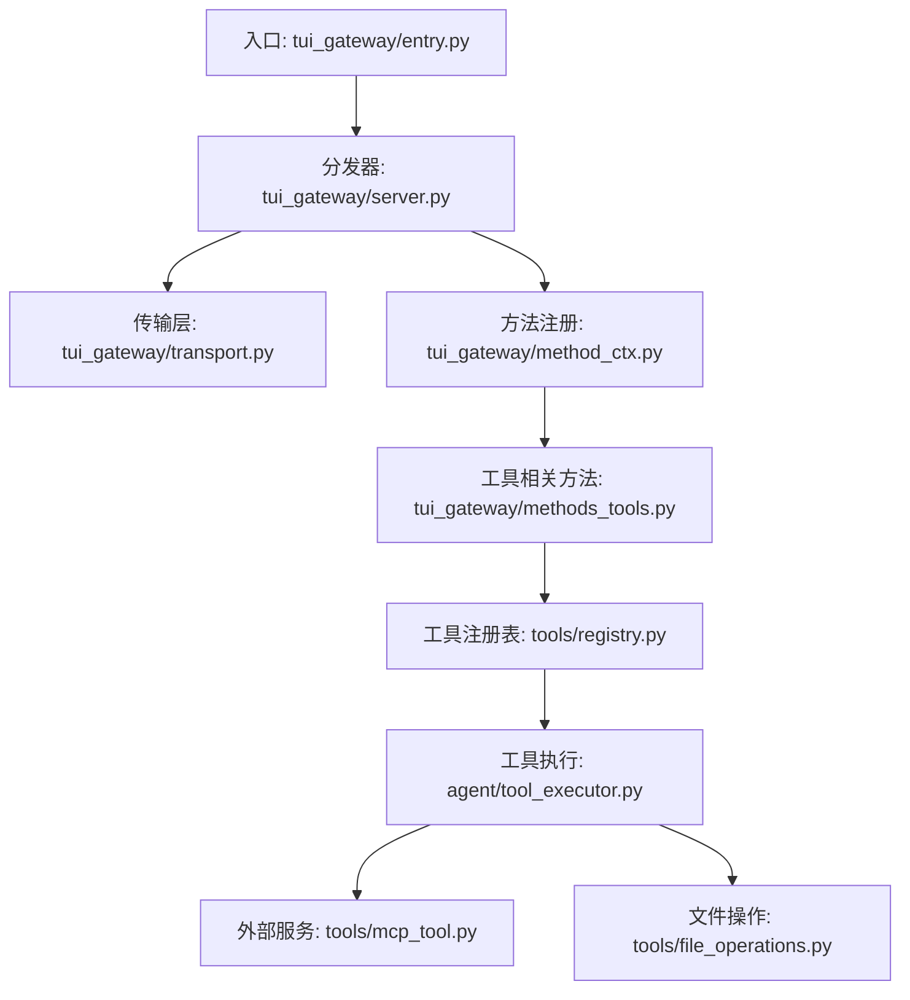
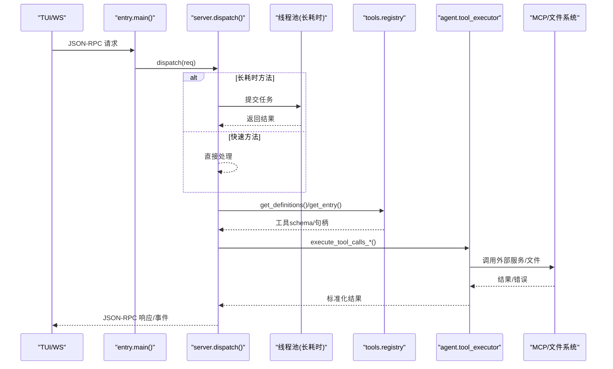
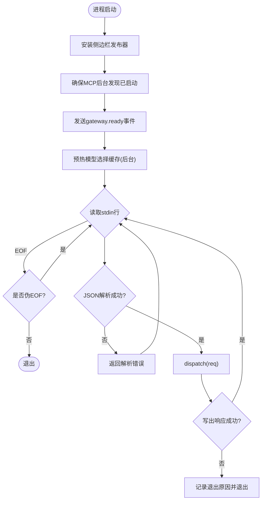
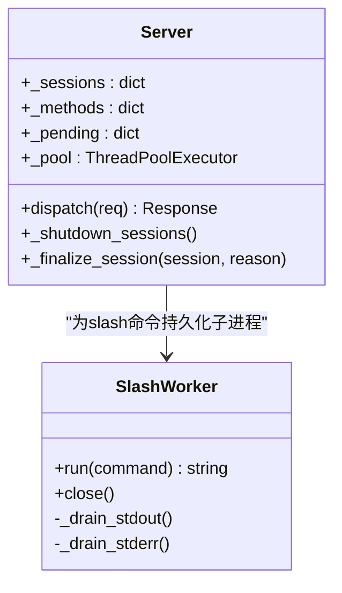
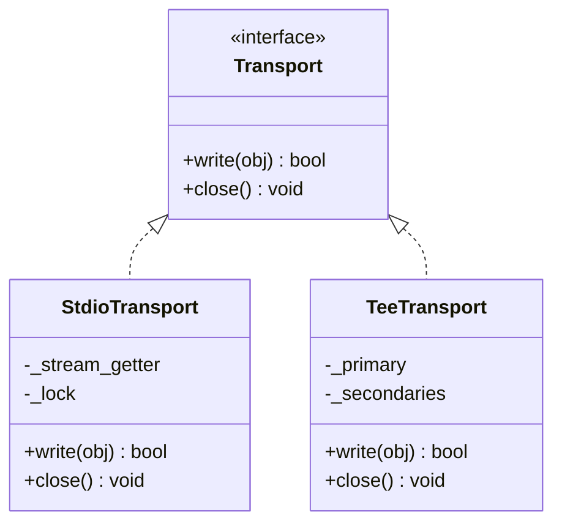
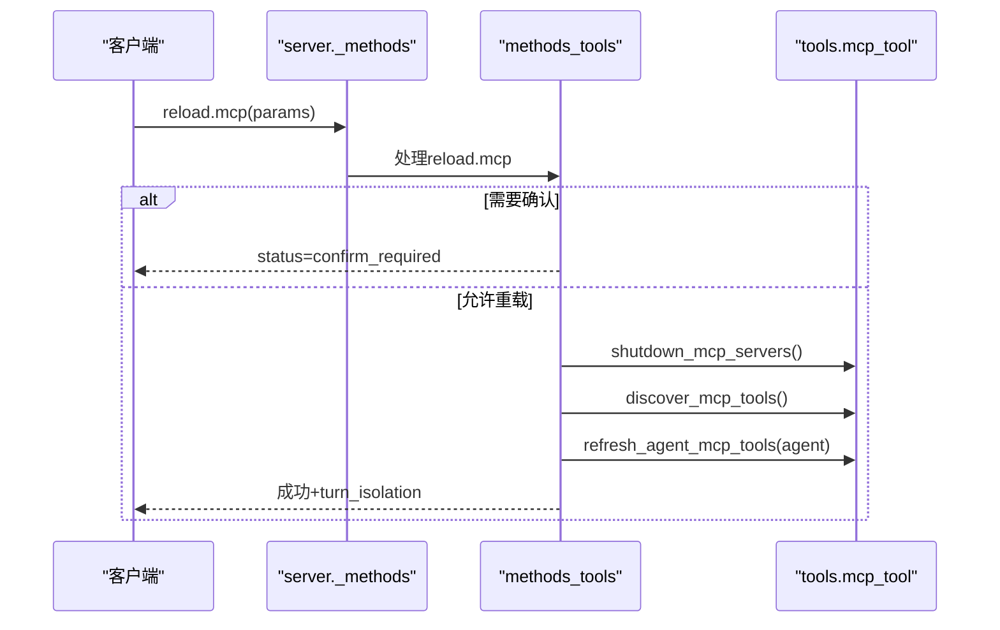
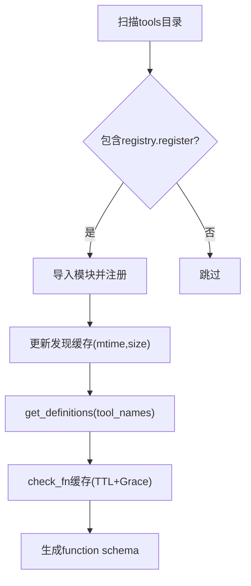
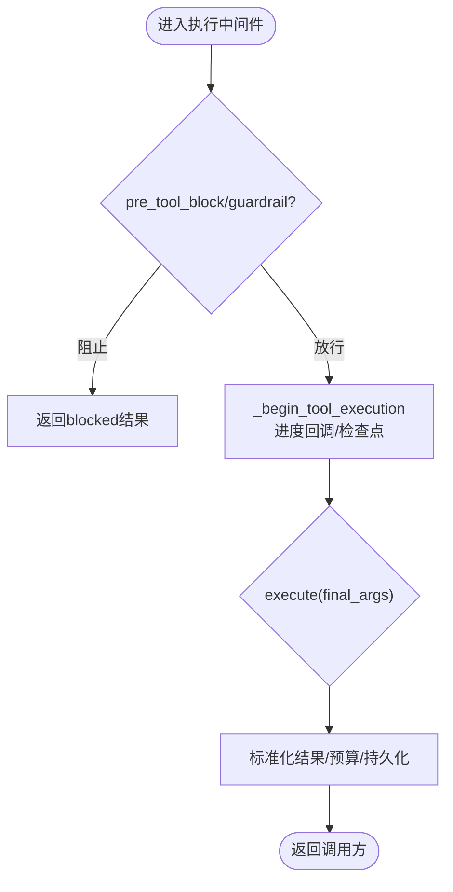
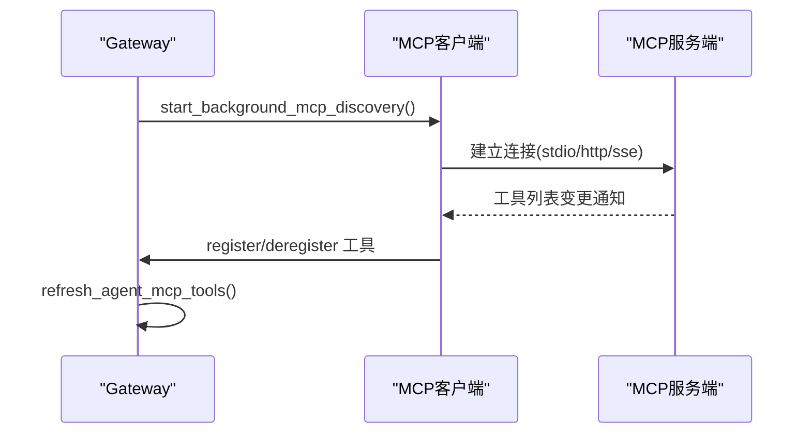
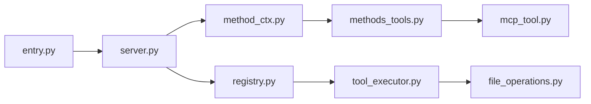

# 工具执行

<cite>
**本文引用的文件**
- [tui_gateway/entry.py](file://tui_gateway/entry.py)
- [tui_gateway/server.py](file://tui_gateway/server.py)
- [tui_gateway/method_ctx.py](file://tui_gateway/method_ctx.py)
- [tui_gateway/methods_tools.py](file://tui_gateway/methods_tools.py)
- [tui_gateway/transport.py](file://tui_gateway/transport.py)
- [tools/registry.py](file://tools/registry.py)
- [agent/tool_executor.py](file://agent/tool_executor.py)
- [tools/mcp_tool.py](file://tools/mcp_tool.py)
- [tools/file_operations.py](file://tools/file_operations.py)
</cite>

## 目录
1. [简介](#简介)
2. [项目结构](#项目结构)
3. [核心组件](#核心组件)
4. [架构总览](#架构总览)
5. [详细组件分析](#详细组件分析)
6. [依赖关系分析](#依赖关系分析)
7. [性能考虑](#性能考虑)
8. [故障排查指南](#故障排查指南)
9. [结论](#结论)
10. [附录：接口规范与调用模式](#附录接口规范与调用模式)

## 简介
本文件面向 TUI 网关的工具执行子系统，系统性说明工具的发现、注册、调用与执行流程，覆盖参数校验、结果处理、错误恢复、进度跟踪；并涵盖文件操作、终端执行、网络请求与外部服务集成（MCP）。同时给出同步/异步调用模式、权限控制与安全沙箱、资源限制、性能监控、缓存策略与错误诊断方法。

## 项目结构
TUI 网关通过 JSON-RPC 接收前端指令，将“慢”处理器路由到线程池以避免阻塞主循环；工具定义由集中式注册表维护，支持内置工具与 MCP 动态工具；工具执行在 agent 层完成，具备并发调度、预算控制、中间件拦截与进度上报。

**图表来源**
- [tui_gateway/entry.py:421-486](file://tui_gateway/entry.py#L421-L486)
- [tui_gateway/server.py:184-295](file://tui_gateway/server.py#L184-L295)
- [tui_gateway/method_ctx.py:21-53](file://tui_gateway/method_ctx.py#L21-L53)
- [tui_gateway/methods_tools.py:84-231](file://tui_gateway/methods_tools.py#L84-L231)
- [tools/registry.py:414-764](file://tools/registry.py#L414-L764)
- [agent/tool_executor.py:758-800](file://agent/tool_executor.py#L758-L800)
- [tools/mcp_tool.py:1-95](file://tools/mcp_tool.py#L1-L95)
- [tools/file_operations.py:1-56](file://tools/file_operations.py#L1-L56)

**章节来源**
- [tui_gateway/entry.py:421-486](file://tui_gateway/entry.py#L421-L486)
- [tui_gateway/server.py:184-295](file://tui_gateway/server.py#L184-L295)

## 核心组件
- 入口与事件循环：负责启动、信号处理、MCP 后台发现、JSON-RPC 读取与响应写入。
- 服务器与分发：维护会话、方法映射、长耗时方法线程池、异常与崩溃日志。
- 传输抽象：统一 stdio/WebSocket 输出，屏蔽对端断开与 flush 阻塞风险。
- 方法注册：以装饰器延迟注册 handler，安装时绑定 server 全局上下文。
- 工具注册表：集中管理工具元数据、可用性检查、schema 生成与并发安全快照。
- 工具执行：顺序/并发调度、中间件链、授权门控、预算与结果持久化、进度回调。
- 外部集成：MCP 客户端（stdio/http/sse）动态发现与注册；文件操作封装与写路径白名单。

**章节来源**
- [tui_gateway/entry.py:48-486](file://tui_gateway/entry.py#L48-L486)
- [tui_gateway/server.py:62-295](file://tui_gateway/server.py#L62-L295)
- [tui_gateway/transport.py:66-183](file://tui_gateway/transport.py#L66-L183)
- [tui_gateway/method_ctx.py:21-53](file://tui_gateway/method_ctx.py#L21-L53)
- [tools/registry.py:108-159](file://tools/registry.py#L108-L159)
- [agent/tool_executor.py:482-662](file://agent/tool_executor.py#L482-L662)
- [tools/mcp_tool.py:1-95](file://tools/mcp_tool.py#L1-L95)
- [tools/file_operations.py:47-152](file://tools/file_operations.py#L47-L152)

## 架构总览
TUI 网关采用“入口-分发-传输-方法-工具-执行-外部服务”的分层架构。入口仅做协议解析与最小初始化；server 提供 RPC 分发与线程池；methods_* 模块按职责拆分 handler；工具注册表集中维护 schema 与 handler；tool_executor 负责执行策略、中间件、授权与预算；mcp_tool 与 file_operations 等实现具体能力。

**图表来源**
- [tui_gateway/entry.py:421-486](file://tui_gateway/entry.py#L421-L486)
- [tui_gateway/server.py:184-295](file://tui_gateway/server.py#L184-L295)
- [tools/registry.py:717-764](file://tools/registry.py#L717-L764)
- [agent/tool_executor.py:758-800](file://agent/tool_executor.py#L758-L800)
- [tools/mcp_tool.py:1-95](file://tools/mcp_tool.py#L1-L95)

## 详细组件分析

### 入口与事件循环（entry.py）
- 启动流程：安装侧边栏发布器、启动 MCP 后台发现、发送 gateway.ready、预热模型选择缓存。
- 信号处理：捕获 SIGPIPE/SIGTERM/SIGHUP/SIGINT/SIGBREAK，记录堆栈与线程信息，优雅退出并强制超时退出。
- 输入循环：读取 stdin JSON-RPC 行，解析后调用 dispatch，写出响应；处理解析错误与管道断开。
- MCP 发现：后台线程避免阻塞启动；首次构建代理前有限等待已启动的服务器；支持多所有者（entry 与 hermes_cli.mcp_startup）。

**图表来源**
- [tui_gateway/entry.py:48-486](file://tui_gateway/entry.py#L48-L486)

**章节来源**
- [tui_gateway/entry.py:48-486](file://tui_gateway/entry.py#L48-L486)

### 服务器与分发（server.py）
- 异常与崩溃：全局异常钩子与线程异常钩子写入 crash.log 并输出摘要到 stderr。
- 长耗时方法池：将可能阻塞的 RPC（如 slash.exec、shell.exec、reload.mcp、session.* 等）路由到线程池，保持主循环响应性。
- 会话与生命周期：创建/恢复/分支/压缩/结束会话，持久化未刷新消息，触发 on_session_end 钩子，清理 slash worker 与活动会话槽位。
- 配置与显示：加载配置、忙态输入模式、中间助手消息开关、皮肤监听。

**图表来源**
- [tui_gateway/server.py:62-132](file://tui_gateway/server.py#L62-L132)
- [tui_gateway/server.py:184-295](file://tui_gateway/server.py#L184-L295)
- [tui_gateway/server.py:332-466](file://tui_gateway/server.py#L332-L466)
- [tui_gateway/server.py:661-800](file://tui_gateway/server.py#L661-L800)

**章节来源**
- [tui_gateway/server.py:62-132](file://tui_gateway/server.py#L62-L132)
- [tui_gateway/server.py:184-295](file://tui_gateway/server.py#L184-L295)
- [tui_gateway/server.py:332-466](file://tui_gateway/server.py#L332-L466)
- [tui_gateway/server.py:661-800](file://tui_gateway/server.py#L661-L800)

### 传输抽象（transport.py）
- 统一 Transport 协议：write/close，当前请求上下文绑定与重置。
- StdioTransport：序列化 JSON 帧并写入 stdout，区分“对端消失”与真实 I/O 错误，flush 可配置跳过以避免半关闭管道阻塞。
- TeeTransport：主通道优先，旁路次级通道（如 WS 侧边栏），失败不阻断主路径。

**图表来源**
- [tui_gateway/transport.py:66-183](file://tui_gateway/transport.py#L66-L183)
- [tui_gateway/transport.py:186-220](file://tui_gateway/transport.py#L186-L220)

**章节来源**
- [tui_gateway/transport.py:66-183](file://tui_gateway/transport.py#L66-L183)
- [tui_gateway/transport.py:186-220](file://tui_gateway/transport.py#L186-L220)

### 方法注册与工具方法（method_ctx.py / methods_tools.py）
- HandlerRegistry：延迟收集 @method 装饰的函数，install 时绑定 server 全局上下文并注册到 _methods。
- 工具相关方法：系统电池、进程管理、MCP 重载（含确认与计算主机）、环境变量重载、命令目录、cli.exec、command.resolve/dispatch、/queue、/learn、/init、/moa、/focus、/retry、/steer、/goal 等。
- 安全与幂等：MCP 重载需用户确认或配置开关；cli.exec 限制 argv 类型与超时；quick command 使用隔离环境并脱敏输出。

**图表来源**
- [tui_gateway/method_ctx.py:21-53](file://tui_gateway/method_ctx.py#L21-L53)
- [tui_gateway/methods_tools.py:84-231](file://tui_gateway/methods_tools.py#L84-L231)

**章节来源**
- [tui_gateway/method_ctx.py:21-53](file://tui_gateway/method_ctx.py#L21-L53)
- [tui_gateway/methods_tools.py:84-231](file://tui_gateway/methods_tools.py#L84-L231)

### 工具注册表（tools/registry.py）
- 自动发现：扫描 tools/*.py，AST 检测顶层 registry.register 调用，缓存 mtime+size 加速。
- ToolEntry：保存 name、toolset、schema、handler、check_fn、requires_env、is_async、描述、emoji、结果大小上限、动态 schema 覆盖。
- check_fn 缓存：TTL 30s，最近成功后的短暂失败视为抖动，避免工具意外不可用；支持多 profile 作用域。
- 注册/注销：跨 toolset 覆盖需显式 override 且受插件策略约束；注销会清理 toolset 检查与别名。
- Schema 生成：按工具名过滤可用工具，合并动态覆盖，输出 OpenAI function 格式。

**图表来源**
- [tools/registry.py:108-159](file://tools/registry.py#L108-L159)
- [tools/registry.py:201-230](file://tools/registry.py#L201-L230)
- [tools/registry.py:233-387](file://tools/registry.py#L233-L387)
- [tools/registry.py:414-764](file://tools/registry.py#L414-L764)

**章节来源**
- [tools/registry.py:108-159](file://tools/registry.py#L108-L159)
- [tools/registry.py:201-230](file://tools/registry.py#L201-L230)
- [tools/registry.py:233-387](file://tools/registry.py#L233-L387)
- [tools/registry.py:414-764](file://tools/registry.py#L414-L764)

### 工具执行（agent/tool_executor.py）
- 中间件链：apply_tool_request_middleware -> run_tool_execution_middleware -> pre_tool_block/guardrail -> begin_execution -> execute。
- 授权门控：序列化审批提示，排除人类等待时间从批处理截止时间中扣除，防止卡死。
- 并发执行：线程池并行执行工具，限制最大工作线程数，图片生成有独立并发上限。
- 进度与持久化：tool_progress_callback、tool_start_callback、增量持久化工具调用进度，崩溃恢复保留关键状态。
- 结果规范化：仅允许字符串或多模态信封，其他类型转为错误；错误体长度截断。

**图表来源**
- [agent/tool_executor.py:482-662](file://agent/tool_executor.py#L482-L662)
- [agent/tool_executor.py:665-756](file://agent/tool_executor.py#L665-L756)
- [agent/tool_executor.py:758-800](file://agent/tool_executor.py#L758-L800)

**章节来源**
- [agent/tool_executor.py:482-662](file://agent/tool_executor.py#L482-L662)
- [agent/tool_executor.py:665-756](file://agent/tool_executor.py#L665-L756)
- [agent/tool_executor.py:758-800](file://agent/tool_executor.py#L758-L800)

### 外部服务集成（tools/mcp_tool.py）
- 传输方式：stdio（command+args）、HTTP/StreamableHTTP、SSE。
- 生命周期：后台事件循环运行每个 MCP Server Task；连接失败指数退避重试；stderr 重定向到共享日志文件。
- 安全：环境变量过滤、错误消息脱敏、OSV 预检超时保护。
- 动态工具：discover_mcp_tools 将远端工具注册到全局注册表；reload.mcp 支持串行化重载与版本一致性。

**图表来源**
- [tools/mcp_tool.py:1-95](file://tools/mcp_tool.py#L1-L95)
- [tools/mcp_tool.py:134-200](file://tools/mcp_tool.py#L134-L200)
- [tui_gateway/methods_tools.py:84-231](file://tui_gateway/methods_tools.py#L84-L231)

**章节来源**
- [tools/mcp_tool.py:1-95](file://tools/mcp_tool.py#L1-L95)
- [tools/mcp_tool.py:134-200](file://tools/mcp_tool.py#L134-L200)
- [tui_gateway/methods_tools.py:84-231](file://tui_gateway/methods_tools.py#L84-L231)

### 文件操作（tools/file_operations.py）
- 统一 API：基于终端后端 execute() 封装 read/write/patch/search。
- 安全：写路径拒绝列表与白名单前缀；BOM 与换行符检测与保留；终端围栏序列清理。
- 结果：ReadResult/WriteResult 携带内容、尺寸、验证、Lint/LSP 诊断等。

**章节来源**
- [tools/file_operations.py:1-56](file://tools/file_operations.py#L1-L56)
- [tools/file_operations.py:58-152](file://tools/file_operations.py#L58-L152)
- [tools/file_operations.py:158-200](file://tools/file_operations.py#L158-L200)

## 依赖关系分析
- entry.py 依赖 server.py 的 dispatch 与 transport；server.py 依赖 method_ctx 与 methods_* 模块；methods_tools 依赖 tools.mcp_tool、hermes_cli.config 等；registry 被 model_tools 与 tool_executor 引用；tool_executor 依赖 approval、guardrails、budget、display 等。
- 潜在环：通过延迟 import 与 contextvars 解耦；注册表与执行层无直接耦合，通过 schema/handler 间接交互。

**图表来源**
- [tui_gateway/entry.py:421-486](file://tui_gateway/entry.py#L421-L486)
- [tui_gateway/server.py:184-295](file://tui_gateway/server.py#L184-L295)
- [tui_gateway/method_ctx.py:21-53](file://tui_gateway/method_ctx.py#L21-L53)
- [tui_gateway/methods_tools.py:84-231](file://tui_gateway/methods_tools.py#L84-L231)
- [tools/registry.py:414-764](file://tools/registry.py#L414-L764)
- [agent/tool_executor.py:482-662](file://agent/tool_executor.py#L482-L662)
- [tools/file_operations.py:1-56](file://tools/file_operations.py#L1-L56)

**章节来源**
- [tui_gateway/entry.py:421-486](file://tui_gateway/entry.py#L421-L486)
- [tui_gateway/server.py:184-295](file://tui_gateway/server.py#L184-L295)
- [tui_gateway/method_ctx.py:21-53](file://tui_gateway/method_ctx.py#L21-L53)
- [tui_gateway/methods_tools.py:84-231](file://tui_gateway/methods_tools.py#L84-L231)
- [tools/registry.py:414-764](file://tools/registry.py#L414-L764)
- [agent/tool_executor.py:482-662](file://agent/tool_executor.py#L482-L662)
- [tools/file_operations.py:1-56](file://tools/file_operations.py#L1-L56)

## 性能考虑
- 长耗时 RPC 分流：将 billing/subscription/browser/cli/shell/session/* 等慢方法放入线程池，避免阻塞 stdin 读取与 prompt.submit。
- 工具并发：默认最多 8 个工作线程；图片生成并发受限并可配置；批处理授权门控排除人类等待时间。
- 检查函数缓存：check_fn 结果 TTL 30s，最近成功后的短暂失败视为抖动，减少外部探测开销。
- 传输优化：可选禁用 flush 避免半关闭管道阻塞；TeeTransport 保证主路径不受侧边栏影响。
- 发现缓存：工具发现基于文件 mtime+size 缓存，降低扫描成本。

[本节为通用性能建议，无需特定文件引用]

## 故障排查指南
- 崩溃日志：全局异常钩子与线程异常钩子写入 ~/.hermes/logs/tui_gateway_crash.log，并在 stderr 输出摘要。
- 信号处理：SIGPIPE/SIGTERM/SIGHUP/SIGINT/SIGBREAK 记录堆栈与线程信息，优雅退出并设置硬退出定时器。
- 退出原因：当 stdout 管道损坏或写入失败时记录退出原因，便于定位“假崩溃”。
- MCP 问题：stderr 重定向至共享日志；OSV 预检超时保护；连接失败指数退避。
- 工具不可用：check_fn 失败日志与 grace 窗口行为；可通过 reload.mcp 或刷新配置恢复。

**章节来源**
- [tui_gateway/server.py:62-132](file://tui_gateway/server.py#L62-L132)
- [tui_gateway/entry.py:89-171](file://tui_gateway/entry.py#L89-L171)
- [tui_gateway/entry.py:233-252](file://tui_gateway/entry.py#L233-L252)
- [tools/mcp_tool.py:134-200](file://tools/mcp_tool.py#L134-L200)
- [tools/registry.py:233-387](file://tools/registry.py#L233-L387)

## 结论
TUI 网关通过分层架构与严格的资源/权限控制，实现了稳定高效的工具发现、注册、调用与执行。借助线程池、中间件、授权门控与预算机制，系统在并发与可靠性之间取得平衡；MCP 与文件操作扩展了外部集成能力。配合完善的日志、信号处理与传输抽象，提供了良好的可观测性与可维护性。

[本节为总结性内容，无需特定文件引用]

## 附录：接口规范与调用模式

### JSON-RPC 方法与分类
- 系统/进程：system.battery、process.list、process.kill、process.stop
- 配置与环境：reload.mcp、reload.env
- 命令与技能：commands.catalog、command.resolve、command.dispatch、/queue、/learn、/init、/moa、/focus、/retry、/steer、/goal
- CLI 执行：cli.exec（非交互式，捕获输出，超时限制）

**章节来源**
- [tui_gateway/methods_tools.py:14-82](file://tui_gateway/methods_tools.py#L14-L82)
- [tui_gateway/methods_tools.py:84-252](file://tui_gateway/methods_tools.py#L84-L252)
- [tui_gateway/methods_tools.py:255-430](file://tui_gateway/methods_tools.py#L255-L430)
- [tui_gateway/methods_tools.py:371-410](file://tui_gateway/methods_tools.py#L371-L410)
- [tui_gateway/methods_tools.py:432-800](file://tui_gateway/methods_tools.py#L432-L800)

### 同步与异步调用模式
- 同步：大多数 handler 在主线程或线程池中同步返回 JSON-RPC 响应。
- 异步/后台：MCP 发现、模型选择缓存预热、长时间运行的 slash 命令通过后台线程或子进程执行；工具执行支持并发批处理。

**章节来源**
- [tui_gateway/entry.py:255-370](file://tui_gateway/entry.py#L255-L370)
- [tui_gateway/entry.py:421-458](file://tui_gateway/entry.py#L421-L458)
- [tui_gateway/server.py:184-295](file://tui_gateway/server.py#L184-L295)
- [agent/tool_executor.py:758-800](file://agent/tool_executor.py#L758-L800)

### 权限控制与安全沙箱
- 插件覆盖策略：插件替换内置工具需显式 allow_tool_override；注销工具也受同策略约束。
- 写路径限制：文件写操作使用拒绝列表与前缀白名单；敏感系统/凭据文件禁止写入。
- 环境变量隔离：quick command 使用隔离环境；MCP stdio 子进程过滤环境变量。
- 错误脱敏：MCP 错误消息脱敏；工具错误体长度截断。

**章节来源**
- [tools/registry.py:513-711](file://tools/registry.py#L513-L711)
- [tools/file_operations.py:47-152](file://tools/file_operations.py#L47-L152)
- [tools/mcp_tool.py:134-200](file://tools/mcp_tool.py#L134-L200)
- [tools/registry.py:29-68](file://tools/registry.py#L29-L68)

### 资源限制与预算
- 工具输出预算：根据上下文窗口缩放，防止单条工具结果过大导致请求超限。
- 并发限制：最大工作线程数、图片生成并发上限、授权门控锁超时。
- 超时控制：cli.exec 超时、MCP 连接/调用超时、slash worker 超时。

**章节来源**
- [agent/tool_executor.py:78-91](file://agent/tool_executor.py#L78-L91)
- [agent/tool_executor.py:93-111](file://agent/tool_executor.py#L93-L111)
- [tui_gateway/methods_tools.py:371-410](file://tui_gateway/methods_tools.py#L371-L410)
- [tools/mcp_tool.py:1-95](file://tools/mcp_tool.py#L1-L95)

### 进度跟踪与可观测性
- 进度回调：tool_progress_callback、tool_start_callback 上报工具开始与预览。
- 中间件追踪：middleware_trace 记录请求/执行链路。
- 日志与指标：post_tool_call hook、crash.log、stderr 摘要、MCP stderr 共享日志。

**章节来源**
- [agent/tool_executor.py:259-330](file://agent/tool_executor.py#L259-L330)
- [agent/tool_executor.py:665-756](file://agent/tool_executor.py#L665-L756)
- [tui_gateway/server.py:62-132](file://tui_gateway/server.py#L62-L132)
- [tools/mcp_tool.py:134-200](file://tools/mcp_tool.py#L134-L200)