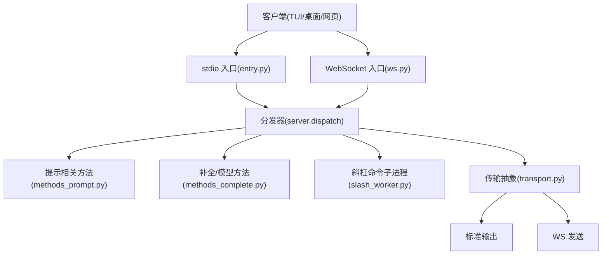
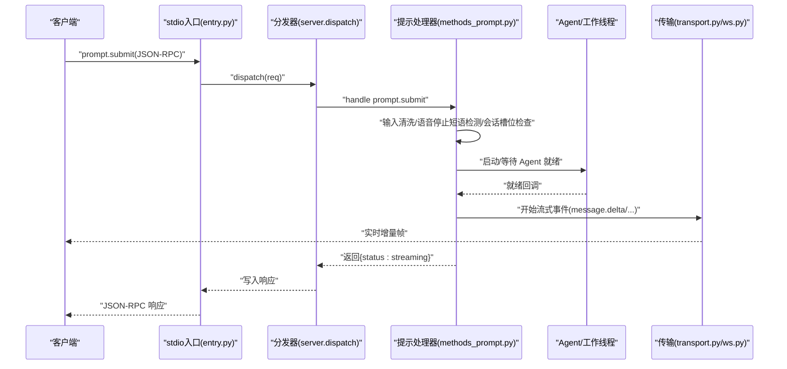
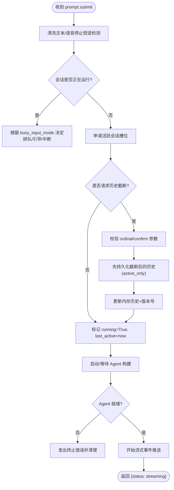
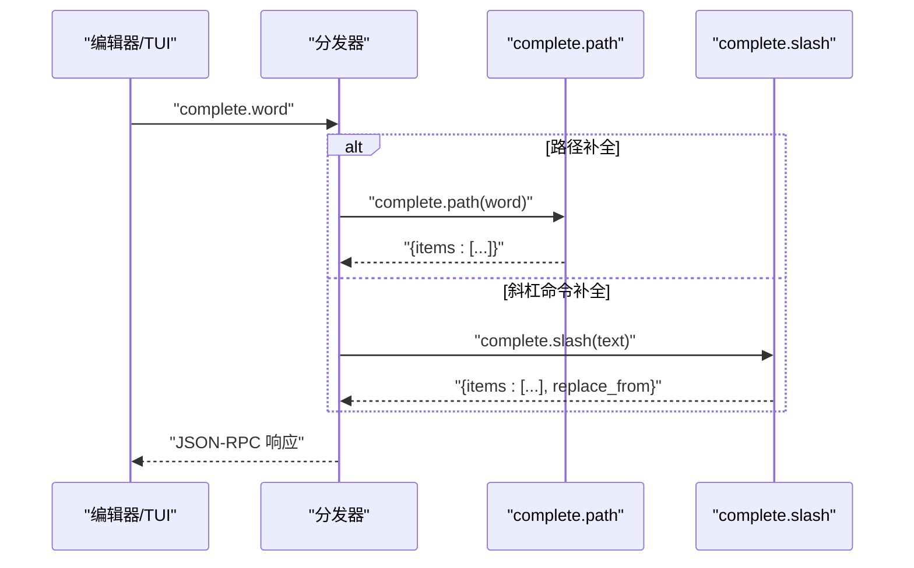
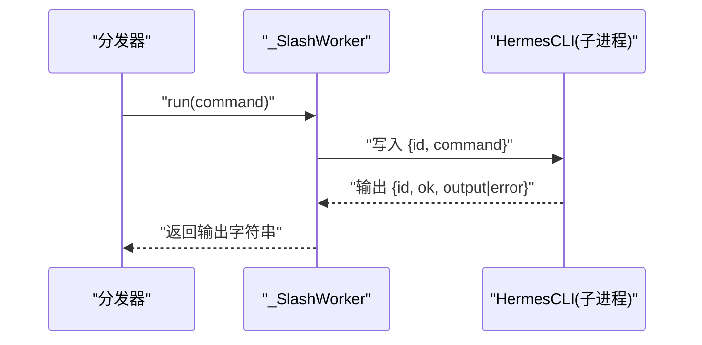
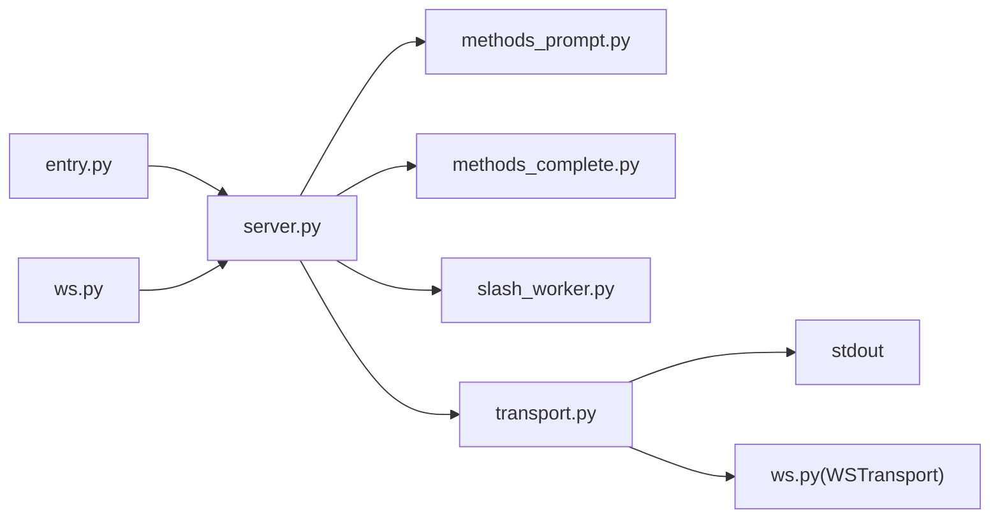

# 提示处理方法

<cite>
**本文引用的文件**
- [entry.py](file://tui_gateway/entry.py)
- [server.py](file://tui_gateway/server.py)
- [methods_prompt.py](file://tui_gateway/methods_prompt.py)
- [methods_complete.py](file://tui_gateway/methods_complete.py)
- [method_ctx.py](file://tui_gateway/method_ctx.py)
- [transport.py](file://tui_gateway/transport.py)
- [ws.py](file://tui_gateway/ws.py)
- [slash_worker.py](file://tui_gateway/slash_worker.py)
- [render.py](file://tui_gateway/render.py)
</cite>

## 目录
1. [简介](#简介)
2. [项目结构](#项目结构)
3. [核心组件](#核心组件)
4. [架构总览](#架构总览)
5. [详细组件分析](#详细组件分析)
6. [依赖关系分析](#依赖关系分析)
7. [性能考量](#性能考量)
8. [故障排查指南](#故障排查指南)
9. [结论](#结论)
10. [附录：API 调用示例与最佳实践](#附录api-调用示例与最佳实践)

## 简介
本文件面向 TUI 网关的“提示处理”能力，系统性说明用户输入从接收、校验、解析到响应生成的完整流程；覆盖提示提交、中断处理、自动完成、命令执行接口；并给出错误处理、超时控制、资源管理、历史管理与搜索、以及用户体验优化的实现要点。文档同时提供同步与异步调用模式的使用指引，帮助开发者在 stdio 或 WebSocket 两种传输上正确集成。

## 项目结构
TUI 网关采用“入口 + 分发 + 方法模块 + 传输抽象”的分层设计：
- 入口层：stdio 主循环（entry.py）与 WebSocket 会话（ws.py）负责接入请求。
- 分发层：统一调度器（server.py）将 JSON-RPC 请求路由到具体处理器，并对长耗时操作进行线程池隔离。
- 方法层：按功能拆分 handlers（methods_prompt.py、methods_complete.py 等），通过注册机制绑定到 server 的全局上下文。
- 传输层：Transport 抽象（transport.py）屏蔽 stdio/WebSocket 差异，支持 Tee 广播与 token 级流式合并。

图表来源
- [entry.py:421-487](file://tui_gateway/entry.py#L421-L487)
- [ws.py:286-428](file://tui_gateway/ws.py#L286-L428)
- [server.py:184-296](file://tui_gateway/server.py#L184-L296)
- [methods_prompt.py:67-367](file://tui_gateway/methods_prompt.py#L67-L367)
- [methods_complete.py:41-354](file://tui_gateway/methods_complete.py#L41-L354)
- [transport.py:66-183](file://tui_gateway/transport.py#L66-L183)

章节来源
- [entry.py:421-487](file://tui_gateway/entry.py#L421-L487)
- [ws.py:286-428](file://tui_gateway/ws.py#L286-L428)
- [server.py:184-296](file://tui_gateway/server.py#L184-L296)

## 核心组件
- 入口与事件循环
  - stdio 入口：读取行、解析 JSON-RPC、调用分发器、写回响应，处理 stdin EOF 恢复与信号安全退出。
  - WebSocket 入口：建立连接、发送 ready、循环接收文本、异常与断开处理、会话清理。
- 分发与线程池
  - 将慢速 RPC（如 complete.path、complete.slash、session.resume、slash.exec 等）放入线程池执行，避免阻塞主读循环。
  - 维护 _LONG_HANDLERS 白名单与 ThreadPoolExecutor。
- 方法注册
  - 通过 HandlerRegistry 延迟注册，安装时将 handler 的 __globals__ 重绑到 server 命名空间，保持字节级等价。
- 传输抽象
  - StdioTransport 与 WSTransport 统一 write/close 语义；WSTransport 对高频 delta 帧做短时合并，降低事件循环唤醒开销。
- 渲染桥
  - render.py 将消息/差异内容交给 agent.rich_output 渲染，失败时回退到 TUI 自身渲染。

章节来源
- [method_ctx.py:21-54](file://tui_gateway/method_ctx.py#L21-L54)
- [transport.py:66-183](file://tui_gateway/transport.py#L66-L183)
- [render.py:10-49](file://tui_gateway/render.py#L10-L49)

## 架构总览
下图展示一次“提示提交”的端到端时序：客户端发起 prompt.submit，网关进入分发，必要时等待/构建 Agent，随后运行提示并提交结果，期间持续推送流式事件。

图表来源
- [entry.py:460-487](file://tui_gateway/entry.py#L460-L487)
- [methods_prompt.py:67-367](file://tui_gateway/methods_prompt.py#L67-L367)
- [transport.py:114-183](file://tui_gateway/transport.py#L114-L183)
- [ws.py:339-428](file://tui_gateway/ws.py#L339-L428)

## 详细组件分析

### 提示提交与处理（prompt.submit）
- 输入验证与安全
  - 对用户文本进行清洗，防止注入；在语音模式下识别“停止短语”，直接结束语音会话而非作为普通消息。
  - 支持“中断标记”以记录客户端打断（例如 VAD 或打字打断播放）。
- 会话与并发
  - 使用 history_lock 保护会话状态；若当前会话仍在运行，则根据配置选择排队、引导或中断策略。
  - 首次真实 turn 才申请“活跃会话槽位”，避免空闲预览占用共享上限。
- 历史截断与分支
  - 支持 rewind/edit/regenerate：通过 truncate_before_user_ordinal 指定截断点，要求 confirm_truncate=true 且拒绝误删整段对话。
  - 持久化优先：先替换 DB 中的活跃行，再更新内存历史，失败则拒绝本轮，保证内存与磁盘一致。
- Agent 构建与执行
  - 异步构建 Agent，完成后在独立线程中执行 _run_prompt_submit；若被取消或未就绪，发出终止错误并清理 in-flight turn。
  - 支持 compute-host 隔离执行，失败回退到内联执行。
- 资源与错误
  - 磁盘满、会话存储写入失败等错误会明确返回错误码与消息；session finalize 会持久化未刷新的消息并触发生命周期钩子。

图表来源
- [methods_prompt.py:67-367](file://tui_gateway/methods_prompt.py#L67-L367)
- [server.py:468-487](file://tui_gateway/server.py#L468-L487)

章节来源
- [methods_prompt.py:67-367](file://tui_gateway/methods_prompt.py#L67-L367)
- [server.py:512-623](file://tui_gateway/server.py#L512-L623)

### 自动完成（complete.path / complete.slash）
- 路径补全
  - 支持 @diff/@staged/@file:/@folder:/@url:/@git: 等上下文标签；模糊匹配仓库文件名与目录名；限制返回数量，避免大仓库卡顿。
  - 对绝对路径前缀做友好处理，兼顾习惯输入。
- 斜杠命令补全
  - 基于 SlashCommandCompleter 与技能/包提供者，支持描述词模糊排序；提供常用快捷项（/density、/details、/logs、/mouse）。
- 性能隔离
  - 这两个方法属于慢路径，默认放入线程池执行，避免阻塞 prompt.submit 与 session.interrupt 等关键路径。

图表来源
- [methods_complete.py:41-215](file://tui_gateway/methods_complete.py#L41-L215)
- [methods_complete.py:218-354](file://tui_gateway/methods_complete.py#L218-L354)
- [server.py:193-283](file://tui_gateway/server.py#L193-L283)

章节来源
- [methods_complete.py:41-354](file://tui_gateway/methods_complete.py#L41-L354)
- [server.py:193-283](file://tui_gateway/server.py#L193-L283)

### 命令执行（slash.exec）
- 通过 _SlashWorker 持久化子进程执行 HermesCLI 命令，stdin/stdout 通过 JSON 行协议通信，stderr 尾部保留用于诊断。
- 超时与健壮性
  - 每次命令有超时阈值，超过则报错；子进程守护监控父进程死亡，优雅退出。
  - 输出经过 ANSI 剥离，确保跨平台渲染一致性。
- 资源回收
  - 每个命令结束后尝试释放内存页，减少长期驻留进程的内存增长。

图表来源
- [server.py:332-466](file://tui_gateway/server.py#L332-L466)
- [slash_worker.py:93-197](file://tui_gateway/slash_worker.py#L93-L197)

章节来源
- [server.py:332-466](file://tui_gateway/server.py#L332-L466)
- [slash_worker.py:93-197](file://tui_gateway/slash_worker.py#L93-L197)

### 中断处理与队列行为
- 当会话忙时，依据 display.busy_input_mode 决定：
  - interrupt：立即中断当前 turn，下一条作为新 turn 继续。
  - queue：排队等待当前 turn 结束。
  - steer：引导用户等待或切换。
- 中断由上层（如 session.interrupt）触发，并在 run_after_agent_ready 中检查取消标志，及时终止后续执行。

章节来源
- [server.py:468-487](file://tui_gateway/server.py#L468-L487)
- [methods_prompt.py:131-147](file://tui_gateway/methods_prompt.py#L131-L147)

### 附件与上下文感知
- 图片/PDF/文件附件
  - image.attach/image.attach_bytes：支持本地路径与 base64 上传，限制大小与扩展名，生成元数据。
  - pdf.attach：调用 pdftoppm 逐页渲染为 PNG，限制页数与大小，返回每页信息。
  - file.attach：非图片文件暂存到会话工作区，返回 @file: 引用供工具读取。
  - clipboard.paste：保存剪贴板图片到会话目录。
- 上下文增强
  - 路径补全支持 @ 上下文标签，智能推荐 diff/staged/file/folder/url/git。
  - 斜杠补全融合技能/包目录，支持描述词模糊排序。

章节来源
- [methods_prompt.py:370-751](file://tui_gateway/methods_prompt.py#L370-L751)
- [methods_complete.py:41-215](file://tui_gateway/methods_complete.py#L41-L215)

### 渲染与流式体验
- 渲染桥：优先使用 agent.rich_output 渲染消息/差异，失败回退到 TUI 自身渲染。
- 流式合并：WSTransport 对 message/reasoning/thinking 的 delta 帧进行短时合并（约 30fps），降低事件循环压力并保持顺序。
- 网络优化：禁用 Nagle 以减少小帧聚合，提升首字延迟。

章节来源
- [render.py:10-49](file://tui_gateway/render.py#L10-L49)
- [ws.py:44-60](file://tui_gateway/ws.py#L44-L60)
- [ws.py:268-284](file://tui_gateway/ws.py#L268-L284)

## 依赖关系分析
- 入口与分发
  - entry.py 仅负责 I/O 与信号处理，核心逻辑委托给 server.dispatch。
  - ws.py 复用同一分发器，保证 stdio 与 WebSocket 行为一致。
- 方法模块与注册
  - methods_* 模块通过 HandlerRegistry 延迟注册，install 时重绑全局变量，保持与旧版 server.py 完全兼容。
- 传输抽象
  - transport.py 提供 StdioTransport/WSTransport/TeeTransport，屏蔽底层差异；ws.py 的 WSTransport 负责 token 合并与超时保护。
- 子进程与外部依赖
  - slash_worker.py 通过子进程执行 CLI 命令；pdf.attach 依赖 pdftoppm；路径补全可能扫描仓库文件。

图表来源
- [entry.py:421-487](file://tui_gateway/entry.py#L421-L487)
- [ws.py:286-428](file://tui_gateway/ws.py#L286-L428)
- [server.py:184-296](file://tui_gateway/server.py#L184-L296)
- [transport.py:66-183](file://tui_gateway/transport.py#L66-L183)

章节来源
- [method_ctx.py:21-54](file://tui_gateway/method_ctx.py#L21-L54)
- [transport.py:66-183](file://tui_gateway/transport.py#L66-L183)

## 性能考量
- 长耗时 RPC 隔离
  - 将 complete.path、complete.slash、session.resume、slash.exec 等放入线程池，避免阻塞主读循环导致 TUI 假死。
- 流式帧合并
  - 高频 delta 帧合并发送，降低事件循环唤醒次数，提升 GUI 流畅度。
- 网络优化
  - 关闭 Nagle，使小帧尽快发出，改善首字延迟。
- 资源回收
  - slash worker 命令结束后尝试释放内存页；会话关闭时持久化未刷新消息并触发生命周期钩子。
- 超时与保护
  - WS 写超时保护避免事件循环停滞导致的永久关闭；slash worker 命令超时保护避免卡死。

[本节为通用性能讨论，不直接分析具体文件]

## 故障排查指南
- 常见错误码与场景
  - 解析错误：-32700（JSON 解析失败）。
  - 参数缺失/非法：40xx 系列（如 path/content_base64 必填、PDF 过大、页面范围非法等）。
  - 会话容量/限制：4009（子代理仍运行）、4018（目标用户消息不在历史中）、4028/4029（截断需确认）。
  - 磁盘/存储问题：5070/5071（磁盘满或无法写入会话存储）。
  - 外部依赖缺失：5028（pdftoppm 未安装或失败）。
- 日志与崩溃捕获
  - 未处理异常会被写入 tui_gateway_crash.log，并通过 stderr 输出摘要，便于定位。
  - 信号处理记录 SIGTERM/SIGHUP/SIGBREAK 及线程栈，辅助诊断后台线程导致的崩溃。
- 常见问题定位
  - TUI 无响应：检查是否卡在长耗时 RPC（complete.path/complete.slash），观察线程池占用。
  - 流式卡顿：检查 WS 写超时与事件循环是否被长时间占用（GIL 竞争、子代理过多）。
  - 附件失败：确认文件大小限制、扩展名允许列表、pdftoppm 是否可用。

章节来源
- [server.py:62-132](file://tui_gateway/server.py#L62-L132)
- [entry.py:89-171](file://tui_gateway/entry.py#L89-L171)
- [methods_prompt.py:414-637](file://tui_gateway/methods_prompt.py#L414-L637)
- [methods_complete.py:41-354](file://tui_gateway/methods_complete.py#L41-L354)

## 结论
TUI 网关的提示处理体系以“入口-分发-方法-传输”分层为核心，实现了高可靠、可扩展、低延迟的用户交互链路。通过严格的输入校验、会话并发控制、历史截断保护、流式帧合并与网络优化，既保证了稳定性，也提升了用户体验。对于复杂场景（附件、斜杠命令、远程上传），系统提供了健壮的边界处理与降级策略。

[本节为总结性内容，不直接分析具体文件]

## 附录：API 调用示例与最佳实践

- 同步调用（stdio）
  - 客户端向 gateway 的标准输入逐行发送 JSON-RPC 请求，读取标准输出响应。
  - 示例步骤：
    - 发送 {"jsonrpc":"2.0","method":"prompt.submit","params":{"session_id":"sid","text":"你好"},"id":1}
    - 服务端返回 {"jsonrpc":"2.0","result":{"status":"streaming"},"id":1}
    - 随后通过事件通道（message.delta 等）接收流式增量。
  - 参考路径：
    - [entry.py:460-487](file://tui_gateway/entry.py#L460-L487)
    - [methods_prompt.py:67-367](file://tui_gateway/methods_prompt.py#L67-L367)

- 异步调用（WebSocket）
  - 客户端建立 WebSocket 连接后，服务端立即发送 gateway.ready；之后双向 JSON-RPC 帧与事件流。
  - 示例步骤：
    - 连接后接收 {"method":"event","params":{"type":"gateway.ready",...}}
    - 发送 prompt.submit，接收 {status:"streaming"}
    - 订阅 message.delta/reasoning.delta/thinking.delta 等增量事件
  - 参考路径：
    - [ws.py:286-337](file://tui_gateway/ws.py#L286-L337)
    - [ws.py:339-428](file://tui_gateway/ws.py#L339-L428)

- 自动完成
  - 路径补全：complete.path(word) → {items:[...]}
  - 斜杠补全：complete.slash(text) → {items:[...], replace_from}
  - 参考路径：
    - [methods_complete.py:41-215](file://tui_gateway/methods_complete.py#L41-L215)
    - [methods_complete.py:218-354](file://tui_gateway/methods_complete.py#L218-L354)

- 命令执行
  - 通过 slash.exec 或内部 _SlashWorker 执行 CLI 命令，返回输出字符串。
  - 参考路径：
    - [server.py:332-466](file://tui_gateway/server.py#L332-L466)
    - [slash_worker.py:93-197](file://tui_gateway/slash_worker.py#L93-L197)

- 错误处理与超时
  - 关注各方法返回的错误码与消息；WS 写超时会记录警告并尽量保持连接存活。
  - 参考路径：
    - [ws.py:165-187](file://tui_gateway/ws.py#L165-L187)
    - [methods_prompt.py:414-637](file://tui_gateway/methods_prompt.py#L414-L637)

- 资源管理与历史
  - 会话结束时持久化未刷新消息，触发 on_session_finalize 钩子；截断历史需显式确认，防止误删。
  - 参考路径：
    - [server.py:661-760](file://tui_gateway/server.py#L661-L760)
    - [methods_prompt.py:152-275](file://tui_gateway/methods_prompt.py#L152-L275)

- 用户体验优化建议
  - 使用 busy_input_mode 合理设置忙时行为，避免用户误以为无响应。
  - 利用 @ 上下文与斜杠补全减少输入成本。
  - 开启流式显示以获得更自然的交互节奏。

[本节为使用指引，不直接分析具体文件]