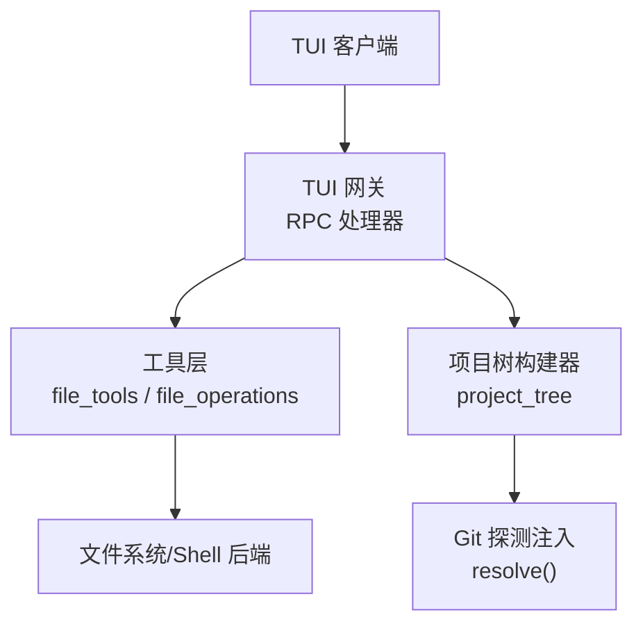
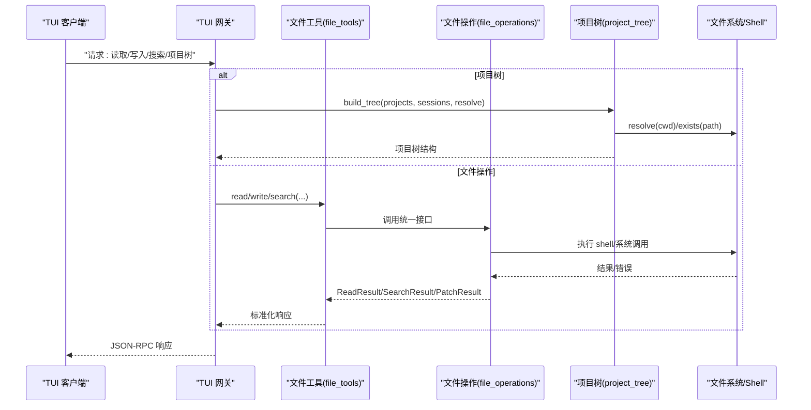
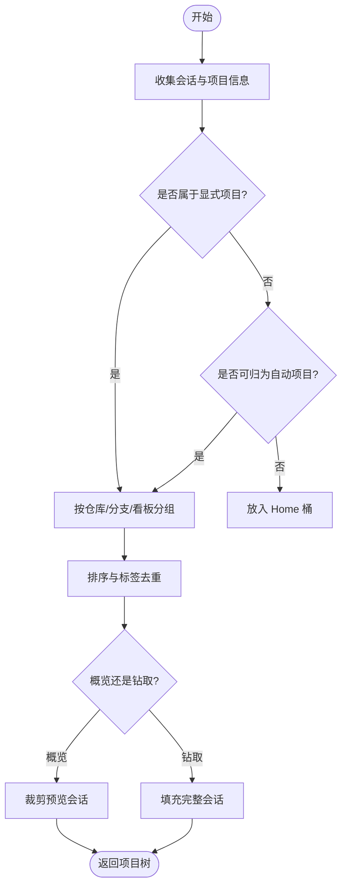
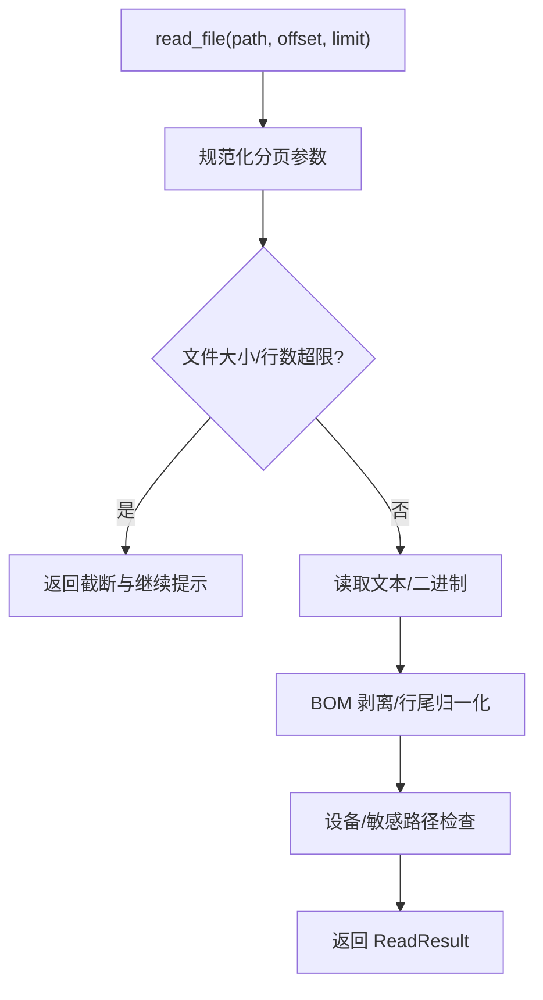
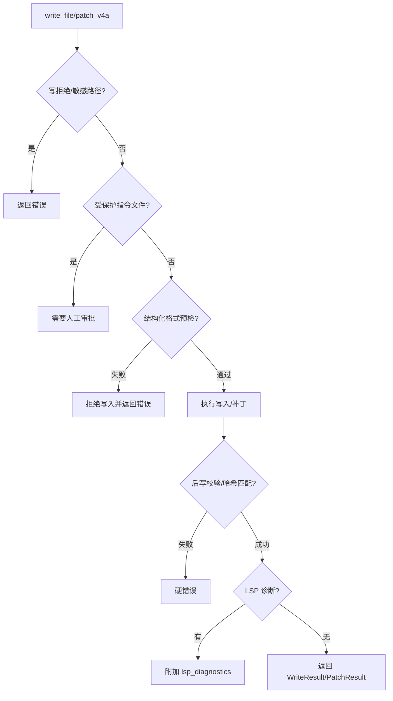
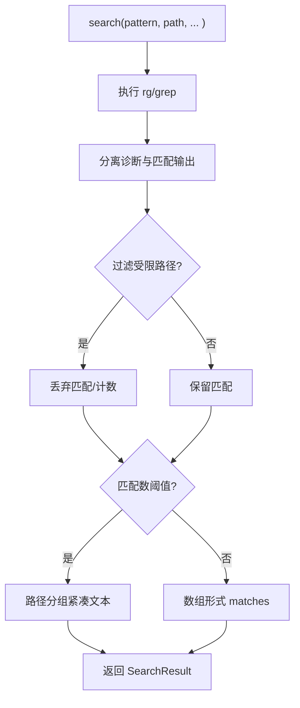
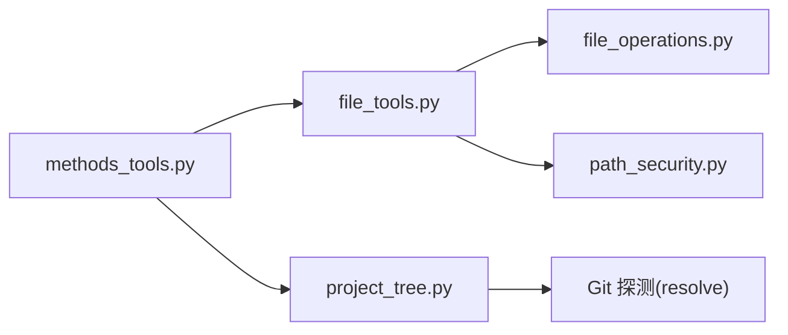

# 文件操作

<cite>
**本文引用的文件**
- [project_tree.py](file://tui_gateway/project_tree.py)
- [file_operations.py](file://tools/file_operations.py)
- [file_tools.py](file://tools/file_tools.py)
- [path_security.py](file://tools/path_security.py)
- [methods_tools.py](file://tui_gateway/methods_tools.py)
</cite>

## 目录
1. [简介](#简介)
2. [项目结构](#项目结构)
3. [核心组件](#核心组件)
4. [架构总览](#架构总览)
5. [详细组件分析](#详细组件分析)
6. [依赖关系分析](#依赖关系分析)
7. [性能考量](#性能考量)
8. [故障排查指南](#故障排查指南)
9. [结论](#结论)
10. [附录：API 参考](#附录api-参考)

## 简介
本文件面向 TUI 网关的文件操作能力，覆盖读取、写入、搜索与导航（项目树遍历）、内容预览、配置管理、版本控制集成、路径解析、权限检查、编码处理与大小限制。同时给出批量操作与流式处理的实践建议，并记录变更监听、实时同步与冲突解决策略，以及安全、备份恢复与性能优化要点。

## 项目结构
TUI 网关通过 RPC 方法暴露能力，底层由工具层提供跨终端后端的统一文件操作实现；项目树构建器负责将会话按仓库/分支/看板等维度组织，支撑侧边栏导航与预览。

图表来源
- [methods_tools.py:1-120](file://tui_gateway/methods_tools.py#L1-L120)
- [file_tools.py:150-400](file://tools/file_tools.py#L150-L400)
- [file_operations.py:450-520](file://tools/file_operations.py#L450-L520)
- [project_tree.py:537-769](file://tui_gateway/project_tree.py#L537-L769)

章节来源
- [methods_tools.py:1-120](file://tui_gateway/methods_tools.py#L1-L120)
- [file_tools.py:150-400](file://tools/file_tools.py#L150-L400)
- [file_operations.py:450-520](file://tools/file_operations.py#L450-L520)
- [project_tree.py:537-769](file://tui_gateway/project_tree.py#L537-L769)

## 核心组件
- 项目树构建器：将会话按项目/仓库/分支/看板进行分组，支持自动项目发现、工作树折叠、标签去重与预览会话裁剪。
- 文件操作抽象与实现：统一的读/写/补丁/删除/移动/搜索接口，封装 Shell 后端调用、分页、限流、编码与行尾处理、BOM 处理、二进制与图片识别、Lint/LSP 诊断。
- 路径与安全：工作区根解析、容器路径适配、设备/敏感路径拦截、指令文件保护、写拒绝列表。
- TUI 网关方法：将上层请求路由到具体工具与系统能力（如 MCP 重载、命令分发等）。

章节来源
- [project_tree.py:537-769](file://tui_gateway/project_tree.py#L537-L769)
- [file_operations.py:450-520](file://tools/file_operations.py#L450-L520)
- [file_tools.py:150-400](file://tools/file_tools.py#L150-L400)
- [path_security.py:15-44](file://tools/path_security.py#L15-L44)
- [methods_tools.py:1-120](file://tui_gateway/methods_tools.py#L1-L120)

## 架构总览
TUI 网关通过 RPC 方法接收请求，调用工具层完成文件操作或项目树构建。项目树构建器通过注入的 resolve() 探测 Git 仓库与工作树，确保多工作树场景下正确聚合。文件操作在工具层统一抽象，屏蔽不同终端后端差异，并提供安全校验、编码处理、大小限制与 Lint/LSP 诊断。

图表来源
- [project_tree.py:537-769](file://tui_gateway/project_tree.py#L537-L769)
- [file_operations.py:450-520](file://tools/file_operations.py#L450-L520)
- [file_tools.py:150-400](file://tools/file_tools.py#L150-L400)
- [methods_tools.py:1-120](file://tui_gateway/methods_tools.py#L1-L120)

## 详细组件分析

### 项目树构建与导航
- 功能要点
  - 会话归属：优先使用 Git 公共根（合并工作树），回退到 cwd。
  - 分支/看板：主分支归入 trunk lane，看板任务按 .worktrees 模式折叠。
  - 自动项目：对未显式归属的会话按仓库根或 cwd 建立自动项目，过滤“垃圾”根与不存在目录。
  - 标签去重：同层级同名仓库/分支通过路径前缀展开避免歧义。
  - 预览会话：概览视图仅携带少量预览会话，钻取视图可填充完整列表。
- 关键流程
  - 计算 lane key、repo key，聚合 session，排序与打散标签。
  - 注入 exists()/resolve() 以适配远程/本地与删除的工作树恢复。

图表来源
- [project_tree.py:537-769](file://tui_gateway/project_tree.py#L537-L769)

章节来源
- [project_tree.py:537-769](file://tui_gateway/project_tree.py#L537-L769)

### 文件读取
- 能力
  - 分页读取：offset/limit 规范化，防止越界与过大输出。
  - 编码处理：检测并剥离 UTF-8 BOM，保留原始行尾（CRLF/LF）。
  - 二进制与图片：识别扩展名，返回 base64 与 MIME/尺寸信息。
  - 大小限制：单文件字符预算与行长度上限，超大文件提示定向读取。
  - 安全：阻止设备路径与敏感路径读取，过滤搜索结果中的受限路径。
- 典型流程

图表来源
- [file_operations.py:724-800](file://tools/file_operations.py#L724-L800)
- [file_tools.py:60-135](file://tools/file_tools.py#L60-L135)
- [file_tools.py:516-605](file://tools/file_tools.py#L516-L605)

章节来源
- [file_operations.py:724-800](file://tools/file_operations.py#L724-L800)
- [file_tools.py:60-135](file://tools/file_tools.py#L60-L135)
- [file_tools.py:516-605](file://tools/file_tools.py#L516-L605)

### 文件写入与补丁
- 能力
  - 写拒绝：基于全局拒绝路径与前缀，拒绝敏感系统目录与 Hermes 配置文件。
  - 指令文件保护：AGENTS.md/CLAUDE.md/SOUL.md/.cursorrules 等需人工审批。
  - 预写校验：JSON/YAML/TOML/Python 语法检查，失败关闭策略（结构化格式）。
  - 行尾与 BOM：写入时保持原行尾，必要时恢复 BOM。
  - Lint/LSP：可选 LSP 语义诊断，区分 lint 与 lsp_diagnostics。
  - V4A 补丁：支持 V4A 格式补丁，重写头路径以对齐宿主路径。
- 典型流程

图表来源
- [file_operations.py:149-152](file://tools/file_operations.py#L149-L152)
- [file_operations.py:623-723](file://tools/file_operations.py#L623-L723)
- [file_tools.py:641-800](file://tools/file_tools.py#L641-L800)

章节来源
- [file_operations.py:149-152](file://tools/file_operations.py#L149-L152)
- [file_operations.py:623-723](file://tools/file_operations.py#L623-L723)
- [file_tools.py:641-800](file://tools/file_tools.py#L641-L800)

### 搜索
- 能力
  - 内容/文件搜索：支持 glob 过滤、上下文行、分页。
  - 输出清洗：分离 rg/grep 的诊断与有效匹配，处理超时标记。
  - 结果过滤：移除受保护的搜索结果路径。
  - 大结果压缩：当匹配较多时，转为路径分组的紧凑文本块。
- 典型流程

图表来源
- [file_operations.py:357-444](file://tools/file_operations.py#L357-L444)
- [file_operations.py:244-328](file://tools/file_operations.py#L244-L328)
- [file_tools.py:592-639](file://tools/file_tools.py#L592-L639)

章节来源
- [file_operations.py:357-444](file://tools/file_operations.py#L357-L444)
- [file_operations.py:244-328](file://tools/file_operations.py#L244-L328)
- [file_tools.py:592-639](file://tools/file_tools.py#L592-L639)

### 路径解析与权限检查
- 路径解析
  - 工作区根优先级：会话 cwd 记录 > 任务 cwd 覆盖 > TERMINAL_CWD > 进程 cwd。
  - 容器路径：对 docker/singularity/modal/daytona/vercel_sandbox 等后端使用容器内路径规范。
  - 相对路径警告：若相对路径解析到工作区外，发出明确警告。
- 权限与安全
  - 设备路径拦截：/dev/*、/proc/* 中易泄露或阻塞的路径。
  - 敏感路径拒绝：系统目录、Docker socket、Hermes 配置文件。
  - 指令文件保护：持久化指令文件写入强制审批。
  - 通用校验：validate_within_dir、has_traversal_component。

章节来源
- [file_tools.py:152-400](file://tools/file_tools.py#L152-L400)
- [file_tools.py:516-704](file://tools/file_tools.py#L516-L704)
- [path_security.py:15-44](file://tools/path_security.py#L15-L44)

### 配置管理与版本控制集成
- 配置管理
  - 读取/重载环境变量：reload.env 刷新 ~/.hermes/.env。
  - 配置项影响：file_read_max_chars、security.protected_instruction_files 等。
- 版本控制集成
  - 项目树：通过 resolve() 探测 Git 仓库与工作树，合并工作树至主仓库。
  - 看板任务：.worktrees/t_<hex> 折叠为看板 lane。
  - 分支归类：trunk 分支置顶，未记录分支归入默认 main。

章节来源
- [methods_tools.py:234-253](file://tui_gateway/methods_tools.py#L234-L253)
- [project_tree.py:1-73](file://tui_gateway/project_tree.py#L1-L73)
- [project_tree.py:227-266](file://tui_gateway/project_tree.py#L227-L266)

## 依赖关系分析
- TUI 网关方法注册于 methods_tools.py，调用工具层与系统能力。
- 工具层 file_tools.py 依赖 file_operations.py 的统一接口，并整合 path_security.py 的安全校验。
- 项目树构建器 project_tree.py 通过注入的 resolve/exists 与外部 Git 探测交互。

图表来源
- [methods_tools.py:1-120](file://tui_gateway/methods_tools.py#L1-L120)
- [file_tools.py:150-400](file://tools/file_tools.py#L150-L400)
- [file_operations.py:450-520](file://tools/file_operations.py#L450-L520)
- [project_tree.py:537-769](file://tui_gateway/project_tree.py#L537-L769)

章节来源
- [methods_tools.py:1-120](file://tui_gateway/methods_tools.py#L1-L120)
- [file_tools.py:150-400](file://tools/file_tools.py#L150-L400)
- [file_operations.py:450-520](file://tools/file_operations.py#L450-L520)
- [project_tree.py:537-769](file://tui_gateway/project_tree.py#L537-L769)

## 性能考量
- 读取
  - 分页与字符预算：避免单次返回过大内容，降低模型上下文压力。
  - 行长度限制：减少单行过长导致的渲染与传输开销。
- 搜索
  - 超时与诊断分离：快速失败与结果完整性兼顾。
  - 结果压缩：匹配较多时采用路径分组文本，减少 token 消耗。
- 写入
  - 预写语法检查：尽早失败，避免无效 I/O。
  - LSP 诊断：仅在启用且适用时运行，避免额外开销。
- 项目树
  - 注入式 resolve/exists：单元测试友好，生产环境按需探测，避免不必要 git 调用。
  - 标签去重与排序：减少 UI 渲染负担。

[本节为通用指导，不直接分析具体文件]

## 故障排查指南
- 读取失败
  - 检查设备/敏感路径拦截与相对路径解析警告。
  - 确认分页参数是否越界或被规范化。
- 写入失败
  - 查看写拒绝列表与指令文件保护是否触发。
  - 检查结构化格式预写校验与 LSP 诊断。
- 搜索异常
  - 关注 rg/grep 诊断输出与超时标记。
  - 确认正则是否包含换行匹配（行级搜索不支持跨行）。
- 项目树异常
  - 验证 resolve() 是否能正确识别仓库与工作树。
  - 检查工作树是否被误判为独立仓库或已删除路径。

章节来源
- [file_tools.py:516-704](file://tools/file_tools.py#L516-L704)
- [file_operations.py:357-444](file://tools/file_operations.py#L357-L444)
- [project_tree.py:227-266](file://tui_gateway/project_tree.py#L227-L266)

## 结论
TUI 网关通过统一抽象与严格的安全边界，提供了跨终端后端的文件读写、搜索与项目树导航能力。结合编码处理、大小限制、Lint/LSP 诊断与项目树智能分组，既满足高效开发体验，又保障安全性与稳定性。建议在大规模项目中配合缓存、分页与结果压缩策略，以获得更佳性能。

[本节为总结性内容，不直接分析具体文件]

## 附录：API 参考
- 项目树
  - build_tree(projects, sessions, discovered_repos, resolve, preview_limit, hydrate, is_junk_root, is_junk_cwd, exists)
    - 输入：项目列表、会话列表、发现仓库、Git 探测函数、预览数量、是否填充会话、垃圾根/cwd 判定、存在性检查
    - 输出：{projects, scoped_session_ids}
- 文件操作（抽象接口）
  - read_file(path, offset=1, limit=2000) -> ReadResult
  - read_file_raw(path) -> ReadResult
  - write_file(path, content, pre_content=None) -> WriteResult
  - patch_replace(path, old_string, new_string, replace_all=False) -> PatchResult
  - patch_v4a(patch_content) -> PatchResult
  - delete_file(path) -> WriteResult
  - move_file(src, dst) -> WriteResult
  - search(pattern, path=".", target="content", file_glob=None, limit=50, offset=0, output_mode="content", context=0) -> SearchResult
- 结果对象
  - ReadResult：content, total_lines, file_size, truncated, hint, is_binary, is_image, base64_content, mime_type, dimensions, error, similar_files
  - WriteResult：bytes_written, dirs_created, verified, lint, lsp_diagnostics, error, warning
  - PatchResult：success, diff, files_modified, files_created, files_deleted, lint, lsp_diagnostics, error, no_change, note
  - SearchResult：matches, files, counts, total_count, truncated, limit_reason, warning, error

章节来源
- [project_tree.py:537-769](file://tui_gateway/project_tree.py#L537-L769)
- [file_operations.py:450-520](file://tools/file_operations.py#L450-L520)
- [file_operations.py:158-345](file://tools/file_operations.py#L158-L345)