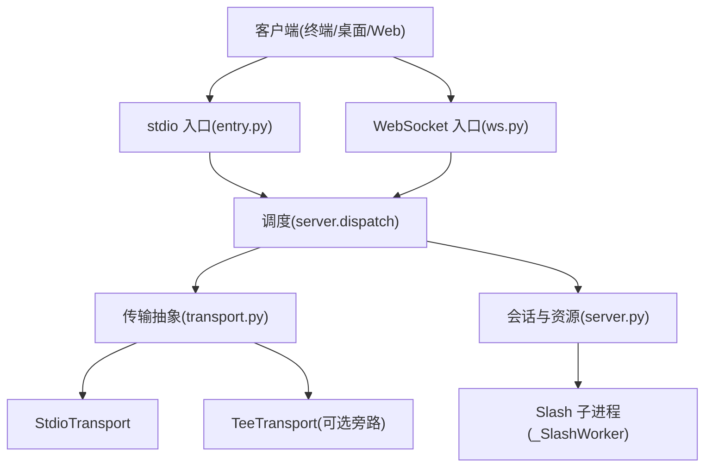
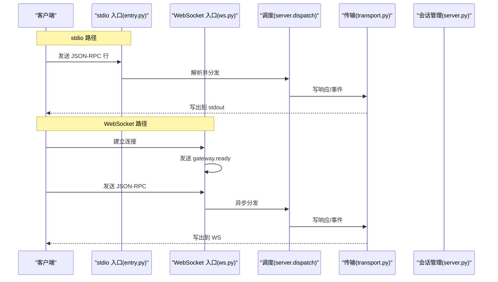
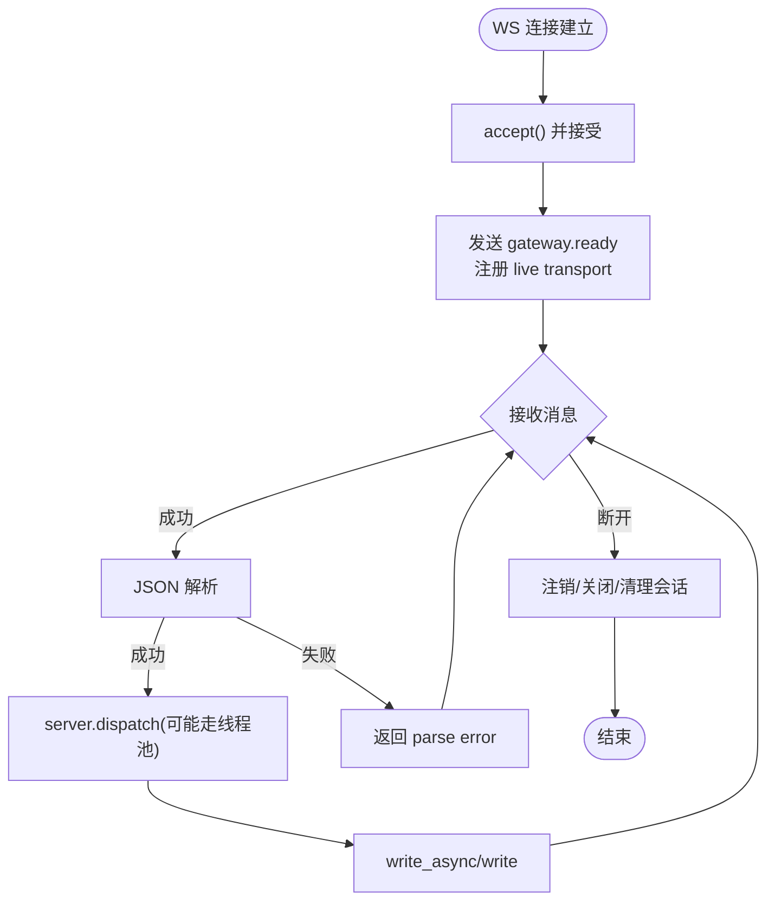
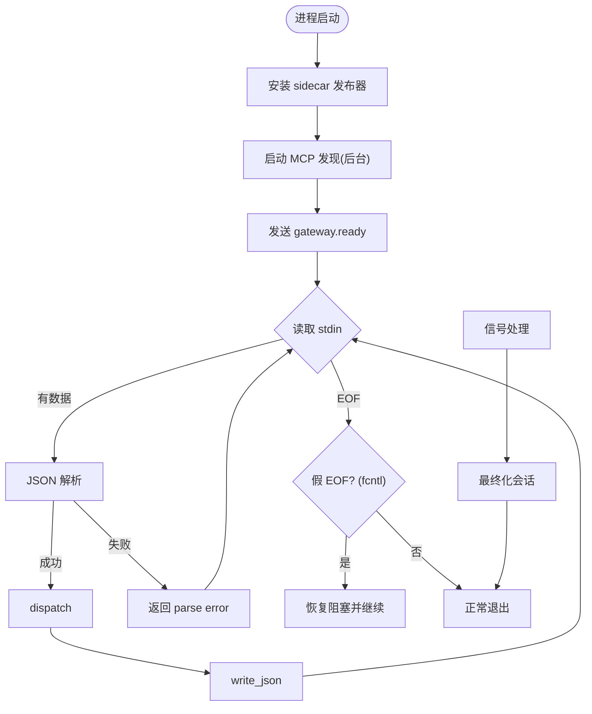
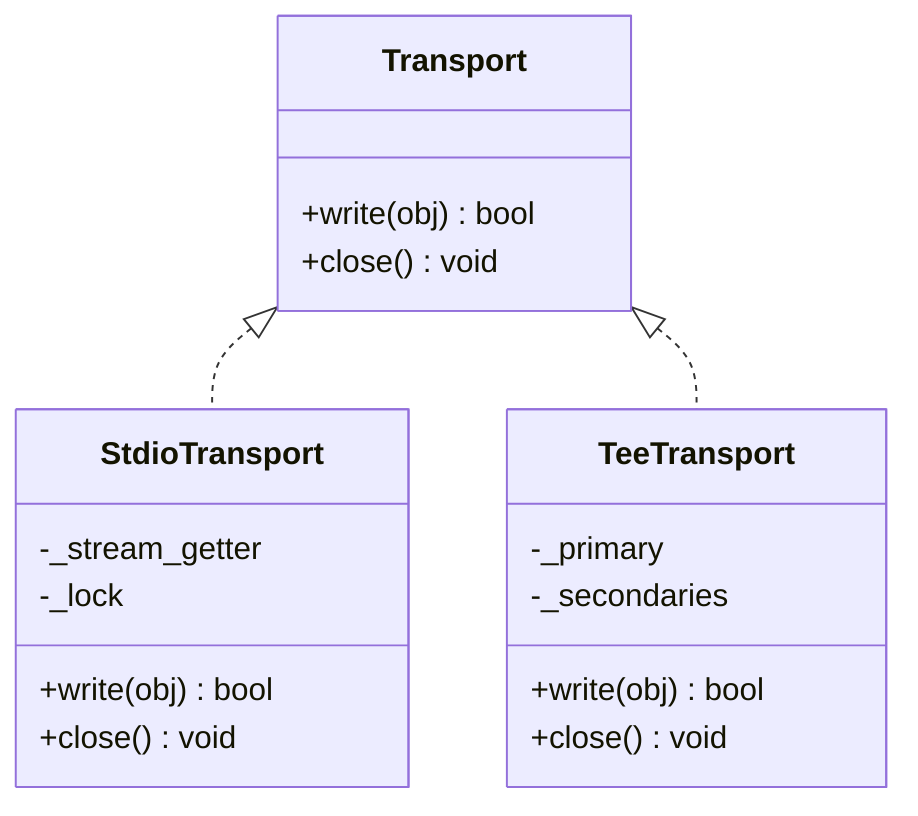
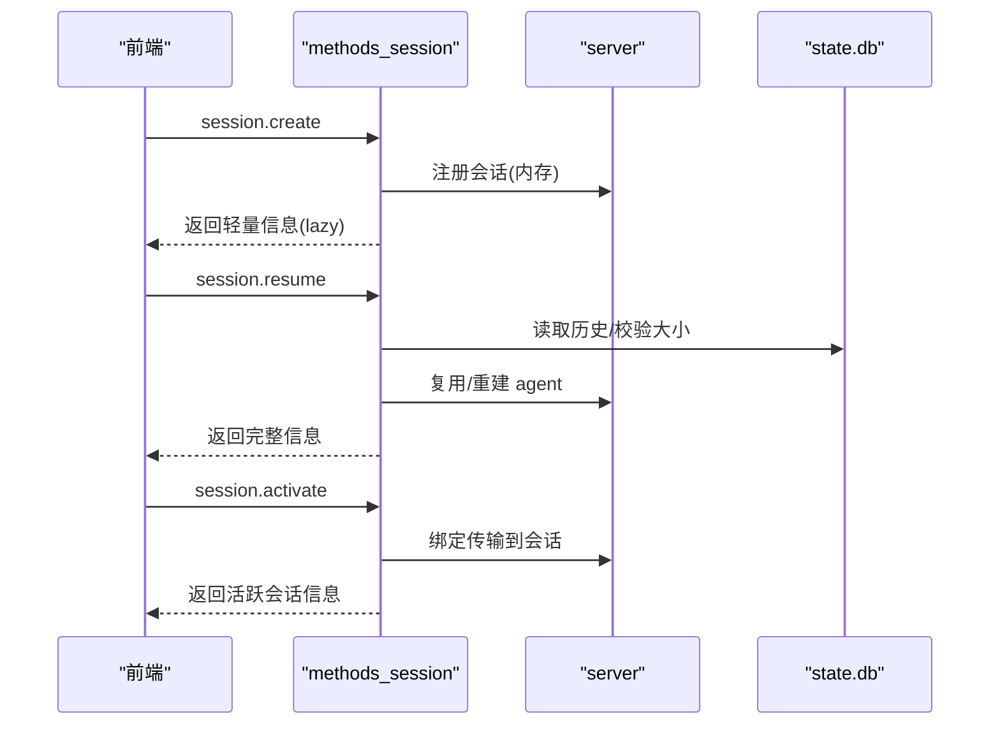
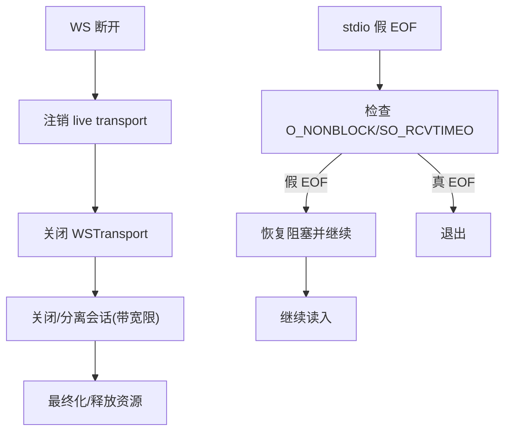
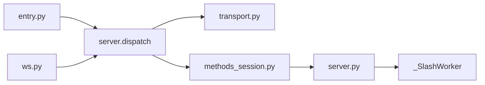

# 连接管理

<cite>
**本文引用的文件**
- [tui_gateway/server.py](file://tui_gateway/server.py)
- [tui_gateway/ws.py](file://tui_gateway/ws.py)
- [tui_gateway/transport.py](file://tui_gateway/transport.py)
- [tui_gateway/entry.py](file://tui_gateway/entry.py)
- [tui_gateway/_stdin_recovery.py](file://tui_gateway/_stdin_recovery.py)
- [tui_gateway/methods_session.py](file://tui_gateway/methods_session.py)
</cite>

## 目录
1. [简介](#简介)
2. [项目结构](#项目结构)
3. [核心组件](#核心组件)
4. [架构总览](#架构总览)
5. [详细组件分析](#详细组件分析)
6. [依赖关系分析](#依赖关系分析)
7. [性能考量](#性能考量)
8. [故障排除指南](#故障排除指南)
9. [结论](#结论)
10. [附录](#附录)

## 简介
本文件面向 TUI 网关的连接管理，覆盖 WebSocket 与标准输入输出（stdio）连接的建立、维护与关闭；会话绑定与生命周期；重连机制与资源清理；连接池与超时控制；错误恢复与性能优化；状态监控、调试方法与故障排除；多客户端支持、并发限制与安全认证要点。文档以代码为依据，提供可追溯的章节来源与图示。

## 项目结构
TUI 网关通过统一的传输抽象同时支持 stdio 与 WebSocket 两种接入方式：
- entry.py：stdio 入口，负责启动、信号处理、stdin 循环与“gateway.ready”事件发送。
- ws.py：WebSocket 入口，负责接受连接、流式帧合并、调度分发与断开清理。
- transport.py：传输抽象层，定义 Transport 协议，实现 StdioTransport、TeeTransport 等。
- server.py：核心调度与会话管理，包含长任务线程池、会话表、子进程工作器、孤儿回收、最终化与资源释放。
- methods_session.py：会话相关 JSON-RPC 方法（创建、恢复、激活、列表等）。
- _stdin_recovery.py：POSIX 下 stdin 假 EOF 检测与恢复。

**图示来源**
- [tui_gateway/entry.py:421-487](file://tui_gateway/entry.py#L421-L487)
- [tui_gateway/ws.py:286-477](file://tui_gateway/ws.py#L286-L477)
- [tui_gateway/transport.py:66-220](file://tui_gateway/transport.py#L66-L220)
- [tui_gateway/server.py:143-296](file://tui_gateway/server.py#L143-L296)

**章节来源**
- [tui_gateway/entry.py:421-487](file://tui_gateway/entry.py#L421-L487)
- [tui_gateway/ws.py:286-477](file://tui_gateway/ws.py#L286-L477)
- [tui_gateway/transport.py:66-220](file://tui_gateway/transport.py#L66-L220)
- [tui_gateway/server.py:143-296](file://tui_gateway/server.py#L143-L296)

## 核心组件
- 传输抽象与实现
  - Transport 协议：统一 write/close 接口，返回 False 表示对端已断开。
  - StdioTransport：写入 stdout，捕获 BrokenPipe/EOF/特定 errno，区分“对端消失”与真实 I/O 错误。
  - TeeTransport：主通道 + 多个次要通道（如侧边栏 WS），次要失败不影响主路径。
- 连接入口
  - stdio：entry.py 读取 stdin 行，解析 JSON-RPC，调用 dispatch，写回响应或事件。
  - WebSocket：ws.py 接受连接，发送 gateway.ready，进入接收循环，异常时统计并清理。
- 会话与资源
  - server.py 维护全局会话表、RPC 长任务线程池、Slash 子进程、孤儿回收、最终化与 DB 持久化。
  - methods_session.py 暴露 session.create/resume/activate/list 等方法，完成会话生命周期操作。

**章节来源**
- [tui_gateway/transport.py:66-220](file://tui_gateway/transport.py#L66-L220)
- [tui_gateway/entry.py:421-487](file://tui_gateway/entry.py#L421-L487)
- [tui_gateway/ws.py:286-477](file://tui_gateway/ws.py#L286-L477)
- [tui_gateway/server.py:143-296](file://tui_gateway/server.py#L143-L296)
- [tui_gateway/methods_session.py:14-159](file://tui_gateway/methods_session.py#L14-L159)

## 架构总览
下图展示从客户端到会话处理的端到端流程，包括 stdio 与 WebSocket 两条路径，以及共享的调度与传输层。

**图示来源**
- [tui_gateway/entry.py:421-487](file://tui_gateway/entry.py#L421-L487)
- [tui_gateway/ws.py:286-477](file://tui_gateway/ws.py#L286-L477)
- [tui_gateway/transport.py:66-220](file://tui_gateway/transport.py#L66-L220)
- [tui_gateway/server.py:143-296](file://tui_gateway/server.py#L143-L296)

## 详细组件分析

### WebSocket 连接生命周期
- 建立
  - 接受连接，禁用 Nagle 提升实时性，发送 gateway.ready 并注册 live transport。
- 维护
  - 接收 JSON-RPC，解析错误计数，分派到 server.dispatch；长任务走线程池，避免阻塞事件循环。
  - 高频 token 帧合并缓冲，按短定时器批量发送，降低事件循环唤醒开销。
- 关闭
  - 捕获断开原因，注销 live transport，关闭 WSTransport，释放唤醒词资源，按传输关闭/分离会话，记录统计指标。

**图示来源**
- [tui_gateway/ws.py:286-477](file://tui_gateway/ws.py#L286-L477)

**章节来源**
- [tui_gateway/ws.py:286-477](file://tui_gateway/ws.py#L286-L477)

### stdio 连接生命周期
- 建立
  - 安装 sidecar 发布器（可选），启动 MCP 发现后台线程，发送 gateway.ready。
- 维护
  - 循环读取 stdin 行，解析 JSON-RPC，调用 dispatch，写回响应或错误。
  - 处理 SIGPIPE/SIGTERM/SIGHUP/SIGINT，记录信号栈与线程信息，优雅退出。
- 关闭
  - 在 atexit/信号处理中执行会话最终化，必要时硬退出防止死锁。

**图示来源**
- [tui_gateway/entry.py:421-487](file://tui_gateway/entry.py#L421-L487)
- [tui_gateway/_stdin_recovery.py:83-152](file://tui_gateway/_stdin_recovery.py#L83-L152)

**章节来源**
- [tui_gateway/entry.py:421-487](file://tui_gateway/entry.py#L421-L487)
- [tui_gateway/_stdin_recovery.py:83-152](file://tui_gateway/_stdin_recovery.py#L83-L152)

### 传输抽象与错误处理
- Transport 协议
  - write(obj) -> bool：False 表示对端消失；close() 释放资源。
- StdioTransport
  - 序列化后加换行写出，捕获 BrokenPipe/ValueError("closed file")/特定 errno，区分“对端消失”与真实错误。
  - flush 可配置跳过以避免半关闭管道导致的长时间阻塞。
- TeeTransport
  - 主通道优先，次要通道失败被吞掉，保证主路径不受影响。

**图示来源**
- [tui_gateway/transport.py:66-220](file://tui_gateway/transport.py#L66-L220)

**章节来源**
- [tui_gateway/transport.py:66-220](file://tui_gateway/transport.py#L66-L220)

### 会话管理与绑定
- 会话创建
  - session.create：生成会话 ID/键，初始化历史、模型/工作区/来源等元信息，延迟构建 agent，返回轻量 payload 以便 UI 快速渲染。
- 会话恢复
  - session.resume：支持懒加载/watch 模式，冷/热路径复用，压缩续链追踪，安全校验消息数量上限，必要时重建 agent。
- 会话激活与列表
  - session.activate：将前端绑定到现有活跃会话；session.active_list：仅列出当前进程内可附加的活跃会话。
- 会话最终化
  - 释放活动槽位、停止通知、持久化未刷消息、触发 on_session_end 钩子、结束 DB 行、中断委派任务、关闭 slash worker。

**图示来源**
- [tui_gateway/methods_session.py:14-159](file://tui_gateway/methods_session.py#L14-L159)
- [tui_gateway/methods_session.py:306-807](file://tui_gateway/methods_session.py#L306-L807)
- [tui_gateway/server.py:661-800](file://tui_gateway/server.py#L661-L800)

**章节来源**
- [tui_gateway/methods_session.py:14-159](file://tui_gateway/methods_session.py#L14-L159)
- [tui_gateway/methods_session.py:306-807](file://tui_gateway/methods_session.py#L306-L807)
- [tui_gateway/server.py:661-800](file://tui_gateway/server.py#L661-L800)

### 重连机制与资源清理
- WS 断开
  - 注销 live transport，关闭 WSTransport，释放唤醒词资源，按传输关闭/分离会话；对“快速重连”保留会话一段时间（孤儿回收宽限窗口）。
- stdio 假 EOF
  - 检测共享 fd 的 O_NONBLOCK 标志与 SO_RCVTIMEO，恢复为阻塞模式，避免子进程误改导致网关误判 EOF。
- 资源清理
  - 最终化阶段释放活动槽位、持久化消息、触发插件钩子、结束 DB 行、中断委派、关闭 slash worker。

**图示来源**
- [tui_gateway/ws.py:429-477](file://tui_gateway/ws.py#L429-L477)
- [tui_gateway/_stdin_recovery.py:83-152](file://tui_gateway/_stdin_recovery.py#L83-L152)
- [tui_gateway/server.py:661-800](file://tui_gateway/server.py#L661-L800)

**章节来源**
- [tui_gateway/ws.py:429-477](file://tui_gateway/ws.py#L429-L477)
- [tui_gateway/_stdin_recovery.py:83-152](file://tui_gateway/_stdin_recovery.py#L83-L152)
- [tui_gateway/server.py:661-800](file://tui_gateway/server.py#L661-L800)

### 连接池、超时与并发
- 长任务线程池
  - server.py 维护 ThreadPoolExecutor，将耗时 RPC（如 billing、subscription、slash.exec、shell.exec、model.options 等）路由至线程池，避免阻塞主读循环。
  - 可通过环境变量调整工作线程数。
- WS 写超时
  - 当事件循环停滞时，write 等待最多固定秒数，若超时则不标记传输死亡，避免误关活窗口。
- 令牌合并
  - 高频 delta 事件合并缓冲，定时批量发送，降低事件循环压力。
- 并发限制
  - 活动会话槽位：首次真正 turn 才申请槽位，避免空闲标签占用；支持转移与释放。

**章节来源**
- [tui_gateway/server.py:184-296](file://tui_gateway/server.py#L184-L296)
- [tui_gateway/ws.py:38-60](file://tui_gateway/ws.py#L38-L60)
- [tui_gateway/ws.py:118-187](file://tui_gateway/ws.py#L118-L187)
- [tui_gateway/server.py:512-623](file://tui_gateway/server.py#L512-L623)

### 安全认证与多客户端
- 认证
  - 本模块未直接实现鉴权逻辑；认证通常由上层框架（如 FastAPI/Starlette）或部署网关完成。
- 多客户端
  - 每个 WS 连接独立 WSTransport，支持多客户端并行；TeeTransport 可将同一事件镜像到侧边栏 WS。
- 安全注意
  - 子进程环境继承凭据但剥离高层机密；stdout 重定向避免污染 JSON-RPC 管道；崩溃日志与信号日志便于审计。

**章节来源**
- [tui_gateway/ws.py:286-477](file://tui_gateway/ws.py#L286-L477)
- [tui_gateway/transport.py:186-220](file://tui_gateway/transport.py#L186-L220)
- [tui_gateway/server.py:332-466](file://tui_gateway/server.py#L332-L466)

## 依赖关系分析
- 入口与调度
  - entry.py 与 ws.py 均依赖 server.dispatch 进行请求分发。
- 传输与会话
  - 会话对象持有当前传输引用，确保事件正确路由到对应客户端。
- 子进程与工作器
  - _SlashWorker 作为持久子进程，负责斜杠命令执行，具备超时与 stderr 尾随缓存。

**图示来源**
- [tui_gateway/entry.py:421-487](file://tui_gateway/entry.py#L421-L487)
- [tui_gateway/ws.py:286-477](file://tui_gateway/ws.py#L286-L477)
- [tui_gateway/methods_session.py:14-159](file://tui_gateway/methods_session.py#L14-L159)
- [tui_gateway/server.py:332-466](file://tui_gateway/server.py#L332-L466)

**章节来源**
- [tui_gateway/entry.py:421-487](file://tui_gateway/entry.py#L421-L487)
- [tui_gateway/ws.py:286-477](file://tui_gateway/ws.py#L286-L477)
- [tui_gateway/methods_session.py:14-159](file://tui_gateway/methods_session.py#L14-L159)
- [tui_gateway/server.py:332-466](file://tui_gateway/server.py#L332-L466)

## 性能考量
- 事件循环保护
  - 长任务线程池避免阻塞 WS/stdio 读循环；WS 写超时防止因 GIL/代理任务导致的假死。
- 高吞吐优化
  - 令牌帧合并减少事件循环唤醒；禁用 Nagle 提高实时性；TeeTransport 次要通道失败不阻塞主路径。
- 资源管理
  - 活动会话槽位按需申请与释放；孤儿会话宽限回收避免泄漏；flush 可配置跳过避免半关闭管道阻塞。
- 启动预热
  - gateway.ready 后预取皮肤与模型选择器缓存，减少首交互延迟。

**章节来源**
- [tui_gateway/server.py:184-296](file://tui_gateway/server.py#L184-L296)
- [tui_gateway/ws.py:38-60](file://tui_gateway/ws.py#L38-L60)
- [tui_gateway/ws.py:268-284](file://tui_gateway/ws.py#L268-L284)
- [tui_gateway/transport.py:47-63](file://tui_gateway/transport.py#L47-L63)
- [tui_gateway/entry.py:449-458](file://tui_gateway/entry.py#L449-L458)

## 故障排除指南
- 常见症状与定位
  - “网关无响应/卡住”：检查是否长任务阻塞主循环；查看线程池队列与 WS 写超时日志。
  - “频繁断开/重连”：关注 WS 统计（messages/parse_errors/dispatch_crashes/send_failures）；检查网络与对端行为。
  - “stdin 假 EOF”：使用 _stdin_recovery 诊断 O_NONBLOCK/SO_RCVTIMEO；确认子进程未篡改共享 fd。
  - “会话丢失/无法恢复”：检查 session.resume 的安全校验与压缩续链；确认 DB 可用与会话行状态。
- 日志与取证
  - 崩溃日志：unhandled exception 与 thread 异常会追加到 tui_gateway_crash.log。
  - 信号日志：SIGPIPE/SIGTERM/SIGHUP/SIGINT 记录主线程堆栈与所有线程堆栈。
  - WS 统计：断开原因、消息数、解析错误、分发崩溃、发送失败、回收/分离会话数。
- 修复建议
  - 调整线程池大小与超时参数；启用/禁用 flush 以适应不同环境；避免在 handler 中进行阻塞 I/O；确保子进程不修改共享 fd。

**章节来源**
- [tui_gateway/ws.py:429-477](file://tui_gateway/ws.py#L429-L477)
- [tui_gateway/entry.py:89-171](file://tui_gateway/entry.py#L89-L171)
- [tui_gateway/_stdin_recovery.py:48-80](file://tui_gateway/_stdin_recovery.py#L48-L80)
- [tui_gateway/server.py:61-132](file://tui_gateway/server.py#L61-L132)

## 结论
TUI 网关通过统一的传输抽象与健壮的调度机制，同时支持 stdio 与 WebSocket 接入，实现了会话的生命周期管理、重连与资源清理。借助线程池、超时与帧合并等策略，系统在多客户端并发场景下保持低延迟与高吞吐。配合完善的日志与恢复机制，可有效定位与解决连接问题。

## 附录
- 关键环境变量
  - HERMES_TUI_RPC_POOL_WORKERS：长任务线程池大小。
  - HERMES_TUI_WS_ORPHAN_REAP_GRACE_S：WS 孤儿会话回收宽限时间。
  - HERMES_TUI_GATEWAY_NO_FLUSH：禁用 flush 以避免半关闭管道阻塞。
  - HERMES_TUI_SIDECAR_URL：开启侧边栏 WS 发布器。
  - HERMES_TUI_GATEWAY_SHUTDOWN_GRACE_S：优雅退出宽限时间。
- 参考方法
  - session.create/resume/activate/list/delete/title
  - message.react、llm.oneshot
  - project.facts、verification.status

**章节来源**
- [tui_gateway/server.py:174-180](file://tui_gateway/server.py#L174-L180)
- [tui_gateway/server.py:286-296](file://tui_gateway/server.py#L286-L296)
- [tui_gateway/entry.py:48-64](file://tui_gateway/entry.py#L48-L64)
- [tui_gateway/methods_session.py:14-159](file://tui_gateway/methods_session.py#L14-L159)
- [tui_gateway/methods_session.py:306-807](file://tui_gateway/methods_session.py#L306-L807)