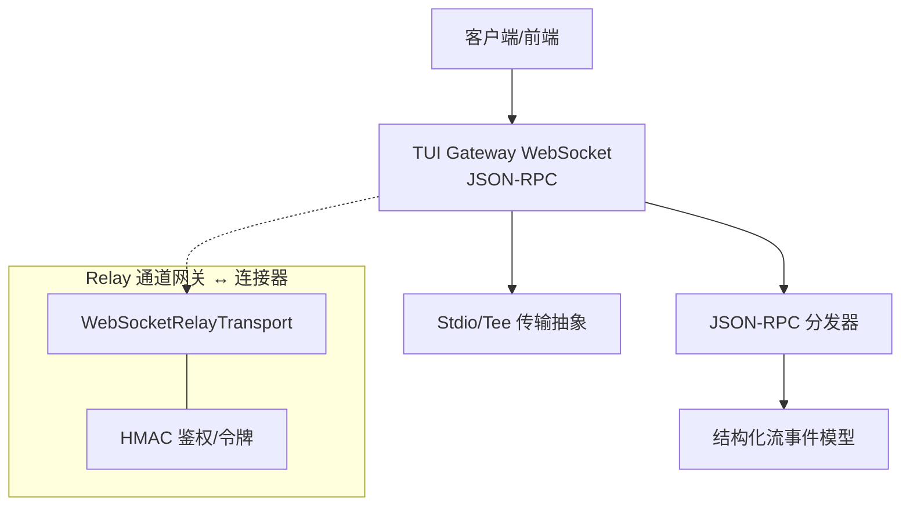
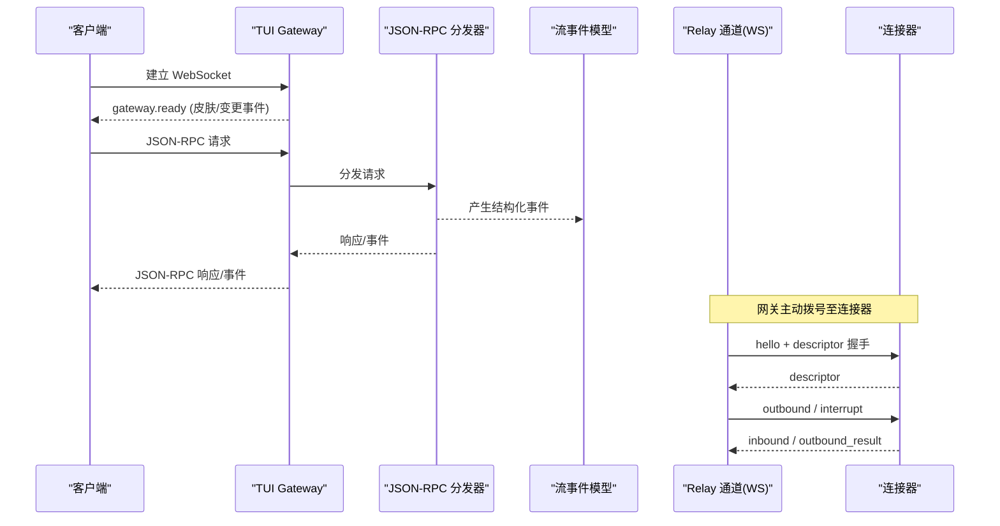
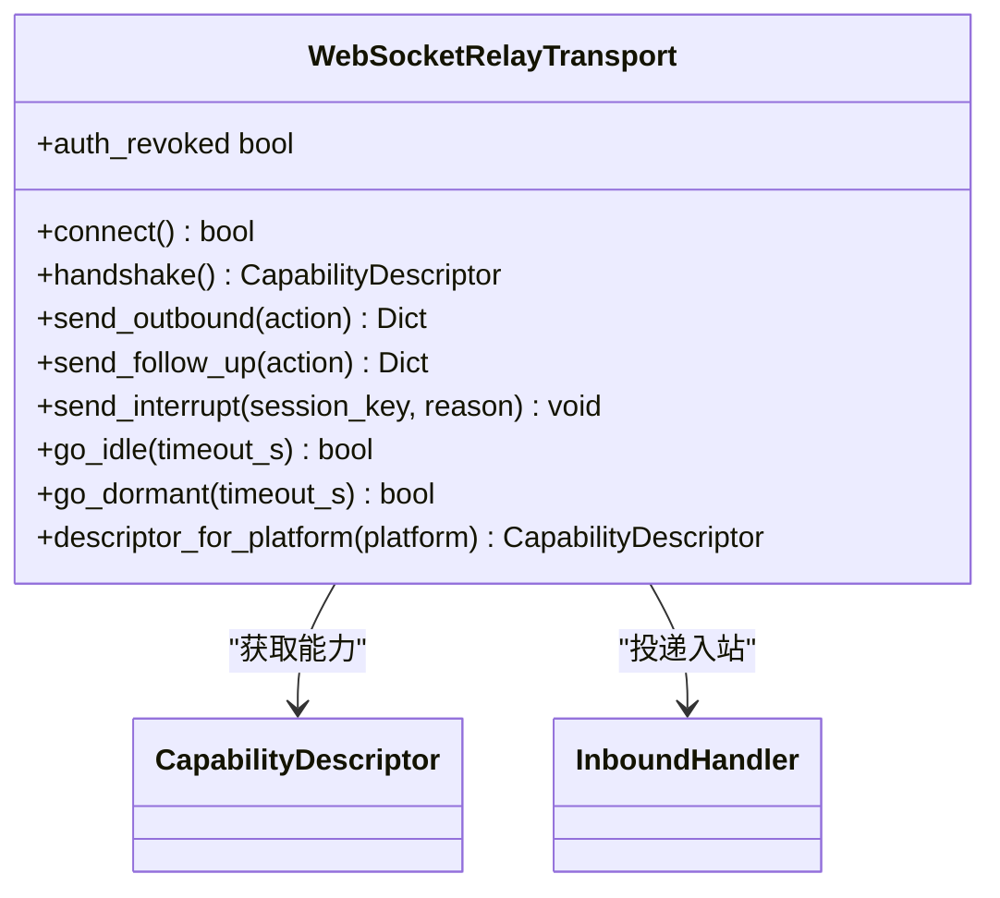
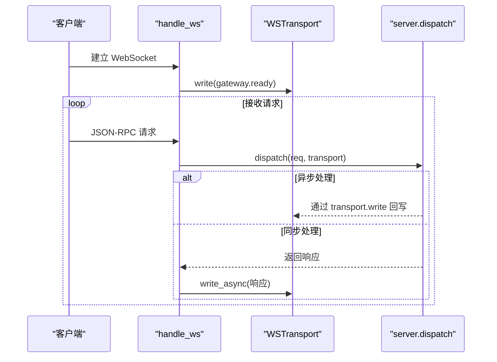
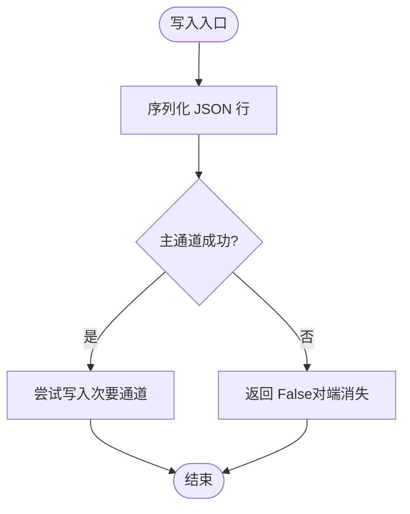
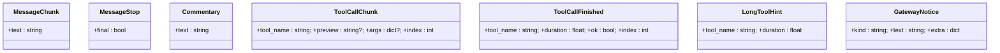
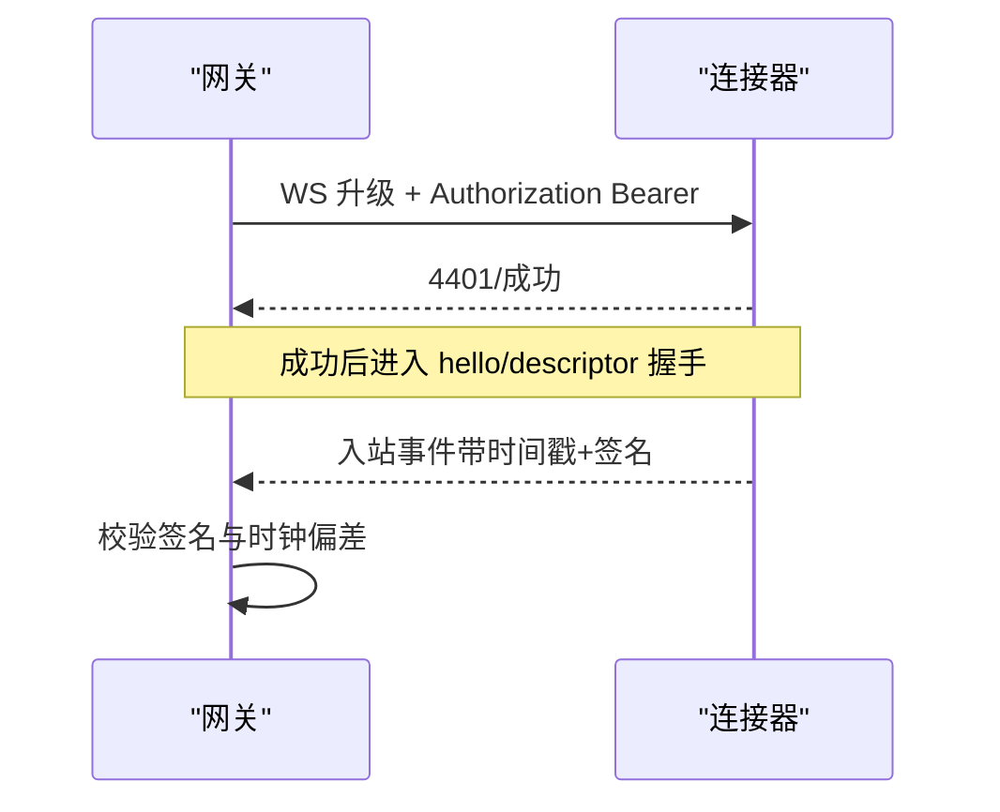
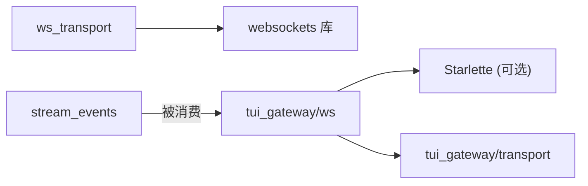
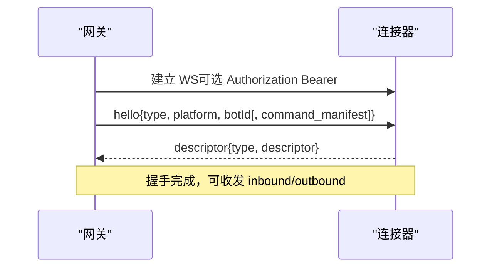

# WebSocket API

<cite>
**本文引用的文件**
- [gateway/relay/ws_transport.py](file://gateway/relay/ws_transport.py)
- [tui_gateway/ws.py](file://tui_gateway/ws.py)
- [tui_gateway/transport.py](file://tui_gateway/transport.py)
- [gateway/stream_events.py](file://gateway/stream_events.py)
- [gateway/relay/auth.py](file://gateway/relay/auth.py)
- [hermes_cli/dashboard_auth/ws_tickets.py](file://hermes_cli/dashboard_auth/ws_tickets.py)
</cite>

## 目录
1. [简介](#简介)
2. [项目结构](#项目结构)
3. [核心组件](#核心组件)
4. [架构总览](#架构总览)
5. [详细组件分析](#详细组件分析)
6. [依赖关系分析](#依赖关系分析)
7. [性能考量](#性能考量)
8. [故障排查指南](#故障排查指南)
9. [结论](#结论)
10. [附录](#附录)

## 简介
本文件面向实现与集成 WebSocket 实时通信的开发者，系统化说明连接建立、握手协议、消息格式、事件类型、连接管理、心跳与重连策略、错误处理、序列化与压缩选项、传输优化、客户端实现指南、调试工具与性能监控方法。文档覆盖两类 WebSocket 通道：
- 网关到连接器（Connector）的 Relay 通道：用于平台消息的入站/出站转发与能力协商。
- TUI Gateway 的 JSON-RPC over WebSocket：用于桌面/Web 客户端与网关之间的双向 RPC 与事件推送。

## 项目结构
仓库中与 WebSocket 相关的核心代码集中在以下模块：
- gateway/relay/ws_transport.py：网关侧与连接器之间的 WebSocket 传输层，定义帧协议、握手、入站/出站路由、重连与鉴权。
- tui_gateway/ws.py：TUI Gateway 的 WebSocket 接入点，复用 JSON-RPC 分发器，提供 ready 事件与流式 token 合并。
- tui_gateway/transport.py：JSON-RPC 传输抽象（stdio 与 WS），统一写入接口与“对端消失”错误语义。
- gateway/stream_events.py：结构化流事件模型（消息片段、工具调用、网关通知等）。
- gateway/relay/auth.py：连接器-网关通道的 HMAC 鉴权与令牌生成/校验。
- hermes_cli/dashboard_auth/ws_tickets.py：仪表板 WS 升级认证的单次票据与内部凭证机制。

图表来源
- [tui_gateway/ws.py:1-477](file://tui_gateway/ws.py#L1-L477)
- [tui_gateway/transport.py:1-220](file://tui_gateway/transport.py#L1-L220)
- [gateway/relay/ws_transport.py:1-903](file://gateway/relay/ws_transport.py#L1-L903)
- [gateway/relay/auth.py:1-169](file://gateway/relay/auth.py#L1-L169)

章节来源
- [tui_gateway/ws.py:1-477](file://tui_gateway/ws.py#L1-L477)
- [tui_gateway/transport.py:1-220](file://tui_gateway/transport.py#L1-L220)
- [gateway/relay/ws_transport.py:1-903](file://gateway/relay/ws_transport.py#L1-L903)
- [gateway/stream_events.py:1-172](file://gateway/stream_events.py#L1-L172)
- [gateway/relay/auth.py:1-169](file://gateway/relay/auth.py#L1-L169)
- [hermes_cli/dashboard_auth/ws_tickets.py:1-162](file://hermes_cli/dashboard_auth/ws_tickets.py#L1-L162)

## 核心组件
- WebSocketRelayTransport：负责与连接器建立 WebSocket 连接、发送 hello/descriptor 握手、收发 inbound/outbound 帧、请求-响应匹配、重连与休眠恢复、授权撤销检测。
- TUI Gateway WSTransport：封装 per-connection 的写路径，支持高并发线程安全写入、token 流式合并、Nagle 禁用、错误关闭与统计。
- Transport 抽象：为 stdio 与 WS 提供统一的 write/close 接口，屏蔽底层差异。
- 结构化流事件：MessageChunk/MessageStop/Commentary/ToolCallChunk/ToolCallFinished/LongToolHint/GatewayNotice，描述 agent→gateway 的呈现层事件。
- 鉴权与票据：连接器-网关通道的 HMAC 升级令牌；仪表板 WS 的单次票据与进程级内部凭证。

章节来源
- [gateway/relay/ws_transport.py:339-903](file://gateway/relay/ws_transport.py#L339-L903)
- [tui_gateway/ws.py:70-256](file://tui_gateway/ws.py#L70-L256)
- [tui_gateway/transport.py:66-220](file://tui_gateway/transport.py#L66-L220)
- [gateway/stream_events.py:41-172](file://gateway/stream_events.py#L41-L172)
- [gateway/relay/auth.py:1-169](file://gateway/relay/auth.py#L1-L169)
- [hermes_cli/dashboard_auth/ws_tickets.py:1-162](file://hermes_cli/dashboard_auth/ws_tickets.py#L1-L162)

## 架构总览
下图展示两条主要通道及其交互：
- 客户端通过 TUI Gateway 的 WebSocket 进行 JSON-RPC 调用与事件订阅。
- 网关通过 Relay 通道与连接器通信，承载平台消息的入站/出站与能力协商。

图表来源
- [tui_gateway/ws.py:286-477](file://tui_gateway/ws.py#L286-L477)
- [gateway/relay/ws_transport.py:441-541](file://gateway/relay/ws_transport.py#L441-L541)

章节来源
- [tui_gateway/ws.py:286-477](file://tui_gateway/ws.py#L286-L477)
- [gateway/relay/ws_transport.py:441-541](file://gateway/relay/ws_transport.py#L441-L541)

## 详细组件分析

### 组件A：Relay 通道（网关 ↔ 连接器）
- 连接建立与握手
  - 规范化 URL（ws/wss，确保路径 /relay）。
  - 可选升级头携带 Authorization Bearer 令牌（HMAC 签名）。
  - 发送 hello（platform/botId，Discord 附加命令清单），等待 descriptor 完成握手。
- 帧协议（换行分隔 JSON）
  - 出站：outbound（send/edit/typing/follow_up）、interrupt。
  - 入站：inbound（标准化 MessageEvent）、outbound_result、interrupt_inbound。
- 请求-响应
  - 每个 outbound 附带 requestId，等待对应 outbound_result。
- 重连与休眠
  - 非预期断开时自动重连（指数退避），支持 go_idle/go_dormant 配合连接器缓冲回放。
  - 4401 授权撤销后停止重连并上报 disabled。
- 入站映射
  - 将 connector 的 normalized payload 映射为 MessageEvent（含上下文、回复引用、平台元数据）。

图表来源
- [gateway/relay/ws_transport.py:339-903](file://gateway/relay/ws_transport.py#L339-L903)

章节来源
- [gateway/relay/ws_transport.py:69-96](file://gateway/relay/ws_transport.py#L69-L96)
- [gateway/relay/ws_transport.py:441-541](file://gateway/relay/ws_transport.py#L441-L541)
- [gateway/relay/ws_transport.py:567-724](file://gateway/relay/ws_transport.py#L567-L724)
- [gateway/relay/ws_transport.py:731-803](file://gateway/relay/ws_transport.py#L731-L803)
- [gateway/relay/ws_transport.py:172-289](file://gateway/relay/ws_transport.py#L172-L289)

### 组件B：TUI Gateway WebSocket（JSON-RPC）
- 连接建立
  - accept 后立即发送 gateway.ready（包含皮肤与变更事件开关）。
  - 注册 live transport 以支持全局广播（如 skin.changed）。
- 消息协议
  - 与 stdio 一致的换行分隔 JSON-RPC。
  - 解析失败返回标准 JSON-RPC 错误。
- 流式 token 合并
  - message.delta/reasoning.delta/thinking.delta 等高频事件按短定时器批量发送，降低事件循环唤醒开销。
- 传输优化
  - 禁用 Nagle 以保持 token 时序。
  - 线程安全的 write 与异步 flush，避免阻塞事件循环。

图表来源
- [tui_gateway/ws.py:286-477](file://tui_gateway/ws.py#L286-L477)
- [tui_gateway/ws.py:70-256](file://tui_gateway/ws.py#L70-L256)

章节来源
- [tui_gateway/ws.py:286-477](file://tui_gateway/ws.py#L286-L477)
- [tui_gateway/ws.py:70-256](file://tui_gateway/ws.py#L70-L256)

### 组件C：传输抽象（stdio/WS 统一）
- Transport 协议：write(obj)->bool，close()->void。
- StdioTransport：处理管道关闭、编码错误、peer gone 错误码，选择性 flush 控制。
- TeeTransport：主通道优先，旁路通道失败不阻塞主路径。

图表来源
- [tui_gateway/transport.py:66-220](file://tui_gateway/transport.py#L66-L220)

章节来源
- [tui_gateway/transport.py:66-220](file://tui_gateway/transport.py#L66-L220)

### 组件D：结构化流事件
- 消息类：MessageChunk（增量文本）、MessageStop（段落/回合结束）、Commentary（完整中间消息）。
- 工具调用类：ToolCallChunk（开始/进行中）、ToolCallFinished（结束，含耗时与结果状态）。
- 控制类：LongToolHint（长任务提示）、GatewayNotice（重启/在线/长运行通知）。

图表来源
- [gateway/stream_events.py:41-172](file://gateway/stream_events.py#L41-L172)

章节来源
- [gateway/stream_events.py:41-172](file://gateway/stream_events.py#L41-L172)

### 组件E：鉴权与票据
- 连接器-网关通道：
  - 升级头携带 Authorization Bearer 令牌（HMAC 签名），支持多密钥轮换验证。
  - 入站 POST 使用 x-relay-timestamp/x-relay-signature 防重放校验。
- 仪表板 WS：
  - 单次票据（TTL=30s）用于浏览器 WS 升级。
  - 进程级内部凭证用于服务端子进程反复连接。

图表来源
- [gateway/relay/auth.py:1-169](file://gateway/relay/auth.py#L1-L169)
- [gateway/relay/ws_transport.py:486-501](file://gateway/relay/ws_transport.py#L486-L501)
- [hermes_cli/dashboard_auth/ws_tickets.py:62-153](file://hermes_cli/dashboard_auth/ws_tickets.py#L62-L153)

章节来源
- [gateway/relay/auth.py:1-169](file://gateway/relay/auth.py#L1-L169)
- [hermes_cli/dashboard_auth/ws_tickets.py:1-162](file://hermes_cli/dashboard_auth/ws_tickets.py#L1-L162)

## 依赖关系分析
- ws_transport 依赖 websockets 库（可选依赖），在缺失时抛出明确错误。
- tui_gateway/ws 依赖 Starlette 的 WebSocketDisconnect（可选导入，降级为通用异常）。
- stream_events 仅定义数据结构，无 I/O 耦合，便于跨线程传递。
- transport 抽象解耦了 stdio 与 WS 的实现细节，便于测试与替换。

图表来源
- [gateway/relay/ws_transport.py:46-51](file://gateway/relay/ws_transport.py#L46-L51)
- [tui_gateway/ws.py:62-67](file://tui_gateway/ws.py#L62-L67)
- [tui_gateway/transport.py:1-220](file://tui_gateway/transport.py#L1-L220)

章节来源
- [gateway/relay/ws_transport.py:46-51](file://gateway/relay/ws_transport.py#L46-L51)
- [tui_gateway/ws.py:62-67](file://tui_gateway/ws.py#L62-L67)
- [tui_gateway/transport.py:1-220](file://tui_gateway/transport.py#L1-L220)

## 性能考量
- 流式 token 合并：message/reasoning/thinking delta 事件按约 33ms 批次发送，显著减少事件循环唤醒次数。
- 禁用 Nagle：保持小帧即时发出，保证 GUI 端看到平滑的打字效果。
- 线程安全写入：从工作线程安全调度到事件循环，避免死锁与阻塞。
- 超时与背压：outbound 请求设置超时；read_loop 中异常快速失败，防止挂起。
- 重连退避：指数退避限制重连风暴；dormant 模式适配容器休眠/唤醒。

[本节为通用指导，无需特定文件引用]

## 故障排查指南
- 连接失败或握手超时
  - 检查连接器 URL 是否已规范化为 ws(s)://.../relay。
  - 确认 Authorization 头是否正确生成与配置。
  - 关注 handshake 超时与 descriptor 未到达的情况。
- 授权撤销（4401）
  - 若握手成功后收到 4401，视为凭证撤销，不再重连。
  - 检查连接器侧是否已停用该实例或密钥轮换导致失效。
- 入站解析错误
  - TUI Gateway 会记录解析失败与负载预览，定位非法 JSON。
- 写入失败与对端消失
  - transport.write 返回 False 表示对端消失；检查网络与客户端生命周期。
- 流式卡顿
  - 检查 token 合并是否生效；确认 Nagle 已禁用；观察事件循环是否被长时间占用。

章节来源
- [gateway/relay/ws_transport.py:486-501](file://gateway/relay/ws_transport.py#L486-L501)
- [gateway/relay/ws_transport.py:745-775](file://gateway/relay/ws_transport.py#L745-L775)
- [tui_gateway/ws.py:359-418](file://tui_gateway/ws.py#L359-L418)
- [tui_gateway/transport.py:114-180](file://tui_gateway/transport.py#L114-L180)

## 结论
本仓库提供了两套成熟的 WebSocket 实现：面向平台集成的 Relay 通道与面向客户端的 TUI Gateway JSON-RPC 通道。两者均具备完善的握手、鉴权、错误处理与性能优化机制。通过结构化流事件与传输抽象，系统在保证可靠性的同时实现了高吞吐与低延迟的实时通信体验。

[本节为总结性内容，无需特定文件引用]

## 附录

### 连接建立与握手流程（Relay 通道）

图表来源
- [gateway/relay/ws_transport.py:441-541](file://gateway/relay/ws_transport.py#L441-L541)

章节来源
- [gateway/relay/ws_transport.py:441-541](file://gateway/relay/ws_transport.py#L441-L541)

### 消息格式与事件类型
- Relay 帧（换行分隔 JSON）
  - hello：{type, platform, botId[, command_manifest]}
  - descriptor：{type, descriptor}
  - inbound：{type, event, bufferId?}
  - outbound：{type, requestId, action[, platform, botId]}
  - outbound_result：{type, requestId, result}
  - interrupt：{type, session_key, reason?}
  - interrupt_inbound：{type, session_key, chat_id}
- TUI Gateway JSON-RPC
  - 请求/响应遵循 JSON-RPC 2.0 规范。
  - 事件：gateway.ready 及后续业务事件。
- 结构化流事件
  - MessageChunk/MessageStop/Commentary/ToolCallChunk/ToolCallFinished/LongToolHint/GatewayNotice。

章节来源
- [gateway/relay/ws_transport.py:1-28](file://gateway/relay/ws_transport.py#L1-L28)
- [gateway/relay/ws_transport.py:567-724](file://gateway/relay/ws_transport.py#L567-L724)
- [tui_gateway/ws.py:1-22](file://tui_gateway/ws.py#L1-L22)
- [gateway/stream_events.py:41-172](file://gateway/stream_events.py#L41-L172)

### 连接管理、心跳与重连策略
- 重连：非预期断开触发重连循环，指数退避；dormant 模式适配容器休眠。
- 心跳：当前实现未显式心跳帧；通过 outbound 请求-响应与 inbound 事件维持活跃。
- 休眠与恢复：go_idle 切换为仅缓冲模式；go_dormant 关闭 socket 并在唤醒后重连。
- 授权撤销：4401 后停止重连并上报 disabled。

章节来源
- [gateway/relay/ws_transport.py:609-679](file://gateway/relay/ws_transport.py#L609-L679)
- [gateway/relay/ws_transport.py:791-803](file://gateway/relay/ws_transport.py#L791-L803)
- [gateway/relay/ws_transport.py:745-775](file://gateway/relay/ws_transport.py#L745-L775)

### 错误处理
- 解析错误：返回 JSON-RPC 错误对象。
- 对端消失：transport.write 返回 False，记录 peer gone 原因。
- 超时：outbound 请求超时返回错误。
- 授权撤销：4401 后终止重连。

章节来源
- [tui_gateway/ws.py:359-418](file://tui_gateway/ws.py#L359-L418)
- [tui_gateway/transport.py:114-180](file://tui_gateway/transport.py#L114-L180)
- [gateway/relay/ws_transport.py:692-724](file://gateway/relay/ws_transport.py#L692-L724)
- [gateway/relay/ws_transport.py:745-775](file://gateway/relay/ws_transport.py#L745-L775)

### 序列化格式、压缩与传输优化
- 序列化：JSON 字符串 + 换行分隔；ensure_ascii=False 保留 Unicode。
- 压缩：当前实现未启用应用层压缩；可通过 TLS（wss）利用传输层压缩（取决于部署）。
- 优化：token 合并、禁用 Nagle、批量发送、线程安全写入与异步 flush。

章节来源
- [tui_gateway/ws.py:118-212](file://tui_gateway/ws.py#L118-L212)
- [tui_gateway/ws.py:268-284](file://tui_gateway/ws.py#L268-L284)
- [tui_gateway/transport.py:133-180](file://tui_gateway/transport.py#L133-L180)

### 客户端实现指南
- TUI Gateway 客户端
  - 建立 WebSocket 连接，接收 gateway.ready。
  - 发送 JSON-RPC 请求，处理响应与事件。
  - 订阅 message.delta 等流式事件，注意合并与渲染顺序。
- Relay 通道（连接器集成）
  - 使用 ws_transport 提供的 connect/handshake/send_outbound 等方法。
  - 处理 inbound 事件与 outbound_result 回调。
  - 实现重连与鉴权逻辑（Authorization 头与票据）。

章节来源
- [tui_gateway/ws.py:286-477](file://tui_gateway/ws.py#L286-L477)
- [gateway/relay/ws_transport.py:441-724](file://gateway/relay/ws_transport.py#L441-L724)
- [hermes_cli/dashboard_auth/ws_tickets.py:62-153](file://hermes_cli/dashboard_auth/ws_tickets.py#L62-L153)

### 调试工具与性能监控
- 日志与指标
  - TUI Gateway 记录消息数、解析错误、分发崩溃、发送失败、会话回收等。
  - Relay 通道记录读循环异常、重连、授权撤销等。
- 诊断建议
  - 开启详细日志，捕获负载预览。
  - 监控 token 合并频率与发送延迟。
  - 检查重连次数与退避曲线，识别不稳定链路。

章节来源
- [tui_gateway/ws.py:429-477](file://tui_gateway/ws.py#L429-L477)
- [gateway/relay/ws_transport.py:745-775](file://gateway/relay/ws_transport.py#L745-L775)