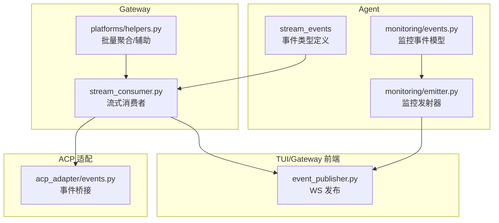
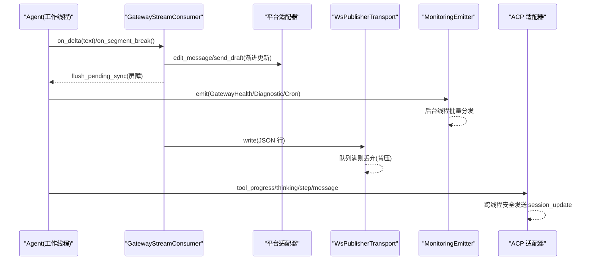
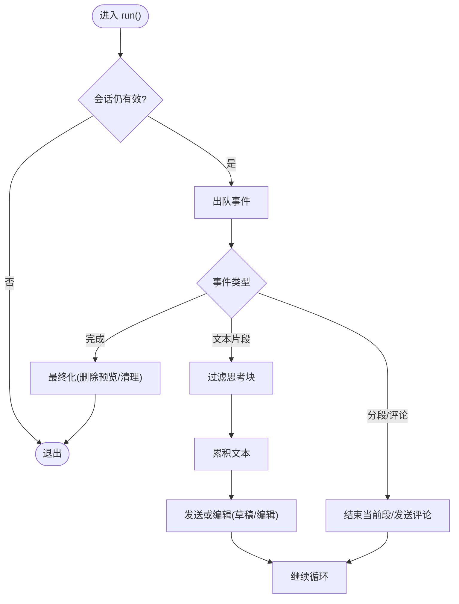
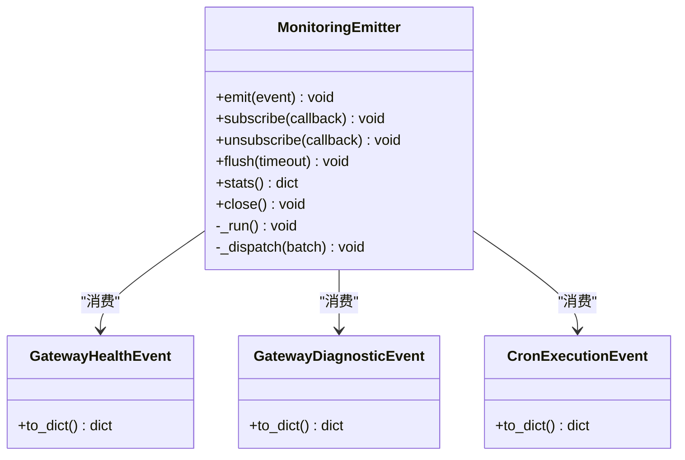
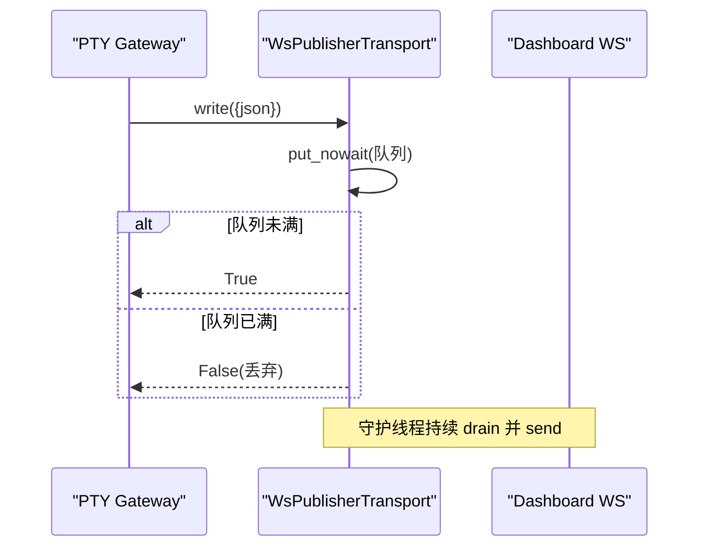
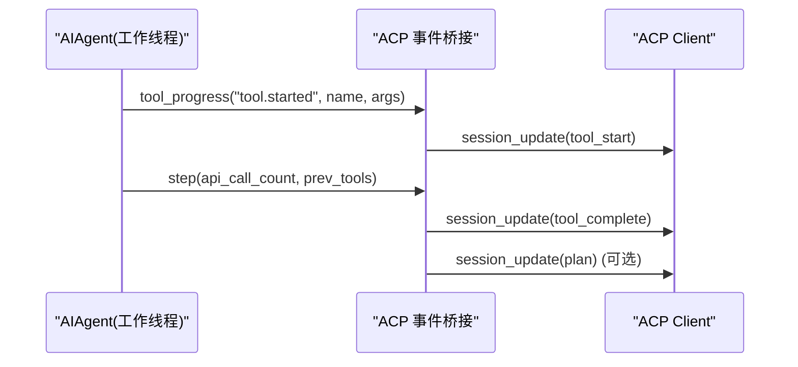
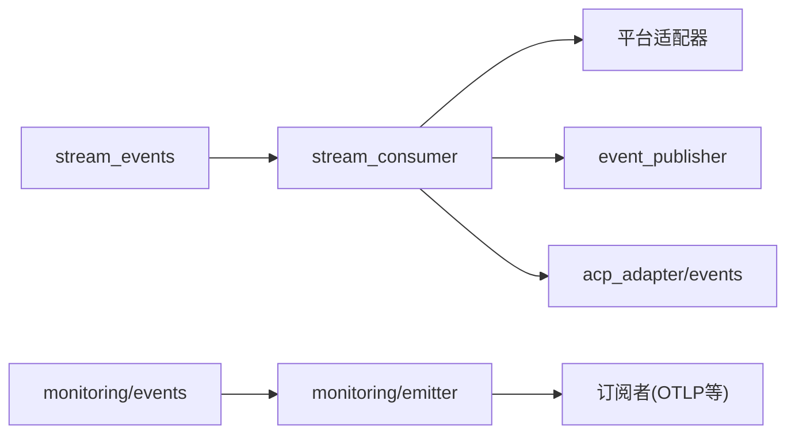

# 事件生命周期

<cite>
**本文引用的文件**
- [gateway/stream_events.py](file://gateway/stream_events.py)
- [gateway/stream_consumer.py](file://gateway/stream_consumer.py)
- [agent/monitoring/events.py](file://agent/monitoring/events.py)
- [agent/monitoring/emitter.py](file://agent/monitoring/emitter.py)
- [tui_gateway/event_publisher.py](file://tui_gateway/event_publisher.py)
- [acp_adapter/events.py](file://acp_adapter/events.py)
- [gateway/platforms/helpers.py](file://gateway/platforms/helpers.py)
</cite>

## 目录
1. [简介](#简介)
2. [项目结构](#项目结构)
3. [核心组件](#核心组件)
4. [架构总览](#架构总览)
5. [详细组件分析](#详细组件分析)
6. [依赖关系分析](#依赖关系分析)
7. [性能考量](#性能考量)
8. [故障排查指南](#故障排查指南)
9. [结论](#结论)
10. [附录](#附录)

## 简介
本文件系统性梳理 Hermes Agent 中“事件”的完整生命周期：从产生、序列化、传输、反序列化到消费处理。重点覆盖以下方面：
- 事件创建与类型契约（流式消息、工具调用、网关控制等）
- 跨线程/跨进程队列与背压机制
- 内存优化策略（缓冲、丢弃、批处理）
- 持久化与故障恢复（以历史与状态为主，流式事件不持久化）
- 性能监控指标与可观测性
- 调试工具与性能分析方法

## 项目结构
围绕事件生命周期的关键代码分布在如下模块：
- 事件定义与契约：gateway/stream_events.py
- 流式消费与平台投递：gateway/stream_consumer.py
- 监控事件与发射器：agent/monitoring/events.py、agent/monitoring/emitter.py
- TUI 侧事件发布（WebSocket）：tui_gateway/event_publisher.py
- ACP 适配器事件桥接：acp_adapter/events.py
- 平台层通用辅助（批量聚合等）：gateway/platforms/helpers.py

**图表来源**
- [gateway/stream_events.py:1-172](file://gateway/stream_events.py#L1-L172)
- [gateway/stream_consumer.py:156-800](file://gateway/stream_consumer.py#L156-L800)
- [agent/monitoring/events.py:1-87](file://agent/monitoring/events.py#L1-L87)
- [agent/monitoring/emitter.py:1-212](file://agent/monitoring/emitter.py#L1-L212)
- [tui_gateway/event_publisher.py:1-127](file://tui_gateway/event_publisher.py#L1-L127)
- [acp_adapter/events.py:1-280](file://acp_adapter/events.py#L1-L280)
- [gateway/platforms/helpers.py:130-180](file://gateway/platforms/helpers.py#L130-L180)

**章节来源**
- [gateway/stream_events.py:1-172](file://gateway/stream_events.py#L1-L172)
- [gateway/stream_consumer.py:156-800](file://gateway/stream_consumer.py#L156-L800)
- [agent/monitoring/events.py:1-87](file://agent/monitoring/events.py#L1-L87)
- [agent/monitoring/emitter.py:1-212](file://agent/monitoring/emitter.py#L1-L212)
- [tui_gateway/event_publisher.py:1-127](file://tui_gateway/event_publisher.py#L1-L127)
- [acp_adapter/events.py:1-280](file://acp_adapter/events.py#L1-L280)
- [gateway/platforms/helpers.py:130-180](file://gateway/platforms/helpers.py#L130-L180)

## 核心组件
- 流式事件契约：MessageChunk、MessageStop、Commentary、ToolCallChunk、ToolCallFinished、LongToolHint、GatewayNotice 等，描述“发生了什么”，不绑定具体平台渲染。
- 流式消费者 GatewayStreamConsumer：将同步回调转换为异步任务，负责缓冲、速率限制、渐进式编辑或原生草稿流式更新，并处理溢出、回退、去重与最终一致性。
- 监控事件与发射器：GatewayHealthEvent、GatewayDiagnosticEvent、CronExecutionEvent 通过 MonitoringEmitter 非阻塞入队，后台线程批量分发至订阅者（如 OTLP 导出）。
- TUI 事件发布：WsPublisherTransport 使用 WebSocket 将 PTY 侧 gateway 的事件镜像到仪表盘，采用行分隔 JSON，具备队列背压与失败短路。
- ACP 事件桥接：将 AIAgent 的工具进度、思考、步骤、消息等回调映射为 ACP session_update，跨线程安全发送。
- 平台辅助：TextBatchAggregator 对同 key 的消息进行延迟合并与分批派发，降低抖动与重复。

**章节来源**
- [gateway/stream_events.py:41-159](file://gateway/stream_events.py#L41-L159)
- [gateway/stream_consumer.py:156-800](file://gateway/stream_consumer.py#L156-L800)
- [agent/monitoring/events.py:19-79](file://agent/monitoring/events.py#L19-L79)
- [agent/monitoring/emitter.py:36-158](file://agent/monitoring/emitter.py#L36-L158)
- [tui_gateway/event_publisher.py:40-127](file://tui_gateway/event_publisher.py#L40-L127)
- [acp_adapter/events.py:114-280](file://acp_adapter/events.py#L114-L280)
- [gateway/platforms/helpers.py:130-180](file://gateway/platforms/helpers.py#L130-L180)

## 架构总览
下图展示事件从产生到消费的端到端流程，包括流式消息、工具调用、监控事件与 TUI 发布。

**图表来源**
- [gateway/stream_consumer.py:590-800](file://gateway/stream_consumer.py#L590-L800)
- [agent/monitoring/emitter.py:53-158](file://agent/monitoring/emitter.py#L53-L158)
- [tui_gateway/event_publisher.py:90-127](file://tui_gateway/event_publisher.py#L90-L127)
- [acp_adapter/events.py:114-280](file://acp_adapter/events.py#L114-L280)

## 详细组件分析

### 事件类型与契约（stream_events）
- 设计约束：事件仅描述“传输层”语义，不承载上下文；历史由 Agent 维护，事件是呈现层流。
- 事件族：
  - 消息片段与停止：MessageChunk、MessageStop、Commentary
  - 工具调用：ToolCallChunk、ToolCallFinished
  - 网关控制：LongToolHint、GatewayNotice
- 优势：解耦 Agent 与平台渲染，便于多平台差异化呈现与向后兼容。

**章节来源**
- [gateway/stream_events.py:1-33](file://gateway/stream_events.py#L1-L33)
- [gateway/stream_events.py:41-159](file://gateway/stream_events.py#L41-L159)

### 流式消费者（GatewayStreamConsumer）
- 职责：接收同步回调，入队异步任务，按配置进行缓冲、限速、渐进编辑或原生草稿流式更新。
- 关键能力：
  - 分段与评论：on_segment_break/on_commentary 支持工具边界与中间提示
  - 防抖与回退：自适应编辑间隔、洪水控制、溢出拆分与回退路径
  - 最终一致性：记录已送达文本，避免重复发送；支持“新鲜最终消息”策略
  - 思考块过滤：屏蔽 <think>...</think> 等标签，保证用户可见内容干净
  - 屏障同步：flush_pending_sync 确保在阻塞交互前完成前置输出
- 背压与内存：
  - queue.Queue 作为线程安全缓冲
  - 自适应编辑间隔与阈值控制减少频繁网络调用
  - 溢出时拆分为多条消息，保留完整账本用于最终校验

**图表来源**
- [gateway/stream_consumer.py:760-800](file://gateway/stream_consumer.py#L760-L800)
- [gateway/stream_consumer.py:590-759](file://gateway/stream_consumer.py#L590-L759)

**章节来源**
- [gateway/stream_consumer.py:127-323](file://gateway/stream_consumer.py#L127-L323)
- [gateway/stream_consumer.py:590-800](file://gateway/stream_consumer.py#L590-L800)

### 监控事件与发射器（monitoring）
- 事件模型：GatewayHealthEvent、GatewayDiagnosticEvent、CronExecutionEvent，均为无敏感内容的健康/诊断/定时任务投影。
- 发射器特性：
  - emit() 必须 O(微秒) 返回，永不阻塞、永不抛异常
  - 环形队列最大容量，满时丢弃最旧事件，计数 dropped
  - 后台线程批量分发至订阅者（OTLP），每个订阅者隔离失败
  - 支持 subscribe/unsubscribe、flush、stats、close

**图表来源**
- [agent/monitoring/emitter.py:36-158](file://agent/monitoring/emitter.py#L36-L158)
- [agent/monitoring/events.py:19-79](file://agent/monitoring/events.py#L19-L79)

**章节来源**
- [agent/monitoring/events.py:1-87](file://agent/monitoring/events.py#L1-L87)
- [agent/monitoring/emitter.py:1-212](file://agent/monitoring/emitter.py#L1-L212)

### TUI 事件发布（event_publisher）
- 作用：PTY 侧 gateway 将工具/推理/状态事件通过 WebSocket 镜像到仪表盘 /api/events。
- 协议：换行分隔的 JSON 字典，无额外信封。
- 背压与健壮性：
  - 内部队列最大长度，写满时直接丢弃并返回 False
  - 失败短路：连接断开后后续写入直接失败，避免阻塞主循环
  - 独立守护线程 drain，write 立即返回

**图表来源**
- [tui_gateway/event_publisher.py:40-127](file://tui_gateway/event_publisher.py#L40-L127)

**章节来源**
- [tui_gateway/event_publisher.py:1-127](file://tui_gateway/event_publisher.py#L1-L127)

### ACP 事件桥接（acp_adapter/events）
- 作用：将 AIAgent 的回调（工具进度、思考、步骤、消息）转换为 ACP session_update，跨线程安全发送到编辑器。
- 关键点：
  - 工具开始/完成：维护每工具名称的 FIFO 队列，匹配 start/complete
  - 编辑快照：对特定工具捕获本地编辑快照，支持自动审批策略
  - 计划更新：todo 工具结果可映射为 ACP plan 面板条目
  - 跨线程：使用 safe_schedule_threadsafe 调度到主事件循环

**图表来源**
- [acp_adapter/events.py:114-280](file://acp_adapter/events.py#L114-L280)

**章节来源**
- [acp_adapter/events.py:1-280](file://acp_adapter/events.py#L1-L280)

### 平台辅助与批量聚合（helpers）
- TextBatchAggregator：对同一 key 的事件进行延迟合并，减少抖动与重复派发；当检测到可能的拆分消息时使用更长延迟。
- 用途：在平台层聚合相近的消息，提升用户体验与降低网络压力。

**章节来源**
- [gateway/platforms/helpers.py:130-180](file://gateway/platforms/helpers.py#L130-L180)

## 依赖关系分析
- 松耦合：事件类型与消费逻辑分离，平台适配器决定如何呈现。
- 线程/进程边界：
  - Agent 工作线程 -> GatewayStreamConsumer 队列 -> 异步任务
  - 监控事件 -> 后台线程 -> 订阅者
  - PTY Gateway -> WsPublisherTransport -> Dashboard WS
- 外部依赖：
  - 平台适配器接口（edit_message/send_draft）
  - WebSocket 库（websockets）
  - ACP SDK（acp）

**图表来源**
- [gateway/stream_events.py:1-172](file://gateway/stream_events.py#L1-L172)
- [gateway/stream_consumer.py:156-800](file://gateway/stream_consumer.py#L156-L800)
- [agent/monitoring/events.py:1-87](file://agent/monitoring/events.py#L1-L87)
- [agent/monitoring/emitter.py:1-212](file://agent/monitoring/emitter.py#L1-L212)
- [tui_gateway/event_publisher.py:1-127](file://tui_gateway/event_publisher.py#L1-L127)
- [acp_adapter/events.py:1-280](file://acp_adapter/events.py#L1-L280)

**章节来源**
- [gateway/stream_events.py:1-172](file://gateway/stream_events.py#L1-L172)
- [gateway/stream_consumer.py:156-800](file://gateway/stream_consumer.py#L156-L800)
- [agent/monitoring/events.py:1-87](file://agent/monitoring/events.py#L1-L87)
- [agent/monitoring/emitter.py:1-212](file://agent/monitoring/emitter.py#L1-L212)
- [tui_gateway/event_publisher.py:1-127](file://tui_gateway/event_publisher.py#L1-L127)
- [acp_adapter/events.py:1-280](file://acp_adapter/events.py#L1-L280)

## 性能考量
- 背压与丢弃策略：
  - 监控发射器：队列满时丢弃最旧事件，保持 newest-wins，统计 dropped
  - TUI 发布：队列满时丢弃并返回 False，避免阻塞
- 缓冲与批处理：
  - 流式消费者：基于阈值与时间间隔的渐进编辑，减少频繁网络调用
  - 平台辅助：TextBatchAggregator 延迟合并，降低抖动
- 内存优化：
  - 事件为冻结数据类，轻量构造
  - 流式消费者维护分段账本与预览 ID 集合，及时清理
  - 监控事件无敏感内容，避免大对象常驻
- 可观测性指标：
  - 监控发射器 stats：queued、dispatched、dropped、subscribers
  - 流式消费者：final_response_sent、final_content_delivered、already_sent 等状态

[本节为通用性能讨论，不直接分析具体文件]

## 故障排查指南
- 流式卡顿或重复：
  - 检查 GatewayStreamConsumer 的 already_sent/final_response_sent 状态
  - 确认 flush_pending_sync 是否成功设置屏障
  - 查看是否有洪水控制导致的编辑禁用
- 监控事件丢失：
  - 检查 MonitoringEmitter.stats 中的 dropped 计数
  - 确认订阅者是否正常注册且未抛出异常
- TUI 事件未显示：
  - 检查 WsPublisherTransport.write 返回值是否为 True
  - 确认 WebSocket 连接是否存活，失败会短路后续写入
- ACP 工具调用不匹配：
  - 检查 per-tool-name 的 FIFO 队列是否正确维护 start/complete
  - 确认跨线程发送是否超时或失败

**章节来源**
- [gateway/stream_consumer.py:502-550](file://gateway/stream_consumer.py#L502-L550)
- [agent/monitoring/emitter.py:152-158](file://agent/monitoring/emitter.py#L152-L158)
- [tui_gateway/event_publisher.py:90-127](file://tui_gateway/event_publisher.py#L90-L127)
- [acp_adapter/events.py:114-280](file://acp_adapter/events.py#L114-L280)

## 结论
Hermes Agent 的事件体系通过明确的事件契约、异步消费者、监控发射器与 TUI 发布通道，实现了高内聚、低耦合的事件生命周期管理。其背压、缓冲与批处理策略保障了在高吞吐场景下的稳定性与性能。结合可观测性与调试手段，可有效定位问题并优化体验。

[本节为总结性内容，不直接分析具体文件]

## 附录
- 事件类型清单与用途见 stream_events
- 监控事件模型与发射器 API 见 monitoring/events.py 与 monitoring/emitter.py
- TUI 发布协议与行为见 event_publisher.py
- ACP 事件映射与跨线程发送见 acp_adapter/events.py
- 平台层批量聚合见 platforms/helpers.py

[本节为索引性内容，不直接分析具体文件]