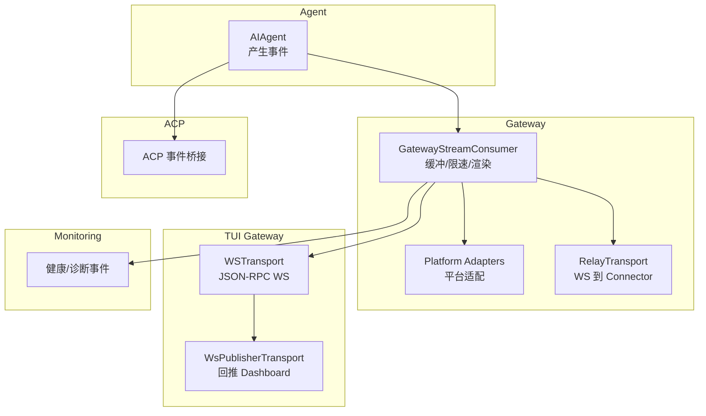
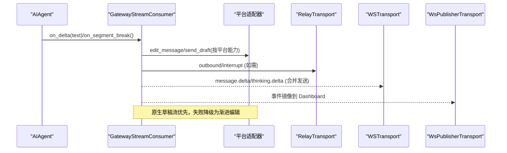
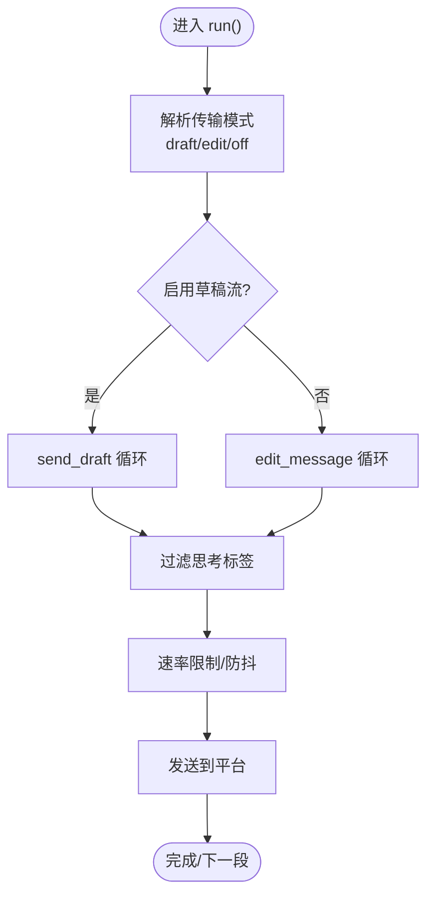
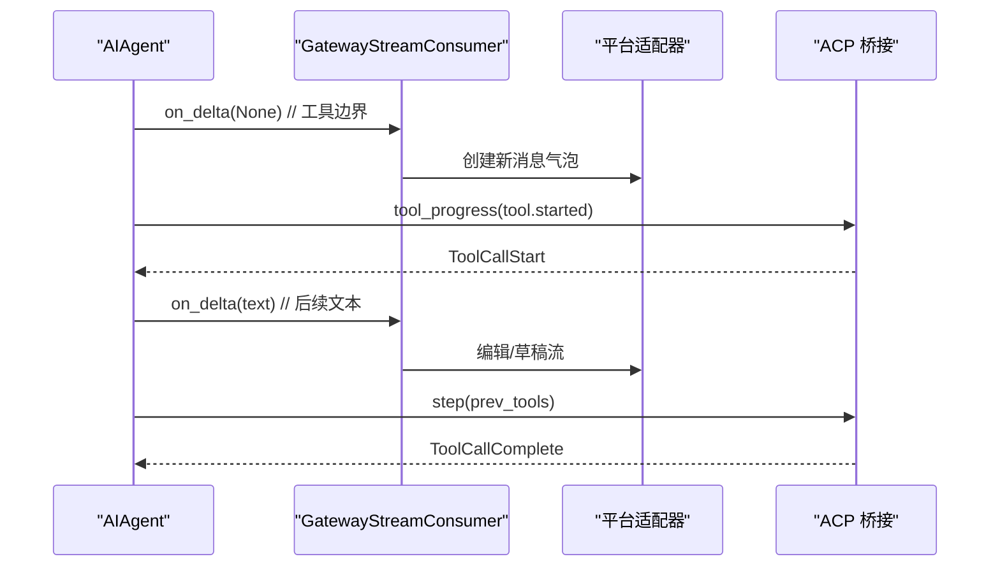
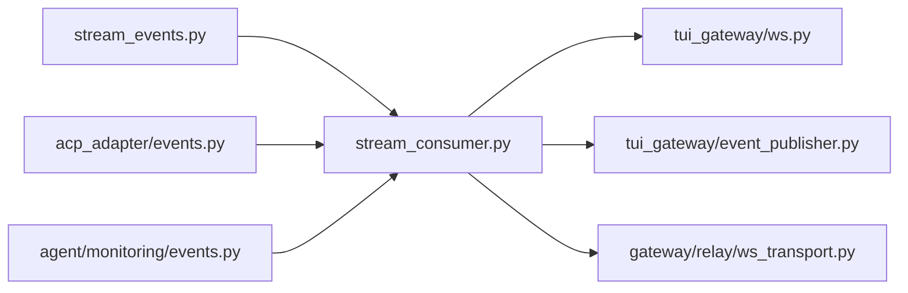

# 事件系统

<cite>
**本文引用的文件**
- [gateway/stream_events.py](file://gateway/stream_events.py)
- [gateway/stream_consumer.py](file://gateway/stream_consumer.py)
- [tui_gateway/ws.py](file://tui_gateway/ws.py)
- [tui_gateway/event_publisher.py](file://tui_gateway/event_publisher.py)
- [gateway/relay/ws_transport.py](file://gateway/relay/ws_transport.py)
- [acp_adapter/events.py](file://acp_adapter/events.py)
- [agent/monitoring/events.py](file://agent/monitoring/events.py)
</cite>

## 目录
1. [简介](#简介)
2. [项目结构](#项目结构)
3. [核心组件](#核心组件)
4. [架构总览](#架构总览)
5. [详细组件分析](#详细组件分析)
6. [依赖关系分析](#依赖关系分析)
7. [性能考量](#性能考量)
8. [故障排查指南](#故障排查指南)
9. [结论](#结论)
10. [附录](#附录)

## 简介
本文件面向 Hermes Agent 的 WebSocket 事件系统与实时推送机制，聚焦以下目标：
- 统一事件类型与分类（用户交互、系统通知、状态更新）
- 事件订阅模式与过滤规则
- 典型处理流程（消息流、工具调用、网关控制）
- 监听器注册、处理器实现与错误处理示例
- 事件优先级、队列管理与持久化策略
- 调试工具、监控指标与性能分析方法

该系统的核心思想是“结构化事件 + 异步消费者 + 平台适配”：Agent 侧产生轻量、不可变的事件对象；Gateway 通过消费者进行缓冲、限速与渲染；各平台适配器决定最终呈现方式。WebSocket 负责将事件从 TUI Gateway 或 Relay 传输到客户端或连接器。

## 项目结构
围绕事件与 WebSocket 的关键模块分布如下：
- 事件定义：gateway/stream_events.py 提供统一的流式事件类型
- 流式消费：gateway/stream_consumer.py 将同步回调转为异步投递，支持原生草稿流与渐进编辑
- TUI WebSocket：tui_gateway/ws.py 提供 JSON-RPC 风格的 WS 传输，含高频 token 合并
- TUI 事件发布：tui_gateway/event_publisher.py 将 PTY 侧事件回推到 Dashboard
- 中继传输：gateway/relay/ws_transport.py 实现 Gateway 与 Connector 的 WS 双向通信
- ACP 桥接：acp_adapter/events.py 将 AIAgent 事件转换为 ACP 通知
- 监控事件：agent/monitoring/events.py 提供健康与诊断事件

**图示来源**
- [gateway/stream_events.py:1-172](file://gateway/stream_events.py#L1-L172)
- [gateway/stream_consumer.py:156-800](file://gateway/stream_consumer.py#L156-L800)
- [tui_gateway/ws.py:70-256](file://tui_gateway/ws.py#L70-L256)
- [tui_gateway/event_publisher.py:40-127](file://tui_gateway/event_publisher.py#L40-L127)
- [gateway/relay/ws_transport.py:339-730](file://gateway/relay/ws_transport.py#L339-L730)
- [acp_adapter/events.py:114-280](file://acp_adapter/events.py#L114-L280)
- [agent/monitoring/events.py:19-87](file://agent/monitoring/events.py#L19-L87)

**章节来源**
- [gateway/stream_events.py:1-172](file://gateway/stream_events.py#L1-L172)
- [gateway/stream_consumer.py:156-800](file://gateway/stream_consumer.py#L156-L800)
- [tui_gateway/ws.py:70-256](file://tui_gateway/ws.py#L70-L256)
- [tui_gateway/event_publisher.py:40-127](file://tui_gateway/event_publisher.py#L40-L127)
- [gateway/relay/ws_transport.py:339-730](file://gateway/relay/ws_transport.py#L339-L730)
- [acp_adapter/events.py:114-280](file://acp_adapter/events.py#L114-L280)
- [agent/monitoring/events.py:19-87](file://agent/monitoring/events.py#L19-L87)

## 核心组件
- 事件模型（stream_events）：MessageChunk、MessageStop、Commentary、ToolCallChunk、ToolCallFinished、LongToolHint、GatewayNotice
- 流消费者（stream_consumer）：GatewayStreamConsumer，负责线程安全入队、异步消费、平台编辑/草稿流、去重与溢出处理
- TUI WebSocket（ws）：WSTransport，支持高频 token 帧合并、顺序保证、超时保护
- TUI 事件发布（event_publisher）：WsPublisherTransport，守护线程写入、队列满丢弃、连接失败短路
- 中继传输（relay/ws_transport）：WebSocketRelayTransport，hello/descriptor/inbound/outbound/interrupt 协议，自动重连、休眠/唤醒、鉴权撤销处理
- ACP 桥接（acp_adapter/events）：工具开始/完成、思考文本、步骤推进、计划更新
- 监控事件（monitoring/events）：GatewayHealthEvent、GatewayDiagnosticEvent、CronExecutionEvent

**章节来源**
- [gateway/stream_events.py:41-159](file://gateway/stream_events.py#L41-L159)
- [gateway/stream_consumer.py:127-323](file://gateway/stream_consumer.py#L127-L323)
- [tui_gateway/ws.py:70-256](file://tui_gateway/ws.py#L70-L256)
- [tui_gateway/event_publisher.py:40-127](file://tui_gateway/event_publisher.py#L40-L127)
- [gateway/relay/ws_transport.py:339-730](file://gateway/relay/ws_transport.py#L339-L730)
- [acp_adapter/events.py:114-280](file://acp_adapter/events.py#L114-L280)
- [agent/monitoring/events.py:19-87](file://agent/monitoring/events.py#L19-L87)

## 架构总览
下图展示从 Agent 到平台/客户端的端到端事件流：

**图示来源**
- [gateway/stream_consumer.py:760-800](file://gateway/stream_consumer.py#L760-L800)
- [tui_gateway/ws.py:118-187](file://tui_gateway/ws.py#L118-L187)
- [tui_gateway/event_publisher.py:90-127](file://tui_gateway/event_publisher.py#L90-L127)
- [gateway/relay/ws_transport.py:567-607](file://gateway/relay/ws_transport.py#L567-L607)

## 详细组件分析

### 事件类型与分类
- 用户交互事件
  - 工具调用开始/结束：ToolCallChunk、ToolCallFinished
  - 中间评论：Commentary（在工具迭代之间完整消息）
- 系统通知事件
  - 网关控制：GatewayNotice（restart/online/long_run 等）
  - 长任务提示：LongToolHint（一次性引导）
- 状态更新事件
  - 消息增量：MessageChunk（流式片段）
  - 消息停止：MessageStop（final=True 表示本轮结束）

这些事件是纯数据类，无行为与 I/O，便于跨线程/异步边界传递。

**章节来源**
- [gateway/stream_events.py:41-159](file://gateway/stream_events.py#L41-L159)

### 事件订阅模式与过滤规则
- 订阅入口
  - Agent 通过 stream_delta_callback/on_segment_break/on_commentary 向 GatewayStreamConsumer 提交事件
  - 消费者内部使用 queue.Queue 接收并异步处理
- 过滤规则
  - 推理/思考标签过滤：消费者维护状态机，屏蔽 <think>/</think> 等标签内容
  - 平台能力选择：根据 chat_type 与 supports_draft_streaming 决定是否使用原生草稿流
  - 去重与防抖：记录 last_sent_text，避免重复编辑；自适应编辑间隔应对限流

**图示来源**
- [gateway/stream_consumer.py:760-800](file://gateway/stream_consumer.py#L760-L800)
- [gateway/stream_consumer.py:614-758](file://gateway/stream_consumer.py#L614-L758)

**章节来源**
- [gateway/stream_consumer.py:127-323](file://gateway/stream_consumer.py#L127-L323)
- [gateway/stream_consumer.py:614-758](file://gateway/stream_consumer.py#L614-L758)

### 处理流程示例

#### 用户交互事件（工具调用）

**图示来源**
- [acp_adapter/events.py:114-182](file://acp_adapter/events.py#L114-L182)
- [acp_adapter/events.py:209-259](file://acp_adapter/events.py#L209-L259)
- [gateway/stream_consumer.py:493-604](file://gateway/stream_consumer.py#L493-L604)

**章节来源**
- [acp_adapter/events.py:114-259](file://acp_adapter/events.py#L114-L259)
- [gateway/stream_consumer.py:493-604](file://gateway/stream_consumer.py#L493-L604)

#### 系统通知事件（网关控制）
- GatewayNotice 用于重启、在线、长运行提示等控制消息
- 由网关侧生成并通过消费者或中继通道下发

**章节来源**
- [gateway/stream_events.py:134-145](file://gateway/stream_events.py#L134-L145)

#### 状态更新事件（消息流）
- MessageChunk 携带增量文本，消费者累积并逐步渲染
- MessageStop 标记段落结束，final=True 表示整轮结束

**章节来源**
- [gateway/stream_events.py:43-68](file://gateway/stream_events.py#L43-L68)
- [gateway/stream_consumer.py:760-800](file://gateway/stream_consumer.py#L760-L800)

### 监听器注册、处理器实现与错误处理示例
- 监听器注册
  - 将 consumer.on_delta、consumer.on_segment_break、consumer.on_commentary 作为回调传入 Agent
  - 启动 consumer.run() 作为 asyncio 任务
- 处理器实现
  - 消费者内部维护 think-block 过滤器、草稿流状态、溢出拆分、去重逻辑
  - 平台适配器决定具体渲染（Telegram MarkdownV2、Discord 富文本等）
- 错误处理
  - WSTransport.write 对非流式帧立即刷新，流式帧合并后批量发送；写超时不永久关闭连接
  - WsPublisherTransport 在队列满时丢弃事件，连接失败短路
  - RelayTransport 在 4401 授权撤销后停止重连，避免无效重试

**章节来源**
- [gateway/stream_consumer.py:156-323](file://gateway/stream_consumer.py#L156-L323)
- [tui_gateway/ws.py:118-187](file://tui_gateway/ws.py#L118-L187)
- [tui_gateway/event_publisher.py:90-127](file://tui_gateway/event_publisher.py#L90-L127)
- [gateway/relay/ws_transport.py:731-775](file://gateway/relay/ws_transport.py#L731-L775)

### 事件优先级、队列管理与持久化
- 优先级
  - 非流式帧（RPC 响应、控制帧）优先于流式 token 帧发送，确保顺序正确
  - 流式 token 帧按时间窗口合并，约 30fps 刷新
- 队列管理
  - GatewayStreamConsumer 使用 queue.Queue 缓冲 delta/commentary/segment_break
  - WsPublisherTransport 使用固定容量队列，满则丢弃
  - RelayTransport 使用 pending futures 管理 outbound 请求响应
- 持久化
  - 事件本身不持久化到对话历史；历史由 Agent 侧维护
  - 中继层支持 go_idle/go_dormant 与 inbound_ack，确保断线重连后的可靠回放

**章节来源**
- [tui_gateway/ws.py:44-60](file://tui_gateway/ws.py#L44-L60)
- [tui_gateway/event_publisher.py:37-101](file://tui_gateway/event_publisher.py#L37-L101)
- [gateway/relay/ws_transport.py:609-690](file://gateway/relay/ws_transport.py#L609-L690)
- [gateway/stream_events.py:23-33](file://gateway/stream_events.py#L23-L33)

## 依赖关系分析

**图示来源**
- [gateway/stream_events.py:1-172](file://gateway/stream_events.py#L1-L172)
- [gateway/stream_consumer.py:1-800](file://gateway/stream_consumer.py#L1-L800)
- [tui_gateway/ws.py:1-477](file://tui_gateway/ws.py#L1-L477)
- [tui_gateway/event_publisher.py:1-127](file://tui_gateway/event_publisher.py#L1-L127)
- [gateway/relay/ws_transport.py:1-903](file://gateway/relay/ws_transport.py#L1-L903)
- [acp_adapter/events.py:1-280](file://acp_adapter/events.py#L1-L280)
- [agent/monitoring/events.py:1-87](file://agent/monitoring/events.py#L1-L87)

**章节来源**
- [gateway/stream_consumer.py:1-800](file://gateway/stream_consumer.py#L1-L800)
- [tui_gateway/ws.py:1-477](file://tui_gateway/ws.py#L1-L477)
- [tui_gateway/event_publisher.py:1-127](file://tui_gateway/event_publisher.py#L1-L127)
- [gateway/relay/ws_transport.py:1-903](file://gateway/relay/ws_transport.py#L1-L903)
- [acp_adapter/events.py:1-280](file://acp_adapter/events.py#L1-L280)
- [agent/monitoring/events.py:1-87](file://agent/monitoring/events.py#L1-L87)

## 性能考量
- 高频 token 合并：WSTransport 将 message.delta/reasoning.delta/thinking.delta 合并为批次，降低事件循环唤醒次数
- 自适应编辑间隔：GatewayStreamConsumer 根据平台限流动态调整编辑频率，连续失败触发降级
- 原生草稿流优先：在平台支持时使用 send_draft 获得更流畅体验，失败自动降级为 edit_message
- 队列容量与丢弃策略：WsPublisherTransport 设置最大队列长度，防止阻塞主循环
- 中继重连与休眠：RelayTransport 支持指数退避重连与 scale-to-zero 休眠，减少资源占用

[本节为通用指导，无需特定文件引用]

## 故障排查指南
- WebSocket 写入缓慢或卡死
  - 现象：GUI 长时间无流式更新
  - 检查：WSTransport.write 超时路径与 _safe_send_many 异常日志
  - 参考：[tui_gateway/ws.py:118-187](file://tui_gateway/ws.py#L118-L187)
- 事件未到达 Dashboard
  - 现象：/api/events 无数据
  - 检查：WsPublisherTransport 连接失败短路、队列满丢弃
  - 参考：[tui_gateway/event_publisher.py:56-101](file://tui_gateway/event_publisher.py#L56-L101)
- 中继连接被拒绝
  - 现象：4401 授权撤销后不再重连
  - 检查：auth_revoked 标志与 _read_loop 中的 close code 检测
  - 参考：[gateway/relay/ws_transport.py:731-775](file://gateway/relay/ws_transport.py#L731-L775)
- 流式内容包含思考标签
  - 现象：用户看到 <think>...</think>
  - 检查：_filter_and_accumulate 状态机与 _strip_orphan_close_tags
  - 参考：[gateway/stream_consumer.py:614-758](file://gateway/stream_consumer.py#L614-L758)

**章节来源**
- [tui_gateway/ws.py:118-187](file://tui_gateway/ws.py#L118-L187)
- [tui_gateway/event_publisher.py:56-101](file://tui_gateway/event_publisher.py#L56-L101)
- [gateway/relay/ws_transport.py:731-775](file://gateway/relay/ws_transport.py#L731-L775)
- [gateway/stream_consumer.py:614-758](file://gateway/stream_consumer.py#L614-L758)

## 结论
Hermes 的事件系统以结构化事件为核心，结合异步消费者与平台适配器，实现了高效、可伸缩的实时推送。WebSocket 层提供可靠的传输与性能优化（token 合并、顺序保证、超时保护），中继层支持断线恢复与鉴权撤销。通过清晰的分类、订阅模式与过滤规则，系统能够稳定地处理用户交互、系统通知与状态更新三类事件，并提供完善的调试与监控能力。

[本节为总结性内容，无需特定文件引用]

## 附录
- 事件类型速查
  - 消息流：MessageChunk、MessageStop
  - 工具调用：ToolCallChunk、ToolCallFinished
  - 中间评论：Commentary
  - 网关控制：GatewayNotice、LongToolHint
- 关键配置项
  - StreamConsumerConfig：edit_interval、buffer_threshold、transport、chat_type、fresh_final_after_seconds
  - WSTransport：_STREAMING_EVENT_TYPES、_TOKEN_COALESCE_S
  - RelayTransport：connect_timeout_s、outbound_timeout_s、reconnect_backoff_s、reconnect_max_backoff_s

**章节来源**
- [gateway/stream_consumer.py:127-154](file://gateway/stream_consumer.py#L127-L154)
- [tui_gateway/ws.py:44-60](file://tui_gateway/ws.py#L44-L60)
- [gateway/relay/ws_transport.py:339-411](file://gateway/relay/ws_transport.py#L339-L411)