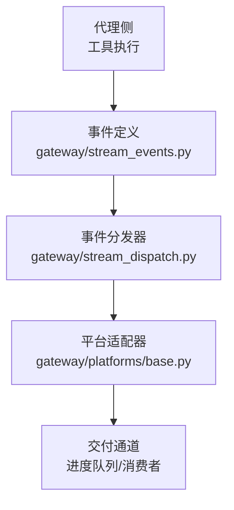
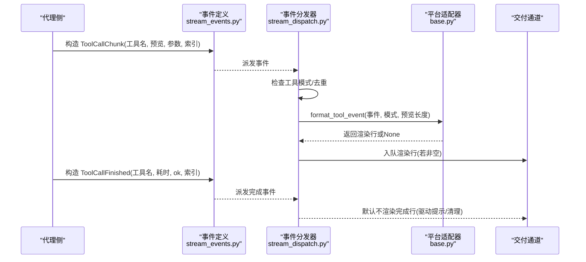
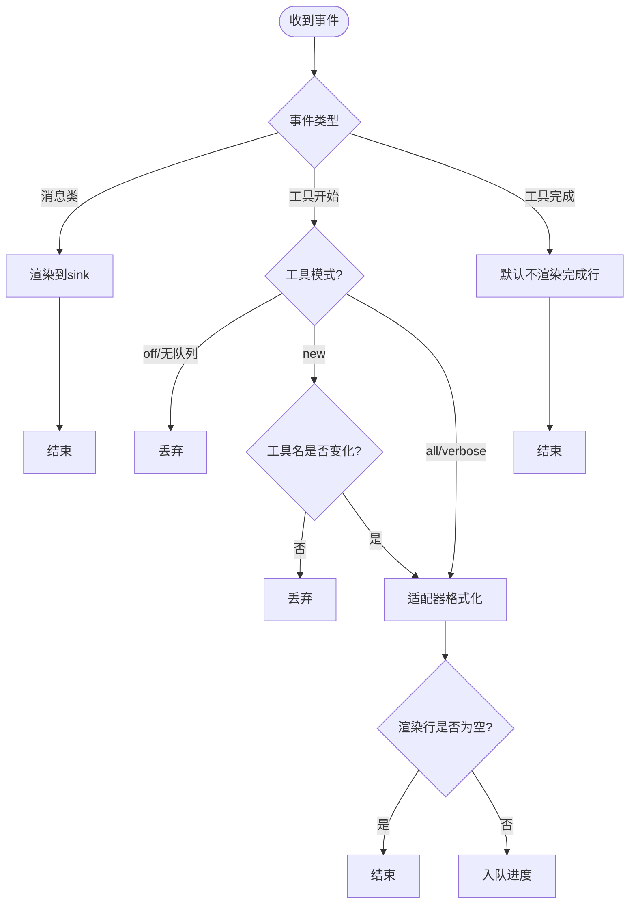
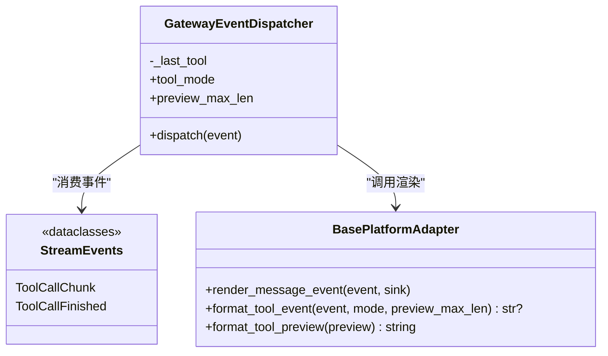
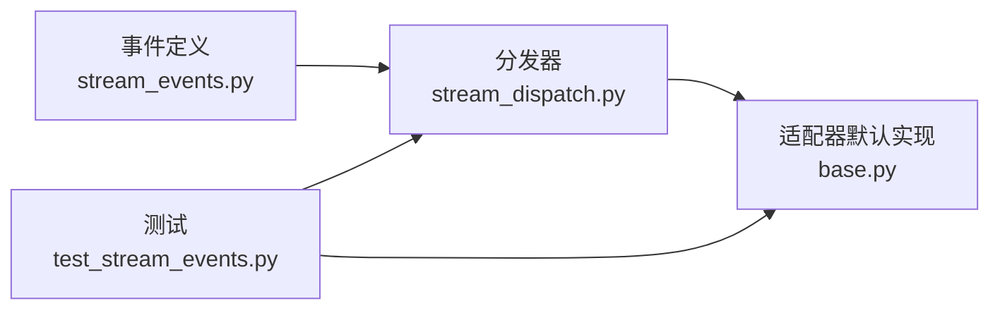

# 工具调用事件

<cite>
**本文引用的文件**
- [stream_events.py](file://gateway/stream_events.py)
- [stream_dispatch.py](file://gateway/stream_dispatch.py)
- [base.py](file://gateway/platforms/base.py)
- [test_stream_events.py](file://tests/gateway/test_stream_events.py)
- [tool_executor.py](file://agent/tool_executor.py)
</cite>

## 目录
1. [简介](#简介)
2. [项目结构](#项目结构)
3. [核心组件](#核心组件)
4. [架构总览](#架构总览)
5. [详细组件分析](#详细组件分析)
6. [依赖关系分析](#依赖关系分析)
7. [性能考量](#性能考量)
8. [故障排查指南](#故障排查指南)
9. [结论](#结论)
10. [附录](#附录)

## 简介
本文件聚焦于“工具调用事件”机制，说明在工具执行过程中，系统如何通过结构化事件通知上层（网关/平台适配器）工具的开始、进度更新与完成状态。重点覆盖以下方面：
- ToolCallChunk 与 ToolCallFinished 的数据结构与触发条件
- 工具调用的开始、进度更新、完成状态的流转过程
- 工具调用索引机制与参数预览处理
- 执行结果通知的边界（输出不随事件流传输）
- 事件监听器实现示例与调试方法

该机制将“发生了什么”（事件）与“如何呈现”（平台适配）解耦，确保历史消息由代理侧持久化，而事件仅用于展示层。

## 项目结构
围绕工具调用事件的关键代码分布在 gateway 与 agent 两个区域：
- gateway/stream_events.py：定义结构化事件类型（包括 ToolCallChunk、ToolCallFinished 等）
- gateway/stream_dispatch.py：事件分发器，负责按模式过滤、去重、格式化并投递到进度队列
- gateway/platforms/base.py：平台适配器的默认渲染逻辑，决定工具事件的展示形式
- tests/gateway/test_stream_events.py：对事件分发行为进行验证
- agent/tool_executor.py：工具执行流程的一部分，体现工具生命周期与结果记录

图表来源
- [stream_events.py:84-117](file://gateway/stream_events.py#L84-L117)
- [stream_dispatch.py:40-133](file://gateway/stream_dispatch.py#L40-L133)
- [base.py:3065-3143](file://gateway/platforms/base.py#L3065-L3143)

章节来源
- [stream_events.py:1-33](file://gateway/stream_events.py#L1-L33)
- [stream_dispatch.py:1-19](file://gateway/stream_dispatch.py#L1-L19)

## 核心组件
- 事件类型
  - ToolCallChunk：表示工具调用已开始或进行中，携带工具名、可选的参数预览、完整参数以及单调递增的调用索引
  - ToolCallFinished：表示工具调用完成，包含工具名、耗时、是否成功以及对应索引
- 事件分发器
  - GatewayEventDispatcher：接收事件，按工具模式（all/new/verbose/off）过滤与去重，调用平台适配器格式化后入队
- 平台适配器
  - BasePlatformAdapter.format_tool_event：根据模式生成工具进度行；若平台无法渲染则返回 None 以丢弃事件
- 测试用例
  - 验证消息事件流向 sink、工具事件格式与去重行为

章节来源
- [stream_events.py:84-117](file://gateway/stream_events.py#L84-L117)
- [stream_dispatch.py:40-133](file://gateway/stream_dispatch.py#L40-L133)
- [base.py:3086-3143](file://gateway/platforms/base.py#L3086-L3143)
- [test_stream_events.py:79-100](file://tests/gateway/test_stream_events.py#L79-L100)

## 架构总览
下图展示了从代理侧工具执行到网关展示的端到端流程，突出事件类型、分发策略与平台渲染职责分离。

图表来源
- [stream_events.py:84-117](file://gateway/stream_events.py#L84-L117)
- [stream_dispatch.py:88-129](file://gateway/stream_dispatch.py#L88-L129)
- [base.py:3086-3143](file://gateway/platforms/base.py#L3086-L3143)

## 详细组件分析

### 事件数据结构
- ToolCallChunk
  - tool_name：工具名称
  - preview：可选的简短参数预览
  - args：完整参数字典
  - index：单调递增的调用索引，用于关联开始与完成
- ToolCallFinished
  - tool_name：工具名称
  - duration：耗时（秒）
  - ok：是否成功
  - index：与开始事件对应的索引

章节来源
- [stream_events.py:84-117](file://gateway/stream_events.py#L84-L117)

### 事件分发与模式控制
GatewayEventDispatcher 的职责：
- 路由消息类事件到 sink（MessageChunk/MessageStop/Commentary）
- 对 ToolCallChunk：
  - 若工具模式为 off 或未配置进度队列，直接丢弃
  - 若模式为 new，仅当工具名变化时上报（去重）
  - 调用适配器格式化，得到渲染行后入队
- 对 ToolCallFinished：
  - 默认不渲染完成行，主要用于驱动一次性提示（如长任务建议）

图表来源
- [stream_dispatch.py:88-129](file://gateway/stream_dispatch.py#L88-L129)

章节来源
- [stream_dispatch.py:40-133](file://gateway/stream_dispatch.py#L40-L133)

### 平台适配器渲染
BasePlatformAdapter.format_tool_event：
- verbose 模式：输出工具名与完整参数（可截断），或基于 preview 的短文本
- all/new 模式：使用 prepare_tool_preview 生成紧凑预览，再经 format_tool_preview 应用平台特定格式
- 若平台无法渲染工具 chrome，返回 None 让分发器丢弃事件

图表来源
- [stream_dispatch.py:40-133](file://gateway/stream_dispatch.py#L40-L133)
- [base.py:3065-3143](file://gateway/platforms/base.py#L3065-L3143)
- [stream_events.py:84-117](file://gateway/stream_events.py#L84-L117)

章节来源
- [base.py:3086-3143](file://gateway/platforms/base.py#L3086-L3143)

### 工具调用索引机制
- index 字段在 ToolCallChunk 与 ToolCallFinished 中保持一致，便于下游将开始与完成配对
- 分发器内部维护 _last_tool 用于 new 模式的去重，避免重复上报同一工具的多次进度
- 测试覆盖了 new 模式下相同工具的去重行为

章节来源
- [stream_events.py:84-117](file://gateway/stream_events.py#L84-L117)
- [stream_dispatch.py:85-114](file://gateway/stream_dispatch.py#L85-L114)
- [test_stream_events.py:91-100](file://tests/gateway/test_stream_events.py#L91-L100)

### 参数预览处理
- 当存在 preview 时，适配器会优先使用它；否则尝试基于 args 构建紧凑预览
- 支持通过 preview_max_len 限制预览长度，verbose 模式下可显示完整参数（可截断）
- 平台可通过 format_tool_preview 定制展示细节（例如保留被缩短的 URL 元信息）

章节来源
- [base.py:3086-3143](file://gateway/platforms/base.py#L3086-L3143)

### 执行结果通知边界
- ToolCallFinished 不包含工具输出内容；输出属于代理侧的历史记录范畴，不通过事件流传输
- 完成事件主要用于清理进度气泡与驱动一次性提示（如长任务建议）

章节来源
- [stream_events.py:104-117](file://gateway/stream_events.py#L104-L117)

### 工具执行与事件的关系
- 工具执行流程负责调度、并发执行与结果收集，并在异常/取消路径上记录日志与中间状态
- 事件流与执行流程解耦：事件只描述“开始/完成”，不承载具体输出

章节来源
- [tool_executor.py:1050-1249](file://agent/tool_executor.py#L1050-L1249)

## 依赖关系分析
- stream_events.py 提供不可变数据类，作为跨线程/异步边界的轻量契约
- stream_dispatch.py 依赖事件类型与适配器接口，保持同步、无平台知识
- base.py 提供默认渲染逻辑，平台可覆写以适配不同渠道能力
- 测试覆盖关键行为：消息事件投递、工具事件格式与去重

图表来源
- [stream_events.py:84-117](file://gateway/stream_events.py#L84-L117)
- [stream_dispatch.py:40-133](file://gateway/stream_dispatch.py#L40-L133)
- [base.py:3065-3143](file://gateway/platforms/base.py#L3065-L3143)
- [test_stream_events.py:79-100](file://tests/gateway/test_stream_events.py#L79-L100)

章节来源
- [stream_dispatch.py:1-19](file://gateway/stream_dispatch.py#L1-L19)
- [test_stream_events.py:1-8](file://tests/gateway/test_stream_events.py#L1-L8)

## 性能考量
- 事件为冻结数据类，构造成本低，适合高频推送
- 分发器在 new 模式下进行简单去重，减少冗余渲染
- 适配器可在无法渲染时返回 None，避免无效入队
- 工具输出不进入事件流，降低带宽与序列化开销

[本节为通用指导，无需引用具体文件]

## 故障排查指南
- 事件未到达进度队列
  - 检查工具模式是否为 off 或未配置 enqueue_tool_line
  - 确认适配器未返回 None（平台不支持渲染）
- 重复进度条
  - 确认当前模式为 new，且工具名未变化
- 完成事件未生效
  - 注意完成事件默认不渲染，需通过钩子或上层逻辑处理
- 调试建议
  - 使用测试用例中的方式构造事件并观察分发器行为
  - 在适配器中打印渲染结果，确认格式化是否符合预期

章节来源
- [stream_dispatch.py:88-129](file://gateway/stream_dispatch.py#L88-L129)
- [base.py:3086-3143](file://gateway/platforms/base.py#L3086-L3143)
- [test_stream_events.py:79-100](file://tests/gateway/test_stream_events.py#L79-L100)

## 结论
工具调用事件机制通过明确的事件类型与分发策略，实现了“开始/进度/完成”的清晰语义，并将渲染决策下沉至平台适配器。索引机制与参数预览增强了事件的可读性与可追踪性，同时保持输出与事件流的职责分离，有利于扩展与维护。

[本节为总结，无需引用具体文件]

## 附录
- 事件监听器实现示例（概念性步骤）
  - 订阅事件分发器，捕获 ToolCallChunk 与 ToolCallFinished
  - 根据工具模式与预览长度决定展示策略
  - 在 new 模式下维护最近工具名以实现去重
  - 对完成事件进行清理或触发一次性提示
- 调试方法
  - 使用单元测试构造事件并断言分发器行为
  - 在适配器中临时增强日志，观察渲染输出
  - 结合工具执行日志，核对开始/完成事件与执行时长的一致性

[本节为概念性内容，无需引用具体文件]