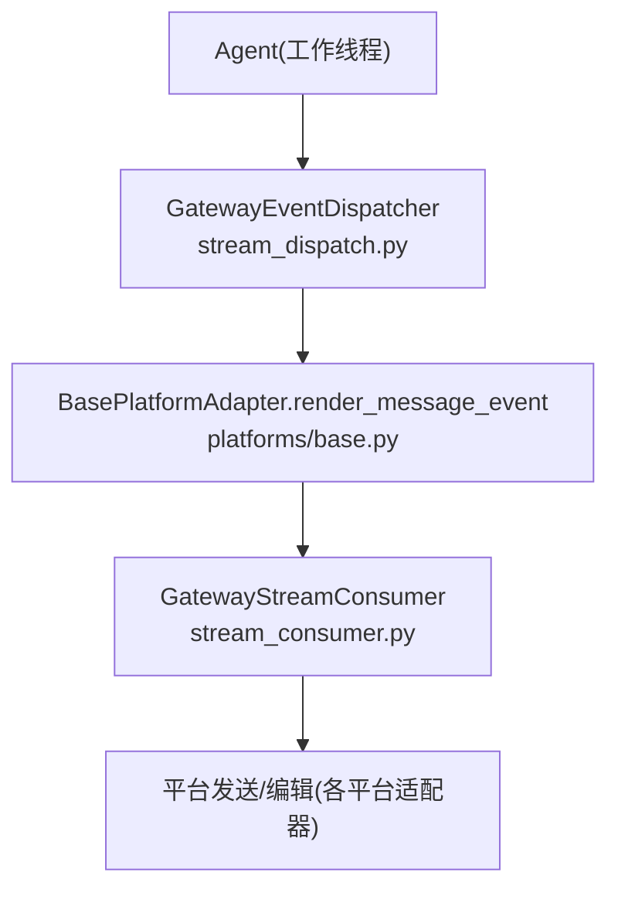
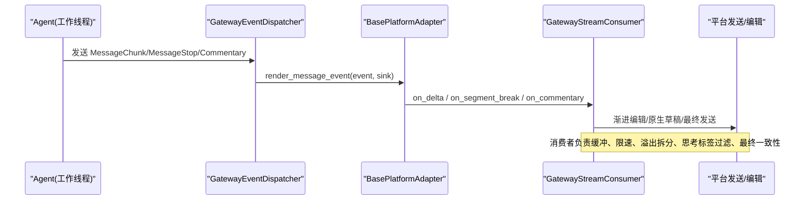
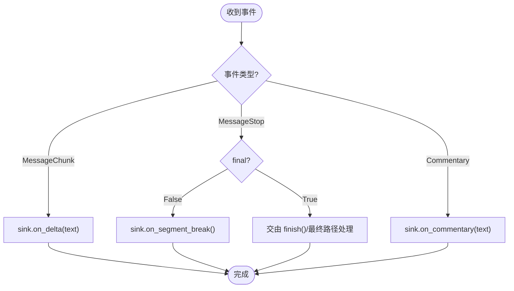
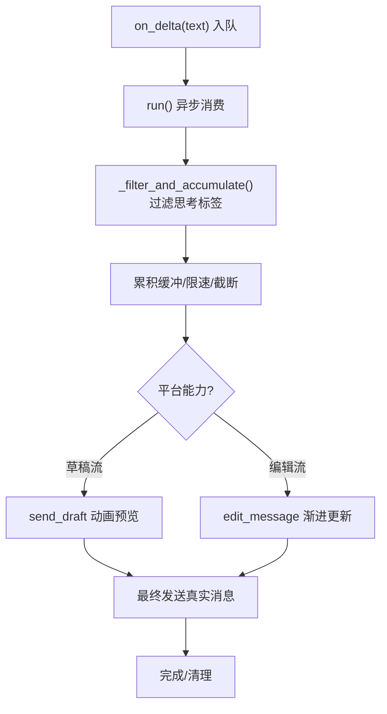
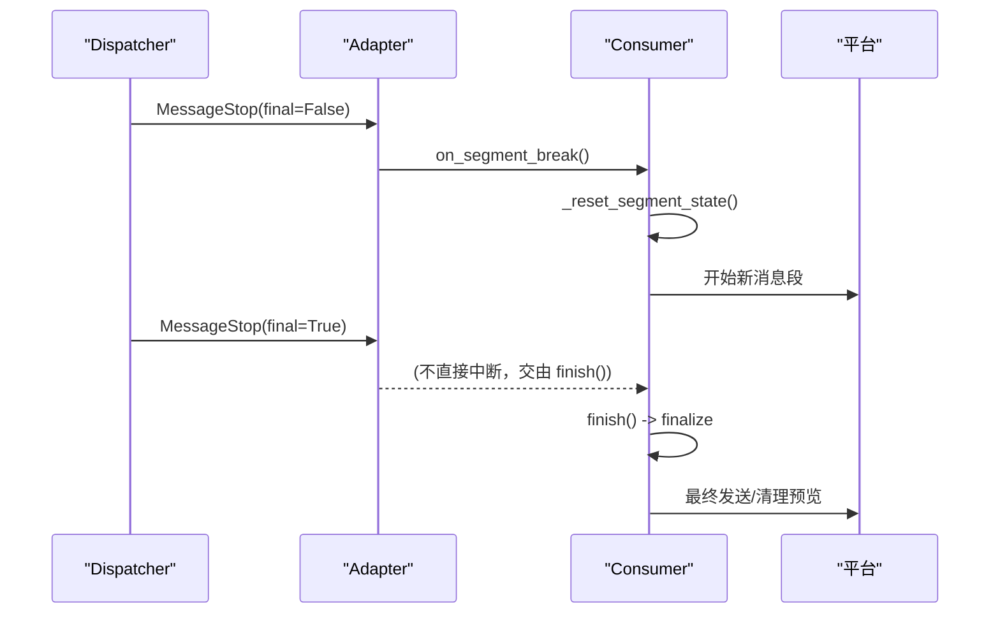

# 消息事件

<cite>
**本文引用的文件**
- [gateway/stream_events.py](file://gateway/stream_events.py)
- [gateway/stream_dispatch.py](file://gateway/stream_dispatch.py)
- [gateway/stream_consumer.py](file://gateway/stream_consumer.py)
- [gateway/platforms/base.py](file://gateway/platforms/base.py)
- [tests/gateway/test_stream_events.py](file://tests/gateway/test_stream_events.py)
</cite>

## 目录
1. [简介](#简介)
2. [项目结构](#项目结构)
3. [核心组件](#核心组件)
4. [架构总览](#架构总览)
5. [详细组件分析](#详细组件分析)
6. [依赖关系分析](#依赖关系分析)
7. [性能考虑](#性能考虑)
8. [故障排查指南](#故障排查指南)
9. [结论](#结论)
10. [附录](#附录)

## 简介
本文件聚焦助手文本流式传输的消息事件机制，围绕以下三类事件展开：MessageChunk（增量文本块）、MessageStop（分段/停止信号）与 Commentary（完整片段）。文档说明它们的数据结构、使用场景、增量处理流程、消息分段机制、最终停止信号的处理逻辑，以及订阅模式、事件过滤规则与错误处理策略。同时提供监听器实现示例与性能优化建议，帮助读者在网关侧正确消费并呈现流式响应。

## 项目结构
消息事件由“结构化事件定义 + 分发路由 + 消费者桥接 + 平台适配器渲染”四层组成：
- 事件定义：gateway/stream_events.py 定义了 MessageChunk、MessageStop、Commentary 等不可变数据类，作为 agent→gateway 的交付契约。
- 分发路由：gateway/stream_dispatch.py 中的 GatewayEventDispatcher 将事件按类型路由到适配器的渲染钩子或控制通道。
- 消费者桥接：gateway/stream_consumer.py 中的 GatewayStreamConsumer 负责线程安全接收增量、缓冲、限速、渐进编辑/原生草稿流，并在完成时清理状态。
- 平台渲染：gateway/platforms/base.py 中 BasePlatformAdapter 提供默认渲染行为，将事件映射到消费者的 on_delta/on_segment_break/on_commentary 等方法；也可被具体平台覆盖以定制展示。

图表来源
- [gateway/stream_dispatch.py:88-129](file://gateway/stream_dispatch.py#L88-L129)
- [gateway/platforms/base.py:3065-3084](file://gateway/platforms/base.py#L3065-L3084)
- [gateway/stream_consumer.py:590-604](file://gateway/stream_consumer.py#L590-L604)

章节来源
- [gateway/stream_events.py:41-80](file://gateway/stream_events.py#L41-L80)
- [gateway/stream_dispatch.py:1-19](file://gateway/stream_dispatch.py#L1-L19)
- [gateway/stream_consumer.py:1-14](file://gateway/stream_consumer.py#L1-L14)
- [gateway/platforms/base.py:3060-3084](file://gateway/platforms/base.py#L3060-L3084)

## 核心组件
- 事件类型
  - MessageChunk：携带增量文本 text，用于逐步拼接和渲染。
  - MessageStop：标记当前助手消息段结束；final=False 表示中间断点（如工具调用边界），final=True 表示整轮结束。
  - Commentary：完整的中间助手消息片段，独立成段显示。
- 分发器
  - GatewayEventDispatcher：根据事件类型路由到适配器的 render_message_event 或工具事件格式化，支持“new”模式去重、关闭工具进度等。
- 消费者
  - GatewayStreamConsumer：线程安全的 on_delta/on_segment_break/on_commentary 入口；内部维护累积缓冲、溢出拆分、原生草稿流、思考标签过滤、防洪水退避、最终一致性校验等。
- 平台适配器
  - BasePlatformAdapter.render_message_event：默认将事件映射到消费者方法；format_tool_event 提供工具进度气泡的默认渲染。

章节来源
- [gateway/stream_events.py:41-80](file://gateway/stream_events.py#L41-L80)
- [gateway/stream_dispatch.py:40-132](file://gateway/stream_dispatch.py#L40-L132)
- [gateway/stream_consumer.py:127-169](file://gateway/stream_consumer.py#L127-L169)
- [gateway/platforms/base.py:3065-3142](file://gateway/platforms/base.py#L3065-L3142)

## 架构总览
下图展示了从 Agent 发出结构化事件到平台呈现的端到端流程，包括增量文本、分段与注释、工具事件与控制的流转路径。

图表来源
- [gateway/stream_dispatch.py:88-129](file://gateway/stream_dispatch.py#L88-L129)
- [gateway/platforms/base.py:3065-3084](file://gateway/platforms/base.py#L3065-L3084)
- [gateway/stream_consumer.py:590-604](file://gateway/stream_consumer.py#L590-L604)

## 详细组件分析

### 事件数据结构与语义
- MessageChunk
  - 字段：text（增量字符串）
  - 语义：模型输出的增量内容，消费者会累积并逐步呈现；推理/思考块内容在上游已过滤，不会到达此处。
- MessageStop
  - 字段：final（布尔，默认 False）
  - 语义：当前助手消息段结束；final=False 为中间断点（例如进入工具调用），final=True 为整轮结束。
- Commentary
  - 字段：text（完整字符串）
  - 语义：工具迭代之间的完整助手消息片段，作为独立段落呈现。

章节来源
- [gateway/stream_events.py:41-80](file://gateway/stream_events.py#L41-L80)

### 分发与订阅模式
- 订阅者（Sink）
  - GatewayStreamConsumer 提供 on_delta(text)、on_segment_break()、on_commentary(text) 三个回调接口，作为消息事件的统一订阅点。
- 分发器（Dispatcher）
  - GatewayEventDispatcher.dispatch(event) 捕获异常，确保渲染失败不破坏 Agent 主循环；对不同类型事件进行分支路由。
- 适配器（Adapter）
  - BasePlatformAdapter.render_message_event 默认将事件映射到 Sink 的对应方法；可被具体平台覆盖以实现更优呈现（如 Telegram 原生草稿）。

图表来源
- [gateway/stream_dispatch.py:88-129](file://gateway/stream_dispatch.py#L88-L129)
- [gateway/platforms/base.py:3065-3084](file://gateway/platforms/base.py#L3065-L3084)

章节来源
- [gateway/stream_dispatch.py:88-129](file://gateway/stream_dispatch.py#L88-L129)
- [gateway/platforms/base.py:3065-3084](file://gateway/platforms/base.py#L3065-L3084)

### 增量文本块处理流程
- 线程安全入队：on_delta(text) 将增量放入队列，避免阻塞 Agent 工作线程。
- 异步消费：run() 任务从队列取数，进行缓冲、限速、截断与平台发送/编辑。
- 思考标签过滤：_filter_and_accumulate 识别并丢弃 <think>...</think> 等推理块，保证用户只看到有效内容。
- 溢出与续发：当平台消息长度限制触发时，消费者会拆分并续发后续片段，保持最终一致性。
- 原生草稿流：在支持的平台上优先使用 send_draft 动画预览，完成后通过正常发送路径落盘真实消息。

图表来源
- [gateway/stream_consumer.py:590-604](file://gateway/stream_consumer.py#L590-L604)
- [gateway/stream_consumer.py:614-758](file://gateway/stream_consumer.py#L614-L758)
- [gateway/stream_consumer.py:760-800](file://gateway/stream_consumer.py#L760-L800)

章节来源
- [gateway/stream_consumer.py:590-604](file://gateway/stream_consumer.py#L590-L604)
- [gateway/stream_consumer.py:614-758](file://gateway/stream_consumer.py#L614-L758)
- [gateway/stream_consumer.py:760-800](file://gateway/stream_consumer.py#L760-L800)

### 消息分段机制与最终停止信号
- 分段（Segment Break）
  - MessageStop(final=False) 触发 on_segment_break()，结束当前消息段并开始新消息，使工具调用前后的文本分属不同气泡。
  - 消费者在 _reset_segment_state 中重置段内状态，并在新段开始时递增草稿 ID，避免跨段泄漏。
- 最终停止
  - MessageStop(final=True) 仅表示当前段结束；整轮最终完成由 consumer.finish() 驱动，走 finalize 路径，必要时执行“新鲜最终”策略（删除旧预览、重新发送完整消息）。
  - delivered_final_matches 用于比对已送达的最终内容与 final_response，避免重复发送或遗漏。

图表来源
- [gateway/platforms/base.py:3065-3084](file://gateway/platforms/base.py#L3065-L3084)
- [gateway/stream_consumer.py:493-504](file://gateway/stream_consumer.py#L493-L504)
- [gateway/stream_consumer.py:552-589](file://gateway/stream_consumer.py#L552-L589)

章节来源
- [gateway/platforms/base.py:3065-3084](file://gateway/platforms/base.py#L3065-L3084)
- [gateway/stream_consumer.py:493-504](file://gateway/stream_consumer.py#L493-L504)
- [gateway/stream_consumer.py:552-589](file://gateway/stream_consumer.py#L552-L589)

### 事件过滤规则
- 思考标签过滤：_filter_and_accumulate 识别多种大小写变体的 <think>...</think> 等标签，丢弃其内容；若出现孤立闭合标签也会被剥离。
- 工具进度模式：
  - “all”：始终输出工具进度。
  - “new”：仅当工具名称变化时输出一次（去重）。
  - “verbose”：输出完整参数摘要。
  - “off”：禁用工具进度。
- 平台能力：某些平台不支持富格式或编辑，可通过 format_tool_event 返回 None “吃掉”工具事件，避免无意义气泡。

章节来源
- [gateway/stream_consumer.py:614-758](file://gateway/stream_consumer.py#L614-L758)
- [gateway/stream_dispatch.py:101-114](file://gateway/stream_dispatch.py#L101-L114)
- [gateway/platforms/base.py:3086-3142](file://gateway/platforms/base.py#L3086-L3142)

### 错误处理策略
- 分发器健壮性：dispatch 捕获所有异常并记录日志，确保渲染错误不会中断 Agent 主循环。
- 消费者鲁棒性：
  - 防洪水退避：连续编辑失败达到阈值后暂时禁用渐进编辑，改用其他路径。
  - 超时与早退：会话重置（/new 或 /stop）时提前放弃流，避免陈旧增量。
  - 最终一致性：delivered_final_matches 对比已送达内容与 final_response，防止重复或遗漏。
- 平台状态：BasePlatformAdapter 提供致命错误标记与状态写入保护，避免频繁失败刷屏。

章节来源
- [gateway/stream_dispatch.py:88-94](file://gateway/stream_dispatch.py#L88-L94)
- [gateway/stream_consumer.py:171-173](file://gateway/stream_consumer.py#L171-L173)
- [gateway/stream_consumer.py:300-303](file://gateway/stream_consumer.py#L300-L303)
- [gateway/stream_consumer.py:443-491](file://gateway/stream_consumer.py#L443-L491)
- [gateway/platforms/base.py:3191-3229](file://gateway/platforms/base.py#L3191-L3229)

### 监听器实现示例（概念性）
以下为概念性示例，展示如何基于 GatewayStreamConsumer 的回调接口实现一个简单的事件监听器：
- 订阅 on_delta：累积文本并实时显示。
- 订阅 on_segment_break：结束当前气泡，准备下一段。
- 订阅 on_commentary：将完整片段作为独立消息显示。
- 注意：实际集成应遵循 GatewayEventDispatcher 与 BasePlatformAdapter 的默认映射；如需自定义呈现，请覆盖 render_message_event 或 format_tool_event。

章节来源
- [gateway/stream_consumer.py:590-604](file://gateway/stream_consumer.py#L590-L604)
- [gateway/platforms/base.py:3065-3084](file://gateway/platforms/base.py#L3065-L3084)

## 依赖关系分析
- 模块耦合
  - stream_events 仅定义数据结构，无行为，低耦合。
  - stream_dispatch 依赖 stream_events 与 platforms/base，负责路由。
  - stream_consumer 依赖 platforms/base 的长度函数与配置，负责异步消费与平台交互。
  - platforms/base 提供默认渲染，可被具体平台覆盖。
- 外部依赖
  - 平台适配器（Telegram/Discord/Slack 等）决定最终呈现方式与能力（是否支持草稿流、编辑等）。
- 潜在循环依赖
  - 通过分层与回调解耦，避免循环导入；事件定义与分发/消费职责清晰。

图表来源
- [gateway/stream_events.py:41-80](file://gateway/stream_events.py#L41-L80)
- [gateway/stream_dispatch.py:26-35](file://gateway/stream_dispatch.py#L26-L35)
- [gateway/platforms/base.py:3065-3142](file://gateway/platforms/base.py#L3065-L3142)
- [gateway/stream_consumer.py:156-169](file://gateway/stream_consumer.py#L156-L169)

章节来源
- [gateway/stream_events.py:41-80](file://gateway/stream_events.py#L41-L80)
- [gateway/stream_dispatch.py:26-35](file://gateway/stream_dispatch.py#L26-L35)
- [gateway/platforms/base.py:3065-3142](file://gateway/platforms/base.py#L3065-L3142)
- [gateway/stream_consumer.py:156-169](file://gateway/stream_consumer.py#L156-L169)

## 性能考虑
- 缓冲与限速：消费者通过 edit_interval 与 buffer_threshold 控制编辑频率，避免平台限流。
- 原生草稿流：在支持的平台优先使用草稿流减少编辑次数，提升流畅度；失败自动降级为编辑流。
- 去重与裁剪：工具进度在“new”模式下去重；预览长度受 preview_max_len 限制，减少冗余信息。
- 溢出拆分：长回复自动拆分为多段，避免平台消息长度限制导致的渲染问题。
- 思考标签过滤：在流式阶段即剔除推理块，降低无效数据传输与渲染开销。

[本节为通用指导，无需特定文件引用]

## 故障排查指南
- 现象：用户看不到任何流式输出
  - 检查 sink 是否为 None（流式关闭时消息事件会被丢弃，但终态仍会通过正常发送路径）。
  - 确认 on_delta/on_segment_break/on_commentary 是否正确注册并被调用。
- 现象：工具进度气泡过多或重复
  - 调整 tool_mode 为 “new” 或 “off”，或覆盖 format_tool_event 以抑制。
- 现象：最终回复未显示或重复显示
  - 检查 delivered_final_matches 与 _delivered_final_text 的一致性；关注 _turn_split_delivery 与 fresh-final 策略。
- 现象：思考标签泄露
  - 确认 _filter_and_accumulate 正常工作；检查是否有孤立闭合标签需剥离。
- 现象：平台限流导致编辑失败
  - 观察 _MAX_FLOOD_STRIKES 与自适应退避；必要时切换为草稿流或关闭渐进编辑。

章节来源
- [gateway/stream_dispatch.py:88-94](file://gateway/stream_dispatch.py#L88-L94)
- [gateway/stream_consumer.py:171-173](file://gateway/stream_consumer.py#L171-L173)
- [gateway/stream_consumer.py:443-491](file://gateway/stream_consumer.py#L443-L491)
- [gateway/platforms/base.py:3086-3142](file://gateway/platforms/base.py#L3086-L3142)

## 结论
消息事件体系通过“结构化事件 + 分发路由 + 消费者桥接 + 平台渲染”的分层设计，实现了高内聚、低耦合的流式传输机制。MessageChunk、MessageStop 与 Commentary 分别承担增量、分段与完整片段的角色；GatewayEventDispatcher 与 GatewayStreamConsumer 协同完成线程安全、缓冲限速、溢出拆分、思考标签过滤与最终一致性保障；BasePlatformAdapter 提供默认渲染并可被平台覆盖。该设计既保证了跨平台的兼容性，又为性能优化与故障恢复提供了坚实基础。

[本节为总结，无需特定文件引用]

## 附录
- 测试参考
  - 事件分发与默认渲染行为验证：test_stream_events.py
- 关键路径参考
  - 事件定义：gateway/stream_events.py
  - 分发路由：gateway/stream_dispatch.py
  - 消费者实现：gateway/stream_consumer.py
  - 平台默认渲染：gateway/platforms/base.py

章节来源
- [tests/gateway/test_stream_events.py:52-101](file://tests/gateway/test_stream_events.py#L52-L101)
- [gateway/stream_events.py:41-80](file://gateway/stream_events.py#L41-L80)
- [gateway/stream_dispatch.py:88-129](file://gateway/stream_dispatch.py#L88-L129)
- [gateway/stream_consumer.py:590-604](file://gateway/stream_consumer.py#L590-L604)
- [gateway/platforms/base.py:3065-3142](file://gateway/platforms/base.py#L3065-L3142)