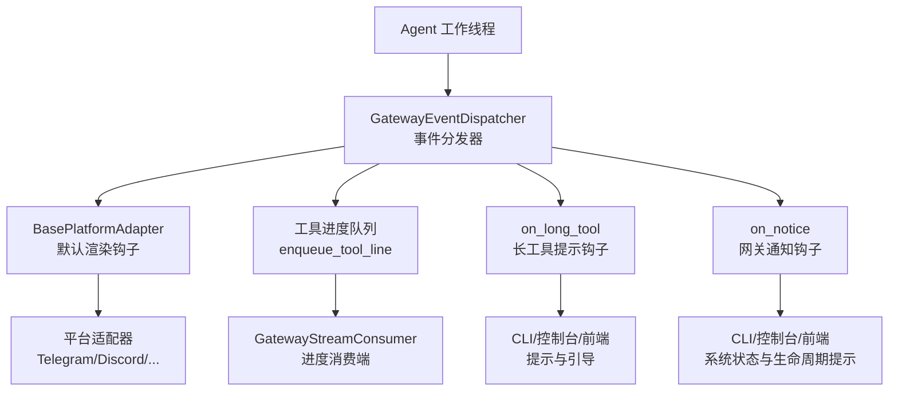
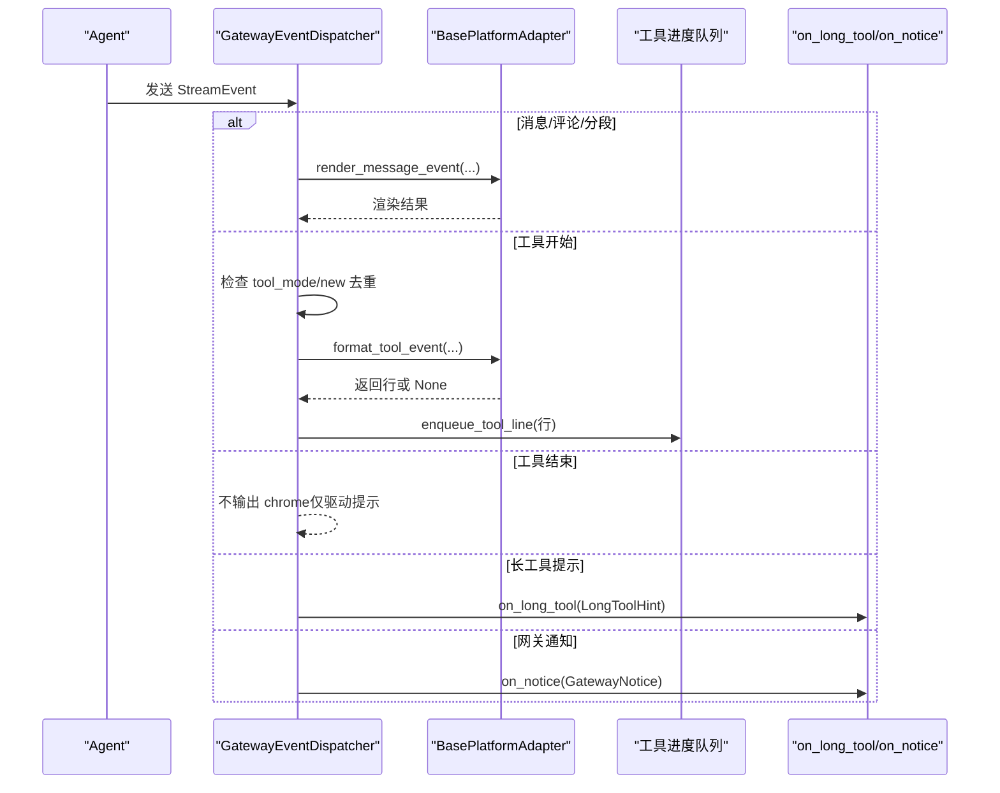
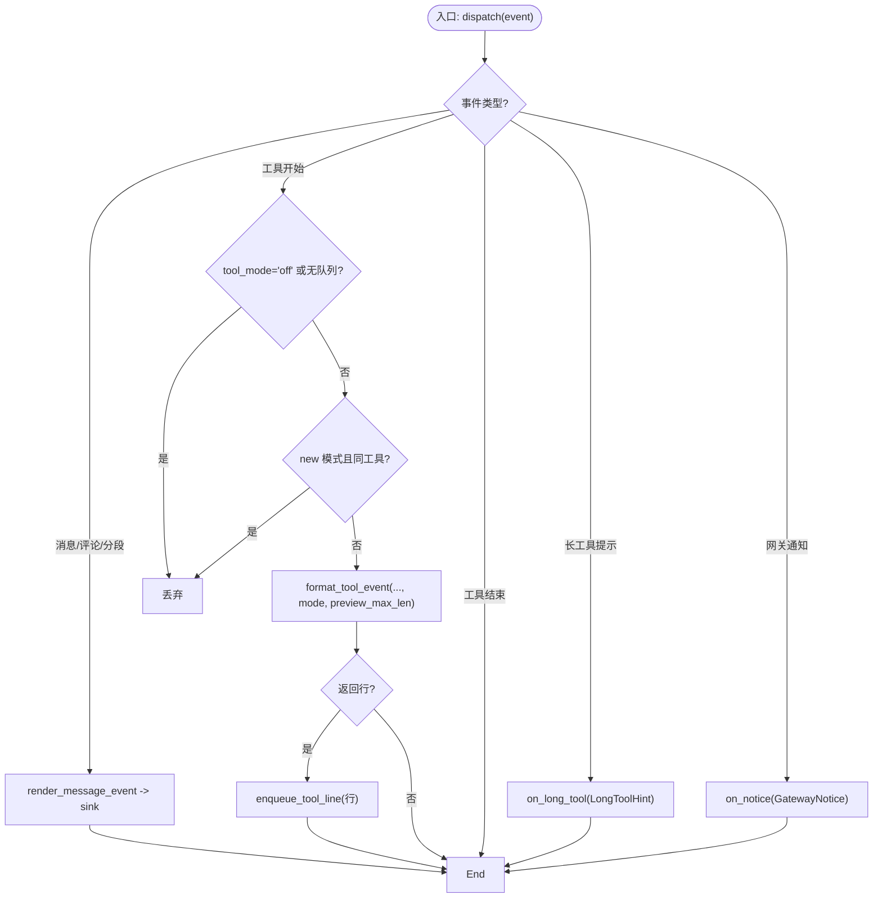
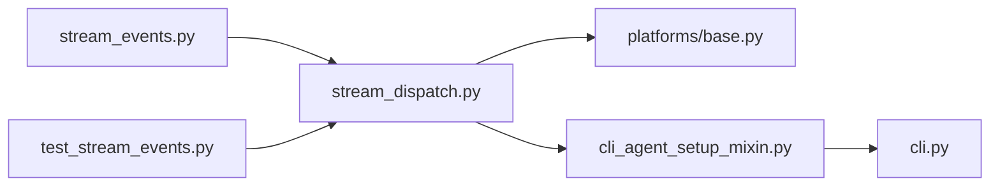

# 网关控制事件

<cite>
**本文引用的文件**
- [gateway/stream_events.py](file://gateway/stream_events.py)
- [gateway/stream_dispatch.py](file://gateway/stream_dispatch.py)
- [tests/gateway/test_stream_events.py](file://tests/gateway/test_stream_events.py)
- [gateway/platforms/base.py](file://gateway/platforms/base.py)
- [hermes_cli/cli_agent_setup_mixin.py](file://hermes_cli/cli_agent_setup_mixin.py)
- [cli.py](file://cli.py)
</cite>

## 目录
1. [简介](#简介)
2. [项目结构](#项目结构)
3. [核心组件](#核心组件)
4. [架构总览](#架构总览)
5. [详细组件分析](#详细组件分析)
6. [依赖关系分析](#依赖关系分析)
7. [性能与优先级](#性能与优先级)
8. [平台适配与向后兼容](#平台适配与向后兼容)
9. [故障排查指南](#故障排查指南)
10. [结论](#结论)
11. [附录：处理器实现示例与监控方法](#附录处理器实现示例与监控方法)

## 简介
本文件聚焦于系统级控制消息与生命周期事件在网关中的处理机制，重点说明 LongToolHint 与 GatewayNotice 两类控制事件的使用场景、触发条件、配置选项、扩展字段处理、优先级管理、平台适配策略以及向后兼容性保证。同时提供控制事件处理器的实现思路与监控方法，帮助读者在平台适配器或上层 CLI/控制台中正确消费并呈现这些事件。

## 项目结构
网关侧通过“结构化流事件”将“发生了什么”与“如何投递”解耦：Agent 产生类型化的事件，Gateway 的调度器根据平台能力决定渲染与投递方式。控制事件（LongToolHint、GatewayNotice）由调度器统一路由到可选钩子，交由网关层决定是否展示及如何展示。

图表来源
- [gateway/stream_dispatch.py:40-133](file://gateway/stream_dispatch.py#L40-L133)
- [gateway/stream_events.py:119-159](file://gateway/stream_events.py#L119-L159)

章节来源
- [gateway/stream_dispatch.py:1-133](file://gateway/stream_dispatch.py#L1-L133)
- [gateway/stream_events.py:1-172](file://gateway/stream_events.py#L1-L172)

## 核心组件
- 事件定义（gateway/stream_events.py）
  - LongToolHint：一次性提示，当工具运行超过阈值时发出，包含工具名与耗时。
  - GatewayNotice：网关发出的控制消息，包含 kind（如 restart/online/long_run）、text（默认人类可读文本）和 extra（扩展字段）。
- 事件分发器（gateway/stream_dispatch.py）
  - GatewayEventDispatcher：接收 StreamEvent，按类型路由；对控制事件调用 on_long_tool/on_notice 钩子；对工具事件进行模式去重与格式化后入队。
- 平台适配器基类（gateway/platforms/base.py）
  - 提供 render_message_event/format_tool_event 等默认行为，允许平台覆盖以适配不同渠道的渲染能力。
- CLI 集成（hermes_cli/cli_agent_setup_mixin.py、cli.py）
  - 注册 notice 回调，用于在控制台/前端呈现系统级通知。

章节来源
- [gateway/stream_events.py:119-159](file://gateway/stream_events.py#L119-L159)
- [gateway/stream_dispatch.py:40-133](file://gateway/stream_dispatch.py#L40-L133)
- [gateway/platforms/base.py:1-200](file://gateway/platforms/base.py#L1-L200)
- [hermes_cli/cli_agent_setup_mixin.py:520-560](file://hermes_cli/cli_agent_setup_mixin.py#L520-L560)
- [cli.py:6370-6420](file://cli.py#L6370-L6420)

## 架构总览
控制事件从 Agent 侧进入 GatewayEventDispatcher，随后：
- LongToolHint：若注册了 on_long_tool，则直接交给该钩子处理（例如显示 /verbose 引导）。
- GatewayNotice：若注册了 on_notice，则交给该钩子处理（例如在线/重启/压缩完成等系统通知）。
- 工具相关事件：根据 tool_mode 与 preview_max_len 进行格式化和去重，再入队到进度队列。

图表来源
- [gateway/stream_dispatch.py:88-133](file://gateway/stream_dispatch.py#L88-L133)
- [gateway/stream_events.py:119-159](file://gateway/stream_events.py#L119-L159)

## 详细组件分析

### 事件模型与数据契约
- LongToolHint
  - 字段：tool_name、duration
  - 语义：一次性提示，指示某工具运行时间较长，建议用户启用更详细的输出或等待。
- GatewayNotice
  - 字段：kind、text、extra
  - 语义：网关发出的系统级控制消息，kind 为稳定字符串（如 restart/online/long_run），text 为默认人类可读文案，extra 为可扩展字段，供平台或上层逻辑使用。

章节来源
- [gateway/stream_events.py:121-146](file://gateway/stream_events.py#L121-L146)

### 事件分发与渲染
- GatewayEventDispatcher.dispatch
  - 安全封装：对外暴露的 dispatch 捕获异常，避免影响 Agent 主循环。
  - 消息类事件：转发至 adapter.render_message_event。
  - 工具类事件：依据 tool_mode 与 last_tool 做 new 模式去重；调用 adapter.format_tool_event 生成行并入队；None 表示平台选择“吃掉”该事件。
  - 控制事件：LongToolHint → on_long_tool；GatewayNotice → on_notice。

图表来源
- [gateway/stream_dispatch.py:88-133](file://gateway/stream_dispatch.py#L88-L133)

章节来源
- [gateway/stream_dispatch.py:40-133](file://gateway/stream_dispatch.py#L40-L133)

### 平台适配与默认行为
- BasePlatformAdapter 提供默认的消息与工具事件渲染钩子，确保在不覆盖的情况下行为与现有一致。
- 平台可覆盖 format_tool_event 以“吃掉”工具 chrome（例如不支持富格式的渠道）。
- 控制事件由网关层决定是否展示，平台无需感知具体业务细节。

章节来源
- [gateway/platforms/base.py:1-200](file://gateway/platforms/base.py#L1-L200)

### CLI 集成与通知消费
- hermes_cli/cli_agent_setup_mixin.py 中注册 notice 回调，使 CLI 能消费 GatewayNotice。
- cli.py 中定义了 _on_notice/_on_notice_clear 等方法，用于在控制台呈现系统通知。

章节来源
- [hermes_cli/cli_agent_setup_mixin.py:520-560](file://hermes_cli/cli_agent_setup_mixin.py#L520-L560)
- [cli.py:6370-6420](file://cli.py#L6370-L6420)

## 依赖关系分析
- stream_events.py 定义事件类型，被 stream_dispatch.py 引用。
- stream_dispatch.py 依赖 BasePlatformAdapter 的渲染钩子，并将工具事件入队。
- CLI 模块通过 mixin 注入 notice 回调，消费 GatewayNotice。
- 测试用例验证事件分发与控制事件的流向。

图表来源
- [gateway/stream_events.py:1-172](file://gateway/stream_events.py#L1-L172)
- [gateway/stream_dispatch.py:1-133](file://gateway/stream_dispatch.py#L1-L133)
- [gateway/platforms/base.py:1-200](file://gateway/platforms/base.py#L1-L200)
- [hermes_cli/cli_agent_setup_mixin.py:520-560](file://hermes_cli/cli_agent_setup_mixin.py#L520-L560)
- [cli.py:6370-6420](file://cli.py#L6370-L6420)
- [tests/gateway/test_stream_events.py:1-106](file://tests/gateway/test_stream_events.py#L1-L106)

章节来源
- [tests/gateway/test_stream_events.py:1-106](file://tests/gateway/test_stream_events.py#L1-L106)

## 性能与优先级
- 事件分发器对每个事件进行轻量判断与路由，避免阻塞 Agent 工作线程。
- 工具事件在 new 模式下进行去重，减少重复渲染开销。
- 控制事件（LongToolHint/GatewayNotice）仅在注册钩子时触发，未注册则静默跳过，降低无关开销。
- 建议：
  - 将高频通知合并或节流（在 on_notice 钩子内实现）。
  - 对长工具提示设置阈值与频率限制，避免频繁打扰。
  - 在 on_notice 中对 extra 字段进行白名单校验，防止未知字段导致渲染异常。

[本节为通用指导，不直接分析具体文件]

## 平台适配与向后兼容
- 向后兼容：
  - 事件为不可变 frozen dataclass，新增字段不影响旧消费者。
  - 默认渲染钩子保持现有行为，平台可选择性覆盖。
  - 控制事件通过可选钩子传递，未注册不会报错。
- 平台适配：
  - 平台可通过 format_tool_event 控制是否展示工具 chrome。
  - 平台可在 on_notice 中根据 kind 与 extra 定制展示（如本地化文案、图标、按钮）。
- 连接恢复契约：
  - 平台适配器的 connect() 必须接受 is_reconnect 关键字参数，以保证网关重连流程正常。

章节来源
- [gateway/stream_events.py:1-33](file://gateway/stream_events.py#L1-L33)
- [gateway/platforms/base.py:1-200](file://gateway/platforms/base.py#L1-L200)
- [tests/gateway/test_adapter_connect_is_reconnect_contract.py:1-145](file://tests/gateway/test_adapter_connect_is_reconnect_contract.py#L1-L145)

## 故障排查指南
- 现象：控制台未收到任何 GatewayNotice
  - 检查是否在初始化时注册了 notice 回调（hermes_cli/cli_agent_setup_mixin.py）。
  - 确认 on_notice 未被意外置空或被覆盖。
- 现象：LongToolHint 未出现
  - 检查 on_long_tool 是否注册。
  - 确认工具运行时长是否超过内部阈值（由事件定义语义可知）。
- 现象：工具进度重复或丢失
  - 检查 tool_mode 是否为 off 或 new；new 模式下相同工具会去重。
  - 确认 enqueue_tool_line 是否正确接入进度队列。
- 现象：平台无法渲染工具 chrome
  - 平台可返回 None “吃掉”事件；如需强制显示，需调整平台渲染逻辑。

章节来源
- [gateway/stream_dispatch.py:88-133](file://gateway/stream_dispatch.py#L88-L133)
- [hermes_cli/cli_agent_setup_mixin.py:520-560](file://hermes_cli/cli_agent_setup_mixin.py#L520-L560)
- [cli.py:6370-6420](file://cli.py#L6370-L6420)

## 结论
网关控制事件通过类型化事件与可选钩子的组合，实现了“事件定义”与“平台渲染”的解耦。LongToolHint 与 GatewayNotice 分别承担“长任务提示”和“系统级通知”的职责，配合 tool_mode 与预览长度等配置，既保证了用户体验，又维持了向后兼容与平台适配的灵活性。建议在实现中遵循最小侵入原则，优先使用默认行为，并在必要时通过平台覆盖与钩子定制来满足特定需求。

[本节为总结性内容，不直接分析具体文件]

## 附录：处理器实现示例与监控方法

### 控制事件处理器实现要点
- 注册 on_notice 与 on_long_tool 钩子
  - 在 CLI 初始化阶段注入回调，确保 GatewayNotice 与 LongToolHint 能被消费。
- 处理 GatewayNotice
  - 根据 kind 分支处理（restart/online/long_run 等）。
  - 使用 text 作为默认文案；extra 可用于携带额外上下文（如会话 ID、平台标识、操作来源）。
- 处理 LongToolHint
  - 根据 duration 与工具名提示用户是否需要更详细输出或继续等待。
- 错误防护
  - 所有钩子应捕获异常，避免中断主流程。
  - 对 extra 字段进行白名单校验，避免未知键导致渲染失败。

章节来源
- [hermes_cli/cli_agent_setup_mixin.py:520-560](file://hermes_cli/cli_agent_setup_mixin.py#L520-L560)
- [cli.py:6370-6420](file://cli.py#L6370-L6420)
- [gateway/stream_dispatch.py:88-133](file://gateway/stream_dispatch.py#L88-L133)

### 监控与观测建议
- 指标采集
  - 统计 GatewayNotice 的 kind 分布与频率。
  - 统计 LongToolHint 的工具名与平均时长，识别慢工具。
- 日志记录
  - 记录 on_notice 与 on_long_tool 的调用次数与关键参数（注意脱敏）。
- 告警规则
  - 当 GatewayNotice 中 kind=error 或异常频次突增时触发告警。
  - 当同一工具频繁触发 LongToolHint 时提示优化或限流。

[本节为通用指导，不直接分析具体文件]