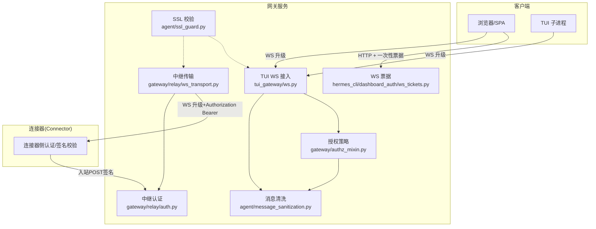
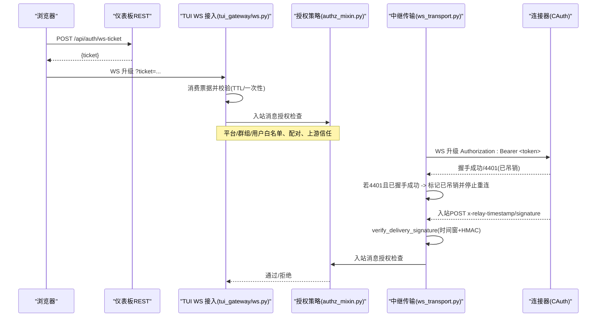
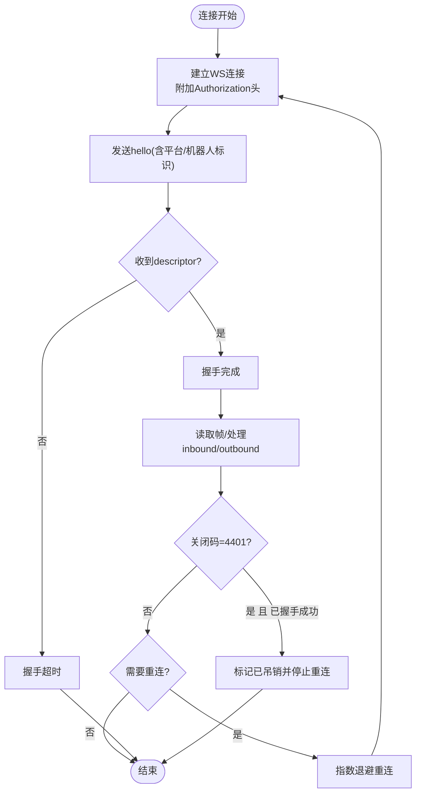
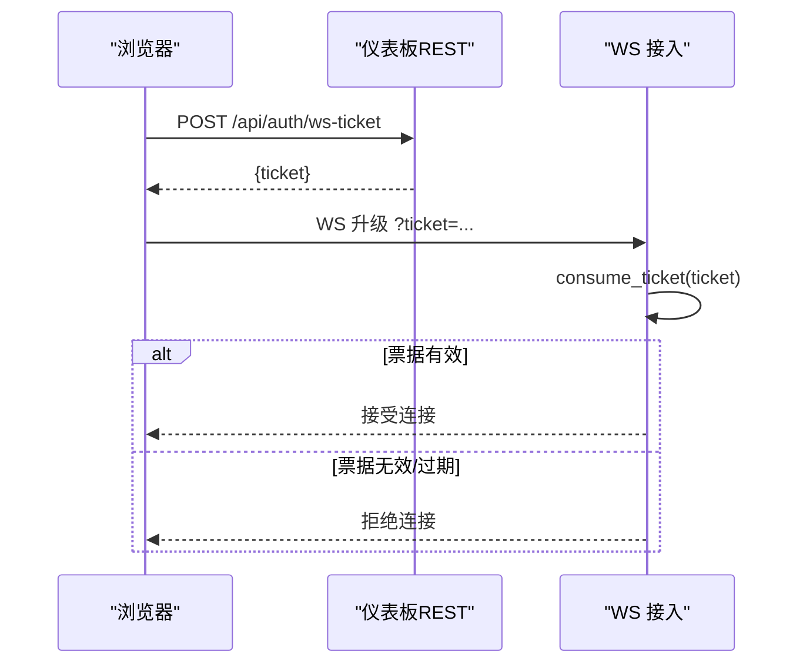
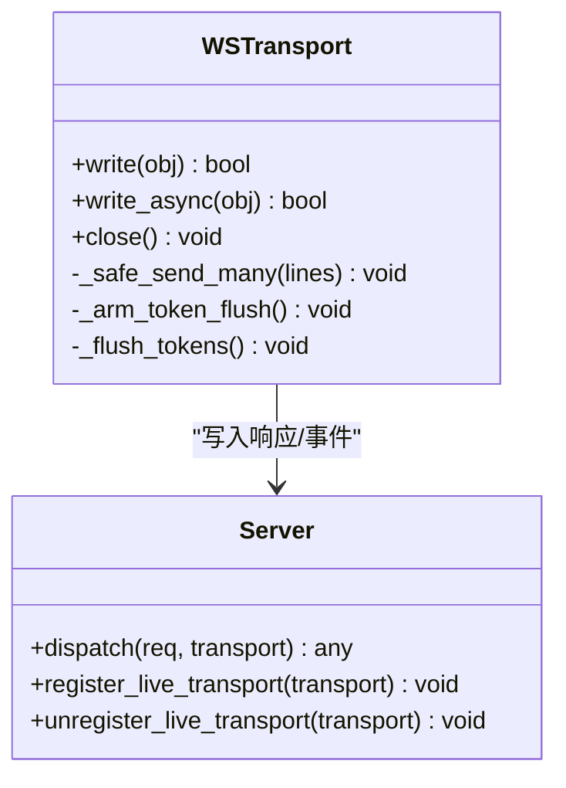
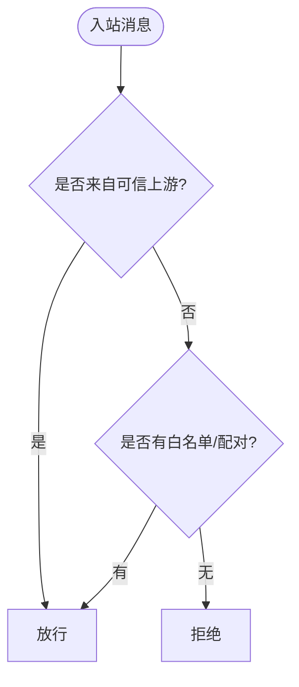
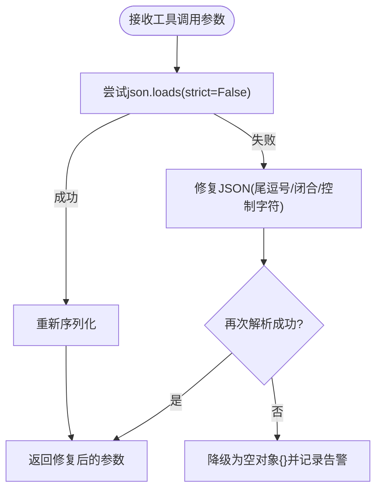
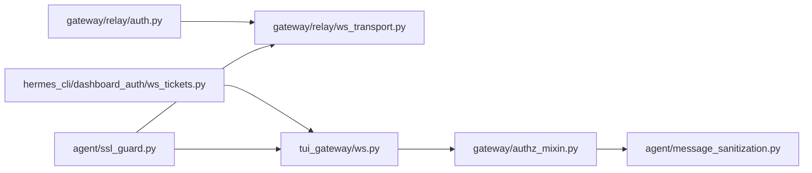

# 安全机制

<cite>
**本文引用的文件**
- [ws_transport.py](file://gateway/relay/ws_transport.py)
- [auth.py](file://gateway/relay/auth.py)
- [ws_tickets.py](file://hermes_cli/dashboard_auth/ws_tickets.py)
- [ws.py](file://tui_gateway/ws.py)
- [authz_mixin.py](file://gateway/authz_mixin.py)
- [message_sanitization.py](file://agent/message_sanitization.py)
- [ssl_guard.py](file://agent/ssl_guard.py)
</cite>

## 目录
1. [简介](#简介)
2. [项目结构](#项目结构)
3. [核心组件](#核心组件)
4. [架构总览](#架构总览)
5. [详细组件分析](#详细组件分析)
6. [依赖关系分析](#依赖关系分析)
7. [性能与安全权衡](#性能与安全权衡)
8. [故障排查指南](#故障排查指南)
9. [结论](#结论)
10. [附录：配置与最佳实践](#附录配置与最佳实践)

## 简介
本文件聚焦 WebSocket 相关的安全机制，覆盖连接认证、消息加密与访问控制。重点包括：
- 升级头验证（WS 握手阶段的鉴权）
- 令牌认证（HMAC 签名令牌、一次性票据、进程内凭证）
- 权限检查（入站消息的授权策略、上游信任边界）
- 恶意连接防护（重连风暴、超时、关闭码处理）
- 消息验证与输入清洗（JSON 修复、代理字段清洗、非 ASCII/代理字符处理）
- 安全配置示例（证书管理、密钥轮换、安全策略部署）
- 审计日志、威胁检测与应急响应流程
- 安全最佳实践、常见漏洞防护与安全测试方法

## 项目结构
围绕 WebSocket 安全的关键模块分布如下：
- 网关到连接器（connector）的出站 WS 传输与握手认证
- 仪表板/内部 WS 的一次性票据与进程内凭证
- TUI Gateway 的 JSON-RPC over WS 接入层
- 入站消息授权策略（平台/群组/用户白名单、上游信任）
- 消息清洗与修复（工具调用参数、代理字符、非 ASCII）
- SSL CA 校验与证书健康检查

**图表来源**
- [ws_transport.py:339-501](file://gateway/relay/ws_transport.py#L339-L501)
- [auth.py:1-169](file://gateway/relay/auth.py#L1-L169)
- [ws_tickets.py:1-162](file://hermes_cli/dashboard_auth/ws_tickets.py#L1-L162)
- [ws.py:286-477](file://tui_gateway/ws.py#L286-L477)
- [authz_mixin.py:386-783](file://gateway/authz_mixin.py#L386-L783)
- [message_sanitization.py:195-293](file://agent/message_sanitization.py#L195-L293)
- [ssl_guard.py:68-101](file://agent/ssl_guard.py#L68-L101)

**章节来源**
- [ws_transport.py:339-501](file://gateway/relay/ws_transport.py#L339-L501)
- [auth.py:1-169](file://gateway/relay/auth.py#L1-L169)
- [ws_tickets.py:1-162](file://hermes_cli/dashboard_auth/ws_tickets.py#L1-L162)
- [ws.py:286-477](file://tui_gateway/ws.py#L286-L477)
- [authz_mixin.py:386-783](file://gateway/authz_mixin.py#L386-L783)
- [message_sanitization.py:195-293](file://agent/message_sanitization.py#L195-L293)
- [ssl_guard.py:68-101](file://agent/ssl_guard.py#L68-L101)

## 核心组件
- 中继传输与握手认证（Gateway→Connector）
  - 在 WS 升级时携带 Authorization: Bearer <token>，使用 HMAC-SHA256 签名，支持多密钥轮换与过期时间。
  - 对 4401 自定义关闭码进行“已吊销”判定，终止重连，避免死循环。
- 仪表板 WS 票据与内部凭证
  - 浏览器无法设置 Upgrade 头，采用一次性 ticket（30s TTL），服务端消费后失效。
  - 进程内 WS 凭证用于服务器派生子进程（如嵌入式 TUI），长生命周期、多用途、不注入 HTML。
- TUI Gateway WS 接入
  - 基于 JSON-RPC over WS，提供流式事件合并与写超时保护，记录解析错误、分发崩溃、发送失败等指标。
- 入站授权策略
  - 支持平台级/群组级/用户级白名单、配对审批、上游信任（Relay/平台适配器）直接放行。
- 消息清洗与修复
  - 修复工具调用参数 JSON（尾逗号、未闭合结构、控制字符转义）、清理代理/非 ASCII 字符、图像内容剥离。
- SSL CA 校验
  - 启动前校验环境变量指定的 CA bundle 与内置 certifi 是否可加载且有效。

**章节来源**
- [ws_transport.py:339-501](file://gateway/relay/ws_transport.py#L339-L501)
- [auth.py:1-169](file://gateway/relay/auth.py#L1-L169)
- [ws_tickets.py:1-162](file://hermes_cli/dashboard_auth/ws_tickets.py#L1-L162)
- [ws.py:286-477](file://tui_gateway/ws.py#L286-L477)
- [authz_mixin.py:386-783](file://gateway/authz_mixin.py#L386-L783)
- [message_sanitization.py:195-293](file://agent/message_sanitization.py#L195-L293)
- [ssl_guard.py:68-101](file://agent/ssl_guard.py#L68-L101)

## 架构总览
下图展示从浏览器/TUI 到网关再到连接器的安全链路，涵盖升级头验证、票据认证、HMAC 签名、授权策略与消息清洗。

**图表来源**
- [ws_tickets.py:62-99](file://hermes_cli/dashboard_auth/ws_tickets.py#L62-L99)
- [ws.py:286-477](file://tui_gateway/ws.py#L286-L477)
- [ws_transport.py:445-501](file://gateway/relay/ws_transport.py#L445-L501)
- [auth.py:97-169](file://gateway/relay/auth.py#L97-L169)
- [authz_mixin.py:386-783](file://gateway/authz_mixin.py#L386-L783)

## 详细组件分析

### 组件A：中继传输与握手认证（Gateway→Connector）
- 升级头生成
  - 当配置了 per-gateway secret 与 gateway_id 时，构造 Authorization: Bearer <token>，token 为 HMAC-SHA256 签名，支持 TTL。
- 握手与描述符
  - 建立 WS 连接后发送 hello，等待 descriptor；支持多身份（platform:botId）。
- 重连与休眠
  - 支持指数退避重连；go_idle/go_dormant 配合连接器缓冲翻转，实现 scale-to-zero。
- 4401 吊销处理
  - 一旦握手成功后收到 4401，视为凭据被撤销，停止重连并上报“禁用”状态。

**图表来源**
- [ws_transport.py:445-501](file://gateway/relay/ws_transport.py#L445-L501)
- [ws_transport.py:731-800](file://gateway/relay/ws_transport.py#L731-L800)
- [auth.py:97-106](file://gateway/relay/auth.py#L97-L106)

**章节来源**
- [ws_transport.py:339-501](file://gateway/relay/ws_transport.py#L339-L501)
- [ws_transport.py:731-800](file://gateway/relay/ws_transport.py#L731-L800)
- [auth.py:97-106](file://gateway/relay/auth.py#L97-L106)

### 组件B：仪表板 WS 票据与内部凭证
- 一次性票据
  - 由 REST 端点签发，30秒 TTL，消费即销毁，防止泄露利用。
- 进程内凭证
  - 进程生命周期内稳定存在，供服务器派生子进程复用 WS 连接，不注入 HTML，降低 XSS 风险。
- 常量时间比较
  - 使用常量时间比较避免长度/前缀信息泄露。

**图表来源**
- [ws_tickets.py:62-99](file://hermes_cli/dashboard_auth/ws_tickets.py#L62-L99)
- [ws_tickets.py:110-153](file://hermes_cli/dashboard_auth/ws_tickets.py#L110-L153)

**章节来源**
- [ws_tickets.py:1-162](file://hermes_cli/dashboard_auth/ws_tickets.py#L1-L162)

### 组件C：TUI Gateway WS 接入与流式优化
- 协议
  - 与 stdio 一致的 JSON-RPC over WS，逐行分隔。
- 流式事件合并
  - 高频 token 帧按类型聚合，短定时器批量刷新，降低 GIL 竞争与网络开销。
- 健壮性
  - 写超时保护、解析错误计数、分发崩溃计数、发送失败计数，便于监控与排障。

**图表来源**
- [ws.py:70-256](file://tui_gateway/ws.py#L70-L256)
- [ws.py:286-477](file://tui_gateway/ws.py#L286-L477)

**章节来源**
- [ws.py:70-256](file://tui_gateway/ws.py#L70-L256)
- [ws.py:286-477](file://tui_gateway/ws.py#L286-L477)

### 组件D：入站消息授权策略
- 上游信任优先
  - 来自受信任上游（Relay/平台适配器）的事件可直接放行，因为上游已完成身份绑定与鉴权。
- 白名单与配对
  - 支持平台级/群组级/用户级白名单，以及配对审批作为强授权。
- 默认拒绝
  - 无白名单配置时默认拒绝，除非显式开启 allow-all。

**图表来源**
- [authz_mixin.py:386-783](file://gateway/authz_mixin.py#L386-L783)

**章节来源**
- [authz_mixin.py:386-783](file://gateway/authz_mixin.py#L386-L783)

### 组件E：消息验证与输入清洗
- 工具调用参数修复
  - 处理尾逗号、未闭合结构、控制字符转义，必要时降级为空对象并记录告警。
- 代理/非 ASCII 清理
  - 替换代理字符、剥离非 ASCII，确保下游 SDK/API 正常序列化与校验。
- 图像内容剥离
  - 在不支持图片的服务端场景下移除 image_url 片段，保持消息交替不变。

**图表来源**
- [message_sanitization.py:195-293](file://agent/message_sanitization.py#L195-L293)

**章节来源**
- [message_sanitization.py:195-293](file://agent/message_sanitization.py#L195-L293)

### 组件F：SSL CA 校验
- 启动前校验
  - 检查 HERMES_CA_BUNDLE、SSL_CERT_FILE、REQUESTS_CA_BUNDLE、CURL_CA_BUNDLE 指向的 CA bundle 是否存在、可加载且包含证书。
- 内置 certifi 校验
  - 校验内置 cacert.pem 是否完整可用，避免后续 httpx/OpenAI 调用出现难以诊断的错误。

**章节来源**
- [ssl_guard.py:68-101](file://agent/ssl_guard.py#L68-L101)

## 依赖关系分析
- 中继传输依赖认证模块生成/验证令牌与入站签名。
- 仪表板 WS 票据与 TUI WS 接入共同构成前端/子进程接入面。
- 授权策略位于消息进入业务逻辑之前，决定请求是否继续处理。
- 消息清洗在工具调用与模型交互前后执行，保障数据完整性与兼容性。
- SSL 校验贯穿所有网络 I/O 路径，确保 TLS 信任链有效。

**图表来源**
- [auth.py:1-169](file://gateway/relay/auth.py#L1-L169)
- [ws_transport.py:339-501](file://gateway/relay/ws_transport.py#L339-L501)
- [ws_tickets.py:1-162](file://hermes_cli/dashboard_auth/ws_tickets.py#L1-L162)
- [ws.py:286-477](file://tui_gateway/ws.py#L286-L477)
- [authz_mixin.py:386-783](file://gateway/authz_mixin.py#L386-L783)
- [message_sanitization.py:195-293](file://agent/message_sanitization.py#L195-L293)
- [ssl_guard.py:68-101](file://agent/ssl_guard.py#L68-L101)

**章节来源**
- [auth.py:1-169](file://gateway/relay/auth.py#L1-L169)
- [ws_transport.py:339-501](file://gateway/relay/ws_transport.py#L339-L501)
- [ws_tickets.py:1-162](file://hermes_cli/dashboard_auth/ws_tickets.py#L1-L162)
- [ws.py:286-477](file://tui_gateway/ws.py#L286-L477)
- [authz_mixin.py:386-783](file://gateway/authz_mixin.py#L386-L783)
- [message_sanitization.py:195-293](file://agent/message_sanitization.py#L195-L293)
- [ssl_guard.py:68-101](file://agent/ssl_guard.py#L68-L101)

## 性能与安全权衡
- 流式事件合并减少高频帧带来的事件循环唤醒与 GIL 竞争，提升吞吐同时保持顺序。
- 写超时与锁保护避免阻塞或死锁，提高稳定性。
- 重连退避与休眠模式降低资源占用，适配 scale-to-zero。
- 票据 TTL 与一次性消费限制攻击面，平衡用户体验与安全性。
- 消息清洗在保障兼容性的前提下尽量最小化修改，避免破坏语义。

[本节为通用指导，无需具体文件引用]

## 故障排查指南
- WS 握手失败
  - 检查 Authorization 头是否正确生成与传递，确认 gateway_id 与 secret 匹配。
  - 关注 4401 关闭码：若握手成功后出现，说明凭据已被撤销，需重新注册实例。
- 重连风暴
  - 启用指数退避与 dormant 模式，避免频繁重连导致雪崩。
- 入站 POST 签名校验失败
  - 核对 x-relay-timestamp 与 x-relay-signature，确认时间窗与密钥列表。
- 授权拒绝
  - 检查平台/群组/用户白名单、配对审批、上游信任标志。
- 消息解析/发送失败
  - 查看 TUI WS 统计：parse_errors、dispatch_crashes、send_failures，定位问题阶段。
- SSL 错误
  - 运行前执行 CA bundle 校验，修复缺失或损坏的证书文件。

**章节来源**
- [ws_transport.py:731-800](file://gateway/relay/ws_transport.py#L731-L800)
- [auth.py:142-169](file://gateway/relay/auth.py#L142-L169)
- [ws.py:286-477](file://tui_gateway/ws.py#L286-L477)
- [ssl_guard.py:68-101](file://agent/ssl_guard.py#L68-L101)

## 结论
该代码库在 WebSocket 安全方面提供了端到端的保障：
- 连接层：WS 升级头 HMAC 签名、一次性票据、进程内凭证
- 传输层：可靠的重连、休眠与关闭码处理
- 应用层：严格的授权策略与消息清洗
- 基础设施：SSL CA 校验与健壮的日志/指标
建议在生产环境严格遵循配置与最佳实践，持续进行安全测试与审计。

[本节为总结，无需具体文件引用]

## 附录：配置与最佳实践

### 安全配置示例
- 证书管理
  - 设置 HERMES_CA_BUNDLE/SSL_CERT_FILE 指向有效的 CA bundle；确保 certifi 安装正确。
  - 启动前执行 SSL CA 校验，提前发现配置问题。
- 密钥轮换
  - 使用多密钥 verify list 进行 HMAC 签名验证，保证轮换期间不影响现有令牌。
  - 为 WS 升级令牌设置合理 TTL，避免长期有效。
- 安全策略部署
  - 为每个网络暴露的平台配置 allowlist 或启用上游信任；默认拒绝未明确放行的用户。
  - 使用配对审批作为强授权通道，结合白名单形成双重保障。

**章节来源**
- [ssl_guard.py:68-101](file://agent/ssl_guard.py#L68-L101)
- [auth.py:61-80](file://gateway/relay/auth.py#L61-L80)
- [authz_mixin.py:386-783](file://gateway/authz_mixin.py#L386-L783)

### 安全最佳实践
- 始终启用 TLS，禁止明文 WS（ws://）暴露于公网。
- 限制 WS 升级头的来源（Origin/IP 白名单），结合票据与令牌双重认证。
- 对入站消息进行严格校验与清洗，避免注入与畸形负载。
- 记录并监控安全事件（握手失败、4401、授权拒绝、解析错误、发送失败）。
- 定期轮换密钥与证书，及时更新依赖与 CA bundle。

[本节为通用指导，无需具体文件引用]

### 常见漏洞防护
- 重放攻击：入站 POST 使用时间与签名校验，限制时间窗。
- 凭据泄露：票据一次性使用、进程内凭证不注入 HTML。
- 注入与畸形负载：工具调用参数修复与代理/非 ASCII 清理。
- 证书失效：启动前 CA bundle 校验，快速定位并修复。

**章节来源**
- [auth.py:142-169](file://gateway/relay/auth.py#L142-L169)
- [ws_tickets.py:62-99](file://hermes_cli/dashboard_auth/ws_tickets.py#L62-L99)
- [message_sanitization.py:195-293](file://agent/message_sanitization.py#L195-L293)
- [ssl_guard.py:68-101](file://agent/ssl_guard.py#L68-L101)

### 安全测试方法
- 单元测试
  - 验证 HMAC 签名生成与校验、票据签发与消费、授权策略分支。
- 集成测试
  - 模拟 WS 握手失败、4401 吊销、入站 POST 签名错误，验证重连与拒绝行为。
- 压力测试
  - 高并发 WS 连接与流式事件，评估合并与写超时的影响。
- 安全扫描
  - 检查证书有效性、密钥强度、依赖漏洞。

**章节来源**
- [auth.py:1-169](file://gateway/relay/auth.py#L1-L169)
- [ws_tickets.py:1-162](file://hermes_cli/dashboard_auth/ws_tickets.py#L1-L162)
- [ws.py:286-477](file://tui_gateway/ws.py#L286-L477)
- [ssl_guard.py:68-101](file://agent/ssl_guard.py#L68-L101)