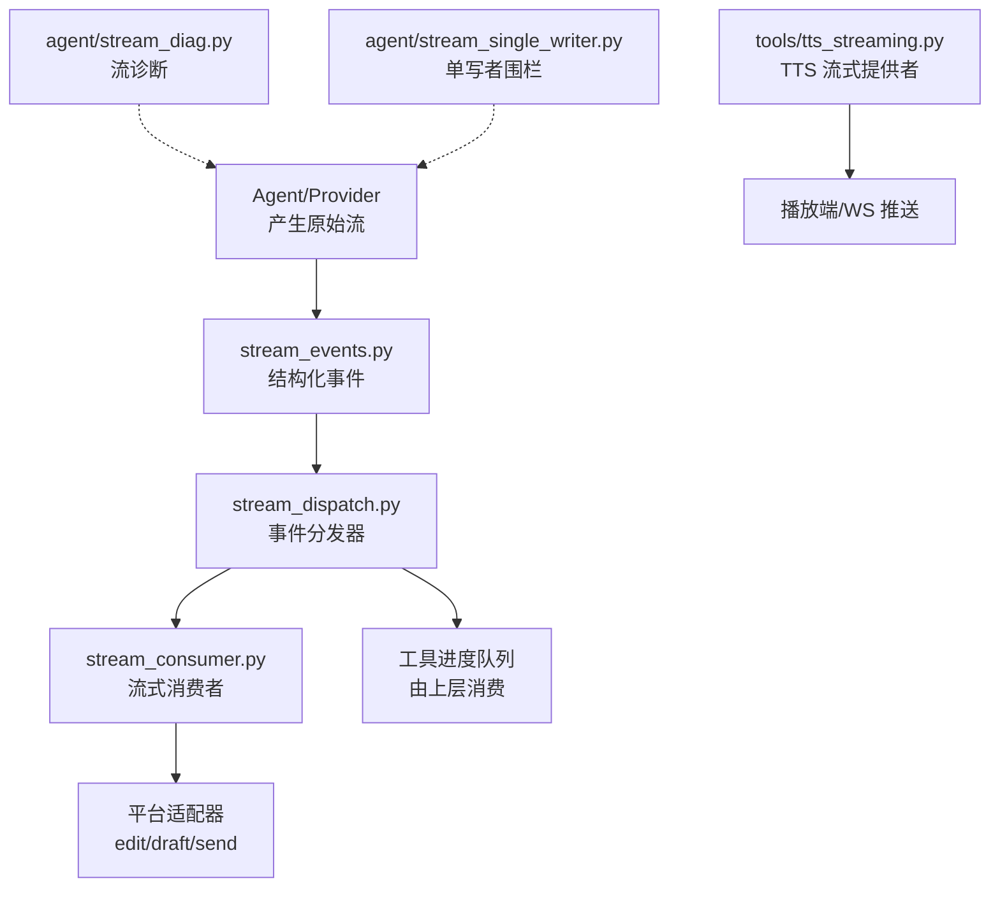
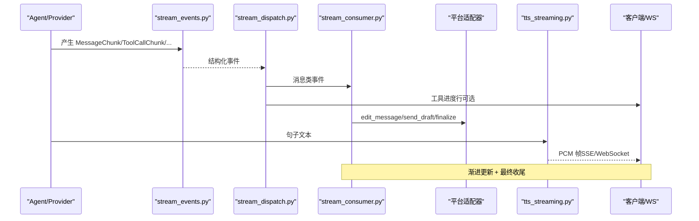
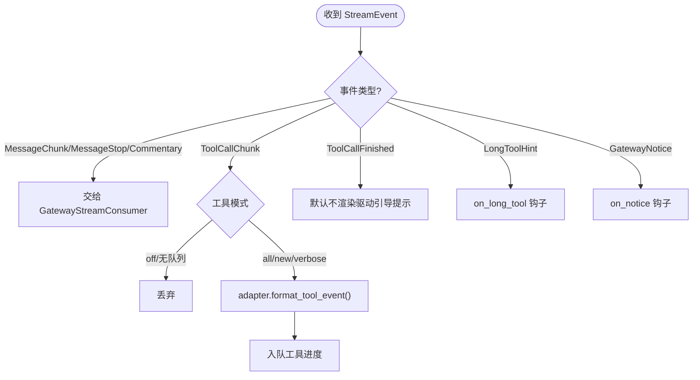
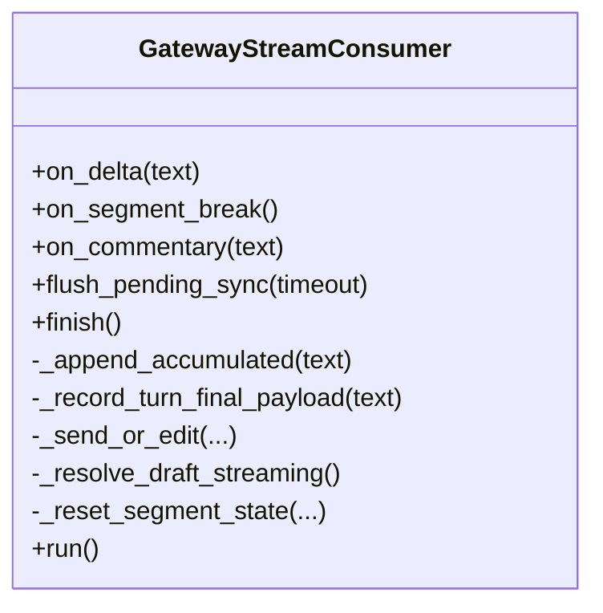
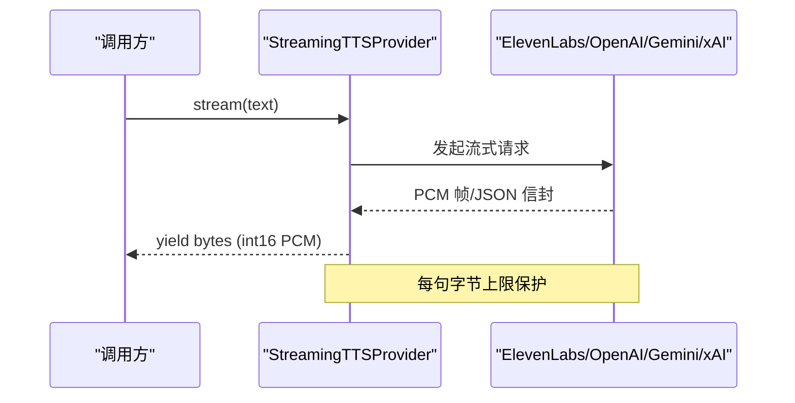
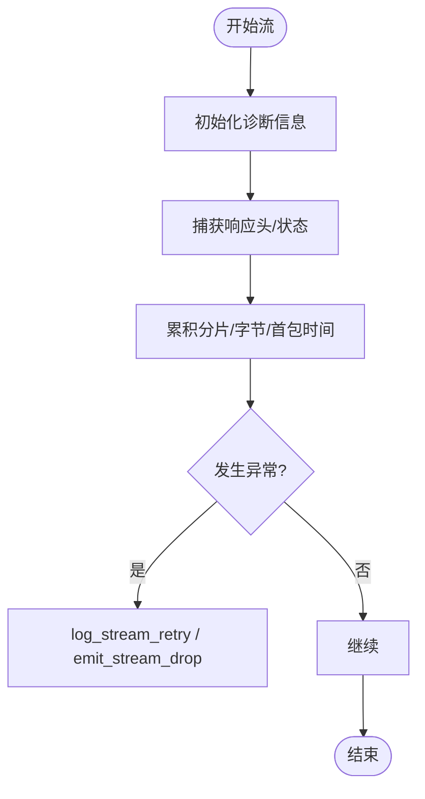
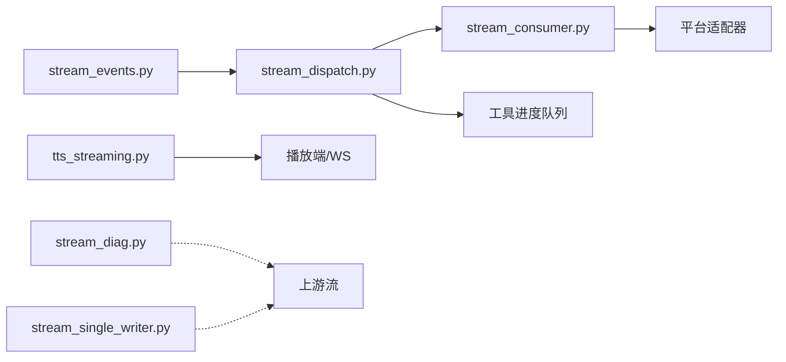

# 流式通信

<cite>
**本文引用的文件**
- [gateway/stream_consumer.py](file://gateway/stream_consumer.py)
- [gateway/stream_dispatch.py](file://gateway/stream_dispatch.py)
- [gateway/stream_events.py](file://gateway/stream_events.py)
- [tools/tts_streaming.py](file://tools/tts_streaming.py)
- [agent/stream_diag.py](file://agent/stream_diag.py)
- [agent/stream_single_writer.py](file://agent/stream_single_writer.py)
- [tests/gateway/test_buzz_websocket.py](file://tests/gateway/test_buzz_websocket.py)
</cite>

## 目录
1. [简介](#简介)
2. [项目结构](#项目结构)
3. [核心组件](#核心组件)
4. [架构总览](#架构总览)
5. [详细组件分析](#详细组件分析)
6. [依赖关系分析](#依赖关系分析)
7. [性能与内存控制](#性能与内存控制)
8. [故障排查指南](#故障排查指南)
9. [结论](#结论)
10. [附录：客户端实现要点](#附录客户端实现要点)

## 简介
本文件面向 WebSocket 流式通信，围绕“连接建立—分块传输—结束处理”的完整链路，说明文本流、二进制流与混合流的传输格式；提供客户端侧的流式读取、进度显示与错误恢复实践；并给出性能优化、缓冲区与内存控制、调试工具、流量监控与质量保证方法。内容基于仓库中网关流式消费、结构化事件分发、TTS 流式音频以及流诊断等实现进行提炼。

## 项目结构
本项目将“流式数据的生产（Agent/Provider）—结构化事件路由（Gateway）—平台投递（Adapter/Consumer）—终端呈现（UI/WS）”分层解耦：
- 结构化事件层：定义消息片段、工具调用、评论、通知等事件类型，保证跨线程安全与可序列化。
- 事件分发层：将事件按策略路由到“文本流消费者”或“工具进度队列”，屏蔽平台差异。
- 流式消费者：负责缓冲、限速、渐进编辑、溢出拆分、草稿流、最终收尾。
- TTS 流式音频：以统一 PCM 接口聚合多提供商的流式音频，支持 SSE/WebSocket 等多种后端。
- 流诊断：记录首包时间、字节数、上游头、异常链，辅助定位网络与上游问题。
- 单写者围栏：避免并发流覆盖导致的乱序/重复输出。

图表来源
- [gateway/stream_events.py:1-172](file://gateway/stream_events.py#L1-L172)
- [gateway/stream_dispatch.py:1-133](file://gateway/stream_dispatch.py#L1-L133)
- [gateway/stream_consumer.py:156-800](file://gateway/stream_consumer.py#L156-L800)
- [tools/tts_streaming.py:1-489](file://tools/tts_streaming.py#L1-L489)
- [agent/stream_diag.py:1-281](file://agent/stream_diag.py#L1-L281)
- [agent/stream_single_writer.py:1-71](file://agent/stream_single_writer.py#L1-L71)

章节来源
- [gateway/stream_events.py:1-172](file://gateway/stream_events.py#L1-L172)
- [gateway/stream_dispatch.py:1-133](file://gateway/stream_dispatch.py#L1-L133)
- [gateway/stream_consumer.py:156-800](file://gateway/stream_consumer.py#L156-L800)
- [tools/tts_streaming.py:1-489](file://tools/tts_streaming.py#L1-L489)
- [agent/stream_diag.py:1-281](file://agent/stream_diag.py#L1-L281)
- [agent/stream_single_writer.py:1-71](file://agent/stream_single_writer.py#L1-L71)

## 核心组件
- 结构化事件（MessageChunk/Commentary/ToolCallChunk/ToolCallFinished/GatewayNotice）：描述“发生了什么”，不绑定具体投递方式，便于跨线程传递与平台适配。
- 事件分发器（GatewayEventDispatcher）：根据通道配置选择是否渲染工具进度，将消息类事件交给消费者。
- 流式消费者（GatewayStreamConsumer）：线程安全的 on_delta/finish，异步 run 循环负责缓冲、限速、渐进编辑、溢出拆分、草稿流、最终收尾与去重。
- TTS 流式提供者（StreamingTTSProvider）：统一 PCM 接口，聚合 ElevenLabs/OpenAI/Gemini/xAI 等流式后端，含每句字节上限保护。
- 流诊断（stream_diag）：捕获响应头、HTTP 状态、首包时间、累计字节/分片数、异常链，用于重试日志与用户提示。
- 单写者围栏（stream_single_writer）：最佳努力获取当前写者令牌，防止旧流覆盖新流。

章节来源
- [gateway/stream_events.py:41-159](file://gateway/stream_events.py#L41-L159)
- [gateway/stream_dispatch.py:40-133](file://gateway/stream_dispatch.py#L40-L133)
- [gateway/stream_consumer.py:127-800](file://gateway/stream_consumer.py#L127-L800)
- [tools/tts_streaming.py:131-489](file://tools/tts_streaming.py#L131-L489)
- [agent/stream_diag.py:41-281](file://agent/stream_diag.py#L41-L281)
- [agent/stream_single_writer.py:31-71](file://agent/stream_single_writer.py#L31-L71)

## 架构总览
下图展示一次典型“文本+工具+语音”的端到端流程：Agent 产出结构化事件，分发器决定投递路径；文本走消费者渐进更新，工具进度进入专用队列；语音通过 TTS 流式提供者生成 PCM 并推送到播放端或 WS。

图表来源
- [gateway/stream_events.py:41-159](file://gateway/stream_events.py#L41-L159)
- [gateway/stream_dispatch.py:88-133](file://gateway/stream_dispatch.py#L88-L133)
- [gateway/stream_consumer.py:760-800](file://gateway/stream_consumer.py#L760-L800)
- [tools/tts_streaming.py:220-489](file://tools/tts_streaming.py#L220-L489)

## 详细组件分析

### 结构化事件与分发
- 事件类型：消息片段、消息停止、评论、工具开始/完成、长任务提示、网关通知。
- 分发策略：消息类事件交由消费者；工具事件按模式（all/new/verbose/off）决定是否入队；注意“new”模式下仅当工具变化才上报。
- 隔离性：事件无平台知识，纯数据类，适合跨线程/进程边界。

图表来源
- [gateway/stream_dispatch.py:88-133](file://gateway/stream_dispatch.py#L88-L133)
- [gateway/stream_events.py:41-159](file://gateway/stream_events.py#L41-L159)

章节来源
- [gateway/stream_dispatch.py:40-133](file://gateway/stream_dispatch.py#L40-L133)
- [gateway/stream_events.py:41-159](file://gateway/stream_events.py#L41-L159)

### 流式消费者（GatewayStreamConsumer）
- 线程安全入口：on_delta(text) 接收增量；on_segment_break()/on_commentary() 标记段落/评论；finish() 结束流。
- 异步主循环：run() 负责缓冲、限速、渐进编辑、溢出拆分、草稿流、最终收尾、去重与失败降级。
- 关键能力：
  - 原生草稿流（Telegram DM）：优先使用 send_draft 动画预览，失败回退到 edit。
  - 溢出拆分：超长内容拆分为多条消息，保留可见前缀与尾部补发。
  - 思考标签过滤：屏蔽 <think> 等推理标签，避免泄露中间过程。
  - 最终一致性：对比已发送内容与 final_response，避免重复发送。
  - 会话失效保护：若会话已重置，提前放弃流，避免陈旧 delta。

图表来源
- [gateway/stream_consumer.py:156-800](file://gateway/stream_consumer.py#L156-L800)

章节来源
- [gateway/stream_consumer.py:127-800](file://gateway/stream_consumer.py#L127-L800)

### TTS 流式音频（PCM 流）
- 统一接口：StreamingTTSProvider.stream(text) 返回 int16 小端单声道 PCM 迭代器，采样率 24kHz。
- 提供商实现：
  - ElevenLabs：HTTP 流式 pcm_24000。
  - OpenAI：response_format=pcm 的流式响应。
  - Gemini：SSE base64 PCM 帧。
  - xAI：WebSocket 二进制 PCM 帧，带 done/error 信封。
- 安全限制：每句 PCM 字节上限（16 MiB），超限截断，防止恶意/失控上游。

图表来源
- [tools/tts_streaming.py:131-489](file://tools/tts_streaming.py#L131-L489)

章节来源
- [tools/tts_streaming.py:1-489](file://tools/tts_streaming.py#L1-L489)

### 流诊断与单写者围栏
- 流诊断：捕获首次分片时间、累计字节/分片数、上游响应头、HTTP 状态、异常链；在重试时写入结构化日志与用户提示。
- 单写者围栏：最佳努力获取当前写者令牌，仅在能证明“旧流已过期”时才拦截，避免误杀合法流。

图表来源
- [agent/stream_diag.py:41-281](file://agent/stream_diag.py#L41-L281)
- [agent/stream_single_writer.py:31-71](file://agent/stream_single_writer.py#L31-L71)

章节来源
- [agent/stream_diag.py:41-281](file://agent/stream_diag.py#L41-L281)
- [agent/stream_single_writer.py:31-71](file://agent/stream_single_writer.py#L31-L71)

## 依赖关系分析
- 低耦合：事件模型与投递解耦；消费者只关心“如何把文本逐步呈现”，不关心上游细节。
- 可插拔：TTS 提供商通过注册表动态选择；平台适配器可覆盖工具事件渲染。
- 健壮性：草稿流失败自动回退；溢出拆分保障完整性；诊断与围栏提升稳定性。

图表来源
- [gateway/stream_events.py:41-159](file://gateway/stream_events.py#L41-L159)
- [gateway/stream_dispatch.py:88-133](file://gateway/stream_dispatch.py#L88-L133)
- [gateway/stream_consumer.py:760-800](file://gateway/stream_consumer.py#L760-L800)
- [tools/tts_streaming.py:220-489](file://tools/tts_streaming.py#L220-L489)
- [agent/stream_diag.py:41-281](file://agent/stream_diag.py#L41-L281)
- [agent/stream_single_writer.py:31-71](file://agent/stream_single_writer.py#L31-L71)

章节来源
- [gateway/stream_events.py:41-159](file://gateway/stream_events.py#L41-L159)
- [gateway/stream_dispatch.py:88-133](file://gateway/stream_dispatch.py#L88-L133)
- [gateway/stream_consumer.py:760-800](file://gateway/stream_consumer.py#L760-L800)
- [tools/tts_streaming.py:220-489](file://tools/tts_streaming.py#L220-L489)
- [agent/stream_diag.py:41-281](file://agent/stream_diag.py#L41-L281)
- [agent/stream_single_writer.py:31-71](file://agent/stream_single_writer.py#L31-L71)

## 性能与内存控制
- 缓冲与限速：消费者维护累积缓冲与自适应编辑间隔，避免频繁编辑导致限流；对超大回复启用溢出拆分。
- 草稿流优先：在支持的平台上使用原生草稿流减少编辑次数，提升流畅度；失败自动回退。
- 字节上限：TTS 每句 PCM 上限 16 MiB，防止内存膨胀与恶意输入。
- 去重与最小化更新：跟踪上次发送文本，跳过冗余编辑；最终内容比对避免重复发送。
- 超时与空闲：结合会话有效性检查，及时放弃陈旧流，释放资源。

[本节为通用指导，不直接分析具体文件]

## 故障排查指南
- 流中断与重试：查看诊断日志中的上游头、HTTP 状态、首包时间、累计字节/分片数与异常链，快速定位网络/上游问题。
- 平台限流：连续编辑失败会触发回退策略（如禁用渐进编辑/草稿流），关注消费者内部计数器与日志。
- 工具进度不同步：确认分发器模式与队列接入是否正确；必要时开启 verbose 模式观察。
- 语音卡顿/无声：检查 TTS 提供商可用性、密钥解析、SSE/WebSocket 连通性与 per-sentence 上限。

章节来源
- [agent/stream_diag.py:120-281](file://agent/stream_diag.py#L120-L281)
- [gateway/stream_consumer.py:171-322](file://gateway/stream_consumer.py#L171-L322)
- [tools/tts_streaming.py:220-489](file://tools/tts_streaming.py#L220-L489)

## 结论
该代码库通过“结构化事件 + 事件分发 + 流式消费者 + TTS 流式提供者”的分层设计，实现了高内聚、低耦合的流式通信体系。其优势在于：
- 文本流：渐进编辑/草稿流/溢出拆分/最终一致性，兼顾体验与可靠性。
- 二进制流：统一的 PCM 接口与多提供商适配，具备字节上限保护。
- 混合流：文本与工具/语音并行推进，互不阻塞。
- 可观测性：完善的流诊断与单写者围栏，便于定位问题与保障正确性。

[本节为总结，不直接分析具体文件]

## 附录：客户端实现要点
- 连接建立
  - 文本流：通过 WebSocket 订阅服务端推送的消息片段（MessageChunk），按顺序追加渲染。
  - 二进制流：订阅 PCM 帧（int16 小端单声道 24kHz），边收边播，保持低延迟。
  - 混合流：同时订阅文本与二进制通道，或使用单一通道的事件封装（例如 JSON 信封包裹二进制）。
- 进度显示
  - 文本：基于分片计数与字节估算显示进度；遇到工具调用时切换为“进行中”状态。
  - 语音：基于已播放时长与剩余 PCM 估算进度；支持打断与重新合成。
- 错误恢复
  - 断线重连：指数退避 + 最大重试次数；重连后从最近已知位置续传（如支持）。
  - 幂等性：服务端需支持基于会话/消息 ID 的去重；客户端避免重复提交。
  - 降级策略：草稿流失败回退普通编辑；SSE/WebSocket 不可用时回退轮询。
- 性能优化
  - 合并渲染：批量合并短分片，降低 UI 刷新频率。
  - 背压控制：播放器/渲染器忙时暂停拉取，避免堆积。
  - 内存控制：设置分片/PCM 缓冲区上限，及时释放。
- 调试与监控
  - 采集首包时间、累计字节、异常堆栈、上游标识（cf-ray、x-openrouter-id 等）。
  - 可视化：在控制台或 Web 面板展示实时分片流、工具进度与语音波形。
  - 质量指标：P50/P95 首包延迟、丢包率、重连次数、平均吞吐。

[本节为通用指导，不直接分析具体文件]