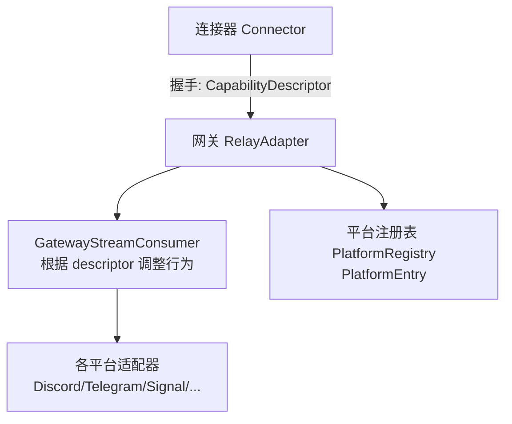
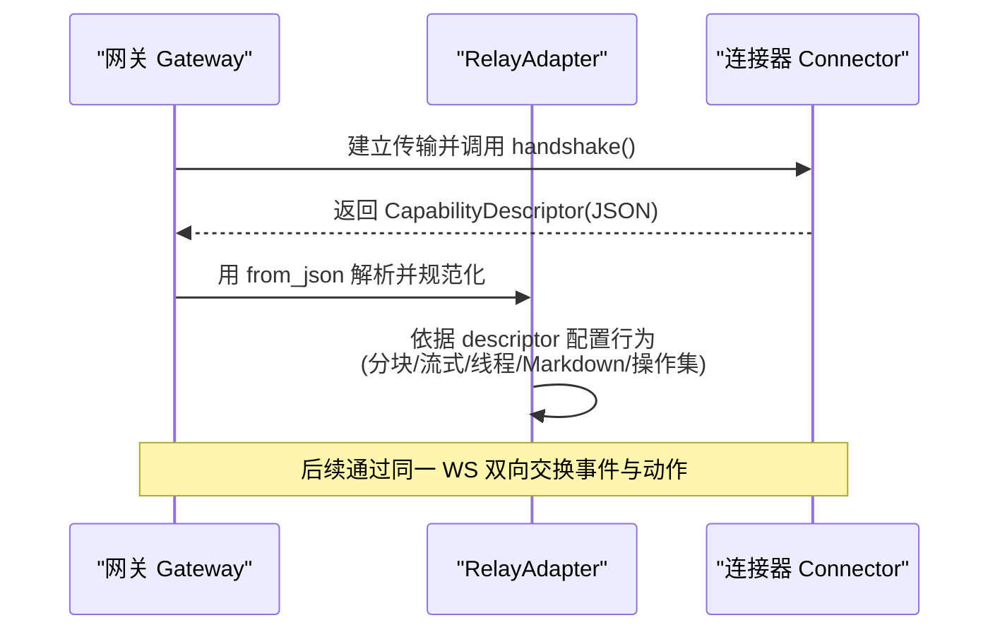
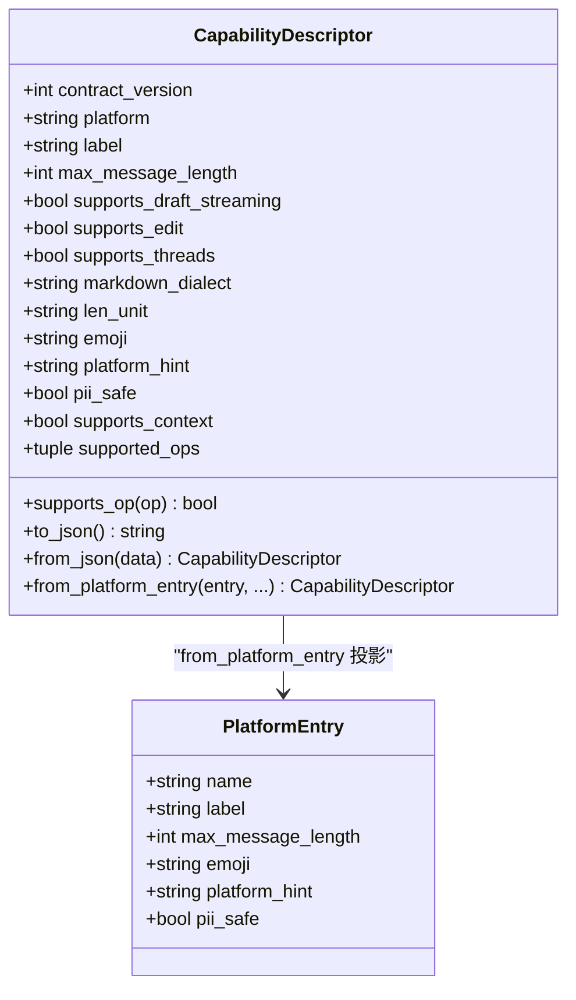
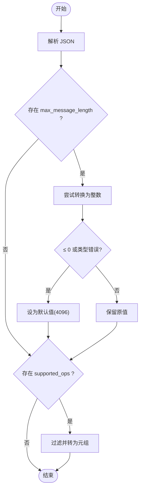

# Descriptor 能力描述消息

<cite>
**本文引用的文件**
- [gateway/relay/descriptor.py](file://gateway/relay/descriptor.py)
- [docs/relay-connector-contract.md](file://docs/relay-connector-contract.md)
- [gateway/platform_registry.py](file://gateway/platform_registry.py)
- [tests/gateway/relay/test_descriptor.py](file://tests/gateway/relay/test_descriptor.py)
- [tests/gateway/relay/test_descriptor_from_entry.py](file://tests/gateway/relay/test_descriptor_from_entry.py)
</cite>

## 目录
1. [简介](#简介)
2. [项目结构](#项目结构)
3. [核心组件](#核心组件)
4. [架构总览](#架构总览)
5. [详细组件分析](#详细组件分析)
6. [依赖关系分析](#依赖关系分析)
7. [性能与限制](#性能与限制)
8. [故障排查指南](#故障排查指南)
9. [结论](#结论)
10. [附录：字段校验规则与示例](#附录：字段校验规则与示例)

## 简介
本文件面向“连接器（Connector）—网关（Gateway）”握手阶段的能力协商，聚焦于 CapabilityDescriptor（能力描述）消息。它定义了连接器在握手时向网关声明的“平台能力画像”，包括最大消息长度、长度单位、是否支持草稿流式、编辑流式、线程、Markdown 方言、上下文能力以及出站操作能力集合等。网关据此调整行为（如分块策略、流式呈现、线程创建、媒体发送、交互提示等），实现“一个网关适配器服务多平台”的通用化目标。

## 项目结构
围绕 Descriptor 的关键代码与契约集中在以下位置：
- 能力描述数据模型与序列化：gateway/relay/descriptor.py
- 连接器-网关契约（含握手流程、字段语义、版本策略）：docs/relay-connector-contract.md
- 平台元数据来源（PlatformEntry）：gateway/platform_registry.py
- 单元测试（冻结性、投影映射、legacy 兼容）：tests/gateway/relay/test_descriptor*.py

图表来源
- [docs/relay-connector-contract.md:21-32](file://docs/relay-connector-contract.md#L21-L32)
- [gateway/relay/descriptor.py:1-29](file://gateway/relay/descriptor.py#L1-L29)
- [gateway/platform_registry.py:38-133](file://gateway/platform_registry.py#L38-L133)

章节来源
- [gateway/relay/descriptor.py:1-29](file://gateway/relay/descriptor.py#L1-L29)
- [docs/relay-connector-contract.md:21-32](file://docs/relay-connector-contract.md#L21-L32)
- [gateway/platform_registry.py:38-133](file://gateway/platform_registry.py#L38-L133)

## 核心组件
- CapabilityDescriptor：不可变的数据类，承载握手时的能力画像；提供 to_json/from_json、from_platform_entry、supports_op 等方法。
- PlatformEntry：平台元数据（名称、标签、最大消息长度、emoji、平台提示、PII 安全等），是 descriptor 的主要数据来源之一。
- 契约文档：定义握手流程、字段含义、版本策略、入站/出站帧、认证边界等。

章节来源
- [gateway/relay/descriptor.py:41-177](file://gateway/relay/descriptor.py#L41-L177)
- [gateway/platform_registry.py:38-133](file://gateway/platform_registry.py#L38-L133)
- [docs/relay-connector-contract.md:36-59](file://docs/relay-connector-contract.md#L36-L59)

## 架构总览
握手与能力协商时序如下：

图表来源
- [docs/relay-connector-contract.md:21-32](file://docs/relay-connector-contract.md#L21-L32)
- [gateway/relay/descriptor.py:94-135](file://gateway/relay/descriptor.py#L94-L135)

章节来源
- [docs/relay-connector-contract.md:21-32](file://docs/relay-connector-contract.md#L21-L32)
- [gateway/relay/descriptor.py:94-135](file://gateway/relay/descriptor.py#L94-L135)

## 详细组件分析

### CapabilityDescriptor 结构与字段
- contract_version：整数，当前为 1；实验期仅允许向后兼容的增量变更。
- platform / label：平台标识与人类可读标签。
- max_message_length：字符上限；0 视为无上限，解析时会被归一化为默认值（见后文）。
- supports_draft_streaming：是否支持草稿流式预览。
- supports_edit：是否支持基于编辑的流式更新；不支持时将退化为每段一条消息。
- supports_threads：是否支持创建/管理线程。
- markdown_dialect：Markdown 方言（plain/markdown_v2/discord 等），影响代码块等渲染能力。
- len_unit：长度单位，chars 或 utf16（Telegram 风格）。
- emoji / platform_hint / pii_safe：展示与隐私相关元信息。
- supports_context：是否可为对话附带上下文（群组/频道场景下的历史消息片段）。
- supported_ops：出站操作能力清单（send/edit/typing/follow_up/send_media/prompt/react/thread_create/thread_rename 等）；为空表示旧版连接器，回退到“遗留四件套”。

章节来源
- [gateway/relay/descriptor.py:41-79](file://gateway/relay/descriptor.py#L41-L79)
- [docs/relay-connector-contract.md:36-59](file://docs/relay-connector-contract.md#L36-L59)

### 从 PlatformEntry 投影生成 Descriptor
- from_platform_entry 将平台元数据（name/label/max_message_length/emoji/platform_hint/pii_safe）直接投影到 descriptor。
- 运行时能力位（len_unit、supports_*、markdown_dialect）由调用方根据平台适配器的探测结果填充。
- max_message_length 为 0 时映射为默认分块上限，保证可分块。

章节来源
- [gateway/relay/descriptor.py:137-177](file://gateway/relay/descriptor.py#L137-L177)
- [gateway/platform_registry.py:113-133](file://gateway/platform_registry.py#L113-L133)

### 能力协商过程与网关行为调整
- 握手阶段：连接器返回 descriptor，网关解析并固化该连接的生命周期能力画像。
- 分块与长度计算：max_message_length 与 len_unit 决定消息分块策略与长度函数选择。
- 流式呈现：supports_draft_streaming 与 supports_edit 控制草稿流式与编辑流式；不支持 edit 时降级为分段单条。
- 线程：supports_threads 决定是否使用 create_handoff_thread。
- Markdown：markdown_dialect 驱动 supports_code_blocks 等渲染能力。
- 上下文：supports_context 为真且为群聊时，连接器可在入站事件中附带只读上下文。
- 操作发现：supported_ops 用于出站能力发现；空列表时回退到“send/edit/typing/follow_up”的遗留集合。

章节来源
- [docs/relay-connector-contract.md:21-32](file://docs/relay-connector-contract.md#L21-L32)
- [docs/relay-connector-contract.md:36-59](file://docs/relay-connector-contract.md#L36-L59)
- [gateway/relay/descriptor.py:80-93](file://gateway/relay/descriptor.py#L80-L93)

### 多平台能力差异与限制
- 长度单位：Telegram 使用 UTF-16 码元计数（utf16），其他平台多为 chars。
- 流式能力：不同平台对草稿/编辑流式支持不同；不支持 edit 时需降级。
- 线程：部分平台原生支持线程（Discord/Telegram 论坛话题），部分不支持。
- Markdown：不同平台方言不同（plain/markdown_v2/discord），影响代码块与富文本。
- 上下文：群组/频道场景下，具备 supports_context 的平台可附带上下文片段。
- 操作集：新操作需显式声明；旧连接器默认仅支持遗留四件套。

章节来源
- [docs/relay-connector-contract.md:36-59](file://docs/relay-connector-contract.md#L36-L59)
- [gateway/relay/descriptor.py:20-28](file://gateway/relay/descriptor.py#L20-L28)

### 动态更新机制
- 实验期策略：contract_version 控制兼容性；新增可选字段与操作属于增量扩展，旧网关忽略未知键，旧连接器缺失可选键时使用默认值。
- 连接生命周期内：descriptor 为不可变对象，能力画像在握手后固定，不随会话变化而改变。
- 版本演进：破坏性变更需双端协同升级并提升版本；非破坏性变更可通过新增字段/操作渐进引入。

章节来源
- [gateway/relay/descriptor.py:36-39](file://gateway/relay/descriptor.py#L36-L39)
- [gateway/relay/descriptor.py:41-47](file://gateway/relay/descriptor.py#L41-L47)
- [docs/relay-connector-contract.md:1-7](file://docs/relay-connector-contract.md#L1-L7)
- [docs/relay-connector-contract.md:763-771](file://docs/relay-connector-contract.md#L763-L771)

## 依赖关系分析
- CapabilityDescriptor 依赖 PlatformEntry 作为静态元数据源，并通过运行时探测注入能力位。
- 契约文档定义了握手、字段语义、版本策略，是双方实现的权威依据。
- 测试用例验证了冻结性、投影正确性与 legacy 兼容逻辑。

图表来源
- [gateway/relay/descriptor.py:41-177](file://gateway/relay/descriptor.py#L41-L177)
- [gateway/platform_registry.py:38-133](file://gateway/platform_registry.py#L38-L133)

章节来源
- [gateway/relay/descriptor.py:41-177](file://gateway/relay/descriptor.py#L41-L177)
- [gateway/platform_registry.py:38-133](file://gateway/platform_registry.py#L38-L133)
- [tests/gateway/relay/test_descriptor.py:25-67](file://tests/gateway/relay/test_descriptor.py#L25-L67)
- [tests/gateway/relay/test_descriptor_from_entry.py:27-39](file://tests/gateway/relay/test_descriptor_from_entry.py#L27-L39)

## 性能与限制
- 分块上限：max_message_length 过小会导致频繁分块；过大可能超出平台限制。解析时对 0 或负数进行归一化处理，避免退化。
- 长度单位：utf16 计数更贴近 Telegram 限制，但计算成本略高；chars 更轻量。
- 流式降级：不支持 edit 时，每条分段以独立消息呈现，增加消息数量与 UI 刷新开销。
- 上下文：仅在群组/频道且 supports_context 为真时附加，避免不必要的带宽与处理开销。
- 操作发现：未显式声明的操作不会尝试调用，减少无效网络往返与错误处理。

[本节为通用指导，不直接分析具体文件]

## 故障排查指南
- 握手失败或能力缺失：检查 connector 是否正确返回 descriptor 且包含必要字段；确认 contract_version 与网关期望一致。
- 消息被截断：核对 max_message_length 与 len_unit；若为 0 或负数，将被归一化为默认值，可能导致不符合预期。
- 流式异常：若 supports_edit 为 false，应预期“每段一条消息”的降级行为；如需编辑流式，需在平台侧启用相应能力。
- 线程无法创建：确认 supports_threads 为 true；否则不应调用线程相关操作。
- 操作调用失败：检查 supported_ops 是否包含目标操作；旧连接器默认仅支持遗留四件套。
- 上下文未出现：确认 supports_context 为 true 且聊天类型为群组/频道/线程/论坛；DM 不会附带上下文。

章节来源
- [gateway/relay/descriptor.py:106-135](file://gateway/relay/descriptor.py#L106-L135)
- [docs/relay-connector-contract.md:36-59](file://docs/relay-connector-contract.md#L36-L59)

## 结论
CapabilityDescriptor 是连接器与网关之间的能力契约核心，通过握手阶段的标准化描述，使网关能够以统一方式适配多平台差异。其设计强调：
- 不可变性：握手后能力画像固定，确保连接期内行为稳定。
- 向前兼容：忽略未知字段，缺失可选字段使用默认值。
- 渐进增强：通过 supported_ops 与 supports_context 等新能力逐步扩展，无需破坏性变更。
- 明确限制：长度单位、分块上限、流式降级、线程与上下文等能力均受 descriptor 约束，便于网关做出正确决策。

[本节为总结性内容，不直接分析具体文件]

## 附录：字段校验规则与示例

### 字段校验规则（来自 from_json 的规范化）
- max_message_length：
  - 若存在且可解析为整数，且 ≤ 0，则归一化为默认值（文档中约定为 4096）。
  - 若类型错误或无法解析，同样归一化为默认值。
- supported_ops：
  - 若存在且为列表/元组，则过滤出字符串类型的非空元素，转为元组存储。
  - 若非列表/元组或包含非字符串元素，则降级为空元组，触发“遗留四件套”回退。
- 其他可选字段：
  - 缺失时使用 dataclass 默认值；未知键被忽略，保证向前兼容。

章节来源
- [gateway/relay/descriptor.py:98-135](file://gateway/relay/descriptor.py#L98-L135)

### JSON 示例（示意）
以下为符合契约的握手 payload 示例（字段顺序不影响解析）：
{
  "contract_version": 1,
  "platform": "telegram",
  "label": "Telegram",
  "max_message_length": 4096,
  "supports_draft_streaming": false,
  "supports_edit": true,
  "supports_threads": true,
  "markdown_dialect": "markdown_v2",
  "len_unit": "utf16",
  "emoji": "✈️",
  "platform_hint": "You are on Telegram.",
  "pii_safe": false,
  "supports_context": false,
  "supported_ops": ["send", "edit", "typing", "follow_up"]
}

说明：
- 若省略 supported_ops，网关将假设支持 send/edit/typing/follow_up。
- 若 max_message_length 为 0 或负数，解析时会归一化为默认值。
- 若 supports_context 为 true 且聊天类型为群组/频道/线程/论坛，连接器可在入站事件中附带只读上下文。

章节来源
- [docs/relay-connector-contract.md:36-59](file://docs/relay-connector-contract.md#L36-L59)
- [gateway/relay/descriptor.py:98-135](file://gateway/relay/descriptor.py#L98-L135)

### 流程图：from_json 规范化路径

图表来源
- [gateway/relay/descriptor.py:106-135](file://gateway/relay/descriptor.py#L106-L135)