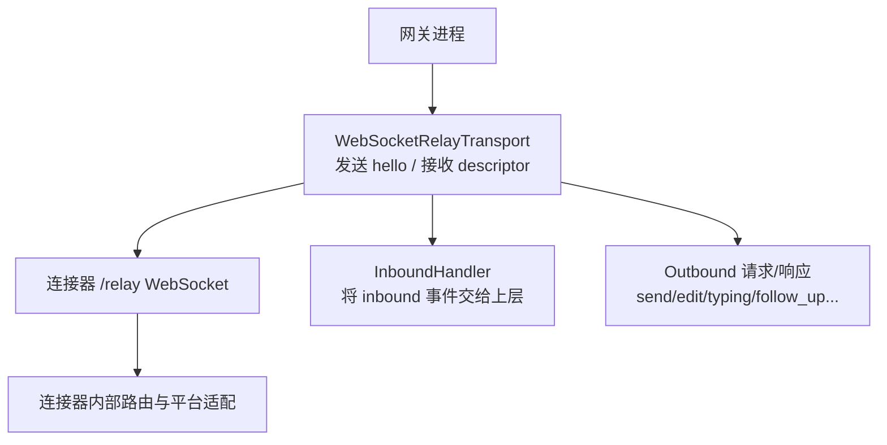
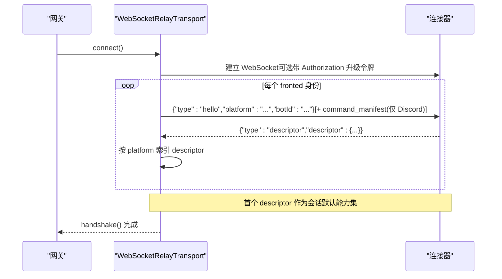
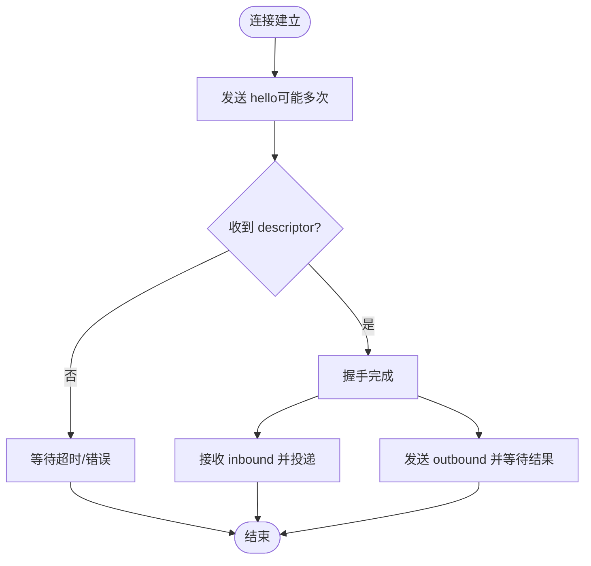
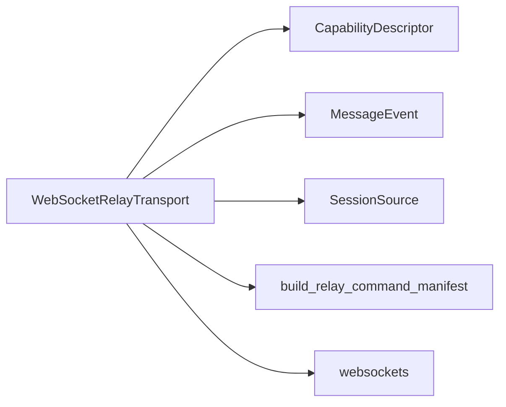

# Hello 握手消息

<cite>
**本文引用的文件**
- [ws_transport.py](file://gateway/relay/ws_transport.py)
- [command_manifest.py](file://gateway/relay/command_manifest.py)
- [relay-connector-contract.md](file://docs/relay-connector-contract.md)
</cite>

## 目录
1. [简介](#简介)
2. [项目结构](#项目结构)
3. [核心组件](#核心组件)
4. [架构总览](#架构总览)
5. [详细组件分析](#详细组件分析)
6. [依赖关系分析](#依赖关系分析)
7. [性能与可靠性](#性能与可靠性)
8. [故障排查指南](#故障排查指南)
9. [结论](#结论)
10. [附录：JSON 示例与字段说明](#附录json-示例与字段说明)

## 简介
本文档聚焦于网关与连接器之间的“Hello 握手”协议，详细说明 hello 消息的完整字段结构、多平台身份声明机制（Phase 1.5）、Discord 平台的 command_manifest 扩展、认证升级令牌以及 4401 未授权状态码的处理策略。文档同时给出完整的握手流程时序图与错误处理建议，帮助实现者正确对接并稳定运行。

## 项目结构
与 Hello 握手直接相关的代码与契约集中在以下位置：
- 网关侧 WebSocket 传输层：负责拨号、发送 hello、接收 descriptor、处理 inbound/outbound 帧、重连与鉴权失效处理。
- 命令清单模块：为 Discord 平台在 hello 中声明 slash 命令集合，供连接器同步到应用级命令注册表。
- 连接器契约文档：定义握手阶段、descriptor 能力描述、inbound/outbound 帧格式、认证边界与 4401 语义。

图表来源
- [ws_transport.py:1-28](file://gateway/relay/ws_transport.py#L1-L28)
- [ws_transport.py:441-484](file://gateway/relay/ws_transport.py#L441-L484)
- [relay-connector-contract.md:21-32](file://docs/relay-connector-contract.md#L21-L32)

章节来源
- [ws_transport.py:1-28](file://gateway/relay/ws_transport.py#L1-L28)
- [relay-connector-contract.md:21-32](file://docs/relay-connector-contract.md#L21-L32)

## 核心组件
- WebSocketRelayTransport：维护与连接器的长连接，负责握手、帧收发、重连、鉴权失效检测。
- CapabilityDescriptor：连接器在握手后返回的能力描述，用于配置网关对平台能力的认知（如最大消息长度、是否支持编辑/线程等）。
- command_manifest：Discord 平台在 hello 中声明的命令清单，连接器据此同步全局应用命令。

章节来源
- [ws_transport.py:339-422](file://gateway/relay/ws_transport.py#L339-L422)
- [relay-connector-contract.md:36-59](file://docs/relay-connector-contract.md#L36-L59)
- [command_manifest.py:1-26](file://gateway/relay/command_manifest.py#L1-L26)

## 架构总览
握手流程（简化）：
1. 网关建立到连接器的 WebSocket 连接（可携带 Authorization 升级令牌）。
2. 网关发送一个或多个 hello 帧（每个 fronted 身份一个），包含 type、platform、botId，必要时附带 command_manifest（仅 Discord）。
3. 连接器回复 descriptor（每个 hello 对应一个），网关收集并按平台索引。
4. 握手完成后，开始双向通信：连接器推送 inbound，网关发送 outbound。

图表来源
- [ws_transport.py:445-484](file://gateway/relay/ws_transport.py#L445-L484)
- [ws_transport.py:823-851](file://gateway/relay/ws_transport.py#L823-L851)
- [relay-connector-contract.md:21-32](file://docs/relay-connector-contract.md#L21-L32)

## 详细组件分析

### Hello 消息字段结构
- 必需字段
  - type: 固定为 "hello"
  - platform: 底层平台名（例如 "discord"、"telegram"）
  - botId: 该身份对应的机器人标识
- 可选扩展
  - command_manifest: 仅当 platform 为 "discord" 时附加，值为命令清单数组（见下节）

说明：
- 网关会为每个 fronted 身份发送一个 hello；第一个身份作为会话默认身份，后续身份被连接器累积为允许的 egress 目标集合。
- 对于非 Discord 平台，不附加 command_manifest。

章节来源
- [ws_transport.py:465-484](file://gateway/relay/ws_transport.py#L465-L484)
- [command_manifest.py:1-26](file://gateway/relay/command_manifest.py#L1-L26)

### 多平台身份声明（Phase 1.5）
- 机制：构造 transport 时可传入 identities 列表，每项为 (platform, bot_id)。连接建立后，网关会依次发送多个 hello，每个 identity 一个。
- 效果：连接器为每个 identity 返回一个 descriptor，网关按 platform 索引保存；出站 action 可携带 platform 与匹配的 botId，确保连接器校验通过。
- 兼容性：单平台场景下 identities 默认只含一项，行为与旧版一致。

章节来源
- [ws_transport.py:342-371](file://gateway/relay/ws_transport.py#L342-L371)
- [ws_transport.py:580-595](file://gateway/relay/ws_transport.py#L580-L595)
- [ws_transport.py:706-717](file://gateway/relay/ws_transport.py#L706-L717)

### Discord 命令清单（command_manifest）
- 作用：在 hello 中声明网关支持的 slash 命令集合，连接器据此与 Discord 的全局应用命令注册表进行幂等对齐（GET → diff → PUT 覆盖）。
- 内容：由 build_relay_command_manifest() 生成，包含命令名、描述及可选参数选项。
- 健壮性：构建失败不会阻塞握手；无效条目会被连接器忽略（fail-open per entry）。

章节来源
- [ws_transport.py:472-484](file://gateway/relay/ws_transport.py#L472-L484)
- [command_manifest.py:48-145](file://gateway/relay/command_manifest.py#L48-L145)

### 认证机制与升级令牌
- 通道认证：网关在 WebSocket 升级时携带 Authorization: Bearer <token>，token 使用 per-gateway secret 以 HMAC-SHA256 签名（payload=gatewayId，sig=HMAC(payload:exp, secret)）。
- 验证结果：连接器校验失败或缺失则拒绝升级，关闭连接并返回私有应用码 4401（unauthorized）。
- 安全边界：连接器是唯一的平台密钥持有者与签名验证点；网关不再重复验证平台签名。

章节来源
- [relay-connector-contract.md:607-627](file://docs/relay-connector-contract.md#L607-L627)
- [ws_transport.py:486-501](file://gateway/relay/ws_transport.py#L486-L501)

### 4401 未授权状态码处理
- 含义：连接器在 WS 升级阶段或握手成功后因凭证撤销/不匹配而关闭连接，返回 4401。
- 行为差异：
  - 握手成功前出现 4401：视为冷启动/尚未配置的竞态，保持可重试。
  - 握手成功后出现 4401：视为凭证被撤销（opt-out/deprovision），标记为终端错误，停止重连并上报“已禁用”。
- 实现要点：读取异常中的 close code，结合 _handshake_succeeded 标志判断，设置 _auth_revoked 并终止重连循环。

章节来源
- [relay-connector-contract.md:251-258](file://docs/relay-connector-contract.md#L251-L258)
- [ws_transport.py:61-66](file://gateway/relay/ws_transport.py#L61-L66)
- [ws_transport.py:745-775](file://gateway/relay/ws_transport.py#L745-L775)
- [ws_transport.py:845-851](file://gateway/relay/ws_transport.py#L845-L851)

### 握手与后续通信时序
- 握手：connect → 发送 hello(s) → 接收 descriptor(s) → handshake() 返回。
- 入站：连接器通过同一 WS 推送 inbound 帧，网关转换为 MessageEvent 并调用 InboundHandler。
- 出站：网关发送 outbound 帧（send/edit/typing/follow_up 等），等待 outbound_result。
- 中断：支持 interrupt_inbound 与 send_interrupt。

图表来源
- [ws_transport.py:441-484](file://gateway/relay/ws_transport.py#L441-L484)
- [ws_transport.py:823-889](file://gateway/relay/ws_transport.py#L823-L889)
- [relay-connector-contract.md:63-125](file://docs/relay-connector-contract.md#L63-L125)

## 依赖关系分析
- ws_transport.py 依赖：
  - websockets（可选，缺失时抛出运行时错误）
  - gateway.relay.descriptor.CapabilityDescriptor（解析 descriptor）
  - gateway.platforms.base.MessageEvent（入站事件模型）
  - gateway.session.SessionSource（会话源映射）
  - gateway.relay.command_manifest.build_relay_command_manifest（Discord 命令清单）
- 契约约束：
  - 握手帧类型与字段遵循 relay-connector-contract.md 约定。
  - 4401 语义与认证边界由契约明确，实现需严格遵循。

图表来源
- [ws_transport.py:39-42](file://gateway/relay/ws_transport.py#L39-L42)
- [ws_transport.py:46-51](file://gateway/relay/ws_transport.py#L46-L51)
- [ws_transport.py:472-484](file://gateway/relay/ws_transport.py#L472-L484)

章节来源
- [ws_transport.py:39-51](file://gateway/relay/ws_transport.py#L39-L51)
- [relay-connector-contract.md:21-32](file://docs/relay-connector-contract.md#L21-L32)

## 性能与可靠性
- 超时控制：握手与出站均有超时保护，避免长期阻塞。
- 重连策略：意外断开时启用指数退避重连；休眠恢复时使用更慢的重连节奏，避免与平台暂停窗口冲突。
- 健壮性：
  - 命令清单构建失败不影响握手。
  - 无效命令条目被连接器忽略（逐条 fail-open）。
  - 4401 在握手成功后被视为终端错误，避免无意义重连风暴。

章节来源
- [ws_transport.py:53-59](file://gateway/relay/ws_transport.py#L53-L59)
- [ws_transport.py:791-822](file://gateway/relay/ws_transport.py#L791-L822)
- [command_manifest.py:22-26](file://gateway/relay/command_manifest.py#L22-L26)

## 故障排查指南
- 无法握手/无 descriptor
  - 检查连接器 URL 是否正确（需以 /relay 结尾）。
  - 确认 identities 列表与后端配置一致，确保每个 platform:botId 均被允许。
  - 查看日志中是否有 JSON 解析错误或超时。
- 频繁 4401
  - 若发生在握手成功后，通常为凭证撤销（opt-out/deprovision），需重新注册实例或更新密钥。
  - 若发生在握手前，可能是冷启动竞态或尚未完成 provision，可稍后重试。
- 命令未生效
  - 确认 platform 为 "discord" 且 command_manifest 已成功附加。
  - 观察连接器侧是否完成幂等同步（GET→diff→PUT）。
- 入站丢失
  - 确认 InboundHandler 已注册且未被取消。
  - 检查是否处于 going_idle 缓冲模式，必要时等待 going_idle_ack 后再关闭。

章节来源
- [ws_transport.py:69-95](file://gateway/relay/ws_transport.py#L69-L95)
- [ws_transport.py:745-775](file://gateway/relay/ws_transport.py#L745-L775)
- [ws_transport.py:609-633](file://gateway/relay/ws_transport.py#L609-L633)

## 结论
Hello 握手是网关与连接器建立可信通道的关键步骤。通过多身份 hello 与 descriptor 能力协商，网关可以精确感知各平台能力并安全地进行双向通信。Discord 的 command_manifest 扩展使命令注册与网关能力保持一致。严格的认证与 4401 处理策略保障了生产环境的稳定性与安全性。

## 附录：JSON 示例与字段说明
以下为基于实现的字段说明与示例结构（不包含具体值）：

- hello 帧（单身份）
  - 字段
    - type: "hello"
    - platform: 字符串，底层平台名
    - botId: 字符串，机器人标识
    - command_manifest: 可选，仅当 platform 为 "discord" 时存在，值为命令清单数组
  - 示例结构
    - {
        "type": "hello",
        "platform": "<平台名>",
        "botId": "<机器人标识>"
      }
    - 若为 Discord：
      - {
          "type": "hello",
          "platform": "discord",
          "botId": "<机器人标识>",
          "command_manifest": [
            {"name": "<命令名>", "description": "<描述>", "options?": [...]}
          ]
        }

- descriptor 帧（连接器回复）
  - 字段
    - type: "descriptor"
    - descriptor: 能力描述对象（包含 contract_version、platform、label、max_message_length、supports_draft_streaming、supports_edit、supports_threads、markdown_dialect、len_unit 等）
  - 示例结构
    - {
        "type": "descriptor",
        "descriptor": {
          "contract_version": <整数>,
          "platform": "<平台名>",
          "label": "<可读标签>",
          "max_message_length": <整数>,
          "supports_draft_streaming": <布尔>,
          "supports_edit": <布尔>,
          "supports_threads": <布尔>,
          "markdown_dialect": "<方言>",
          "len_unit": "<chars|utf16>"
        }
      }

- 认证升级令牌（HTTP 头）
  - 名称: Authorization
  - 值: Bearer <token>
  - token 构成: base64url(payload:exp:sig)，其中 payload=gatewayId，sig=HMAC(payload:exp, secret)

- 错误处理
  - 4401 未授权
    - 握手成功后出现：视为凭证撤销，停止重连并上报“已禁用”。
    - 握手前出现：视为冷启动竞态，保持可重试。

章节来源
- [ws_transport.py:465-484](file://gateway/relay/ws_transport.py#L465-L484)
- [ws_transport.py:823-851](file://gateway/relay/ws_transport.py#L823-L851)
- [relay-connector-contract.md:36-59](file://docs/relay-connector-contract.md#L36-L59)
- [relay-connector-contract.md:607-627](file://docs/relay-connector-contract.md#L607-L627)
- [relay-connector-contract.md:251-258](file://docs/relay-connector-contract.md#L251-L258)
- [command_manifest.py:48-145](file://gateway/relay/command_manifest.py#L48-L145)