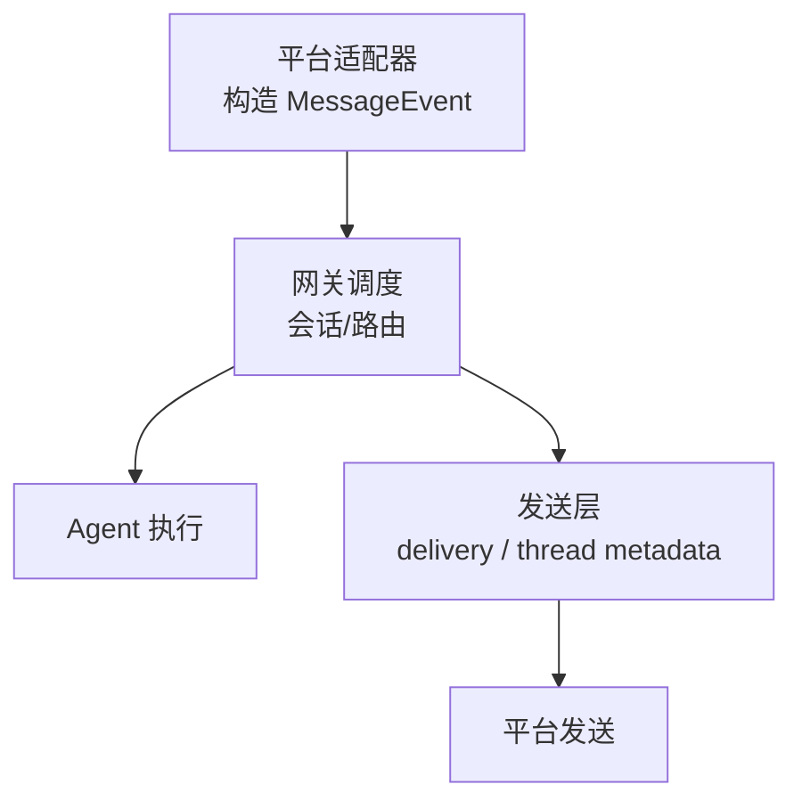
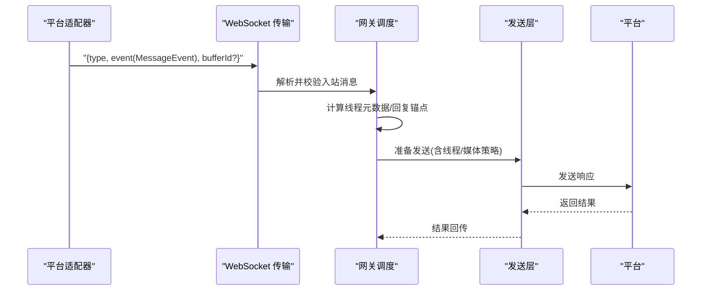
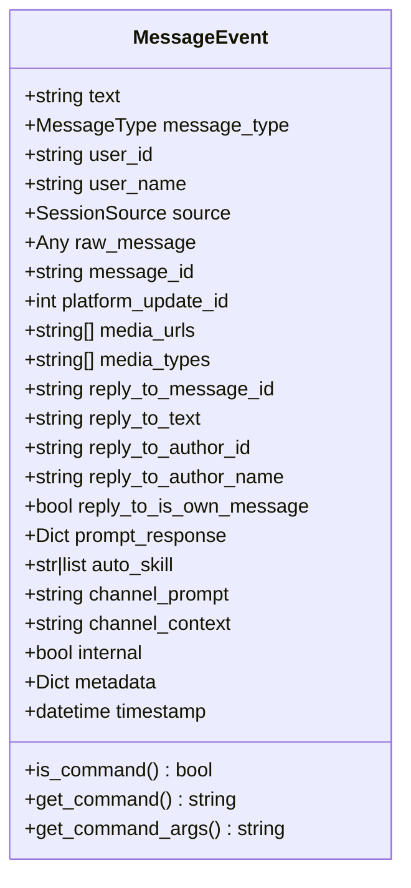
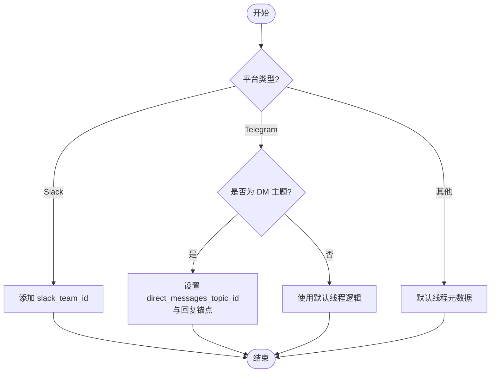
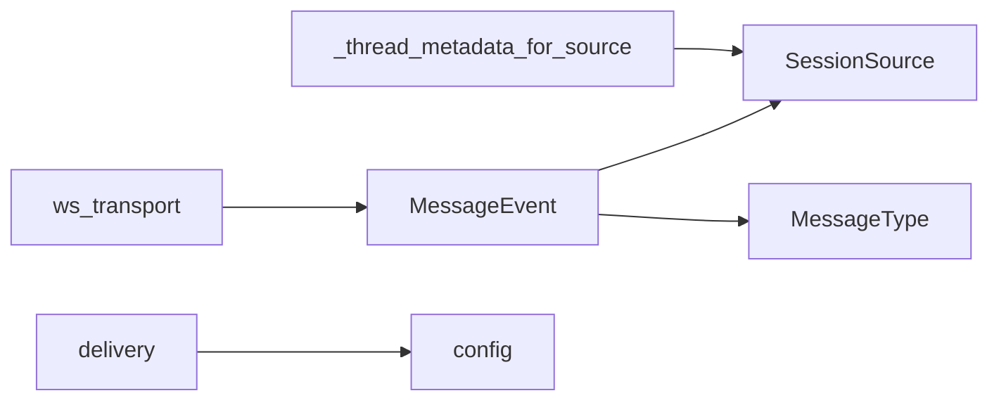

# Inbound 入站消息

<cite>
**本文引用的文件**
- [gateway/platforms/base.py](file://gateway/platforms/base.py)
- [gateway/relay/ws_transport.py](file://gateway/relay/ws_transport.py)
- [gateway/delivery.py](file://gateway/delivery.py)
- [gateway/config.py](file://gateway/config.py)
- [gateway/platforms/webhook.py](file://gateway/platforms/webhook.py)
</cite>

## 目录
1. [简介](#简介)
2. [项目结构](#项目结构)
3. [核心组件](#核心组件)
4. [架构总览](#架构总览)
5. [详细组件分析](#详细组件分析)
6. [依赖关系分析](#依赖关系分析)
7. [性能考量](#性能考量)
8. [故障排查指南](#故障排查指南)
9. [结论](#结论)
10. [附录](#附录)

## 简介
本文件面向“入站消息（Inbound）”的完整规范与实现说明，覆盖以下目标：
- 入站消息在网关中的统一数据结构、字段含义与约束。
- MessageEvent 数据模型：文本内容、消息类型、来源信息、回复上下文、媒体附件、平台特定信号等。
- 平台特定字段的处理机制（如 Slack 命令规范化、Discord 线程信息等）。
- 上下文消息 channel_context 的处理机制。
- 特殊消息类型：回复消息、引用消息、媒体附件等的处理流程。
- 完整的 JSON 示例与字段映射关系。
- 消息路由与会话绑定的机制。

## 项目结构
入站消息从各平台适配器进入网关后，会被归一化为统一的 MessageEvent，再经由网关调度到会话与 Agent 执行链路。关键位置包括：
- 平台适配层：将平台原始事件转换为 MessageEvent。
- 传输层：WebSocket 入站协议定义 {type, event, bufferId?} 的契约。
- 网关调度层：根据 source、thread_id、reply_to_message_id 等决定路由与会话绑定。
- 发送层：根据配置与平台能力选择是否线程化、是否作为音频发送等。

图表来源
- [gateway/platforms/base.py:78-150](file://gateway/platforms/base.py#L78-L150)
- [gateway/delivery.py:604-604](file://gateway/delivery.py#L604-L604)

章节来源
- [gateway/platforms/base.py:78-150](file://gateway/platforms/base.py#L78-L150)
- [gateway/delivery.py:604-604](file://gateway/delivery.py#L604-L604)

## 核心组件
- MessageEvent：入站消息的统一数据模型，承载文本、类型、来源、回复、媒体、平台信号、时间戳等。
- WebSocket 入站协议：{type, event, bufferId?}，其中 event 为 MessageEvent 的序列化表示。
- 线程元数据构建：_thread_metadata_for_source 用于生成跨平台的线程路由元数据。
- 回复锚点选择：_reply_anchor_for_event 用于不同平台回复语义的锚点选择。
- 发送配置：delivery 与 config 中关于线程化策略、媒体发送策略等。

章节来源
- [gateway/platforms/base.py:2066-2180](file://gateway/platforms/base.py#L2066-L2180)
- [gateway/relay/ws_transport.py:14-14](file://gateway/relay/ws_transport.py#L14-L14)
- [gateway/platforms/base.py:78-150](file://gateway/platforms/base.py#L78-L150)
- [gateway/delivery.py:604-604](file://gateway/delivery.py#L604-L604)
- [gateway/config.py:602-604](file://gateway/config.py#L602-L604)

## 架构总览
入站消息从平台到达后，经历如下阶段：
1. 平台适配器解析原始事件，填充 MessageEvent 字段（文本、类型、来源、回复、媒体、平台信号等）。
2. 通过 WebSocket 入站协议以 {type, event, bufferId?} 形式提交到网关。
3. 网关依据 source、thread_id、reply_to_message_id 等计算线程元数据，并决定路由与会话绑定。
4. 若存在 channel_context，则在触发消息前注入上下文，保证对话连贯性。
5. 发送时根据配置与平台能力进行线程化、媒体格式选择等。

图表来源
- [gateway/relay/ws_transport.py:14-14](file://gateway/relay/ws_transport.py#L14-L14)
- [gateway/platforms/base.py:78-150](file://gateway/platforms/base.py#L78-L150)
- [gateway/delivery.py:604-604](file://gateway/delivery.py#L604-L604)

## 详细组件分析

### MessageEvent 数据模型
MessageEvent 是入站消息的标准化载体，关键字段包括：
- text：消息文本内容。
- message_type：消息类型（如文本、图片、语音等）。
- user_id/user_name：消息作者标识与名称。
- source：会话来源对象，包含 platform、chat_type、thread_id、scope_id 等。
- raw_message/message_id：原始平台消息与消息 ID。
- platform_update_id：平台更新标识（如 Telegram update_id），用于重启偏移推进。
- media_urls/media_types：媒体附件路径与类型。
- reply_to_*：回复上下文（ID、文本、作者、是否为本机器人消息）。
- prompt_response：交互式提示响应（Phase 3 中继场景）。
- auto_skill/channel_prompt：自动技能与频道提示。
- channel_context：历史回填的上下文片段，用于补充缺失对话。
- internal/metadata/timestamp：内部标志、平台信号、时间戳。

图表来源
- [gateway/platforms/base.py:2066-2180](file://gateway/platforms/base.py#L2066-L2180)

章节来源
- [gateway/platforms/base.py:2066-2180](file://gateway/platforms/base.py#L2066-L2180)

### 线程元数据与回复锚点
- _thread_metadata_for_source：根据 source 的平台、聊天类型、thread_id、scope_id 等生成线程元数据，支持 Slack 团队标识、Telegram DM 主题回复回退等。
- _reply_anchor_for_event：根据不同平台选择回复锚点，避免错误地回复到不存在的线程或种子消息。

图表来源
- [gateway/platforms/base.py:78-150](file://gateway/platforms/base.py#L78-L150)

章节来源
- [gateway/platforms/base.py:78-150](file://gateway/platforms/base.py#L78-L150)

### 平台特定字段与处理
- Slack：
  - 命令规范化：部分入口会将自然语言指令改写为斜杠命令，确保高影响操作走安全路径。
  - 线程处理：通过 _thread_metadata_for_source 携带 slack_team_id，避免多工作区误用主客户端。
- Discord：
  - 线程信息：通过 source.thread_id 与 delivery 配置控制是否线程化回复。
- Telegram：
  - DM 主题：使用 direct_messages_topic_id 与回复锚点确保回复在活跃车道。
- Feishu：
  - 线程与回复：当存在 thread_id 且 reply_to_message_id 时，优先使用该回复锚点。

章节来源
- [gateway/platforms/base.py:78-150](file://gateway/platforms/base.py#L78-L150)
- [gateway/config.py:602-604](file://gateway/config.py#L602-L604)
- [gateway/delivery.py:604-604](file://gateway/delivery.py#L604-L604)

### 上下文消息 channel_context 的处理
- channel_context 用于历史回填的上下文片段，通常由 history backfill 产生。
- 网关在触发消息前注入该上下文，随后将触发消息本身追加其后，保证对话连贯性与上下文完整性。
- 该字段与 text 分离，便于上层按触发消息单独处理后再拼接上下文。

章节来源
- [gateway/platforms/base.py:2131-2135](file://gateway/platforms/base.py#L2131-L2135)
- [gateway/relay/ws_transport.py:100-106](file://gateway/relay/ws_transport.py#L100-L106)

### 特殊消息类型处理
- 回复消息：
  - 通过 reply_to_message_id、reply_to_text、reply_to_author_* 等字段携带回复上下文。
  - 回复锚点选择遵循平台差异，避免错误回复。
- 引用消息：
  - 通过 reply_to_* 与 channel_context 组合，确保引用内容与上下文一致。
- 媒体附件：
  - media_urls 与 media_types 描述本地路径与类型。
  - should_send_media_as_audio 根据平台与扩展名决定使用音频发送器还是文档发送。

章节来源
- [gateway/platforms/base.py:2101-2112](file://gateway/platforms/base.py#L2101-L2112)
- [gateway/platforms/base.py:153-173](file://gateway/platforms/base.py#L153-L173)

### 消息路由与会话绑定
- 路由键：platform、chat_type、thread_id、message_thread_id、reply_to_message_id 等共同决定路由与会话。
- 线程化策略：config 中可配置是否仅首条分片线程化、全部分片线程化或不线程化。
- 会话绑定：source 对象携带平台与聊天信息，结合 thread_id 确定会话归属。

章节来源
- [gateway/config.py:602-604](file://gateway/config.py#L602-L604)
- [gateway/delivery.py:604-604](file://gateway/delivery.py#L604-L604)
- [gateway/platforms/base.py:78-150](file://gateway/platforms/base.py#L78-L150)

## 依赖关系分析
- MessageEvent 依赖 SessionSource 与 MessageType。
- 线程元数据构建依赖 source 的平台与聊天类型。
- 发送层依赖 delivery 与 config 的策略。
- WebSocket 传输依赖 {type, event, bufferId?} 契约。

图表来源
- [gateway/platforms/base.py:2066-2180](file://gateway/platforms/base.py#L2066-L2180)
- [gateway/platforms/base.py:78-150](file://gateway/platforms/base.py#L78-L150)
- [gateway/delivery.py:604-604](file://gateway/delivery.py#L604-L604)
- [gateway/config.py:602-604](file://gateway/config.py#L602-L604)
- [gateway/relay/ws_transport.py:14-14](file://gateway/relay/ws_transport.py#L14-L14)

章节来源
- [gateway/platforms/base.py:2066-2180](file://gateway/platforms/base.py#L2066-L2180)
- [gateway/platforms/base.py:78-150](file://gateway/platforms/base.py#L78-L150)
- [gateway/delivery.py:604-604](file://gateway/delivery.py#L604-L604)
- [gateway/config.py:602-604](file://gateway/config.py#L602-L604)
- [gateway/relay/ws_transport.py:14-14](file://gateway/relay/ws_transport.py#L14-L14)

## 性能考量
- 线程化策略：合理配置可减少冗余消息与提升可读性。
- 媒体发送：根据平台能力选择音频或文档发送，避免不必要的转码。
- 上下文注入：channel_context 仅在必要时注入，减少上下文膨胀。
- 回复锚点：正确选择锚点可减少错误回复导致的重试与失败。

[本节提供通用指导，无需具体文件分析]

## 故障排查指南
- 检查 MessageEvent 字段是否完整：text、message_type、source、media_* 等。
- 验证线程元数据：确认 platform、chat_type、thread_id、scope_id 是否正确。
- 检查回复锚点：确保 reply_to_message_id 与平台语义一致。
- 查看 delivery 配置：确认线程化策略是否符合预期。
- 审查 WebSocket 入站协议：确保 {type, event, bufferId?} 格式正确。

章节来源
- [gateway/platforms/base.py:2066-2180](file://gateway/platforms/base.py#L2066-L2180)
- [gateway/platforms/base.py:78-150](file://gateway/platforms/base.py#L78-L150)
- [gateway/delivery.py:604-604](file://gateway/delivery.py#L604-L604)
- [gateway/relay/ws_transport.py:14-14](file://gateway/relay/ws_transport.py#L14-L14)

## 结论
Inbound 入站消息通过 MessageEvent 实现了跨平台的统一抽象，结合线程元数据、回复锚点、上下文注入与发送策略，确保了消息路由与会话绑定的准确性与灵活性。平台特定字段与处理逻辑在保持兼容性的同时，提供了丰富的扩展能力。

[本节总结无具体文件分析]

## 附录

### 入站消息 JSON 示例与字段映射
以下为典型入站消息的 JSON 结构与字段映射说明（基于 ws_transport 契约与 MessageEvent 模型）：
- type：入站消息类型（例如 "inbound"）。
- event：MessageEvent 的序列化表示，包含 text、message_type、user_id、user_name、source、raw_message、message_id、platform_update_id、media_urls、media_types、reply_to_*、prompt_response、auto_skill、channel_prompt、channel_context、internal、metadata、timestamp。
- bufferId：可选的缓冲标识，用于流式或批量处理。

字段映射要点：
- text → 消息文本内容。
- message_type → 消息类型（文本、图片、语音等）。
- source.platform/chat_type/thread_id/scope_id → 平台与聊天上下文。
- reply_to_message_id/reply_to_text/reply_to_author_* → 回复上下文。
- media_urls/media_types → 媒体附件路径与类型。
- channel_context → 历史回填上下文片段。
- metadata → 平台特定信号（如 whatsapp_from_owner）。

章节来源
- [gateway/relay/ws_transport.py:14-14](file://gateway/relay/ws_transport.py#L14-L14)
- [gateway/platforms/base.py:2066-2180](file://gateway/platforms/base.py#L2066-L2180)