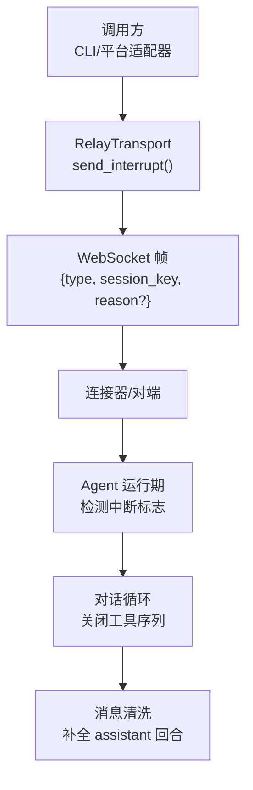
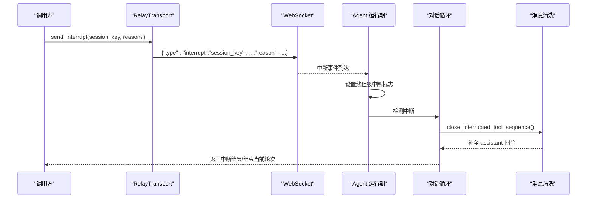
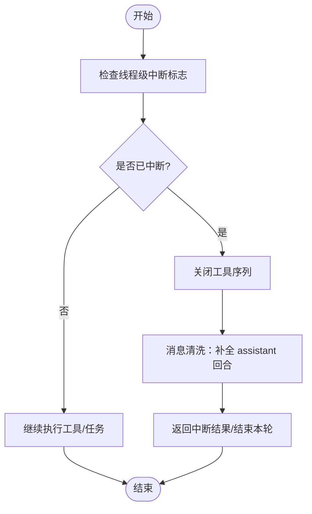
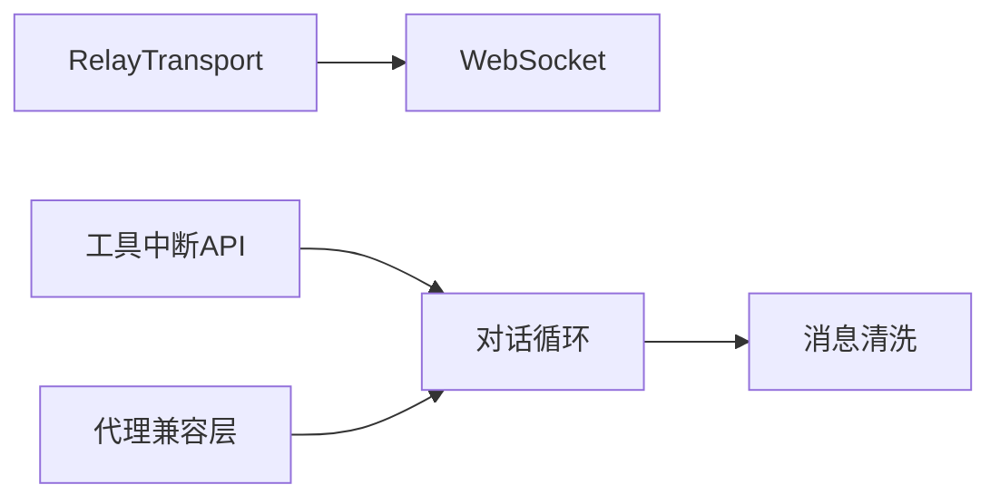

# Interrupt 中断消息

<cite>
**本文引用的文件**
- [ws_transport.py](file://gateway/relay/ws_transport.py)
- [transport.py](file://gateway/relay/transport.py)
- [interrupt.py](file://tools/interrupt.py)
- [interrupt_compat.py](file://agent/interrupt_compat.py)
- [message_sanitization.py](file://agent/message_sanitization.py)
- [conversation_loop.py](file://agent/conversation_loop.py)
- [codex_runtime.py](file://agent/codex_runtime.py)
- [test_relay_interrupt.py](file://tests/gateway/relay/test_relay_interrupt.py)
</cite>

## 目录
1. [简介](#简介)
2. [项目结构](#项目结构)
3. [核心组件](#核心组件)
4. [架构总览](#架构总览)
5. [详细组件分析](#详细组件分析)
6. [依赖关系分析](#依赖关系分析)
7. [性能考量](#性能考量)
8. [故障排查指南](#故障排查指南)
9. [结论](#结论)
10. [附录：JSON 示例与最佳实践](#附录json-示例与最佳实践)

## 简介
本文件系统化说明 Interrupt（中断）消息在系统中的定义、传播路径、处理流程与恢复策略。重点覆盖：
- 中断消息的字段结构与含义（type、session_key、reason 等）
- 典型使用场景（用户停止操作、系统资源不足、会话重置等）
- 中断在网关到代理、工具执行层的传播与消费机制
- 会话级中断控制与状态清理
- 中断原因的分类与标准化表示
- 与其他消息类型的优先级与冲突处理
- JSON 示例与最佳实践

## 项目结构
围绕中断的关键代码分布在以下模块：
- 网关中继传输层：负责将中断消息以统一帧格式发送到对端连接器，并承载 session_key 与 reason
- 工具层线程级中断信号：为多会话并发提供线程隔离的中断标记
- 代理侧兼容层：统一新旧中断接口，确保第三方代理可被中断
- 消息清洗与会话收尾：在中断发生时补全消息角色交替，避免上下文丢失
- 对话循环与运行时：检测中断、关闭工具序列、携带中断信息进入下一轮

图表来源
- [ws_transport.py:605-606](file://gateway/relay/ws_transport.py#L605-L606)
- [conversation_loop.py:2908-2908](file://agent/conversation_loop.py#L2908-L2908)
- [message_sanitization.py:296-325](file://agent/message_sanitization.py#L296-L325)

章节来源
- [ws_transport.py:15-24](file://gateway/relay/ws_transport.py#L15-L24)
- [ws_transport.py:605-606](file://gateway/relay/ws_transport.py#L605-L606)
- [conversation_loop.py:2908-2908](file://agent/conversation_loop.py#L2908-L2908)
- [message_sanitization.py:296-325](file://agent/message_sanitization.py#L296-L325)

## 核心组件
- 中继传输层中断发送：通过 send_interrupt(session_key, reason?) 构造并发送中断帧
- 工具层线程级中断：set_interrupt()/is_interrupted() 提供线程隔离的中断标记，供工具轮询
- 代理中断兼容：request_hard_interrupt(agent, message?) 兼容新旧中断接口
- 会话收尾与消息清洗：close_interrupted_tool_sequence() 保证中断后消息角色交替完整
- 对话循环与运行时：检测中断并关闭工具序列，必要时携带中断信息进入下一轮

章节来源
- [ws_transport.py:605-606](file://gateway/relay/ws_transport.py#L605-L606)
- [transport.py:93-93](file://gateway/relay/transport.py#L93-L93)
- [interrupt.py:39-85](file://tools/interrupt.py#L39-L85)
- [interrupt_compat.py:9-35](file://agent/interrupt_compat.py#L9-L35)
- [message_sanitization.py:296-325](file://agent/message_sanitization.py#L296-L325)
- [conversation_loop.py:2908-2908](file://agent/conversation_loop.py#L2908-L2908)
- [codex_runtime.py:711-730](file://agent/codex_runtime.py#L711-L730)

## 架构总览
中断从网关侧触发，经中继传输层以统一帧格式下发；代理侧在关键检查点读取线程级中断标志，并在对话循环中关闭工具序列、完成消息清洗，最终将中断语义传递至模型或下一轮处理。

图表来源
- [ws_transport.py:605-606](file://gateway/relay/ws_transport.py#L605-L606)
- [interrupt.py:39-85](file://tools/interrupt.py#L39-L85)
- [conversation_loop.py:2908-2908](file://agent/conversation_loop.py#L2908-L2908)
- [message_sanitization.py:296-325](file://agent/message_sanitization.py#L296-L325)

## 详细组件分析

### 中继传输层：中断帧发送
- 职责：将中断消息封装为统一的 JSON 帧，包含 type、session_key、reason（可选），并通过 WebSocket 发送
- 关键字段：
  - type: 固定为 "interrupt"
  - session_key: 目标会话键，用于定位需要中断的会话
  - reason: 可选字符串，描述中断原因（如 "session_reset"、"user_stop" 等）
- 行为：若连接未建立会抛出运行时错误；发送失败由上层重试或告警

章节来源
- [ws_transport.py:15-24](file://gateway/relay/ws_transport.py#L15-L24)
- [ws_transport.py:605-606](file://gateway/relay/ws_transport.py#L605-L606)
- [transport.py:93-93](file://gateway/relay/transport.py#L93-L93)

### 工具层：线程级中断信号
- 设计要点：每个工具执行线程独立维护中断位，避免跨会话误杀
- 主要 API：
  - set_interrupt(active, thread_id=None)：设置或清除指定线程的中断位
  - is_interrupted()：当前线程是否已收到中断
  - clear_current_thread_interrupt()：在命令批准前清理残留中断位，防止误中断
- 兼容性：提供 _interrupt_event 代理，兼容旧式 .set/.clear/.is_set 调用

章节来源
- [interrupt.py:1-114](file://tools/interrupt.py#L1-L114)

### 代理侧：中断兼容与传播
- request_hard_interrupt(agent, message?)：优先调用新接口 hard_interrupt(message)，否则回退到旧 interrupt(message)，确保第三方代理仍可被中断
- Agent 运行期：在关键阶段记录或传递 _interrupt_message，以便后续轮次携带中断上下文

章节来源
- [interrupt_compat.py:9-35](file://agent/interrupt_compat.py#L9-L35)
- [codex_runtime.py:711-730](file://agent/codex_runtime.py#L711-L730)
- [codex_runtime.py:870-871](file://agent/codex_runtime.py#L870-L871)

### 对话循环与消息清洗：中断收尾
- 对话循环：在工具执行前后检查中断标志，一旦检测到中断则关闭工具序列，避免遗留 tool 消息破坏角色交替
- 消息清洗：close_interrupted_tool_sequence() 在末尾追加一个 assistant 回合，内容为空或“操作已中断”，保证严格的消息交替约束

章节来源
- [conversation_loop.py:2908-2908](file://agent/conversation_loop.py#L2908-L2908)
- [message_sanitization.py:296-325](file://agent/message_sanitization.py#L296-L325)

### 中断处理流程图（算法视角）

图表来源
- [interrupt.py:62-70](file://tools/interrupt.py#L62-L70)
- [conversation_loop.py:2908-2908](file://agent/conversation_loop.py#L2908-L2908)
- [message_sanitization.py:296-325](file://agent/message_sanitization.py#L296-L325)

## 依赖关系分析
- 传输层依赖 WebSocket 通道发送中断帧
- 工具层依赖线程局部状态进行中断标记
- 代理侧依赖兼容层适配不同 agent 实现
- 对话循环依赖消息清洗以保证一致性

图表来源
- [ws_transport.py:605-606](file://gateway/relay/ws_transport.py#L605-L606)
- [interrupt.py:39-85](file://tools/interrupt.py#L39-L85)
- [interrupt_compat.py:9-35](file://agent/interrupt_compat.py#L9-L35)
- [message_sanitization.py:296-325](file://agent/message_sanitization.py#L296-L325)

章节来源
- [ws_transport.py:605-606](file://gateway/relay/ws_transport.py#L605-L606)
- [interrupt.py:39-85](file://tools/interrupt.py#L39-L85)
- [interrupt_compat.py:9-35](file://agent/interrupt_compat.py#L9-L35)
- [message_sanitization.py:296-325](file://agent/message_sanitization.py#L296-L325)

## 性能考量
- 中断帧为轻量 JSON，开销极低
- 线程级中断标志为 O(1) 查询，适合高频轮询
- 消息清洗仅在异常路径触发，影响面小
- 建议在长耗时工具中定期调用 is_interrupted()，减少中断延迟

[本节为通用指导，不直接分析具体文件]

## 故障排查指南
- 现象：工具未响应中断
  - 检查是否在关键阻塞点调用 is_interrupted()
  - 确认 set_interrupt() 的目标线程 ID 正确
- 现象：中断后消息角色交替异常
  - 确认 close_interrupted_tool_sequence() 已被调用
- 现象：中断未送达对端
  - 检查 WebSocket 连接状态与 send_interrupt() 调用
- 现象：第三方代理无法中断
  - 使用 request_hard_interrupt() 兼容新旧接口

章节来源
- [interrupt.py:62-85](file://tools/interrupt.py#L62-L85)
- [message_sanitization.py:296-325](file://agent/message_sanitization.py#L296-L325)
- [ws_transport.py:605-606](file://gateway/relay/ws_transport.py#L605-L606)
- [interrupt_compat.py:9-35](file://agent/interrupt_compat.py#L9-L35)

## 结论
Interrupt 消息通过统一的帧格式在网关与代理之间传播，结合线程级中断标志与消息清洗机制，实现了可靠、低侵入的中断能力。合理分类 reason、规范 session_key 使用、在关键路径轮询中断标志，是构建健壮中断体验的关键。

[本节为总结性内容，不直接分析具体文件]

## 附录：JSON 示例与最佳实践

### 中断消息结构
- type: 固定为 "interrupt"
- session_key: 目标会话键，必须准确匹配
- reason: 可选字符串，建议标准化取值

示例（仅展示结构，不含实际值）：
- {
  "type": "interrupt",
  "session_key": "<会话键>",
  "reason": "<原因标识>"
}

章节来源
- [ws_transport.py:15-24](file://gateway/relay/ws_transport.py#L15-L24)
- [ws_transport.py:605-606](file://gateway/relay/ws_transport.py#L605-L606)

### 推荐的原因分类与标准化表示
- user_stop: 用户主动停止
- session_reset: 会话重置
- resource_unavailable: 系统资源不足
- timeout: 超时
- error_recovery: 错误恢复
- shutdown: 服务关闭

说明：
- reason 为可选字段，便于下游日志与审计
- 建议使用上述枚举值，保持跨系统一致

章节来源
- [ws_transport.py:605-606](file://gateway/relay/ws_transport.py#L605-L606)

### 最佳实践
- 在长耗时工具循环中定期调用 is_interrupted()，及时退出
- 使用 clear_current_thread_interrupt() 在命令批准前清理残留中断位
- 使用 request_hard_interrupt() 兼容新旧代理接口
- 在对话循环中确保 close_interrupted_tool_sequence() 被调用，避免消息角色交替违规
- 使用准确的 session_key，避免误中断其他会话
- 为 reason 选择标准化值，便于追踪与分析

章节来源
- [interrupt.py:39-85](file://tools/interrupt.py#L39-L85)
- [interrupt_compat.py:9-35](file://agent/interrupt_compat.py#L9-L35)
- [message_sanitization.py:296-325](file://agent/message_sanitization.py#L296-L325)
- [conversation_loop.py:2908-2908](file://agent/conversation_loop.py#L2908-L2908)

### 与其他消息类型的优先级与冲突处理
- 中断消息应优先于普通业务消息处理，确保快速响应
- 当多个中断同时到达时，按 session_key 精确路由，避免跨会话干扰
- 内部事件不应打断忙会话中的关键路径，除非显式允许

章节来源
- [ws_transport.py:15-24](file://gateway/relay/ws_transport.py#L15-L24)

### 测试参考
- 可通过相关测试用例验证中断发送与接收链路

章节来源
- [test_relay_interrupt.py](file://tests/gateway/relay/test_relay_interrupt.py)