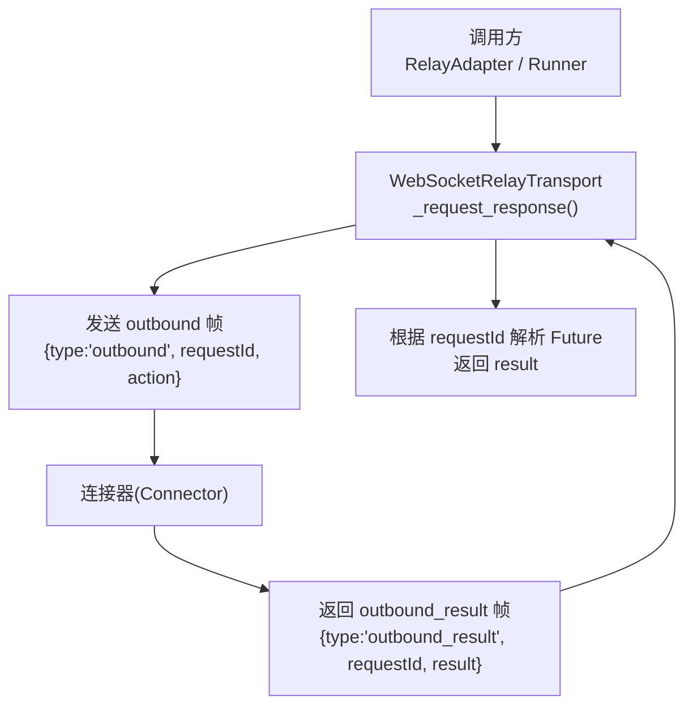
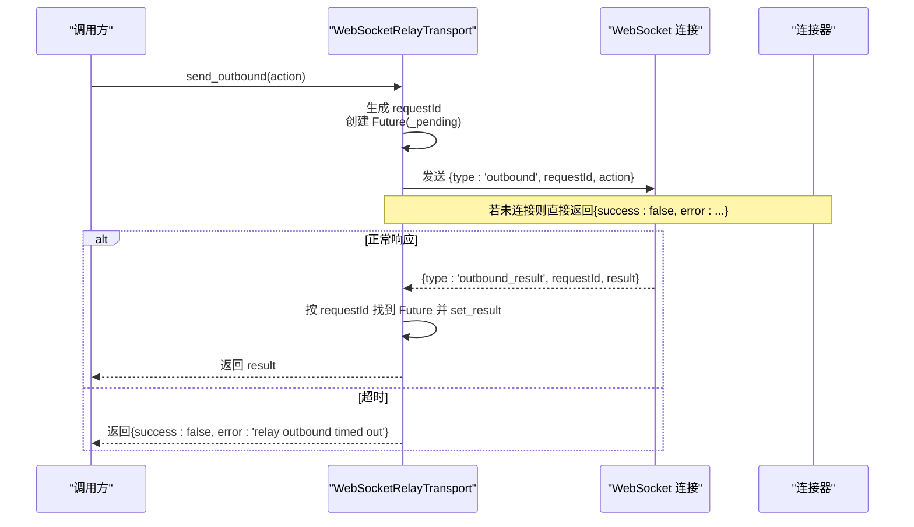
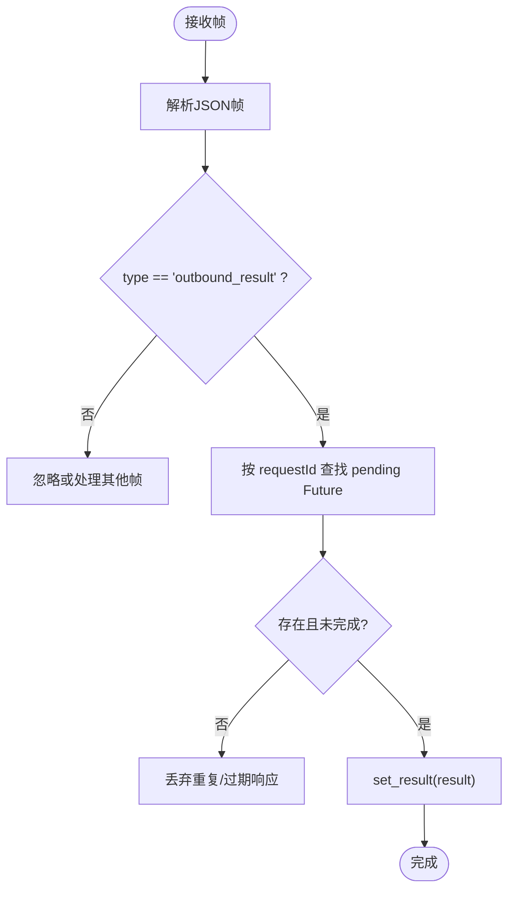
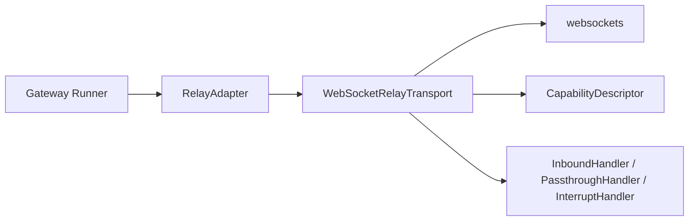

# Outbound Result 结果消息

<cite>
**本文引用的文件**
- [ws_transport.py](file://gateway/relay/ws_transport.py)
- [test_ws_transport.py](file://tests/gateway/relay/test_ws_transport.py)
</cite>

## 目录
1. [简介](#简介)
2. [项目结构](#项目结构)
3. [核心组件](#核心组件)
4. [架构总览](#架构总览)
5. [详细组件分析](#详细组件分析)
6. [依赖关系分析](#依赖关系分析)
7. [性能考量](#性能考量)
8. [故障排查指南](#故障排查指南)
9. [结论](#结论)
10. [附录](#附录)

## 简介
本文件聚焦于网关与连接器之间通过 WebSocket 传输的 outbound_result 结果消息。该消息用于响应 gateway 发出的 outbound（发送、编辑、打字、follow_up 等）请求，承载操作的成功或失败信息。文档将说明：
- outbound_result 帧的结构：type、requestId、result
- result 对象的响应格式：成功与错误两种形态
- 不同操作类型的返回约定（如 send/edit/follow_up/get_chat_info）
- 错误码与错误信息的标准化约定
- 超时、重试与断线重连机制
- 异步回调与事件通知（inbound、buffered delivery ack、going_idle_ack、passthrough_forward 等）
- 完整的 JSON 示例与异常处理模式

## 项目结构
与 outbound_result 直接相关的实现位于网关的 WebSocket 中继传输层，负责：
- 建立并维护与连接器的 WebSocket 连接
- 发送 outbound 请求帧，并通过 requestId 关联后续 outbound_result
- 解析 inbound、descriptor、outbound_result、interrupt_inbound、passthrough_forward 等帧
- 管理连接生命周期、鉴权撤销（4401）、去活/休眠与自动重连

**图表来源**
- [ws_transport.py:692-723](file://gateway/relay/ws_transport.py#L692-L723)
- [ws_transport.py:823-889](file://gateway/relay/ws_transport.py#L823-L889)

**章节来源**
- [ws_transport.py:1-28](file://gateway/relay/ws_transport.py#L1-L28)
- [ws_transport.py:692-723](file://gateway/relay/ws_transport.py#L692-L723)
- [ws_transport.py:823-889](file://gateway/relay/ws_transport.py#L823-L889)

## 核心组件
- WebSocketRelayTransport：封装与连接器的 WebSocket 通信，提供 send_outbound、send_follow_up、get_chat_info 等方法；内部使用 _request_response 统一发请求并等待 outbound_result。
- 帧协议：采用行分隔的 JSON 帧，包含 hello/descriptor/inbound/outbound/outbound_result/interrupt/interrupt_inbound/passthrough_forward 等类型。
- 请求-响应关联：每个 outbound 请求生成唯一 requestId，并在 _pending 中记录 Future；收到 outbound_result 时按 requestId 匹配并 resolve。

**章节来源**
- [ws_transport.py:339-438](file://gateway/relay/ws_transport.py#L339-L438)
- [ws_transport.py:567-603](file://gateway/relay/ws_transport.py#L567-L603)
- [ws_transport.py:692-723](file://gateway/relay/ws_transport.py#L692-L723)
- [ws_transport.py:823-889](file://gateway/relay/ws_transport.py#L823-L889)

## 架构总览
下图展示了 outbound 请求到 outbound_result 响应的完整时序，包括超时、Future 解析与错误路径。

**图表来源**
- [ws_transport.py:692-723](file://gateway/relay/ws_transport.py#L692-L723)
- [ws_transport.py:823-889](file://gateway/relay/ws_transport.py#L823-L889)

## 详细组件分析

### outbound_result 帧结构与字段
- type: 固定为 "outbound_result"
- requestId: 与 outbound 请求一一对应，用于关联响应
- result: 具体操作的响应体，由连接器填充

**图表来源**
- [ws_transport.py:823-889](file://gateway/relay/ws_transport.py#L823-L889)

**章节来源**
- [ws_transport.py:1-28](file://gateway/relay/ws_transport.py#L1-L28)
- [ws_transport.py:823-889](file://gateway/relay/ws_transport.py#L823-L889)

### result 对象：成功与错误响应
- 成功响应：通常包含 success: true 以及业务字段（例如 message_id）。测试用例展示了 send 类操作的成功返回形状。
- 错误响应：通常包含 success: false 和 error 字符串。当连接未就绪或请求超时时，transport 会返回结构化错误。

注意：result 的具体字段随 action.op 变化，但通用约定为 success + error（失败时），以及各操作特有的数据字段（成功时）。

**章节来源**
- [ws_transport.py:692-723](file://gateway/relay/ws_transport.py#L692-L723)
- [test_ws_transport.py:78-85](file://tests/gateway/relay/test_ws_transport.py#L78-L85)

### 各操作类型的返回约定
- send / edit / follow_up：
  - 成功：result.success = true，并携带平台侧生成的标识（如 message_id）
  - 失败：result.success = false，result.error 描述错误原因
- get_chat_info：
  - 成功：result.chat_info 或 result 中包含 name/type 等信息
  - 失败：result.success = false，result.error 描述错误原因
- 其他扩展操作：遵循相同 envelope 约定，由连接器在 result 中返回具体业务字段

**章节来源**
- [ws_transport.py:597-603](file://gateway/relay/ws_transport.py#L597-L603)
- [test_ws_transport.py:78-85](file://tests/gateway/relay/test_ws_transport.py#L78-L85)

### 错误代码与错误信息标准化
- 连接未就绪：返回 {success: false, error: "relay transport not connected"}
- 请求超时：返回 {success: false, error: "relay outbound timed out"}
- 鉴权撤销（连接器关闭码 4401）：transport 标记 auth_revoked，不再重连，上层可据此判定“已停用”状态
- 其他网络/协议错误：由上层捕获并记录日志，必要时触发重连

**章节来源**
- [ws_transport.py:692-723](file://gateway/relay/ws_transport.py#L692-L723)
- [ws_transport.py:744-775](file://gateway/relay/ws_transport.py#L744-L775)
- [ws_transport.py:555-561](file://gateway/relay/ws_transport.py#L555-L561)

### 重试机制与失败处理策略
- 出站请求超时：_request_response 在指定超时后返回结构化错误，调用方可据此决定是否重试
- 连接断开重连：_read_loop 检测到连接关闭后，若未显式关闭且非鉴权撤销，则启动 _reconnect_loop 指数退避重拨
- 鉴权撤销（4401）：一旦握手成功后收到 4401，设置 auth_revoked 并停止重连，避免无效重试
- 去活/休眠：go_idle/go_dormant 配合 connector 的缓冲投递与回放，保证挂起期间不丢消息

**章节来源**
- [ws_transport.py:608-678](file://gateway/relay/ws_transport.py#L608-L678)
- [ws_transport.py:759-822](file://gateway/relay/ws_transport.py#L759-L822)
- [ws_transport.py:744-775](file://gateway/relay/ws_transport.py#L744-L775)

### 异步回调与事件通知
- inbound：连接器推送用户消息，transport 调用注册的 InboundHandler，并在有 bufferId 时发送 inbound_ack
- going_idle_ack：确认实例已切换到仅缓冲投递模式
- passthrough_forward：连接器透传的平台交互请求（如 Discord 交互），交由适配器处理
- interrupt_inbound：连接器向拥有该会话的 gateway 发起中断通知

这些事件与 outbound_result 共享同一 WebSocket 通道，由 _handle_frame 分发处理。

**章节来源**
- [ws_transport.py:852-889](file://gateway/relay/ws_transport.py#L852-L889)

## 依赖关系分析
- WebSocketRelayTransport 依赖 websockets 库进行底层 I/O
- 通过 CapabilityDescriptor 协商平台能力（如是否支持编辑、线程、Markdown 方言等）
- 与 Runner/Adapter 协作：Runner 注册 inbound handler、passthrough handler、interrupt handler；Adapter 通过 Transport 发送 outbound 并消费 result

**图表来源**
- [ws_transport.py:339-438](file://gateway/relay/ws_transport.py#L339-L438)
- [ws_transport.py:891-903](file://gateway/relay/ws_transport.py#L891-L903)

**章节来源**
- [ws_transport.py:339-438](file://gateway/relay/ws_transport.py#L339-L438)
- [ws_transport.py:891-903](file://gateway/relay/ws_transport.py#L891-L903)

## 性能考量
- 超时配置：握手与出站请求均有独立超时，避免阻塞
- 背压与缓冲：go_idle 模式下，连接器将入站消息缓冲，待恢复后回放，降低瞬时压力
- 重连退避：指数退避上限控制，避免风暴式重连
- 帧解析：逐行解析 newline-delimited JSON，减少内存占用

[本节为通用指导，无需特定文件引用]

## 故障排查指南
- 现象：调用 send_outbound 立即返回 {success:false, error:"relay transport not connected"}
  - 检查 connect()/handshake() 是否成功
  - 检查 URL 是否正确（需以 /relay 结尾）
- 现象：长时间无响应后返回 {success:false, error:"relay outbound timed out"}
  - 检查连接器是否在线、是否处理了对应 requestId
  - 检查网络延迟与超时阈值
- 现象：连接频繁断开且无法恢复
  - 检查是否出现 4401 鉴权撤销（auth_revoked），此时不应继续重连
  - 检查 go_dormant 与 reconnect 配置是否冲突
- 现象：入站消息丢失
  - 确认是否启用 buffered delivery 并正确发送 inbound_ack
  - 检查 bufferId 是否存在且被 ACK

**章节来源**
- [ws_transport.py:692-723](file://gateway/relay/ws_transport.py#L692-L723)
- [ws_transport.py:744-775](file://gateway/relay/ws_transport.py#L744-L775)
- [ws_transport.py:852-863](file://gateway/relay/ws_transport.py#L852-L863)

## 结论
outbound_result 是网关与连接器之间的关键响应帧，通过 requestId 精确关联请求与结果。其 result 字段遵循统一的 success/error 约定，并承载各操作的业务数据。结合超时、重连、鉴权撤销与缓冲投递机制，系统在高可用与可靠性方面具备完善保障。集成方应严格遵循该协议，正确处理超时与错误分支，并利用事件通道实现可靠的异步回调。

[本节为总结性内容，无需特定文件引用]

## 附录

### JSON 示例（基于测试与实现）
- 成功响应（send 类操作）
  - 请求帧：{"type":"outbound","requestId":"...","action":{"op":"send", ...}}
  - 响应帧：{"type":"outbound_result","requestId":"...","result":{"success":true,"message_id":"srv-send"}}
- 失败响应（连接未就绪）
  - 响应帧：{"type":"outbound_result","requestId":"...","result":{"success":false,"error":"relay transport not connected"}}
- 失败响应（请求超时）
  - 响应帧：{"type":"outbound_result","requestId":"...","result":{"success":false,"error":"relay outbound timed out"}}
- get_chat_info 成功
  - 响应帧：{"type":"outbound_result","requestId":"...","result":{"chat_info":{"name":"...","type":"dm"}}}

**章节来源**
- [test_ws_transport.py:78-85](file://tests/gateway/relay/test_ws_transport.py#L78-L85)
- [ws_transport.py:597-603](file://gateway/relay/ws_transport.py#L597-L603)
- [ws_transport.py:692-723](file://gateway/relay/ws_transport.py#L692-L723)