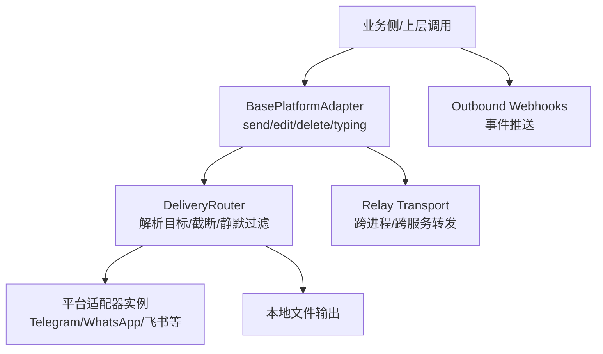
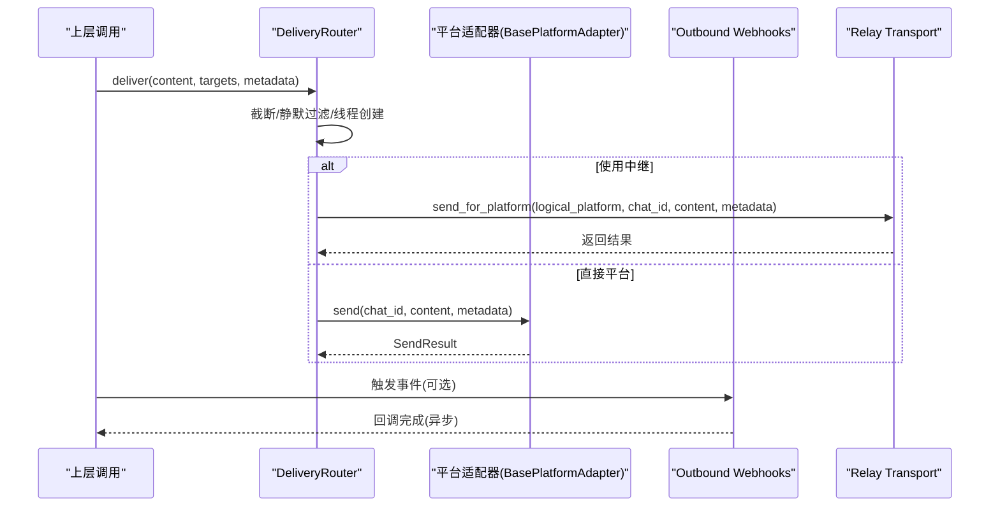
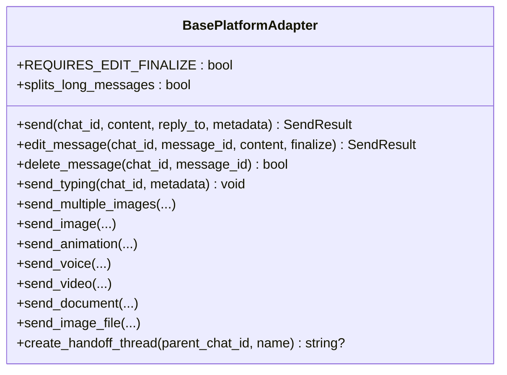
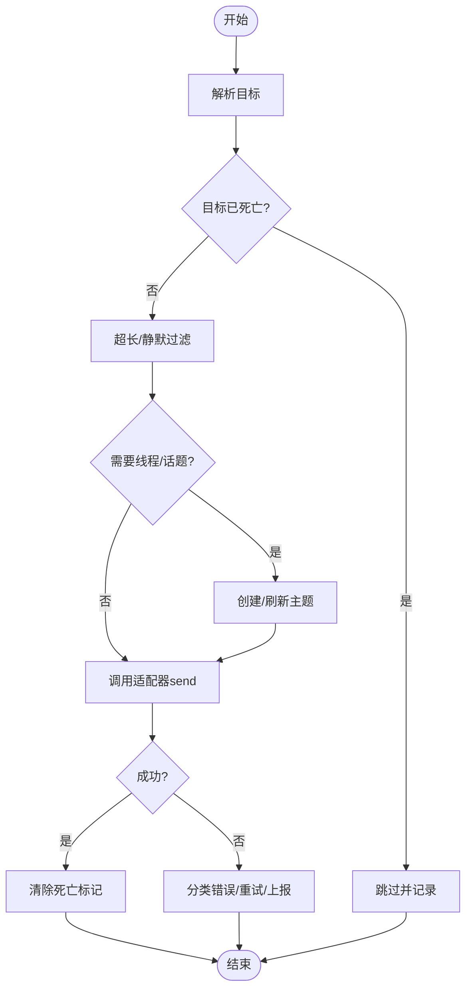
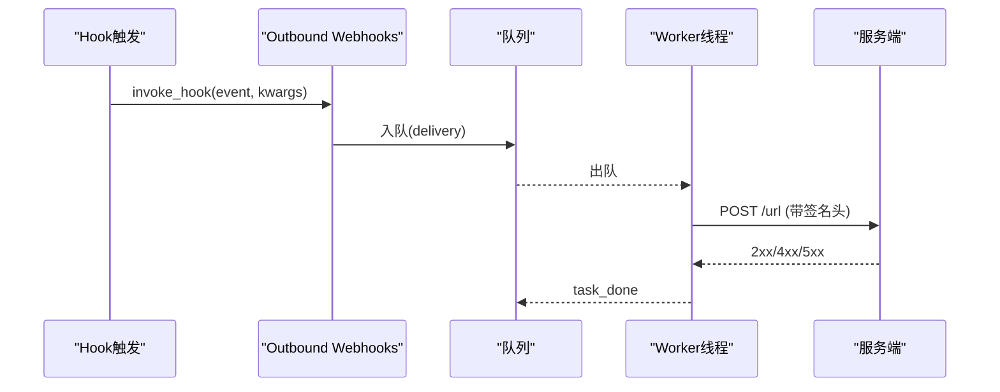
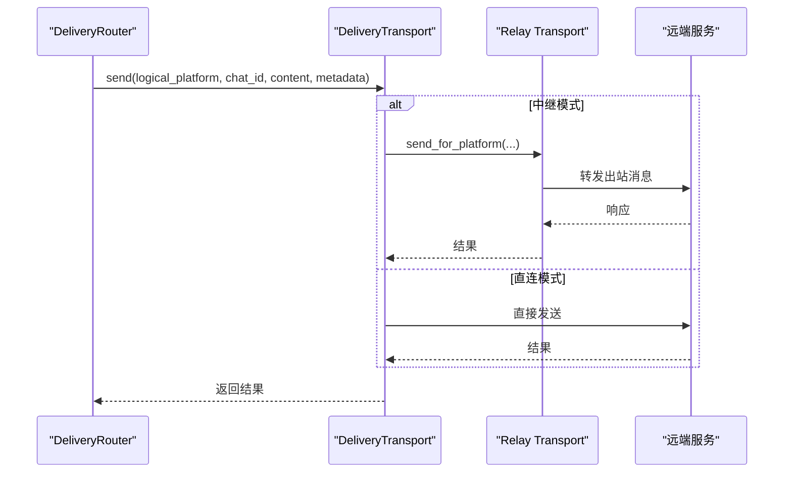
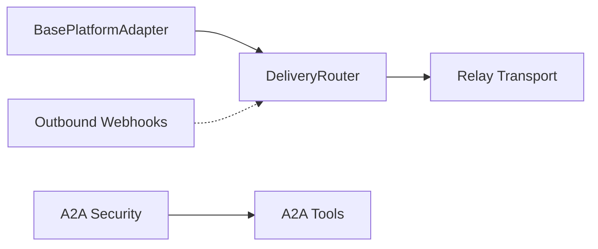

# 出站消息（Outbound）文档

<cite>
**本文引用的文件**
- [gateway/platforms/base.py](file://gateway/platforms/base.py)
- [gateway/delivery.py](file://gateway/delivery.py)
- [agent/outbound_webhooks.py](file://agent/outbound_webhooks.py)
- [gateway/relay/ws_transport.py](file://gateway/relay/ws_transport.py)
- [gateway/relay/transport.py](file://gateway/relay/transport.py)
- [plugins/platforms/a2a/tools.py](file://plugins/platforms/a2a/tools.py)
- [plugins/platforms/a2a/security.py](file://plugins/platforms/a2a/security.py)
</cite>

## 目录
1. [简介](#简介)
2. [项目结构与角色划分](#项目结构与角色划分)
3. [核心组件](#核心组件)
4. [架构总览](#架构总览)
5. [详细组件分析](#详细组件分析)
6. [依赖关系分析](#依赖关系分析)
7. [性能与限制](#性能与限制)
8. [故障排查指南](#故障排查指南)
9. [结论](#结论)
10. [附录：字段、动作与示例](#附录字段动作与示例)

## 简介
本文件聚焦于“出站消息”在系统中的定义、结构、流转与实现细节。内容涵盖：
- 出站消息的通用结构与关键字段（如 type、requestId、action 等）
- action 对象的操作类型（send、edit、typing、follow_up 等）
- 请求-响应配对机制（通过 requestId 关联请求与响应）
- 平台特定的出站参数与限制
- 富文本、媒体文件、交互式组件等复杂消息的构建方法
- 完整的 JSON 示例与错误处理策略
- 异步处理与超时机制

说明：本仓库中“出站消息”的实现以网关层适配器抽象和投递路由为核心，同时提供出站 Webhook 通知能力；不同平台（Telegram、WhatsApp、飞书等）在 BasePlatformAdapter 之上扩展具体发送、编辑、删除、富媒体与交互能力。

## 项目结构与角色划分
- 网关平台基类与适配器：定义统一的 send/edit/delete/typing 等出站接口，并承载平台特定逻辑。
- 投递路由：负责将消息路由到目标平台或本地文件，处理截断、静默过滤、线程/话题创建等。
- 出站 Webhook：将系统事件（会话结束、工具调用前后等）推送到外部 HTTP 端点，用于审计与集成。
- 中继传输：当使用 RELAY 时，通过统一通道转发出站消息，保持逻辑平台语义。

图表来源
- [gateway/platforms/base.py:3600-3799](file://gateway/platforms/base.py#L3600-L3799)
- [gateway/delivery.py:318-642](file://gateway/delivery.py#L318-L642)
- [agent/outbound_webhooks.py:156-207](file://agent/outbound_webhooks.py#L156-L207)
- [gateway/relay/ws_transport.py:567-570](file://gateway/relay/ws_transport.py#L567-L570)
- [gateway/relay/transport.py:73-76](file://gateway/relay/transport.py#L73-L76)

章节来源
- [gateway/platforms/base.py:3600-3799](file://gateway/platforms/base.py#L3600-L3799)
- [gateway/delivery.py:318-642](file://gateway/delivery.py#L318-L642)
- [agent/outbound_webhooks.py:156-207](file://agent/outbound_webhooks.py#L156-L207)
- [gateway/relay/ws_transport.py:567-570](file://gateway/relay/ws_transport.py#L567-L570)
- [gateway/relay/transport.py:73-76](file://gateway/relay/transport.py#L73-L76)

## 核心组件
- BasePlatformAdapter：定义统一的出站 API（send、edit_message、delete_message、send_typing、富媒体发送等），并提供可复用的格式化与临时消息生命周期管理。
- DeliveryRouter：解析目标、处理超长输出、静默过滤、线程/话题创建与重试，最终调用适配器的 send。
- Outbound Webhooks：将系统事件以签名 POST 的方式发送到配置的 URL，支持匹配器、超时、重试与去重。
- Relay Transport：当启用中继时，将出站消息转发到远端服务，保持逻辑平台标识。

章节来源
- [gateway/platforms/base.py:3600-3799](file://gateway/platforms/base.py#L3600-L3799)
- [gateway/delivery.py:318-642](file://gateway/delivery.py#L318-L642)
- [agent/outbound_webhooks.py:156-207](file://agent/outbound_webhooks.py#L156-L207)
- [gateway/relay/ws_transport.py:567-570](file://gateway/relay/ws_transport.py#L567-L570)
- [gateway/relay/transport.py:73-76](file://gateway/relay/transport.py#L73-L76)

## 架构总览
出站消息从上层触发，经 DeliveryRouter 解析目标与预处理后，进入平台适配器执行实际发送；若启用中继，则通过 Relay 转发。同时，系统通过 Outbound Webhooks 将关键事件推送到外部系统，便于审计与联动。

图表来源
- [gateway/delivery.py:318-642](file://gateway/delivery.py#L318-L642)
- [gateway/platforms/base.py:3600-3799](file://gateway/platforms/base.py#L3600-L3799)
- [agent/outbound_webhooks.py:156-207](file://agent/outbound_webhooks.py#L156-L207)
- [gateway/relay/ws_transport.py:567-570](file://gateway/relay/ws_transport.py#L567-L570)
- [gateway/relay/transport.py:73-76](file://gateway/relay/transport.py#L73-L76)

## 详细组件分析

### BasePlatformAdapter：出站接口与平台能力
- 统一接口
  - send：向指定聊天发送消息，支持 reply_to 与平台元数据。
  - edit_message：编辑已发消息，支持 finalize 标志以关闭流式 UI。
  - delete_message：删除已发消息（平台支持时）。
  - send_typing：发送“正在输入”状态。
  - 富媒体：send_multiple_images、send_image、send_animation、send_voice、send_video、send_document、send_image_file 等。
- 平台特性
  - REQUIRES_EDIT_FINALIZE：某些平台需要显式 finalize 来结束流式渲染。
  - splits_long_messages：是否原生分片长消息。
  - ensure_dm_topic：为 Telegram 私聊主题创建/刷新。
- 辅助能力
  - 临时消息 TTL 与自动删除调度。
  - 命令审批提示模板与截断预览。

图表来源
- [gateway/platforms/base.py:3600-3799](file://gateway/platforms/base.py#L3600-L3799)

章节来源
- [gateway/platforms/base.py:3600-3799](file://gateway/platforms/base.py#L3600-L3799)

### DeliveryRouter：投递路由与平台限制
- 目标解析
  - origin/local/平台名/平台:chat_id[:thread_id]。
- 处理流程
  - 死目标跳过与自愈。
  - 超长输出审计保存与截断（非分片适配器）。
  - 静默叙述过滤（*(silent)*、🔇 等）。
  - Telegram 私聊主题创建/刷新与回复锚点。
- 失败分类
  - 根据错误文本识别“not_found”等死错误类型，标记目标为不可达。

图表来源
- [gateway/delivery.py:318-642](file://gateway/delivery.py#L318-L642)

章节来源
- [gateway/delivery.py:318-642](file://gateway/delivery.py#L318-L642)

### Outbound Webhooks：事件推送与签名
- 配置
  - hooks.outbound：列表项包含 url、events、secret_env/secret、matcher、timeout、name。
- 载荷与头部
  - 载荷包含 hook_event_name、tool_name、tool_input、session_id、cwd、extra、delivery_id、timestamp。
  - 头部包含 Content-Type、User-Agent、X-Hermes-Event、X-Hermes-Delivery，以及可选的 X-Hermes-Signature-256。
- 投递策略
  - 单工作线程队列，最大容量有限，避免阻塞主循环。
  - 最多尝试次数与退避重试；3xx 不跟随重定向；4xx 不重试；5xx 重试。
  - 安全：HMAC-SHA256 签名，防止篡改与重放。

图表来源
- [agent/outbound_webhooks.py:156-207](file://agent/outbound_webhooks.py#L156-L207)
- [agent/outbound_webhooks.py:404-455](file://agent/outbound_webhooks.py#L404-L455)
- [agent/outbound_webhooks.py:520-570](file://agent/outbound_webhooks.py#L520-L570)

章节来源
- [agent/outbound_webhooks.py:156-207](file://agent/outbound_webhooks.py#L156-L207)
- [agent/outbound_webhooks.py:404-455](file://agent/outbound_webhooks.py#L404-L455)
- [agent/outbound_webhooks.py:520-570](file://agent/outbound_webhooks.py#L520-L570)

### Relay Transport：跨进程/服务转发
- 当逻辑平台由中继代理时，DeliveryTransport.send 会调用 adapter.send_for_platform，保留逻辑平台标识。
- ws_transport 提供 send_outbound 实现，确保同一出站 WS 通道复用。

图表来源
- [gateway/delivery.py:74-89](file://gateway/delivery.py#L74-L89)
- [gateway/relay/ws_transport.py:567-570](file://gateway/relay/ws_transport.py#L567-L570)
- [gateway/relay/transport.py:73-76](file://gateway/relay/transport.py#L73-L76)

章节来源
- [gateway/delivery.py:74-89](file://gateway/delivery.py#L74-L89)
- [gateway/relay/ws_transport.py:567-570](file://gateway/relay/ws_transport.py#L567-L570)
- [gateway/relay/transport.py:73-76](file://gateway/relay/transport.py#L73-L76)

### 安全与审计：出站消息脱敏
- 对 A2A 平台的出站消息进行脱敏后再审计，避免敏感信息泄露。
- 审计日志包含 agent_label、rpc_body.id 等上下文。

章节来源
- [plugins/platforms/a2a/tools.py:167-182](file://plugins/platforms/a2a/tools.py#L167-L182)
- [plugins/platforms/a2a/security.py:242-242](file://plugins/platforms/a2a/security.py#L242-L242)

## 依赖关系分析
- BasePlatformAdapter 被 DeliveryRouter 调用，作为各平台的具体实现入口。
- DeliveryRouter 依赖平台配置与适配器实例，必要时调用 Relay Transport。
- Outbound Webhooks 独立于发送路径，通过插件钩子注册回调，不影响主流程。
- 安全模块对特定平台（如 A2A）的出站消息进行脱敏与审计。

图表来源
- [gateway/platforms/base.py:3600-3799](file://gateway/platforms/base.py#L3600-L3799)
- [gateway/delivery.py:318-642](file://gateway/delivery.py#L318-L642)
- [agent/outbound_webhooks.py:156-207](file://agent/outbound_webhooks.py#L156-L207)
- [plugins/platforms/a2a/tools.py:167-182](file://plugins/platforms/a2a/tools.py#L167-L182)

章节来源
- [gateway/platforms/base.py:3600-3799](file://gateway/platforms/base.py#L3600-L3799)
- [gateway/delivery.py:318-642](file://gateway/delivery.py#L318-L642)
- [agent/outbound_webhooks.py:156-207](file://agent/outbound_webhooks.py#L156-L207)
- [plugins/platforms/a2a/tools.py:167-182](file://plugins/platforms/a2a/tools.py#L167-L182)

## 性能与限制
- 长消息处理
  - DeliveryRouter 对超长输出进行审计保存与截断；具备分片能力的适配器可接收完整负载并在其内部拆分。
- 静默叙述过滤
  - 针对仅含“*(silent)*”、“🔇”等的消息进行过滤，避免 bot-to-bot 回环。
- 超时与重试
  - Outbound Webhooks 支持 per-attempt 超时（默认 10 秒，上限 60 秒），最多尝试次数与指数退避。
  - 3xx 不跟随重定向；4xx 不重试；5xx 重试。
- 队列与背压
  - 出站 Webhook 队列有最大容量，满时将丢弃事件并记录告警。
- 平台限制
  - 不同平台对富媒体、交互组件、消息长度、编辑窗口等有各自限制，需参考对应适配器实现。

章节来源
- [gateway/delivery.py:23-29](file://gateway/delivery.py#L23-L29)
- [gateway/delivery.py:448-544](file://gateway/delivery.py#L448-L544)
- [agent/outbound_webhooks.py:89-93](file://agent/outbound_webhooks.py#L89-L93)
- [agent/outbound_webhooks.py:520-570](file://agent/outbound_webhooks.py#L520-L570)

## 故障排查指南
- 无法送达
  - 检查 DeliveryRouter 是否解析到正确目标；确认平台适配器已启用且配置有效。
  - 查看是否命中“死目标”缓存；尝试重新发送以清除标记。
- 长消息未完整显示
  - 若为非分片适配器，将被截断；请检查是否启用了具备分片能力的适配器。
- 静默消息被过滤
  - 确认内容是否为纯静默叙述；如需保留，调整过滤开关或修改内容。
- Webhook 未收到
  - 检查 URL 协议（必须 http/https）、签名配置、网络连通性与服务端状态码。
  - 关注 3xx 重定向与 4xx 拒绝；5xx 会重试。
- 平台特定错误
  - 例如 Telegram 私聊主题缺失或失效，DeliveryRouter 会尝试创建/刷新；若仍失败，检查权限与主题名称。

章节来源
- [gateway/delivery.py:318-642](file://gateway/delivery.py#L318-L642)
- [agent/outbound_webhooks.py:520-570](file://agent/outbound_webhooks.py#L520-L570)

## 结论
本系统的出站消息以 BasePlatformAdapter 的统一接口为中心，结合 DeliveryRouter 的目标解析、预处理与平台限制处理，实现跨平台的一致化发送能力；Outbound Webhooks 提供可靠的事件外发与审计；Relay Transport 支持跨进程/服务的转发。通过严格的超时、重试、签名与队列控制，系统在稳定性与安全性方面具备良好保障。

## 附录：字段、动作与示例

### 出站消息通用结构
- 顶层字段
  - type：消息类型（如 text、image、video、document、interactive 等，具体由平台决定）。
  - requestId：请求唯一标识，用于请求-响应配对。
  - action：操作对象，描述本次出站意图（如 send、edit、typing、follow_up）。
  - target：目标信息（platform、chat_id、thread_id）。
  - payload：具体载荷（文本、媒体、交互组件等）。
  - metadata：平台相关元数据（如 reply_to、user_id、scope_id 等）。
- 注意
  - 字段命名与可用值可能因平台而异；请以具体适配器实现为准。
  - 对于中继模式，logical_platform 会被保留并用于路由。

### action 对象常见操作类型
- send：发送新消息（文本、富文本、媒体、交互组件）。
- edit：编辑已有消息（部分平台支持，可能需要 finalize）。
- typing：发送“正在输入”状态。
- follow_up：后续跟进（如追加片段、更新进度）。
- delete：删除消息（平台支持时）。
- reaction：添加反应（表情等，平台支持时）。

### 请求-响应配对机制
- 通过 requestId 将请求与响应关联，便于上层追踪与重试。
- 典型流程
  - 上层生成 requestId 并附带在出站消息中。
  - 平台返回响应（或错误）时携带相同 requestId。
  - 上层据此完成配对、统计与异常处理。

### 富文本、媒体与交互组件
- 富文本
  - 使用平台支持的格式（Markdown、HTML 等），注意长度与转义。
- 媒体文件
  - 图片、动画、语音、视频、文档等，通过相应 send_* 方法发送。
  - 注意平台大小限制与上传方式（直传/URL）。
- 交互组件
  - 按钮、表单、卡片等，遵循平台规范与能力边界。

### 完整 JSON 示例（示意）
- 发送文本
  - {
      "type": "text",
      "requestId": "req_abc123",
      "action": {"op": "send"},
      "target": {"platform": "telegram", "chat_id": "123456"},
      "payload": {"content": "你好，世界"},
      "metadata": {}
    }
- 发送图片
  - {
      "type": "image",
      "requestId": "req_def456",
      "action": {"op": "send"},
      "target": {"platform": "whatsapp", "chat_id": "+86..."},
      "payload": {"url": "https://example.com/img.png"},
      "metadata": {}
    }
- 编辑消息
  - {
      "type": "text",
      "requestId": "req_edit789",
      "action": {"op": "edit", "message_id": "msg_xxx"},
      "target": {"platform": "slack", "chat_id": "C012AB3CD"},
      "payload": {"content": "更新后的内容"},
      "metadata": {"finalize": true}
    }
- 正在输入
  - {
      "type": "typing",
      "requestId": "req_typ001",
      "action": {"op": "typing"},
      "target": {"platform": "telegram", "chat_id": "123456"},
      "payload": {},
      "metadata": {}
    }
- 后续跟进
  - {
      "type": "text",
      "requestId": "req_follow01",
      "action": {"op": "follow_up"},
      "target": {"platform": "feishu", "chat_id": "oc_xxx"},
      "payload": {"content": "任务进行中，进度 50%"},
      "metadata": {}
    }

### 错误处理策略
- 平台级错误
  - 捕获并分类（如 not_found、rate_limit、forbidden）。
  - 对“死目标”进行标记，避免重复投递。
- Webhook 错误
  - 3xx 不跟随重定向；4xx 不重试；5xx 重试并退避。
  - 队列满时丢弃并记录告警。
- 超时与重试
  - 设置合理超时；对关键路径进行重试与降级。

章节来源
- [gateway/platforms/base.py:3600-3799](file://gateway/platforms/base.py#L3600-L3799)
- [gateway/delivery.py:318-642](file://gateway/delivery.py#L318-L642)
- [agent/outbound_webhooks.py:520-570](file://agent/outbound_webhooks.py#L520-L570)