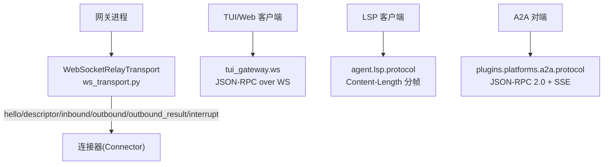
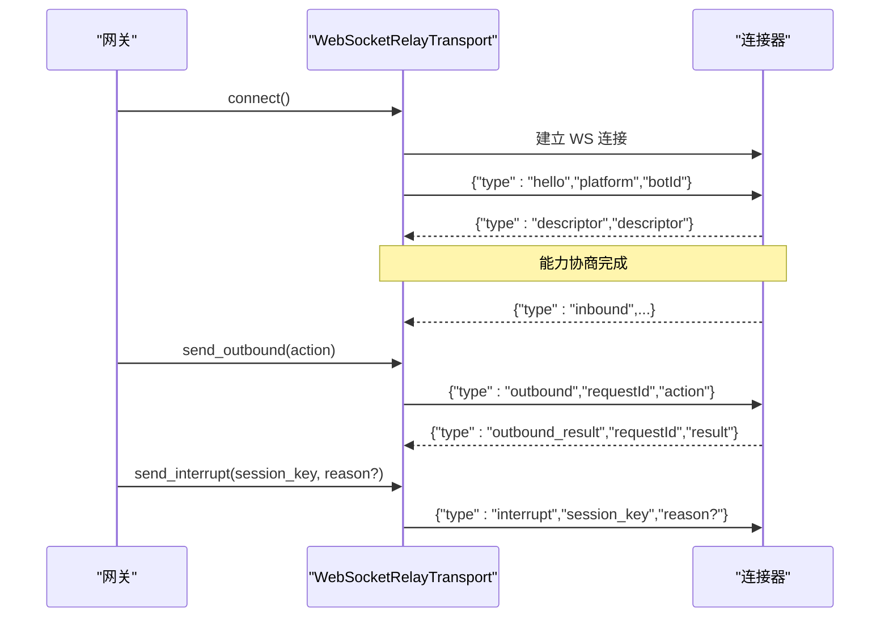
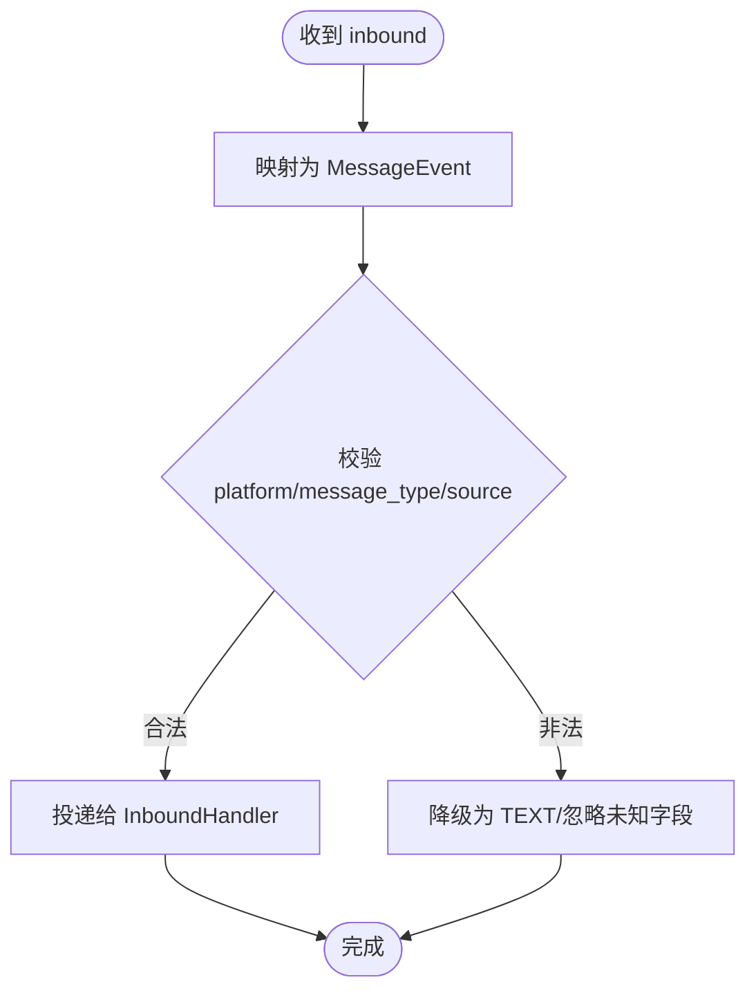
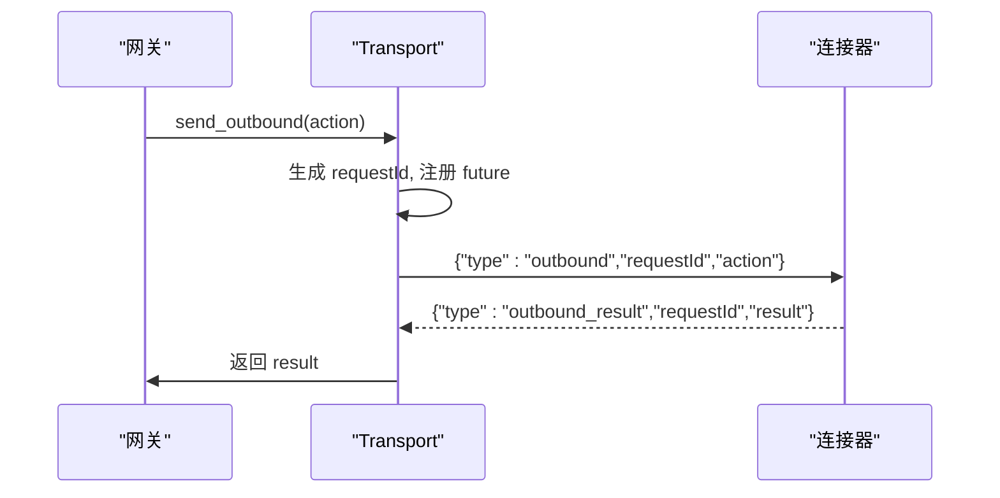
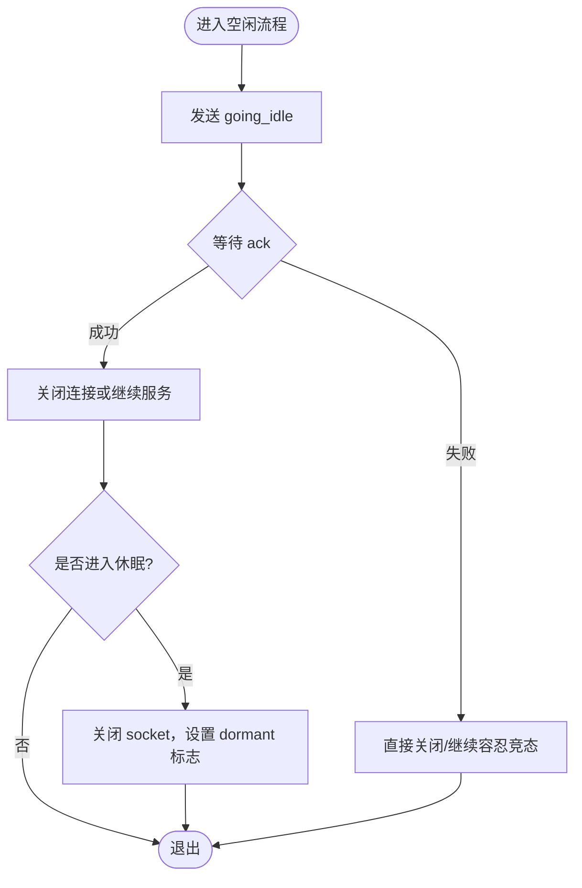
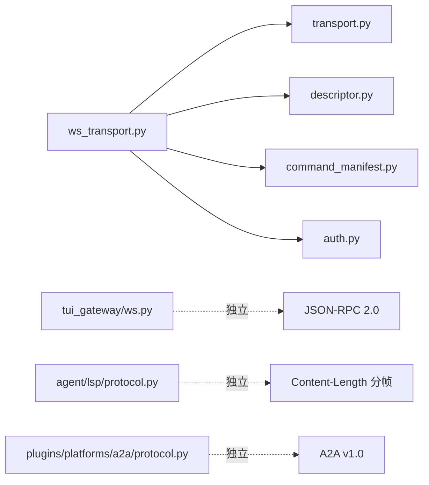

# 消息格式

<cite>
**本文引用的文件**
- [ws_transport.py](file://gateway/relay/ws_transport.py)
- [transport.py](file://gateway/relay/transport.py)
- [descriptor.py](file://gateway/relay/descriptor.py)
- [auth.py](file://gateway/relay/auth.py)
- [command_manifest.py](file://gateway/relay/command_manifest.py)
- [ws.py](file://tui_gateway/ws.py)
- [protocol.py](file://agent/lsp/protocol.py)
- [protocol.py](file://plugins/platforms/a2a/protocol.py)
</cite>

## 目录
1. [简介](#简介)
2. [项目结构](#项目结构)
3. [核心组件](#核心组件)
4. [架构总览](#架构总览)
5. [详细组件分析](#详细组件分析)
6. [依赖关系分析](#依赖关系分析)
7. [性能与传输优化](#性能与传输优化)
8. [故障排查指南](#故障排查指南)
9. [结论](#结论)
10. [附录：消息字段规范与示例](#附录消息字段规范与示例)

## 简介
本文件面向 Hermes 网关与连接器（connector）之间的 WebSocket 消息协议，系统化定义所有消息类型、字段、序列化格式、验证规则、路由机制与扩展方式。覆盖 hello、descriptor、inbound、outbound、outbound_result、interrupt 等关键帧，并补充 tui_gateway JSON-RPC 与 LSP/A2A 相关协议的要点，便于跨端集成与二次开发。

## 项目结构
- 网关到连接器的实时链路由 WebSocketRelayTransport 实现，采用“换行分隔的 JSON”帧协议。
- 协议契约在 transport.py 中抽象为 RelayTransport 接口；ws_transport.py 提供生产级实现。
- 能力协商通过 descriptor 完成；认证通过升级头携带签名令牌。
- tui_gateway 提供独立的 JSON-RPC over WebSocket 通道，用于桌面/TUI 客户端。
- agent.lsp.protocol 提供 LSP 的 Content-Length 分帧与 JSON-RPC 2.0 封装。
- plugins.platforms.a2a.protocol 提供 A2A v1.0 的 JSON-RPC 绑定与流式事件。

**图示来源**
- [ws_transport.py:1-28](file://gateway/relay/ws_transport.py#L1-L28)
- [transport.py:1-21](file://gateway/relay/transport.py#L1-L21)
- [ws.py:1-22](file://tui_gateway/ws.py#L1-L22)
- [protocol.py:1-15](file://agent/lsp/protocol.py#L1-L15)
- [protocol.py:1-19](file://plugins/platforms/a2a/protocol.py#L1-L19)

**章节来源**
- [ws_transport.py:1-28](file://gateway/relay/ws_transport.py#L1-L28)
- [transport.py:1-21](file://gateway/relay/transport.py#L1-L21)

## 核心组件
- WebSocketRelayTransport：负责与连接器的握手、收发帧、重连、鉴权、空闲/休眠切换、请求-响应匹配。
- RelayTransport 协议：抽象连接生命周期、入站回调、出站动作、聊天信息查询、中断、空闲切换、follow-up 能力调用。
- CapabilityDescriptor：描述平台能力（如最大消息长度等），用于按平台差异化处理。
- tui_gateway WSTransport：JSON-RPC over WebSocket，支持高吞吐 token 合并与 TCP_NODELAY 优化。
- LSPProtocol：Content-Length 分帧 + JSON-RPC 2.0 信封。
- A2A Protocol：v1.0 JSON-RPC 绑定、任务状态机、SSE 流式事件。

**章节来源**
- [ws_transport.py:339-439](file://gateway/relay/ws_transport.py#L339-L439)
- [transport.py:41-144](file://gateway/relay/transport.py#L41-L144)
- [ws.py:70-117](file://tui_gateway/ws.py#L70-L117)
- [protocol.py:54-130](file://agent/lsp/protocol.py#L54-L130)
- [protocol.py:95-144](file://plugins/platforms/a2a/protocol.py#L95-L144)

## 架构总览
网关主动拨号至连接器的 /relay 路径，建立 WebSocket 后发送 hello，等待 descriptor 完成能力协商。随后双向通信：
- 连接器 -> 网关：descriptor、inbound、outbound_result、interrupt_inbound
- 网关 -> 连接器：hello、outbound、interrupt、going_idle、inbound_ack

**图示来源**
- [ws_transport.py:445-484](file://gateway/relay/ws_transport.py#L445-L484)
- [ws_transport.py:567-607](file://gateway/relay/ws_transport.py#L567-L607)
- [ws_transport.py:692-723](file://gateway/relay/ws_transport.py#L692-L723)

**章节来源**
- [ws_transport.py:445-484](file://gateway/relay/ws_transport.py#L445-L484)
- [ws_transport.py:692-723](file://gateway/relay/ws_transport.py#L692-L723)

## 详细组件分析

### 连接器协议（Gateway ↔ Connector）
- 帧格式：每行一个 JSON，末尾换行符分隔。
- 关键字段：type 区分消息种类；部分消息带 requestId 用于请求-响应配对。
- 能力协商：descriptor 返回平台能力集合，供网关按平台差异化处理。
- 入站映射：inbound 被归一化为 MessageEvent，包含 source、text、message_type、reply_to、media_urls、channel_context、prompt_response 等。
- 出站动作：outbound 携带 action（如 send/edit/typing/follow_up），连接器返回 outbound_result。
- 中断：interrupt 从网关侧发出，连接器可能回送 interrupt_inbound 以确认或转发。

**图示来源**
- [ws_transport.py:172-288](file://gateway/relay/ws_transport.py#L172-L288)

**章节来源**
- [ws_transport.py:172-288](file://gateway/relay/ws_transport.py#L172-L288)

### 请求-响应模式（outbound → outbound_result）
- 网关发送 outbound 时生成唯一 requestId，并在本地维护 pending futures。
- 连接器返回 outbound_result 时携带相同 requestId，网关据此解析结果并唤醒等待者。
- 超时控制：_OUTBOUND_TIMEOUT_S 限制等待时间，避免悬挂。

**图示来源**
- [ws_transport.py:692-723](file://gateway/relay/ws_transport.py#L692-L723)

**章节来源**
- [ws_transport.py:692-723](file://gateway/relay/ws_transport.py#L692-L723)

### 空闲与休眠（going_idle / go_dormant）
- going_idle：通知连接器切换到“仅缓冲”模式，待 ack 后确保不再实时投递。
- go_dormant：在 scale-to-zero 场景下关闭 socket，但保持重连调度器处于“休眠周期”，唤醒后重拨并回放缓冲。

**图示来源**
- [ws_transport.py:609-678](file://gateway/relay/ws_transport.py#L609-L678)

**章节来源**
- [ws_transport.py:609-678](file://gateway/relay/ws_transport.py#L609-L678)

### 鉴权与重连
- 升级头：可选 Authorization: Bearer <token>，基于 per-gateway secret 签名。
- 4401 终止：握手成功后收到 4401 表示凭证被撤销，停止重连。
- 重连策略：指数退避，支持 dormant 慢速轮询；reader 异常时自动触发重连。

**章节来源**
- [ws_transport.py:486-501](file://gateway/relay/ws_transport.py#L486-L501)
- [ws_transport.py:745-775](file://gateway/relay/ws_transport.py#L745-L775)

### tui_gateway JSON-RPC over WebSocket
- 帧格式：换行分隔的 JSON-RPC 2.0。
- 事件：连接后立即推送 gateway.ready；后续事件与 RPC 响应复用同一通道。
- 流式优化：对 message.delta/reasoning.delta/thinking.delta 进行短时合并，降低事件循环抖动；TCP_NODELAY 保证低延迟。

**章节来源**
- [ws.py:1-22](file://tui_gateway/ws.py#L1-L22)
- [ws.py:44-60](file://tui_gateway/ws.py#L44-L60)
- [ws.py:268-284](file://tui_gateway/ws.py#L268-L284)

### LSP 协议（Content-Length 分帧）
- 帧头：Content-Length: <bytes>\r\n\r\n
- 负载：UTF-8 JSON 的 JSON-RPC 2.0 信封（request/response/notification）。
- 错误：内容修改、请求取消、方法不存在等专用错误码。

**章节来源**
- [protocol.py:1-15](file://agent/lsp/protocol.py#L1-L15)
- [protocol.py:54-130](file://agent/lsp/protocol.py#L54-L130)

### A2A 协议（v1.0 JSON-RPC + SSE）
- Agent Card：GET /.well-known/agent-card.json，声明能力、租户、安全方案。
- 任务：POST message/send，返回 Task 或 Message 包装。
- 流式：message/stream 使用 SSE，事件为 StreamResponse（statusUpdate/artifactUpdate），结束标记为注释行。
- 角色与状态：ROLE_USER/ROLE_AGENT；TASK_STATE_* 状态机。

**章节来源**
- [protocol.py:1-19](file://plugins/platforms/a2a/protocol.py#L1-L19)
- [protocol.py:95-144](file://plugins/platforms/a2a/protocol.py#L95-L144)
- [protocol.py:403-447](file://plugins/platforms/a2a/protocol.py#L403-L447)

## 依赖关系分析
- ws_transport.py 依赖 transport.py 定义的协议抽象，以及 descriptor.py 的能力模型。
- 命令清单（Discord）通过 command_manifest.py 在 hello 中附带。
- 鉴权依赖 auth.py 生成升级令牌。
- tui_gateway 独立于 relay 协议，提供 JSON-RPC 通道。
- LSP 与 A2A 分别服务于编辑器与 Agent 间交互。

**图示来源**
- [ws_transport.py:1-28](file://gateway/relay/ws_transport.py#L1-L28)
- [transport.py:1-21](file://gateway/relay/transport.py#L1-L21)
- [command_manifest.py:1-200](file://gateway/relay/command_manifest.py#L1-L200)
- [auth.py:1-200](file://gateway/relay/auth.py#L1-L200)
- [ws.py:1-22](file://tui_gateway/ws.py#L1-L22)
- [protocol.py:1-15](file://agent/lsp/protocol.py#L1-L15)
- [protocol.py:1-19](file://plugins/platforms/a2a/protocol.py#L1-L19)

**章节来源**
- [ws_transport.py:1-28](file://gateway/relay/ws_transport.py#L1-L28)
- [transport.py:1-21](file://gateway/relay/transport.py#L1-L21)

## 性能与传输优化
- 帧压缩：当前代码未启用应用层压缩；如需开启，建议在网关/连接器两端协商并统一实现，注意 CPU/带宽权衡。
- 网络优化：tui_gateway 已禁用 Nagle（TCP_NODELAY）以降低 token 流延迟；建议在高吞吐场景评估是否在其他通道也启用。
- 流式合并：对高频 delta 事件进行短时合并，减少事件循环唤醒次数，提升整体吞吐。
- 超时与重试：outbound 默认 30 秒超时；reconnect 使用指数退避并支持 dormant 慢速轮询，避免雪崩。
- 背压与限流：A2A 提供滑动窗口速率限制与反环保护，防止无限 ping-pong。

**章节来源**
- [ws.py:44-60](file://tui_gateway/ws.py#L44-L60)
- [ws.py:268-284](file://tui_gateway/ws.py#L268-L284)
- [ws_transport.py:53-59](file://gateway/relay/ws_transport.py#L53-L59)
- [protocol.py:487-519](file://plugins/platforms/a2a/protocol.py#L487-L519)

## 故障排查指南
- 握手失败：检查 URL 规范化（必须为 ws(s)://…/relay）、鉴权头是否正确、连接器是否可用。
- 4401 终止：握手成功后出现 4401 表示凭证被撤销，需重新配置或恢复实例。
- 入站丢失：确认 connector 已发送 descriptor；检查 inbound 映射逻辑与 platform/message_type 合法性。
- 出站超时：核对 requestId 与 outbound_result 配对；检查 _pending 表清理与超时配置。
- 流式卡顿：检查 token 合并定时器是否生效；确认 TCP_NODELAY 是否被系统策略覆盖。
- A2A 卡死：检查 TurnTracker 计数与 RateLimiter 阈值；必要时重置上下文或调整上限。

**章节来源**
- [ws_transport.py:486-501](file://gateway/relay/ws_transport.py#L486-L501)
- [ws_transport.py:745-775](file://gateway/relay/ws_transport.py#L745-L775)
- [ws_transport.py:692-723](file://gateway/relay/ws_transport.py#L692-L723)
- [ws.py:118-187](file://tui_gateway/ws.py#L118-L187)
- [protocol.py:454-519](file://plugins/platforms/a2a/protocol.py#L454-L519)

## 结论
本仓库实现了多套消息协议：网关与连接器间的 WebSocket 帧协议、tui_gateway 的 JSON-RPC over WebSocket、LSP 的 Content-Length 分帧与 A2A v1.0 的 JSON-RPC/SSE。通过清晰的框架、健壮的重连与鉴权、以及针对高频事件的优化，能够满足高吞吐、低延迟的实时交互需求。建议在新增平台或通道时严格遵循现有契约，优先复用已有能力协商与请求-响应机制，以保证端到端一致性。

## 附录：消息字段规范与示例

### 通用约定
- 序列化：换行分隔的 JSON 帧（连接器协议）；JSON-RPC 2.0 信封（tui_gateway/LSP/A2A）。
- 字符集：UTF-8。
- 必填字段：type 标识消息类型；部分消息需要 requestId 用于配对。
- 扩展字段：允许在 action/payload 中追加平台特定字段，但不得破坏既有字段语义。

### 消息类型与字段定义

- hello
  - 方向：网关 → 连接器
  - 字段：
    - type: "hello"
    - platform: 字符串，底层平台名
    - botId: 字符串，机器人标识
    - command_manifest?: 对象，Discord 应用命令清单（仅当 platform == "discord"）
  - 行为：连接器累积该身份集合并返回 descriptor；首个身份为默认 egress 目标。

- descriptor
  - 方向：连接器 → 网关
  - 字段：
    - type: "descriptor"
    - descriptor: 对象，能力描述（如 max_message_length 等）
  - 行为：完成能力协商；多平台时每个 identity 对应一个 descriptor。

- inbound
  - 方向：连接器 → 网关
  - 字段：
    - type: "inbound"
    - event: 对象，标准化消息事件（内部映射为 MessageEvent）
      - source: { platform, chat_id, chat_type, user_id, user_name/user_display_name/user_handle, thread_id, scope_id, profile, auto_thread_created, auto_thread_initial_name, prospective_thread_id }
      - text: 字符串
      - message_type: 枚举（如 text/command）
      - message_id?: 字符串
      - reply_to_message_id?: 字符串
      - reply_to?: { text, author, is_own }
      - media_urls?: 字符串数组
      - context?: 数组，最近上下文消息（渲染为 channel_context）
      - prompt_response?: 对象，结构化交互式回复
  - 行为：归一化后交由 InboundHandler 处理；未知类型降级为 TEXT。

- outbound
  - 方向：网关 → 连接器
  - 字段：
    - type: "outbound"
    - requestId: 字符串，唯一请求 ID
    - action: 对象，操作体（如 send/edit/typing/follow_up）
    - platform?: 字符串，目标平台（多平台时必须携带）
    - botId?: 字符串，与 platform 匹配的已宣告 botId
  - 行为：等待 outbound_result；超时返回失败。

- outbound_result
  - 方向：连接器 → 网关
  - 字段：
    - type: "outbound_result"
    - requestId: 字符串，与 outbound 一致
    - result: 对象，操作结果（success/message_id/error 等）
  - 行为：匹配并唤醒等待的 future。

- interrupt
  - 方向：网关 → 连接器
  - 字段：
    - type: "interrupt"
    - session_key: 字符串，会话键
    - reason?: 字符串，中断原因
  - 行为：连接器转发到持有该 session_key 的连接；可能回送 interrupt_inbound。

- going_idle / going_idle_ack
  - 方向：网关 → 连接器 / 连接器 → 网关
  - 字段：
    - going_idle: { type: "going_idle" }
    - going_idle_ack: { type: "going_idle_ack" }
  - 行为：将实例切换为仅缓冲模式；ack 后确保不再实时投递。

- inbound_ack
  - 方向：网关 → 连接器
  - 字段：
    - type: "inbound_ack"
    - bufferId: 字符串，缓冲条目 ID
  - 行为：确认已持久化接收，连接器可安全删除缓冲项。

- passthrough_forward（Phase 5）
  - 方向：连接器 → 网关
  - 字段：
    - type: "passthrough_forward"
    - platform/botId/method/path/headers/bodyB64
  - 行为：网关解码 bodyB64 并重放原始请求；handler 可返回 inbound_ack。

### 请求-响应配对示例（文本）
- 发送消息
  - 请求：{ type:"outbound", requestId:"...", action:{ op:"send", ... }, platform:"discord", botId:"..." }
  - 响应：{ type:"outbound_result", requestId:"...", result:{ success:true, message_id:"..." } }
- 编辑消息
  - 请求：{ type:"outbound", requestId:"...", action:{ op:"edit", ... } }
  - 响应：{ type:"outbound_result", requestId:"...", result:{ success:true } }
- 输入指示
  - 请求：{ type:"outbound", requestId:"...", action:{ op:"typing", ... } }
  - 响应：{ type:"outbound_result", requestId:"...", result:{ success:true } }

### 平台特定字段与扩展
- Discord 命令清单：在 hello 中附带 command_manifest，连接器负责注册/同步。
- Slack 父命令归一化：/hermes 子命令会被归一为网关命令，影响 message_type。
- 多平台身份：多 identity 模式下，outbound 必须携带 platform 与匹配的 botId，否则连接器拒绝。

### 数据验证规则
- type 必须为已知值；未知 message_type 降级为 TEXT。
- platform 必须为已知枚举；未知则回退为 RELAY。
- requestId 必须唯一且成对出现；缺失或重复视为协议违规。
- 鉴权：握手成功后若收到 4401，视为终端错误，停止重连。

### 路由机制
- 入站路由：依据 source.profile 与 SessionSource 字段决定会话键与权限范围。
- 出站路由：根据 platform 与已宣告的 botId 选择正确的发送通道。
- follow_up：通过会话绑定的能力（如 Discord interaction token）发送，不暴露敏感凭据。

### 压缩与传输优化建议
- 应用层压缩：未在代码中启用；如需启用，请在网关/连接器两端协商并实现，注意 CPU/带宽平衡。
- 网络层：tui_gateway 已启用 TCP_NODELAY；其他通道可按需评估。
- 流式合并：对高频 delta 事件进行短时合并，减少事件循环抖动。
- 超时与重连：合理设置 outbound 超时与重连退避，避免雪崩。

**章节来源**
- [ws_transport.py:1-28](file://gateway/relay/ws_transport.py#L1-L28)
- [ws_transport.py:172-288](file://gateway/relay/ws_transport.py#L172-L288)
- [ws_transport.py:445-484](file://gateway/relay/ws_transport.py#L445-L484)
- [ws_transport.py:567-607](file://gateway/relay/ws_transport.py#L567-L607)
- [ws_transport.py:609-678](file://gateway/relay/ws_transport.py#L609-L678)
- [ws_transport.py:692-723](file://gateway/relay/ws_transport.py#L692-L723)
- [transport.py:41-144](file://gateway/relay/transport.py#L41-L144)
- [ws.py:44-60](file://tui_gateway/ws.py#L44-L60)
- [protocol.py:54-130](file://agent/lsp/protocol.py#L54-L130)
- [protocol.py:95-144](file://plugins/platforms/a2a/protocol.py#L95-L144)
- [protocol.py:403-447](file://plugins/platforms/a2a/protocol.py#L403-L447)