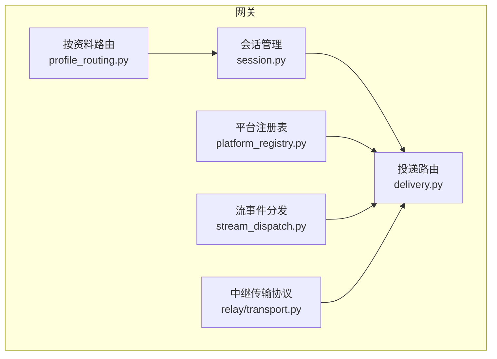
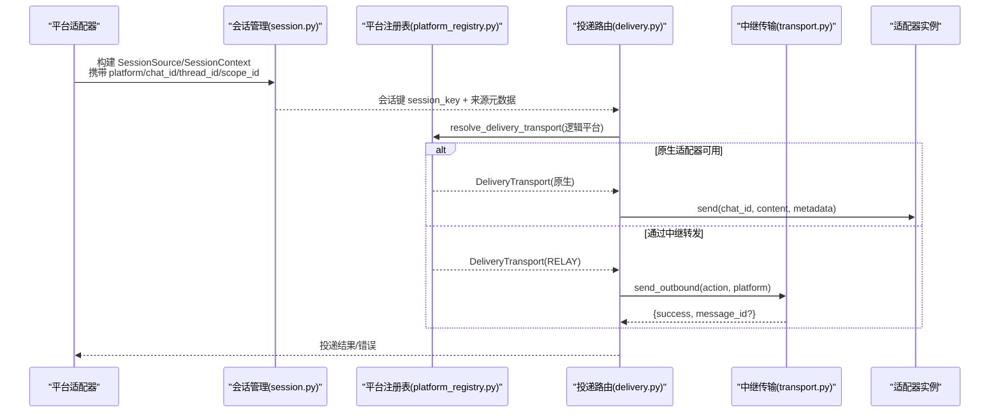
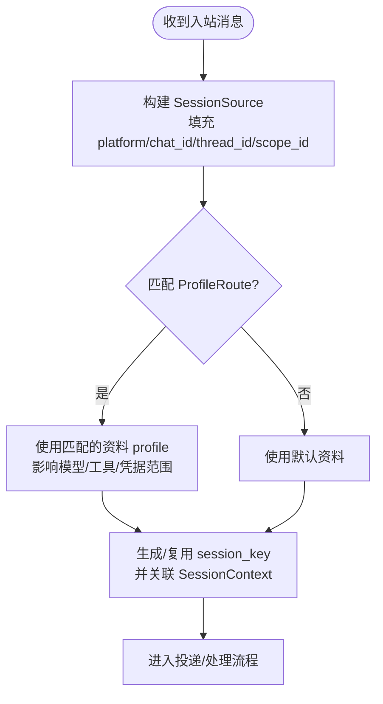
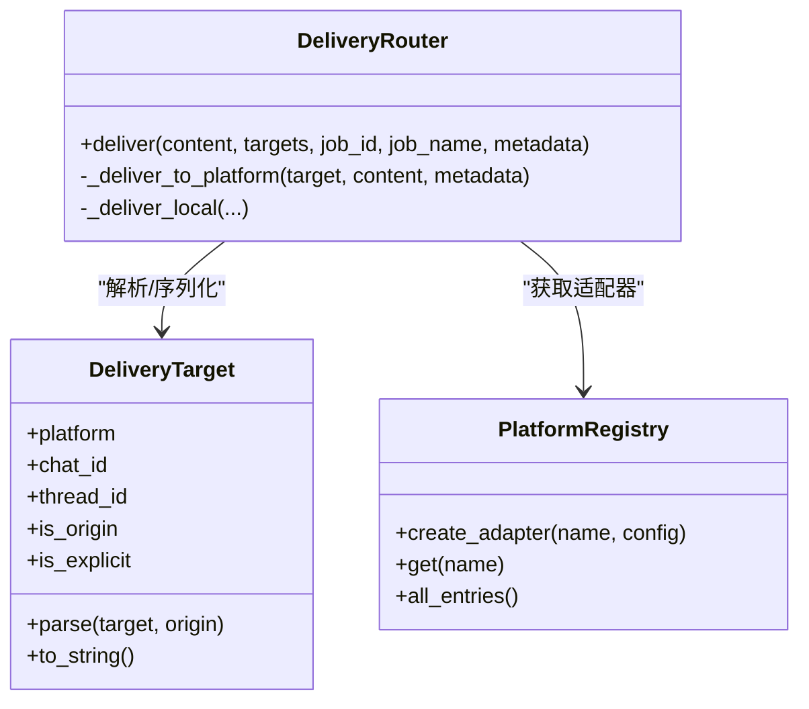
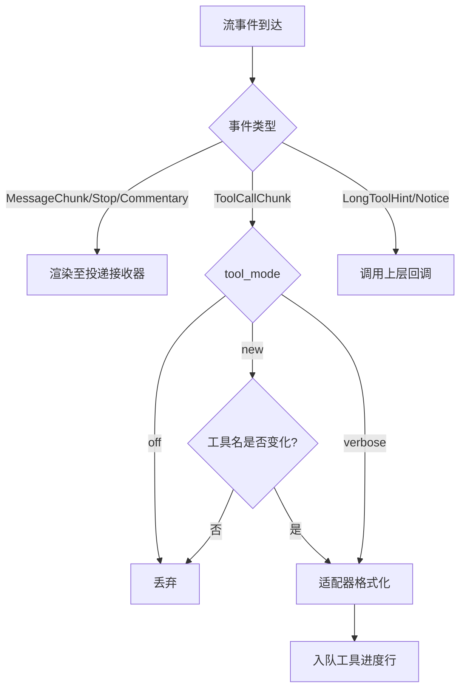
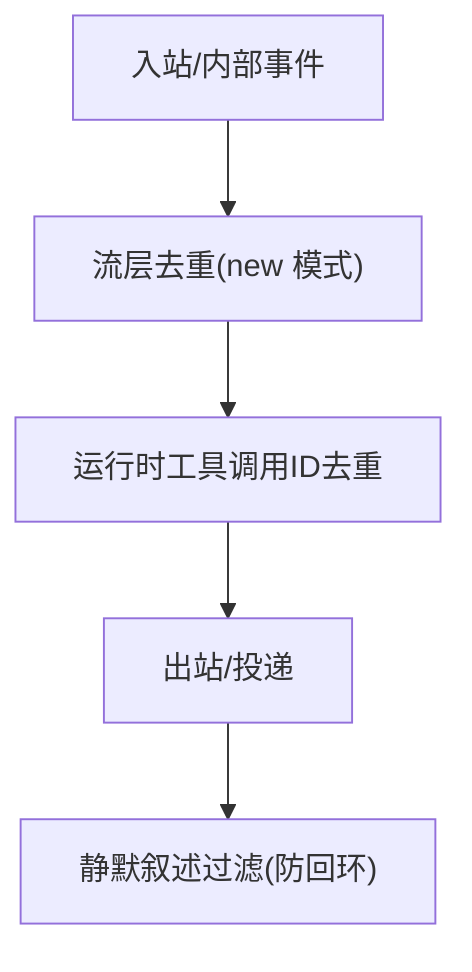
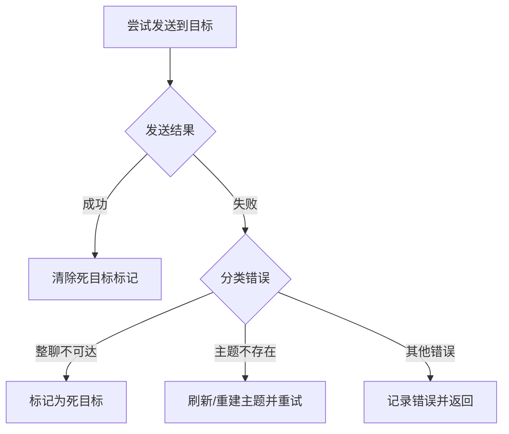
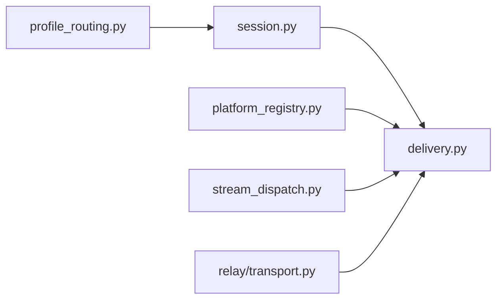

# 消息路由机制

<cite>
**本文引用的文件**
- [gateway/session.py](file://gateway/session.py)
- [gateway/profile_routing.py](file://gateway/profile_routing.py)
- [gateway/platform_registry.py](file://gateway/platform_registry.py)
- [gateway/delivery.py](file://gateway/delivery.py)
- [gateway/stream_dispatch.py](file://gateway/stream_dispatch.py)
- [gateway/relay/transport.py](file://gateway/relay/transport.py)
</cite>

## 目录
1. [简介](#简介)
2. [项目结构](#项目结构)
3. [核心组件](#核心组件)
4. [架构总览](#架构总览)
5. [详细组件分析](#详细组件分析)
6. [依赖关系分析](#依赖关系分析)
7. [性能考量](#性能考量)
8. [故障排查指南](#故障排查指南)
9. [结论](#结论)
10. [附录](#附录)

## 简介
本文件系统性说明 Hermes 网关与连接器之间的消息路由机制，重点覆盖：
- 基于 session_key 的会话绑定与多平台消息路由策略（平台识别、目标选择）
- 消息优先级与队列管理机制
- 消息去重与重复检测算法
- 路由故障转移与负载均衡策略
- 路由配置示例与性能优化建议
- 消息追踪与调试工具使用方法

## 项目结构
围绕消息路由的关键模块位于 gateway 目录下，包括会话上下文、平台注册表、投递路由、流事件分发以及网关与连接器的传输协议。

图表来源
- [gateway/session.py:148-346](file://gateway/session.py#L148-L346)
- [gateway/platform_registry.py:183-382](file://gateway/platform_registry.py#L183-L382)
- [gateway/delivery.py:294-647](file://gateway/delivery.py#L294-L647)
- [gateway/stream_dispatch.py:40-133](file://gateway/stream_dispatch.py#L40-L133)
- [gateway/relay/transport.py:41-144](file://gateway/relay/transport.py#L41-L144)
- [gateway/profile_routing.py:50-167](file://gateway/profile_routing.py#L50-L167)

章节来源
- [gateway/session.py:148-346](file://gateway/session.py#L148-L346)
- [gateway/platform_registry.py:183-382](file://gateway/platform_registry.py#L183-L382)
- [gateway/delivery.py:294-647](file://gateway/delivery.py#L294-L647)
- [gateway/stream_dispatch.py:40-133](file://gateway/stream_dispatch.py#L40-L133)
- [gateway/relay/transport.py:41-144](file://gateway/relay/transport.py#L41-L144)
- [gateway/profile_routing.py:50-167](file://gateway/profile_routing.py#L50-L167)

## 核心组件
- 会话上下文与会话键：SessionSource、SessionContext、SessionEntry 负责描述消息来源、会话元数据与持久化映射，支撑基于 session_key 的会话绑定与跨平台路由。
- 平台注册表：PlatformRegistry 提供平台适配器的发现、依赖检查、配置校验与实例创建，是“平台识别”的核心。
- 投递路由：DeliveryRouter 解析目标（origin/local/平台:聊天ID:线程ID），选择传输（原生适配器或中继），处理截断、静默过滤、死目标跳过与重试。
- 流事件分发：GatewayEventDispatcher 将结构化流事件（消息片段、工具调用进度等）路由到适配器渲染钩子与投递队列。
- 中继传输协议：RelayTransport 定义网关与连接器之间的握手、入站事件、出站动作、中断与能力跟随等契约。
- 按资料路由：ProfileRoute 支持按平台+工作区/频道/线程的多级匹配，实现多租户/多资料路由。

章节来源
- [gateway/session.py:148-346](file://gateway/session.py#L148-L346)
- [gateway/platform_registry.py:183-382](file://gateway/platform_registry.py#L183-L382)
- [gateway/delivery.py:294-647](file://gateway/delivery.py#L294-L647)
- [gateway/stream_dispatch.py:40-133](file://gateway/stream_dispatch.py#L40-L133)
- [gateway/relay/transport.py:41-144](file://gateway/relay/transport.py#L41-L144)
- [gateway/profile_routing.py:50-167](file://gateway/profile_routing.py#L50-L167)

## 架构总览
下图展示从平台入站到投递出站的完整路由链路，包含平台识别、会话绑定、目标解析、传输选择与错误恢复。

图表来源
- [gateway/session.py:148-346](file://gateway/session.py#L148-L346)
- [gateway/platform_registry.py:299-377](file://gateway/platform_registry.py#L299-L377)
- [gateway/delivery.py:92-131](file://gateway/delivery.py#L92-L131)
- [gateway/relay/transport.py:73-102](file://gateway/relay/transport.py#L73-L102)

## 详细组件分析

### 基于 session_key 的会话绑定与多平台路由
- 会话来源与上下文：SessionSource 记录 platform、chat_id、thread_id、scope_id、profile 等字段；SessionContext 聚合 source、connected_platforms、home_channels 及 session_key/session_id。
- 路由到具体资料：ProfileRoute 支持 platform + guild_id + chat_id + thread_id 的多级匹配，优先级从高到低（线程 > 频道 > 工作区 > 默认）。
- 平台识别与实例化：PlatformRegistry.create_adapter 先尝试 check_fn，必要时触发 ensure_deps_fn 安装依赖，再 validate_config，最后工厂创建适配器。
- 会话键安全：对 session_key 进行路径穿越防护，避免非法字符导致下游文件系统路径被利用。

图表来源
- [gateway/session.py:148-346](file://gateway/session.py#L148-L346)
- [gateway/profile_routing.py:50-167](file://gateway/profile_routing.py#L50-L167)
- [gateway/platform_registry.py:299-377](file://gateway/platform_registry.py#L299-L377)

章节来源
- [gateway/session.py:148-346](file://gateway/session.py#L148-L346)
- [gateway/profile_routing.py:50-167](file://gateway/profile_routing.py#L50-L167)
- [gateway/platform_registry.py:299-377](file://gateway/platform_registry.py#L299-L377)

### 平台识别与目标选择
- 平台识别：PlatformRegistry.get/create_adapter 负责按需加载插件、检查依赖、验证配置并返回适配器实例。
- 目标选择：DeliveryTarget.parse 支持 origin/local/平台名/平台:chat_id/平台:chat_id:thread_id 多种格式；DeliveryRouter.deliver 遍历目标并执行投递。
- 传输选择：resolve_delivery_transport 优先原生适配器，若不可用且中继声明“代理该逻辑平台”，则走中继通道。

图表来源
- [gateway/delivery.py:213-292](file://gateway/delivery.py#L213-L292)
- [gateway/delivery.py:294-647](file://gateway/delivery.py#L294-L647)
- [gateway/platform_registry.py:183-382](file://gateway/platform_registry.py#L183-L382)

章节来源
- [gateway/delivery.py:213-292](file://gateway/delivery.py#L213-L292)
- [gateway/delivery.py:294-647](file://gateway/delivery.py#L294-L647)
- [gateway/platform_registry.py:183-382](file://gateway/platform_registry.py#L183-L382)

### 消息优先级与队列管理
- 流事件优先级：GatewayEventDispatcher 根据 tool_mode（all/new/verbose/off）控制工具进度事件的输出频率；在 new 模式下仅当工具名称变化才上报，降低噪音。
- 队列与消费：事件经适配器渲染后，行级内容并入网关的工具进度队列，由统一消费者串行消费，避免并发竞争。
- 长任务提示：LongToolHint/GatewayNotice 通过回调交由上层决定是否展示，避免阻塞主循环。

图表来源
- [gateway/stream_dispatch.py:40-133](file://gateway/stream_dispatch.py#L40-L133)

章节来源
- [gateway/stream_dispatch.py:40-133](file://gateway/stream_dispatch.py#L40-L133)

### 消息去重与重复检测
- 流层去重：GatewayEventDispatcher 在 new 模式下以最近工具名为键做简单去重，避免重复上报相同工具进度。
- 运行时去重：agent 侧存在多处工具调用 ID 去重与历史重复清理逻辑，防止严格提供商拒绝重复 tool_call_id。
- 投递层防回环：delivery 层对“静默叙述”类内容进行过滤，避免 bot-to-bot 场景下的无限回环。

图表来源
- [gateway/stream_dispatch.py:85-114](file://gateway/stream_dispatch.py#L85-L114)
- [gateway/delivery.py:43-56](file://gateway/delivery.py#L43-L56)

章节来源
- [gateway/stream_dispatch.py:85-114](file://gateway/stream_dispatch.py#L85-L114)
- [gateway/delivery.py:43-56](file://gateway/delivery.py#L43-L56)

### 路由故障转移与负载均衡
- 故障转移：
  - 传输选择：原生适配器不可用时，若中继声明“代理该逻辑平台”，自动切换到中继通道。
  - 死目标短路：DeliveryRouter 维护 DeadTargetRegistry，对已确认不可达的目标跳过发送，成功投递后清除标记。
  - Telegram 私有主题失败重试：当因主题不存在导致失败时，尝试刷新/重建主题并重试。
- 负载均衡：
  - 平台适配器按名称注册，Gateway 可并行持有多个适配器实例；同一逻辑平台的请求由对应适配器处理，天然具备水平扩展能力。
  - 流事件分发将渲染与队列解耦，避免单点阻塞。

图表来源
- [gateway/delivery.py:318-391](file://gateway/delivery.py#L318-L391)
- [gateway/delivery.py:554-642](file://gateway/delivery.py#L554-L642)

章节来源
- [gateway/delivery.py:318-391](file://gateway/delivery.py#L318-L391)
- [gateway/delivery.py:554-642](file://gateway/delivery.py#L554-L642)

### 路由配置示例
- 按资料路由（config.yaml 片段）：
  - server-default：将某 Discord 服务器路由到指定资料
  - special-channel：将特定频道路由到另一资料
  - thread-route：将特定线程路由到专用资料
- 投递目标格式：
  - origin：回到来源
  - local：仅保存到本地文件
  - telegram：Telegram 主页频道
  - telegram:123456：指定聊天
  - telegram:123456:topic_id：指定聊天与主题

章节来源
- [gateway/profile_routing.py:18-38](file://gateway/profile_routing.py#L18-L38)
- [gateway/delivery.py:231-292](file://gateway/delivery.py#L231-L292)

### 性能优化建议
- 延迟加载平台插件：PlatformRegistry 使用延迟加载，仅在需要时导入重型 SDK，减少启动开销。
- 流事件节流：在 new 模式下对工具进度去重，减少不必要的 UI/日志压力。
- 大输出审计与截断：超过阈值的 cron 输出会保存全文到磁盘，非分块适配器会截断并附加文件路径，避免平台限制导致的失败。
- 会话键安全与最小化元数据：避免敏感信息泄露，同时保持系统提示长度可控。

章节来源
- [gateway/platform_registry.py:190-250](file://gateway/platform_registry.py#L190-L250)
- [gateway/stream_dispatch.py:85-114](file://gateway/stream_dispatch.py#L85-L114)
- [gateway/delivery.py:475-524](file://gateway/delivery.py#L475-L524)
- [gateway/session.py:100-146](file://gateway/session.py#L100-L146)

### 消息追踪与调试工具
- 流事件调试：GatewayEventDispatcher 捕获异常并记录调试日志，确保呈现层不会破坏主循环。
- 投递日志：DeliveryRouter 在截断、静默过滤、死目标跳过、主题刷新等关键路径均有日志输出，便于定位问题。
- 中继协议：RelayTransport 定义了 send_outbound/get_chat_info/send_interrupt 等接口，便于在连接器侧对齐行为与排障。

章节来源
- [gateway/stream_dispatch.py:88-94](file://gateway/stream_dispatch.py#L88-L94)
- [gateway/delivery.py:448-544](file://gateway/delivery.py#L448-L544)
- [gateway/relay/transport.py:73-102](file://gateway/relay/transport.py#L73-L102)

## 依赖关系分析
- 耦合度：
  - delivery 依赖 platform_registry 获取适配器，依赖 session 提供的来源元数据。
  - stream_dispatch 依赖适配器渲染接口，不直接感知平台细节，松耦合。
  - relay/transport 作为协议抽象，与上层解耦，便于替换具体实现。
- 外部依赖：
  - 平台 SDK 通过 PlatformRegistry.ensure_deps_fn 按需安装，避免冷启动负担。
  - 配置文件驱动 ProfileRoute，实现灵活的多资料路由。

图表来源
- [gateway/session.py:148-346](file://gateway/session.py#L148-L346)
- [gateway/delivery.py:294-647](file://gateway/delivery.py#L294-L647)
- [gateway/platform_registry.py:183-382](file://gateway/platform_registry.py#L183-L382)
- [gateway/stream_dispatch.py:40-133](file://gateway/stream_dispatch.py#L40-L133)
- [gateway/relay/transport.py:41-144](file://gateway/relay/transport.py#L41-L144)
- [gateway/profile_routing.py:50-167](file://gateway/profile_routing.py#L50-L167)

章节来源
- [gateway/session.py:148-346](file://gateway/session.py#L148-L346)
- [gateway/delivery.py:294-647](file://gateway/delivery.py#L294-L647)
- [gateway/platform_registry.py:183-382](file://gateway/platform_registry.py#L183-L382)
- [gateway/stream_dispatch.py:40-133](file://gateway/stream_dispatch.py#L40-L133)
- [gateway/relay/transport.py:41-144](file://gateway/relay/transport.py#L41-L144)
- [gateway/profile_routing.py:50-167](file://gateway/profile_routing.py#L50-L167)

## 性能考量
- 延迟加载与按需初始化：平台插件与 SDK 仅在首次使用时加载，缩短启动时间。
- 流事件节流与去重：减少无效渲染与队列压力，提升整体吞吐。
- 大输出处理：全文审计+条件截断，兼顾可追溯性与平台限制。
- 死目标短路：避免对不可达目标的重复发送，节省网络与限流配额。

[本节为通用指导，不直接分析具体文件]

## 故障排查指南
- 无法找到适配器：检查 PlatformRegistry 是否正确注册，依赖是否满足，配置是否有效。
- 投递失败：查看 DeliveryRouter 的错误分类与死目标标记；关注 Telegram 私有主题刷新逻辑。
- 流事件未显示：确认 tool_mode 与预览长度设置；检查 GatewayEventDispatcher 的回调是否生效。
- 中继通信问题：核对 RelayTransport 的 handshake/outbound/interrupt 流程与能力声明。

章节来源
- [gateway/platform_registry.py:299-377](file://gateway/platform_registry.py#L299-L377)
- [gateway/delivery.py:318-391](file://gateway/delivery.py#L318-L391)
- [gateway/stream_dispatch.py:88-133](file://gateway/stream_dispatch.py#L88-L133)
- [gateway/relay/transport.py:41-144](file://gateway/relay/transport.py#L41-L144)

## 结论
Hermes 的消息路由机制以会话键为核心，结合平台注册表与按资料路由，实现了多平台、多租户的灵活路由。投递层提供健壮的故障转移与防回环机制，流事件分发保证高吞吐与低噪声。通过延迟加载、去重与大输出审计等手段，系统在可扩展性与稳定性之间取得平衡。

[本节为总结性内容，不直接分析具体文件]

## 附录
- 术语
  - session_key：会话唯一标识，用于绑定消息与上下文
  - scope_id：跨平台的工作区/服务器隔离标识
  - profile：资料，承载模型、工具、凭据与作用域
  - 中继：网关与连接器之间的协议通道
- 相关文档
  - 中继-连接器契约：见仓库内 docs/relay-connector-contract.md（概念引用）

[本节为补充信息，不直接分析具体文件]