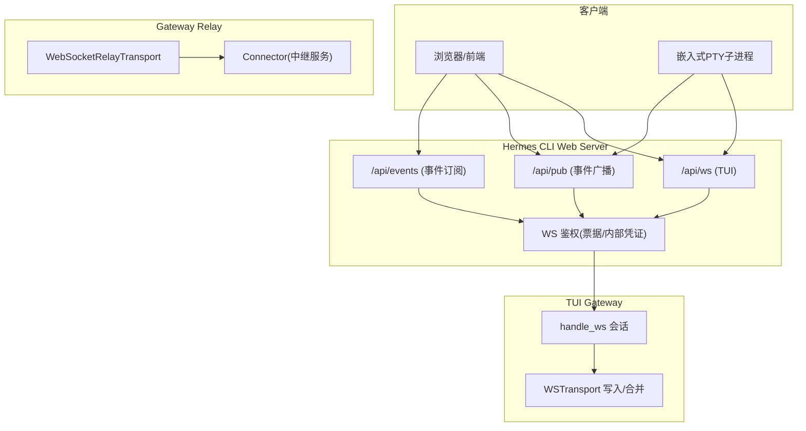
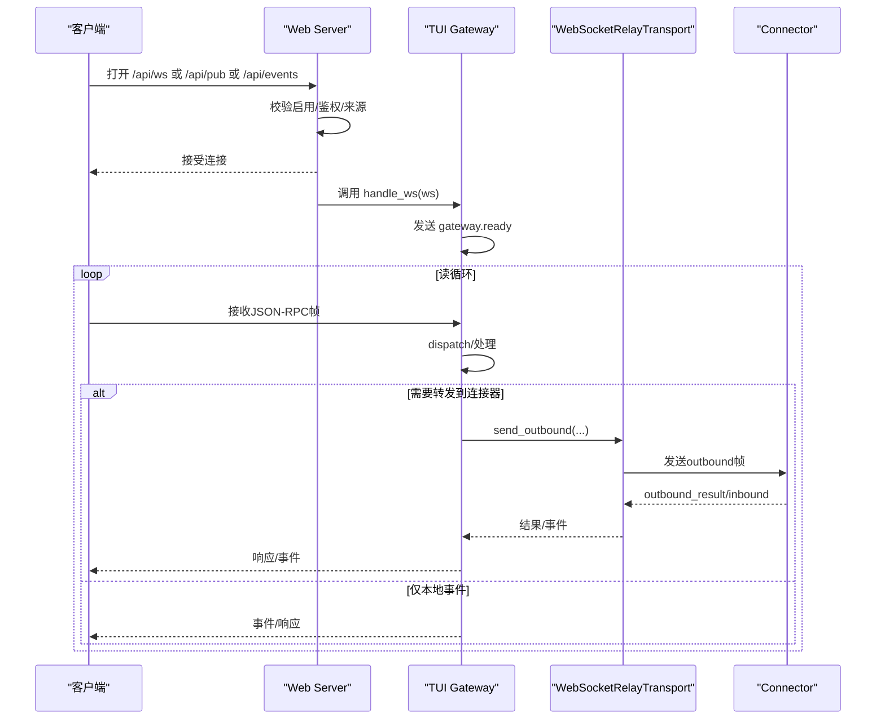
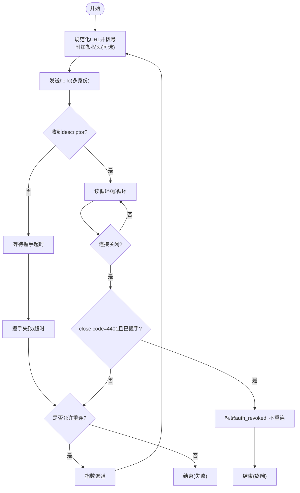
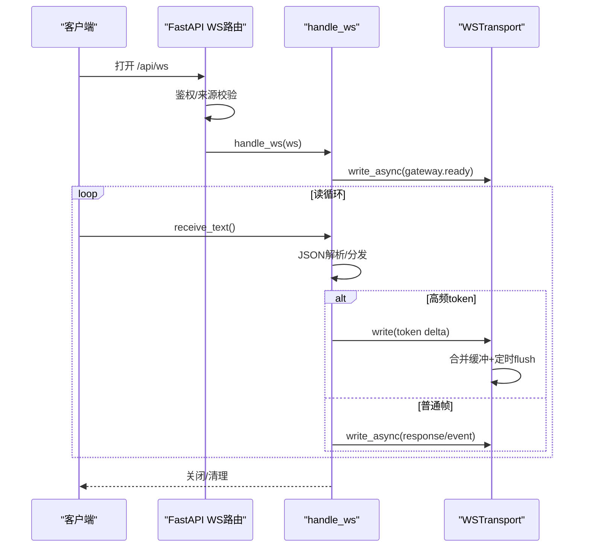
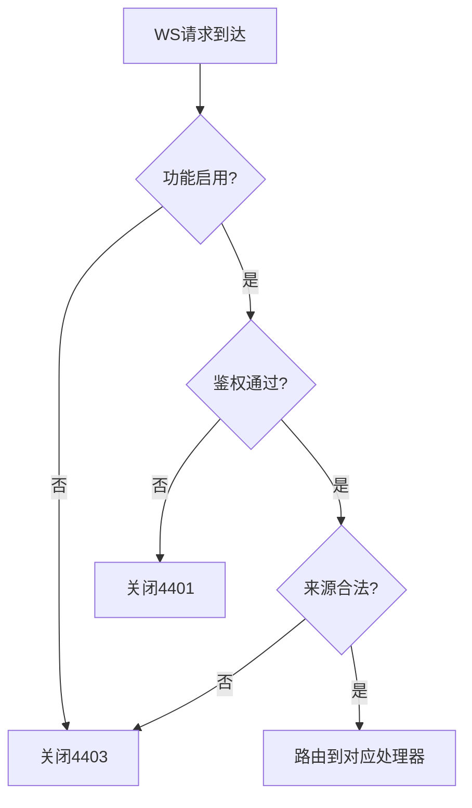
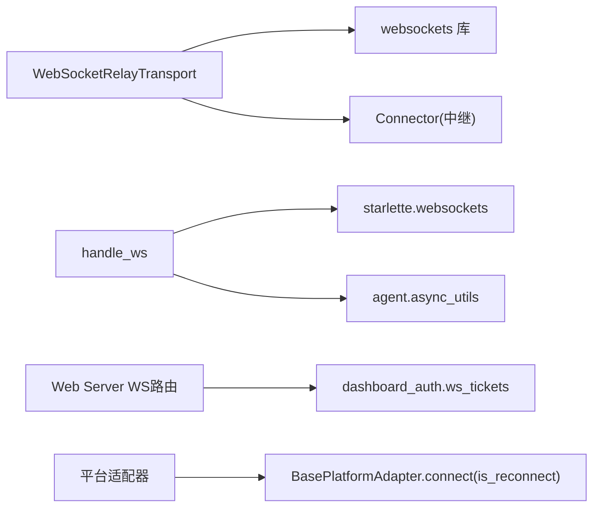

# 连接管理

<cite>
**本文引用的文件**
- [ws_transport.py](file://gateway/relay/ws_transport.py)
- [ws.py](file://tui_gateway/ws.py)
- [web_server.py](file://hermes_cli/web_server.py)
- [ws_tickets.py](file://hermes_cli/dashboard_auth/ws_tickets.py)
- [test_adapter_connect_is_reconnect_contract.py](file://tests/gateway/test_adapter_connect_is_reconnect_contract.py)
</cite>

## 目录
1. [简介](#简介)
2. [项目结构](#项目结构)
3. [核心组件](#核心组件)
4. [架构总览](#架构总览)
5. [详细组件分析](#详细组件分析)
6. [依赖关系分析](#依赖关系分析)
7. [性能考虑](#性能考虑)
8. [故障排查指南](#故障排查指南)
9. [结论](#结论)
10. [附录](#附录)

## 简介
本文件聚焦于 WebSocket 连接管理，覆盖连接建立、握手协议、连接生命周期、参数配置、超时设置、认证机制与错误处理；并说明连接池（多身份）、多平台身份支持、重连策略、连接状态监控、示例流程与安全注意事项。文档基于代码库中的网关到连接器 WebSocket 传输、TUI Gateway 的 WebSocket 会话以及仪表板鉴权票据等实现进行归纳。

## 项目结构
与 WebSocket 连接管理直接相关的代码主要分布在以下模块：
- 网关到连接器的 WebSocket 传输层：负责拨号、握手、帧收发、重连、鉴权头、能力描述符协商、空闲/休眠切换等。
- TUI Gateway WebSocket 会话：提供 JSON-RPC over WebSocket 的长连接，包含令牌流合并、写锁、Nagle 优化、事件分发与清理。
- 仪表板 WebSocket 路由与鉴权：对 /api/ws、/api/pub、/api/events 等端点进行访问控制与通道隔离。
- WS 升级鉴权票据：为浏览器与服务端内部进程提供一次性或进程级凭证。
- 平台适配器重连契约测试：确保所有平台的 connect() 接受 is_reconnect 关键字，保障网关重连路径稳定。

图表来源
- [web_server.py:16036-16126](file://hermes_cli/web_server.py#L16036-L16126)
- [ws.py:286-477](file://tui_gateway/ws.py#L286-L477)
- [ws_transport.py:339-800](file://gateway/relay/ws_transport.py#L339-L800)

章节来源
- [web_server.py:16036-16126](file://hermes_cli/web_server.py#L16036-L16126)
- [ws.py:286-477](file://tui_gateway/ws.py#L286-L477)
- [ws_transport.py:339-800](file://gateway/relay/ws_transport.py#L339-L800)

## 核心组件
- WebSocketRelayTransport：网关侧与连接器之间的 WebSocket 传输，负责拨号、握手、发送 hello/descriptor、请求-响应、中断、空闲/休眠、重连、鉴权头等。
- TUI Gateway handle_ws/WSTransport：服务端 WebSocket 会话处理器与每连接传输封装，负责 JSON-RPC 读写、令牌流合并、写锁、Nagle 优化、异常与清理。
- 仪表板 WS 路由：/api/ws、/api/pub、/api/events 的接入点，统一鉴权与通道隔离。
- WS 票据系统：一次性浏览器票据与进程级内部凭证，用于 WS 升级鉴权。
- 平台适配器重连契约：通过静态检查保证各平台 connect() 支持 is_reconnect 关键字，避免重连失败。

章节来源
- [ws_transport.py:339-800](file://gateway/relay/ws_transport.py#L339-L800)
- [ws.py:286-477](file://tui_gateway/ws.py#L286-L477)
- [web_server.py:16036-16126](file://hermes_cli/web_server.py#L16036-L16126)
- [ws_tickets.py:1-162](file://hermes_cli/dashboard_auth/ws_tickets.py#L1-L162)
- [test_adapter_connect_is_reconnect_contract.py:1-145](file://tests/gateway/test_adapter_connect_is_reconnect_contract.py#L1-L145)

## 架构总览
下图展示从客户端到连接器的一条完整链路：浏览器或 PTY 子进程通过 FastAPI 暴露的 WebSocket 端点进入，经鉴权后由 TUI Gateway 处理 JSON-RPC；同时，网关通过 WebSocketRelayTransport 与外部连接器建立长连接，完成握手、消息转发与重连。

图表来源
- [web_server.py:16036-16126](file://hermes_cli/web_server.py#L16036-L16126)
- [ws.py:286-477](file://tui_gateway/ws.py#L286-L477)
- [ws_transport.py:339-800](file://gateway/relay/ws_transport.py#L339-L800)

## 详细组件分析

### WebSocketRelayTransport（网关到连接器）
- 连接建立与握手
  - 拨号 URL 规范化：将 http(s) 转换为 ws(s)，并确保路径为 /relay。
  - 鉴权头：当配置了 gateway_id 与 upgrade_secret 时，在 WS 升级时附加 Authorization: Bearer <签名令牌>。
  - Hello 与 Descriptor：为每个前缀身份发送 hello，等待 descriptor 完成握手；支持多平台身份集合。
- 超时与请求-响应
  - 握手超时与出站超时分别可配；请求使用 requestId 与 Future 匹配响应。
- 重连策略
  - 可选的重连监督器：非预期关闭时按指数退避重拨；支持休眠模式（go_dormant）以配合 scale-to-zero 挂起恢复。
  - 终止态：成功握手后收到 4401（未授权）视为凭据撤销，停止重连。
- 空闲与缓冲翻转
  - go_idle/go_dormant：通知连接器切换到“仅缓冲”模式，并在断开/挂起期间安全地缓冲入站事件，恢复时重放。
- 入站处理
  - 读取 newline-delimited JSON 帧，解析 inbound/outbound_result/interrupt 等，映射为 MessageEvent 并交给上层。
- 错误处理
  - 捕获 close code 4401 并标记 auth_revoked；其他异常记录日志并触发重连（除非已关闭或已撤销）。

图表来源
- [ws_transport.py:69-95](file://gateway/relay/ws_transport.py#L69-L95)
- [ws_transport.py:441-541](file://gateway/relay/ws_transport.py#L441-L541)
- [ws_transport.py:567-723](file://gateway/relay/ws_transport.py#L567-L723)
- [ws_transport.py:731-800](file://gateway/relay/ws_transport.py#L731-L800)

章节来源
- [ws_transport.py:69-95](file://gateway/relay/ws_transport.py#L69-L95)
- [ws_transport.py:339-800](file://gateway/relay/ws_transport.py#L339-L800)

### TUI Gateway WebSocket 会话（/api/ws）
- 会话建立
  - 接受连接后立即发送 gateway.ready，携带皮肤与变更事件开关。
  - 禁用 Nagle 以保证高频 token 流的实时性。
- 写入与合并
  - 高频 token 帧（message.delta/reasoning.delta/thinking.delta）被合并缓冲，短定时器批量刷新，降低事件循环唤醒开销。
  - 非 streaming 帧会先冲刷 token 缓冲再发送，保证顺序。
- 错误与清理
  - 解析错误、调度崩溃、发送失败均记录指标并尝试回复错误帧。
  - 连接关闭时注销传输、释放唤醒资源、回收/分离会话并统计指标。

图表来源
- [ws.py:286-477](file://tui_gateway/ws.py#L286-L477)

章节来源
- [ws.py:286-477](file://tui_gateway/ws.py#L286-L477)

### 仪表板 WS 路由与鉴权（/api/ws、/api/pub、/api/events）
- 统一前置校验：功能开关、WS 鉴权、来源白名单。
- 通道隔离：/api/pub 与 /api/events 通过 channel 区分广播/订阅。
- 鉴权方式：
  - 浏览器：通过一次性 ticket（?ticket=...），有效期短，防止泄露滥用。
  - 内部进程：通过进程级内部凭证（internal_ws_credential），多用途、不注入前端。

图表来源
- [web_server.py:16036-16126](file://hermes_cli/web_server.py#L16036-L16126)
- [ws_tickets.py:1-162](file://hermes_cli/dashboard_auth/ws_tickets.py#L1-L162)

章节来源
- [web_server.py:16036-16126](file://hermes_cli/web_server.py#L16036-L16126)
- [ws_tickets.py:1-162](file://hermes_cli/dashboard_auth/ws_tickets.py#L1-L162)

### 平台适配器重连契约
- 约束：所有平台适配器的 connect() 必须接受 is_reconnect 关键字（或 **kwargs），以确保网关重连监视器在每次重试时能正确传递该参数。
- 风险：若缺失该参数，首次重连即抛出类型错误，导致平台静默断线。
- 验证：通过 AST 静态扫描所有 adapter.py 文件并断言签名兼容。

章节来源
- [test_adapter_connect_is_reconnect_contract.py:1-145](file://tests/gateway/test_adapter_connect_is_reconnect_contract.py#L1-L145)

## 依赖关系分析
- WebSocketRelayTransport 依赖 websockets 包（可选导入），并通过 _upgrade_headers 生成鉴权头；依赖连接器遵循的帧协议。
- TUI Gateway 的 handle_ws 依赖 starlette 的 WebSocketDisconnect（可选导入），并使用 asyncio 任务与线程池协调。
- 仪表板 WS 路由依赖 dashboard_auth 的票据系统与来源校验逻辑。
- 平台适配器需遵守 BasePlatformAdapter.connect 的 is_reconnect 契约，由测试强制约束。

图表来源
- [ws_transport.py:46-51](file://gateway/relay/ws_transport.py#L46-L51)
- [ws.py:62-67](file://tui_gateway/ws.py#L62-L67)
- [ws.py:149-160](file://tui_gateway/ws.py#L149-L160)
- [web_server.py:16036-16126](file://hermes_cli/web_server.py#L16036-L16126)
- [ws_tickets.py:1-162](file://hermes_cli/dashboard_auth/ws_tickets.py#L1-L162)
- [test_adapter_connect_is_reconnect_contract.py:1-145](file://tests/gateway/test_adapter_connect_is_reconnect_contract.py#L1-L145)

章节来源
- [ws_transport.py:46-51](file://gateway/relay/ws_transport.py#L46-L51)
- [ws.py:62-67](file://tui_gateway/ws.py#L62-L67)
- [web_server.py:16036-16126](file://hermes_cli/web_server.py#L16036-L16126)
- [ws_tickets.py:1-162](file://hermes_cli/dashboard_auth/ws_tickets.py#L1-L162)
- [test_adapter_connect_is_reconnect_contract.py:1-145](file://tests/gateway/test_adapter_connect_is_reconnect_contract.py#L1-L145)

## 性能考虑
- 令牌流合并：TUI Gateway 将高频 token 帧合并缓冲并以短定时器批量刷新，显著减少事件循环唤醒与 GIL 竞争。
- Nagle 优化：对 WS 套接字禁用 Nagle，避免小帧被内核合并导致延迟抖动。
- 写锁与线程安全：WSTransport 使用异步锁保护并发写，避免乱序与竞态；跨线程写入通过 safe_schedule_threadsafe 调度。
- 重连退避：WebSocketRelayTransport 使用指数退避与上限，避免雪崩；休眠模式下使用更慢的重拨周期，避免与平台挂起窗口冲突。
- 超时控制：握手与出站均有明确超时，避免阻塞；关闭阶段对 supervisor/reader/close 设置短超时，确保快速释放资源。

[本节为通用性能建议，无需特定文件引用]

## 故障排查指南
- 握手失败/超时
  - 检查 URL 规范化是否正确（scheme/path），确认连接器可达。
  - 如启用鉴权，确认 gateway_id 与 upgrade_secret 配置一致。
  - 参考：握手与超时逻辑。
- 4401 未授权
  - 成功握手后出现 4401 表示凭据被撤销，不再重连；需重新注册/更新凭据。
  - 参考：4401 检测与终止态处理。
- 频繁重连
  - 检查网络稳定性与连接器负载；确认未处于休眠模式；观察重连退避是否生效。
  - 参考：重连监督器与休眠模式。
- 令牌流卡顿
  - 检查 WSTransport 的合并与 flush 是否被阻塞；关注事件循环是否长时间被占用。
  - 参考：令牌合并与写超时。
- 鉴权失败
  - 浏览器：确认 ticket 有效且未过期；内部进程：确认 internal_ws_credential 匹配。
  - 参考：WS 票据与鉴权流程。

章节来源
- [ws_transport.py:486-501](file://gateway/relay/ws_transport.py#L486-L501)
- [ws_transport.py:745-775](file://gateway/relay/ws_transport.py#L745-L775)
- [ws.py:118-187](file://tui_gateway/ws.py#L118-L187)
- [ws_tickets.py:62-153](file://hermes_cli/dashboard_auth/ws_tickets.py#L62-L153)

## 结论
本仓库实现了端到端的 WebSocket 连接管理：网关到连接器的可靠传输（含握手、鉴权、重连、空闲/休眠）、TUI Gateway 的高性能 JSON-RPC over WebSocket（含令牌合并与写锁）、仪表板的 WS 鉴权与通道隔离，以及平台适配器的重连契约保障。通过明确的超时、错误处理与状态监控，系统在复杂网络与多平台环境下具备较强的鲁棒性与可观测性。

[本节为总结，无需特定文件引用]

## 附录

### 连接参数配置与超时
- 连接超时：握手与出站超时可配置，默认值在传输层定义。
- 重连参数：初始退避、最大退避、是否启用重连、休眠重拨周期。
- 鉴权参数：gateway_id、upgrade_secret（用于生成升级令牌）。
- 多身份：identities 列表，每个 (platform, bot_id) 都会发送 hello 并累积 descriptor。

章节来源
- [ws_transport.py:342-393](file://gateway/relay/ws_transport.py#L342-L393)
- [ws_transport.py:441-484](file://gateway/relay/ws_transport.py#L441-L484)

### 认证机制与安全
- 升级头验证：Authorization: Bearer <签名令牌>，连接器据此验证网关实例。
- 票据认证：浏览器使用一次性 ticket（TTL 30s），内部进程使用进程级内部凭证（多用途、不注入前端）。
- 权限控制：路由层校验功能开关、来源白名单与通道归属。

章节来源
- [ws_transport.py:486-501](file://gateway/relay/ws_transport.py#L486-L501)
- [ws_tickets.py:62-153](file://hermes_cli/dashboard_auth/ws_tickets.py#L62-L153)
- [web_server.py:16036-16126](file://hermes_cli/web_server.py#L16036-L16126)

### 连接池管理与多平台身份
- 单连接多身份：WebSocketRelayTransport 维护 identities 列表，一次连接承载多个平台身份，连接器据此维护 egress 允许集。
- 能力描述符：每个身份返回 descriptor，支持按平台查询能力（如消息长度限制）。

章节来源
- [ws_transport.py:365-371](file://gateway/relay/ws_transport.py#L365-L371)
- [ws_transport.py:543-553](file://gateway/relay/ws_transport.py#L543-L553)

### 重连策略与连接状态监控
- 重连策略：非预期关闭触发重连监督器，指数退避；休眠模式使用更长周期；4401 后终止。
- 状态监控：read_loop 中记录异常与 close code；disconnect 时清理 pending futures 与 ack future；TUI Gateway 记录消息数、解析错误、调度崩溃、发送失败等指标。

章节来源
- [ws_transport.py:731-800](file://gateway/relay/ws_transport.py#L731-L800)
- [ws.py:429-477](file://tui_gateway/ws.py#L429-L477)

### 连接建立示例（成功、失败、恢复）
- 成功连接
  - 步骤：规范化 URL → 附加鉴权头 → 拨号 → 发送 hello → 等待 descriptor → 启动 reader → 业务通信。
  - 参考路径：连接与握手流程。
- 连接失败处理
  - 握手超时/网络错误：记录日志，根据策略决定是否重连；若 4401 且已握手则终止。
  - 参考路径：错误处理与终止态。
- 连接恢复流程
  - 非预期关闭：触发重连监督器，指数退避重拨；成功后重置 descriptor 与状态。
  - 参考路径：重连监督器与恢复。

章节来源
- [ws_transport.py:441-541](file://gateway/relay/ws_transport.py#L441-L541)
- [ws_transport.py:731-800](file://gateway/relay/ws_transport.py#L731-L800)