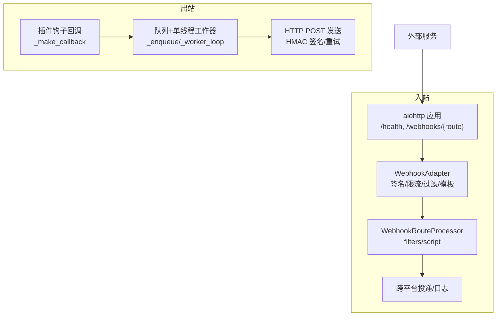
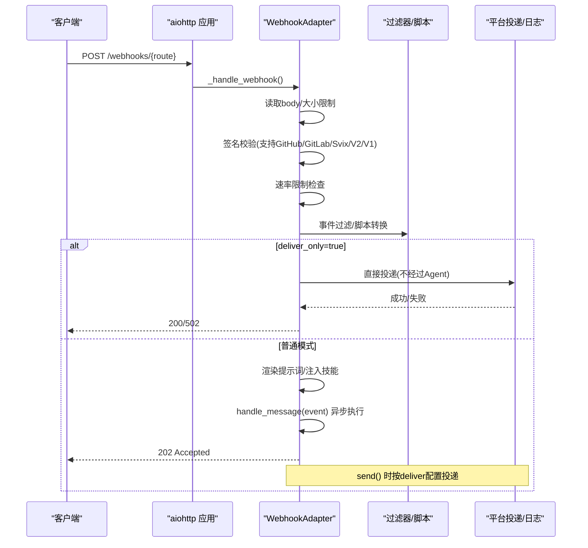
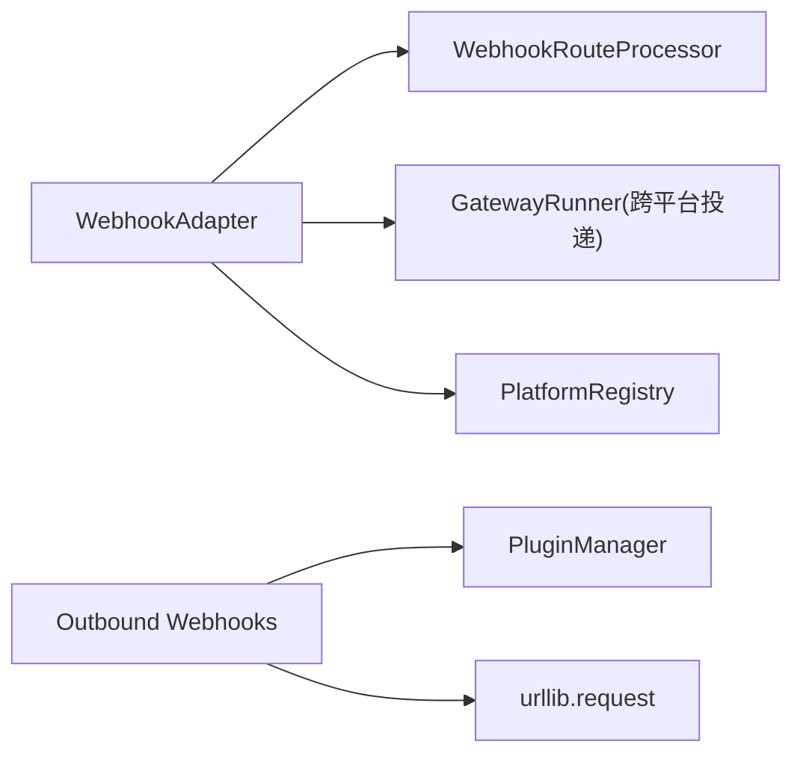

# Webhook API

<cite>
**本文引用的文件**
- [gateway/platforms/webhook.py](file://gateway/platforms/webhook.py)
- [gateway/platforms/webhook_filters.py](file://gateway/platforms/webhook_filters.py)
- [hermes_cli/webhook.py](file://hermes_cli/webhook.py)
- [agent/outbound_webhooks.py](file://agent/outbound_webhooks.py)
- [tests/gateway/test_webhook_signature_rate_limit.py](file://tests/gateway/test_webhook_signature_rate_limit.py)
- [tests/agent/test_outbound_webhooks.py](file://tests/agent/test_outbound_webhooks.py)
</cite>

## 目录
1. [简介](#简介)
2. [项目结构](#项目结构)
3. [核心组件](#核心组件)
4. [架构总览](#架构总览)
5. [详细组件分析](#详细组件分析)
6. [依赖关系分析](#依赖关系分析)
7. [性能与可靠性](#性能与可靠性)
8. [故障排除指南](#故障排除指南)
9. [结论](#结论)
10. [附录：配置与示例](#附录：配置与示例)

## 简介
本文件为 Hermes Agent 的 Webhook API 文档，覆盖外部事件触发与回调机制。内容包含：
- 入站 Webhook（接收外部服务事件并驱动 Agent 或直投消息）
- 出站 Webhook（Agent 生命周期事件主动通知外部系统）
- 端点、请求格式、签名验证、重试与幂等
- 事件类型、负载结构与处理流程
- 完整配置示例（URL、过滤规则、安全设置）
- 错误处理、日志记录与监控指标建议
- 第三方系统集成指南与故障排除

## 项目结构
Webhook 能力由“入站”和“出站”两部分组成：
- 入站：网关平台适配器提供 HTTP 服务器，接收外部 POST，校验签名、限流、过滤，渲染提示词或直接投递，支持多路由与动态订阅。
- 出站：在 Agent 内部通过插件钩子注册回调，将生命周期事件以 JSON POST 到配置的远端 URL，带 HMAC 签名与重试。

**图表来源**
- [gateway/platforms/webhook.py:177-344](file://gateway/platforms/webhook.py#L177-L344)
- [gateway/platforms/webhook_filters.py:94-303](file://gateway/platforms/webhook_filters.py#L94-L303)
- [agent/outbound_webhooks.py:112-150](file://agent/outbound_webhooks.py#L112-L150)
- [agent/outbound_webhooks.py:380-486](file://agent/outbound_webhooks.py#L380-L486)
- [agent/outbound_webhooks.py:520-570](file://agent/outbound_webhooks.py#L520-L570)

**章节来源**
- [gateway/platforms/webhook.py:177-344](file://gateway/platforms/webhook.py#L177-L344)
- [agent/outbound_webhooks.py:112-150](file://agent/outbound_webhooks.py#L112-L150)

## 核心组件
- 入站 Webhook 适配器：提供 HTTP 接口、签名校验、速率限制、事件过滤、提示词模板渲染、直接投递模式、会话生命周期管理。
- 路由过滤器与脚本：声明式过滤（字段存在性、等于、包含、正则、文件列表、all/any/not），可选脚本转换（bash/python）。
- CLI 动态订阅：创建/列出/删除/测试动态路由，持久化到本地 JSON，热加载生效。
- 出站 Webhook：从配置解析目标，注册到插件管理器，事件发生时序列化负载、计算 HMAC、入队并由后台线程发送，支持超时、重试与重定向拒绝。

**章节来源**
- [gateway/platforms/webhook.py:177-344](file://gateway/platforms/webhook.py#L177-L344)
- [gateway/platforms/webhook_filters.py:94-303](file://gateway/platforms/webhook_filters.py#L94-L303)
- [hermes_cli/webhook.py:140-308](file://hermes_cli/webhook.py#L140-L308)
- [agent/outbound_webhooks.py:156-218](file://agent/outbound_webhooks.py#L156-L218)

## 架构总览
入站 Webhook 处理序列：

**图表来源**
- [gateway/platforms/webhook.py:584-934](file://gateway/platforms/webhook.py#L584-L934)
- [gateway/platforms/webhook.py:1028-1141](file://gateway/platforms/webhook.py#L1028-L1141)
- [gateway/platforms/webhook_filters.py:208-303](file://gateway/platforms/webhook_filters.py#L208-L303)

**章节来源**
- [gateway/platforms/webhook.py:584-934](file://gateway/platforms/webhook.py#L584-L934)

## 详细组件分析

### 入站 Webhook 适配器（WebhookAdapter）
- 监听地址与端口：默认主机为双栈（IPv4+IPv6），默认端口 8644；可通过配置覆盖。
- 路由：
  - GET /health：健康检查
  - POST /webhooks/{route_name}：通用入口
  - POST /p/{profile}/webhooks/{route_name}：多 Profile 复用同一处理器
- 安全：
  - 启动时校验每条路由必须配置 secret（或使用全局 secret）
  - 运行时校验签名（支持 GitHub、GitLab、Svix、通用 V2/V1）
  - 禁止在非回环主机使用 INSECURE_NO_AUTH
- 限流：固定窗口每分钟 N 次（可配），仅对通过签名的请求计数
- 幂等：基于 delivery_id 去重（TTL 缓存）
- 过滤：支持事件头/负载字段过滤与脚本转换
- 提示词渲染：支持点号访问嵌套字段与 {__raw__} 全量输出
- 投递：
  - deliver=log：仅记录日志
  - deliver=github_comment：调用 gh CLI 发布评论
  - 其他平台：通过 gateway_runner 跨平台投递（telegram、discord、slack 等）
- 会话管理：每次 delivery_id 对应一次会话，完成后关闭，避免状态库膨胀

**章节来源**
- [gateway/platforms/webhook.py:177-344](file://gateway/platforms/webhook.py#L177-L344)
- [gateway/platforms/webhook.py:584-934](file://gateway/platforms/webhook.py#L584-L934)
- [gateway/platforms/webhook.py:1028-1141](file://gateway/platforms/webhook.py#L1028-L1141)
- [gateway/platforms/webhook.py:1197-1249](file://gateway/platforms/webhook.py#L1197-L1249)
- [gateway/platforms/webhook.py:1255-1413](file://gateway/platforms/webhook.py#L1255-L1413)

### 路由过滤器与脚本（WebhookRouteProcessor）
- 字段解析：支持 payload/event_type/headers 上下文，点号路径访问
- 操作符：exists/missing/equals/not_equals/contains/in/in_file/regex
- 组合：all/any/not
- 脚本：支持 bash/python，输入 JSON，输出 JSON 或文本；支持超时保护与敏感信息脱敏；返回 [SILENT] 或 __hermes_ignore__ 表示忽略

**章节来源**
- [gateway/platforms/webhook_filters.py:21-92](file://gateway/platforms/webhook_filters.py#L21-L92)
- [gateway/platforms/webhook_filters.py:104-206](file://gateway/platforms/webhook_filters.py#L104-L206)
- [gateway/platforms/webhook_filters.py:208-303](file://gateway/platforms/webhook_filters.py#L208-L303)

### CLI 动态订阅（hermes webhook）
- 命令：subscribe/list/remove/test
- 存储：~/.hermes/webhook_subscriptions.json（原子写入、权限 0600）
- 热加载：Gateway 每请求检测文件 mtime 并合并静态路由
- 生成 URL：根据配置 host/port 计算基础 URL，打印订阅详情与签名密钥

**章节来源**
- [hermes_cli/webhook.py:27-105](file://hermes_cli/webhook.py#L27-L105)
- [hermes_cli/webhook.py:140-308](file://hermes_cli/webhook.py#L140-L308)

### 出站 Webhook（Agent 侧）
- 配置：hooks.outbound 列表，每项包含 url、events、secret_env/secret、matcher（工具名匹配）、timeout、name
- 注册：将回调挂到插件管理器，事件触发时序列化负载并入队
- 负载：包含 hook_event_name、tool_name、tool_input、session_id、cwd、extra、delivery_id、timestamp
- 头部：Content-Type、User-Agent、X-Hermes-Event、X-Hermes-Delivery、X-Hermes-Signature-256（当配置 secret）
- 发送：单线程 worker 循环消费队列，POST 到目标 URL；拒绝 3xx 重定向；4xx 不重试；5xx 与网络错误最多重试 2 次，指数退避
- 安全：HMAC-SHA256 签名；支持环境变量注入密钥；SAFE_MODE 下跳过注册

**章节来源**
- [agent/outbound_webhooks.py:1-65](file://agent/outbound_webhooks.py#L1-L65)
- [agent/outbound_webhooks.py:112-150](file://agent/outbound_webhooks.py#L112-L150)
- [agent/outbound_webhooks.py:156-218](file://agent/outbound_webhooks.py#L156-L218)
- [agent/outbound_webhooks.py:250-373](file://agent/outbound_webhooks.py#L250-L373)
- [agent/outbound_webhooks.py:380-486](file://agent/outbound_webhooks.py#L380-L486)
- [agent/outbound_webhooks.py:520-570](file://agent/outbound_webhooks.py#L520-L570)

## 依赖关系分析
- 入站依赖 aiohttp 提供 HTTP 服务；若不可用则适配器不可用
- 入站依赖 WebhookRouteProcessor 进行过滤与脚本执行
- 入站通过 gateway_runner 与平台注册表实现跨平台投递
- 出站依赖插件管理器与 hermes_cli.plugins 提供的 VALID_HOOKS
- 出站使用标准库 urllib 发送 HTTP 请求，自定义重定向处理器

**图表来源**
- [gateway/platforms/webhook.py:55-67](file://gateway/platforms/webhook.py#L55-L67)
- [gateway/platforms/webhook.py:1358-1413](file://gateway/platforms/webhook.py#L1358-L1413)
- [agent/outbound_webhooks.py:182-207](file://agent/outbound_webhooks.py#L182-L207)
- [agent/outbound_webhooks.py:504-518](file://agent/outbound_webhooks.py#L504-L518)

**章节来源**
- [gateway/platforms/webhook.py:55-67](file://gateway/platforms/webhook.py#L55-L67)
- [agent/outbound_webhooks.py:182-207](file://agent/outbound_webhooks.py#L182-L207)

## 性能与可靠性
- 入站
  - 非阻塞：收到请求后尽快返回 202，后台处理 Agent 运行或直投
  - 限流：固定窗口每分钟 N 次，防止滥用
  - 幂等：基于 delivery_id 去重，避免重复执行
  - 资源清理：会话完成后及时关闭，避免状态库膨胀
- 出站
  - 背压：队列上限 256，满时丢弃并告警
  - 重试：5xx 与连接错误最多重试 2 次，间隔退避
  - 超时：单次请求超时可配，最大 60 秒
  - 进程退出：atexit 保证短生命周期进程也能尝试 flush 队列

**章节来源**
- [gateway/platforms/webhook.py:676-681](file://gateway/platforms/webhook.py#L676-L681)
- [gateway/platforms/webhook.py:802-812](file://gateway/platforms/webhook.py#L802-L812)
- [gateway/platforms/webhook.py:936-1023](file://gateway/platforms/webhook.py#L936-L1023)
- [agent/outbound_webhooks.py:89-94](file://agent/outbound_webhooks.py#L89-L94)
- [agent/outbound_webhooks.py:458-486](file://agent/outbound_webhooks.py#L458-L486)
- [agent/outbound_webhooks.py:520-570](file://agent/outbound_webhooks.py#L520-L570)

## 故障排除指南
- 签名失败
  - 确认使用的签名方案与头部名称一致（GitHub/GitLab/Svix/V2/V1）
  - 确保 secret 正确且未泄露；V2 需附带时间戳并在 5 分钟内
  - 参考测试用例验证签名顺序与限流隔离
- 413 Payload too large
  - 调整 max_body_bytes 或减小请求体
- 429 Rate limit exceeded
  - 降低频率或提高 rate_limit 阈值
- 401 Invalid signature
  - 检查签名算法与头部；避免使用已弃用的 V1 无时间戳方式
- 404 Unknown route/profile
  - 确认路由名与 profile 绑定；动态订阅是否生效
- 出站失败
  - 检查目标 URL 可达性与 HTTPS；避免 3xx 重定向
  - 查看日志中的重试与丢弃告警
  - 使用 hermes hooks list 或 iter_configured_targets 检查配置

**章节来源**
- [tests/gateway/test_webhook_signature_rate_limit.py:59-140](file://tests/gateway/test_webhook_signature_rate_limit.py#L59-L140)
- [gateway/platforms/webhook.py:626-681](file://gateway/platforms/webhook.py#L626-L681)
- [gateway/platforms/webhook.py:1028-1141](file://gateway/platforms/webhook.py#L1028-L1141)
- [agent/outbound_webhooks.py:520-570](file://agent/outbound_webhooks.py#L520-L570)

## 结论
Hermes Agent 的 Webhook 体系同时支持“入站事件驱动”和“出站事件通知”，具备完善的安全、限流、幂等与可靠性保障。通过声明式过滤与脚本扩展，可灵活适配多种第三方系统；CLI 动态订阅让运维更便捷。生产部署建议：
- 始终启用 HMAC 签名，优先使用 V2 或 Svix 方案
- 合理配置 rate_limit、max_body_bytes、超时与重试策略
- 使用 deliver_only 模式实现零 LLM 成本的即时通知
- 定期审查动态订阅与静态路由，确保最小权限与必要事件

[无需来源：本节为总结性内容]

## 附录：配置与示例

### 入站 Webhook 配置要点
- 位置：config.yaml 的 platforms.webhook.extra
- 关键字段：
  - host/port：监听地址与端口
  - secret：全局 HMAC 密钥（也可在路由级别覆盖）
  - routes：路由映射，每个路由包含 events、secret、prompt、skills、deliver、deliver_extra、script、filters、enabled、profile
- 动态订阅：hermes webhook subscribe/list/remove/test，文件位于 ~/.hermes/webhook_subscriptions.json

**章节来源**
- [gateway/platforms/webhook.py:186-242](file://gateway/platforms/webhook.py#L186-L242)
- [gateway/platforms/webhook.py:248-344](file://gateway/platforms/webhook.py#L248-L344)
- [hermes_cli/webhook.py:140-308](file://hermes_cli/webhook.py#L140-L308)

### 出站 Webhook 配置要点
- 位置：config.yaml 的 hooks.outbound
- 关键字段：
  - url：HTTPS 推荐
  - events：事件列表（如 on_session_end、pre_tool_call、post_tool_call）
  - secret_env/secret：HMAC 密钥（环境变量优先）
  - matcher：工具名匹配（仅 pre/post_tool_call 有效）
  - timeout：单次请求超时（1-60 秒）
  - name：日志标识
- 负载与头部：见模块顶部注释说明

**章节来源**
- [agent/outbound_webhooks.py:1-65](file://agent/outbound_webhooks.py#L1-L65)
- [agent/outbound_webhooks.py:250-373](file://agent/outbound_webhooks.py#L250-L373)

### 事件类型与负载结构
- 入站事件类型：来自 X-GitHub-Event、X-GitLab-Event、payload.event_type/type，或由 filters 控制
- 出站负载键：
  - hook_event_name、tool_name、tool_input、session_id、cwd、extra、delivery_id、timestamp
- 出站头部：
  - Content-Type、User-Agent、X-Hermes-Event、X-Hermes-Delivery、X-Hermes-Signature-256（可选）

**章节来源**
- [gateway/platforms/webhook.py:699-717](file://gateway/platforms/webhook.py#L699-L717)
- [agent/outbound_webhooks.py:404-431](file://agent/outbound_webhooks.py#L404-L431)
- [agent/outbound_webhooks.py:434-455](file://agent/outbound_webhooks.py#L434-L455)

### 签名验证与重试机制
- 入站签名：
  - GitHub：X-Hub-Signature-256 = sha256(HMAC(secret, body))
  - GitLab：X-Gitlab-Token = plain secret
  - Svix：svix-id/svix-timestamp/svix-signature，签名内容为 id.timestamp.body
  - 通用 V2：X-Webhook-Signature-V2 + X-Webhook-Timestamp，签名内容为 timestamp.body
  - 通用 V1（遗留）：X-Webhook-Signature，仅 body，易受重放攻击
- 出站重试：
  - 5xx 与网络错误最多重试 2 次，间隔退避
  - 4xx 不重试；3xx 拒绝重定向

**章节来源**
- [gateway/platforms/webhook.py:1028-1141](file://gateway/platforms/webhook.py#L1028-L1141)
- [agent/outbound_webhooks.py:520-570](file://agent/outbound_webhooks.py#L520-L570)
- [tests/gateway/test_webhook_signature_rate_limit.py:59-140](file://tests/gateway/test_webhook_signature_rate_limit.py#L59-L140)

### 第三方系统集成指南
- GitHub/GitLab：使用各自签名头部；事件类型通过 header 或 payload 传递
- Svix/AgentMail：携带 svix-* 头部；支持 whsec_ 前缀 base64 密钥
- 直投模式（deliver_only）：用于监控告警、CI 通知等场景，零 LLM 成本直达目标平台
- 跨平台投递：通过 deliver 指定 telegram、discord、slack、github_comment 等

**章节来源**
- [gateway/platforms/webhook.py:104-109](file://gateway/platforms/webhook.py#L104-L109)
- [gateway/platforms/webhook.py:1255-1413](file://gateway/platforms/webhook.py#L1255-L1413)

### 监控与日志建议
- 关键指标：
  - 入站：请求数、签名失败率、限流命中率、平均响应时间、直投成功率
  - 出站：投递成功率、重试次数、队列长度、超时率
- 日志关键字：
  - 入站：[webhook] ... accepted/duplicate/rate limit/signature/filter
  - 出站：outbound webhook delivered/rejected/failure/queue full

**章节来源**
- [gateway/platforms/webhook.py:676-681](file://gateway/platforms/webhook.py#L676-L681)
- [gateway/platforms/webhook.py:802-812](file://gateway/platforms/webhook.py#L802-L812)
- [agent/outbound_webhooks.py:458-486](file://agent/outbound_webhooks.py#L458-L486)
- [agent/outbound_webhooks.py:520-570](file://agent/outbound_webhooks.py#L520-L570)