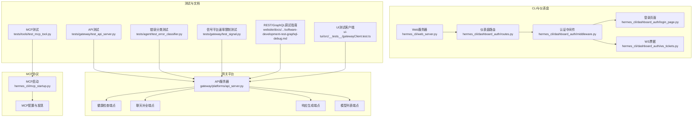
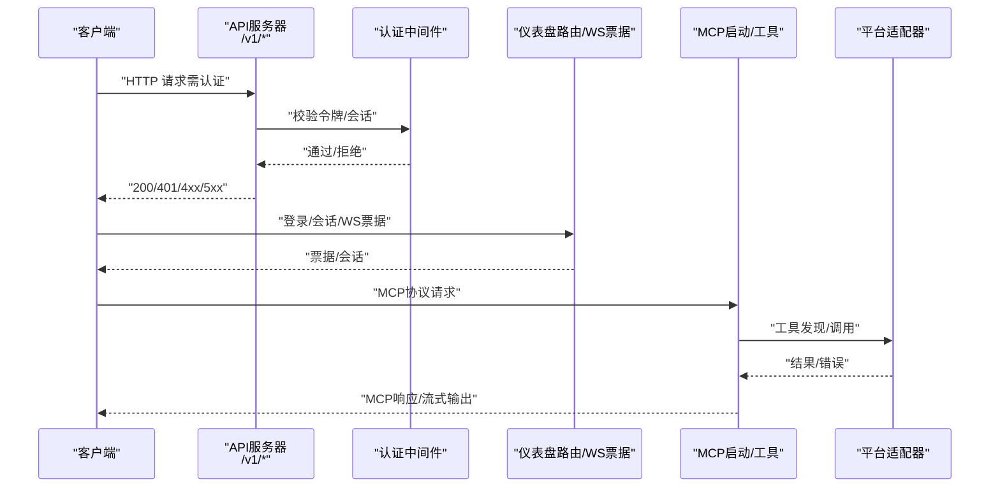
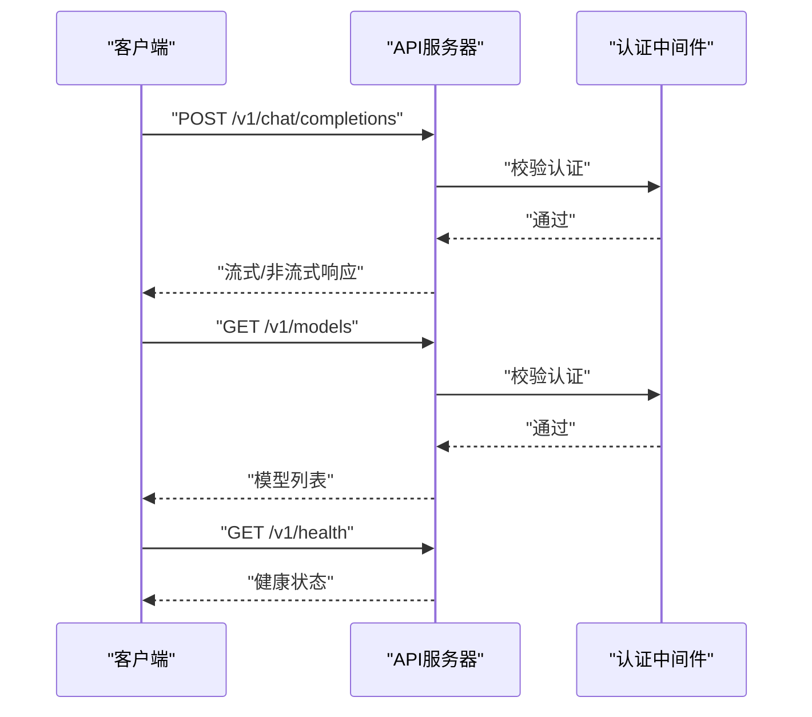
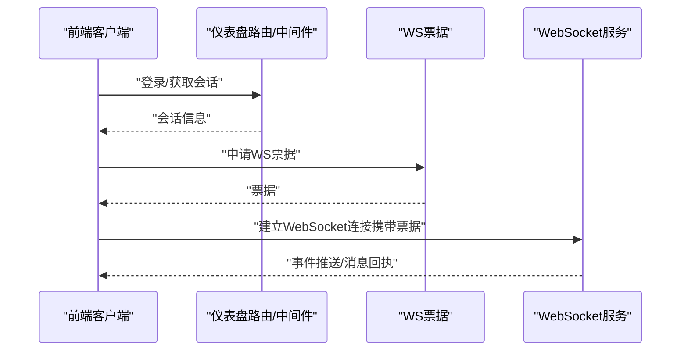
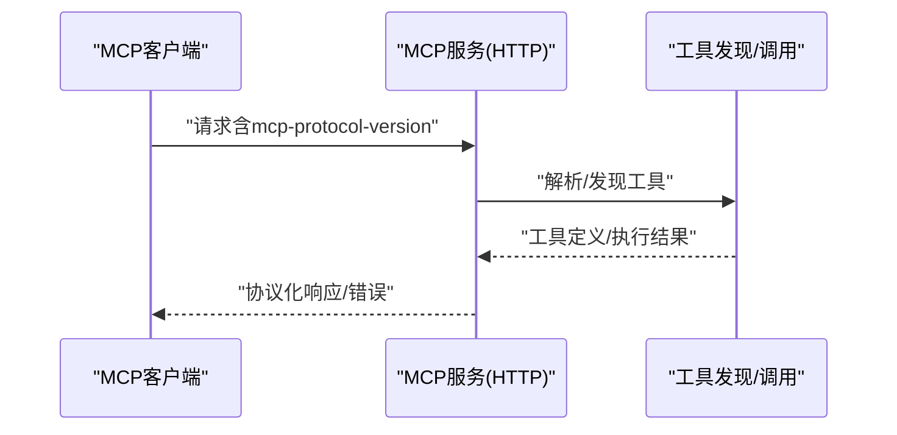
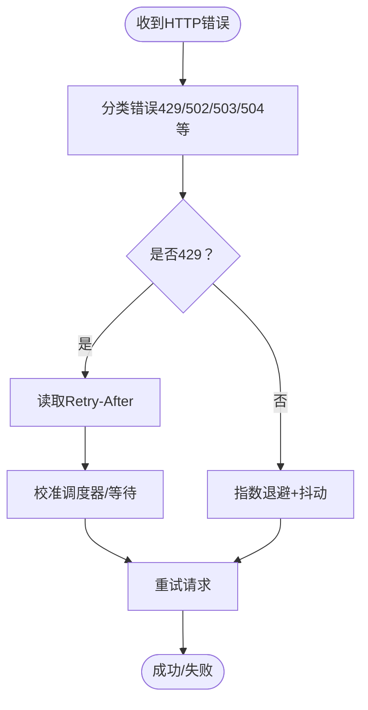
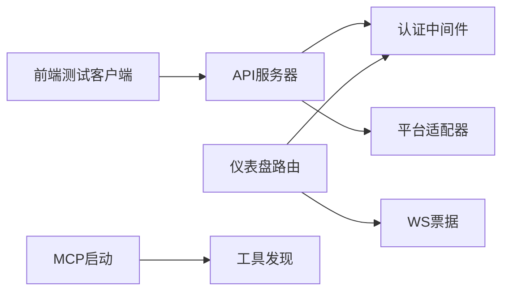

# API参考

<cite>
**本文档引用的文件**
- [gateway/platforms/api_server.py](file://gateway/platforms/api_server.py)
- [tests/gateway/test_api_server.py](file://tests/gateway/test_api_server.py)
- [hermes_cli/web_server.py](file://hermes_cli/web_server.py)
- [hermes_cli/dashboard_auth/routes.py](file://hermes_cli/dashboard_auth/routes.py)
- [hermes_cli/dashboard_auth/middleware.py](file://hermes_cli/dashboard_auth/middleware.py)
- [hermes_cli/dashboard_auth/login_page.py](file://hermes_cli/dashboard_auth/login_page.py)
- [hermes_cli/dashboard_auth/ws_tickets.py](file://hermes_cli/dashboard_auth/ws_tickets.py)
- [hermes_cli/mcp_startup.py](file://hermes_cli/mcp_startup.py)
- [tests/tools/test_mcp_tool.py](file://tests/tools/test_mcp_tool.py)
- [tests/tools/test_mcp_empty_error_message.py](file://tests/tools/test_mcp_empty_error_message.py)
- [tests/agent/test_error_classifier.py](file://tests/agent/test_error_classifier.py)
- [tests/gateway/test_signal.py](file://tests/gateway/test_signal.py)
- [website/docs/user-guide/skills/optional/software-development/software-development-rest-graphql-debug.md](file://website/docs/user-guide/skills/optional/software-development/software-development-rest-graphql-debug.md)
- [ui-tui/src/__tests__/gatewayClient.test.ts](file://ui-tui/src/__tests__/gatewayClient.test.ts)
</cite>

## 目录
1. [简介](#简介)
2. [项目结构](#项目结构)
3. [核心组件](#核心组件)
4. [架构总览](#架构总览)
5. [详细组件分析](#详细组件分析)
6. [依赖关系分析](#依赖关系分析)
7. [性能考虑](#性能考虑)
8. [故障排除指南](#故障排除指南)
9. [结论](#结论)
10. [附录](#附录)

## 简介
本API参考面向Hermes Agent的REST API、WebSocket接口以及MCP协议，覆盖HTTP方法、URL模式、请求/响应格式与认证方式；同时提供API版本控制、错误处理与速率限制策略，并包含实时通信协议的消息格式与事件类型说明。文档还提供SDK使用指南与集成最佳实践，帮助API使用者与第三方开发者快速、准确地实现对接。

## 项目结构
Hermes Agent的API能力主要由以下模块构成：
- 网关平台API服务器：提供REST API端点（如聊天补全、响应生成、模型列表等），支持认证与健康检查。
- CLI Web服务器：提供仪表盘相关的Web服务与路由。
- 仪表盘认证子系统：登录页面、中间件与WebSocket票据机制。
- MCP启动与工具：MCP协议服务发现与HTTP适配。
- 测试用例：验证认证、错误分类、速率限制与MCP协议头兼容性。
- 文档与示例：REST/GraphQL调试指南与前端测试客户端。

**图表来源**
- [gateway/platforms/api_server.py](file://gateway/platforms/api_server.py)
- [hermes_cli/web_server.py](file://hermes_cli/web_server.py)
- [hermes_cli/dashboard_auth/routes.py](file://hermes_cli/dashboard_auth/routes.py)
- [hermes_cli/dashboard_auth/middleware.py](file://hermes_cli/dashboard_auth/middleware.py)
- [hermes_cli/dashboard_auth/login_page.py](file://hermes_cli/dashboard_auth/login_page.py)
- [hermes_cli/dashboard_auth/ws_tickets.py](file://hermes_cli/dashboard_auth/ws_tickets.py)
- [hermes_cli/mcp_startup.py](file://hermes_cli/mcp_startup.py)
- [tests/gateway/test_api_server.py](file://tests/gateway/test_api_server.py)
- [tests/tools/test_mcp_tool.py](file://tests/tools/test_mcp_tool.py)
- [tests/agent/test_error_classifier.py](file://tests/agent/test_error_classifier.py)
- [tests/gateway/test_signal.py](file://tests/gateway/test_signal.py)
- [website/docs/user-guide/skills/optional/software-development/software-development-rest-graphql-debug.md](file://website/docs/user-guide/skills/optional/software-development/software-development-rest-graphql-debug.md)
- [ui-tui/src/__tests__/gatewayClient.test.ts](file://ui-tui/src/__tests__/gatewayClient.test.ts)

**章节来源**
- [gateway/platforms/api_server.py](file://gateway/platforms/api_server.py)
- [hermes_cli/web_server.py](file://hermes_cli/web_server.py)
- [hermes_cli/dashboard_auth/routes.py](file://hermes_cli/dashboard_auth/routes.py)
- [hermes_cli/dashboard_auth/middleware.py](file://hermes_cli/dashboard_auth/middleware.py)
- [hermes_cli/dashboard_auth/login_page.py](file://hermes_cli/dashboard_auth/login_page.py)
- [hermes_cli/dashboard_auth/ws_tickets.py](file://hermes_cli/dashboard_auth/ws_tickets.py)
- [hermes_cli/mcp_startup.py](file://hermes_cli/mcp_startup.py)
- [tests/gateway/test_api_server.py](file://tests/gateway/test_api_server.py)
- [tests/tools/test_mcp_tool.py](file://tests/tools/test_mcp_tool.py)
- [tests/agent/test_error_classifier.py](file://tests/agent/test_error_classifier.py)
- [tests/gateway/test_signal.py](file://tests/gateway/test_signal.py)
- [website/docs/user-guide/skills/optional/software-development/software-development-rest-graphql-debug.md](file://website/docs/user-guide/skills/optional/software-development/software-development-rest-graphql-debug.md)
- [ui-tui/src/__tests__/gatewayClient.test.ts](file://ui-tui/src/__tests__/gatewayClient.test.ts)

## 核心组件
- REST API服务器：提供/v1/chat/completions、/v1/responses、/v1/models等端点，要求认证后访问，健康检查无需认证。
- CLI Web服务器与仪表盘认证：提供登录、会话管理与WebSocket票据机制，支持仪表盘交互。
- MCP协议：支持协议版本协商与HTTP适配，用于工具发现与调用。
- 错误分类与速率限制：对429/5xx等进行分类与退避重试策略，部分平台支持Retry-After。
- WebSocket客户端：前端测试用例展示了与网关的WebSocket通信行为。

**章节来源**
- [tests/gateway/test_api_server.py](file://tests/gateway/test_api_server.py)
- [hermes_cli/web_server.py](file://hermes_cli/web_server.py)
- [hermes_cli/dashboard_auth/routes.py](file://hermes_cli/dashboard_auth/routes.py)
- [hermes_cli/dashboard_auth/middleware.py](file://hermes_cli/dashboard_auth/middleware.py)
- [hermes_cli/dashboard_auth/login_page.py](file://hermes_cli/dashboard_auth/login_page.py)
- [hermes_cli/dashboard_auth/ws_tickets.py](file://hermes_cli/dashboard_auth/ws_tickets.py)
- [hermes_cli/mcp_startup.py](file://hermes_cli/mcp_startup.py)
- [tests/tools/test_mcp_tool.py](file://tests/tools/test_mcp_tool.py)
- [tests/agent/test_error_classifier.py](file://tests/agent/test_error_classifier.py)
- [tests/gateway/test_signal.py](file://tests/gateway/test_signal.py)
- [ui-tui/src/__tests__/gatewayClient.test.ts](file://ui-tui/src/__tests__/gatewayClient.test.ts)

## 架构总览
下图展示从客户端到API服务器、认证中间件、MCP工具链与平台适配器的整体交互流程。

**图表来源**
- [gateway/platforms/api_server.py](file://gateway/platforms/api_server.py)
- [hermes_cli/dashboard_auth/middleware.py](file://hermes_cli/dashboard_auth/middleware.py)
- [hermes_cli/dashboard_auth/ws_tickets.py](file://hermes_cli/dashboard_auth/ws_tickets.py)
- [hermes_cli/mcp_startup.py](file://hermes_cli/mcp_startup.py)

## 详细组件分析

### REST API端点
- 版本控制：所有端点以/v1前缀提供，体现明确的版本控制策略。
- 认证要求：/v1/chat/completions、/v1/responses、/v1/models需要认证；/v1/health无需认证。
- 健康检查：/v1/health返回服务可用状态。
- 聊天补全：POST /v1/chat/completions，请求体包含模型与消息数组，响应为流式或非流式文本。
- 响应生成：POST /v1/responses，请求体包含模型与输入文本，响应为生成内容。
- 模型列表：GET /v1/models，返回可用模型清单。

**图表来源**
- [tests/gateway/test_api_server.py](file://tests/gateway/test_api_server.py)
- [gateway/platforms/api_server.py](file://gateway/platforms/api_server.py)

**章节来源**
- [tests/gateway/test_api_server.py](file://tests/gateway/test_api_server.py)
- [gateway/platforms/api_server.py](file://gateway/platforms/api_server.py)

### WebSocket接口
- 登录与会话：通过仪表盘认证路由与中间件建立会话。
- WS票据：使用ws_tickets模块生成临时票据，用于WebSocket连接鉴权。
- 客户端行为：前端测试用例展示了WebSocket连接、事件监听与消息发送的典型流程。

**图表来源**
- [hermes_cli/dashboard_auth/routes.py](file://hermes_cli/dashboard_auth/routes.py)
- [hermes_cli/dashboard_auth/middleware.py](file://hermes_cli/dashboard_auth/middleware.py)
- [hermes_cli/dashboard_auth/ws_tickets.py](file://hermes_cli/dashboard_auth/ws_tickets.py)
- [ui-tui/src/__tests__/gatewayClient.test.ts](file://ui-tui/src/__tests__/gatewayClient.test.ts)

**章节来源**
- [hermes_cli/dashboard_auth/routes.py](file://hermes_cli/dashboard_auth/routes.py)
- [hermes_cli/dashboard_auth/middleware.py](file://hermes_cli/dashboard_auth/middleware.py)
- [hermes_cli/dashboard_auth/ws_tickets.py](file://hermes_cli/dashboard_auth/ws_tickets.py)
- [ui-tui/src/__tests__/gatewayClient.test.ts](file://ui-tui/src/__tests__/gatewayClient.test.ts)

### MCP协议规范
- 协议版本：支持mcp-protocol-version头部，允许自定义版本或使用最新版本。
- HTTP适配：MCP服务可通过HTTP暴露，配合工具发现与调用。
- 错误处理：对空消息等异常进行清理与保留异常类型名，确保可观测性。

**图表来源**
- [tests/tools/test_mcp_tool.py](file://tests/tools/test_mcp_tool.py)
- [tests/tools/test_mcp_empty_error_message.py](file://tests/tools/test_mcp_empty_error_message.py)
- [hermes_cli/mcp_startup.py](file://hermes_cli/mcp_startup.py)

**章节来源**
- [tests/tools/test_mcp_tool.py](file://tests/tools/test_mcp_tool.py)
- [tests/tools/test_mcp_empty_error_message.py](file://tests/tools/test_mcp_empty_error_message.py)
- [hermes_cli/mcp_startup.py](file://hermes_cli/mcp_startup.py)

### 认证与安全
- API端点：/v1/chat/completions、/v1/responses、/v1/models均需认证；/v1/health无需认证。
- 仪表盘认证：登录页面、中间件与会话管理确保访问安全。
- 头部与票据：MCP协议支持mcp-protocol-version头部，WS连接使用票据进行鉴权。

**章节来源**
- [tests/gateway/test_api_server.py](file://tests/gateway/test_api_server.py)
- [hermes_cli/dashboard_auth/login_page.py](file://hermes_cli/dashboard_auth/login_page.py)
- [hermes_cli/dashboard_auth/middleware.py](file://hermes_cli/dashboard_auth/middleware.py)
- [hermes_cli/dashboard_auth/ws_tickets.py](file://hermes_cli/dashboard_auth/ws_tickets.py)
- [tests/tools/test_mcp_tool.py](file://tests/tools/test_mcp_tool.py)

### 错误处理与速率限制
- 错误分类：对429、502、503、504等进行分类，支持循环因果链保护与特定提供商的特殊处理。
- 速率限制：部分平台（如Signal）支持Retry-After，调度器可据此调整放行速率；默认速率可在无Retry-After时使用。
- 重试策略：建议指数退避+抖动，结合日志记录与最大重试次数。

**图表来源**
- [tests/agent/test_error_classifier.py](file://tests/agent/test_error_classifier.py)
- [tests/gateway/test_signal.py](file://tests/gateway/test_signal.py)
- [website/docs/user-guide/skills/optional/software-development/software-development-rest-graphql-debug.md](file://website/docs/user-guide/skills/optional/software-development/software-development-rest-graphql-debug.md)

**章节来源**
- [tests/agent/test_error_classifier.py](file://tests/agent/test_error_classifier.py)
- [tests/gateway/test_signal.py](file://tests/gateway/test_signal.py)
- [website/docs/user-guide/skills/optional/software-development/software-development-rest-graphql-debug.md](file://website/docs/user-guide/skills/optional/software-development/software-development-rest-graphql-debug.md)

## 依赖关系分析
- 组件耦合：API服务器依赖认证中间件；仪表盘路由依赖中间件与WS票据；MCP启动依赖配置与工具发现。
- 外部依赖：平台适配器（如Signal）提供速率限制与重试逻辑；前端测试客户端模拟WebSocket行为。
- 可能的循环依赖：当前结构以单向依赖为主，未见明显循环。

**图表来源**
- [gateway/platforms/api_server.py](file://gateway/platforms/api_server.py)
- [hermes_cli/dashboard_auth/middleware.py](file://hermes_cli/dashboard_auth/middleware.py)
- [hermes_cli/dashboard_auth/ws_tickets.py](file://hermes_cli/dashboard_auth/ws_tickets.py)
- [hermes_cli/mcp_startup.py](file://hermes_cli/mcp_startup.py)
- [ui-tui/src/__tests__/gatewayClient.test.ts](file://ui-tui/src/__tests__/gatewayClient.test.ts)

**章节来源**
- [gateway/platforms/api_server.py](file://gateway/platforms/api_server.py)
- [hermes_cli/dashboard_auth/middleware.py](file://hermes_cli/dashboard_auth/middleware.py)
- [hermes_cli/dashboard_auth/ws_tickets.py](file://hermes_cli/dashboard_auth/ws_tickets.py)
- [hermes_cli/mcp_startup.py](file://hermes_cli/mcp_startup.py)
- [ui-tui/src/__tests__/gatewayClient.test.ts](file://ui-tui/src/__tests__/gatewayClient.test.ts)

## 性能考虑
- 速率限制：优先遵循服务端的Retry-After；若不可用，采用默认速率并逐步校准。
- 重试策略：指数退避+抖动，避免雪崩效应；记录每次重试以便诊断。
- 流式响应：聊天补全与响应生成支持流式输出，降低首字节延迟。
- 平台差异：不同平台（如Signal）可能有不同的速率限制策略，需按平台适配。

## 故障排除指南
- 401 未认证：确认令牌/会话有效，检查/v1端点是否需要认证。
- 403 无权限：检查令牌作用域与资源授权。
- 404 资源不存在：核对URL路径、版本前缀与资源ID。
- 409 冲突：检查并发修改或重复创建。
- 422 数据无效：检查请求体字段类型、必填项与枚举值。
- 429 速率限制：读取Retry-After并进行指数退避；若无Retry-After，使用默认速率。
- 5xx 服务器错误：捕获关联ID并上报提供商；进行指数退避与告警。

**章节来源**
- [website/docs/user-guide/skills/optional/software-development/software-development-rest-graphql-debug.md](file://website/docs/user-guide/skills/optional/software-development/software-development-rest-graphql-debug.md)
- [tests/agent/test_error_classifier.py](file://tests/agent/test_error_classifier.py)
- [tests/gateway/test_signal.py](file://tests/gateway/test_signal.py)

## 结论
本文档提供了Hermes Agent在REST API、WebSocket与MCP协议方面的完整技术参考，包括端点定义、认证方式、错误处理与速率限制策略。结合测试用例与前端示例，开发者可以快速实现稳定、可扩展的集成方案。

## 附录
- SDK使用指南与集成最佳实践：参见REST/GraphQL调试指南中的重试与错误处理建议。
- 代码示例路径：请参考各章节“章节来源”中列出的具体文件与行号，定位实现细节与测试用例。