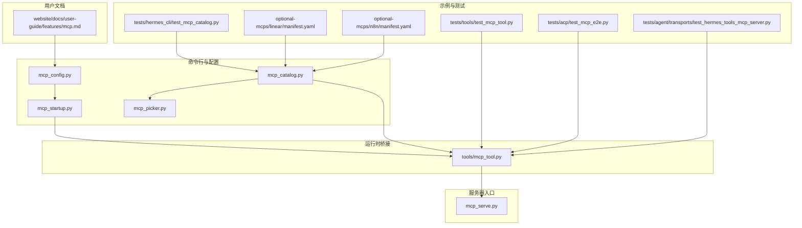
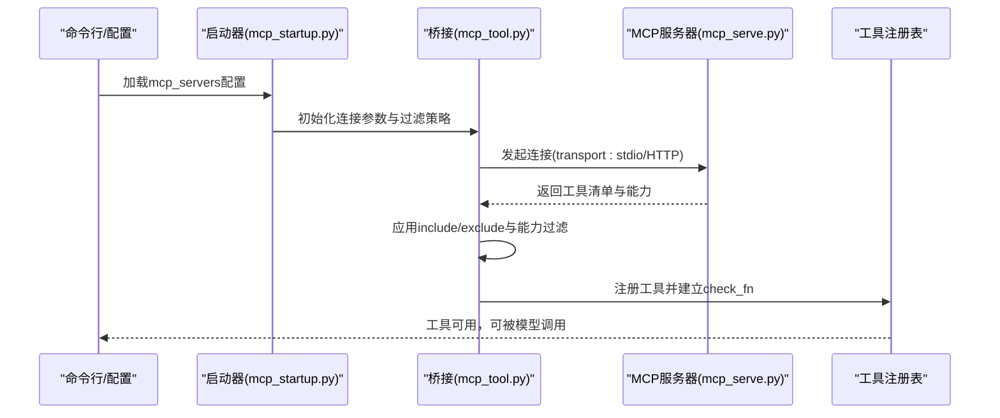
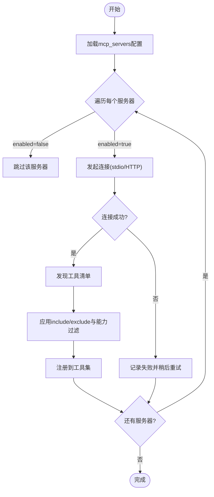
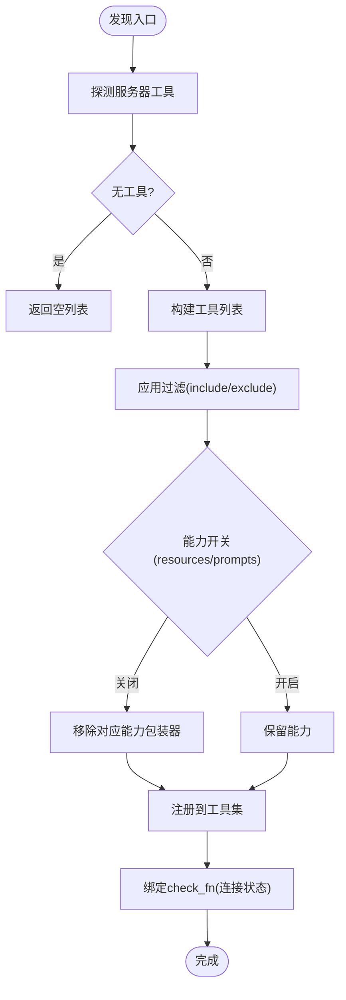
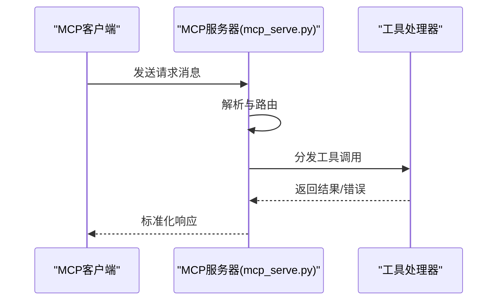
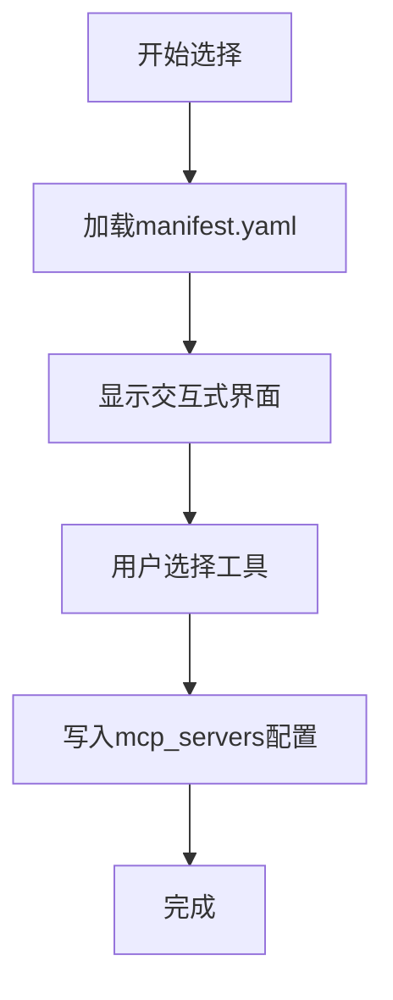
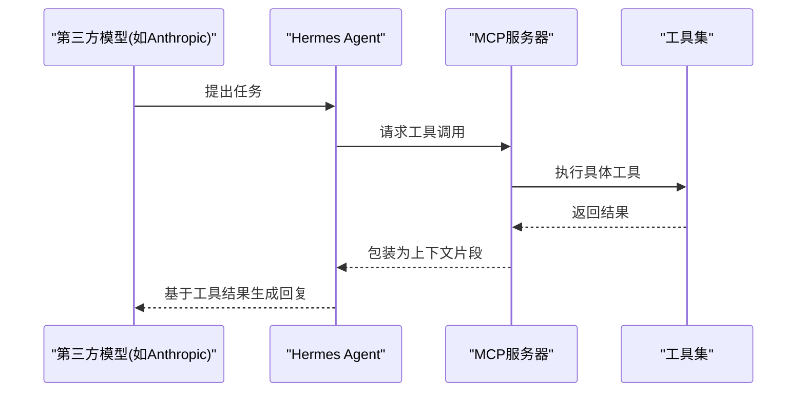
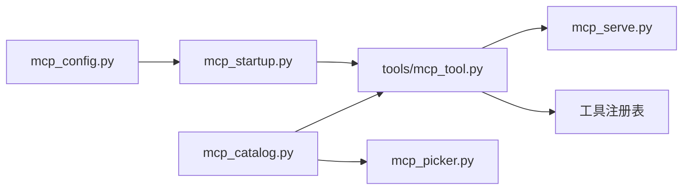

# MCP协议

<cite>
**本文引用的文件**
- [mcp_serve.py](file://mcp_serve.py)
- [mcp_tool.py](file://tools/mcp_tool.py)
- [mcp_config.py](file://hermes_cli/mcp_config.py)
- [mcp_startup.py](file://hermes_cli/mcp_startup.py)
- [mcp_catalog.py](file://hermes_cli/mcp_catalog.py)
- [mcp_picker.py](file://hermes_cli/mcp_picker.py)
- [test_mcp_tool.py](file://tests/tools/test_mcp_tool.py)
- [test_mcp_catalog.py](file://tests/hermes_cli/test_mcp_catalog.py)
- [test_mcp_e2e.py](file://tests/acp/test_mcp_e2e.py)
- [test_hermes_tools_mcp_server.py](file://tests/agent/transports/test_hermes_tools_mcp_server.py)
- [manifest.yaml（linear）](file://optional-mcps/linear/manifest.yaml)
- [manifest.yaml（n8n）](file://optional-mcps/n8n/manifest.yaml)
- [mcp.md（用户指南）](file://website/docs/user-guide/features/mcp.md)
</cite>

## 目录
1. [简介](#简介)
2. [项目结构](#项目结构)
3. [核心组件](#核心组件)
4. [架构总览](#架构总览)
5. [详细组件分析](#详细组件分析)
6. [依赖关系分析](#依赖关系分析)
7. [性能考量](#性能考量)
8. [故障排查指南](#故障排查指南)
9. [结论](#结论)
10. [附录](#附录)

## 简介
本文件面向Hermes Agent中的MCP（Model Context Protocol）实现，系统性阐述协议规范、服务器端实现与客户端使用方法。内容覆盖：
- 协议版本与消息格式约定
- MCP服务器的启动配置、工具发现与注册机制
- 认证方式与连接管理策略
- 客户端集成示例与与第三方模型/工具交互流程
- 协议特定的错误处理、性能优化与调试技巧
- 面向开发者的完整实现指南与最佳实践

## 项目结构
围绕MCP的关键模块分布于以下位置：
- 命令行与配置：hermes_cli/mcp_config.py、hermes_cli/mcp_startup.py、hermes_cli/mcp_catalog.py、hermes_cli/mcp_picker.py
- 运行时工具桥接：tools/mcp_tool.py
- 服务器入口：mcp_serve.py
- 示例与测试：optional-mcps/*、tests/tools/test_mcp_tool.py、tests/hermes_cli/test_mcp_catalog.py、tests/acp/test_mcp_e2e.py、tests/agent/transports/test_hermes_tools_mcp_server.py
- 用户文档：website/docs/user-guide/features/mcp.md

**图表来源**
- [mcp_config.py](file://hermes_cli/mcp_config.py)
- [mcp_startup.py](file://hermes_cli/mcp_startup.py)
- [mcp_catalog.py](file://hermes_cli/mcp_catalog.py)
- [mcp_picker.py](file://hermes_cli/mcp_picker.py)
- [mcp_tool.py](file://tools/mcp_tool.py)
- [mcp_serve.py](file://mcp_serve.py)
- [test_mcp_tool.py](file://tests/tools/test_mcp_tool.py)
- [test_mcp_catalog.py](file://tests/hermes_cli/test_mcp_catalog.py)
- [test_mcp_e2e.py](file://tests/acp/test_mcp_e2e.py)
- [test_hermes_tools_mcp_server.py](file://tests/agent/transports/test_hermes_tools_mcp_server.py)
- [manifest.yaml（linear）](file://optional-mcps/linear/manifest.yaml)
- [manifest.yaml（n8n）](file://optional-mcps/n8n/manifest.yaml)
- [mcp.md（用户指南）](file://website/docs/user-guide/features/mcp.md)

**章节来源**
- [mcp_config.py](file://hermes_cli/mcp_config.py)
- [mcp_startup.py](file://hermes_cli/mcp_startup.py)
- [mcp_catalog.py](file://hermes_cli/mcp_catalog.py)
- [mcp_picker.py](file://hermes_cli/mcp_picker.py)
- [mcp_tool.py](file://tools/mcp_tool.py)
- [mcp_serve.py](file://mcp_serve.py)
- [test_mcp_tool.py](file://tests/tools/test_mcp_tool.py)
- [test_mcp_catalog.py](file://tests/hermes_cli/test_mcp_catalog.py)
- [test_mcp_e2e.py](file://tests/acp/test_mcp_e2e.py)
- [test_hermes_tools_mcp_server.py](file://tests/agent/transports/test_hermes_tools_mcp_server.py)
- [manifest.yaml（linear）](file://optional-mcps/linear/manifest.yaml)
- [manifest.yaml（n8n）](file://optional-mcps/n8n/manifest.yaml)
- [mcp.md（用户指南）](file://website/docs/user-guide/features/mcp.md)

## 核心组件
- MCP服务器配置与启动
  - 命令行配置加载与校验：mcp_config.py负责解析用户配置，支持stdio与HTTP两种传输模式，并对环境变量与工具过滤策略进行安全控制。
  - 启动流程：mcp_startup.py协调配置加载与服务器实例化，确保在可用时自动连接并注册工具。
- 工具发现与注册
  - 运行时桥接：mcp_tool.py实现工具发现、连接管理、工具过滤与注册到工具集，支持按服务器粒度的include/exclude策略与资源/提示能力开关。
  - 交互式选择：mcp_catalog.py与mcp_picker.py提供从清单或交互式界面中选择工具的能力；清单来自optional-mcps目录下的manifest.yaml。
- 服务器入口
  - mcp_serve.py作为标准输入输出（stdio）或HTTP的MCP服务器入口，承载协议消息循环与工具调用处理。

**章节来源**
- [mcp_config.py](file://hermes_cli/mcp_config.py)
- [mcp_startup.py](file://hermes_cli/mcp_startup.py)
- [mcp_catalog.py](file://hermes_cli/mcp_catalog.py)
- [mcp_picker.py](file://hermes_cli/mcp_picker.py)
- [mcp_tool.py](file://tools/mcp_tool.py)
- [mcp_serve.py](file://mcp_serve.py)

## 架构总览
下图展示了从配置到工具注册的端到端流程，以及与第三方MCP服务器的交互：

**图表来源**
- [mcp_config.py](file://hermes_cli/mcp_config.py)
- [mcp_startup.py](file://hermes_cli/mcp_startup.py)
- [mcp_tool.py](file://tools/mcp_tool.py)
- [mcp_serve.py](file://mcp_serve.py)

## 详细组件分析

### 组件A：MCP服务器配置与启动
- 配置项要点
  - 传输类型：stdio（command/args/env）或HTTP（url/headers）
  - 超时控制：connect_timeout与timeout
  - 可用性：enabled=false时跳过该服务器
  - 并发：supports_parallel_tool_calls允许并发工具调用
  - 工具过滤：tools.include/exclude、tools.resources、tools.prompts等
- 启动流程
  - 读取配置后，按服务器逐一尝试连接；失败的服务器会被记录并在后续重试策略中处理。
  - 已连接服务器会拉取工具清单并进行过滤，最终注册到工具集。

**图表来源**
- [mcp_config.py](file://hermes_cli/mcp_config.py)
- [mcp_startup.py](file://hermes_cli/mcp_startup.py)
- [mcp_tool.py](file://tools/mcp_tool.py)

**章节来源**
- [mcp_config.py](file://hermes_cli/mcp_config.py)
- [mcp_startup.py](file://hermes_cli/mcp_startup.py)
- [mcp_tool.py](file://tools/mcp_tool.py)
- [mcp.md（用户指南）](file://website/docs/user-guide/features/mcp.md)

### 组件B：工具发现与注册机制
- 发现流程
  - 按服务器连接后，拉取工具清单；若不可用则返回空列表并触发降级。
  - 对工具名进行去重与冲突保护，允许同一命名空间内MCP工具覆盖。
- 过滤策略
  - include优先于exclude；当include为空时，exclude生效。
  - resources与prompts等能力开关可禁用资源/提示包装器，降低暴露面。
- 注册与检查
  - 工具注册后附带check_fn，用于检测服务器连通性；断开后check_fn返回False。

**图表来源**
- [mcp_tool.py](file://tools/mcp_tool.py)
- [test_mcp_tool.py](file://tests/tools/test_mcp_tool.py)

**章节来源**
- [mcp_tool.py](file://tools/mcp_tool.py)
- [test_mcp_tool.py](file://tests/tools/test_mcp_tool.py)

### 组件C：MCP服务器入口与消息循环
- 入口职责
  - 处理stdio或HTTP传输，维持与客户端的长连接。
  - 解析请求消息，分发至相应工具执行，并返回标准化响应。
- 错误处理
  - 对异常工具调用进行捕获与错误封装，避免中断消息循环。
  - 支持超时控制与重试策略，提升鲁棒性。

**图表来源**
- [mcp_serve.py](file://mcp_serve.py)

**章节来源**
- [mcp_serve.py](file://mcp_serve.py)

### 组件D：清单与交互式工具选择
- 清单来源
  - optional-mcps目录下的manifest.yaml定义了预置MCP服务器的清单，便于快速添加。
- 交互式选择
  - mcp_catalog.py与mcp_picker.py支持从清单中选择工具，或通过交互式界面进行筛选，最终写入配置。

**图表来源**
- [mcp_catalog.py](file://hermes_cli/mcp_catalog.py)
- [mcp_picker.py](file://hermes_cli/mcp_picker.py)
- [manifest.yaml（linear）](file://optional-mcps/linear/manifest.yaml)
- [manifest.yaml（n8n）](file://optional-mcps/n8n/manifest.yaml)

**章节来源**
- [mcp_catalog.py](file://hermes_cli/mcp_catalog.py)
- [mcp_picker.py](file://hermes_cli/mcp_picker.py)
- [manifest.yaml（linear）](file://optional-mcps/linear/manifest.yaml)
- [manifest.yaml（n8n）](file://optional-mcps/n8n/manifest.yaml)
- [test_mcp_catalog.py](file://tests/hermes_cli/test_mcp_catalog.py)

### 组件E：与第三方模型/工具的集成示例
- 与Anthropic等适配器的协作
  - 测试覆盖表明MCP工具可与第三方模型适配器协同工作，包括前缀裁剪、OAuth等场景。
- 端到端验证
  - e2e测试确保MCP服务器与Agent之间的交互稳定可靠。

**图表来源**
- [test_mcp_e2e.py](file://tests/acp/test_mcp_e2e.py)
- [test_hermes_tools_mcp_server.py](file://tests/agent/transports/test_hermes_tools_mcp_server.py)

**章节来源**
- [test_mcp_e2e.py](file://tests/acp/test_mcp_e2e.py)
- [test_hermes_tools_mcp_server.py](file://tests/agent/transports/test_hermes_tools_mcp_server.py)

## 依赖关系分析
- 组件耦合
  - mcp_config.py与mcp_startup.py紧密耦合，前者负责配置解析，后者负责启动序列。
  - mcp_tool.py依赖mcp_config的配置与mcp_serve.py提供的服务器能力。
  - mcp_catalog.py依赖optional-mcps清单与mcp_picker的交互逻辑。
- 外部依赖
  - mcp.types兼容层用于处理协议版本差异，保证在不同环境中稳定运行。
- 循环依赖
  - 当前设计未见明显循环依赖；各模块职责清晰，接口边界明确。

**图表来源**
- [mcp_config.py](file://hermes_cli/mcp_config.py)
- [mcp_startup.py](file://hermes_cli/mcp_startup.py)
- [mcp_tool.py](file://tools/mcp_tool.py)
- [mcp_serve.py](file://mcp_serve.py)
- [mcp_catalog.py](file://hermes_cli/mcp_catalog.py)
- [mcp_picker.py](file://hermes_cli/mcp_picker.py)

**章节来源**
- [mcp_config.py](file://hermes_cli/mcp_config.py)
- [mcp_startup.py](file://hermes_cli/mcp_startup.py)
- [mcp_tool.py](file://tools/mcp_tool.py)
- [mcp_serve.py](file://mcp_serve.py)
- [mcp_catalog.py](file://hermes_cli/mcp_catalog.py)
- [mcp_picker.py](file://hermes_cli/mcp_picker.py)

## 性能考量
- 并发工具调用
  - supports_parallel_tool_calls为true时，允许同一服务器的工具并发执行，提高吞吐量。
- 超时与重试
  - connect_timeout与timeout合理设置，避免阻塞主流程；失败服务器采用渐进式重试策略。
- 工具过滤
  - 通过include/exclude与能力开关减少不必要的工具暴露，降低上下文膨胀与调用开销。
- 环境变量与安全基线
  - 仅传递显式配置的env与安全基线，减少敏感信息泄露风险，间接提升整体安全性与稳定性。

**章节来源**
- [mcp_tool.py](file://tools/mcp_tool.py)
- [mcp.md（用户指南）](file://website/docs/user-guide/features/mcp.md)

## 故障排查指南
- 常见问题
  - 服务器不可用：检查enabled、connect_timeout与网络连通性；查看失败记录与重试日志。
  - 工具未注册：确认include/exclude策略是否过于严格；检查resources/prompts能力开关。
  - 冲突与覆盖：同一命名空间内的MCP工具可覆盖，注意工具名冲突警告。
- 调试技巧
  - 使用交互式工具选择与清单校验，确保配置正确。
  - 关注工具注册表中的check_fn状态，判断服务器连通性。
  - 利用e2e测试样例复现问题，定位协议消息流转环节。

**章节来源**
- [test_mcp_tool.py](file://tests/tools/test_mcp_tool.py)
- [test_mcp_catalog.py](file://tests/hermes_cli/test_mcp_catalog.py)
- [test_mcp_e2e.py](file://tests/acp/test_mcp_e2e.py)

## 结论
Hermes Agent的MCP实现以清晰的模块划分与严格的配置/安全控制为核心，提供了从配置加载、服务器连接、工具发现与注册到与第三方模型/工具交互的完整链路。通过合理的超时与重试、工具过滤与能力开关，既保障了易用性也兼顾了安全性与性能。建议在生产环境中结合清单与交互式选择，配合严格的工具白名单与能力开关，持续监控check_fn状态，确保MCP工具链稳定高效运行。

## 附录
- 协议版本与消息格式
  - 通过mcp.types兼容层处理协议版本差异，确保跨环境一致性。
- 认证与连接管理
  - HTTP传输支持headers；stdio传输支持env；统一的安全基线与显式配置相结合。
- 开发者最佳实践
  - 使用清单与交互式选择快速搭建；严格控制工具暴露面；启用并发工具调用时注意资源竞争；定期验证工具连通性与check_fn状态。

**章节来源**
- [mcp_tool.py](file://tools/mcp_tool.py)
- [mcp.md（用户指南）](file://website/docs/user-guide/features/mcp.md)