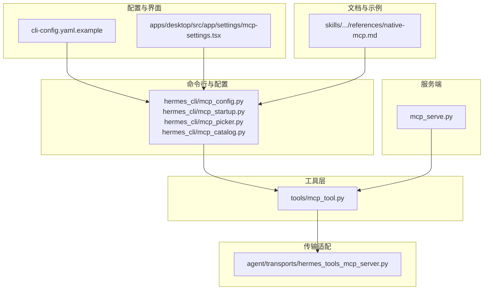
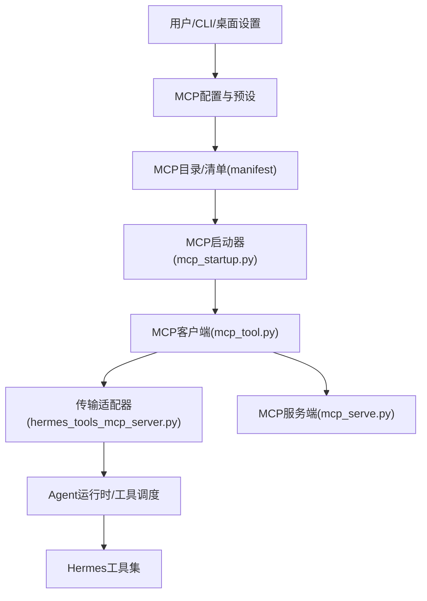
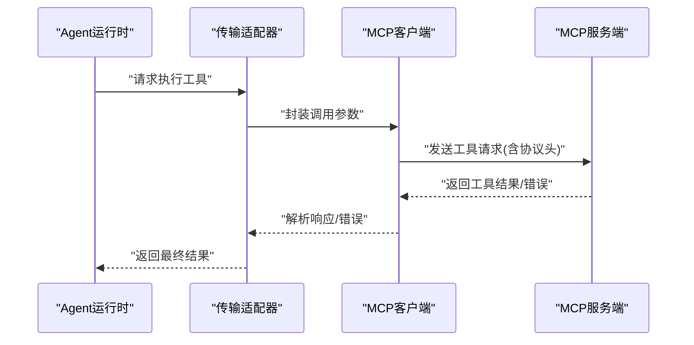
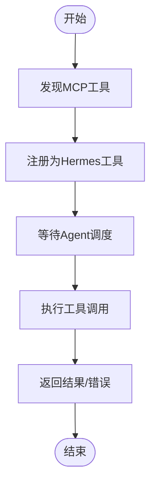
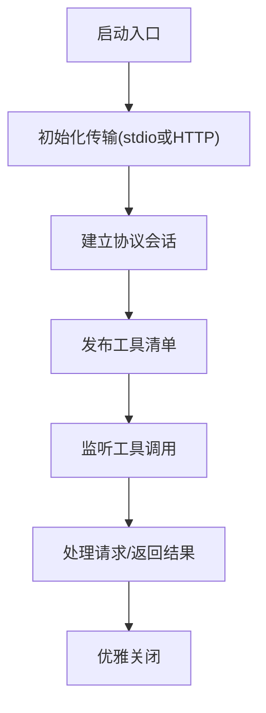
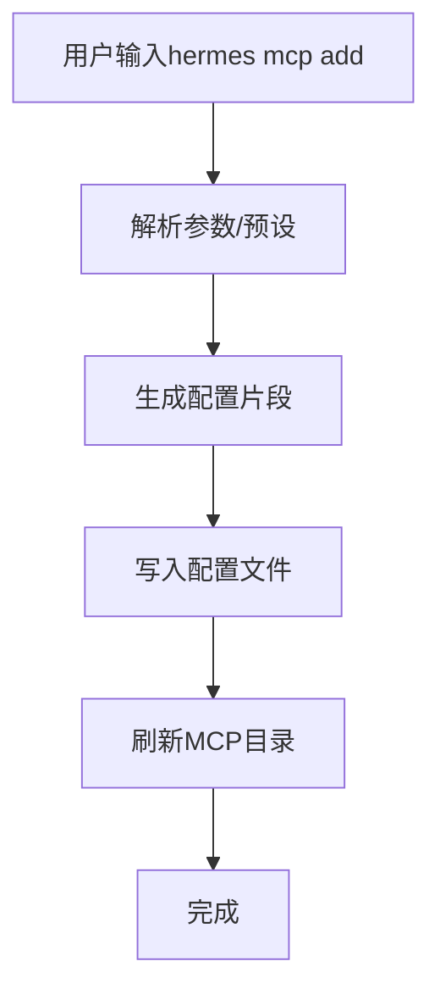
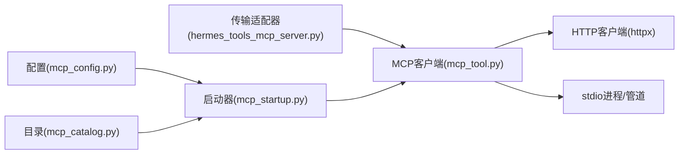

# MCP协议概述

<cite>
**本文引用的文件**
- [mcp_serve.py](file://mcp_serve.py)
- [mcp_tool.py](file://tools/mcp_tool.py)
- [hermes_tools_mcp_server.py](file://agent/transports/hermes_tools_mcp_server.py)
- [mcp_config.py](file://hermes_cli/mcp_config.py)
- [mcp_startup.py](file://hermes_cli/mcp_startup.py)
- [mcp_picker.py](file://hermes_cli/mcp_picker.py)
- [mcp_catalog.py](file://hermes_cli/mcp_catalog.py)
- [mcp_settings.tsx](file://apps/desktop/src/app/settings/mcp-settings.tsx)
- [native-mcp.md](file://skills/autonomous-ai-agents/hermes-agent/references/native-mcp.md)
- [cli-config.yaml.example](file://cli-config.yaml.example)
- [README.md](file://README.md)
- [test_mcp_tool.py](file://tests/tools/test_mcp_tool.py)
- [test_mcp_client_cert.py](file://tests/tools/test_mcp_client_cert.py)
- [manifest.yaml](file://optional-mcps/linear/manifest.yaml)
- [manifest.yaml](file://optional-mcps/n8n/manifest.yaml)
</cite>

## 目录
1. [引言](#引言)
2. [项目结构](#项目结构)
3. [核心组件](#核心组件)
4. [架构总览](#架构总览)
5. [详细组件分析](#详细组件分析)
6. [依赖关系分析](#依赖关系分析)
7. [性能考量](#性能考量)
8. [故障排查指南](#故障排查指南)
9. [结论](#结论)
10. [附录](#附录)

## 引言
本文件面向Hermes Agent中的MCP（Model Context Protocol）协议进行全面介绍，旨在帮助开发者理解MCP在Hermes中的定位、设计理念、核心能力与集成方式。MCP协议允许模型通过标准化的工具接口与外部上下文环境进行交互，从而扩展AI助手的能力边界。在Hermes中，MCP既作为可选增强能力存在，也与内置工具体系深度集成，形成“模型+工具+上下文”的统一工作流。

- 协议目标：以最小侵入的方式，让模型能够发现、调用并管理来自不同来源的工具，同时保持安全、可观测与可配置。
- 在Hermes中的作用：提供标准的工具发现与调用机制，支持stdio与HTTP两种传输方式；通过CLI与桌面设置界面进行配置与管理；与Agent运行时无缝衔接，参与对话循环与技能执行。

## 项目结构
围绕MCP的关键文件分布于以下模块：
- 命令行与配置：hermes_cli/mcp_* 提供MCP服务器的添加、选择、启动与目录管理。
- 工具层：tools/mcp_tool.py 实现MCP客户端核心逻辑，包括工具发现、调用与错误处理。
- 传输适配：agent/transports/hermes_tools_mcp_server.py 将MCP工具桥接到Hermes工具系统。
- 启动与服务：mcp_serve.py 提供MCP服务端入口与生命周期管理。
- 配置示例：cli-config.yaml.example 展示MCP服务器配置项与常用键。
- 桌面设置：apps/desktop/src/app/settings/mcp-settings.tsx 提供图形化配置界面。
- 文档与示例：skills/.../references/native-mcp.md 提供使用示例与最佳实践参考。

**图表来源**
- [mcp_config.py](file://hermes_cli/mcp_config.py)
- [mcp_startup.py](file://hermes_cli/mcp_startup.py)
- [mcp_picker.py](file://hermes_cli/mcp_picker.py)
- [mcp_catalog.py](file://hermes_cli/mcp_catalog.py)
- [mcp_tool.py](file://tools/mcp_tool.py)
- [hermes_tools_mcp_server.py](file://agent/transports/hermes_tools_mcp_server.py)
- [mcp_serve.py](file://mcp_serve.py)
- [cli-config.yaml.example](file://cli-config.yaml.example)
- [mcp_settings.tsx](file://apps/desktop/src/app/settings/mcp-settings.tsx)
- [native-mcp.md](file://skills/autonomous-ai-agents/hermes-agent/references/native-mcp.md)

**章节来源**
- [mcp_config.py](file://hermes_cli/mcp_config.py)
- [mcp_startup.py](file://hermes_cli/mcp_startup.py)
- [mcp_picker.py](file://hermes_cli/mcp_picker.py)
- [mcp_catalog.py](file://hermes_cli/mcp_catalog.py)
- [mcp_tool.py](file://tools/mcp_tool.py)
- [hermes_tools_mcp_server.py](file://agent/transports/hermes_tools_mcp_server.py)
- [mcp_serve.py](file://mcp_serve.py)
- [cli-config.yaml.example](file://cli-config.yaml.example)
- [mcp_settings.tsx](file://apps/desktop/src/app/settings/mcp-settings.tsx)
- [native-mcp.md](file://skills/autonomous-ai-agents/hermes-agent/references/native-mcp.md)

## 核心组件
- MCP客户端（tools/mcp_tool.py）
  - 负责MCP服务器连接、工具发现、工具调用、错误处理与超时控制。
  - 支持stdio与HTTP两种传输方式，具备协议版本协商与头部传递能力。
  - 提供并发工具调用策略与证书配置支持。
- MCP传输适配器（agent/transports/hermes_tools_mcp_server.py）
  - 将MCP工具注册为Hermes工具集的一部分，参与Agent运行时的工具调度。
  - 管理日志输出到stderr，确保协议通信与应用日志分离。
- MCP服务端入口（mcp_serve.py）
  - 提供MCP服务端生命周期管理与启动流程。
- CLI与配置（hermes_cli/mcp_*）
  - 提供MCP服务器的添加、选择、启动与目录管理功能。
  - 支持预设模板（如Codex）与自定义配置。
- 配置示例与桌面设置
  - cli-config.yaml.example 展示常见键（command/args/env/url/headers/timeout/connect_timeout/enabled/supports_parallel_tool_calls/tools等）。
  - apps/desktop/src/app/settings/mcp-settings.tsx 提供图形化配置界面。

**章节来源**
- [mcp_tool.py](file://tools/mcp_tool.py)
- [hermes_tools_mcp_server.py](file://agent/transports/hermes_tools_mcp_server.py)
- [mcp_serve.py](file://mcp_serve.py)
- [mcp_config.py](file://hermes_cli/mcp_config.py)
- [mcp_startup.py](file://hermes_cli/mcp_startup.py)
- [mcp_picker.py](file://hermes_cli/mcp_picker.py)
- [mcp_catalog.py](file://hermes_cli/mcp_catalog.py)
- [cli-config.yaml.example](file://cli-config.yaml.example)
- [mcp_settings.tsx](file://apps/desktop/src/app/settings/mcp-settings.tsx)

## 架构总览
下图展示了MCP在Hermes中的整体架构：从CLI配置到工具发现与调用，再到Agent运行时的集成。

**图表来源**
- [mcp_config.py](file://hermes_cli/mcp_config.py)
- [mcp_startup.py](file://hermes_cli/mcp_startup.py)
- [mcp_tool.py](file://tools/mcp_tool.py)
- [hermes_tools_mcp_server.py](file://agent/transports/hermes_tools_mcp_server.py)
- [mcp_serve.py](file://mcp_serve.py)

## 详细组件分析

### 组件A：MCP客户端（工具层）
- 设计要点
  - 传输抽象：统一stdio与HTTP两种模式，自动选择可用实现。
  - 协议版本：支持mcp-protocol-version头部协商，默认使用最新版本。
  - 并发策略：通过supports_parallel_tool_calls决定是否并发执行工具。
  - 安全与证书：支持client_cert配置，向HTTP客户端传递证书参数。
  - 错误处理：对工具调用失败、超时、协议异常进行分类处理。
- 关键流程（工具调用序列）

**图表来源**
- [mcp_tool.py](file://tools/mcp_tool.py)
- [hermes_tools_mcp_server.py](file://agent/transports/hermes_tools_mcp_server.py)

**章节来源**
- [mcp_tool.py](file://tools/mcp_tool.py)
- [test_mcp_tool.py](file://tests/tools/test_mcp_tool.py)
- [test_mcp_client_cert.py](file://tests/tools/test_mcp_client_cert.py)

### 组件B：MCP传输适配器
- 设计要点
  - 将MCP工具注册为Hermes工具，参与工具集的统一调度。
  - 日志输出到stderr，避免与协议消息混淆。
  - 与Agent运行时的工具执行管线对接，支持工具结果的后处理与归档。
- 关键流程（工具注册与执行）

**图表来源**
- [hermes_tools_mcp_server.py](file://agent/transports/hermes_tools_mcp_server.py)

**章节来源**
- [hermes_tools_mcp_server.py](file://agent/transports/hermes_tools_mcp_server.py)

### 组件C：MCP服务端入口与生命周期
- 设计要点
  - 提供服务端启动、心跳、关闭等生命周期管理。
  - 与MCP客户端的握手与工具发现流程配合。
- 关键流程（服务端启动）

**图表来源**
- [mcp_serve.py](file://mcp_serve.py)

**章节来源**
- [mcp_serve.py](file://mcp_serve.py)

### 组件D：CLI与配置管理
- 设计要点
  - hermes mcp add 支持预设（preset）与自定义参数。
  - 支持工具过滤与策略配置（tools映射）。
  - 提供目录与清单（manifest）管理，便于第三方MCP服务器集成。
- 关键流程（添加MCP服务器）

**图表来源**
- [mcp_config.py](file://hermes_cli/mcp_config.py)
- [mcp_startup.py](file://hermes_cli/mcp_startup.py)
- [mcp_picker.py](file://hermes_cli/mcp_picker.py)
- [mcp_catalog.py](file://hermes_cli/mcp_catalog.py)

**章节来源**
- [mcp_config.py](file://hermes_cli/mcp_config.py)
- [mcp_startup.py](file://hermes_cli/mcp_startup.py)
- [mcp_picker.py](file://hermes_cli/mcp_picker.py)
- [mcp_catalog.py](file://hermes_cli/mcp_catalog.py)
- [cli-config.yaml.example](file://cli-config.yaml.example)
- [native-mcp.md](file://skills/autonomous-ai-agents/hermes-agent/references/native-mcp.md)

## 依赖关系分析
- 组件耦合
  - MCP客户端依赖传输层（stdio/HTTP），并与服务端进行协议交互。
  - 传输适配器依赖MCP客户端，负责将工具注册到Hermes工具系统。
  - CLI与配置模块为上层入口，驱动启动器与客户端初始化。
- 外部依赖
  - HTTP客户端（httpx）用于远程MCP服务器通信。
  - 文件系统与进程管理用于本地stdio服务器。
- 兼容性与版本
  - 协议版本通过mcp-protocol-version头部协商，默认使用最新版本。
  - 支持大小写不敏感的头部名称（mcp-protocol-version/MCP-Protocol-Version）。

**图表来源**
- [mcp_tool.py](file://tools/mcp_tool.py)
- [hermes_tools_mcp_server.py](file://agent/transports/hermes_tools_mcp_server.py)
- [mcp_startup.py](file://hermes_cli/mcp_startup.py)
- [mcp_config.py](file://hermes_cli/mcp_config.py)
- [mcp_catalog.py](file://hermes_cli/mcp_catalog.py)

**章节来源**
- [mcp_tool.py](file://tools/mcp_tool.py)
- [hermes_tools_mcp_server.py](file://agent/transports/hermes_tools_mcp_server.py)
- [mcp_startup.py](file://hermes_cli/mcp_startup.py)
- [mcp_config.py](file://hermes_cli/mcp_config.py)
- [mcp_catalog.py](file://hermes_cli/mcp_catalog.py)

## 性能考量
- 并发工具调用
  - 通过supports_parallel_tool_calls启用并发，提升吞吐量，但需注意资源竞争与限流。
- 连接与超时
  - connect_timeout与timeout分别控制初始连接与工具调用超时，合理设置避免阻塞。
- 传输选择
  - 本地stdio通常延迟更低；远程HTTP适合跨网络场景，需考虑网络抖动与重试。
- 协议版本
  - 使用最新协议版本可获得更好的性能与稳定性，同时关注兼容性变化。

## 故障排查指南
- 常见问题
  - 工具调用超时：检查connect_timeout/timeout配置与网络状况。
  - 协议版本不匹配：确认mcp-protocol-version头部与服务端支持范围。
  - 证书问题：验证client_cert配置与证书格式。
  - 并发冲突：调整supports_parallel_tool_calls与服务端限流策略。
- 排查步骤
  - 启用详细日志，区分协议消息与应用日志（stderr/stdout）。
  - 使用hermes mcp list/diagnose验证工具清单与连通性。
  - 对比本地与远程MCP服务器行为，排除环境差异。

**章节来源**
- [test_mcp_tool.py](file://tests/tools/test_mcp_tool.py)
- [test_mcp_client_cert.py](file://tests/tools/test_mcp_client_cert.py)
- [mcp_tool.py](file://tools/mcp_tool.py)

## 结论
MCP协议在Hermes中扮演着“模型与外部工具/服务”的桥梁角色。通过标准化的工具发现与调用机制，结合CLI与桌面配置界面，Hermes实现了灵活、可扩展且安全的工具生态。开发者可通过stdio或HTTP接入MCP服务器，利用并发策略与协议版本协商优化性能，并借助传输适配器无缝融入Agent运行时。

## 附录

### 协议版本与兼容性
- 协议版本：通过mcp-protocol-version头部协商，默认使用最新版本。
- 兼容性：支持大小写不敏感的头部名称（mcp-protocol-version/MCP-Protocol-Version）。

**章节来源**
- [test_mcp_tool.py](file://tests/tools/test_mcp_tool.py)

### 支持的工具类型与使用示例
- 示例来源：native-mcp.md 提供stdio与HTTP示例，展示常见工具（如文件系统、GitHub）的配置方式。
- 参考路径：[native-mcp.md](file://skills/autonomous-ai-agents/hermes-agent/references/native-mcp.md)

**章节来源**
- [native-mcp.md](file://skills/autonomous-ai-agents/hermes-agent/references/native-mcp.md)

### MCP服务器清单与第三方集成
- 清单示例：optional-mcps/linear/manifest.yaml 与 optional-mcps/n8n/manifest.yaml 展示第三方MCP服务器的清单格式。
- 集成方式：通过mcp_catalog.py与mcp_config.py进行目录管理与配置注入。

**章节来源**
- [manifest.yaml](file://optional-mcps/linear/manifest.yaml)
- [manifest.yaml](file://optional-mcps/n8n/manifest.yaml)
- [mcp_catalog.py](file://hermes_cli/mcp_catalog.py)
- [mcp_config.py](file://hermes_cli/mcp_config.py)

### OpenAI兼容性说明
- 当前仓库未直接实现OpenAI兼容层；MCP协议通过标准化工具接口与Hermes工具系统集成，不依赖特定模型提供商的API。
- 若需与OpenAI生态联动，可在MCP工具层面封装OpenAI相关能力，或通过Hermes的多模型适配器间接调用。

**章节来源**
- [README.md](file://README.md)