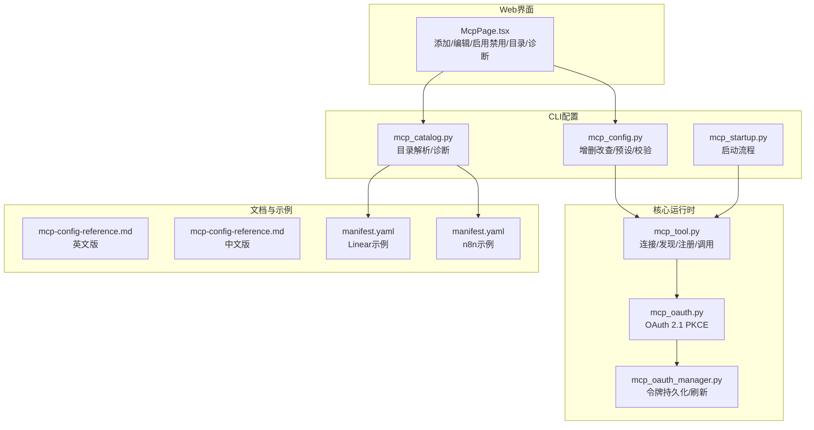
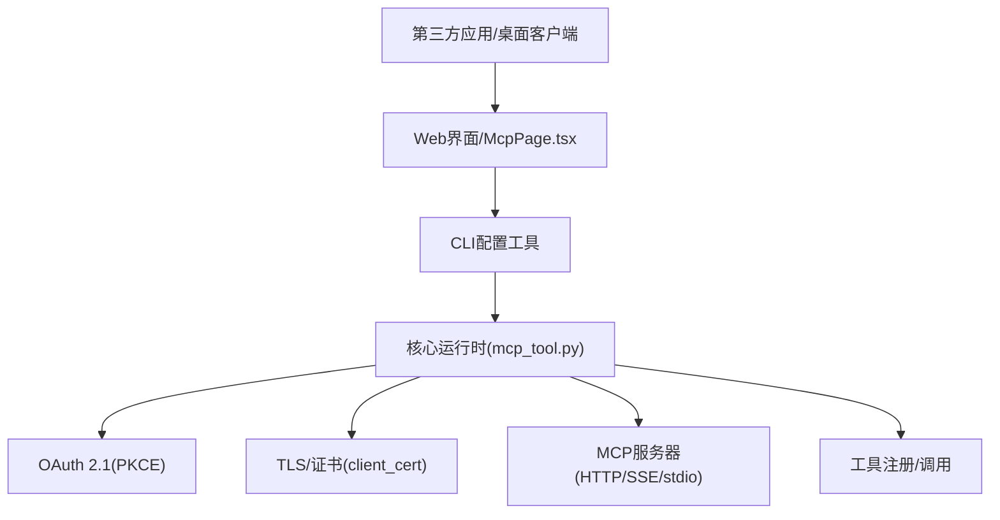
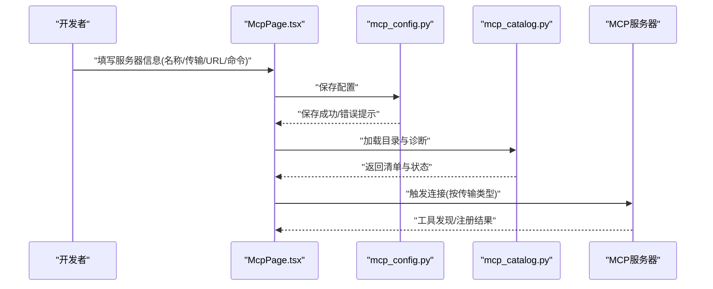
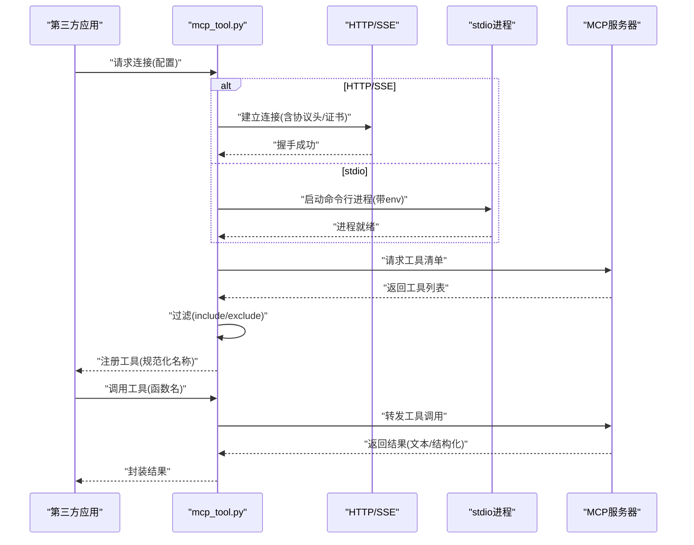
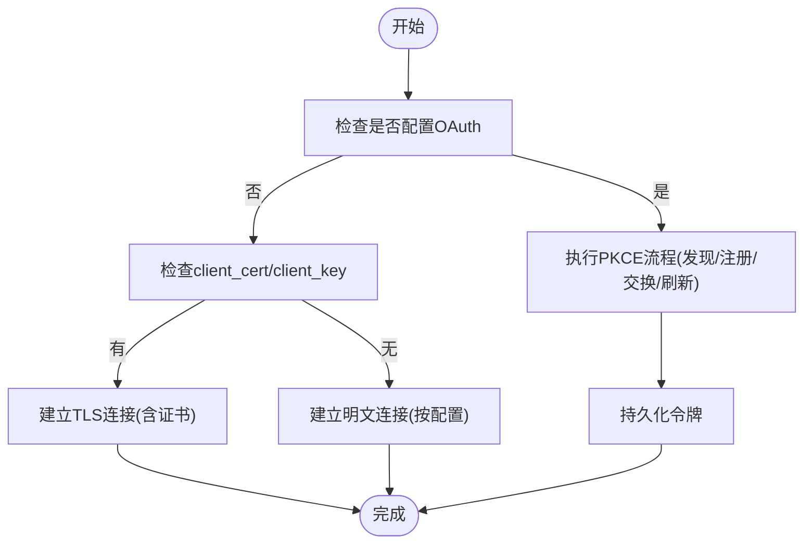
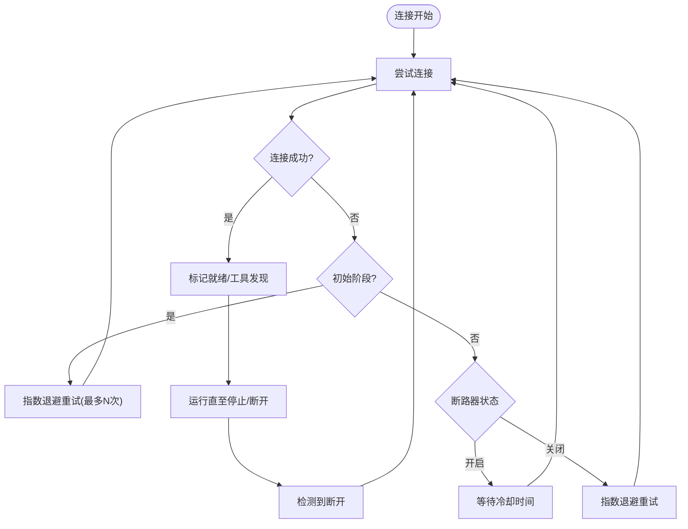
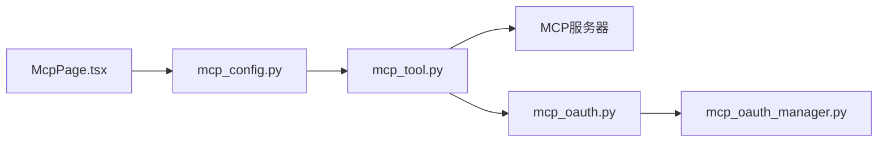

# MCP客户端集成

<cite>
**本文引用的文件**
- [McpPage.tsx](file://web/src/pages/McpPage.tsx)
- [mcp-config-reference.md](file://website/docs/reference/mcp-config-reference.md)
- [mcp-config-reference.md](file://website/i18n/zh-Hans/docusaurus-plugin-content-docs/current/reference/mcp-config-reference.md)
- [test_mcp_config.py](file://tests/hermes_cli/test_mcp_config.py)
- [test_mcp_catalog.py](file://tests/hermes_cli/test_mcp_catalog.py)
- [test_mcp_tool.py](file://tests/tools/test_mcp_tool.py)
- [test_mcp_client_cert.py](file://tests/tools/test_mcp_client_cert.py)
- [test_mcp_stability.py](file://tests/tools/test_mcp_stability.py)
- [test_mcp_circuit_breaker.py](file://tests/tools/test_mcp_circuit_breaker.py)
- [test_mcp_probe.py](file://tests/tools/test_mcp_probe.py)
- [test_dashboard_admin_endpoints.py](file://tests/hermes_cli/test_dashboard_admin_endpoints.py)
- [mcp_serve.py](file://mcp_serve.py)
- [mcp_startup.py](file://hermes_cli/mcp_startup.py)
- [mcp_config.py](file://hermes_cli/mcp_config.py)
- [mcp_catalog.py](file://hermes_cli/mcp_catalog.py)
- [mcp_tool.py](file://tools/mcp_tool.py)
- [mcp_oauth.py](file://tools/mcp_oauth.py)
- [mcp_oauth_manager.py](file://tools/mcp_oauth_manager.py)
- [manifest.yaml](file://optional-mcps/linear/manifest.yaml)
- [manifest.yaml](file://optional-mcps/n8n/manifest.yaml)
</cite>

## 目录
1. [简介](#简介)
2. [项目结构](#项目结构)
3. [核心组件](#核心组件)
4. [架构总览](#架构总览)
5. [详细组件分析](#详细组件分析)
6. [依赖关系分析](#依赖关系分析)
7. [性能考量](#性能考量)
8. [故障排查指南](#故障排查指南)
9. [结论](#结论)
10. [附录](#附录)

## 简介
本指南面向希望在第三方应用中集成Hermes MCP服务器的开发者，系统讲解客户端配置、连接建立与工具调用方法，覆盖HTTP/SSE与stdio两种传输方式，提供Claude Desktop、Cursor等主流MCP客户端的集成思路与配置要点。文档同时解释MCP协议消息格式、认证机制与安全注意事项，给出错误处理、重连策略与性能优化建议，并提供完整的集成测试与调试方法，帮助快速实现MCP客户端功能。

## 项目结构
围绕MCP客户端集成的关键模块分布于以下子系统：
- Web管理界面：提供MCP服务器添加、编辑、启用/禁用、目录浏览与诊断信息展示的UI入口
- CLI配置工具：负责MCP服务器配置的增删改查、预设填充、环境变量校验与配置保存
- 核心运行时：负责MCP服务器连接、工具发现、工具注册、OAuth认证、证书与TLS配置、重连与稳定性保障
- 文档与示例：官方配置参考文档与可选MCP示例清单（Linear、n8n）

**图表来源**
- [McpPage.tsx:62-392](file://web/src/pages/McpPage.tsx#L62-L392)
- [mcp_config.py](file://hermes_cli/mcp_config.py)
- [mcp_catalog.py](file://hermes_cli/mcp_catalog.py)
- [mcp_startup.py](file://hermes_cli/mcp_startup.py)
- [mcp_tool.py](file://tools/mcp_tool.py)
- [mcp_oauth.py](file://tools/mcp_oauth.py)
- [mcp_oauth_manager.py](file://tools/mcp_oauth_manager.py)
- [mcp-config-reference.md:202-261](file://website/docs/reference/mcp-config-reference.md#L202-L261)
- [mcp-config-reference.md:153-223](file://website/i18n/zh-Hans/docusaurus-plugin-content-docs/current/reference/mcp-config-reference.md#L153-L223)
- [manifest.yaml](file://optional-mcps/linear/manifest.yaml)
- [manifest.yaml](file://optional-mcps/n8n/manifest.yaml)

**章节来源**
- [McpPage.tsx:62-392](file://web/src/pages/McpPage.tsx#L62-L392)
- [mcp_config.py](file://hermes_cli/mcp_config.py)
- [mcp_catalog.py](file://hermes_cli/mcp_catalog.py)
- [mcp_startup.py](file://hermes_cli/mcp_startup.py)
- [mcp_tool.py](file://tools/mcp_tool.py)
- [mcp_oauth.py](file://tools/mcp_oauth.py)
- [mcp_oauth_manager.py](file://tools/mcp_oauth_manager.py)
- [mcp-config-reference.md:202-261](file://website/docs/reference/mcp-config-reference.md#L202-L261)
- [mcp-config-reference.md:153-223](file://website/i18n/zh-Hans/docusaurus-plugin-content-docs/current/reference/mcp-config-reference.md#L153-L223)
- [manifest.yaml](file://optional-mcps/linear/manifest.yaml)
- [manifest.yaml](file://optional-mcps/n8n/manifest.yaml)

## 核心组件
- Web管理界面（McpPage.tsx）
  - 支持添加新MCP服务器，选择HTTP/SSE或stdio传输
  - 提供服务器列表、目录与诊断信息展示
  - 解析命令行参数与环境变量输入
- CLI配置工具（mcp_config.py）
  - 增删改查MCP服务器配置
  - 预设填充与参数校验（如环境变量名合法性）
  - 保存配置并触发重载
- 目录与诊断（mcp_catalog.py）
  - 解析optional-mcps下的清单，提供安装状态与诊断信息
- 核心运行时（mcp_tool.py）
  - 连接管理：HTTP/SSE与stdio双栈
  - 工具发现与注册：支持include/exclude过滤
  - 协议头与版本控制：自动注入mcp-protocol-version
  - 证书与TLS：client_cert/client_key与自定义CA
  - OAuth 2.1 PKCE：首次授权、令牌持久化与刷新
  - 重连与稳定性：指数退避、最大重试次数、断路器
- OAuth辅助（mcp_oauth.py、mcp_oauth_manager.py）
  - 元数据发现、动态客户端注册、token交换与刷新
  - 令牌持久化到用户目录，跨会话复用

**章节来源**
- [McpPage.tsx:62-392](file://web/src/pages/McpPage.tsx#L62-L392)
- [mcp_config.py](file://hermes_cli/mcp_config.py)
- [mcp_catalog.py](file://hermes_cli/mcp_catalog.py)
- [mcp_tool.py](file://tools/mcp_tool.py)
- [mcp_oauth.py](file://tools/mcp_oauth.py)
- [mcp_oauth_manager.py](file://tools/mcp_oauth_manager.py)

## 架构总览
MCP客户端集成采用“UI/CLI配置 + 核心运行时”分层设计。UI负责交互与可视化，CLI负责配置持久化与目录管理，核心运行时负责实际的MCP连接、工具发现与调用。

**图表来源**
- [McpPage.tsx:62-392](file://web/src/pages/McpPage.tsx#L62-L392)
- [mcp_config.py](file://hermes_cli/mcp_config.py)
- [mcp_tool.py](file://tools/mcp_tool.py)
- [mcp_oauth.py](file://tools/mcp_oauth.py)
- [mcp_oauth_manager.py](file://tools/mcp_oauth_manager.py)

## 详细组件分析

### 组件A：MCP服务器配置与管理
- 功能要点
  - 添加/编辑服务器：名称、传输类型（http/stdio）、URL或命令+参数+环境变量
  - 预设填充：根据preset自动补全command/args
  - 环境变量校验：仅stdio传输支持env参数，且变量名必须合法
  - 启用/禁用切换：通过API更新enabled字段
  - 目录与诊断：列出可安装的MCP清单与诊断信息
- 关键路径
  - UI交互：McpPage.tsx负责表单渲染与提交
  - CLI写入：mcp_config.py负责保存配置
  - 目录解析：mcp_catalog.py解析optional-mcps清单
  - 管理端点：测试覆盖了重复名拒绝、缺少传输字段、启用/禁用切换等场景

**图表来源**
- [McpPage.tsx:366-392](file://web/src/pages/McpPage.tsx#L366-L392)
- [mcp_config.py](file://hermes_cli/mcp_config.py)
- [mcp_catalog.py](file://hermes_cli/mcp_catalog.py)

**章节来源**
- [McpPage.tsx:62-392](file://web/src/pages/McpPage.tsx#L62-L392)
- [test_mcp_config.py:302-368](file://tests/hermes_cli/test_mcp_config.py#L302-L368)
- [test_mcp_catalog.py:769-773](file://tests/hermes_cli/test_mcp_catalog.py#L769-L773)
- [test_dashboard_admin_endpoints.py:67-97](file://tests/hermes_cli/test_dashboard_admin_endpoints.py#L67-L97)

### 组件B：MCP连接与工具调用
- 连接建立
  - HTTP/SSE：支持新旧HTTP栈，自动注入mcp-protocol-version头部
  - stdio：通过命令行进程启动，支持环境变量传入
  - 证书与TLS：client_cert/client_key与自定义CA，支持PEM组合与分离密钥
- 工具发现与注册
  - 支持include/exclude过滤，工具名规范化（连字符/点号转下划线）
  - 若过滤后无可用工具，不创建空工具集
- 调用流程
  - 通过工具注册后的函数名调用对应MCP工具
  - 工具调用由核心运行时封装，统一错误处理与结构化内容

**图表来源**
- [mcp_tool.py](file://tools/mcp_tool.py)
- [test_mcp_tool.py:1537-1657](file://tests/tools/test_mcp_tool.py#L1537-L1657)
- [test_mcp_client_cert.py:40-331](file://tests/tools/test_mcp_client_cert.py#L40-L331)

**章节来源**
- [mcp_tool.py](file://tools/mcp_tool.py)
- [test_mcp_tool.py:1537-1657](file://tests/tools/test_mcp_tool.py#L1537-L1657)
- [test_mcp_client_cert.py:40-331](file://tests/tools/test_mcp_client_cert.py#L40-L331)

### 组件C：认证与安全
- OAuth 2.1 PKCE
  - 首次连接打开浏览器完成授权
  - 令牌持久化到用户目录，跨会话复用
  - 自动刷新，刷新失败才重新授权
  - 仅适用于HTTP/StreamableHTTP传输
- TLS与客户端证书
  - 支持client_cert与client_key，可为PEM组合或分离文件
  - 支持自定义CA bundle（ssl_verify）
  - 未设置时不传递cert参数，遵循SDK默认行为
- 配置参考
  - 英文与中文配置参考文档提供了完整示例与注意事项

**图表来源**
- [mcp_tool.py](file://tools/mcp_tool.py)
- [mcp_oauth.py](file://tools/mcp_oauth.py)
- [mcp_oauth_manager.py](file://tools/mcp_oauth_manager.py)
- [mcp-config-reference.md:275-292](file://website/docs/reference/mcp-config-reference.md#L275-L292)
- [mcp-config-reference.md:233-249](file://website/i18n/zh-Hans/docusaurus-plugin-content-docs/current/reference/mcp-config-reference.md#L233-L249)

**章节来源**
- [mcp_oauth.py](file://tools/mcp_oauth.py)
- [mcp_oauth_manager.py](file://tools/mcp_oauth_manager.py)
- [mcp-tool.py](file://tools/mcp_tool.py)
- [mcp-config-reference.md:275-292](file://website/docs/reference/mcp-config-reference.md#L275-L292)
- [mcp-config-reference.md:233-249](file://website/i18n/zh-Hans/docusaurus-plugin-content-docs/current/reference/mcp-config-reference.md#L233-L249)

### 组件D：错误处理、重连与稳定性
- 初始连接重试
  - 首次连接失败按指数退避重试，最多尝试固定次数
- 运行期断开重连
  - 断开后按退避策略重连，避免立即放弃
- 断路器保护
  - 连续错误达到阈值后进入冷却期，阻止频繁重试
- 稳定性测试
  - 包含DNS解析失败等场景的重试与最终成功的验证

**图表来源**
- [test_mcp_stability.py:452-484](file://tests/tools/test_mcp_stability.py#L452-L484)
- [test_mcp_circuit_breaker.py:68-104](file://tests/tools/test_mcp_circuit_breaker.py#L68-L104)
- [test_mcp_tool.py:1652-1657](file://tests/tools/test_mcp_tool.py#L1652-L1657)

**章节来源**
- [test_mcp_stability.py:452-484](file://tests/tools/test_mcp_stability.py#L452-L484)
- [test_mcp_circuit_breaker.py:68-104](file://tests/tools/test_mcp_circuit_breaker.py#L68-L104)
- [test_mcp_tool.py:1652-1657](file://tests/tools/test_mcp_tool.py#L1652-L1657)

## 依赖关系分析
- UI与CLI
  - UI通过表单收集配置，CLI负责保存与校验
- CLI与核心运行时
  - CLI保存配置后，核心运行时在启动时加载并建立连接
- 核心运行时与外部MCP服务器
  - 通过HTTP/SSE或stdio建立双向通信，工具调用由运行时封装
- OAuth与令牌管理
  - OAuth流程由mcp_oauth.py驱动，mcp_oauth_manager.py负责持久化与刷新

**图表来源**
- [McpPage.tsx:62-392](file://web/src/pages/McpPage.tsx#L62-L392)
- [mcp_config.py](file://hermes_cli/mcp_config.py)
- [mcp_tool.py](file://tools/mcp_tool.py)
- [mcp_oauth.py](file://tools/mcp_oauth.py)
- [mcp_oauth_manager.py](file://tools/mcp_oauth_manager.py)

**章节来源**
- [McpPage.tsx:62-392](file://web/src/pages/McpPage.tsx#L62-L392)
- [mcp_config.py](file://hermes_cli/mcp_config.py)
- [mcp_tool.py](file://tools/mcp_tool.py)
- [mcp_oauth.py](file://tools/mcp_oauth.py)
- [mcp_oauth_manager.py](file://tools/mcp_oauth_manager.py)

## 性能考量
- 连接与协议
  - HTTP/SSE传输建议使用新HTTP栈，自动注入协议头，减少握手成本
  - stdio传输适合本地二进制，注意进程启动与I/O开销
- 工具发现
  - 合理使用include/exclude过滤，避免不必要的工具注册
  - 工具名规范化为下划线形式，便于LLM函数调用
- 重连与退避
  - 初始连接与运行期断开均采用指数退避，降低瞬时网络抖动影响
  - 断路器在高错误率时保护系统，避免雪崩效应
- 证书与TLS
  - 仅在必要时启用client_cert/client_key，避免额外I/O与解密开销
  - 自定义CA bundle建议缓存与复用

[本节为通用指导，无需具体文件引用]

## 故障排查指南
- 常见问题与定位
  - 重复服务器名：添加接口返回冲突，检查名称唯一性
  - 缺少传输字段：HTTP/stdio必须明确指定其一
  - 环境变量名非法：仅stdio支持env，变量名需符合规范
  - 预设填充：preset会自动填充command/args，显式传输优先级更高
  - OAuth授权：首次连接会弹出浏览器，确认授权流程是否完成
  - 证书问题：client_cert/client_key路径需存在且可读
- 诊断与日志
  - 使用管理端点查看服务器列表与启用状态
  - 查看目录与诊断信息，确认MCP清单解析是否正常
- 测试用例参考
  - 配置与目录：覆盖重复名、缺失字段、预设填充、环境变量校验
  - 工具探测：验证服务器连接与工具枚举
  - 稳定性与断路器：验证重试、断开重连与冷却期行为

**章节来源**
- [test_dashboard_admin_endpoints.py:67-97](file://tests/hermes_cli/test_dashboard_admin_endpoints.py#L67-L97)
- [test_mcp_config.py:302-368](file://tests/hermes_cli/test_mcp_config.py#L302-L368)
- [test_mcp_catalog.py:769-773](file://tests/hermes_cli/test_mcp_catalog.py#L769-L773)
- [test_mcp_probe.py:187-219](file://tests/tools/test_mcp_probe.py#L187-L219)
- [test_mcp_stability.py:452-484](file://tests/tools/test_mcp_stability.py#L452-L484)
- [test_mcp_circuit_breaker.py:68-104](file://tests/tools/test_mcp_circuit_breaker.py#L68-L104)

## 结论
通过UI/CLI与核心运行时的协同，Hermes提供了完善的MCP客户端集成能力。开发者可依据本文档完成第三方应用的MCP集成：从配置与连接建立，到工具发现与调用，再到认证与安全、错误处理与重连策略。配合官方配置参考与测试用例，可快速落地并稳定运行。

[本节为总结，无需具体文件引用]

## 附录

### A. 主流MCP客户端集成要点
- Claude Desktop
  - 使用HTTP/SSE传输，配置URL与可选headers
  - 如需OAuth，设置auth: oauth并允许首次授权弹窗
  - 可选client_cert/client_key与ssl_verify
- Cursor
  - 通过stdio传输对接本地MCP服务器
  - 在配置中提供command与args，并按需设置env
  - 使用include/exclude精确控制工具集合

[本节为概念性说明，无需具体文件引用]

### B. MCP协议消息格式与版本
- 协议头
  - 自动注入mcp-protocol-version，支持大小写兼容
- 请求/响应
  - 工具调用请求与响应遵循MCP标准消息模型
  - 结果可能包含文本块与结构化内容

**章节来源**
- [test_mcp_tool.py:1537-1561](file://tests/tools/test_mcp_tool.py#L1537-L1561)

### C. 完整集成测试与调试步骤
- 步骤清单
  - 在Web界面添加服务器（HTTP或stdio）
  - 保存配置并触发重载
  - 观察目录与诊断信息
  - 执行工具探测，确认工具注册
  - 进行工具调用，验证返回内容
  - 模拟网络异常与断开，验证重连与断路器行为
- 关键测试用例
  - 配置校验与保存
  - 目录解析与诊断
  - 工具探测与过滤
  - 稳定性与断路器
  - OAuth授权与令牌持久化

**章节来源**
- [test_mcp_config.py:302-368](file://tests/hermes_cli/test_mcp_config.py#L302-L368)
- [test_mcp_catalog.py:769-773](file://tests/hermes_cli/test_mcp_catalog.py#L769-L773)
- [test_mcp_probe.py:187-219](file://tests/tools/test_mcp_probe.py#L187-L219)
- [test_mcp_stability.py:452-484](file://tests/tools/test_mcp_stability.py#L452-L484)
- [test_mcp_circuit_breaker.py:68-104](file://tests/tools/test_mcp_circuit_breaker.py#L68-L104)

### D. 可选MCP示例清单
- Linear
  - 清单文件提供示例与安装信息
- n8n
  - 清单文件提供示例与安装信息

**章节来源**
- [manifest.yaml](file://optional-mcps/linear/manifest.yaml)
- [manifest.yaml](file://optional-mcps/n8n/manifest.yaml)