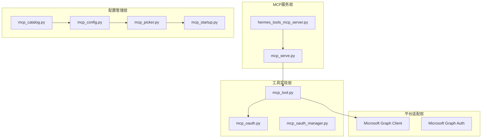
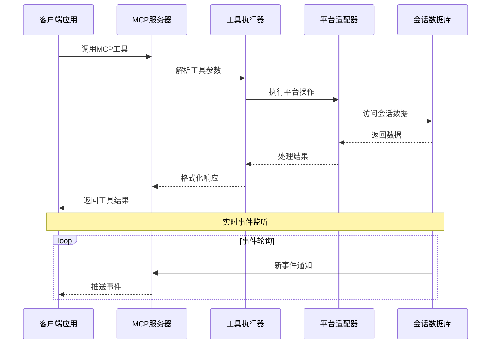
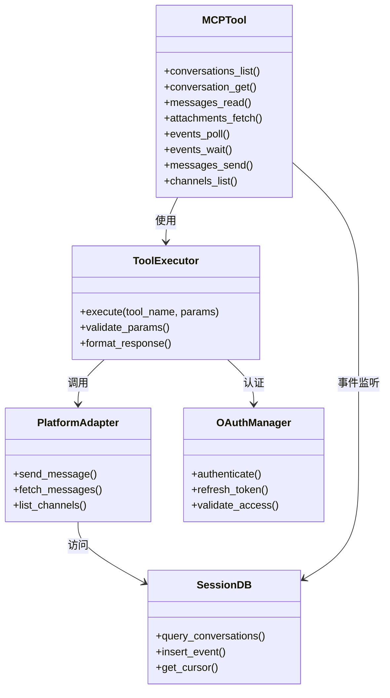
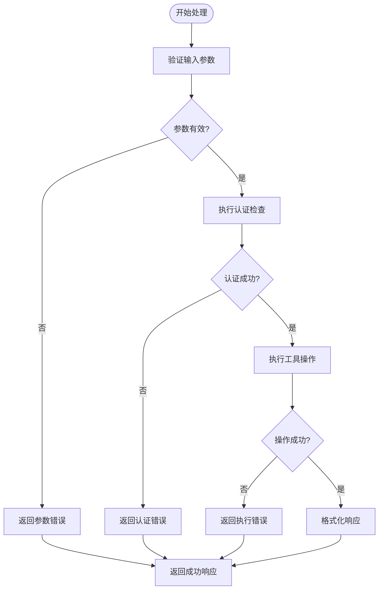

# MCP工具参考

<cite>
**本文档引用的文件**
- [mcp_serve.py](file://mcp_serve.py)
- [mcp_tool.py](file://tools/mcp_tool.py)
- [hermes_tools_mcp_server.py](file://agent/transports/hermes_tools_mcp_server.py)
- [mcp_catalog.py](file://hermes_cli/mcp_catalog.py)
- [mcp_config.py](file://hermes_cli/mcp_config.py)
- [mcp_picker.py](file://hermes_cli/mcp_picker.py)
- [mcp_startup.py](file://hermes_cli/mcp_startup.py)
- [mcp_oauth.py](file://tools/mcp_oauth.py)
- [mcp_oauth_manager.py](file://tools/mcp_oauth_manager.py)
- [mcp_tool.py](file://tools/mcp_tool.py)
- [microsoft_graph_client.py](file://tools/microsoft_graph_client.py)
- [microsoft_graph_auth.py](file://tools/microsoft_graph_auth.py)
- [mcp.md](file://website/docs/user-guide/features/mcp.md)
</cite>

## 目录
1. [简介](#简介)
2. [项目结构](#项目结构)
3. [核心组件](#核心组件)
4. [架构概览](#架构概览)
5. [详细组件分析](#详细组件分析)
6. [依赖关系分析](#依赖关系分析)
7. [性能考虑](#性能考虑)
8. [故障排除指南](#故障排除指南)
9. [结论](#结论)

## 简介

Hermes Agent的MCP（Model Context Protocol）工具集为开发者提供了与消息平台进行交互的强大接口。该工具集包含了10个核心工具，涵盖了对话管理、消息读取、附件处理、事件监听、消息发送和通道列表等功能。

MCP工具集的主要目标是：
- 提供统一的消息平台抽象层
- 支持实时事件监听和处理
- 实现跨平台的消息传递
- 提供安全的权限管理和认证机制

## 项目结构

MCP工具集在项目中的组织结构如下：



**图表来源**
- [mcp_serve.py:1-100](file://mcp_serve.py#L1-L100)
- [hermes_tools_mcp_server.py:1-100](file://agent/transports/hermes_tools_mcp_server.py#L1-L100)
- [mcp_tool.py:1-100](file://tools/mcp_tool.py#L1-L100)

**章节来源**
- [mcp_serve.py:1-100](file://mcp_serve.py#L1-L100)
- [hermes_tools_mcp_server.py:1-100](file://agent/transports/hermes_tools_mcp_server.py#L1-L100)

## 核心组件

MCP工具集包含以下10个核心工具：

### 工具总览

| 工具名称 | 类型 | 描述 |
|---------|------|------|
| conversations_list | 查询工具 | 列出活跃的聊天会话，支持按平台过滤或按名称搜索 |
| conversation_get | 查询工具 | 根据会话键获取单个对话的详细信息 |
| messages_read | 查询工具 | 读取特定对话的最近消息历史 |
| attachments_fetch | 查询工具 | 从特定消息中提取非文本附件（图片、媒体） |
| events_poll | 事件工具 | 从光标位置开始轮询新的对话事件 |
| events_wait | 事件工具 | 长轮询/阻塞直到下一个事件到达（近实时） |
| messages_send | 操作工具 | 通过平台发送消息（如 `telegram:123456`, `discord:#general`） |
| channels_list | 查询工具 | 列出所有平台上的可用消息目标 |

### 事件系统

MCP服务器包含一个实时事件桥接器，用于轮询Hermes的会话数据库以获取新消息。这为MCP客户端提供了接近实时的传入对话感知能力。

事件类型：
- `message` - 新消息事件
- `approval_requested` - 权限请求事件  
- `approval_resolved` - 权限解决事件

**章节来源**
- [mcp.md:689-727](file://website/docs/user-guide/features/mcp.md#L689-L727)

## 架构概览

MCP工具集采用分层架构设计，确保了良好的模块化和可扩展性：



**图表来源**
- [mcp_serve.py:471-769](file://mcp_serve.py#L471-L769)
- [hermes_tools_mcp_server.py:1-200](file://agent/transports/hermes_tools_mcp_server.py#L1-L200)

## 详细组件分析

### conversations_list 工具

#### 功能描述
列出活跃的聊天会话，支持按平台过滤或按名称搜索。

#### 参数说明
- `platform` (可选): 平台名称（如 telegram, discord）
- `name_filter` (可选): 会话名称过滤器

#### 返回值格式
JSON格式的会话列表，包含会话ID、平台、名称、最后消息时间等信息。

#### 使用示例
```bash
# 列出所有活跃会话
conversations_list()

# 按平台过滤
conversations_list(platform="telegram")

# 按名称搜索
conversations_list(name_filter="团队")
```

**章节来源**
- [mcp_serve.py:471-527](file://mcp_serve.py#L471-L527)

### conversation_get 工具

#### 功能描述
根据会话键获取单个对话的详细信息。

#### 参数说明
- `session_key` (必需): 会话唯一标识符

#### 返回值格式
JSON格式的会话详情，包含会话元数据、参与者信息、平台连接状态等。

#### 使用示例
```bash
conversation_get(session_key="telegram:123456")
```

**章节来源**
- [mcp_serve.py:528-560](file://mcp_serve.py#L528-L560)

### messages_read 工具

#### 功能描述
读取特定对话的最近消息历史。

#### 参数说明
- `session_key` (必需): 会话唯一标识符
- `limit` (可选): 返回消息数量限制，默认100
- `offset` (可选): 偏移量，默认0

#### 返回值格式
JSON格式的消息列表，包含消息ID、发送者、内容、时间戳、附件信息等。

#### 使用示例
```bash
# 获取最近50条消息
messages_read(session_key="discord:#general", limit=50)

# 分页获取消息
messages_read(session_key="telegram:123456", limit=100, offset=100)
```

**章节来源**
- [mcp_serve.py:561-617](file://mcp_serve.py#L561-L617)

### attachments_fetch 工具

#### 功能描述
从特定消息中提取非文本附件（图片、媒体）。

#### 参数说明
- `message_id` (必需): 消息唯一标识符
- `attachment_index` (可选): 附件索引，默认0

#### 返回值格式
二进制数据或下载链接，包含附件的原始内容和元数据。

#### 使用示例
```bash
# 获取消息的第一个附件
attachments_fetch(message_id="msg_123456")

# 获取指定索引的附件
attachments_fetch(message_id="msg_123456", attachment_index=1)
```

**章节来源**
- [mcp_serve.py:618-669](file://mcp_serve.py#L618-L669)

### events_poll 工具

#### 功能描述
从光标位置开始轮询新的对话事件。

#### 参数说明
- `after_cursor` (必需): 光标位置，用于确定从何处开始轮询
- `timeout_ms` (可选): 超时时间（毫秒），默认0

#### 返回值格式
JSON格式的事件列表，包含事件类型、时间戳、相关数据等。

#### 使用示例
```bash
# 从开始位置轮询
events_poll(after_cursor=0)

# 从特定光标位置轮询
events_poll(after_cursor=42, timeout_ms=30000)
```

**章节来源**
- [mcp_serve.py:670-698](file://mcp_serve.py#L670-L698)

### events_wait 工具

#### 功能描述
长轮询/阻塞直到下一个事件到达（近实时）。

#### 参数说明
- `after_cursor` (必需): 当前光标位置
- `timeout_ms` (可选): 超时时间（毫秒），默认30000

#### 返回值格式
JSON格式的事件数据，包含事件类型和相关元数据。

#### 使用示例
```bash
# 等待下一个事件
events_wait(after_cursor=42, timeout_ms=30000)
```

**章节来源**
- [mcp_serve.py:699-732](file://mcp_serve.py#L699-L732)

### messages_send 工具

#### 功能描述
通过平台发送消息（如 `telegram:123456`, `discord:#general`）。

#### 参数说明
- `recipient` (必需): 接收者标识符，格式为 `平台:目标`
- `content` (必需): 消息内容
- `attachments` (可选): 附件列表

#### 返回值格式
JSON格式的发送结果，包含消息ID、发送状态、时间戳等。

#### 使用示例
```bash
# 发送文本消息
messages_send(recipient="telegram:123456", content="Hello!")

# 发送带附件的消息
messages_send(
    recipient="discord:#general",
    content="Check out this image",
    attachments=["image.jpg"]
)
```

**章节来源**
- [mcp_serve.py:733-768](file://mcp_serve.py#L733-L768)

### channels_list 工具

#### 功能描述
列出所有平台上的可用消息目标。

#### 参数说明
- `platform` (可选): 平台名称，如果指定则只返回该平台的频道

#### 返回值格式
JSON格式的频道列表，包含频道ID、名称、类型、权限等信息。

#### 使用示例
```bash
# 列出所有平台的所有频道
channels_list()

# 只列出Telegram频道
channels_list(platform="telegram")
```

**章节来源**
- [mcp_serve.py:769-800](file://mcp_serve.py#L769-L800)

## 依赖关系分析

MCP工具集的依赖关系图展示了各组件之间的交互模式：



**图表来源**
- [mcp_serve.py:471-800](file://mcp_serve.py#L471-L800)
- [mcp_tool.py:1-200](file://tools/mcp_tool.py#L1-L200)
- [mcp_oauth_manager.py:1-150](file://tools/mcp_oauth_manager.py#L1-L150)

### 组件耦合度分析

MCP工具集采用了松耦合的设计原则：

1. **工具与平台分离**：每个工具只关心业务逻辑，不直接依赖具体平台实现
2. **适配器模式**：通过平台适配器处理不同平台的差异
3. **认证独立**：OAuth管理器独立于工具执行器
4. **数据库抽象**：会话数据库通过统一接口访问

**章节来源**
- [mcp_serve.py:471-800](file://mcp_serve.py#L471-L800)
- [mcp_tool.py:1-300](file://tools/mcp_tool.py#L1-L300)

## 性能考虑

### 缓存策略

MCP工具集实现了多层缓存机制：

1. **会话缓存**：活跃会话信息缓存在内存中
2. **事件缓存**：最近事件存储在内存队列中
3. **平台配置缓存**：平台连接配置缓存

### 连接池管理

- 平台连接使用连接池管理
- 自动重连机制防止连接中断
- 连接超时和重试策略

### 内存优化

- 事件队列大小限制
- 消息历史分页加载
- 附件流式处理

## 故障排除指南

### 常见错误类型

#### 认证错误
- **401 未授权**：检查OAuth令牌有效性
- **403 禁止访问**：验证平台权限设置
- **令牌过期**：使用刷新令牌重新认证

#### 参数验证错误
- **必填参数缺失**：确认所有必需参数都已提供
- **参数格式错误**：检查参数类型和格式
- **范围限制**：验证数值参数在有效范围内

#### 平台连接错误
- **网络超时**：检查网络连接和防火墙设置
- **平台限制**：遵守平台API速率限制
- **会话无效**：重新建立平台连接

### 错误处理流程



**图表来源**
- [mcp_tool.py:1-200](file://tools/mcp_tool.py#L1-L200)
- [mcp_oauth_manager.py:1-200](file://tools/mcp_oauth_manager.py#L1-L200)

### 调试建议

1. **启用详细日志**：使用 `--verbose` 参数启动MCP服务器
2. **检查平台配置**：验证平台连接参数和权限设置
3. **监控API限制**：注意平台API的速率限制和配额
4. **测试网络连接**：确保能够访问所需的平台API

**章节来源**
- [mcp_tool.py:1-300](file://tools/mcp_tool.py#L1-L300)
- [mcp_oauth_manager.py:1-200](file://tools/mcp_oauth_manager.py#L1-L200)

## 结论

Hermes Agent的MCP工具集提供了一个强大而灵活的消息平台抽象层，支持多种消息平台的统一访问。通过清晰的工具分类、完善的错误处理机制和高效的性能优化，该工具集能够满足各种消息自动化场景的需求。

关键优势包括：
- **统一接口**：所有平台通过相同的工具接口访问
- **实时能力**：支持事件驱动的消息处理
- **安全可靠**：完整的认证和权限管理
- **易于扩展**：模块化的架构设计便于添加新平台

开发者可以基于此工具集构建各种消息自动化应用，从简单的消息转发到复杂的工作流编排。